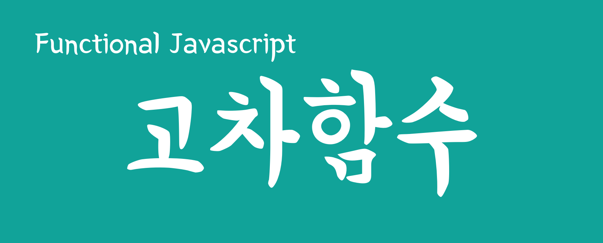

함수형 프로그래밍을 설명하기에 앞서 프로그래밍에서는 일급 객체(First-class citizens)라는 개념이 있다. 일급 객체는 다음 아래와 같은 특성을 가지고 있다. (참고: [일급 객체 - 위키백과, 우리 모두의 백과사전](https://ko.wikipedia.org/wiki/%EC%9D%BC%EA%B8%89_%EA%B0%9D%EC%B2%B4))

> - 변수 혹은 데이터 구조에 담을 수 있다
> - 파라매터로 전달할 수 있다.
> - 반환값으로 사용할 수 있다.

자바스크립트에서는 숫자와 문자 그리고 함수까지도 일급 객체이다. 숫자와 함수를 비교해 볼까?

숫자를 변수에 저장하듯이 함수도 변수에 저장할 수 있다.

```js
let one = 1
let two = () => 2
```

숫자를 배열에 저장하듯이 함수도 배열에 저장할 수 있다.

```js
let arr = [1, () => 2]
```

숫자를 함수에 전달하듯이 함수를 함수에 전달할 수 있다.

```js
const fun(n, f) => n + f();
fun(1, () => 2);
```

함수가 숫자를 반환할 수 있듯이 함수가 함수를 반환한다.

```js
;() => 1
;() => () => 1
```

일급 객체의 특징 중 (1) 함수에 함수를 전달하고 (2) 함수가 함수를 반환하는 특징은 고차 함수를 만들수 있는 방법을 제공한다. 고차 함수(High-order function)는 함수를 받아서 함수를 반환하는 것을 말하는데, 다른 함수를 이용해서 완전히 새로운 함수를 **조립** 하는 방법으로 프로그램을 만들 수 있다.

이 글에서는 스터디 첫 번째 시간의 리뷰로써 고차함수에 대해 먼저 알아보겠다.

## 함수를 파라매터로 받는 함수

### repeat()

repeat() 이라는 함수를 만들어 볼 생각이다. 이 함수는 파라매터로 전달 받은 times 횟수만큼 반복해서 value를 배열에 담아 반환한다.

```js
function repeat(times, value) {
  return [...Array(times).keys()].map(i => value)
}

repeat(3, "foo") // ['foo', 'foo', 'foo']
```

Array(times) 는 배열 생성자 함수로써 길이가 times인 배열을 만든다. 배열 프로토타입 메쏘드 keys() 는 배열의 인덱스를 키로 갖는 이터레이터를 반환한다. 이터레이터는 배열 리터럴 안에서 펼침 연산자 `...` 와 함께 사용하면 `[0, 1, 2, ... , times-1]` 의 값을 가지는 새로운 배열은 만든다. 즉 `[...array(3).keys()]` 은 `[0,1,2]` 값을 갖는 배열을 반환한다.

이렇게 생성된 배열의 map() 함수는 배열의 길이만큼 어떤 동작을 반복하는데, repeat 함수의 두 번째 전달인자 value로 채워진 새로운 배열을 생성한다. 그 결과 `repeat(3, 'foo')`는 'foo'가 세 번 반복된 배열을 반환한다.

repeat()은 숫자 time과 문자열 value만 파라매터로 받는 함수다. 아직 고차함수는 아니다.

### repeatedly()

두 번째 전달인자를 바꿔 보겠다. repeat() 함수에서는 고정된 하나의 값 value 만을 반환하는 함수였다. 이번에는 어떤 **행동**을 반복하도록 fun이라는 함수를 파라매터로 받게끔 변경했다.

```js
function repeatedly(times, fun) {
  return [...Array(times).keys()].map(fun)
}
```

map() 함수에서 value값을 리턴하는 대신 파라매터로 넘긴 함수 fun을 map()함수 파라매터로 전달했다. 이것은 새로운 배열을 생성하는 map 함수의 동작을 repeatedly() 함수 본체가 아닌, repeatedly 호출부로 위임한 것이라고 볼 수 있다.

```js
repeatedly(3, () => "foo") // ['foo', 'foo', 'foo']
repeatedly(3, i => `foo${i}`) // ['foo0', 'foo1', 'foo2']
```

repeatedly()를 호출하는 코드를 보면 이해할수 있는데 `() => 'foo'` 함수를 만들어 두번째 파라매터로 넘겨줬다. 이것은 고정된 문자열 'foo'를 반환하는 행동을 하는 함수이므로 `repeat(3, 'foo')`과 동일한 결과를 얻을 수 있다.

함수를 파라매터로 넘기는 것의 장점은 두번째 호출 방법을 보면 알 수 있다. `(i) => foo${i}` 함수를 넘기는 것에 주목하자. 이 함수는 repeatedly() 본문의 map() 함수 파라매터로 들어가는 녀석이다. map() 함수 정의에 따라 인덱스 파라매터를 받는 함수(`(i)=> /*...*/`)를 전달하게 되어 있다. 우리는 호출부에서 i 파라매터를 받는 함수로 맞춰서 정의했다. 이 함수는 문자열 'foo'에 인덱스 꼬리표를 추가한 문자열을 반환한다. 따라서 맵 함수에서 반복될 때마다 'foo1', 'foo2', 'foo3'의 다른 문자열이 반환된다.

고정된 값 value를 넘겨서 같은 문자열이 반복되는 배열을 반환하는 repeat()과 달리, repeatedly()는 map() 함수의 행동을 결정짓는 함수 fun을 인자로 넘겨 map() 함수 반복마다 다른 문자열로 구성된 배열을 반환받는 행동을 한다. 이렇게 함수를 파라매터로 넣으면 **반복성**이라는 일반성을 가지도록 repeat 함수를 개선할 수 있다.

### repeatUntil()

반복 횟수를 정하는 times 도 함수로 정의할 수 있다. fun 함수를 반복하면서 값을 만들어 내는데 고정된 횟수만큼 반복하는 것이 아니라, 특정 기준에 맞을 때까지 반복하도록 변경하고 싶다. 특정기준을 확인할 수 있는 check함수를 전달해 준다면 가능할 것 같다.

```js
function repeatUntil(fun, check, seed) {
  let ret = [],
    result = fun(seed)

  while (check(result)) {
    ret.push(result)
    result = fun(result)
  }

  return ret
}

repeatUntil(
  n => n + n,
  n => n <= 1024,
  1
)
// [ 2, 4, 8, 16, 32, 64, 128, 256, 512, 1024 ]
```

repeateUntil 함수는 이름에서도 유추할 수 있듯이 fun 함수를 반복할 것인데 check 함수를 만족할 때까지 반복하는 함수다. 세번째 seed는 반복 작업의 초기값이다.

반복마다 결과를 저장할 배열 ret를 만들고 seed값을 fun 함수에서 처리하고 result 변수에 임시로 담았다. 그 뒤 check() 함수로 결과를 확인한다. check()를 만족하지 못할때 까지 ret 배열에 추가한다.

함수를 사용한 부분을 보면 파라매터로 넣은 값을 두 배하는 행동을 하고, 그 결과가 1024 이하일 때까지 계속 반복하도록 했다. 초기값 1을 넣었기 때문에 2, 4, 8, ... 1024까지 반복하여 값을 만들어 냈다.

자 이제 처음의 repeat 함수와 비교해 보자. repeat는 단순히 반복횟수와 리턴값을 파라매터로 받아 그 값을 배열로 리턴하는 함수였다. 이에 비해 repeatedly 함수는 어떤가? 반복 횟수를 **'어떤 기준에 맞는가?'** 라는 행동으로 변경했다. 결과값도 **'이렇게 저렇게 만들어라'**라는 행동으로 추상화 했다. 고정된 값을 그 값을 만들어내는 행동으로 한 단계 추상화하여 만들어 낸 것이다.

## 함수를 반환하는 함수

### k()

이번엔 함수를 반환하는 고차함수에 대해 알아볼 차례다. repeatedly() 함수는 두번째 파라매터로 함수를 전달하여 반복 행동을 함수로 정의했다. `() => 'foo'`는 고정된 문자열 'foo'를 반복하라는 뜻이다. 이 고정된 문자열을 반환하는 함수를 반환하는 **함수**를 생각할수 있겠는가? 나는 repeatedly()의 두번째 파라매터를 만들수 있는 함수를 원하는 것이다. 이 함수를 상수를 의미하는 k() 함수라고 하겠다.

```js
function k(value) {
  return () => value
}

repleatedly(3, () => "foo")
repeatedly(3, k("foo")) // ['foo', 'foo', 'foo']
repeatedly(3, k("bar")) // ['bar', 'bar', 'bar']
```

k() 함수는 파라매터 value를 반환하는 함수를 반환하다. k() 함수가 호출되면 파라매터 value는 클로저에 의해 캡쳐된다. k(3)에 의해 함수가 반환되면 value 3은 호출 후에도 메모리에서 제거되지 않고 클로져로 남아있다. 그래서 다음번 함수 호출에서도 value 3을 사용할 수 있는 것이다.

### kCount()

함수를 반환하는 고차함수는 클로져 변수를 이용해 기능을 추가할 수 있다. 상수를 반환하는 k() 함수에 카운터를 달아보자. k() 함수가 호출되는 횟수를 기록하여 반환값에 꼬리표로 달아보겠다.

```js
function kCount(value) {
  let count = 0
  return () => `${value}${count++}`
}

repeatedly(3, kCount("foo")) // ['foo0', 'foo1', 'foo2']
repeatedly(3, kCount("bar")) // ['bar0', 'bar1', 'bar2']
```

kCount('foo')가 실행되면 value 변수에는 'foo', count 변수에는 0이 설정된다. 그리고 value와 count를 합한 문자열을 반환하는 함수를 반환한다. 이것은 repeatedly() 함수의 두번째 파라매터로 전달되어 map() 함수의 반복시마다 호출되는데 여기서는 times 값인 3회 반복된다. 매 반복시마다 count 값을 참조하게 되는데 이값은 클로져에 의해 캡쳐된 값으로 이전값을 1씩 추가할 수 있다.

### fnull()

배열의 reduce() 함수는 연산값 누적을 위해 사용되는데 여기서는 각 숫자를 곱할 목적으로 이용하겠다. mult 함수는 리듀스에 전달될 함수로서 누적값 total과 배열 요소 n을 파라매터로 받는다. 그리고 이 둘을 곱한 값을 반환한다.

```js
const mult = (total, n) => total * n
;[1, 2, 3, null, 5].reduce(mult) // 0
```

만약 배열에 null이 섞이면 어떻게 될까? 숫자 \* null는 0를 반환한다. 그 결과 reduce() 함수는 0을 반환하는데 이것은 내가 의도한 결과가 아니다.

배열에 전부 숫자이면 좋겠지만 상황은 그렇지 않다. 따라서 배열에 숫자가 아닌값이 들어오면 기본값 1을 사용하도록 설정하고 싶다. 그래서 만든것이 fnull() 함수다

```js
function fnull(fun, ...defaults) {
  return (...args) => {
    args = args.map((e, i) => e || defaults[i])
    return fun.apply(null, args)
  }
}
```

드디어 우리는 함수를 받아서 또 다른 함수를 반환하는 고차함수를 만들게 되었다. fnull은 리듀스 함수의 파라매터로 사용하는 fun 함수를 전달 받는다. 그리고 args 값을 받는 함수를 반환하는 함수다.

fnull의 행동을 자세히 살펴보자. fun은 리듀스 함수에 전달할 인자이고, defaults는 배열 요소 값이 기대에 어긋날 경우 사용할 기본값이다. 나머지 파라매터로 선언했기 때문에 인자는 배열로 들어갈 것이다.

그리고나서 args 파라매터를 받는 함수를 반환한다. 이 함수가 리듀스 함수에 넣을 파라매터 함수다. 따라서 args[0]은 누적값 total이 되고 args[1]은 배열요소 n이 되는 셈이다. map 함수로 args 값을 점검하는데 값이 null일 경우(0, false, undefined, NaN일 경우도 마찬가지) 기본값인 defaults[i]를 사용한다(defaults는 fnull의 두 번째 파라매터). 리듀스 함수 내에서 사용할 모든 값을 점검한 후 곱셈 연산인 fun 함수에 파라매터 args를 넘겨 실행한 결과를 반환한다.

fnull은 좀 복잡하다고 생각할 수 있는데, 세 번만 반복해서 읽어보자.

자 그럼 fnull은 어떻게 사용할까? 첫번째 파라매터로 리듀스 함수에서 사용할 함수를 전달하고 나머지는 기본값을 전달했다. 두번째 1은 누적값에 대한 기본값이고 세번째 1은 배열요소에 대한 기본값이다. 그래서 만든 것이 safeMult 함수다. 이것은 곱셈 연산에 falsy한 값이 있으면 기본값 1을 사용하여 곱셈을 하는 함수다. 변수명도 마찬가지지만 고차함수가 반환하는 함수명도 의미있는 이름으로 잘 지어야 할 것 같다.

```js
const safeMult = fnull((total, n) => total * n, 1, 1)
;[1, 2, 3, undefined, 5].reduce(safeMult) // 30
```

그리고 나서 null이 포함된 배열의 reduce 메소드에 safeMult를 넘기면 null 값이 1로 변환되어 안전한 곱셈 연산을 할 수 있다.

## 결론

자바스크립트에서 함수는 일급 객체로 취급한다. 숫자, 문자열 등과 마찬가지로 함수를 전달하거나 반환할수 있는것이 자바스크립트 함수의 특징이다. 이러한 특징은 고차함수를 만들수 있는 방법을 제공한다.

고차함수를 이용하면 고정된 값이 아닌, 그 값을 만드는 행동 자체를 파라매터로 받는 함수를 만들수 있다. repeatedly는 반복시마다 값을 생성하는 방법을 함수로 받았고, repeatUntil은 반복을 언제까지 할것인지에 대한 판단 로직을 파라매터로 받은 고차함수이다.

한편 함수를 반환하는 고차함수는 고정 값이 아닌 행동을 반환하도록 하는데 이것은 또다시 다른 고차함수의 인자로 사용된다. k()는 고정된 값을 반환하는 함수를 반환하는 함수이고 이것은 repeatedly() 함수에 인자로 전달 된다. 클로져를 이용하면 고차함수가 반환하는 함수를 더욱 우아하게 만들수 있는데 kCount()는 매 실행시마다 카운트를 증가할수 있는 기능을 하는 녀석이다.

함수를 인자로 전달 받고 그 함수 로직에 끼여들어 추가 행동을 할 수 있는데 fnull이 그런 함수였다. reduce 함수의 인자로 들어갈 함수를 받아서 그 함수가 소비하는 값이 null인지 여부를 체크하고 클로져로 캡쳐해둔 기본값으로 대체하는 로직을 추가했다. 그리고 그 함수를 reduce에 들어갈 함수로 만들어 반환했다.

> 다음글: [(함수형JS) 함수로 함수 만들기1 다형성](/js/2017/04/10/function-by-function.html)
