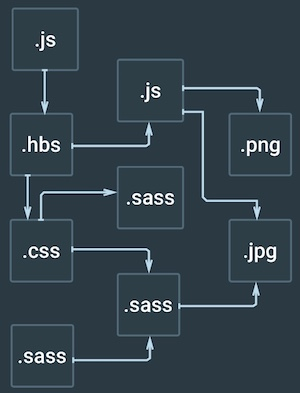
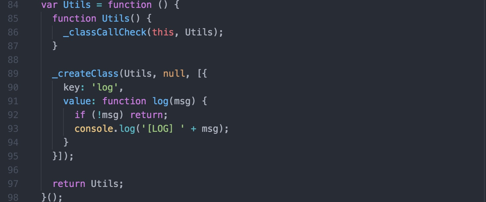
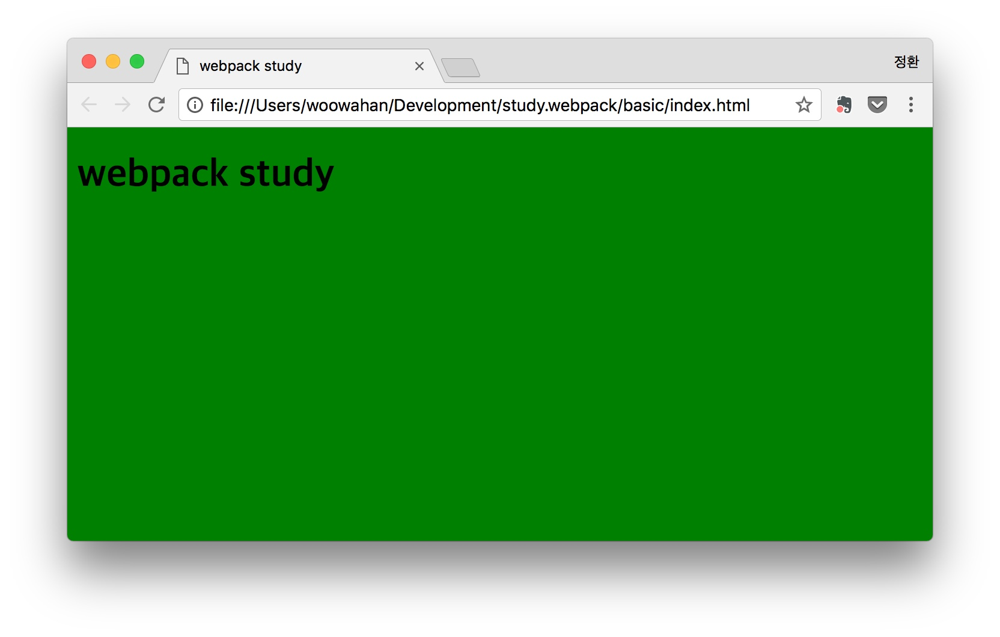

자바스크립트 코드가 많아지면 하나의 파일로 관리하는데 한계가 있다. 그렇다고 여러개 파일을 브라우져에서 로딩하는 것은 그만큼 네트웍 비용을 치뤄야하는 단점이 있다. 뿐만 아니라 각 파일은 서로의 스코프를 침범하지 않아야 하는데 잘못 작성할 경우 변수 충돌의 위험성도 있다.

함수 스코프를 사용하는 자바스크립트는 즉시호출함수(IIFE)를 사용해 모듈을 만들 수 있다. CommonJS나 AMD 스타일의 모듈 시스템을 사용하면 파일별로 모듈을 관리할 수도 있다.

그러나 여전히 브라우져에서는 파일 단위 모듈 시스템을 사용하는 것은 쉽지 않은 일이다. 모듈을 IIFE 스타일로 변경해 주는 과정 뿐만 아니라 하나의 파일로 묶어(bundled) 네트웍 비용을 최소화 할수 있는 방법이 웹 프로트엔드 개발 과정에는 필요하다.

웹팩은 이러한 배경에서 이해할 수 있다. 기본적으로 모듈 번들러로 소개하고 있는 웹팩의 주요 네 가지 개념을 정리해 보자.

> 엔트리, 아웃풋, 로더, 플러그인

## 엔트리

웹팩에서 모든 것은 모듈이다. 자바스크립트, 스타일시트, 이미지 등 모든 것을 자바스크립트 모듈로 로딩해서 사용하도록 한다.



위 그림처럼 자바스크립트가 로딩하는 모듈이 많아질수록 모듈간의 의존성은 증가한다. 의존성 그래프의 시작점을 웹팩에서는 엔트리(entry)라고 한다.

웹팩은 엔트리를 통해서 필요한 모듈을 로딩한고 하나의 파일로 묶는다.

설정파일 부터 시작해 보자.

webpack.config.js:

```js
module.exports = {
  entry: {
    main: "./src/main.js",
  },
}
```

우리가 사용할 html에서 사용할 자바스크립트의 시작점은 src/main.js 코드다. `entry` 키에 시작점 경로를 지정했다.

## 아웃풋

엔트리에 설정한 자바스크립트 파일을 시작으로 의존되어 있는 모든 모듈을 하나로 묶을 것이다. 번들된 결과물을 처리할 위치는 `output`에 기록한다.

webpack.config.js:

```js
module.exports = {
  output: {
    filename: "bundle.js",
    path: "./dist",
  },
}
```

dist 폴더의 bundle.js 파일로 결과를 저장할 것이다.

html파일에서는 번들링된 이 파일을 로딩하게끔 한다.

index.html:

```html
<body>
  <script src="./dist/bundle.js"></script>
</body>
```

엔트리에 설정한 자바스크립트는 Utils.js 모듈을 사용한다.

src/main.js:

```js
import Utils from "./Utils"
Utils.log("Hello webpack")
```

Utils.js는 코드는 다음과 같다.

src/Utils.js:

```js
export default class Utils {
  static log(msg) {
    console.log("[LOG] " + msg)
  }
}
```

웹팩은 테미널에서 `webpack` 커맨드로 빌드할 수 있다.

```bash
webpack
```

여기까지 간단히 웹팩으로 번들링하는 과정이다. 매우 간단하다.그럼 로더와 플러그인은 무슨 역할을 하는걸까?

## 로더

웹팩은 모든 파일을 모듈로 관리한다고 했다. 자바스크립트 파일 뿐만 아니라 이미지, 폰트, 스타일시트도 전부 모듈로 관리한다. 그러나 웹팩은 자바스크립트 밖에 모른다. 비 자바스크립트 파일을 웹팩이 이해하게끔 변경해야하는데 로더가 그런 역할을 한다.

로더는 `test`와 `use`키로 구성된 객체로 설정할 수 있다.

- `test`에 로딩할 파일을 지정하고
- `use`에 적용할 로더를 설정한다

### babel-loader

가장 간간한 예가 바벨이다. ES6에서 ES5로 변환할 때 바벨을 사용할수 있는데 `test`에 ES6로 작성한 자바스크립트 파일을 지정하고, `use`에 이를 변환할 바벨 로더를 설정한다.

마침 위 코드를 ES6로 작성했으니 로더를 이용해 ES5으로 변환해 보겠다.

webpack.config.js:

```js
module.exports = {
  module: {
    rules: [
      {
        test: /\.js$/,
        exclude: "node_modules",
        use: {
          loader: "babel-loader",
          options: {
            presets: ["env"],
          },
        },
      },
    ],
  },
}
```

test에 자바스크립트 확장자를 갖는 파일을 정규표현식으로 지정했다. node_moudles 폴더는 패키지 폴더이므로 제외하기 위해서 exclude에 설정한다. use에 로더를 설정하는데 [babel-loader](https://github.com/babel/babel-loader) 를 추가했다.

로더를 사용하기 위해서는 노드 패키지로 제공하는 로더를 npm으로 추가해야한다.

```bash
npm i --save-dev babel-loader babel-core babel-preset-env
```

웹팩 커맨드라인으로 빌드하고 나면 bundle.js가 ES5 문법으로 변경된것을 확인할 수 있다.



### css-loader, style-loader

예제를 하나더 살펴보자. 웹팩은 모든 것을 모듈로 다루기 때문에 CSS 파일을 자바스크립트로 변환해서 로딩해야 한다. [css-loader](https://github.com/webpack-contrib/css-loader)가 그런 역할을 하는 로더이다.

css-loader를 적용한 뒤 번들링하면 다음처럼 CSS 코드가 자바스크립트로 변환된 것을 확인할 수 있다.

dist/bundle.js:

```js
// module
exports.push([module.i, "body {\n  background-color: green;\n}\n", ""])
```

이렇게 모듈로 변경된 스타일 시트는 돔에 추가되어야만 브라우져가 해석할수 있다.
[style-loader](https://github.com/webpack-contrib/style-loader)는 자바스크립트로 변경된 스타일시트를 동적으로 돔에 추가하는 로더이다. 보통 CSS를 번들링하기 위해서는 css-loader, style-loader를 함께 사용한다.

webpack.config.js:

```js
module.exports = {
  module: {
    rules: [
      {
        test: /\.css$/,
        use: ["style-loader", "css-loader"],
      },
    ],
  },
}
```

src/style.css:

```css
body {
  background-color: green;
}
```



## 플러그인

웹팩에서 알아야할 마지막 개념이 플러그인이다. 로더가 파일단위로 처리하는 반면 플러그인은 번들된 결과물을 처리한다. 번들된 자바스크립트를 난독화 한다거나 특정 텍스트를 추출하는 용도로 사용할 수 있다.

### UglifyJsPlugin

UglifyJsPlugin은 로더로 처리된 자바스크립트 결과물을 난독화 처리하는 플러그인이다.

플러그인을 사용할 때는 웹팩 설정 객체의 `plugins` 배열에 추가한다.

```js
const webpack = require("webpack")

module.exports = {
  plugins: [new webpack.optimize.UglifyJsPlugin()],
}
```

아래 번들링된 결과를 확인해 보라.


### ExtractTextPlugin

마지막으로 플러그인을 하나 더 살펴보자.

CSS의 전처리기인 사스(SASS)를 사용하려면 어떻게 해야할까? 기존의 CSS파일을 사스 파일로 변경해서 코딩한 뒤 웹펙에서는 사스로더([sass-loader](https://github.com/webpack-contrib/sass-loader))만 추가하면 될 것이다. 이 역시 bundle.js 파일에 포함될 것이다.

만약 사스 파일이 매우 커진다면 분리하는 것이 효율적일 수 있다. bundle.js 파일이 아니라 style.css 파일로 따로 번들링 한다는 말이다. 이때 사용하는 것이 [extract-text-webpack-plugin](https://github.com/webpack-contrib/extract-text-webpack-plugin)이다.

우선은 사스로더부터 적용해 보자.

webpack.config.js:

```js
module.exports = {
  module: {
    rules: [
      {
        test: /\.scss$/,
        use: ["style-loader", "css-loader", "sass-loader"],
      },
    ],
  },
}
```

로더의 test 키에 scss를 확장자로 갖는 파일로 지정한뒤 기존 로더에 sass-loader를 추가했다.

사스 파일은 아래와 같이 만들었다.

src/sytle.scss:

```scss
$bg-color: green;

body {
  background-color: $bg-color;
}
```

그리고 이 사스파일을 사용할 main.js에서 로딩했다.

src/main.js:

```js
import Utils from "./Utils"

require("./style.scss") // sass 로딩

Utils.log("Hello webpack")
```

여기까지 설정한뒤 번들링하면 bundle.js 파일이 생성되고 사스에 설정한 코드는 이 파일에 함께 포함되어 있을 것이다.

이제 별도의 CSS로 분리하기 위해 extract-text-webpack-plugin 플러그인을 사용할 차례이다.

webpack.config.js:

```js
const ExtractTextPlugin = require("extract-text-webpack-plugin")

module.exports = {
  module: {
    rules: [
      {
        test: /\.scss$/,
        use: ExtractTextPlugin.extract({
          fallback: "style-loader",
          use: ["css-loader", "sass-loader"],
        }),
      },
    ],
  },
  plugins: [new ExtractTextPlugin("style.css")],
}
```

plugins 배열에 `new ExtractTextPlugin('style.css')` 객체를 추가했다. style.css로 번들링하겠다는 의도다.

UglifyJsPlugin과 다르게 로더쪽에 설정을 추가했다. 기존 로더를 제거하고 ExtractTextPlugin이 제공하는 extract() 함수를 로더를 지정한다.

설정을 완료한후 웨팩 실행결과 dist 폴더에는 bundle.js와 style.css파일이 생성되었을 것이다.


## 정리

웹팩은 기본적으로 모듈 번들러다.

의존성 그래프에서 엔트리로 그래프의 시작점을 설정하면 웹팩은 모든 자원을 모듈로 로딩한 후 아웃풋으로 묶어준다. 로더로 각 모듈별로 바벨, 사스변환 등의 처리하고 이 결과를 플러그인이 받아 난독화, 텍스트 추출 등의 추가 작업을 한다.

소스 코드: [https://github.com/jeonghwan-kim/study.webpack/tree/blog-webpack-default](https://github.com/jeonghwan-kim/study.webpack/tree/blog-webpack-default)

웹팩에 최신글 더보기

- [프론트엔드 개발환경의 이해: 웹팩(기본)](/series/2019/12/10/frontend-dev-env-webpack-basic.html)
- [프론트엔드 개발환경의 이해: 웹팩(심화)](/series/2020/01/02/frontend-dev-env-webpack-intermediate.html)
