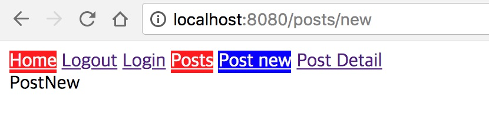

## 뷰JS의 간단한 라우팅

단일 페이지 어플리케이션(SPA)에서 가장 먼저 처리해야 할 것이 바로 라우팅이다. 서버에서 라우팅은 URI에 따라 해당하는
정적파일을 내려주는 방식이다. 이를 브라우져에서 구현해야 하는것이 SPA 개발의 핵심이다.

아이디어는 간단하다. 요청 URI에 따라 브라우져에서 돔을 변경하는 방식이다.
Vue.js 공식 문서의 [Scaling Up 섹션](https://kr.vuejs.org/v2/guide/routing.html#%EB%8B%A8%EC%88%9C%ED%95%9C-%EB%9D%BC%EC%9A%B0%ED%8C%85-%EC%8B%9C%EC%9E%91%ED%95%98%EA%B8%B0)에
구현된 코드가 있다.

라우팅 별로 세 개의 컴포넌트를 만든다.

```js
const Home = { template: "<p>home page</p>" }
const About = { template: "<p>about page</p>" }
const NotFound = { template: "<p>Page not found</p>" }
```

경로에 따라 위 세개 컴포넌트를 바꿔가면서 렌더링 해주려고 한다. 그럼 경로와 컴포넌트 딕셔너리가 필요하겠다.

```js
const routes = {
  "/": Home,
  "/about": About,
}
```

루트('/') 경로와 어바웃('/about') 경로에 대한 각각의 컴포넌트 딕셔너리를 만들었다.

뷰 인스턴스 설정 객체에는 el, data 뿐만아니라 `render` 속성도 있다. 사실 함수다. createElement같은 돔 생성 함수를 인자로
주입 받는 함수가 render 함수이다. 함수 `h()`에 컴포넌트 설정 객체를 넘겨주면 뷰JS는 컴포넌트를 화면에 그린다.
(컴포넌트를 마운팅 포인트에 갖다 붙인다.)

요청 경로에 따라 `render()` 함수가 동적으로 동작하도록 만들면 라우팅에 따라 다른 화면을 구현할 수 있는 셈이다.

```js
new Vue({
  /* 생략 */

  render(h) {
    return h(this.ViewComponent)
  },
})
```

render() 함수는 `ViewComponent`라는 계산된 속성을 인자로 전달해서 `h()` 함수를 호출한다.

```js
new Vue({
  /* 생략 */

  computed: {
    ViewComponent() {
      return routes[window.location.pathname] || NotFound
    },
  },

  /* 생략 */
})
```

VueComponent는 현재 경로로 routes 디셔너리에서 컴포넌트를 찾아 반환한다. 정의되지 않은 경로일 경우 NotFound 컴포넌트를 반환한다.

[전체코드](https://kr.vuejs.org/v2/guide/routing.html)를 읽어보면 라우팅 동작을 이해하는데 수월할 것이다.

## 라우터 라이브러리: vue-router

이렇게 단순한 라우팅을 직접 구현할 수도 있겠지만, 본격적으로 SPA를 개발하려면 라우터 전용 라이브러리를 사용하는 것이 좋다.
중첩 라우팅, 네비게이션 가드 등 SPA 개발시 다양한 상황을 수월하게 처리할수 있기 때문이다.
공식 문서에서는 **vue-router** 라이브러리를 추천하고 있다.


- Github: [https://github.com/vuejs/vue-router](https://github.com/vuejs/vue-router)
- 문서: [https://router.vuejs.org/kr/](https://router.vuejs.org/kr/)

간단한 스케폴딩 위에서 뷰 라우터의 기본적인 사용법을 간단히 학습해 보자.
vue-cli의 [webpack-simple](https://github.com/vuejs-templates/webpack-simple) 템플릿으로 시작한다.

### 라우터 객체 생성

뷰 인스턴스 생성 객체에는 `router` 속성이 있다. 뷰 라우터를 사용하려면 이 속성으로 뷰 라우터 객체를 넘겨줘야 한다.

```js
// main.js

import Vue from "vue"
import App from "./App.vue"
import router from "./router"

new Vue({
  el: "#app",
  render: h => h(App),

  // 라우터 객체를 넘겨준다
  router,
})
```

그럼 실제 router/index.js 파일에서 라우터 객체를 생성해 보자.

뷰 라우터는 플러그인 형태이기 때문에 `Vue.use()` 함수를 이용해서 등록한다.

```js
// router/index.js

import Vue from "vue"
import VueRouter from "vue-router"

// 뷰 어플리케이션에 라우터 플러그인을 추가한다.
Vue.use(VueRouter)
```

라우팅에 따라 렌더링할 컴포넌트 설정 객체를 정의한다. template 속성만 정의했다.

```js
// router/index.js

/* 생략 */
const Home = { template: "<div>Home</div>" }
const NotFound = { template: "<div>Not Found</div>" }
```

마지막으로 `VueRouter` 클래스 함수로 라우터 객체를 생성한다.

```js
// router/index.js

/* 생략 */
const router = new VueRouter({
  mode: "history",
  routes: [
    { path: "/", component: Home },
    { path: "*", component: NotFound },
  ],
})

export default router
```

`mode` 속성 기본값은 "해쉬뱅 모드"다. 브라우져 history 객체의 [pushState() API](https://developer.mozilla.org/ko/docs/Web/API/History_API)를
사용하기 위해서는 "history"로 모드값을 설정한다.

`routes`는 경로와 컴포넌트으로 이뤄진 컬렉션이다. 실제 이 맵을 보고 라우터가 경로에 따라 그에 맞는 컴포넌트를 렌더링한다.

이 컬렉션은 순서가 중요한데 정의한 순서대로 경로를 매칭해서 컴포넌트를 출력한다.

홈(/) 경로로 들어올 경우 `{ path: '/', component: Home }` 설정에 의해 Home 컴포넌트가 렌더링 될 것이다.

한편 정의되지 않은 경로(예: /NotFound) 로 들어올결우 `{ path: '*', component: NotFound }` 설정에 의해 NotFound 컴포넌트가 그려질 것이다.

### 라우터 뷰

이제 이 라우터를 이용해 출력될 부분을 설정해야한다. App.vue가 루트 컴포넌트이므로 여기에 라우터 뷰를 추가해 보겠다.

```html
<!-- App.vue -->

<template>
  <div>
    <!-- 여기에 라우터가 컴포넌트를 그린다 -->
    <router-view></router-view>
  </div>
</template>
```

라우팅이 경로에 따라 컴포넌트를 바꿔치기해서 렌더링한다고 했는데... 렌더링해주는 부분이 `<router-view>` 태그 부분이다.
결과를 확인해 보면 Home과 Notfound가 경로에 따라 출력되는 것을 확인할 수 있다.


### 라우터 링크

상단에 네비게이션 링크를 추가해 보겠다. /home으로 가는 링크를 먼저 만들어 보자.

```html
<!-- App.vue -->

<template>
  <div>
    <!-- 라우터 링크를 추가 -->
    <router-link to="/">Home</router-link>
    <router-view></router-view>
  </div>
</template>
```

라우터에 등록된 링크는 `<a>` 태그 보다는 `<router-link>` 태그를 사용하길 권장하는데 이유는 다음과 같다.

- 히스토리모드와 해쉬뱅 모드에서는 주소 체계가 달라서 `<a>` 태그를 사용할 경우 모드 변경시 주소값을 일일이 변경해 줘야한다.
  하지만 `<router-link>`는 변경할 필요가 없다.
- `<a>` 태그를 클릭하면 화면을 갱신하는데 `<router-link>`는 이를 차단해준다. 갱신 없이 화면을 이동할 수 있다.
- 자세한 내용은 [문서](https://router.vuejs.org/kr/api/router-link.html)를 참고하자.


## 중첩된 라우팅

이제 본격적으로 블로그 예제를 위한 라우트들을 설계해 보자. 아래 6개 경로를 선정했다.

- / 홈
- /login 로그인
- /logout 로그아웃
- /posts 포스트 목록
- /posts/detail 포스트 상세
- /posts/new 포스트 추가

라우터 객체 생성시 사용하는 `routes` 속성에 경로 문자열과 각 컴포넌트들을 배열로 추가한다.

```js
// router/index.js

export default new VueRouter({

  // 라우트 정의 부분
  routes: [
    { path: '/', component: { template: '<div>Home</div>' },
    { path: '/login', component: { template: '<div>Login</div>' },
    { path: '/logout',component: { template: '<div>Logout</div>' },
    { path: '/posts',component: { template: '<div>Posts</div>' },
    { path: '/posts/new',component: { template: '<div>New Post</div>' },
    { path: '/posts/detail',component: { template: '<div>Post Detail</div>' },
    { path: '*', component: { template: '<div>Not Found</div>'} }
  ]
})
```

routes 속성에 정의하는 컬렉션에는 `children` 속성이 있다. 이는 특정 라우팅의 하위 경로가 변경됨에 따라 하위 컴포넌트로 변경할수 있는 기능이다.

### children 속성

/posts 경로를 포함한 하위 경로인 /posts/new와 /posts/detail을 `children` 옵션으로 변경해 보면 이렇다.

```js
// router/index.js

export default new VueRouter({
  routes: [
    // 생략

    {
      path: "/posts",
      component: {
        template: "<div>Posts <br/><router-view></router-view></div>",
      },

      // 중첩된 라우트는 children 속성으로 하위 라우트를 정의할 수 있다.
      children: [
        { path: "new", component: { template: "<div>New Post</div>" } },
        { path: "detail", component: { template: "<div>Post Detail</div>" } },
      ],
    },

    // 생략
  ],
})
```

부모 라우트에서는 자녀 라우트들을 렌더링하기 위한 뷰가 필요한데 /posts 라우트의 컴포넌트에 정의한다.

```js
{
  path: '/posts',
  component: {
    template: '<div>Posts <br/><router-view></router-view></div>'
  }
}
```

template 부분에 `<router-view>` 태그를 삽입했다.
중첩된 하위 경로가 변경될때 이 부분에 해당 컴포넌트가 그려진다.

생성한 라우터 링크를 네이게이션 메뉴에 추가한 후 라우팅 결과를 확인해 보자.

```html
<!-- App.vue -->

<template>
  <div>
    <router-link to="/" exact>Home</router-link>
    <router-link to="/logout">Logout</router-link>
    <router-link to="/login" exact>Login</router-link>
    <router-link to="/posts">Posts</router-link>
    <router-link to="/posts/new" exact>New Post</router-link>
    <router-link to="/posts/detail" exact>New Post</router-link>
    <router-view></router-view>
  </div>
</template>
```

- /posts 라우팅:
  

- /posts/new 라우팅:
  

- /posts/detail 라우팅:
  

가만히 보면 **중첩된 라우팅**이 **중첩된 화면**을 구성하는데 적합하다는 것을 알수 있다.
/posts/new 라우트의 경우 /posts 라우트에 설정한 컴포넌트(빨간색)를 사용하되 `<route-view>` 부분만
/posts/new 라우트에 설정한 컴포넌트 (초록색)를 사용한다.

### 동적 라우트 매칭

/posts/detail 은 포스트 상세 화면을 조회하기 위한 화면으로 설계했다. 상세화면은 포스트 아이디(id)에
따라 내용이 달라지는데 이를 라우트 경로에 추가한다면 화면을 그릴때 단서가 될수 있을 것이다.

- /posts/**1**
- /posts/**2**

이런식으로 detail 대신 **아이디 값**이 온다면 어떨까?

뷰 라우터는 이러한 동적 라우트 매칭을 위한 설정도 제공한다.

```js
{ path: ':id', component: {} },
```

`{ path: 'detail' }` 부분을 `{ path: ':id }` 로 변경했다. 동적 라우트는 세미콜론으로 시작한다.
이제 /posts/1, posts/2 같은 URI는 모두 같은 경로로 매핑 된다.

그럼 /posts/new는 어떻게 동작할까? 그렇다. 이것도 같은 경로로 인식될 것이다. 따라서 라우트 정의의
우선순위가 중요하다. /posts/new도 별개 라우트로 정의하기 위해서는 /posts/:id 보다 먼저 정의해주는 센스가 필요하다.

이렇게 동적 라우트 매칭으로 그려진 컴포넌트에서 id 값은 어떻게 접근할까? 뷰 라우터를 플러그인으로 추가했기
때문에 뷰 객체에서는 `this.$route` 변수로 라우터에 접근할수 있다. 따라서 경로에 접근하려면
`this.$route.params.id`를 통해 가능하다.

참고로 쿼리문자열은 `this.$route.query`로 확인할 수 있다.

그럼 id 값만 출력하는 포스트 상세 컴포넌트로 수정해 보겠다.

```js
{
  path: ':id',
  component: {

    // this.$route.params.id로 id 값에 접근할 수 있다
    template: '<div>PostView<br />id:{{this.$route.params.id}}</div>'
  }
},
```


### 라우터 링크 스타일

앞에서 언급한 내용 외에도 라우터링크는 스타일과 관련된 사항이 더 있다. 경로에 따라 CSS 클래스 명이 자동으로 추가되는 것이다.

/posts/new 경로에서는 `<router-link to="/posts/new">` 링크에 클래스 명이 추가되는데
.router-link-active와 .router-link-exact-active 클래스다.

- `.router-link-active`: 경로 앞부분만 일치해서 추가되는 클래스
- `.router-link-exact-active`: 모든 경로가 일치해야만 추가되는 클래스

뷰js가 알아서 CSS 클래스명을 추가하기 때문에 개발자는 클래스 정의만 추가하면 된다.
루트 어플리케이션에 CSS를 추가한다.

```html
// App.vue

<style>
  .router-link-active {
    color: white;
    background-color: red;
  }

  .router-link-exact-active {
    color: white;
    background-color: blue;
  }
</style>
```

모든 경로가 일치하면 파란색, 일부만 일치하면 빨간색으로 강조된다.



.router-link-active 클래스가 왜 필요할까 고민해 봤다. 경로에 따라 메뉴가 단계별로 구성될 경우
1단계 2단계 ... n단계가 될 것이다. 만약 단계별로 메뉴를 강조해야할 경우 이 클래스를 적절히 활용하면 될 것 같다.

## 데이터 가져오기

SPA 개발에서 중요한 기능이 서버로부터 데이터를 가져오는 기능이다. 이를 데이터 페치 (Data Fetching)라고도
부르는데 각 화면별로 라우팅이 일어나는 시점에 데이터를 불러와야 한다.

기본적으로는 뷰 라이프라이클의 `created()` 훅에서 가져온다.

```js
// componetns/Post.vue

created() {
  // 컴포넌트 생성시 데이터를 패치한다
  this.fetchData()
},
methods: {
  fetchData () {
    this.post = null
    this.loading = true

    Post.get(this.$route.params.id).then(data => {
      this.post = data
      this.loading = false
    })
  }
}
```

이후 라우터 링크를 통해 경로가 변경되는 경우를 생각해 보자. /posts/:id 경로에 매칭되는 컴포넌트(Post 컴포넌트)는
화면이 리프래시 될 경우에만 created() 훅이 동작한다. 단순히 :id 값만 변경되는 라우팅일 경우 Post 컴포넌트는 교체되지 않는다.

따라서 :id 값이 변한다고 created() 훅에 있는 fetchData() 함수가 호출되는 것은 아니다.
:id 값이 변경될때 덩달아 변경되는 무엇인가가 필요하다.

힌트는 이미 언급한 `this.$route`다.
이 객체는 라우팅 변경이 일어날때마다 호출된다. 따라서 watch 에서 감시하고 있다가 변경되면 즉시
fetchData() 함수를 호출하는 로직을 추가하자.

```js
created() {
  // 컴포넌트 생성시 데이터를 패치한다
  this.fetchData()
},
watch: {
  // 라우터 객체를 감시하고 있다가 fetchData() 함수를 호출한다
  '$route': 'fetchData'
},
methods: {
  fetchData () {
    this.post = null
    this.loading = true

    Post.get(this.$route.params.id).then(data => {
      this.post = data
      this.loading = false
    })
  }
}
```

비로소 라우팅이 동작할때마다 데이터를 가져올수 있고 화면도 변경할수 있게 되었다. 아래 결과로 확인하자.


## 인증 플로우

마지막으로 뷰 라우터로 인증 플로우를 구현하는 방법을 살펴 보겠다.

모든 URI가 공개된 것은 아니다. 어떤 URI는 로그인한 유저, 즉 인증을 마친 유저만 접근을 허용해야 한다.
이 기능도 라우터의 역할인데 서버에서는 세션 아이디로 보통 판별한다.

SPA 개발에서는 로그인 후 서버에서 발급받은 액세스 토큰(access token)의 유무로 확인할 수 있다.
뷰 라우터에는 **네비게이션 가드**라는 기능이 있는데 이것이 인증 플로우를 구현하는데 적합하다.

### 네비게이션 가드

라우터 설정 객체에는 `beforeEnter()` 함수를 추가할 수 있다. 이 함수는 경로에 따라 라우트 매칭을 결정하고
해당 컴포넌트를 생성하기 직전에 호출되는 함수다. 여기서 인증 여부를 판단한 뒤 컴포넌틀 랜더링을 진행하거나
혹은 로그인 페이지로 이동하는 등의 로직을 구현하면 된다.

포스트 작성 URI (/posts/new)는 로그인한 유저만 볼수 있어야 한다. 이 라우트에 네비게이션 가드를 추가해 보자.

```js
// router/index.js

const requireAuth = (to, from, next) => {
  if (Auth.loggedIn()) return next()
  next({
    path: "/login",
    query: { redirect: to.fullPath },
  })
}
```

beforeEnter() 훅에 사용할 함수다.<br />
인증이 확인되면 요청한 URI의 컴포넌트를 보여주기 위해 `next()` 함수를 호출한다. <br />
인증 전이라면 로그인 페이지 이동을 위해 next() 함수에 라우트 설정 객체를 넘겨 준다.
로그인 후 다시 요청한 페이지로 돌아오기 위해 쿼리문자열로 redirect 정보를 전달한 것을 기억하자.

```js
// router/index.js

{
  path: '/posts', component: Posts,
  children: [{
    path: 'new',
    component: NewPost,

    // 인증 여부를 체크하는 requreAuth를 beforeEnter 속성에 추가했다
    beforeEnter: requireAuth
  },
```

### 로그인

로그인 페이지에서는 어떻게 다음 플로우를 짤수 있을까? /login 경로에 연결된 로그인 컴포넌트를 만들어 보자.

```html
// components/Login.vue

<template>
  <div>
    <h2>Login</h2>
    <form @submit.prevent="login">
      <input type="text" v-model="email" />
      <input type="password" v-model="password" />
      <button type="submit">Login</button>
    </form>
  </div>
</template>
```

이메일과 비밀번호 입력필드를 만들고 폼 전송 이벤트에 login 함수를 바인딩 했다.

계속해서 login 함수 부분을 살펴보자.

```js
// components/Login.vue

methods: {
  login() {
    Auth.login(this.email, this.password).then(() => {

      // 인증에 성공하면 이전 페이지로 이동한다
      this.$router.replace(this.$route.query.redirect || '/')
    })
  }
}
```

`Auth.login()` 함수로 인증에 성공하면 이전페이지로 이동한다. (Auth.login() 함수는 서버로부터
액세스 토큰을 받아 로컬 스토리지에 저장하는 역할을 한다. [코드 참고](https://github.com/jeonghwan-kim/vue-router-sample/blob/master/src/api/index.js#L47))네비게이션 가드에서 쿼리문자열 형태로 넘어온
redirect 문자열을 인자로 하여 `this.$router.replace()` 함수를 호출하는 부분이다. 없을 경우 홈(/) 페이지로 이동한다.

`$router.replace()` 함수는 `push()` 와 같은 역할을 하지만 유일한 차이는 히스토리 항목에 추가하지
않고 라우트를 변경한다는 점이다. replace() 함수를 사용하면 뒤로가기를 해도 이전 페이지인 /login 으로 이동하지 않는걸 확인했다.

- 글쓰기를 위한 로그인 화면:
  

- 로그인 후 글쓰기 화면:
  

### 로그아웃

로그아웃도 beforeEnter() 훅을 이용해 구현할 수 있다. /logout 경로에 간단히 추가해서 구현했다.

```js
// router/index.js

{
  path: '/logout',
  beforeEnter(to, from, next) {
    Auth.logout()
    next('/')
  }
},
```

로그아웃 경로를 요청하면 뷰라우터는 라우팅 수행 직전에 beforeEnter() 함수를 실행한다. Auth.logout() 함수를 통해
로컬스토리지의 토큰 삭제 처리를 하고 next() 함수로 홈(/) 페이지로 라우팅 방향을 변경한다.

## 정리

뷰JS는 경로명에 따라 컴포넌트를 변경하는 방식으로 간단한 SPA 라우팅 기능을 구현할 수 있다.
본격적인 SPA 개발을 위해서 뷰 라우터 라이브러리를 사용할 수 있는데 중첩 라우팅, 라우터 링크,
동적 라우트 매칭, 그리고 네이게이션 가드를 이용해 인증 플로우까지 구현해 봤다.

[전체 샘플 코드](https://github.com/jeonghwan-kim/vue-router-sample)를 찬찬히 읽어보면 좀더 수월하게 이해할 수 있을 것이다.

참고

- 공식문서: [https://router.vuejs.org/kr](https://router.vuejs.org/kr)
- 예제 코드: [https://github.com/vuejs/vue-router/blob/dev/examples/index.html](https://github.com/vuejs/vue-router/blob/dev/examples/index.html)
