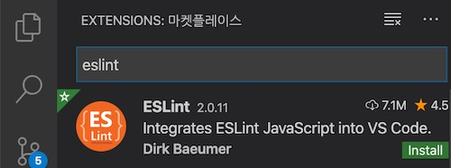
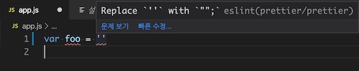

## 1. 배경

오래된 스웨터의 보푸라기 같은 것을 린트(Lint)라고 부른다.
보푸라기가 많으면 옷이 보기 좋지 않은데 코드에서도 이런 보프라기가 있다.
들여쓰기를 맞추지 않은 경우, 선언한 변수를 사용하지 않은 경우......

보프라기 있는 옷을 입을 수는 있듯이 이러한 코드로 만든 어플리케이션도 동작은 한다.
그러나 코드의 가독성이 떨어지고 점점 유지보수하기 어려운 애물단지가 되어버리기 일쑤다.

보푸라기를 제거하는 린트 롤러(Lint roller)처럼 코드의 오류나 버그, 스타일 따위를 점검하는 것을 [린트(Lint) 혹은 린터(Linter)](<https://en.wikipedia.org/wiki/Lint_(software)>)라고 부른다.

### 1.1 린트가 필요한 상황

아래 코드 유심히 보자.
console.log() 함수를 실행하고 다음 줄에서 즉시 실행함수를 실행하려는 코드다.

```js
console.log()(function () {})()
```

하지만 이 코드를 브라우져에서 실행해 보면 TypeError가 발생한다.
브라우져는 코드에 세미콜론를 자동으로 넣는 과정(ASI)을 수행하는데, 위와 같은 경우는 우리의 의도대로 해석하지 못하고 아래 코드로 해석한다([Rules of Automatic Semicolon Insertion](http://www.ecma-international.org/ecma-262/7.0/index.html#sec-rules-of-automatic-semicolon-insertion)을 참고).

```js
console.log()(function () {})()
```

console.log()가 반환하는 값이 함수가 아닌데 함수 호출을 시도했기 때문에 타입에러가 발생할 것이다.
모든 문장에 세미콜론을 붙였다면, 혹은 즉시 함수호출 앞에 세미콜론을 붙였다면 예방할 수 있는 버그다.

린트는 코드의 가독성을 높이는 것 뿐만 아니라 동적 언어의 특성인 런타임 버그를 예방하는 역할도 한다.

## 2. ESLint

### 2.1 기본 개념

ESLint는 ECMAScript 코드에서 문제점을 검사하고 일부는 더 나은 코드로 정정하는 린트 도구 중의 하나다.
코드의 가독성을 높이고 잠재적인 오류와 버그를 제거해 단단한 코드를 만드는 것이 목적이다.
과거 JSLint, JSHint에 이어서 최근에는 ESLint를 많이 사용하는 편이다.

코드에서 검사하는 항목을 크게 분류하면 아래 두 가지다.

- 포맷팅
- 코드 품질

**포맷팅**은 일관된 코드 스타일을 유지하도록 하고 개발자로 하여금 쉽게 읽히는 코드를 만들어 준다.
이를 테면 "들여쓰기 규칙", "코드 라인의 최대 너비 규칙"을 따르는 코드가 가독성이 더 좋다.

한편, **코드 품질**은 어플리케이션의 잠재적인 오류나 버그를 예방하기 위함이다.
사용하지 않는 변수 쓰지 않기, 글로벌 스코프 함부로 다루지 않기 등이 오류 발생 확률을 줄여 준다.

린트 도구를 사용해서 코드를 검사하고 더 나아가 단단한 하고 읽기 좋은 코드를 만드는 방법을 알아보자.

### 2.2 설치 및 사용법

먼저 노드 패키지로 제공되는 ESLint 도구를 다운로드 한다.

```
npm i -D eslint
```

환경설정 파일을 프로젝트 최상단에 생성한다.

```js
// .eslintrc.js
module.exports = {}
```

빈 객체로 아무런 설정 없이 모듈만 만들었다.
ESLint로 코드를 검사 하면

```
npx eslint app.js
```

아무런 결과를 출력하지 않고 프로그램을 종료한다.

### 2.3 규칙(Rules)

ESLint는 검사 규칙을 미리 정해 놓았다.
문서의 [Rules](https://eslint.org/docs/rules/) 메뉴에서 규칙 목록을 확인할 수 있다.

우리가 우려했던 문제와 관련된 규칙은 [no-unexpected-multiline](https://eslint.org/docs/rules/no-unexpected-multiline)이다.
설정 파일의 rules 객체에 이 규칙을 추가한다.

```js
// .eslintrc.js
module.exports = {
  rules: {
    "no-unexpected-multiline": "error",
  },
}
```

규칙에 설정하는 값은 세 가지다. "off"나 0은 끔, "warn"이나 1은 경고, "error"나 2는 오류.
설정한 규칙에 어긋나는 코드를 발견하면 오류를 출력하도록 했다.

다시 검사해 보자.

```
npx eslint app.js
2:1 error  Unexpected newline between function and ( of function call  no-unexpected-multiline

✖ 1 problem (1 error, 0 warnings)
```

예상대로 에러가 발생하고 코드 위치와 위반한 규칙명을 알려준다.
함수와 함수 호출의 괄호 "(" 사이에 줄바꿈이 있는데 이것이 문제라고 한다.
코드 앞에 세미콜론을 넣거나 모든 문의 끝에 세미콜론을 넣어 문제를 해결할 수 있다.
수정한 다음 다시 검사하면 검사에 통과할 것이다.

### 2.4 자동으로 수정할 수 있는 규칙

자바스크립트 문장 뒤에 세미콜론을 여러 개 중복 입력해도 어플리케이션은 동작한다.
그러나 이것은 코드를 읽기 어렵게 하는 장애물일 뿐이다.
이렇게 작성한 코드가 있다면 실수로 입력한게 틀림 없다.

이 문제와 관련된 규칙은 [no-extra-semi](https://eslint.org/docs/rules/no-extra-semi) 규칙이다.

문장 뒤에 세미콜론을 더 추가한 뒤,

```js
// app.js
console.log() // 세미콜론 연속 두 개 붙임
```

린트 설정에 no-extra-semi 규칙을 추가하고,

```js
// .eslintrc.js
module.exports = {
  rules: {
    "no-extra-semi": "error",
  },
}
```

코드를 검사하면 오류를 출력한다.

```
npx eslint app.js
1:15  error  Unnecessary semicolon  no-extra-semi

✖ 1 problem (1 error, 0 warnings)
  1 error and 0 warnings potentially fixable with the `--fix` option.
```

마지막 줄의 메세지를 보면 이 에러는 "잠재적으로 수정가능(potentially fixable)"하다고 말한다.
`--fix` 옵션을 붙여 검사해보면,

```
npx eslint app.js --fix
```

검사 후 오류가 발생하면 코드를 자동으로 수정한다.

이렇듯 ESLint 규칙에는 수정 가능한 것과 그렇지 못한 것이 있다.

[규칙 목록](https://eslint.org/docs/rules/) 중 왼쪽에 렌치 표시가 붙은 것이 `--fix` 옵션으로 자동 수정할 수 있는 규칙이다.

### 2.5 Extensible Config

이러한 규칙을 여러게 미리 정해 놓은 것이 eslint:recommended 설정이다.
[규칙 목록](https://eslint.org/docs/rules/) 중에 왼쪽에 체크 표시되어 있는것이 이 설정에서 활성화되어 있는 규칙이다.

이것을 사용하려면 extends 설정을 추가한다.

```js
// .eslintrc.js
module.exports = {
  extends: [
    "eslint:recommended", // 미리 설정된 규칙 세트을 사용한다
  ],
}
```

만약 이 설정 외에 규칙이 더 필요하다면 rules 속성에 추가해서 확장할 수 있다.

ESLint에서 기본으로 제공하는 설정 외에 자주 사용하는 두 가지가 있다.

- airbnb
- standard

**airbnb** 설정은 [airbnb 스타일 가이드](https://github.com/airbnb/javascript)를 따르는 규칙 모음이다.
[eslint-config-airbnb-base](https://github.com/airbnb/javascript/tree/master/packages/eslint-config-airbnb-base) 패키지로 제공된다.

**standard** 설정은 [자바스크립트 스탠다드 스타일](https://standardjs.com/)을 사용한다.
[eslint-config-standard](https://github.com/standard/eslint-config-standard) 패키지로 제공된다.

### 2.6 초기화

사실 이러한 설정은 `--init` 옵션을 추가하면 손쉽게 구성할 수 있다.

```
npx eslint --init

? How would you like to use ESLint?
? What type of modules does your project use?
? Which framework does your project use?
? Where does your code run?
? How would you like to define a style for your project?
? Which style guide do you want to follow?
? What format do you want your config file to be in?
```

대화식 명령어로 진행되는데 모듈 시스템을 사용하는지, 어떤 프레임웍을 사용하는지, 어플리케이션이 어떤 환경에서 동작하는지 등에 답하면 된다.
답변에 따라 .eslintrc 파일을 자동으로 만들 수 있다.

## 3. Prettier

프리티어는 코드를 "**더**" 예쁘게 만든다.
ESLint의 역할 중 포매팅과 겹치는 부분이 있지만 프리티터는 좀 더 일관적인 스타일로 코드를 다듬는다.
반면 코드 품질과 관련된 기능은 하지 않는 것이 ESLint와 다른 점이다.

### 3.1 설치 및 사용법

프리티어 패키지를 다운로드 하고

```
npm i -D prettier
```

코드를 아래 처럼 작성한다.

```js
// app.js
console.log("hello world")
```

Prettier로 검사해 보자.

```
npx prettier app.js --write
```

`--write` 옵션을 추가하면 파일을 재작성한다. 그렇지 않을 경우 결과를 터미널에 출력한다.

변경된 모습을 보면,

```js
// app.js
console.log("Hello world")
```

작은 따옴표를 큰 따옴표로 변경했다. 문장 뒤에 세미콜론도 추가했다.
프리티어는 ESLint와 달리 규칙이 미리 세팅되어 있기 때문에 설정 없이도 바로 사용할 수 있다.

### 3.2 포매팅(더 예쁘게)

다음 코드를 보자.

```js
// app.js
console.log(
  "----------------매 우 긴 문 장 입 니 다 80자가 넘 는 코 드 입 니 다.----------------"
)
```

ESLint는 [max-len](https://eslint.org/docs/rules/max-len) 규칙을 이용해 위 코드를 검사하고 결과만 알려 줄 뿐 수정하는 것은 개발자의 몫이다.
반면 프리티어는 어떻게 수정해야할지 알고 있기 때문에 아래처럼 코드를 다시 작성한다.

```js
// app.js
console.log(
  "----------------매 우 긴 문 장 입 니 다 80자가 넘 는 코 드 입 니 다.----------------"
)
```

아래 코드는 어떻게 변환할까?

```js
foo(
  reallyLongArg(),
  omgSoManyParameters(),
  IShouldRefactorThis(),
  isThereSeriouslyAnotherOne()
)
```

프리티어는 코드를 문맥을 어느 정도 파악하고 상황에 따라 최적의 모습으로 스타일을 수정한다.

```js
foo(
  reallyLongArg(),
  omgSoManyParameters(),
  IShouldRefactorThis(),
  isThereSeriouslyAnotherOne()
)
```

더 멋진 예제도 있는데 프리티어를 만든 [James Long의 글](https://jlongster.com/A-Prettier-Formatter)을 참고하자.
이러한 포매팅 품질은 ESLint보다는 프리티어가 훨씬 좋은 결과를 만든다. 사람에게 더 친숙하도록 말이다.

### 3.3 통합방법

여전히 ESLint를 사용해야 하는 이유는 남아 있다.
포맷팅은 프리티어에게 맡기더라도 코드 품질과 관련된 검사는 ESLint의 몫이기 때문이다.
따라서 이 둘을 같이 사용하는 것이 최선이다. 프리티어는 이러한 ESLint와 통합 방법을 제공한다.
[eslint-config-prettier](https://github.com/prettier/eslint-config-prettier) 는 프리티어와 충돌하는 ESLint 규칙을 끄는 역할을 한다.
둘 다 사용하는 경우 규칙이 충돌하기 때문이다.

패키지를 설치한뒤,

```
npm i -D eslint-config-prettier
```

설정파일의 extends 배열에 추가한다.

```js
// .eslintrc.js
{
  extends: [
    "eslint:recommended",
    "eslint-config-prettier"
  ]
}
```

예를 들어 ESLint는 중복 세미콜론 사용을 검사한다. 이것을 프리티어도 마찬가지다.
따라서 어느 한쪽에서는 규칙을 꺼야하는데 eslint-config-prettier를 extends 하면 중복되는 ESLint 규칙을 비활성화 한다.

```js
var foo = "" // 사용하지 않은 변수. ESLint가 검사
console.log() // 중복 세미콜론 사용. 프리티어가 자동 수정
```

ESLint는 중복된 포매팅 규칙을 프리티어에게 맞기고 나머지 코드 품질에 관한 검사만 한다.
따라서 아래처럼 두 개를 동시에 실행해서 코드를 검사한다.

```
npx prettier app.js --write && npx eslint app.js --fix

1:5  error  'foo' is assigned a value but never used  no-unused-vars

✖ 1 problem (1 error, 0 warnings)
```

프리터에서 의해 코드가 아래과 같이 포매팅 되었고

```js
var foo = ""
console.log()
```

ESlint에 의해 코드 품질과 관련된 오류(no-unused-vars)를 리포팅한다.

한편, [eslint-plugin-prettier](https://github.com/prettier/eslint-plugin-prettier)는 프리티어 규칙을 ESLint 규칙으로 추가하는 플러그인이다. 프리티어의 모든 규칙이 ESLint로 들어오기 때문에 ESLint만 실행하면 된다.

패키지를 설치하고

```
npm i -D eslint-plugin-prettier
```

설정 파일에서 pulugins와 rules에 설정을 추가한다.

```js
// .eslintrc.js
{
  plugins: [
    "prettier"
  ],
  rules: {
    "prettier/prettier": "error"
  },
}
```

프리티어의 모든 규칙을 ESLint 규칙으로 가져온 설정이다.
이제는 ESLint만 실행해도 프리티어 포매팅 기능을 가져갈 수 있다.

```
npx eslint app.js --fix
```

프리티어는 이 두 패키지를 함께 사용하는 [단순한 설정](https://prettier.io/docs/en/integrating-with-linters.html)을 제공하는데 아래 설정을 추가하면 된다.

```js
// .eslintrc.js
{
  "extends": [
    "eslint:recommended",
    "plugin:prettier/recommended"
  ]
}
```

## 4. 자동화

린트는 코딩할 때마다 수시로 실행해야하는데 이러한 일은 자동화 하는 것이 좋다.
"깃 훅을 사용하는 방법"과 "에디터 확장 도구"를 사용하는 방법을 각각 소개한다.

### 4.1 변경한 내용만 검사

소스 트래킹 도구로 깃을 사용한다면 깃 훅을 이용하는 것이 좋다.
커밋 전, 푸시 전 등 깃 커맨드 실행 시점에 끼여들수 있는 훅을 제공한다.
[husky](https://github.com/typicode/husky)는 깃 훅을 쉽게 사용할 수 있는 도구다. (Git 2.13.0 이상 버전을 지원)
커밋 메세지 작성전에 끼어들어 린트로 코드 검사 작업을 추가하면 좋겠다.

먼저 패키지를 다운로드 한다.

```
npm i -D husky
```

허스키는 패키지 파일에 설정을 추가한다.

package.json:

```json
{
  "husky": {
    "hooks": {
      "pre-commit": "echo \"이것은 커밋전에 출력됨\""
    }
  }
}
```

훅이 제대로 동작하는지 빈 커밋을 만들어 보자.

```
git commit --allow-empty -m "빈 커밋"
husky > pre-commit (node v13.1.0)
이것은 커밋전에 출력됨  ----> 깃 훅이 동작함
[master db8b4b8] empty
```

pre-commit에 설정한 내용이 출력되었다.
출력 대신에 린트 명령어로 대체하면 커밋 메세지 작성 전에 린트를 수행할 수 있겠다.

package.json:

```json
{
  "husky": {
    "hooks": {
      "pre-commit": "eslint app.js --fix"
    }
  }
}
```

만약 린트 수행중 오류를 발견하면 커밋 과정은 취소된다.
린트를 통과하게끔 코드를 수정해야만 커밋할 수 있는 환경이 되었다.

한편, 코드가 점점 많아지면 커밋 작성이 느려질 수 있는데 커밋전에 모든 코드를 린트로 검사하는 시간이 소요되기 때문이다.
커밋시 변경된 파일만 린트로 검사하면 더 좋지 않을까?
[lint-staged](https://github.com/okonet/lint-staged)는 변경된(스테이징된) 파일만 린트를 수행하는 도구다.

패키지를 설치하고,

```
npm i -D lint-staged
```

패키지 파일에 설정을 추가한다.

package.json:

```json
{
  "lint-staged": {
    "*.js": "eslint --fix"
  }
}
```

내용이 변경된 파일 중에 .js 확장자로 끝나는 파일만 린트로 코드 검사를 한다.

pre-commit 훅도 아래처럼 변경한다.

package.json:

```json
{
  "husky": {
    "hooks": {
      "pre-commit": "lint-staged"
    }
  }
}
```

커밋 메세지 작성전에 lint-staged를 실행할 것이다.
이제 커밋하면 모든 파일을 검사하는 것이 아니라 변경되거나 추가된 파일만 검사한다.
커밋 과정이 훨씬 가벼워질 것이다.

### 4.2 에디터 확장도구

코딩할때 실시간으로 검사하는 방법도 있다.
vs-code의 eslint와 prettier 익스텐션이 그러한 기능을 제공한다.
우리는 프리티어 규칙을 ESLint와 통합했기 때문에 ESLint 익스텐션을 사용해 보겠다.

먼저 [ESLint 익스텐션](https://marketplace.visualstudio.com/items?itemName=dbaeumer.vscode-eslint) 부터 설치해 보자.



설치를 마친 뒤 eslint를 활성화 설정을 추가한다.

.vscode/settings.json:

```json
{
  "eslint.enable": true
}
```

설치하면 자동으로 ESLint 설정파일을 읽고 파일을 검사한다.



툴팁 메뉴를 클릭해서 문제를 수정한다.

에디터 설정중 저장시 액션을 추가할 수 있는데 ESLint로 코드를 정정할 수 있다.

.vscode/settings.json:

```json
{
  "editor.codeActionsOnSave": {
    "source.fixAll.eslint": true
  }
}
```

이렇게 ESLint 익스텐션으로는 실시간 코드 품질 검사를 하고 저장시 자동 포메팅을 하도록 하면
실시간으로 코드 품질을 검사하고 포맷도 일관적으로 유지할 수 있다.

## 5. 정리

읽기 좋은 코드는 유지보수 하기좋다. 그만큼 어플리케이션의 수명은 오래갈 수 있다.
여럿이서 함께 일하는 환경에서 손으로 코드를 관리하는 것은 무척 번거럽고 어쩌면 불가능한 일일지도 모른다.
규칙이 정해졌고 자동화할 수 있다면 도구의 도움을 받는 것이 현명하다.

ESLint는 오류와 버그의 가능성을 찾아 코드 품질을 높이는 역할을 한다.
프리티어는 코드를 일관적으로 포매팅하기 때문에 읽기 수월한 코드를 만들어 준다.
이러한 도구를 개발 플로우의 적절한 시점에 통합하여 자동화하면 개발자는 좀 더 본질적인 코딩에 집중할 수 있을 것이다.

---

<a href="https://www.inflearn.com/course/프론트엔드-개발환경?inst=245c31e1" target="_blank">
  "프론트엔드 개발환경의 이해와 실습" 수업 보러가기  
  
</a>
