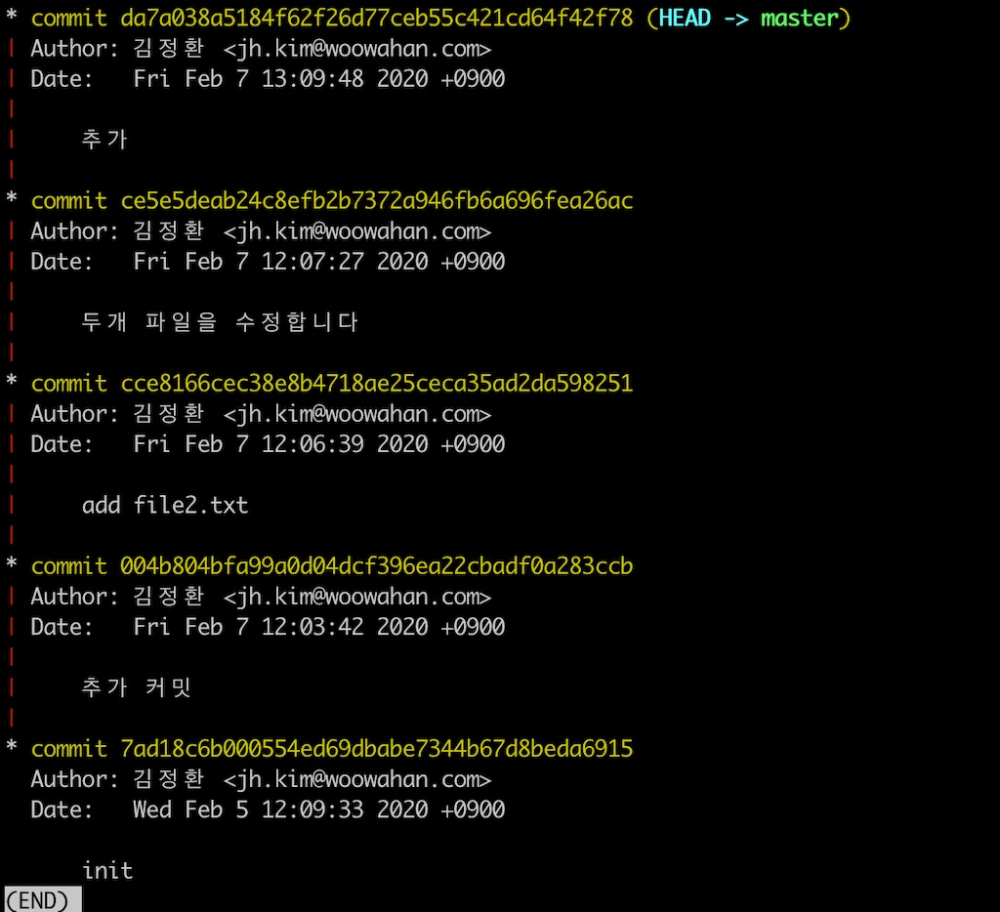
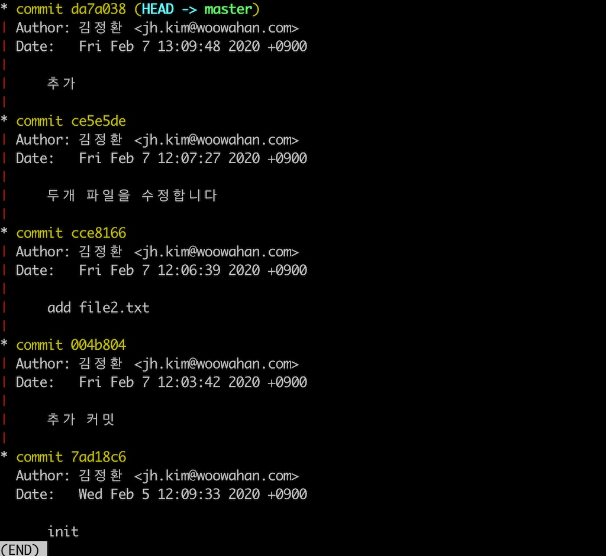
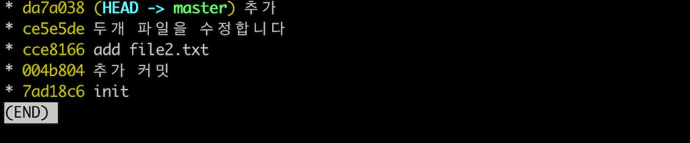
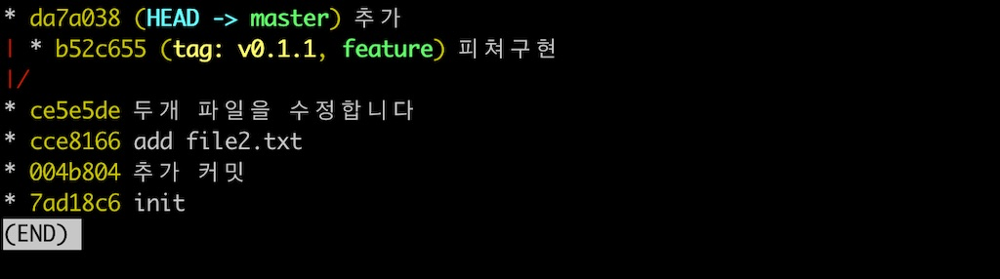

[git-usage](https://github.com/jeonghwan-kim/git-usage) 저장소가 어느새 스타 100을 넘었다.
에버노트에 정리한 것을 깃헙에 공유한 것인데 필요한 분들이 그만큼 많았나 보다.
기억나지 않을때 들춰볼 요량으로 명령어만 나열한 것인데,
다시 쭉 읽어보니 이해하기 어려운 부분도 종종 눈에 띈다.
여기에 살을 좀 더 덧붙여 **"깃 노하우"** 혹은 **"팁"**을 정리해 보면 좋겠다.

# 기본 개념과 명령어

## 초기화

깃을 올바로 사용하려면 깃이 파일의 변경 내용을 추적하는 방식을 이해하는 것이 무척 중요하다.
그렇지 않고 백업 용도로만 깃을 사용하면 장님이 코끼리 만지는 것처럼 딱 그만큼만 알게 되기 때문이다.

깃은 폴더의 어떠한 파일이라도 모두 트래킹 할 수 있다.
원하는 폴더로 이동해 깃 초기화 커맨드부터 시작한다.

```
git init
```

.git 라는 이름의 숨김 폴더가 하나 생긴다.
이것을 저장소라고 하는데 깃은 이 폴더의 모든 변경 내용을 여기에 저장한다.
이 파일을 지우면 더 이상 깃으로 폴더의 변경사항을 추적할 수 없다.

## 스테이징

깃이 파일의 변경 내역을 저장하는데 곧바로 저장하는 것이 아니라 **"스테이징"**이라는 단계를 거친다.
스테이징은 변경사항 중에서 **"저장하고 싶은 부분만 선택해 임시로 저장"**하는 개념이다.
코드를 변경하고 깃 상태를 먼저 봐보자.

```
git status

Untracked files:
  (use "git add <file>..." to include in what will be committed)

  file.txt
```

폴더의 현재 변경 상태를 보는 명령어다.
폴더에는 file.txt 파일이 있는데 아직 깃이 이 파일을 트래킹하지 않아서 "Untracked files" 목록에 있다.

추적하고 싶은 파일을 스테이지에 넣기 위해서는 변경된 파일을 선택하거나,

```
git add file.ext
```

폴더의 전체 변경 사항을 지정할 수 있다.

```
git add .
```

스태이징된 파일은 이렇게 커밋 직전 상태로 변경된다.

```
git status

Changes to be committed:
  new file:   file.ext
```

## 커밋

깃이 폴더의 변경 내용을 저장하는 단위를 **"커밋(commit)"**이라고 부르는데, 이처럼 먼저 스테이지 상태에 두어야만 비로소 커밋을 만들 수 있다.
스테이지에 있는 내용으로 커밋을 만드려면 `commit` 명령어를 사용한다.

```
git commit
```

기본 에디터가 열리고 변경 내용을 기록할 수 있는 입력 화면이 나온다.
변경 내용을 설명할 수 있는 텍스트를 입력하고 저장하면 커밋이 생성된다.

에디터를 열지않고 터미널에서 바로 메세지를 입력할 수 있는 `-m` 옵션도 자주 사용한다.

```
git commit -m "여기에 커밋메세지를 입력합니다."
```

매번 변경사항을 스테이징하고 커밋하는게 번거롭다면 `-a` 옵션을 사용하자.
신규 파일을 제외하고 트래킹하는 모든 파일의 변경사항을 스테이징함과 동시에 커밋을 만들 수 있는 옵션이다.
`-m`과 함께 사용할 수 있다.

```
git commit -am "스태이징과 커밋을 한번에!"
```

커밋을 만들지 않고 이전 커밋에 변경사항을 추가하고 싶은 경우도 있다.
가끔 이전 커밋에 미쳐 포함하지 못한 코드가 있을 수 있는데,
이전 커밋에 현재 변경 내용을 추가할 때는 `--amend` 옵션을 사용한다.

```
git commit --amend
```

에디터가 뜨면서 마지막 커밋 메세지를 수정하는 화면이 나온다.
저장하고 에디터를 닫으면 이전 커밋에 변경내용이 추가된다.

## 로그

스태이징을 거쳐 커밋한 결과를 어떻게 볼 수 있을까?
깃은 커밋 목록을 **"로그(log)"**라는 형식으로 볼 수 있다.

```
git log

commit 5ede63b20ee6237c345a7595d6f353c86eb3388b (HEAD -> master)
Author: Kim Jeonghwan <ej88ej@gmail.com>
Date:   Mon Feb 3 09:36:02 2020 +0900

  두번째 커밋입니다.

commit 289bd6a304b05cd11bafaf5416570b41ff96cf1c
Author: Kim Jeonghwan <ej88ej@gmail.com>
Date:   Mon Feb 3 09:26:06 2020 +0900

  첫번째 커밋입니다.
```

두 개 커밋이 있는 로그다.
각 커밋을 식별할 수 있는 커밋 해쉬값이 먼저 나온다.
그 다음 커밋 작성자와 작성일자, 마지막으로 변경 내용을 기록한 커밋 메세지를 확인할 수 있다.

커밋에 변경 내용이 반영되었는지 보려면 `show` 명령어를 사용한다.

```
git show

 테스트 파일입니다.
-수정함
+지우고 수정함
```

삭제한 라인은 앞에 `-`를 추가한 라인은 `+`로 표시한다.

특정 커밋의 변경사항을 보고 싶다면 로그에 있는 커밋 해쉬로 볼 수 있다.

```
git show 289bd6a304b05cd11bafaf5416570b41ff96cf1c
```

## 브랜치

깃에서 중요한 또 하나의 개념은 **"브랜치(branch)"**다.
로그에서 보는 것처럼 깃이 관리하는 변경 이력은 마치 자라나는 나무같다.
그래서 "깃 트리"라고 하는지도 모르겠다.
나무는 성장하면서 또 다른 가지를 뻗어 내는데, 깃도 이런 방식의 가지를 만들 수 있고 이 가지를 브랜치라고 부른다.

브랜치를 만드는 이유는 뭘까? 지금하고 있는 작업과 성격이 다른 작업을 할 때 브랜치를 만든다.
가령 A 기능을 만들다가 B 기능을 만들어야 한다면 브랜치를 새로 만들어 B를 개발하는 방식이다.

깃은 기본적으로 master라는 이름의 브랜치를 하나 가지고 있다. `branch` 명령어로 브랜치 목록을 확인하자.

```
git branch

* master
```

그럼 지금 작업하고 있는 내용과 성격이 다른 작업을 하기 위해 feature라는 이름의 브랜치를 하나 만들어보자.
`branch` 명령어를 사용할 때 두 개 브랜치 명을 전달하는데 "생성할 브랜치 명" "기준 브랜치명" 순서다.

```
git branch feature master
git branch

  feature
* master
```

feature 브랜치가 추가되어 총 두 개의 브랜치가 있다.
여전히 현재 브랜치는 앞에 별표(\*)가 있는 master 브랜치다.
새로 만든 브랜치로 이동하고 싶은데 깃에서 브랜치간의 선택은 **"체크아웃한다(ckeckout)"**라고 표현한다.

```
git checkout feature
git branch

* feature
  master
```

이 둘을 한번에 하려면, 즉 브랜치를 만들면서 선택하려면 기준 브랜치에서 `-b` 옵션을 주고 체크아웃 하는 방법이 있다.
예를 들어 master 브랜치에서 feautre 브랜치를 만들고 체크아웃 하려면 이렇게 하면된다.

```
git checkout -b feature
```

feature 브랜치에서 개발하고 커밋을 계속 만든 뒤 그 다음 단계는 뭘까?
브랜치에 만든 커밋들을 다시 원래 브랜치인 master에 반영해야 한다. 이것을 **"병합(merge)"**이라고 부른다.

```
git checkout master
git merge feature
```

기준이 되는 master 브랜치로 이동한 뒤, feature 브랜치를 master에 머지한다.

## 헤드

브랜치간에 이동하다 보면 현재 내가 어느 브랜치에서 작업하는지 알아야 한다.
간단하게는 브랜치 목록에서 현재 어느 브랜치 알 수 있다.

```
git branch

  feature
* master
```

앞에 별표(\*)된 것이 선택된 현재 브랜치다.

위치를 좀 더 정확하게 보여주는 정보가 있는데 바로 **"머리(HEAD)"** 라고 부르는 것이다.
헤드는 여러 개 가지로 뻗어있는 브랜치와 커밋 목록에서 현재 위치를 나타낸다.

```
git log

commit 23427f8fb1baa80a5f0c9f974ba16dd0212edd69 (HEAD -> master)
commit d4b18ac8dc8f1e29a6082163b9329ffabd5bca96 (feature)
commit 18383c3d504208864ec73e7845d126a4824a43d6
```

master 브랜치 끝에 헤드가 표시되어 있다. 지금 작업하고 있는 위치다.

체크아웃 하면서 브랜치를 이동할 때 마다 헤드는 수시로 변경된다.
뿐만 아니라 특정 커밋으로 체크아웃 할 수 있는데 이 때도 헤드는 그 커밋으로 이동한다.

```
git checkout 18383c3d504208864ec73e7845d126a4824a43d6
git log

* 23427f8fb1baa80a5f0c9f974ba16dd0212edd69 (master)
* d4b18ac8dc8f1e29a6082163b9329ffabd5bca96 (feature)
* 18383c3d504208864ec73e7845d126a4824a43d6 (HEAD)
```

# 상황별 팁

이 정도로 깃에 대해 개념을 간다히 정리하고, 상황별로 깃 명령어를 어떻게 사용할 수 있는지 알아보자.

## "필요한 라인만 커밋하고 싶어요"

보통 변경된 **파일**을 스태이징한 뒤 이것을 커밋하기 때문에 커밋은 파일단위로 묶이게 된다.
의미있는 커밋 메세지를 유지하려다보면, **파일의 라인** 단위로 변경사항을 묶고 싶을 경우가 있다.
지금까지 이런 식의 커밋을 위해 변경된 내용을 복사 붙여넣기 했다면 아래 방식도 사용해 보길 바란다.

```
git add -p
```

변경한 라인만 스태이지에 넣는 것이 바로 `-p` 옵션이다.
이렇게 하면 변경된 파일을 하나씩 열어 스태이징 할지 말지 결정하면 된다.

```
 기존 코드입니다.

+여기는 나중에 커밋하고요

 기존 코드입니다.

-
+이 부분을 커밋하고 싶어요.
+이곳도 나중에 커밋합니다.
Stage this hunk [y,n,q,a,d,s,e,?]? s
```

`s`(split)를 입력하면 변경 단위를 더 세밀하게 쪼갠다.

```
기존 코드입니다.

+여기는 나중에 커밋하고요

 기존 코드입니다.

 Stage this hunk [y,n,q,a,d,j,J,g,/,e,?]? n
```

기존 코드 기준으로 변경사항을 분할해서 보여준다.
이 부분을 스태이징에서 제외하려면 `n`(no)을 입력하고 다음 분할 부분으로 넘어간다.

```
 기존 코드입니다.

+이 부분을 커밋하고 싶어요.
+이곳도 나중에 커밋합니다.
Stage this hunk [y,n,q,a,d,K,g,/,e,?]? e
```

변경된 코드가 연속으로 있을경우 깃은 스스로 코드를 분할할 수 없다.
이러한 경우에는 `e`(edit)를 입력하고 편집 모드로 들어가 직접 스테이징할 라인을 선별할 수 있다.

```
# Manual hunk edit mode -- see bottom for a quick guide.
4  기존 코드입니다.
5
7 +이 부분을 커밋하고 싶어요.
8 +이곳도 나중에 커밋합니다. --> 스테이징에서 제외하려면 이 라인을 삭제한다
```

추가된 코드 중 7번 라인만 스테이징하려고 한다. 이 부분을 남겨두고 아래 8번 라인만 제거하면 된다.

이렇게 선택적으로 스태이징한 뒤 커밋하면 훨씬 의미있는 커밋을 만들 수 있다.

이제 이걸 커밋으로 생성해야하는데 커밋에 `-v`(verbose) 옵션을 주면 스태이징된 부분을 자세히 볼 수 있다.

```
git commit -v
```

## "커밋의 변경내용을 자세히 보고 싶어요"

깃은 파일의 변경 내용과 요약 메세지, 작성자, 작성일 등의 메타 정보를 모두 합쳐서 하나의 커밋을 만들어 낸다.

`log` 명령어로 간단한 커밋 정보를 볼 수 있었다면 `show` 명령어로 더 자세한 내용을 조회할 수 있다.

```
git show

 기존 코드입니다.

-여기는 삭제될 부분이에요.

+여기를 마지막에 추가했어요
```

기존 내용에서 삭제/추가한 부분으로 나누어 표시한다.
삭제한 줄은 `-`로 추가한 줄은 `+`로 확인할 수 있다.

그런데 깃 트리에 있는 많은 커밋중에 어떤 커밋의 내용을 보여주는 걸까?
`show`는 기본적으로 HEAD가 가리키고 있는 커밋의 정보를 조회한다.
특정 커밋의 내용을 보려면 커밋 식별자인 **커밋 해쉬**로 식별한다.

```
git show 7ad18c6b000554ed69dbabe7344b67d8beda6915
# 혹은
git show 7ad18c6
```

해쉬값을 사용하거나 이 값이 너무 기니깐 앞의 7자리만 사용해서 해쉬값에 해당하는 커밋의 변경사항을 볼 수 있다.

하나의 커밋에서 많은 파일을 변경했을 경우에는 파일별로 변경내용을 요약해서 볼 수도 있다.

```
git show --stat

 두개 파일을 수정합니다

 file.txt  | 5 +++--
 file2.txt | 1 +
 2 files changed, 4 insertions(+), 2 deletions(-)
```


file.txt는 5개 라인을 변경했는데 3줄을 추가하고 2줄 삭제했다.
file2.txt는 1줄을 추가했다.
총 2개 파일을 변경했고 4줄 추가하고 2줄 삭제한 커밋이다.

주로 과거에 작업했던 내용을 찾아볼 때 이 명령어를 자주 사용한다.
어떤 내용을 변경했는지 라인별로 확인하고 한 커밋에 변경한 파일이 많으면 `--stat` 옵션으로 파일 목록을 확인한다.

그런 뒤 특정 파일의 변경사항은 파일명을 지정해서 확인하는 편이다.

```
git show 7ad18c6 file.txt
```

이렇게 커밋 내용을 자세히 볼 수 있기때문에 웬만하면 주석는 그냥 지우는 편이다.
삭제했다는 내용의 메세지로 커밋을 저장하고 나중에 주석 대신에 삭제한 커밋을 들여다 보는것이 코드를 비교적 가볍게 가져갈 수 있기 때문이다.

## "커밋하기는 좀 그렇고… 변경사항을 임시 저장할 수 있나요?"

작업을 하다가 임시 저장해야하는 상황이 있다. 커밋 메세지도 떠오르지 않고 그냥 잠깐 저장하고 다른 작업을 하고 싶을때 그렇다.
처음에는 "WIP"(Work In Progress) 라는 작업중 메세지로 커밋을 만들곤 했었다.

하지만 몇 년전부턴 동료들이 `stash` 명령어를 사용하는 걸 보곤 나도 무척 잘 활용하고 있다.
"숨겨두다"라는 의미의 이 명령어는 커밋하기는 충분치 않지만 저장은 해야하는 이런 상황을 위한 것이다.

```
git stash
```

이 명령어를 실행하고 나면 현재 폴더의 변경내용이 다른 어딘가로 저장되고 변경된 내용이 파일에서 사라진다.

스태쉬도 커밋처럼 하나의 단위로 저장되는 스태시 목록을 확인할 수 있다.

```
git stash list

stash@{0}: WIP on master: 7ad18c6 두개 파일을 수정합니다
```

여기서 한번 더 내용을 수정하고 스태시하고 목록을 보면 추가된 스태시가 기존 목록 위에 쌓인다.
마치 스택처럼 말이다.

```
git stash list

stash@{0}: WIP on master: 7ad18c6 두개 파일을 수정합니다
stash@{1}: WIP on master: 7ad18c6 두개 파일을 수정합니다
```

임시 저장한 변경 내용을 되돌리려면 팝(`pop`)으로 꺼낸다.

```
git stash pop
```

그럼 임시 저장했던 변경 내용들이 파일에 다시 복구되었을 것이다.

지라 같은 업무 관리 툴로 일을 하다보면 업무 간에 스위칭이 잦은 경우가 있다.
이 때 잠시 스태쉬로 지금 작업 내용을 저장하고 다른 업무을 보면 좀 더 코드 관리하기가 쉽다.

## "히스토리를 예쁘게 보고 싶어요"

로그 트리 때문에 터미널에서 깃을 사용하는걸 부담스럽게 여긴다면 잠깐만 여길 봐 보시라.
깃 로그 명령어는 꽤 많은 옵션을 가지고 있다. 먼저 `--graph` 옵션으로 로그를 봐 보자.

```
git log --graph
```



터미널에서도 그래프를 볼수 있다는 점에 놀라웠는가? 이제 여기에다가 조금씩 그래프를 예쁘게 만들어 볼수 있다.

보통 커밋해쉬를 다 보진 않는다. 해쉬값 전체를 사용하는 경우도 없었고 말이다. (내경험은 그랬다)
커밋 해쉬값을 앞에 7자만 간단히 보여주는 것이 좋겠다. `--abbrev-commit` 옵션을 추가해 보자.

```
git log --graph --abbrev-commit
```



커밋해쉬값이 짧아져서 좀 덜 부담스럽다.

하나의 로그가 좀 길다. 중요한 메세지만 남기고 로그 그래프를 더 보고 싶다면 `--pretty` 옵션을 추가 해보자.

```
git log --graph  --abbrev-commit --pretty=oneline
```



커밋 해시와 메세지만 한 줄로 나오고 더 많은 커밋 그래프를 볼수 있다.

모든 브래치와 태그를 함께 보고 싶은가?

```
git log --graph  --abbrev-commit --pretty=oneline --all
```

master 브랜치 외에도 feature 브랜치의 트리도 볼 수 있다. 뿐만 아니라 태그도 같이 표기한다.



밋밋했던 커밋 로그가 그래픽 도구 못지 않게 훌륭해졌다.

## "히스토리를 변경하고 싶어요"

A작업을 마치고 커밋, B작업을 마치고 커밋, A' 작업을 마치고 커밋을 만들었다.
깃 로그는 A -> B -> A' 순으로 쌓이게 된다.
이왕이면 관련된 커밋을 한 곳으로 모으고 싶다.

지라 따위의 애자일 도구를 사용한다면 이런 경우가 자주 발생할 수 있다.
작업 번호로 커밋 메세지를 만들텐데 앞에 지라 번호를 붙여서 메세지를 작성할 것이다.

```
* da964a1 [TASK-A] A 작업 추가함  (HEAD -> master)
* 758713d [TASK-B] B 작업함
* d323105 [TASK-A] A 작업함
```

마지막 두 개 커밋의 순서를 바꾸면 작업을 이해하는데 더 좋고 의미있는 커밋이 될 것 같다.
코드의 가독성 뿐만 아니라 커밋의 가독성도 그것만큼 중요하니깐 말이다.

**"리베이스(`rebase`)"**를 이용하면 커밋 순서를 변경할 수있다.

```
git rebase -i HEAD~3
```

HEAD를 포함한 이전 3개 커밋을 재작성(rebase) 한다는 뜻이다.

에디터가 열려 커밋 목록이 나오고 여기서 순서를 변경할 수 있다.

```
1 pick d323105 [TASK-A] A 작업함
2 pick 758713d [TASK-B] B 작업함
3 pick da964a1 [TASK-A] A 작업 추가함
4
5 # Rebase 23427f8..da964a1 onto 23427f8 (3 commands)
6 #
7 # Commands:
8 # p, pick <commit> = use commit
9 # f, fixup <commit> = like "squash", but discard this commit's log message
```

만약 두개 커밋을 하나로 합치고 싶다면 마지막에 있는 'A 작업 추가함'을 2번 라인으로 옮긴다.
그리고 `pick` 대신 `fixup` 혹은 줄여서 `f`를 입력한다.
그럼 이 커밋을 1번 라인에 있는 커밋과 합친다는 의미다(리베이스 액션에 대한 자세한 설명은 하단에 주석을 참고하기 바란다).

```
1 pick d323105 [TASK-A] A 작업함
2 fixup da964a1 [TASK-A] A 작업 추가함
3 pick 758713d [TASK-B] B 작업함
4
5 # Rebase 23427f8..da964a1 onto 23427f8 (3 commands)
```

이렇게 수정하고 저장하고 편집기를 닿으면 1, 2번 라인의 변경내용을 합쳐 커밋을 다시 생성하는데 사용할 커밋메세지 입력을 위해 에디터가 다시 열린다.
저장하고 닫으면 커밋이 3개에서 2개로 변경된다.

```
* 1d31ae4 [TASK-A] A 작업함 (HEAD -> master)
* ebbc74a [TASK-B] B 작업함
```

## "브랜치간의 변경사항을 보고 싶어요"

master브랜치를 운영서버에 배포하고 develop 브랜치를 개발서버에 배포하는 구조라고 하자.
오늘이 배포하는 날이다. 어떤 사항을 배포하는 확인하고 싶을 경우가 있다. 커밋 단위로 말이다.

즉 지금 운영중인 master 브랜치에 비해 오늘까지 개발한 develop 브랜치의 변경사항을 커밋별로 보고 싶을 때는 아래 명령어를 사용하자.

```
git log mater..develop
```

기준이 되는 브랜치(여기서는 master)를 앞에 먼저 입력하고 `..` 뒤에 비교할 브랜치(여기서는 develop)를 입력한다.
이렇게 나온 커밋 목록으로 master 브랜치 대비 develop 브랜치에 추가한 변경내용을 파악할 수 있다.

## "원격 저장소와 연결하고 싶어요"

깃헙 같은 원격에 있는 저장소를 컴퓨터에 다룬로드하는 것을 **"복제(clone)한다"**라고 한다.

원격 저장소는 다운로드를 위한 주소를 제공하는데 git으로 시작되는 주소나 https로 시작하는 주소를 제공한다. ssh 방식이고 공개키가 서버에 등록되어 있다면 이 방식으로 다운로드할수 있다.
후자는 아이디와 비빌번호를 사용해서 다운로드 할 수 있다.

보통 깃헙을 원격저장소로 많이 사용하는데 공개키를 등록해서 ssh 방식으로 사용하는 편이다.

```
git clone {원격 저장소 주소}
```

다운로드한 원격 저장소는 저장소 이름으로 로컬에 폴더를 생성한다.
여기서 작업을 하고 커밋을 만든뒤 원격으로 내용을 업로드 하는 것을 "푸시(`push`)"라고 한다.

```
git push origin HEAD
```

협업하다보면 원격저장소를 클론한 다른 사용자가 코드를 먼저 푸시했을 수도 있다.
이렇땐 저장소의 최신버전을 가져와야하는데 이것을 **"패치(`fetch`)"**라고 한다.

```
git fetch
```

패치하면 원격 저장소의 최신 업데이트 내용을 로컬에 가져올 수 있다.

가져온 변경사항을 현재 브랜치와 머지하려면 `pull` 명령어를 사용한다.

```
git pull origin master
```

원격 저장소의 변경 내용을 가져와 로컬 저장소에 반영된다. 패스트 포워드가 가능하면 바로 반영하고 그렇지 않으면 머지 커밋을 추가로 만든다.

내가 작업한 내용을 깨끗히 유지하고 싶으면 머지 커밋을 만들지 않고 리베이스로 변경사항을 반영할 수도 있다.

```
git pull origin maseter --rebase
```

이렇게 하면 원격저장소에 있는 변경사항을 먼저 쌓고 그 위에 내가 작업한 변경사항을 쌓는 방식이다.

나는 머지보다는 리베이스를 선호하는 편이다. 커밋 그래프를 좀더 단순하게 유지하고 싶어서 그렇다.

## "원격 저장소를 여러개 관리하고 싶어요"

원격 저장소로 부터 클론하면 원격지 이름은 기본적으로 "origin"이다. `remote` 원격지를 관리하는
명령어인데 `-v` 옵션으로 원격저장소 목록을 볼 수 있다.

```
git remote -v
```

원격 저장소는 여러개 붙일 수 있다. 원격 저장소가 여러개 있어야할 이유는 뭘까?

깃헙 포크를 이용하면 이게 무척 유용하다.
깃헙의 포크는 타인의 계정에 있는 저장소를 내 계정의 저장소로 하나 가져오는 기능이다.
내 계정으로 포크한 저장소를 클론하면 기본 이름인 origin으로 가져온다.

만약 타인의 원격 저장소에 변경사항이 있는데 이걸 내 로컬에 가져오고 싶으면 어떻게할까?
이때 "원격 저장소 하나를 더 추가"할 수 있다. 보통은 upstream이란 이름으로 원격저장소 하나를 더 추가한다.

```
git remote add upstream {원격저장소주소}
```

이렇게 하면 하나의 저장소에 두 개의 원격지를 연결할 수 있다.
origin으로 내 원격 저장소에 코드를 푸시하다가, 원본 저장소의 변경사항을 받을때는 upstream을 사용한다.

원격 저장소의 주소를 변경하고 싶은때는 `set-url`로 변경할 수있다.

```
git remote set-url {변경된 원격저장소주소}
```

물론 원격 저장소의 이름을 변경할 수도 있다.

```
git remote -m {저장소이름} {저장소이름 신규}
```

# 정리

가끔 프로젝트를 맡게되면 기존 코드를 훑어보고 커밋 로그를 들여다 본다.
어떤 코드는 커밋 단위가 명확해서 코드를 변경한 의도가 쉽게 이해된다.
한편 정보가 부족한 커밋 메세지는 코드 변경내용만 보고 파악해야 하는데 이게 쉽지 않은 일이다.

특이 코드리뷰를 요청받게 되면 커밋 작성법에 대한 아쉬움이 많이 남는다.

"A 기능 구현" 이라고 메세지를 기록한 커밋을 들여다보면 구현한 코드의 양이 무척 많다.
그 코드에는 기능 구현을 위한 작업들이 통째로 들어가 있는 경우가 대부분이다.
에디터가 컨벤션 규칙에 따라 자동으로 수정한 변경 내용도 포함된 경우도 있다.
기능 구현과는 아무런 관계가 없는 코드인데도 말이다.

이런 코드리뷰는 사실 잘 안하게 된다.
깃 사용 방법을 조금이라도 더 알았더라면.. 그리고 조금만 더 꼼꼼하다면 이라는 아쉬움이 남는다.

코드 뿐만아니라 글도 깃을 활용하면 좋겠다는 생각을 한다.
물론 워드파일처럼 어플리케이션만의 인코딩 처리의 저장 방식을 따르는 파일을 변경사항까지 추적하는건 한계다.
만약 마크다운으로 글을 쓴다면 깃으로 관리하는 것이 무척 편하다. 지금 이 블로그도 그렇다.
