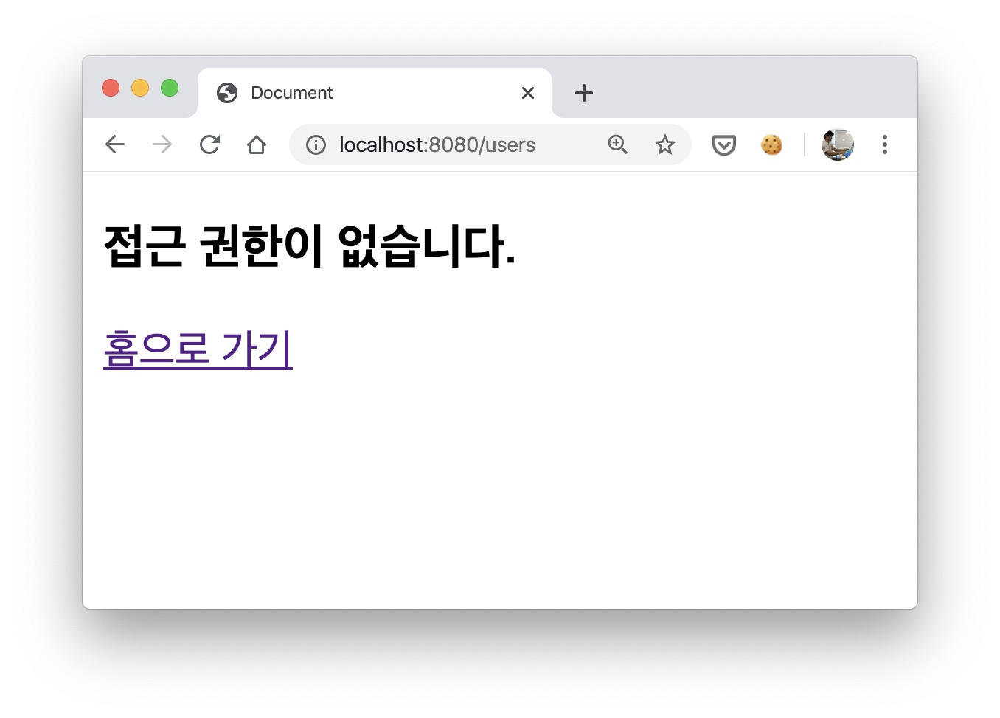
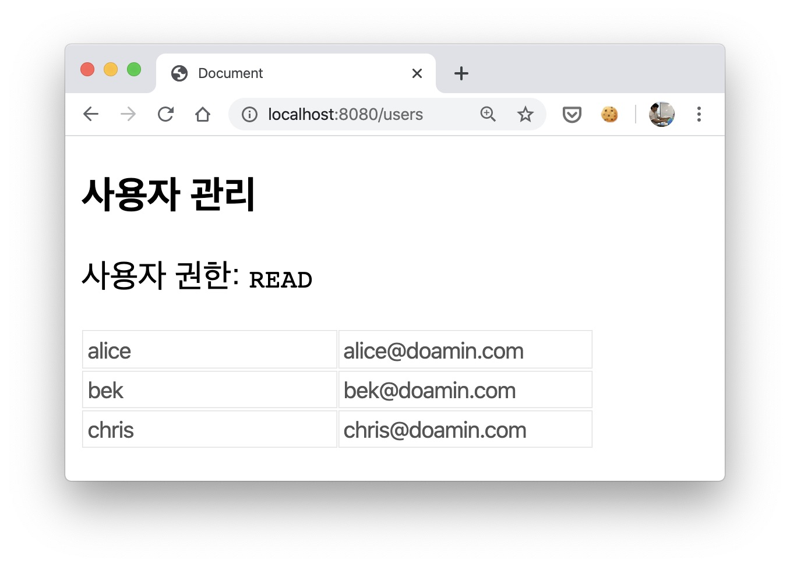
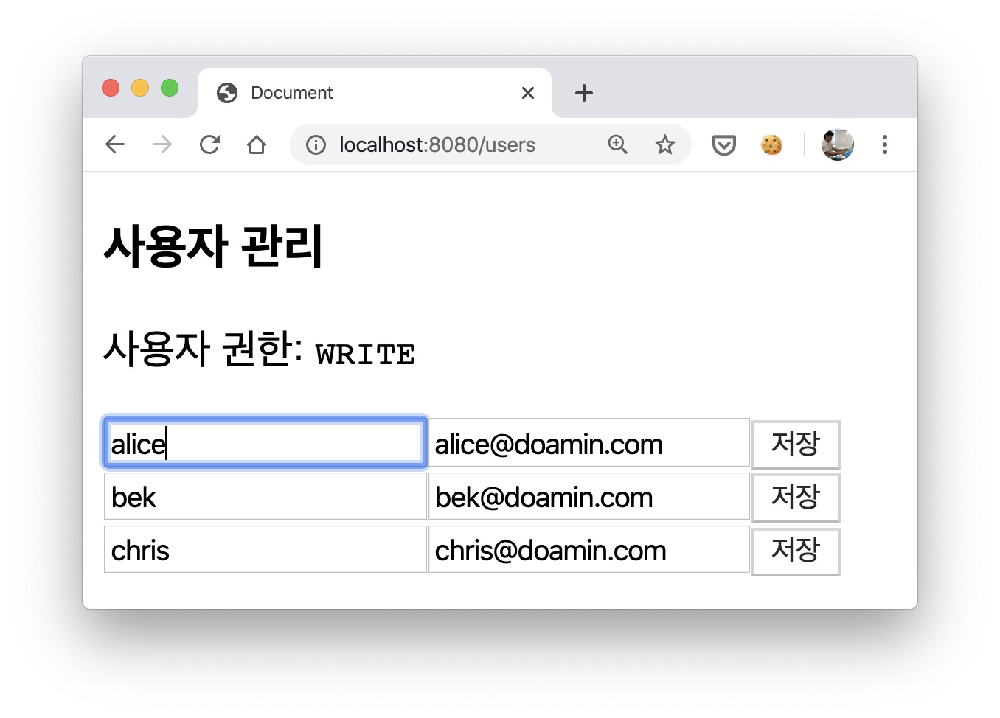

라우팅 로직을 만들때 매번 들어가는 것이 인증과 인가이다.
이 둘은 비슷하면서 엄연히 다른데 인증(Authentication)은 사용자를 식별하는 것이고,
인가(Authorization)은 식별된 사용자의 권한을 제어하는 것을 말한다.

인증과 인가에 따라서 분기 처리하는 라우팅 로직을 작성하는 것은 대부분의 어플리케이션에서 제공되어야 할 필수 기능이다.
이것은 프레임웍과 무관해서 비단 리액트, 뷰js, 그리고 서버를 만드는 노드js에서도 마찬가지다.

# 인증과 인가

그렇기 때문에 인증/인가에 대한 표준을 따르는 것이 중요한데, 난 오히려 이 표준이 더 헷갈리는 것 같다.
HTTP 상태코드중 요청 에러 코드인 401과 403이 그렇다.

- 401: Unauthrized (미승인)
- 403: Forbidden (금지됨)

비인가 요청일 경우 401을 사용했었는데 문서에는 Unauthrozied 즉 "미승인"으로 말하기 때문이다.
MDN 문서에 보면 의미상 "비인증"을 의미한다라고 나와 있다.

**인증**은 로그인 과정을 거친 뒤 부여하는 작업인데 로그인 실패시 서버는 401 코드를 응답하고, 클라이언트는 로그인 실패 화면을 그린다.

로그인이 완료된 이후 특정 리소스에 접근할 때, 권한 체크를 하는데 이것이 **인가**다.
권한이 있으면 리소스를 응답하고 그렇지 않은 경우 서버는 403 코드를 응답한다.
클라이언트는 사용자에게 리소스에 대한 접근 권한이 없다고 피드백 한다.

이 글에서는 리액트로 어떻게 인가를 처리할 수 있는지, 다시 말해 **프론트엔드에서 어떻게 권한 관리를 하는지** 정리해 보겠다.

# `<Route>` 인터페이스 살펴보기

리액트 라우터에서 라우팅을 담당하는 `<Route>` 컴포넌트를 살펴보자.

```ts
export interface RouteProps {
  component?:
    | React.ComponentType<RouteComponentProps<any>>
    | React.ComponentType<any>
  render?: (props: RouteComponentProps<any>) => React.ReactNode
  path?: string | string[]
  // 생략
}
```

component는 path로 정의한 url 요청이 들어왔을 때 어떤 컴포넌트를 보여줄지 정의하는 속성이다.

render() 함수도 이름으로 보면 component와 비슷한 역할을 하는 녀석인데 "함수"로 되어 있다는 점이 다르다.
요청 권한에 따라 컴포넌트를 그릴지 말지 결정하는 구조라면 이 render() 함수를 잘 사용하면 될 것같다.

단, 주의해야 할 것이 있는데 component 속성은 render 보다 우선하기 때문에 두 속성을 동시에 사용하지 말아야 한다.

# `<RouteIf>` 권한별 라우팅

`<Route>`를 감싼 컴포넌트를 만들어야겠다.
비슷하게 사용하지만 권한 정보를 받는 인테페이스를 갖도록 말이다.
권한에 따라 컴포넌트를 보여줄지 말지 결정하는 역할이므로 `<RouteIf>`라고 이름지었다.

```jsx
const RouteIf = ({ component: Component, rest }) => {
  return (
    <Route
      {...rest}
      render={props => {
        if (Component) {
          return <Component {...props} />;
        }
      }}
    />;
  )
};
```

여기까지는 `<Route>`와 똑같은 컴포넌트다.
렌더 함수를 조금만 만져보자.

```jsx
const RouteIf = ({ component: Component, ...rest }) => {
  return (
    <Route
      {...rest}
      render={props => {
        /* 권한이 없을 경우 */
        if (true) {
          return <FobiddenPage />
        }

        /* 권한이 있을 경우 */
        if (Component) {
          return <Component {...props} />
        }

        return null
      }}
    />
  )
}
```

render() 함수가 시작할때 권한없는 경우를 먼저 검사해서 `<ForbiddenPage>` 컴포넌트를 반환해 버리는 것이다.
그러면 아래 컴포넌트를 그리지 않고 권한 없음 화면을 그릴 것이다.

권한 검사를 하려면 적당한 값이 있어야 하는데 아래 ROLE 객체에 세 가지 값으로 구분했다.

```js
const ROLE = {
  NONE: "NONE", // 권한 없음
  READ: "READ", // 읽기 권한
  WRITE: "WRITE", // 쓰기 권한
}
```

권한 없음을 의미하는 "NONE"은 페이지 진입이 안된다.
render() 함수에서 권한 검사할때 사용할 값이다.
최소한 "READ" 권한이 있어야만 라우트 로직에 통과하고 정의된 컴포넌트를 그릴수 있다.

이렇게 진입한 화면에 인풋, 버튼 따위의 입력 컨트롤이 있을 경우는 "WRITE" 권한이 추가로 필요하다.
이 권한이 아닐 경우 데이터를 수정할 수 있는 모든 인풋 요소를 비활성화 해서 사용자 입력을 막을 것이다.
보통 어드민 어플리케이션일 경우 사용자 별로 조회만 하고 수정을 제한하는 정책을 쓰는데 이를 위한 것이다.

이 값을 render() 함수에서 사용해보면 이렇다.

```jsx
const RouteIf = ({ role, component: Component, ...rest }) => {
  return (
    <Route
      {...rest}
      render={props => {
        // 권한 체크
        if (role === ROLE.NONE) {
          return <FobiddenPage />
        }

        if (Component) {
          // role을 컴포넌트에 전달
          return <Component {...props} role={role} />
        }

        return null
      }}
    />
  )
}
```

간단하다. 권한이 없으면 `<ForbiddenPage>` 컴포넌를 반환하고 로직을 종료한다.

# 권한별 라우팅

자, 그럼 권한에 따라 라우팅하는 이 `<RouteIf>` 컴포넌트를 이용해 화면 접근 제어 로직을 만들어 보자.

## 페이지별 권한 테이블

권한 데이터는 언제, 어디에서 획득할 수 있을까?
로그인을 마치고나면 사용자는 인증된 상태이다.
서버가 사용자를 식별했다는 말이다.

서버는 인증된 사용자 모두에게 리소스 접근을 허용하지는 않는다.
사용자가 가진 권한에 따라 허용하거나 차단하거나 한다.
그렇기 때문에 사용자 별로 권한 정보를 가지고 있어야하는데, 로그인 후에 이 정보를 조회할 수 있다.

로그인 후, 혹은 권한 조회 API를 통해 응답받은 데이터를 아래 myRole 객체에 담으면 이런 모습이다.

```js
const myRole = {
  usersPage: ROLE.NONE, // 사용자 관리 화면
  productsPage: ROLE.READ, // 상품 관리 화면
  adPage: ROLE.WRITE, // 광고 관리 화면
  // ...
}
```

화면에 따른 권한값으로 구성된 객체다.
유저관리 화면은(usersPage) 쓰기권한, 상품관리 화면(products)은 읽기 권한, 그리고 광고관리 화면(adPage)은 권한없음이다.
이 유저가 그렇다.

## 권한없음

서버로부터 받은 이 권한 데이터를 라우터 로직에 녹여볼 수 있다.

```jsx
<BrowserRouter>
  <Switch>
    <Route path="/" exact component={HomePage} />
    <RouteIf
      path="/users"
      exact
      component={UserManagePage}
      role={myRole.usersPage}
    />
  </Switch>
</BrowserRouter>
```

홈(/) 주소는 모든 사용자가 접근할 수 있도록 권한 설정을 하지 않았다. 기본적인 라우팅만 설정했다.

/users 주소와 권한 관리 페이지인 `<UserMangePage>` 컴포넌트를 연결하고 권한 정보도 같이 전달해서 권한 제어를 하도록 했다.

`<RouteIf>` 컴포넌트는 role 값이 권한 없음(NONE) 임을 확인하고 `<ForbiddenPage>`를 렌더링할 것이다.



## 읽기 권한

role 값을 읽기 권한(READ)으로 바꿔보면 어떨까?

```js
<RouteIf path="/users" exact component={UserManagePage} role={ROLE.READ} />
```

role 값이 권한없음(NONE)이 아니므로 component 속성에 연결한 `UserManagePage` 화면을 그릴것이다.



이 화면에는 데이터를 수정할 수 있는 요소가 있는데 이 녀석들은 쓰기 권한이 없기 때문에 비활성화 된다.

이렇게 할수 있는 것은 `<RouteIf>`가 role 정보를 확용한 덕택이다.

```jsx
return <Component {...props} role={role} />
```

role 정보를 받은 `<UserManagePage>`는 role 값이 읽기권한(READ)이면 데이터를 수정할 수 있는 컨트롤러를 모두 비활성화 한다.

```jsx
const UserManagePage = ({ role }) => {
  return (
    <>
      <h3>사용자 관리</h3>
      <form>
        // 사용자 입력을 받지 않도록 비활성화
        <input disabled={role !== ROLE.WRITE}>
      </form>
    </>
  )
}
```

## 쓰기 권한

라우트에서 전달한 role 값이 쓰기 권한(WRITE)일 경우에만 비로소 인풋 요소를 활성화 한다.

```jsx
<RouteIf path="/users" exact component={UserManagePage} role={ROLE.WRITE} />
```

`<RouteIf>`는 role이 NONE 이 아니므로 화면 접근은 허용한다.



그리고 화면에서는 쓰기권한(WRITE)이기 때문에 요소의 disabled 속성이 해제되어 요소가 활성화 되었다.

- 전체코드: [https://github.com/jeonghwan-kim/react-route-sample](https://github.com/jeonghwan-kim/react-route-sample)
