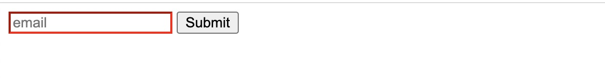
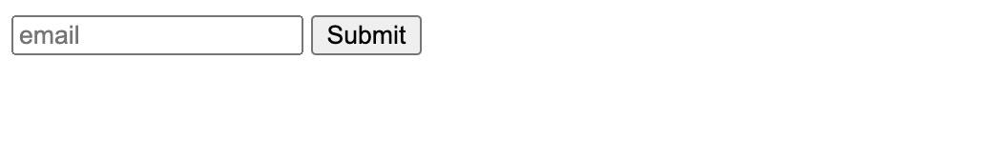
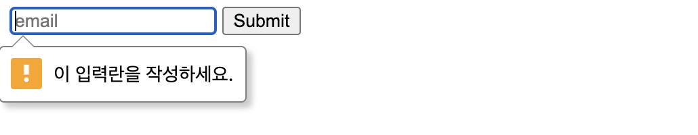
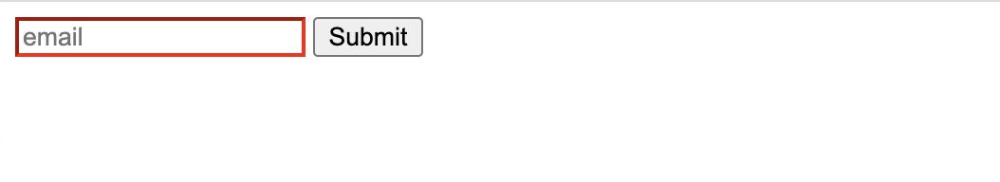
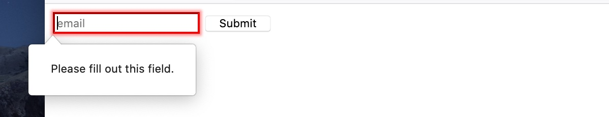
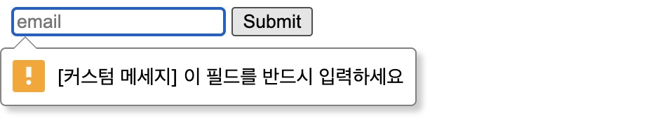
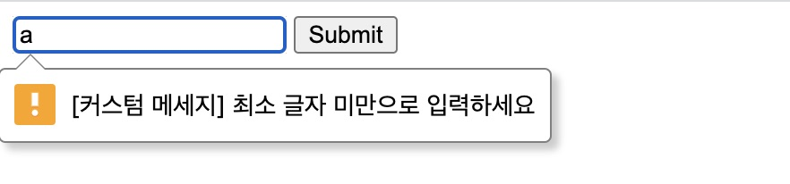
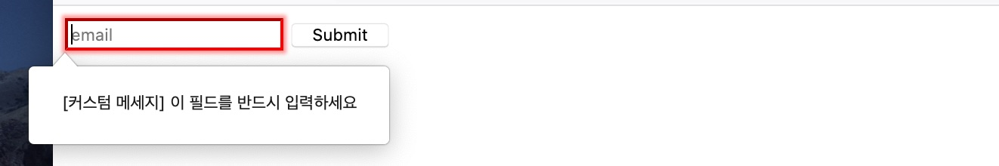
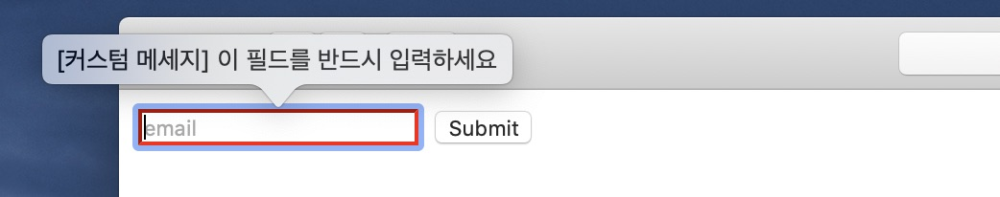
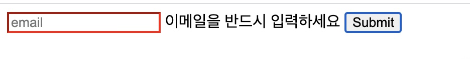

폼(Form)은 웹 개발 할 때 반드시 다뤄야 하는 기술이다.
로그인 화면, 글 작성 화면, 데이터를 다루는 커머는 어드민 화면까지 폼은 웹 개발에 있어서 폭넓게 사용되고 있다.

돌이켜 보면 그 때마다 적당한 폼 관련 라이브러리를 사용해서 화면을 만들었다.

- 앵귤러의 [ngForm](http://jeonghwan-kim.github.io/angular-form/)
- 뷰의 [vee-validate](http://jeonghwan-kim.github.io/2018/05/31/vue-form-validation.html#vee-validate)
- 리액트의 [antd](http://jeonghwan-kim.github.io/2018/10/13/ant-design-101.html)

하지만 브라우져가 자동으로 처리하는 폼 검증 기능을 꺼버리고(novalidate) 추상화된 라이브러리만 의존했던 것이 적잖케 아쉬웠다.
HTML5 스펙을 구현해 놓은 이 기술을 어느 정도는 이해하고 있어야 적정 기술을 선택하는데 도움이 되지 않을까?

HTML5 명세를 따르는 일명 모던 브라우져의 폼 동작 방식을 정리해 보자.

# 검증 속성(Validation attributes)

대부분 브라우져는 사용자로부터 입력 받은 값을 검증하고 개발자가 사용할 수 있도록 API를 제공한다.
가령 이메일 필드를 반드를 입력해야고 한다면 입력 요소에 `required` 속성을 추가한다.

```html
<form>
  <!-- required 속성을 추가했다 -->
  <input name="email" required />
  <button type="submit">제출</button>
</form>
```

`required` 속성 뿐이지만 브라우져는 필수 입력으로 알고 값을 검증한다.
사용자가 올바로 입력하고 제출하기 버튼을 클릭한다면 기대한 것처럼 서버로 폼을 전송한다.
반면 아무것도 입력하지 않고 제출하기 버튼을 클릭하면 다음과 같은 결과를 보여준다.


버튼을 클릭하면 브라우져의 검증 로직이 실행되고 요소에 추가한 `required` 규칙과 맞지 않기 때문에 폼을 전송하지 않는 것이다.
게다가 "이 입력란을 작성하세요"라는 오류 메세지도 요소 근처에 보여줌으로써 사용자로 하여금 올바른 입력을 유도한다.

이처럼 HTML5의 입력 요소는 `required`를 포함해 7가지 검증 속성([validation attributes](https://developer.moz5illa.org/en-US/docs/Learn/Forms/Form_validation))을 제공한다.

- `required` : 필수
- `minlength` / `maxlength`: 최소/최대 길이
- `min` / `max`: 최소/최대 정수
- `type`: 타입(이메일 등)
- `pattern`: 패턴(정규표현식)

# CSS 가상 클래스

검증 결과는 폼 제출 여부와 오류 메세지 뿐만아니라 입력 요소의 스타일에도 나타난다.
당장 눈에는 보이지는 않지만 브라우져는 요소에 `:valid`와 `:invalid` 가상 클래스를 추가한다.

- `:valid`: 규칙에 맞는 값을 입력한 경우
- `:invalid`: 규칙에 맞지 않은 값을 입력한 경우

이를 활용하면 좀 더 명확한 UI를 만들 수 있겠다.

```css
input:invalid {
  border-color: red;
}
```

요소에 입력한 값이 규칙에 어긋날 경우 붉은색 테두리로 표시하도록 했다.
트위터 부트스트랩 등 여러 라이브러리에서 이런 방식의 UI를 사용한다.



정리하면 HTML5 스펙을 따르는 모던 브라우져는 아래 방식으로 폼 입력 값을 처리한다.

- 사용자가 요소에 값을 입력
  - 검증 결과에 따라 `:valid/:invalid` CSS 가상 클래스 추가
- 사용자가 폼 데이터 전송 시도
- 규칙에 따라 입력 값 검증
  - 통과하면 데이터를 서버로 전송
  - 통과하지 못하면 서버 전송 차단
    - 오류 문구를 노출

# 오류 메세지를 차분하게 보여주자

사실 이전의 UI는 좀 성급하다.
무슨 말인가하면, 화면에 진입한 뒤 값을 입력하기도 전에 결과를 먼저 보여 준다는 것이다.
사용자 입장에서는 아무것도 입력하지 않았는데 틀렸다고 말하는 것 같아 긴장감을 준다.

폼 제출을 시도한 뒤에 결과를 알려줘도 늦지 않다.
브라우져의 기본 오류 메세지는 이미 그렇게 동작하고 있다.
붉은 테두리도 폼 제출후에 표시되도록 개선하면 좋겠다.

폼 제출을 시도하면 브라우져는 폼의 입력값을 검증하고 실패하면 [invalid](https://developer.mozilla.org/en-US/docs/Web/API/HTMLInputElement/invalid_event) 이벤트를 발생시킨다.
이 시점에 검증되었다는 표시를 해두면 이걸 보고 요소에 붉은색 표시를 하면 되겠다.

폼 요소에 클래스명을 추가하는 방식을 사용해 보자.

```js
document.querySelectorAll("input").forEach(input => {
  input.addEventListener("invalid", () => {
    // 검증 후 폼 요소에 was-validated 클래스로 표시해 둔다
    document.forms[0].classList.add("was-validated")
  })
})
```

폼 검증에 실패할 경우 폼 요소에 `.was-validated` CSS 클래스를 추가했다.
하위 입력 요소에서는 는 클래스가 있을 경우에만 `:invalid` 가상 클래스가 동작하도록 스타일을 수정하자.

```css
/* 검증 후에만 :invalid 스타일을 적용한다 */
form.was-validated input:invalid {
  border-color: red;
}
```

화면이 로딩되고 제출 버튼을 클릭하기 전까지 폼 요소에는 `.was-validated` 클래스가 없다.
입력 컨트롤에 검증 가상 클래스가 있더라도 이를 표시하지 않을 것이다.



제출한 뒤에는 오류 메세지가 표시되고,



요소에 붉은 색으로 테두리가 표시된다.



# Constraint Validation API

브라우져의 폼 검증 기능은 생각보다 많은 일을 해준다.
이미 살펴본 것처럼 일곱가지 규칙을 가지고 검증할 수 있다.
요소의 입력값이 유효하지 않을 경우 1) 폼 전송을 차단하고 2) 오류 메세지를 표시한 뒤 3) CSS 가상 클래스를 붙여준다.

만약 브라우져 로케일이 한글이 아니라면 오류 메세지는 해당 언어로 번역되어 표시된다.



이러한 브라우져의 기본 동작을 잘만 활용한다면 일이 무척 단순해진다.
하지만 이걸 사용할 수 있었던 적은 거의 없었다.
오류 메세지와 스타일, 그리고 언어가 브라우져 의존적이다보니 일관적이지 못하다는 의견이 대부분이다.

[Constraint Validation API](https://developer.mozilla.org/en-US/docs/Web/API/Constraint_validation)를 활용한다면 HTML5만으로도 오류 메시지를 요구사항에 맞게 커스터마이징할 수 있는 방법이 생긴다.

API의 인터페이스는 다음 두 가지 모습을 갖추어야 한다.

- 폼 컨트롤 요소가 가질 수 있는 검증 상태(ValidaityState)
- 제약 사항을 만족하지 못하면 invalid 이벤트를 발행

이미 사용했던 HTMLInputElement를 포함한 다음 7개 요소가 이 인터페이스를 따른다.

- HTMLButtonElement
- HTMLFieldsetElement
- HTMLInputElement
- HTMLObjectElement
- HTMLOutputElement
- HTMLSelectElement
- HTMLTextAreaElement

위 요소들은 다른 요소와 달리 검증 상태를 나타내는 속성을 가진다.

- validity: ValidityState를 나타내는 객체
- validationMessage: 검증 결과 메세지
- willValidate: 요소가 검증 후보인지 여부

또한 입력값을 검증하거나 invalid 이벤트를 발행하는 메소드도 가진다.

- checkValidity(): 폼 입력 값을 검증하고 유효하지 않으면 invalid 이벤트를 발행. false를 반환
- reportValidity()
- setCustomValidity(message): 오류 메세지 노출

# 커스텀 메세지 보여주기

검증 상태를 나타내는 validity 객체를 더 들여다 보자.

```js
input.addEventListener("invalid", () => {
  /**
   * ValidityState {
   *   badInput: false,  // 잘못된 입력
   *   customError: false, // 커스텀 오류
   *   patternMismatch: false, // 패턴 오류
   *   rangeOverflow: false, // 범위 초과 오류
   *   rangeUnderflow: false, // 범위 미달 오류
   *   stepMismatch: false, // 간격 오류
   *   tooLong: false, // 길이 오류
   *   tooShort: false, // 길이 오류
   *   typeMismatch: false, // 타입 오류
   *   valid: false, // 검증 결과
   *   valueMissing: true // 필수값 오류
   * }
   */
  console.log(input.validity)
})
```

입력 값이 유효하지 않으면 `invalid` 이벤트를 발행하는데, 이때 `input.validty`로 ValidityState 값에 접근할 수 있다.

각 오류 상태를 불리언 값으로 가지고 있다는 걸 눈여겨 봤다.
이를 이용해 오류 메세지 사전을 만들고 메세지 조회 함수를 만들면 커스텀 메세지를 관리할 수 있을것 같다.

```js
// 오류 메세지 사전을 만든다
const validityMessage = {
  badInput: "[커스텀 메세지] 잘못된 입력입니다.",
  patternMismatch: "[커스텀 메세지] 패턴에 맞게 입력하세요",
  rangeOverflow: "[커스텀 메세지] 범위를 초과하였습니다",
  rangeUnderflow: "[커스텀 메세지] 범위에 미달하였습니다",
  stepMismatch: "[커스텀 메세지] 간격에 맞게 입력하세요",
  tooLong: "[커스텀 메세지] 최대 글자 미만으로 입력하세요",
  tooShort: "[커스텀 메세지] 최소 글자 미만으로 입력하세요",
  typeMismatch: "[커스텀 메세지] 형식에 맞게 입력하세요",
  valueMissing: "[커스텀 메세지] 이 필드를 반드시 입력하세요",
}

// validity 객체를 받아 메세지 맵에서 오류 메세지를 찾는다
function getMessage(validity) {
  for (const key in validityMessage) {
    if (validity[key]) {
      return validityMessage[key]
    }
  }
}
```

이제 invalid 이벤트가 발행되면 getMessage() 함수로 오류 메세지를 지정해 주면 되겠다.

```js
function showError(input) {
  /**
   * 커스텀 메세지: setCustomValidity()
   * https://developer.mozilla.org/en-US/docs/Web/API/HTMLSelectElement/setCustomValidity
   * - 오류가 있으면 문자열 전달
   * - 오류가 없으면 빈 문자열 전달
   */
  input.setCustomValidity(getMessage(input.validity) || "")
}

input.addEventListener("invalid", () => {
  // 커스텀 에러메세지 설정
  showError(input)
})
```

`setCustomeValidity(message)` 메소드는 오류가 있으면 문자열을 전달해 브라우져 오류 메시지를 표시한다.
그렇지 않으면 빈 문자열을 전달해 입력이 유효하다고 설정한다.


(requred 규칙에 대한 커스텀 오류 메세지)


(minlength 규칙에 대한 커스텀 오류 메세지)

검증 이후 요소 값이 바뀔 때도 오류 메세지를 표시하기 위해 input 이벤트에도 추가하자.

```js
input.addEventListener("input", () => {
  // 커스텀 에러메세지 설정
  showError(input)
})
```

# 커스텀 메세지 스타일링

오류 메세지를 표현하는 방식은 여전히 브라우져 의존적이다.


(파이어폭스 브라우져)


(사파리 브라우져)

메시지 UI의 일관성을 지켜야 한다면 각 브라우져의 스타일을 무시하고 직접 만들어야 할 것 같다.
인풋 요소 근처 적당한 곳에 오류 메세지를 보여줄만한 요소부터 추가하자.

```html
<input name="email" placeholder="email" required type="email" minlength="6" />
<!-- 오류 메세지를 보여줄 요소 -->
<span id="error"></span>
```

오류 메세지를 출력하는 `showError()` 함수를 이렇게 변경했다.

```js
function showError(input) {
  // 커스텀 오류 메시지 UI
  document.querySelector("#error").textContent = getMessage(input.validity)
}
```

`setCustomValidity()` 함수로 툴팁을 표시하도록 했던 이전 코드 대신, 요소에 메세지를 추가하도록 바꿨다.

검증 후 발생하는 invalid 이벤트 핸들러도 수정해야 한다.
이벤트가 발생하면 브라우져 검증 메세지를 표시하는 것이 기본 동작인데 이것을 차단하는 코드다.

```js
input.addEventListener("invalid", e => {
  // 브라우져 툴팁 숨김
  e.preventDefault()
})
```

이제 브라우져 기본 오류 메세지 스타일 대신 커스텀 스타일로 보여줄 수 있다.



# 결론

이제 브라우져의 폼 제어 기능의 범위에 대해 조금 알것 같다.
아주 간단한 코드만으로 폼을 검증하고 사용자에게 피드백할 수 있다는 점은 무척 매력적이다.
오류 메세지나 스타일을 커스터마이징 하는 것도 그렇게 부담스러운 작업은 아니다.

하지만 검증하는 로직에 있어서는 한계가 있는 것 같다.

- 서버 API를 이용하는 것처럼 비동기로 검증하는 경우
- 규칙이 요소간 의존적일 경우(가령 옵션을 선택시 색상이 필수)

이러한 부분은 기존의 검증 기능을 확장하거나 새로 만들어야하지 않을까?
어쩌면 라이브러리를 찾는 것이 답이 될 수도 있겠다.

참고

- [전체 코드](https://github.com/jeonghwan-kim/post_form-validation)
- [Client-side form validation](https://developer.mozilla.org/en-US/docs/Learn/Forms/Form_validation)
- [Why you should be using HTML5 form validation: a tour](https://pageclip.co/blog/2018-02-20-you-should-use-html5-form-validation.html)
