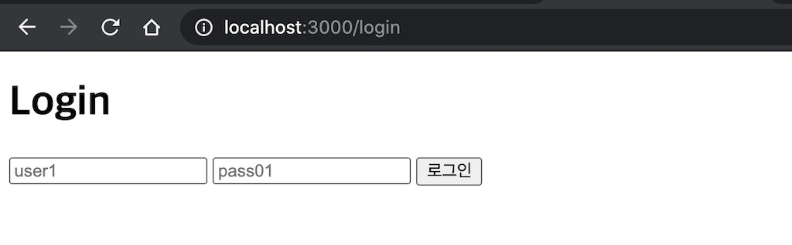

해외에 나가기 전 꼭 챙겨야 하는 것이 여권(passport)이다.
출국장에서 나의 신원을 확인해 주는 것이고 해외 입국장에서도 입국을 허가받을 수 있는 수단이기 때문이다.

서비스를 사용할 때도 등록된 사용자임이 확인되어야 기능을 사용할 수 있고 그렇지 않은 경우 일부 제한된다.
이것이 바로 로그인인데 노드에서는 [패스포트(passport)](http://www.passportjs.org/) 패키지를 많이 사용한다.

비교적 로그인 기능은 가끔 다루다 보니 사용할 때마다 헷갈렸다.
예전에 다뤘던 글이 있긴 한데 그동안 변경된 내용도 있고 구조도 들여다 볼 겸 다시 정리해보자.

# 준비

웹 어플리케이션에서 인증을 구현하기 위한 방법으로 **세션과 쿠키**를 주로 사용한다.
서버와 브라우져 역할을 간단히 정리하면

- 서버: 접속한 브라우져 정보를 세션에 저장, 세션 아이디를 브라우져에게 쿠키로 전달한다.
- 브라우져: 쿠키에 담긴 세션 아이디를 저장, 다음 요청부터는 헤더에 세션 아이디를 담아 서버로 전송한다.
- 서버: 이 값을 가지고 이전에 접속한 브라우져임을 식별할 수 있다.

## 세션 설치

익스프레스에서 세션을 사용하기 위해 [express-session](https://www.npmjs.com/package/express-session) 미들웨어를 사용하겠다.

```ts
// src/index.ts

import session from "express-session"

app.use(
  session({
    name: "mysession", // 쿠키에 저장될 세션키 이름
    secret: "qwer1234", // 세션 암호화를 위한 시크릿
    resave: true, // 옵션 참고
    saveUninitialize: true, // 옵션 참고
  })
)
```

세션 데이터를 브라우져에서 확인하기 위해 GET /debug 엔드포인트를 하나 만들었다.

```ts
// src/index.ts

app.get("/debug", (req, res) => {
  res.json({
    "req.session": req.session, // 세션 데이터
    "req.user": req.user, // 유저 데이터(뒷 부분에서 설명)
    "req._passport": req._passport, // 패스포트 데이터(뒷 부분에서 설명)
  })
})
```

브라우져로 localhost:3000/debug 에 접속하면 세션 정보를 확인 할 수 있다.

```ts
{
  "req.session": {
    "cookie": {
      "originalMaxAge": null,
      "expires": null,
      "httpOnly": true,
      "path": "/"
    }
  }
}
```

바로 이 **쿠키(cookie) 객체가 요청한 클라이언트로 전송**될 것이다.

## 로그인 폼

먼저 로그인 폼을 만드는 것부터 시작해 보자.

```html
<!-- public/login.html -->

<form action="/login" method="post">
  <input name="username" placeholder="user1" />
  <input name="password" placeholder="pass01" />
  <button type="submit">로그인</button>
</form>
```

사용자로부터 username과 password를 받아 폼을 제출하면 브라우져는 POST /login 으로 데이터를 전송할 것이다.

이 html 파일을 제공할 GET /login 엔드포인트를 라우터에 추가한다.

```ts
// src/index.ts

app.get("/login", (req, res) => {
  // login.html 경로
  const loginTemplate = path.resolve(__dirname, "../public/login.html")

  // html 파일을 제공한다
  res.sendFile(loginTemplate)
})
```

이제 브라우져로 localhost:3000/login에 접속하면 로그인 화면을 볼 수 있다.



## 로그인 폼 처리

폼을 입력하고 제출하면 이를 처리할 POST /login 엔드포인트를 만든다.

```ts
// src/index.ts

app.post("/login", (req, res, next) => {
  // TODO: credentials(username, password) 검증
})
```

로그인 컨트롤러에서부터 인증 기능을 시작하는 것이 좋겠다.

# 직접 만들어 보기: MyPassport

인증 패키지 passport를 직접 사용하기 전에 일부 기능을 직접 만들어 보면서 동작 원리를 이해하는 것이 좋겠다.

## 로그인 기능: authenticate()

인증 기능을 수행하는 MyPassport 클래스를 만들었다.

```ts
// src/lib/mypassport.ts

class MyPassport {
  // 세션에 저장할 인증정보 키
  readonly key = "userId"

  // 로그인
  authenticate() {
    // 미들웨어 함수를 반환한다
    return (req, res, next) => {
      try {
        // username, password로 디비에서 유저를 찾는다
        const { username, password } = req.body
        const user = users.filter(u => u.identify(username, password))[0]

        // 유저가 없으면 401 Unauthorized 를 응답한다
        if (!user) return res.sendStatus(401)

        // 유저를 찾으면 세션에 userId를 저장한다
        req.session[this.key] = user.id

        // 다음 미들웨어를 실행한다
        next()
      } catch (err) {
        // 로그인 과정중 에러가 발생하면 에러 미들웨어를 실행한다
        return next(err)
      }
    }
  }
}

// 싱글톤
export default new MyPassword()
```

세션에 로그인 정보를 저장할 때 사용할 속성 이름으로 `key`라는 클래스 멤버 변수를 만들었다.

`authenticate()` 메소드가 실제로 로그인을 수행하는 역할을 하는데 미들웨어 함수를 반환하여 익스프레스 어플리케이션과 호환성을 맞추도록 했다.

요청한 username과 password로 데이터베이스에서 일치하는 유저를 찾는다.

유저를 찾으면 **세션에 인증 정보를 저장**한다. 유저 아이디만 저장해서 최소한의 데이터만 세션에 유지하도록 했다.

만약 이 일련의 과정중에 예외가 발생한다면(가령 디비 연결 실패나 세션 초기화 실패 등) 에러 미들웨어가 처리할 것이다.

마지막으로 new 키워드로 인스턴스를 만들고 곧장 모듈로 노출시켜 싱글톤 객체로 만들었다.

## 로그인 컨트롤러

MyPassword 모듈로 로그인 기능을 만들었으니 로그인 엔드포인트에 적용해 보자.

```ts
app.post(
  "/login",
  // 인증 미들웨어를 추가
  mypassport.authenticate(),
  (req, res) => res.send("로그인 성공")
)
```

authenticate() 메소드가 반환한 미들웨어를 컨트롤러 함수 직전에 전달해서 인증과정을 먼저 수행하도록 했다.
인증에 성공한 뒤에야 컨트롤러 로직이 수행되는 것을 보장할 수 있다.

한편 인증에 실패하면 mypassport에서 401을 브라우져에 반환할 것이다.
예외가 발생하면 이후 오류 미들웨어에서 처리할 것이다.

로그인 후 세션 상태를 보면 userId 키에 사용자 아이디가 있다.

```ts
{
  "req.session": {
    "cookie": { /* ... */ },

    // userId가 추가 되었다
    "userId": 1
  }
}
```

userId는 세션에 저장되어 있기 때문에 이후 모든 요청에서 이 데이터가 지속될 것이다.

## 세션에서 로그인 상태 복구: session()

익스프레스 프레임워크는 요청 정보를 모두 Request 객체가 담고 있다.
유저 정보도 마찬가지로 **`req.user`**에 할당해서 관리하면 편할 것 같다.
컨트롤러 로직에서는 Request 객체를 통해 유저 정보에 접근하는 것이 보다 **일관적인 인터페이스**이기 때문이다.

그러면 모든 요청 앞단에서 세션에 잇는 로그인 정보를 req.user로 복구해 보겠다.

```ts
class MyPassport {
  // 세션의 로그인 정보를 복구한다
  session() {
    return (req, res, next) => {
      try {
        // 세션에 로그인 정보가 있으면
        if (req.session[this.key]) {
          // 유저 식별자로 디비에서 유저를 찾기 시도
          const user = users.filter(u => u.equal(req.session![this.key]))[0]

          // 유저를 찾으면 req.user 에 유저 객체 할당
          if (user) req.user = user
        }

        // 다음 미들웨어 실행
        next()
      } catch (err) {
        // 예외가 발생하면 오류 미들웨어가 처리한다
        next(err)
      }
    }
  }
}
```

**`MyPassport#seesion()`**은 세션에 저장된 로그인 정보를 이용해 유저 객체를 찾는 메소드다.

이전 요청에서 이미 로그인에 성공했다면 세션에는 로그인 정보(userId)가 남아 있을 것이다.

이걸 단서로 데이터베이스에 있는 유저를 찾아 req.user에 할당한다.
이후 미들웨어나 컨트롤러 함수에서 req.user로 요청한 유저를 조회할 수 있도록 편의를 제공하는 것이다.

어플리케이션에 적용하자.

```ts
// 세션 활성화
app.use(
  session({
    /* ... */
  })
)

// 세션에서 로그인 정보를 복구한다
app.use(mypassport.session())
```

세션 활성화 직 후 세션에 저장된 로그인 정보를 복구하도록 순서를 맞추어서 미들웨어를 세팅했다.

로그인 후 req 객체를 보면 이처럼 유저 정보가 세팅되어 있다.

```ts
{
  "req.session": {
    "cookie": { /* ... */ },
    "userId": 1
  },

  // req에 user 객체가 할당되었다
  "req.user": {
    "id": 1,
    "username": "user1"
  }
}
```

## 접근 제한: req.user

req.user를 통해 로그인한 유저 데이터를 조회할 수 있게 되었다.
그럼 **로그인에 성공한 유저만 접근**할 수 있는 엔드포인트를 만들어 보자.

GET /profile 은 사용자 프로필을 조회하기 때문에 로그인이 필요하다.
게스트로 접속했을 경우에는 예외 처리(403 응답)를 한다.

이런 식으로 사용할 수 있겠다.

```ts
app.get("/profile", (req, res, next) => {
  // 인증된 유저가 아닐 경우 403
  if (!req.user) {
    // 403 Forbidden을 응답한다
    return res.sendStatus(403)
  }

  // req.user 로 프로필을 조회한다
  res.json(ure.user)
})
```

미들웨어로 만들어 사용하면 더 간편해진다.

```ts
// 인증 여부를 체크하는 미들웨어
const isAuthenticated = () => (req, res, next) => {
  if (!req.user) {
    return res.sendStatus(403)
  }

  // req.user 가 있을 경우에만 다음 미들웨어를 실행한다
  next()
}

app.get("/profile", isAuthenticated(), (req, res, next) => {
  res.json(req.user)
})
```

## 로그아웃: req.logout()

마지막으로 로그아웃 기능을 만들어 보자.
로그인에 성공하면 세션에 userId를 저장한 것처럼 로그아웃은 이 데이터를 **삭제**하면 된다.

```ts
app.post("/logout", (req, res, next) => {
  // 세션에서 로그인 정보를 삭제한다.
  req.logout()
})
```

req.logout() 메소드는 아직없다.
req.user에서 했던 것 처럼 익스프레스 Request 객체를 확장해서 로그아웃 메소드를 추가해 보자.

```ts
class MyPassport {
  // 초기화 메소드
  initialize() {
    // 미들웨어를 반환
    return (req, res, next) => {
      // 로그아웃 메소드를 req 객체에 추가한다
      req.logout = () => {
        // 세션에 저장된 로그인 데이터를 제거
        delete req.session[this.key]
      }

      // 다음 미들웨어를 수행
      next()
    }
  }
}
```

**`MyPassport#initialize()`**는 익스프레스 어플리케이션에서 인증 관려 초기화 작업을 하는 미들웨어를 반환하는 메소드다.
세션에 저장된 인증 정보를 제거하는 로그아웃 함수를 Request 객체에 추가했다.

MyPassport#session()이 반환한 미들웨어를 어플리케이션에 추가한 것 처럼 이것도 마찬가지 형태로 설치한다.

```ts
// mypassport 초기화
app.use(mypassport.initialize())

app.use(mypassport.session())
```

이렇게 앞단 미들웨어에 req.logout() 메소드를 추가해 놓으면 이후 컨트롤러에서 로그아웃 메소드를 사용할 수 있다.

```ts
app.get("/logout", (req, res, next) => {
  // 로그아웃
  req.logout()

  res.send("로그아웃 성공")
})
```

로그아웃 이후 세션 상태를 보면 모두 삭제되었다.

```ts
{
  "req.session": {
    "cookie": {/* ... */}
  }
}
```

# passport 사용하기

지금까지 만들었던 mypassport 짚어 치우고 직접 **passport로 대체**해 보자.

먼저 초기화 작업과 세션에서 로그인 정보를 복구하는 코드를 대체한다.

```ts
import passport from "passport"

// 초기화
// app.use(mypassport.initialize())
app.use(passport.initialize())

// 세션에서 로그인 정보 복구
// app.use(mypassport.session())
app.use(passport.session())
```

passport는 정보를 req.\_passport 에 사용할 데이터를 저장하는데 확인하기 위해 /debug 컨트롤러를 좀 수정하자.

```ts
app.get("/debug", (req, res) => {
  res.json({
    "req.session": req.session,
    "req.user": req.user,

    // passport 정보를 들여다 보자
    "req._passport": req._passport,
  })
})
```

브라우져로 확인해 보면 req.\_passport에 추가된 데이터를 볼 수 있다.

```ts
{
  "req.session": {
    "cookie": {/* ... */}
  },

  // passport 데이터가 추가 되었다.
  "req._passport": {
    "instance": {
      "_key": "passport",
      "_strategies": { // 전략?
        "session": {
          "na
          me": "session"
        }
      },
      "_serializers": [],
      "_deserializers": [],
      "_infoTransformers": [],
      "_framework": {},
      "_userProperty": "user",
      "_sm": {
        "_key": "passport"
      },
      "strategies": {}
    }
  }
}
```

## 전략(strategies)

패스포트는 유저네임/비밀번호를 이용한 인증 뿐만 아니라 페북/트위터 소셜 인증, jwt 인증 등 방법이 무척 많다.
공통의 인증 로직은 passport가 담당하고 구체적인 방법은 "**전략**"이라는 개념으로 분리해 놓았다.

- 유저네임/비밀번호 인증은 passport-local
- 페북/트위터는 passport-facebook, passport-twitter
- jwt 방식은 passport-jwt

라는 전략을 각각 사용한다. 전략 패턴이다.

이러한 패스포트 전략은 npm 패키지로 얻을 수 있는데 전체 목록은 [여기](http://www.passportjs.org/packages/)서 확인할 수 있다.

유저네임/비밀번호를 이용한 "로컬 전략"이 우리가 사용한 인증 수단이다.
[passport-local](http://www.passportjs.org/packages/passport-local/) 패키지를 사용해서 계속 진행하자.

```ts
// lib/passport.ts

// 로컬 전략을 사용한다
import { Strategy } from "passport-local"

// passport에게 로컬 전략을 사용하라고 한다
// 요청 본문에서 username, passport 가 넘어온다
passport.use(
  new Strategy({ session: true }, (username, password, done) => {
    try {
      // 데이터베이스에서 일치하는 사용자를 찾는다
      const user = users.filter(u => u.identify(username, password))[0]

      // 콜백함수로 결과를 전달한다. 사용자가 없으면 false를 전달
      done(null, user ? user : false)
    } catch (err) {
      // 예외가 발생하면 콜백함수에 오류를 전달한다
      done(err)
    }
  })
)
```

`Strategy` 생성자 함수는 옵션 객체와 인증 정보로 사용자를 찾는 콜백함수를 받는다.

세션 사용을 알리는 옵션 객체를 전달했다.

콜백함수에서는 요청 바디에서 넘어온 username/password와 일치하는 사용자를 데이터베이스에서 찾는다.

사용자를 찾으면 user 객체를 넘기고 그렇지 않으면 false를 전달하여 로그인 실패를 처리하도록 한다.

Strategy 객체를 `passport.use()`로 등록하면 req.\_strategies에 등록한 전략 데이터를 기록한다.

```ts
{
  "req._passport": {
    "instance": {
      "_strategies": {
        "session": {
          "name": "session"
        },

        // 로컬 전략
        "local": {
          "_usernameField": "username",
          "_passwordField": "password",
          "name": "local"
        }
      }
    }
  }
}
```

## serializeUser/deserializeUser

passport는 세션에 최소한의 인증 정보만 저장한다.
로그인 한 뒤 세션에 데이터를 저장할때 어떤 정보를 저장할지를 결정하는 함수가 `serizliseUser`이다.

```ts
serializeUser<TUser, TID>(fn: (user: TUser, done: (err: any, id?: TID) => void) => void): void;
```

MyPassport는 유저 아이디만 저장했는데 이걸 커스터마이징 할 수 있는 것이 인자 fn 콜백함수의 역할이다.
fn 콜백함수는 인증 후 찾은 user와 done 콜백함수를 전달한다.
user를 통해서 세션에 저장할 데이터를 추리면 된다.
이 과정이 비동기일 수 있기 때문에 노드의 여느 함수처럼 완료시 done 콜백함수를 실행하면 된다.

간단히 유저 아이디를 저장하도록 했다.

```ts
passport.serializeUser((user: User, cb) => {
  cb(null, user.id)
})
```

반대로 세션에 저장한 데이터로 로그인한 유저 정보를 복구하는데 이걸 결정하는 함수가 `deserializeUser`다.

```ts
deserializeUser<TUser, TID>(fn: (id: TID, done: (err: any, user?: TUser) => void) => void): void;
```

serializeUser와 반대 동작을 한다고 이해하면 되겠다.
세션에 저장된 인증 정보(id)가 넘어오고 이걸로 유저를 찾은 뒤 done 콜백 함수를 호출하는 방식이다.

```ts
passport.deserializeUser((userId: number, cb) => {
  const user = users.filter(u => u.id === userId)[0]
  cb(null, user)
})
```

여기까지 passport로 대체하는 작업을 마쳤다.

로그인 한 뒤 요청 객체의 상태를 들여다 보자.

```ts
{
  "req.session": {
    "cookies": {/* ... */}

    // serializeUser에 등록한 함수가 동작
    "passport": {
      "user": 1
    }
  },

  // deserialzieUser에 등록한 함수가 동작
  "req.user": {
    "id": 1,
    "username": "user1"
  }
}
```

## 나머지 작업

로그인 컨트롤러에서는 등록한 전략으로 로그인하는데 문자열 "local"을 전달해 로컬 전략으로 로그인한다.
직접 만들었던 MyPassport#authenticate()는 인자없이 실행했는데 전략이 메소드 안에 포함된 구조였다.

```ts
// local 전략으로 로그인한다
app.post("/login", passport.authenticate("local"), (req, res, next) => {
  res.send("로그인 성공")
})
```

req.logout()은 이미 패스포트가 확장 처리했기 때문에 따로 설정하지 않아도 된다.

참고

- 소스코드: [https://github.com/jeonghwan-kim/post_passport](https://github.com/jeonghwan-kim/post_passport)
