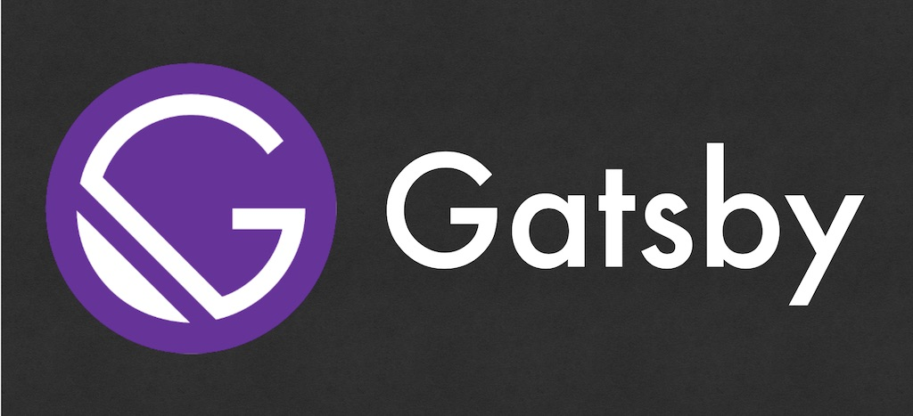

뷰와 리액트를 사용한 이후 컴포넌트 기반으로 접근하는 것이 개발을 무척 단순하고 빠르게 만들었다.
이를 기반한 정적 사이트 생성기도 나왔는데 리액트의 개츠비([gatsby](https://www.gatsbyjs.org/))와 뷰의 뷰프레스([vue-press](https://vuepress.vuejs.org/))가 자주 보였다.

내 블로그도 정적 사이트 생성기를 이용해서 관리하고 있다.
루비 기반의 지킬(jekyll)이라는 툴인데 깃헙 페이지에 무료로 관리하려고 옮겨왔다([워드프레스에서 지킬로 블로그 이동](/2016/02/07/from-wordpress-to-jekyll.html)).

만 4년이 지나고보니 요즘처럼 컴포넌트 기반으로 개발하는 방식에는 썩 어울리지 않다는 생각이 들었다.
지킬 환경 위에 리액트, 타입스크립트, SASS 환경을 구성해서 사용하고 있지만 잔손이 많이 가서 여간 까다로운 것이 아니다.

도구를 좀 바꾸고 싶던 차에 지난 주말에 시간을 내어 리액트 기반의 개츠비를 살펴 보았다.



# 설치만 하면 제공되는 기본 기능

여느 도구와 비슷하게 개츠비만의 커맨드라인 도구가 있다.
이 도구로 프로젝트를 생성하는데 기본, 헬로 월드 그리고 블로그 세 가지 시작 코드를 제공한다.

```shell
gatsby new
>gatsby-starter-default
  gatsby-starter-hello-world
  gatsby-starter-blog
  (Use a different starter)
```

이외에도 현재 400개 이상의 스타터를 제공하고 있으니 필요한 걸 검색해서 사용하면 되겠다
([Starter Library](https://www.gatsbyjs.org/starters/?v=2&v=2)).

## 개발환경

개츠비 스타터로 시작한 프로젝트는 개발에서 배포까지 손 댈 것이 별로 없다.
기본으로 제공하는 스크립트만으로도 충분하다.

```
npm start
```

개발 서버를 띄우려면 start 스크립트를 사용한다.
개발용 서버를 띄우면 8000번 포트에서 바로 결과물을 확인할 수 있다.
파일 변경을 감지해 컴포넌트를 갈아치우는 핫모듈도 지원한다.

```
npm start build
```

build 스크립트는 운영 버전으로 빌드한다.
결과는 public 폴더에 만들어지는데 html, css, js 파일 등 정적파일 을 여기에 만들어 놓는다.
이 상태로 S3 같은 곳에 배포하면 바로 서비스 할 수 있겠다.

```
npm run serve
```

빌드한 public 폴더를 서비스하려면 serve 명령어를 사용한다.
9000번 포트에서 확인한다.

```
npm run format
```

린트 도구다. 프리티어를 사용해서 코딩 컨벤션을 바로 잡는다.

## 데이터 접근은 GraphQL로

데이터 접근하는 방식이 무척 매력적이다.
모든 데이터를 그래프큐엘([GraphQL](https://graphql.org/))을 통해서 조회할 수 있다.

가령 설정파일에 타이틀 정보가 아래 스키마처럼 되어있다고 하자.

```js
module.exports = {
 siteMetadata: {
   title: `Title from siteMetadata`,
 }
```

이를 사용하려면 자체적으로 제공하는 graphql 함수로 쿼리할 수 있다.

```js
export const query = graphql`
  query {
    site {
      siteMetadata {
        title
      }
    }
  }
`
```

컴포넌트에서는 data 프롭스로 전달 받아 사용할 수 있다.

```js
export default function About({ data }) {
  return <div>{data.site.siteMetadata.title}</div>
}
```

mysql을 사용할때 조회 도구로 mysql 워크벤치를 사용하는 것 처럼 그래프큐엘도 GraphiQL란 도구를 보통 사용한다.
개츠비에서는 기본적으로 이 도구도 제공한다.
같은 서버의 `/___graphql` 주소로 제공한다.

## UI는 컴포넌트로

지킬에 리액트를 도입하면서 웬만하면 모두 컴포넌트로 관리하고 싶었다.
하지만 정적 파일을 생성하는 빌드 시점에 데이터를 계산하기 때문에 컴포넌트 안에서 다이나믹한 값을 계산하는게 어려웠다(어려운건지 불가능한건지는 정확히 모르겠다).

게츠비에서는 다른 것 같다.
빌드 타임에 계산되는 값이라도 컴포넌트 안에서 사용할 수 있다.

예를 들면 이런 것이다.

내 블로그의 경우 카테고리 목록을 팝업으로 제공하기 위해 지킬이 빌드하도록 카테고리별 글 갯수를 넣어두었다.

```html
<div id="category-modal" class="modal category-modal">
  <ul>
    <li><a href="/category/">전체보기({{ site.posts.size }})</a></li>
    <li>
      <a href="/category/dev.html">개발({{ site.categories.dev.size }})</a>
    </li>
    <li>
      <a href="/category/series.html"
        >연재물({{ site.categories.series.size }})</a
      >
    </li>
    <li>
      <a href="/category/think.html">생각({{ site.categories.think.size }})</a>
    </li>
  </ul>
</div>
```

빌드된 코드가 브라우져로 가서 돔으로 만들어지면 자바스크립트가 이걸 가져다가 팝업을 띄우는 방식이다.

게츠비에서는 이러한 데이터를 그래프큐엘로 조회해 리액트 컴포넌트 프롭스로 전달해 준다.
어느 시점에 빌드하고 렌더까지 하는지는 정확히 모르겠지만...
뭐 비교적 단순한 방식으로 관리할 수 있을 것 같다(아직 해보지 않음).

## 빠른 성능

게츠비가 빌드한 정적파일을 보면 웹 브라우져 성능을 높이기 위한 몇 가지 기술을 적용해 놨다.

[gatsby-image](https://www.gatsbyjs.org/packages/gatsby-image/) 도구를 사용하는데 이미지를 처리속도를 높이고 최적화된 렌더링을 제공한다.

결과물을 보면 별다를 작업 없이도 지연된 이미지 로딩을 해준다.

뿐만 아니라 다음 화면을 미리 로딩해서 화면 렌딩 속도를 끌어 올리는 모습도 보인다.
하이퍼링크에 마우스를 올리기만해도 미리 링크에 정보를 네트웍으로 끌어온다([performance-and-prefetching](https://www.gatsbyjs.org/docs/routing/#performance-and-prefetching)).

# 확장성이 좋다

여느 개발 도구처럼 플러그인으로 확장할 수 있다.
블로그 스타터 설정을 참고해 보니 세 가지가 있었다.

- gatsby-plugin-sass
- gatsby-transformer-remark
- gatsby-remark-prism

gatsby-plugin-sass는 사스를 사용하도록 해주는 플로그인이다. 웹팩 설정을 이 코드 한 줄로 대체하는 것 같다.

블로그 포스팅을 마크다운으로 작성하는데 이걸 html로 변환하는 작업을 해야한다.
지킬에서는 kramdown를 사용했는데 개츠비의 gatsoby-tranformer-remark가 바로 이 역할을 하는 플러그인이다.

코드 하이라이팅도 있다.
prismjs를 많이 사용하는데 이걸 쉽게 게츠비에 추가할 수있록 플러그인을 제공하는것이 gatsby-remark-prism이다.

# 최적화가 쉽다

웹 페이지를 SNS에 공유하면 썸네일 이미지와 타이틀 등을 추출해서 꽤 그럴듯한 모습으로 타임라인에 포스팅 해준다.
오픈 그래프 프로토콜을 이용하는 것인데 HTML 문서의 메타 태그를 이용한다.
메타 데이터는 검색 엔진 최적화를 위해서도 사용하는데 리액트에서 이를 쉽게 사용할수 있도록 한 것이 react-helmet 패키지다.
게츠비에서 이걸 쉽게 사용하도록 설정해주는것이 gatsby-plugin-react-helmet 플러그인이다.

오프라인 지원도 가능한다. gatsby-plugin-offline 플러그인인데 간단히 추가만 하니깐 오프라인에서도 동작하는 어플리케이션을 만들 수 있었다.

pwa 지원 위한 메니페스트 파일도 쉽게 만들수 있는데 gatsby-plugin-menifest 플러그인을 제공한다.

# 배울게 많다

그동안 모르고 지나쳤던 신기술들이 무척 많구나 생각이 든다.
CSS 클래스 명도 모듈식으로 가져다 쓰는게 좀 더 드라이한 코드일텐데 라고 생각했는데 css module이란 기술을 사용하고 있었다.

스타일 코드를 빠르게 만들수 있는 typograpy.js와도 연동할수 있는데 플러그인으로 제공한다.
게츠비의 기술은 아니지만 이러한 툴이 웹 개발하는데 아쉬운 점을 해결해 줄수 있다는 점에서 의미있어 보였다.

오프라인 지원도 그렇다. 단순 설정만하는게 아니라 어떤 방식으로 동작하는지 분석해 보는것도 꽤 재미있을 것 같다.

프로그레시브 웹은 말은 많이 들었지만 아직 제대로 본적이 없다. 이걸로 시작해 봐도 좋겠다.

그래프 큐엘은 회사에서 잠간 사용해 봤는데 무척 인상적이었다.
개츠비는 기본으로 이걸로 데이터 인터페이스를 사용한다.
블로그를 이걸로 만든다면 손에 익힐수 있는 기회일 것 같다.

# 블로그에 적용해 보자

워드프레스에서 지킬로 옮긴지 만 4년이 지났다.
서버 운영비용을 아끼려고 지킬로 옮긴것인데 시간이 지나고 보니 다시 좀 불편해졌다.

루비 문법이 서툴러서 개발 속도가 비교적 더디다.
시간이 지나고 글이 늘어난만큼 빌드시간도 오래 걸린다. 이제는 빌드하는데 한 10초 이상 걸린다.
지킬 환경위에 리엑트와 타입스크립트를 설정 해봤지만 여전히 어수선하다.
게다가 완전히 컴포넌트 기반으로 개발하는 것도 아니어서 아쉽다.

이번기회에 게츠비로 갈아타 봐도 좋겠다는 생각이 들었고 주말에 좀 작업해서 절반 정도 진행한 것 같다.
