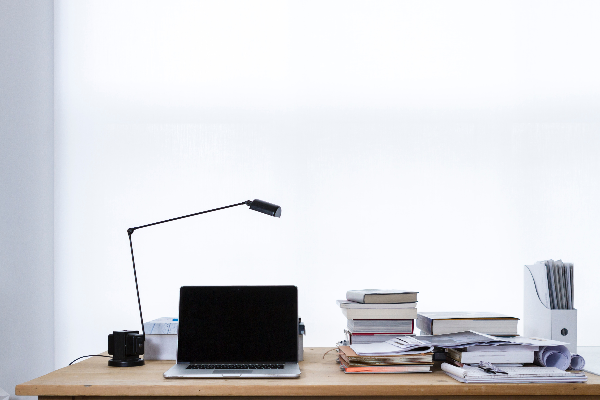

며칠 전 사무실에서 퇴근길 인사를 주고받으며 "업무 밀도가 높다"는 피드백을 받았다.
표현도 생소하고 누군가 내 일하는 모습을 보고 있었다는 생각에 조금 당황해서 "야근하기 싫어서"라는 이유를 댔다.

웬만해선 출근 후에 개인 일은 안 하려고 한다.
가방 속에 들어 있는 핸드폰은 꺼내지 않고 그대로 두거나, 가방 없이 출근할 때는 책상 서랍에 넣어서 가능한 눈에 보이지 않도록 감춰둔다.
메신져는 업무와 개인을 구분하지 않고 업무 노트북에서 모두 접속해 두었는데 이제는 업무용인 슬랙만 켜놓는다.
슬랙은 관심 있는 개발 커뮤니티 그룹에 가입해 두고 사용했던 걸 이제는 모두 삭제해 버리고 순전히 업무용으로만 사용한다.

처음엔 습관 들이는 게 좀 무서웠다. 핸드폰 알람이 오는 것 같고, 개발 커뮤니티에서 하는 얘길 듣지 않으면 뒤쳐질 듯싶었다.
습관적으로 브라우져 주소창에 입력하는 "face..", "twi.." 를 입력하는 내 모습을 발견하면 깜짝깜짝 놀랜다.
업무환경을 정리하고 나니 집중도가 높아지긴 하는 것 같다.

점심시간에는 반대로 업무를 하지 않는다. 대신 개인 업무를 처리한다.
이메일을 확인하고, 강의 질문에 답변하거나, 블로그 글을 쓴다.
가끔 기술 문서를 읽기도 한다.
한 시간 남짓 되는 점심시간에 이런 걸 할 수 있는 비결은 출근길에 들고 온 도시락 덕분이다.

회사 생활이 이렇다 보니 동료와 사생활을 얘기할 기회가 거의 없다.
보통 식사를 하면서 상대방의 근황을 알고 가까워질 기회를 얻기 마련인데 그렇지 못하기 때문이다.
원래 남 일에 무관심한 편이고, 이번 코로나 영향으로 혼자서 밥을 먹어서 그런 것 같다.
가끔 '이런 모습이 아쉬운가?'라고 스스로 물어보지만, 딱히 그렇진 않다.

퇴근하면 업무 생각은 전혀 하지 않는다.
건강 관리, 기술 공부, 취미 활동, 독서.
게다가 남편과 아빠의 역할도 추가되었다.

상황이 이렇게 변하다 보니 "균형"이 필요하다.
처음 직장 생활을 할 때는 이것이 내 인생의 전부인 양 모든 리소스를 쏟아부었다.
업무시간에 좀 풀어져 있기도 하고 딴짓도 제법 많이 했다.
그러나 이제는 하루 중 직장에서 사용할 수 있는 시간이 정해졌다.
제한된 시간 안에 비슷한 생산성을 내려면 업무시간에 집중해야 한다.
"업무 밀도"를 높이는 수 밖에 없다.
