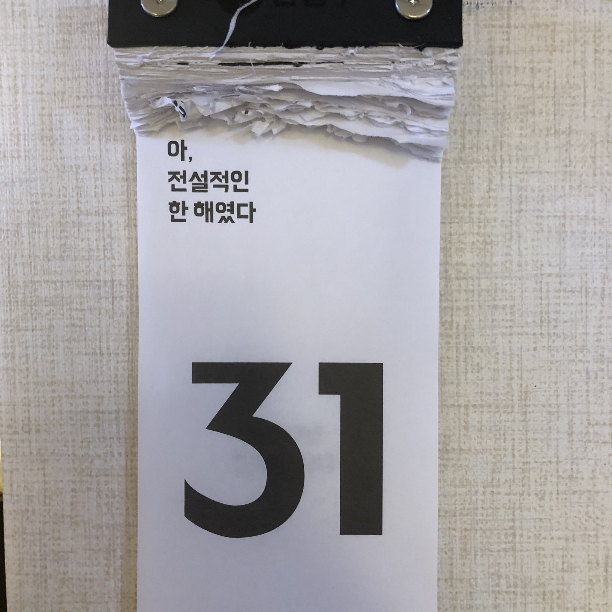

2020년 30개 포스팅을 발행했다. 매년 블로그에 50개 글을 쓰겠다고 계획을 세우는데 거의 달성해 본 적이 없었다.
이런 목표는 달성보다는 방향에 의미가 있는 것 같다. 마치 옛 뱃사람들의 북극성처럼 말이다.

**#재택근무**

2020년 가장 기억에 남는 건 코로나 19 사태다. 많은 사람이 삶 전반에 거쳐 영향을 받았고 기업도 살아남기 위한 변화를 많이 했다.
그중 재택근무는 무척 특별하다. 지방에서의 삶을 꿈꾸는 내게 재택근무가 유일한 희망이었는데
이번 사태로 인해 많은 IT 기업들이 재택근무를 반강제적으로 시행했고 우리 회사도 거의 재택근무 체제였다.

집에서 일하는 것이라면 평소에 자신 있어 했고 기회가 생길 때면 성취감 있게 곧 잘 해냈다([슬기로운 재택생활](https://jeonghwan-kim.github.io/think/2020/03/30/remote-work.html)).
하지만 이렇게 장기간 집에서 일하다 보니 부족한 부분이 보이더라.

**#육아**

육아를 시작한 해다. 혼자 있을 때야 모든 시간이 내 것이었지만 신생아와 함께라면 더 이상 그렇지 않다.
일과 육아를 병행하다 보니 집중하는 게 무척 힘들었다.
다행히 집에 함께 있는 아내가 여러모로 많이 배려해 주어서 이 만큼이나 버틸 수 있었다.
내 SNS에 꽤 많은 육아 선배들이 있다. 다들 덤덤히 일하는 모습에 존경스럽다.

**#신규 팀**

몇 년 전부터 회사에 사내 전배 프로그램이 생겼다.
팀에서 구인공고를 공지하면 회사 직원이 원하는 팀에 지원하는 것인데 이걸 통해 신규 팀으로 이동했다.

새로 만드는 조직인 만큼 새로운 문화, 새로운 코드 베이스를 주도적으로 만들 수 있겠다는 기대를 하고 이동했다.
돌이켜 보면 생각만큼 잘 되지 않은 것 같아 아쉽다.

**#서비스 출시**

[푸드네코](https://foodneko.com/company)라는 이름으로 일본 배달 서비스를 출시했다.
모든 걸 처음부터 만드는 프로젝트라 전반적인 배달 도메인 지식을 얻을 기회라고 생각한다.

**#강의 출시**

개발 프로젝트를 세팅할 때 매번 반복적인 작업을 한 번은 정리하고 싶었다.
마침 연초에 T아카데미로부터 강의 제안을 받아 준비할 기회를 얻었다.
내용을 다듬어 인프런에 ["프론트엔드 개발 환경의 이해"](https://www.inflearn.com/course/%ED%94%84%EB%A1%A0%ED%8A%B8%EC%97%94%EB%93%9C-%EA%B0%9C%EB%B0%9C%ED%99%98%EA%B2%BD)라는 이름으로 온라인 수업을 출시했다.
수업을 만들 때는 '이런 건 소수 몇 명만 궁금해 하겠지' 라는 좀 부정적인 생각이었는데 의외로 많은 관심을 받았다.
약 1,000명의 수강자가 생겼다.

