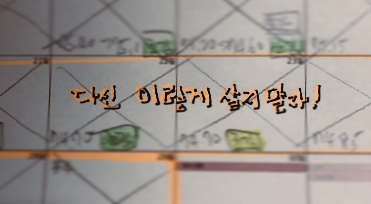

아버지와 자주 대화하는 편이다.
부자지간에 30분 이상 전화 통화하는 모습을 지인들은 신기하게 바라본다.
어머니와 딸처럼 우리는 미주알고주알 이미 했던 얘기를 반복하며 대화를 주고받는다.
아버지께서 여러 번 말씀하신 것 중 하나가 "균형 감감" 이다.

어렸을 때는 균형 있는 삶을 살아야 한다는 것에 별로 공감하지 못했다.
오히려 내가 하는 일에 열정을 쏟고 무언가 이루어내야 한다고 생각했고 어떤 것들은 무시하고 지나쳤다.
하지만 어른이 되어 가면서는 균형 있는 삶에 대해 다시 생각해 보게 된다.
취직해서 직장인이 되고 가정을 꾸려 가장이 되면서 해야 할 역할이 늘어난 탓인 것 같다.

일을 하다 보면 균형이 깨지는 경우가 빈번한데 그때마다 행복하지 않다고 생각을 한다.
작년에 서비스를 출시하는 프로젝트에 참여했는데 명절 연휴를 포기해야 했을 때가 그렇다.
회사 일이 중요한 것은 맞지만 가족과 함께 있는 것도 이에 못지않다.
둘 중 하나를 선택하고 하나는 포기해야 하는 상황이 무척 괴로웠다.

요즘은 육아와 개발 공부에 어떻게 시간을 배분할지 고민한다.
아니, 정확히는 개인 시간 대부분을 육아에 쏟는데 어떻게 공부 시간을 확보할 수 있을지가 걱정거리다.
육아가 무척 중요한 일이지만 개발자로서 성장하지 못한다는 느낌이 들기 시작하면 우울감이 생긴다.

코로나 역시 생활의 균형을 많이 깨뜨렸다.
재택근무가 길어지고 밖에 나가는 것을 자제하다 보니 야외활동을 전혀 못 한다(햇살, 산책, 운동).
어떻게든지 몸을 움직여서 책상 앞에 앉아 있는 시간을 줄이고 몸을 움직이는 시간을 늘려 정신과 신체 활동의 균형을 맞춰보려고 애쓴다.

작년에 이어 올해도 코시국이 쉽게 끝나지는 않을 것 같다.
어려운 상황이지만 그래도 이 안에서 균형감각을 잃지 않는 것이 중요하다.
