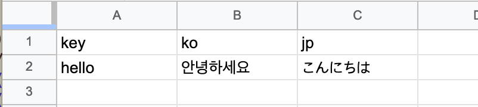

지난 겨울 일본에 서비스 출시를 준비하면서 일본어 기반의 웹 어플리케이션을 만들 기회가 있었다.
늘 사용하던 한국어 문자를 일본어 문자로 바꾸는 것처럼 간단한 상황은 아니다.
사용자는 일본인이지만 개발자나 테스터는 한국인이기 때문에 일본어에 익숙하지 않으면 일하기 힘들다.
게다가 일본인과 한국인이 사용하기 백오피스는 두 개 언어로 번역되어야 한다.

다국어라고 하면 Internationalization(국제화)을 줄인 i18n이란 용어가 떠오른다.
출판, 소프트웨어 개발 등 제품의 국제 시스템을 위한 표준이다.
소프트웨어, 디자인, 리소드 등 꽤 많은 부분을 고민해야하는데(참고: [소프트웨어의 국제화 (i18n)](https://getpocket.com/read/3281944050)) 소프트웨어 국제화(다국어)라는 문제를 어떻게 해결했는지 정리해 보자.

# i18next

다국어가 필요없다면 한 가지 언어만 사용하면 된다.
다국어를 고려한다면 사용자의 환경에 따라서 이에 맞는 언어를 사용해야 한다.
환경에 따라 유동적인 특정 언어를 코드에서 직접 사용할수 없기 때문에 언어에 무관하고 의미를 식별할 수 있는 일종의 키(key)가 필요하다.

```js
{
  hello: { // 키
    ko: "안녕하세요", // 한국어
    jp: "こんにちは" // 일본어
  }
}
```

이 키와 사용자의 환경 정보를 가지고 문자열을 계산하는 함수도 필요하다.

```js
t("hello", "ko") // "안녕하세요"
t("hello", "jp") // "こんにちは"
```

자바스크립트로 구현된 국제화 라이브러리인 [i18next](https://github.com/i18next/i18next-gitbook/blob/master/README.md)가 이런 방식으로 다국어를 지원한다.

# i18next-browser-languageDetector

키를 기반으로 번역 문자열을 반환하는데 어떤 언어를 선택할지는 사용자 환경 즉 브라우져의 설정값에 의존한다.
사용자의 환경 정보에서 언어 정보를 어떻게 찾을 수 있을까?
기본적으로 [window.navigator.language](https://developer.mozilla.org/en-US/docs/Web/API/NavigatorLanguage/language) 에서 설정된 언어 정보를 알 수 있다.

```js
window.navigator.language // "ko-KR", "ja-JP"
```

이걸 i18next로 전달하면 번역 함수는 키를 번역할 때 한국어나 일본어 문자열을 반환할 것이다.

i18next는 국제화와 관련된 확장 기능은 [다양한 플러그인 형태](https://github.com/i18next)로 제공한다.
그 중 [i18next-browser-languageDetector](https://github.com/i18next/i18next-browser-languageDetector)가 브라우져에서 언어 정보를 탐지하는 플러그인이다.

어플리케이션은 네비케이터 객체에 저장된 언어 정보만을 사용하지는 않는다.
사용자가 직접 언어를 변경할 수 있는 기능도 있기 마련인데 사용자가 선택한 정보는 쿠키나 로컬 저장소 등 브라우져 저장소를 사용한다.
사용자가 선택한 이후에는 네비게이터 객체보다는 브라우져 저장소 중 하나에 기록된 언어를 사용해야 할 것이다.

i18next-browser-languageDetector는 네비게이터 뿐만 아니라 쿠키, 세션 저장소, 로컬 저장소, 쿼리 문자열 등에서 언어 정보를 탐지하는 기능을 제공한다.

# react-i18next

리액트 컴포넌트에서 i18next로 문자를 렌더링 하느 코드는 다음과 같다.

```jsx
const Greeting = () => <>{t("hello")}</>
```

번역함수 t는 "hello" 키를 입력받으면 브라우져에 저장된 언어 종류를 탐지해서 번역된 문자열을 반환할 것이다.
만약 사용자가 언어를 변경하면 어떻게 될까?
지금 구조에서는 리액트 컴포넌트가 언어 변경을 알 수 없기 때문에 아무런 변화가 없을 것이다.
이걸 반영하기 위해서는 다시 렌더링을 히야한다.

언어가 변경됨에 따라 리액트 컴포넌트의 렌더링 함수를 호출해주는 것이 [react-i18next](https://github.com/i18next/react-i18next-gitbook/blob/master/README.md) 플러그인의 역할이다.
리액트 컴포넌트에 번역함수를 제공하는 방법은 다양한데 훅, 고차 컴포넌트, 렌더 프롭등이 있다.
가령 useTranslate() 훅은 함수 컴포넌트 안에서 사용할 수 있는 번역함수를 제공하는데 i18next 객체가 변경되면 번역함수도 바뀐다.
따라서 함수 컴포넌트는 이를 감지하고 렌더 트리거를 동작하는 방식이다.

[useTranslate()](https://github.com/i18next/react-i18next/blob/master/src/useTranslation.js)

# google-spreadsheet

마지막으로 번역 데이터를 어떻게 만들 것인가가 남았다.
키, 한국어, 일본어 구조의 데이터를 만들어야 하는데 다시 말하면 개발자와 번역가가 어떻게 협업할 것인가라는 말이다.

구글 시트를 떠올렸다.
먼저 개발자가 키와 한국어를 시트에 입력하고 번역가는 일본어로 번역한 문자를 입력하는 방식이다.



이렇게 만든 데이터를 코드 안으로 가져와야하는데 다행히 구글 시트는 접근할 수 있는 api를 제공한다.
json으로 데이터를 얻을 수 있기때문에 충분히 코드 안으로 가져와 가공할 수 있겠다.

직접 json 형태의 데이터을 가져와 파싱하지 않고 한 계층 더 추상화 해놓아 사용하기 편리한 [google-spreadsheet](https://www.npmjs.com/package/google-spreadsheets) 패키지의 도움을 받았다.
이걸 이용해 시트에 있는 번역 데이터를 코드로 가져오는 스크립트를 만들었다.

정리하면 1) 개발자가 키와 한글을 구글 시트에 입력하면 2) 번역가가 일본어로 번역 3) 시트에 api로 접근해서 코드로 가져와서 4) i18next로 번역 데이터를 사용하는 순서다.

# 결론

다국어 지원을 위해 사용한 라이브러리를 정리해보면 i18n의 자바스크립트 구현체인 i18next, 브라우져에서 언어를 탐지해서 번역에 도움을 주는 i18next-browser-languageDetector, 리액트 컴포넌트와 함께 사용하는 react-i18next를 이용해 어플리케이션의 다국어 기능을 구현했다.

번역가와 협업하기 위해서는 구글 시트에 번역 데이터를 입력해서 관리했다. 이 데이터를 코드 안으로 가져오기 위해 google-spreadsheet 패키지를 이용해 json 데이터를 가져왔다.

번역 데이터를 미리 준비하지 않고, 코드에서 사용한 키를 스캔해서 언어별로 json파일을 만드는 [i18next-scanner](https://github.com/i18next/i18next-scanner) 플러그인도 있다고 한다(참고: [국제화(i18n) 자동화 가이드](https://ui.toast.com/weekly-pick/ko_20210303)).
일하는 방식이 내가 했던 방식과 조금 다른것 같은데 나중에 기회가 되면 사용해 봐야겠다.
