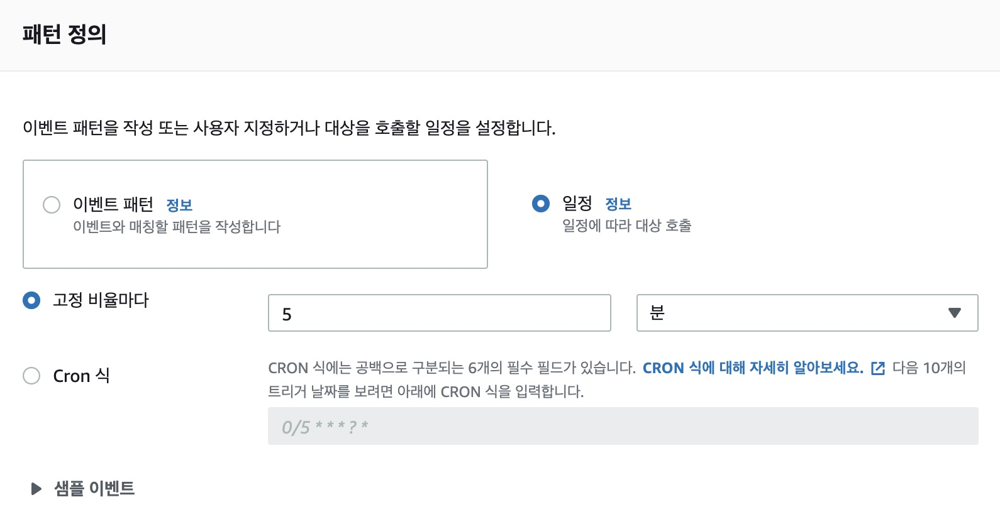
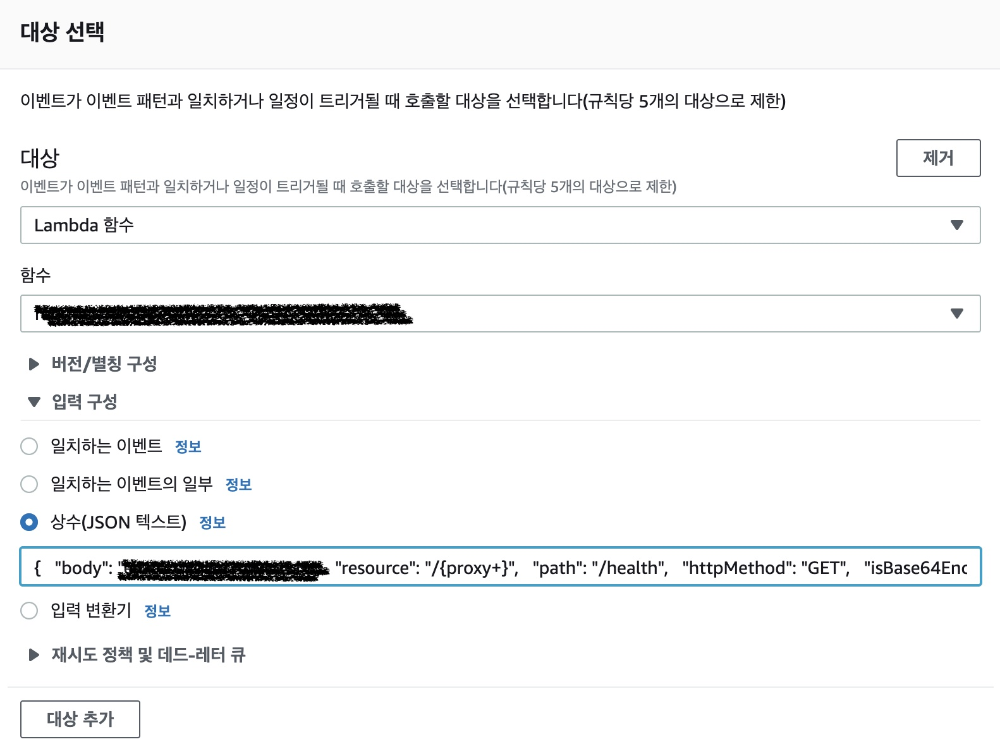
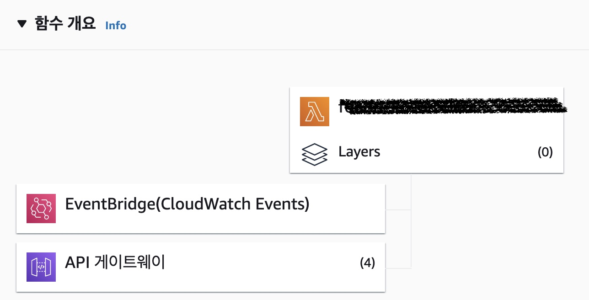

AWS 서버리스는 람다를 중심으로 구성한다.
대쉬보드에서 코드 수정만으로 서버에 변경사항을 즉시 반영하는 편리함과 급격한 트래픽을 감당할 수 있는 안정성이 특징이다. 이러한 장점을 갖는 이면에는 '콜드 스타트'라는 구조적 문제도 가지고 있다.

# 콜드 스타트

자동차에 관심이 있다면 콜드 스타트라는 용어는 익숙하다.
보통 추운 겨울날 열쇄를 꼽아 시동을 걸면 스타터 모터 소리만 끽끽끽 들리고 시동이 제대로 걸리지 않는 현상을 말한다.

람다 함수를 실행하면 바로 함수가 실행되는 것은 아니다.
실행하려면 컨테이너 환경이 필요한데 함수를 실행한 직 후라면 컨테이너가 유지된다.
만약 함수를 처음 실행하거나 마지막 실행한지 오래되었다면 마치 컴퓨터 전원이 꺼진 것 처럼 컨테이너는 정리되어 버린다고 한다.
그렇기 때문에 람다 함수는 경우에 따라서 초기 응답이 늦을 수 있고 이것을 자동차의 콜드 스타트에 빗대어 표현하는 것 같다.

# 람다를 실행하는 또 다른 람다

람다 실행 후 시간이 지나면 컨테이너를 정리하고 다시 실행할 때는 컨테이너를 준비하는데 시간이 걸리는 것이 문제의 원인이다.
그렇다면 람다를 실행한 후 컨테이너를 유지하도록 계속 람다 함수를 실행하면 어떨까?
지속적으로 함수를 실행하면 컨테이너를 정리하지 않고 유지하기 때문에 함수 응답이 지연되지 않을 것이라고 생각했다.

이러한 역할을 하는 또 다른 람다 함수를 만들어 주기적으로 원래의 람다 함수를 호출하도록 했다.
어플리케이션에서도 이 요청을 받을 수 있도록 헬스 체크하는 엔드포인트도 추가했다(GET /health).

그런데 뭔가 제대로 동작하지 않는 것 같았다.
어떨 때는 제대로 동작하는 것 같아서 바로 응답이 되다가, 어떨 때는 늦게 응답한다.
간헐적으로 콜드 스타트 현상이 발생한다.

# 람다 워머

NPM 저장소에서 비슷한 역할을 하는 라이브러리를 찾았다.
차가워진 엔진을 데운다는 의미로 람다 워머(lambda-warmer)다.

- https://www.npmjs.com/package/lambda-warmer

어플리케이션 코드 안에 추가하는 패키지인데 람다 함수로 "warming"이란 문자열로 이벤트를 보내는 녀석이다.
이 이벤트가 컨테이너를 자동으로 정리하지 않고 유지하도록 해서 콜드 스타트 문제를 해결한다는 취지다.
이전 시도처럼 핑을 보내는 람다 함수를 만들 필요가 없다는 것이 장점으로 보여 사용해 봤다.
하지만 첫번째 시도와 비슷하게 동작 여부를 확실하게 알기 어려웠다.
여전히 콜드 스타트 현상은 해결되지 않았다.

패키지 문서의 배경 섹션을 보면 AWS 서버리스 전문가가 얘기했다는 콜드 스타트 대응에 대한 모범 사례를 정리한 문구가 눈에 들어왔다.

- 오 분안에 여러 번 핑하지 말 것
- 함수를 직접 호출할 것. API 게이트웨이를 통해 요청하지 말 것
- 식별할 수 있는 테스트 페이로드를 전달할 것
- 전체 함수를 실행하지 않고 응답하는 핸들러를 만들 것

첫 번째 시도에서 놓친 부분이 좀 있는 것 같다.
핑 요청시 HTTP를 사용했기 때문에 API 게이트웨이를 거쳐 람다를 호출하게 될 것이다.
하지만 이 요청은 람다 함수까지 도달하지 않을 수도 있는데 람다 앞 단에서 캐쉬로 응답 했을수 있기 때문이다.
그렇다면 람다함수가 동작하지 않고 컨테이너가 정리되어 버릴수도 있는 가능성이 있다.

게다가 뭔가 잘 동작하지 않은것 같아서 핑 주기를 짧게 했는데 5분 미만을 지양한다고 한다.

그러다가 이벤트 브릿지 서비스를 발견했다.

# 이벤트 브릿지

이벤트 브릿지는 일종의 이벤트 버스다. AWS에서 발생한 이벤트를 어딘가로 전달해서 연결하는 용도로 사용한다.

- https://aws.amazon.com/ko/eventbridge/

주기적으로 이벤트를 발행하고 이걸 람다로 연결하면 발행된 이벤트에 의해 람다가 주기적으로 실행될 것 같다.
바로 이벤트 브릿지로 연결하면 말이다.

이벤트 브릿지 대쉬보드에 보니 주기적으로 이벤트를 발행할 수 있는 규칙을 설정할 수 있다.

가이드라인에 따라 최소 주기인 5분마다 호출하도록 설정했다.

다음은 이 이벤트를 어디로 보낼 것인지 정하는 부분이다.

람다 서비스를 선택하고 대상이 되는 람다 서비스를 선택한다.
이 람다로 이벤트를 보내는데 람다가 받는 이벤트 형식으로 JSON 값을 만들어 설정했다.
GET /health 요청을 보내도록한 설정 정보다.

람다 함수의 구성을 보면 2개 서비스가 연결되어 있다.

API 게이트웨이가 HTTP 요청을 받는다.
브라우져 같은 클라이언트의 요청을 받는 채널이다.
방금 설정한 이벤트 브릿지도 람다에 연결되어 있다.
HTTP 요청을 사용하지 말라는 가이드라인에 따라 AWS 이벤트를 람다로 보내서 직접 호출하도록 한 것이다.

이렇게 구성을 변경하고 나서야 콜드 스타트 현상을 없앨 수 있었다.
이제는 아무리 오랜만에 웹 사이트에 접속해서 응답이 지연되지 않는다.

# 정리

AWS 람다로 웹 어플리케이션을 구성하는데 콜드 스타드 현상을 해결하기 위해 세 가지 시도를 했다.
(1) 람다 컨테이너가 제거되기 전에 어플리케이션에 요청을 주기적으로 보내는 방법.
(2) 이것과 비슷하게 문제를 해결하는 lambda-wamer 패키지.
둘 다 문제를 제대로 해결하지 못해서 다른 방법을 찾았다.
(3) 람다 이벤트 브릿지를 통해 클라우드와치 이벤트와 람다를 연결해서 주기적으로 요청을 보내는 것.
마지막 방법으로 문제를 해결했다.

참고로 글을 쓰다 조사하면서 알게되었는데 추천 알고리즘에서도 콜드 스타트라는 의미를 사용한다는 걸 알았다.
