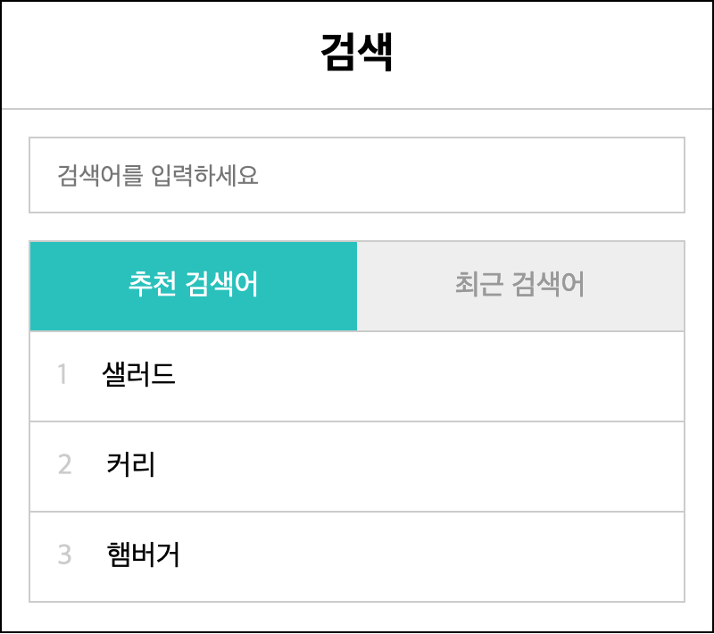
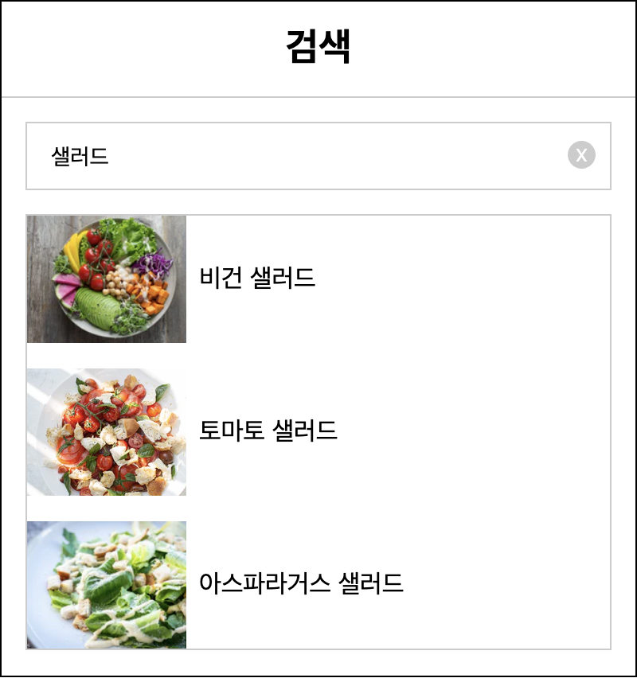
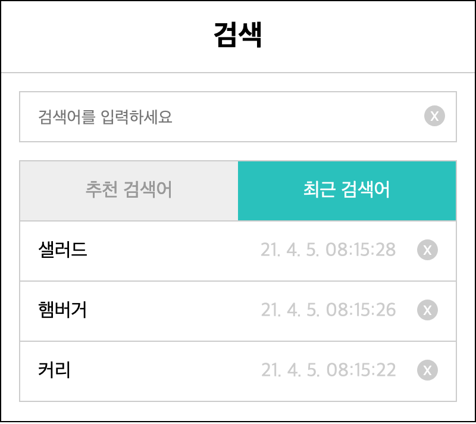

# 개요

## "백문이 불여일타"

우리는 이론과 실습 두 가지 방법으로 공부한다. 가령 기타를 배운다고 하자. 악보 읽는 법, 기타 소개 등의 전반적인 이론을 학습한 다음 실제 연주하면서 머리와 몸으로 기타를 익힌다.

한편 이론과 실습의 순서를 뒤짚는 경우도 있다. 유투브에서 누군가 멋지게 연주하는 모습을 보고 떠듬 떠듬 따라해 본다. 말도 안되게 어렵겠지만 여러 번 반복하면 제법 비슷하게 소리낼 수 있는 수준에 이른다. 기타 연주에 재미를 붙인 그는 다른 곡들도 그런 방법으로 익힌다. 나중에 이론을 접하면 '아! 이게 바로 이런 원리구나' 라고 깨닫는다.

> 백문이 불여일타

나는 후자의 방식으로 기타를 익혔는데 프로그래밍도 비슷하게 경험했다. 헬로월드 코드나 책에 나온 예제 코드로 결과물을 먼저 만들어 본다. 그리고 나서 머릿속에 구조를 추측해 본 뒤 문서와 코드를 읽으며 하나씩 알아가는 기술 학습방법이 나름 재미있었다.

이론을 먼저 공부한 적도 있었는데 비교적 재미있지는 않았다. 효과가 좋지 않다는 말이 아니다. **재미**란 말이다. 프로그래밍과 재미란 단어가 마치 타고난 해커들한테나 어울리는 것처럼 보인다. 하지만 그렇지 않은 사람들에게 프로그래밍은 난해한 외국어다. 여기에 재미 요소마저 없다면 프로그래밍은 어려운 것, 똑똑한 사람들만 하는 것이라고 치부해 버리지 않을까?

그럼에도 불구하고 재미를 곁들인다면 호기심을 갖고 즐길 수 있는 건 아닐까 생각해 본다. 헬로월드 코드를 타이핑하고 돌아가는 결과를 내 눈으로 확인하면 신기하기도 하고 약간의 성취감도 느낀다. 이러한 실습을 몇 번 하고 나서 이론을 공부하면 비교적 쉽게 이해되는 것을 여러 번 경험했다.

> 어떻게 리액트를 쉽게 설명할 수 있을까?

리액트 입문자를 위한 컨텐츠를 구상하던 차에 이러한 접근법을 적용했다. 결과물 구현에 초점을 두면서 중간에 이론을 소개하는 방식의 연재물이다. 나중에는 스스로 이론을 한 번 체계화하는 과정이 반드시 필요한데 이것은 읽고 난 뒤 독자의 몫으로 남겨 두겠다.

어떤 결과물을 만들지 먼저 구경이나 해보자.

## 결과물 미리보기

React.js를 이용해 쇼핑몰 서비스에 있을 법한 **검색 화면**을 만드는 것이 이번 시리즈의 방향이다. 캡쳐 이미지를 보면서 가늠해 보자.



기본 화면이다. 상단 헤더 헤더 부분에 "검색" 이라는 제목이 나온다. 그 아래 검색어를 입력할 수 있는 검색창이 위치한다. 이어서 추천 검색어나 최근 검색어 목록이 나오는데 이 둘을 전환할 수 있는 탭이 위치해 있다.



검색창에 "샐러드"라는 검색어를 입력하기 시작하면 우측에는 입력한 검색어를 삭제할 수 있는 버튼이 나온다. 엔터를 입력하면 아래 영역이 검색결과로 바뀐다. 검색창의 x 버튼을 클릭하면 이전 화면으로 되돌아 간다.



최근 검색어 탭을 선택하면 추천 검색어 목록이 사라지고 최근 검색어 목록으로 교체된다. 최근 검색어는 검색 일자가 표시되고 삭제할 수 있는 버튼이 우측에 위치한다. 검색어 목록 중 하나를 클릭하면 검색 결과로 이동한다.

정리하면 검색어를 입력하고 결과를 확인할 수 있는 웹 페이지를 만들 것이다. 사용자가 쉽게 검색할 수 있도록 추천 검색어와 최근에 입력했던 검색어를 제공하는 기능도 있다. 아무쪼록 결과물을 보고 흥미가 생겼으면 한다. 프로젝트를 시작하기 위한 실습 환경을 구성하자.

## 실습 환경 구성

결과물을 미리 확인했으니 이걸 만들기 위한 개발 환경을 만들겠다. 세 가지 도구를 사용한다.

- Node.js (필수)
- 에디터 (VS Code 등)
- 웹 브라우져 (파이어폭스 등)

React.js 따위의 라이브러리를 설치하거나 개발 도구를 실행하기 위한 목적으로 Node.js를 사용한다. 자세한 내용은 아래 글을 참고하자.

- [프론트엔드 개발환경의 이해 > 1. 프론트엔드 개발에 Node.js가 필요한 이유 ](/series/2019/12/09/frontend-dev-env-npm.html)

Node.js는 노드 공식 홈페이지에서 설치 파일을 다운받아 실행한다.

- https://nodejs.org/ko/

항상 두 가지 버전을 제공하는데 왼쪽이 장기적으로 지원하는 안정적인 버전이다. 이 설치 파일을 받아 설치한다.

에디터는 주로 VS Code를 사용하는 편이다. 실습 뿐만아니라 실무에서도 사용할만큼 훌륭한 무료 개발 도구다. 반드시 이 에디터를 사용해야하는 것은 아니다. 손에 익숙한 것을 사용하자.

- https://code.visualstudio.com/

웹 브라우져는 파이어폭스를 사용한다. 업무에서는 크롬을 사용하기도 하는데 이것도 각자 취향에 맞게 선택해서 사용해도 무방하다. 단 ES6 모듈 시스템을 지원하는 브라우져인지 확인하자. 최신 버전의 브라우져는 인터넷 익스플로러를 제외하곤 대부분 가능하다.

- https://caniuse.com/?search=module

## ⭐ 중간 정리

키보드 자판을 두드리며 몸으로 익히는 학습 방법이 재밌었다. 리액트 학습의 러닝 커브를 낮추어 보고자 실습 위주의 내용을 준비했다. 물론 이론도 적절하게 짚어가며 리액트의 핵심 내용을 하나씩 파악해 볼 것이다.

결과물을 미리 살펴 보았는데 간단한 검색 화면을 개발할 예정이다. Node.js, 에디터, 웹브라우저로 실습 환경을 구성했다.

실습 환경이 마련되었다고 바로 코딩을 하긴에는 리액트에 아는게 전혀 없다. 소개팅을 할 때도 첫 만남 전에 주선자로부터 간단한 소개를 받고 설레는 마음으로 약속 날짜를 기다린다. 잠시 리액트 소개팅 주선자 역할을 해 보겠다.

# 순수 자바스크립트 1

리액트를 소개시켜 달라니깐 왜 갑자기 순수 자바스크립트냐고?

비교와 대조. 무엇을 설명할 때 다른 개념과 비교하며 이해력을 높이는 방법이다. 가령 아이패드 홈페이지가 그렇다. 기본형, 프로, 에어, 미니 여러가지 모델이 있는데 각자 설명 화면에 들어가도 뭘 사야할지 금방 눈에 들어오지 않는다. 애플은 각 모델을 비교할 수 있는 화면을 제공하는데 난 이 화면을 좋아한다. 쉽게 비교할 수 있기 때문에 원하는 제품을 쉽게 찾을 수 있기 때문이다.

만약 리액트 같은 UI 라이브러리가 없으면 어떻게 개발할까? 자바스크립트와 브라우저의 돔 스크립트만을 이용(일명 순수 자바스크립트, 바닐라 자바스크립트)해서 개발할 수 있다. 라이브러리도 기반으로 하기 때문이다. 같은 결과물을 순수 자바스크립트 버전과 리액트 버전으로 구현함으로써 리액트의 역할과 이점을 더 확실하게 이해할 수 있을 것이다.

리액트에 앞서 순수 자바스크립트로 결과물을 만들어볼 작정이다.

## MVC

문제 해결에 쓰이는 해법이 여러가지가 될 수 있는데 이것을 "패턴"이라고 부른다. 프로그래밍도 문제를 해결하는 여러 가지 접근법이 있고 이것을 "디자인 패턴"이라고 한다. 화면 개발에서 많이 쓰이는 디자인 패턴 중 하나가 **MVC 패턴**이다.

모델(Model), 뷰(View), 컨트롤러(Controller)라는 세 개의 계층으로 구성되고 각자의 역할을 수행하면서 서로 협력해 문제를 해결한다.

**모델(Model)**은 데이터를 관리하는 역할을 가진다. 가령 API나 브라우저 로컬 저장소에 있는 데이터를 가져와 어플리케이션에서 사용할 수 있는 모양으로 만든다. 데이터를 수정하거나 삭제할 수 있는 방법도 알고 있다.

**뷰(View)**는 사용자가 볼 수 있는 화면을 관리하는 역할을 한다. 데이터를 돔에 출력하거나 사용자가 발생한 이벤트를 처리하는 기능을 수행한다. HTML, CSS도 뷰에 속한다.

어플리케이션이 동작하려면 모델이 가지고 있는 데이터를 뷰에게 전달해서 화면에 출력해야 한다. 반대로 뷰에서 발생한 이벤트에 따라 모델이 데이터를 관리해 어플리케이션 상태를 관리해야한다. 역할에 따라 서로 격리되어 있는 모델과 뷰를 연결하고 움직이는 주체가 바로 **컨트롤러(Controller)**다.

검색 화면을 순수 자바스크립트로 구현하기 위해 MVC 모델을 사용해서 구현해 보겠다.

## 폴더 구조

모델 역할을 하기 위한 **Store** 클래스다.

```js
class Store {
  constructor(storage) {
    this.storage = storage // 1
  }
}
```

생성 시점에 데이터 저장소 객체를 받아 내부에 관리한다(1). 생성자 인자로 들어온 스토리지(storage)는 어플리케이션에서 사용할 도메인 데이터 저장소인데 검색을 위한 상품 목록이나 추천 검색어, 그리고 사용자가 과거에 입력했던 검색어 목록을 담겨있을 것이다.

스토어는 이러한 스토리지 데이터를 어플리케이션에서 사용할 수 있도록 변환하는 중간자 역할을 한다. 조회, 수정, 추가 등 일련의 데이터 처리를 스토어가 담당한다.

뷰 역할의 **View** 클래스다.

```js
import { emit, on } from "../helpers.js"

class View {
  constructor(element) {
    this.element = element // 1
    this.originalDisplay = this.element.style.dispaly || "" // 2
  }

  hide() {
    this.element.style.display = "none"
  } // 3
  show() {
    this.element.style.display = this.originalDisplay
  } // 4

  on(eventName, handler) {
    on(this.element, eventName, handler)
  } // 5
  emit(eventName, data) {
    emit(this.element, eventName, data)
  } // 6
}
```

생성 시점에 화면 출력을 위한 돔 엘리먼트를 받아서 저장한다(1). 뷰를 화면에 보이고 숨기기 위해 스타일의 display 속성을 사용할 것인데 이것을 위해 원래 값을 저장해 둔다(2). hide()와 show() 메서드에서 이 값을 활용한다(3, 4).

엘리먼트 메소드의 addEventListener()와 dispatchEvent() 함수를 래핑한 on(), emit() 유틸리티 함수를 미리 만들어 두었는데 같은 이름으로 View 클래스 메소드를 추가해 두었다(5, 6). 뷰가 관리하는 엘리먼트에서 발생한 이벤트를 핸들러와 연결하거나 외부에서 구독하기 위한 용도다.

뷰는 여러 개를 만들 것이다. 검색폼뷰, 검색결과뷰 등. 따라서 공통의 로직을 View 클래스에 정의하고 각자 이를 상속하도록 한다.

다음은 **컨트롤러(Controller)**다.

```js
class Controller {
  constructor(store, { xxxView }) {
    this.store = store // 1
    this.xxxView = xxxView // 2
  }
}
```

스토어와 뷰를 생성 시점에 받아서 저장한다(1, 2). 스토어와 뷰는 서로 알지 못하기 때문에 이 녀석들을 관리해 주는 역할을 컨트롤러가 하게될 것이다.

어플리케이션의 진입점인 main() 함수다.

```js
import Controller from "./Controller.js"
import Store from "./store.js"
import storage from "./storage.js"

function main() {
  const store = new Store(storage) // 1
  const views = {} // 2
  new Controller(store, views) // 3
}
```

데이터를 담은 스토리지를 이용해 스토어 객체를 만든다(1). 뷰는 여러 개를 만들 것이기 때문에 우선 빈 객체로 만들었다(2). 이렇게 만든 스토어와 뷰 객체를 컨트롤러 생성자 함수에 전달해서 컨트롤러 객체를 만든다.

돔이 로딩되는 시점에 메인 함수를 호출한다.

```js
document.addEventListener("DOMContentLoaded", main)
```

다음 장 부터는 요구 사항을 정의하고 하나씩 해결해 보는 방식으로 진행하겠다.

## 검색폼 1

- 💡 요구사항: 검색 상품명을 입력할 수 있는 폼이 위치한다

먼저 화면에 출력한 HTML 코드를 만든다.

```html
<form id="form-view">
  <input type="text" placeholder="검색어를 입력하세요" autofocus />
  <button type="reset" class="btn-reset"></button>
</form>
```

스타일은 미리 준비해둔 클래스 이름을 사용한다. 검색어를 입력할 수 있는 인풋과 입력한 내용을 제거할 삭제 버튼이 보일 것이다.

이어서 돔을 관리하는 FormView를 만든다.

```js
class FormView extends View {
  constructor() {
    super(qs("#form-view")) // 1

    this.inputElement = qs("[type=text]", this.element) // 2
    this.resetElement = qs("[type=reset]", this.element) // 4
    this.showResetButton(false) // 4
  }

  // 5
  showResetButton(visible = true) {
    this.resetElement.style.display = visible ? "block" : "none"
  }
}
```

View 클래스의 생성자 함수를 호출해 돔을 내부 변수로 저장한다(1). qs()는 docuemnt.querySelector()를 호출하는 헬퍼 함수다.

인풋요소와 리셋 요소를 사용하기 위해 inputElement와 resetElement라는 변수도 저장한다(2, 3).

처음에는 x 버튼을 보일 필요가 없기 때문에 숨겨 두자. showResetButton() 메소드를 만들어 스타일의 display 속성을 바꿔가면서 화면의 노출 여부를 제어한다(4, 5).

어플리케이션 집입점인 main() 함수에서 뷰 객체를 만들고 컨트롤러에게 전달할 차례다.

```js
function main {
  const store = new Store(storage)

  const views = {
    formView: new FormView(), // 1
  }

  new Controller(store, views)
}
```

FormView() 생성자 함수를 호출해서 객체를 만들었다. 이 객체는 컨트롤러 생성자에게 전달될 것이다.

```js
class Controller {
  constructor(store, { formView }) {
    this.store = store

    this.formView = formView
  }
}
```

지금은 컨트롤러가 폼뷰를 사용하지는 않지만 앞으로 사용하기 위해 저장해 두었다. 앞으로 생성되는 모든 뷰는 이런 식으로 메인에서 객체를 생성만든 후 컨트롤러 생성자 인자로 전달하고 컨트롤러는 내부에 이 폼을 저장하는 일련의 순서를 따를 것이다.

~~💡 요구사항: 검색 상품명을 입력할 수 있는 폼이 위치한다~~

## 검색폼 2

- 💡요구사항: 검색어를 입력하면 x버튼이 보이고 검색어를 삭제하면 x 버튼을 숨긴다

```js
class FormView extends View {
  constructor() {
    this.bindEvents() // 1
  }

  bindEvents() {
    on(this.inputElement, "keyup", event => this.handleKeyup(event)) // 2
  }

  handleKeyup(event) {
    const { value } = this.inputElement
    this.showResetButton(value.length > 0) // 3
  }
}
```

검색어를 입력여부는 이벤트로 알 수 있다. 뷰에서 발생하는 이벤트 처리기를 연결하기 위해 bindEvents() 메서드를 호출한다(1). 미리 저장해 둔 inputElement에서 keyup 이벤트가 발생하면 handleKeyup() 메서드를 호출하는 함수를 연결했다(2). on은 addEventListener() 함수를 호출하는 헬퍼 함수다. handleKeyup() 메소드에서는 입력한 문자열의 길이에 따라 버튼의 노출 여부를 결정한다. 입력한 문자가 있으면 x 버튼을 표시하고 그렇지 않으면 숨기도록 요구사항을 구현했다(3).

- ~~💡요구사항: 검색어를 입력하면 x버튼이 보이고 검색어를 삭제하면 x 버튼을 숨긴다~~

## 검색폼 3

- 💡요구사항: 엔터를 입력하면 검색 결과가 보인다 (컨트롤러에게 위임)

```js
class FormView extends View {
  bindEvents() {
    on(this.inputElement, "keyup", event => this.handleKeyup(event))
    this.on("submit", event => event.preventDefault()) // 1
  }

  handleKeyup(event) {
    const ENTER_CODE = 13
    //2
    if (event.keyCode === ENTER_CODE) {
      this.emit("@submit", { value })
    }
  }
}
```

엔터를 입력하면 폼 기본 동작에 의해서 서버로 요청을 보내고 화면이 갱신된다. 이건 우리가 원하는게 아니다. event.preventDefault()로 폼 제출을 막아서 화면 갱신을 막는다(1).

엔터 입력 여부는 handleKeyup() 메소드 안에서 알 수 있다. 이벤트에서 키 코드를 조사해 엔터 키인지 비교한다(2).

여기서 검색결과를 보여주면 되는걸까? 키보드에서 손을 떼고 잠시 생각해 보자.

지금은 입력 폼을 다루는 FormView의 역할 정의하는 중인데 검색 결과는 이 녀석의 역할이 아닌것 같다. 그렇다면 제대로 생각하고 있는 것이다. 나중에 만들 ResultView가 더 어울리다.

폼에서 엔터가 입력되었다는 것까지만 FormView가 처리하고 검색 결과를 보여주는 것은 ResultView에게 위임해야겠다. 그러한 목적으로 "@submit" 이라는 커스텀 이벤트를 발행 한다(3).

```js
class Controller {
  constructor(store, { formView }) {
    this.formView = formView
    this.subscribeViewEvents() // 1
  }

  subscribeViewEvents() {
    this.formView.on("@submit", event => this.search(event.detail.value)) // 2
  }

  search(keyword) {
    console.log(keyword) // 3
  }
}
```

FormView를 관리하는 컨트롤러는 "@submit" 이벤트 받을 준비를 한다. 생성자는 스토어와 뷰를 저장하는 역할로 두고 뷰 이벤트를 구독할 수 있도록 subscribeViewEvents() 메소드를 호출한다(1).

subscribViewEvents() 메소드는 각 뷰에서 발생하는 이벤트를 구독하는 메서드다. 폼 뷰에서 입력한 검색어와 함께 발행되는 "@submit" 이벤트를 검색 메소드가 처리하도록 연결했다(2). search() 메소드에서는 입력한 키워드를 인자로 받아서 간단히 로그만 찍었다(3).

실제 검색 결과를 출력하는건 검색폼 요구사항을 모두 구현한 뒤에 ResultView에서 다룰 것이다. FormView와 컨트롤러의 역할은 여기까지다.

- ~~💡요구사항: 엔터를 입력하면 검색 결과가 보인다 (컨트롤러에게 위임)~~

## 검색폼 4

- 💡요구사항: x 버튼을 클릭하거나, 검색어를 삭제하면 검색 결과를 삭제한다

```js
class FormView extends View {
  bindEvents() {
    on(this.resetElement, "click", _ => this.handleClickReset()) // 1
  }

  // 2
  handleClickReset() {
    this.emit("@reset")
  }

  handleKeyup(event) {
    // 3
    if (value.length === 0) {
      this.emit("@reset")
    }
    // 4
    else if (event.keyCode === ENTER_CODE) {
      this.emit("@submit", { value })
    }
  }
}
```

FormView 생성자에서 저장한 resetElement에서 click 이벤트가 발생하면 처리하도록 handleClickReset() 메소드를 호출하게끔 연결한다(1).

검색한 결과를 삭제하는 것도 FormView의 역할은 아니다. 이것도 마찬가지로 "@submit" 이벤트처럼 외부로 위임하기 위해 "@reset" 이벤트만 발생시킨다(2).

handleKeyup() 메소드에서 검색어가 삭제되었다는 것은 입력한 문자의 길이로 알 수 있다(3). 이걸 계산해서 "@reset" 이벤트를 발행한다(3).

컨트롤러는 이 이벤트를 수신한다.

```js
class Controller {
  subscribeViewEvents() {
    this.formView
      .on("@submit", event => this.search(event.detail.value))
      .on("@reset", _ => this.reset()) // 1
  }

  reset() {
    console.log("@reset")
  }
}
ㅣ
```

"@submit" 이벤트처럼 reset() 메소드를 호출하도록 한다(1). 간단히 로그만 찍는다(2).

이렇게 해서 검색폼을 만들었다. 정확히는 검색 폼의 UI를 담당하는 FormView의 로직을 만든 것이다.

- ~~💡요구사항: x 버튼을 클릭하거나, 검색어를 삭제하면 검색 결과를 삭제한다~~

지금까지 나온 요구사항을 온전히 만족시키려면 검색 결과 UI도 구현해야한다. 다음 장에서 ResultView를 만들어 보자.

## 검색결과 1

- 💡요구사항: 검색 결과가 검색폼 아래 위치한다. 검색 결과가 없을 경우와 있을 경우를 구분한다

HTML 코드를 추가하자.

```html
<div id="result-view"></div>
```

검색폼과 달리 검색 결과는 데이터에 따라 모양이 달라지기 때문에 div 태그 하나만 사용하고 뷰에서 동적으로 그리도록 할 작정이다. 이 돔 엘리먼트와 연결할 ResultView 클래스를 정의해 보자.

```js
class ResultView extends View {
  constructor() {
    super(qs("#search-result")) // 1

    this.template = new Template() // 4
  }

  show(data = []) {
    // 2
    this.element.innerHTML =
      data.length > 0
        ? this.template.getList(data)
        : this.template.getEmptyMessage()

    super.show() // 3
  }
}
```

HTML 코드에서 사용한 셀렉터로 돔을 찾아 View() 생성자 함수를 호출한다. 돔이 내부 변수 this.element로 저장될 것이다(1).

부모인 View 클래스의 show() 메서드를 오버라이드 한다. 검색 결과를 배열로 받아 길이에 따라서 출력하는데 데이터가 있을 경우와 없을 경우로 구분해 UI를 만든다(2). 그리고나서 부모 클래스 View의 show() 메서드를 호출해 화면에 노출한다(3).

생성자 함수를 다시 보면 Template 객체를 만들어 내부 변수로 저장했다(4). show() 메서드에서 사용하는 이 객체는 뷰에서 사용하는데 필요한 마크업 문자열을 만드는 역할을 한다. 템플릿 클래스를 이어서 보자.

```js
class Template {
  // 1
  getEmptyMessage() {
    return "검색 결과가 없습니다"
  }

  // 2
  getList(data = []) {
    return `<ul class="result">${data.map(this._getItem).join("")}</ul>`
  }

  // 3
  _getItem({ name, imageUrl }) {
    return `
      <li>
        
        <p>${name}</p>
      </li>
    `
  }
}
```

getEmptyMessage() 는 데이터가 없을 때 사용하는 마크업 문자열을 반환한다(1). getList()는 데이터가 있을 때 사용하는데 리스트 마크업 문자열을 반환한다(2). 내부적으로 각 항목을 그리는 마크업을 반환하는 \_getItem() 메소드를 호출한다(3).

여기서 잠깐 코딩에서 손을 놓고 생각해보자. 검색을 했냐 하지 않았느냐에 따라 화면이 달라져야 한다. 검색을 하는 것은 사용자 입력을 받는 FormView에서 알 수 있다. 사용자가 검색어를 입력하고 엔터를 치면 곧장 "@submit" 이벤트를 발행할 것이다. 이에 따라 검색결과를 보여주는 것은 ResultView의 역할이다. 그럴려면는 검색을 했냐 하지 않았느냐는 상태가 필요하다. 이 상태에 따라 ResultView가 동작할 것이기 때문이다.

상태는 데이터로 다루기 때문에 MVC 패턴에서 모델의 역할이다. 모델 역할을 하는 스토어에 상태를 관리할 수 있는 로직을 만들자.

```js
class Store {
  constructor() {
    this.searchKeyword = '' // 1
    this.searchResult = [] // 3
  }

  search(keyword) {
    this.searchKeyword = keyword // 2
    this.searchResult = this.storage.productData.filter(p => p.name.includes(keyword) // 4
  }
}
```

검색 여부를 나타내는 searchKeyword 문자열 변수를 만들었다. 검색 하기 전에 기본값으로 빈 문자열을 할당했다(1). 검색하게되면 스토어는 search() 메소드로 이 상태를 갱신하는데 인자로 들어온 검색어 keyword 값로 변경한다(2).

검색어 입력 여부와 별개로 검색 결과를 담는 상태 searchResult도 추가했다. 검색 전에 기본값으로 빈 배열을 할당했다(3). search() 메서드에서는 스토리지에서 검색어를 포함하는 상품을 찾아 searchResult에 저장한다(4).

이제 뷰와 스토어를 이용해 요구사항을 완성해야 한다. 컨트롤러 코드를 보자.

```js
class Controller {
  constructor(store, { formView, resultView }) {
    this.resultView = resultView // 1
  }

  search(keyword) {
    this.store.search(keyword) // 2
    this.render() // 3
  }

  render() {
    // 4
    if (this.store.searchKeyword.length > 0) {
      return this.resultView.show(this.store.searchResult)
    }

    this.resultView.hide() // 5
  }
}
```

컨트롤러 생성시 resultView를 인자로 받아 내부 변수로 저장한다(1). 물론 컨트롤러를 생성하는 main() 함수에서 ResultView 객체를 만들어 미리 전달해야 한다.

FormView에서 "@submit" 이벤트가 발생하면 컨트롤러의 search() 메소드가 호출되고 검색어가 인자로 전달되는데 스토어의 search() 메소드를 호출해서 이를 저장해 둔다(2). 이어 상태에 따라 화면을 그리도록 render() 메소드를 호출한다(3).

render() 함수에서는 검색어가 있을 경우 검색 결과를 노출하고(5) 그렇지 않으면 숨기도록 했다(5). 컨트롤러의 render() 메소드는 여러 뷰들에게 노출 여부를 지시해 전체 화면을 그리는 역할을 한다. 지금은 우선 ResultView만 사용했는데 이후 뷰가 추가될 때마다 render() 메소드에서 제어할 것이다.

- ~~💡요구사항: 검색 결과가 검색폼 아래 위치한다. 검색 결과가 없을 경우와 있을 경우를 구분한다.~~

## 검색결과 2

- 💡요구사항: x 버튼을 클릭하면 검색폼이 초기화 되고, 검색 결과가 사라진다

x 버튼은 FormView에서 관리한다. 버튼을 클릭하면 "@reset" 이벤트를 발행하고 이를 구독하고 있는 컨트롤러에서는 로그만 확인하고 있는 것이 지금 버전이다.

검색폼 초기화는 이미 FormView에서 처리하고 있기 때문에 검색 결과를 숨기는 기능을 구현하면 된다. FormView의 "@reset" 이벤트를 받아 처리하는 reset() 메소드에 로직을 추가하면 되겠다.

```js
class Controller {
  reset() {
    this.store.searchResult = [] // 1
    this.store.searchKeyword = "" // 2
    this.render()
  }
}
```

스토어에 검색 관련한 두 상태 변수를 초기화 한다. 이어서 render() 메소드를 호출한다. 렌더함수의 로직을 상기해 보면 스토어의 searchKeyword가 있을 경우에 검색결과를 보여주고 그렇지 않으면 숨긴다. 테스트해보면 x 버튼을 클릭하면 검색결과가 없어지는 걸 확인할 수 있다.

- ~~💡요구사항: x 버튼을 클릭하면 검색폼이 초기화 되고, 검색 결과가 사라진다~~

## ⭐ 중간 정리

리액트 비교 학습 대상으로 순수 자바스크립트를 선택했다. UI 라이브러리 도움없이 직접 내손으로 구현하는 것이다. 화면 개발이라는 문제 해결을 위해 많이 사용하는 MVC 패턴으로 시작했다.

세부적으로 정의된 요구사항을 하나씩 보며 사용자 입력을 위한 검색폼과 검색 결과를 구현했다. MVC의 등장 인물인 모델, 뷰, 컨트롤러의 역할을 소개하고 어떻게 협력하는지 코드를 통해서 이해했다.

뷰는 눈에 보이는 UI를 담당한다. 돔을 조작해 실제로 화면을 그린다. 그리고 사용자로부터 입력을 받고 적절히 처리한 뒤 자신의 역할이 아닌 것은 외부로 전달하기 위해 커스텀 이벤트를 발행한다.

스토어로 구현한 모델은 데이터를 관리한다. 데이터를 저장하고 있는 스토리지를 기반으로 조회/수정/삭제를 위한 메소드를 제공한다. 뷰를 제어하는데 사용할 상태 변수도 가지고 있다.

뷰와 스토어를 이용해 어플리케이션이 돌아가도록하는 것이 컨트롤러다. 스토어의 데이터를 뷰로 전달하거나 뷰에서 보내는 이벤트를 보고 스토어에 데이터를 갱신하는 방식으로 화면을 제어한다.

혹자는 순수 자바스크립트로 화면을 구현하는 과정이 다소 지난할지도 모르겠다. 이 단계를 거치면서 UI라이브러리의 필요성을 느끼고 리액트의 장점을 부각하려는 필자의 의도를 아무쪼록 이해해 주었으면 한다.

다음 장도 이어서 나머지 기능을 구현해 보자.

# 순수 자바스크립트 2

## 탭 1

- 💡요구사항: 추천 검색어, 최근 검색어 탭이 검색폼 아래 위치한다

검색결과와 마찬가지로 탭뷰를 마운트할 HTML을 만든다.

```html
<div id="tab-view"></div>
```

여기에 연결할 TabView 클래스를 만든다.

```js
class TabView extends View {
  constructor() {
    super(qs("#tab-view")) // 1

    this.template = new Template() // 2
  }

  show() {
    this.element.innerHTML = this.template.getTabList() // 3

    super.show() // 6
  }
}
```

아이디로 돔 엘리먼트를 찾아 View() 생성자 함수를 호출해 this.element 변수에 저장한다(1). 탭 출력을 위한 템플릿 객체도 만들어 저장한다(2).

부모 클래스인 View에 정의된 show() 메더드를 재정의한다. 화면에 노출하기 전에 템플릿 객체로부터 탭 리스트 마크업 문자열을 가져와 돔에 추가하기 위해서다(3). 이어서 show() 메서드를 호출하면 템플릿에서 가져온 돔이 화면에 보일 것이다.

Template 클래스를 보자.

```js
class Template {
  // 1
  _getTab({ key, label }) {
    return `<li data-tab="${key}">${label}</li>`
  }

  // 2
  getTabList() {
    return `
      <ul class="tabs">
        ${Object.values(Tab) // 3
          .map(key => ({ key, label: TabLabel[key] })) // 4
          .map(this._getTab)
          .join("")} // 5
      </ul>
    `
  }
}
```

탭 하나를 출력하기 위한 HTML 문자열을 반환하는 것이 \_getTab() 메소드다. 탭을 식별할 수 있는 key와 탭 이름을 의미하는 label로 구성된 객체를 받아서 li 태그를 만들어 반환한다(1).

탭 목록을 출력하기 위한 HTML 문자열을 반환하는 것이 getTabList() 메소드다. 탭 키를 배열로 만들고 (3) key, label 로 구성된 객체로 변환한 뒤(4) \_getTab() 메소드로 탭을 위한 마크업 문자열를 생성한다(5).

탭을 식별하기 위한 Tab 객체와 출력하기 위한 용도의 TabLabel 객체는 이렇게 생겼다.

```js
const Tab = {
  KEYWORD: "KEYWORD",
  HISTORY: "HISTORY",
}

TabLabel = {
  [Tab.KEYWORD]: "추천 검색어",
  [Tab.HISTORY]: "최근 검색어",
}
```

탭이 두 개 있으니 이 데이터를 가지고 탭을 그리는 Template은 "추천 검색어"와 "최근 검색어" 탭 UI를 그리게 될 것이다. 하지만 아직 이르다. 뷰 객체를 만들고 컨트롤러가 화면에 출력하도록 해야한다.

이전 뷰들처럼 main() 함수에서 객체로 만들어 컨트롤러에 주입하는 과정을 거친다. 이 과정은 항상 같은걸 반복하니깐 이제부터 코드는 생략하겠다. 뷰 객체를 받은 컨트롤러 생성자 함수도 같은 이유로 지나간다. 여러 뷰에게 화면 출력을 지시하는 render() 메소드로 건너가자.

```js
class Controller {
  render() {
    if (this.sotre.searchKeyword.length > 0) {
      this.resultView.show(this.store.searchResult)
      this.tabView.hide() // 1
      return
    }

    this.tabView.show() // 2
    this.resultView.hide() // 3
  }
}
```

검색어를 입력한 뒤에는 검색 결과는 노출하고 탭뷰는 숨긴다(1). 일반적인 조건일 경우에는 반대로 탭을 노출하고(2), 검색 결과를 숨긴다(3).

이제 화면에 탭 두 개가 보인다.

- ~~💡요구사항: 추천 검색어, 최근 검색어 탭이 검색폼 아래 위치한다~~

## 탭 2

- 💡요구사항: 기본으로 추천 검색어 탭을 선택한다

CSS 클래스 "active"를 탭 엘리먼트에 추가하면 선택된 UI로 표시할 수 있다. 클래스는 미리 준비해 두었다.

```html
<li class="active">추천 검색어</li>
```

탭뷰의 show() 메서드에서 선택된 탭 정보를 인자로 받아 UI에 표시하는 코드를 추가하자.

```js
class TabView extends View {
  // 1
  show(tab) {
    this.element.innerHTML = this.template.getTabList()

    // 2
    qsAll("li", this.element).forEach(li => {
      li.className = li.dataset.tab === tab ? "active" : ""
    })

    super.show()
  }
}
```

탭뷰를 노출하는 show() 메서드에 탭 정보를 인자로 받도록 수정한다(1). li 엘리먼트 중 선택한 탭 엘리먼트를 찾는데 data-tab 속성값과 인자의 tab 문자열 값을 비교해 일치하는 녀석에서 active 클래스 이름을 붙여 준다(2).

그럼 선택한 탭을 어디서 저장하는 것이 좋을까? TabView에서 관리한다면 항상 같은 탭만 보이게 될 것이다. TabView는 누군가에 의해 객체화되고 관리되기 때문에 뷰를 사용하는 외부에서 관리하면 좋겠다. 바로 모델의 역할이다.

```js
import { Tab } from "./views/TabView.js"

class Store {
  constructor(storage) {
    // ...
    this.selectedTab = Tab.KEYWORD // 1
  }
}
```

선택된 탭을 저장하기 위한 selectedTab 변수를 추가하고 초기값을 Tab.KEYWORD로 지정했다(1).

스토어에 저장된 탭 정보를 뷰에 연결하려면? 그렇다, 컨트롤러의 역할이다.

```js
class Controller {
  render() {
    // ...
    this.tabView.show(this.store.selectedTab) // 1
  }
}
```

render() 함수에서는 선택된 탭을 탭뷰 측으로 전달했다(1). 탭뷰는 이 정보를 가지고 선택된 탭을 표시할 것이다.

이제 기본으로 추천 검색어 탭이 선택되었다.

- ~~💡요구사항:기본으로 추천 검색어 탭을 선택한다~~

## 탭 3

- 💡요구사항: 각 탭을 클릭하면 탭 아래 내용이 변경된다

탭을 클릭했는지는 누가 알고 있을까? 그렇다 TabView가 알고 있다. 그리고 탭 아래 내용을 변경하는 것은? 그렇다, 각 뷰를 관장하는 컨트롤러의 역할이다. 탭뷰가 이벤트를 잡아서 외부로 발행하는 기능을 추가하자.

```js
class TabView extends View {
  constructor() {
    // ..
    this.bindEvents() // 1
  }

  bindEvents() {
    delegate(this.element, "click", "li", event => this.handleClick(event)) // 2
  }

  handleClick(event) {
    const value = event.target.dataset.tab // 3
    this.emit("@change", { value }) // 4
  }
}
```

생성 시점에 엘리먼트에서 발생하는 이벤트를 핸들러와 연결하는 bindEvents() 메소드를 호출한다(1). bindEvents()는 자식 엘리먼트 중 li에서 "click" 이벤트가 발생할 때 handleClick() 메소드를 호출하도록 핸들러를 연결한다(2). delegate()는 자식 중 특정 엘리먼트에서 발생한 이벤트에 핸들러를 연결하는 유틸리티 함수다. 미리 만들어 두었다.

이렇게 실행될 handleClick() 메소드는 이벤트 객체를 받아 클릭된 요소의 탭 정보를 조회한다(3). 템플릿에서 탭을 생성할때 data-tab 속성에 값을 저장해 둔 덕분에 정보를 조회할 수 있다. 이 데이터와 "@change"라는 이름으로 이벤트를 발행한다.

컨트롤러가 이를 수신할 차례다.

```js
class Controller {
  subscribeViewEvents() {
    this.tabView.on("@change", event => this.changeTab(event.detail.value)) // 1
  }

  changeTab(tab) {
    this.store.selectedTab = tab // 2
    this.render() // 3
  }
}
```

tabView에서 발행한 "@change" 이벤트를 구독하는데 changeTab() 메서드로 변경된 탭 정보를 전달한다(1). 선택된 탭 데이터를 어플리케이션 상태를 관리하는 스토어에 저장한다(2). 이걸 다시 화면에 그리려면? 그렇다. render() 메소드를 다시 호출해야 한다.

이제 각 탭을 클릭하면 탭에서 이벤트가 발행되고 이걸 수신한 컨트롤러는 스토어에 변경된 탭 정보를 갱신할 것이다. 그리고 다시 화면을 그리는 render() 함수가 호출되고 선택된 탭이 표시될 것이다.

- ~~💡요구사항: 각 탭을 클릭하면 탭 아래 내용이 변경된다~~

이렇게 해서 탭에 대한 요구사항을 마쳤다. 다음은 탭 아래 위치한 추천 검색어를 만들어보자. 조금만 더 따라 오자.

## 추천 검색어 1

- 💡요구사항: 번호와 추천 검색어 이름이 목록 형태로 탭 아래 위치한다.

KeywordView에 저장할 HTML을 만든다.

```html
<div id="keyword-view"></div>
```

여기에 마운팅한 KeywordView 클래스를 만든다.

```js
class KeywordView extends View {
  // 1
  constructor() {
    super(qs("#keyword-view"))
    this.template = new Template()
  }

  // 2
  show(data = []) {
    this.element.innerHTML =
      data.length > 0 ? this.template.getList(data) : this.getEmptyMessage()
    super.show()
  }
}
```

생성자에서 엘리먼트를 저장하고 템플릿 객체를 생성하는 코드는 비슷하다(1). 키워드 데이터에 따라 동적으로 출력하기 때문에 show() 메서드를 오버라이드 한다(2). 배열을 받도록 시그니처를 변경했다. 데이터가 있으면 템플릿을 통해 리스트 마크업 문자열을 가져오고 그렇지 않으면 빈 메세지를 가져온다. 이어서 부모의 show() 메소드 호출도 잊지 않아야 한다.

템플릿 코드를 보자.

```js
class Template {
  getEmptyMessage() {
    return `추천 검색어가 없습니다`
  }

  // 1
  getList(data = []) {
    return `<ul class="list">${data.map(this._getItem).join("")}</ul>`
  }

  // 2
  _getItem({ id, keyword }) {
    return `
      <li data-keyword="${keyword}">
        <span class="number">${id}</span>
        ${keyword}
      </li>
    `
  }
}
```

데이터 모양에 따라 돔 문자열을 만드는 코드다. 뷰에서는 getList() 메소드를 호출하는데 컬렉션 데이터를 전달해서 사용할 것이다(2). 배열을 순회하면서 아이템을 그리는 \_getItem() 로직이다.

키워드뷰도 main() 함수에서 객체로 만들고 컨트롤러에 전달되어 내부 변수로 저장되어야 한다.

한편 뷰에게 전달한 데이터를 스토어어에 추가한다.

```js
class Store {
  // 1
  getKeywordList() {
    return this.storage.keywordData
  }
}
```

데이터 원천인 스토리지에서 키워드 데이터를 찾아 반환하는 메소드다(1).

뷰와 스토어가 준비되었고 컨트롤러 코드를 볼 차례다.

```js
class Controller {
  render() {
    // 1
    if (this.store.selectedTab === Tab.KEYWORD) {
      this.keywordView.show(this.store.getKeywordList()) // 3
    }
    // 2
    else if (this.store.selectedTab === Tab.HISTORY) {
      this.keywordView.hide() // 4
    } else {
      throw "사용할 수 없는 탭"
    }
  }
}
```

스토어에 저장된 선택된 탭 정보를 비교해서 추천 검색어인 경우(1)와 최근 검색어인 경우(2)로 나눠 생각한다. 추천 검색어일 경우 스토어에서 키워드 목록을 가져와 뷰에 전달해 화면에 노출한다(3). 그렇지 않을 경우 KeywordView를 숨긴다(4).

결과물을 보면 기본 선택된 탭이 추천 검색어이기 때문에 스토어에서 가져온 추천 검색어 목록이 탭 아래 리스트 형식으로 출력된다.

- ~~💡요구사항: 번호와 추천 검색어 이름이 목록 형태로 탭 아래 위치한다.~~

## 추천 검색어 2

- 💡요구사항: 목록에서 검색어를 클릭하면 선택된 검색어의 검색 결과 화면으로 이동한다

추천 검색어 클릭 여부는 KeywordView에서 알 수 있었다. 검색 결과 화면은 ResultView의 몫이다. 그리고 이 둘을 제어하는 것이 Controller다. 지금까지 역할 분담을 한 것처럼 KeywordView는 클릭한 키워드를 찾아 외부로 이벤트를 발행하고 Controller는 이걸 이용해 검색한 후 ResultView에게 전달하는 구조로 만들어야겠다. 먼저 KeywordView 부터 보자.

```js
class KeywordView extends View {
  constructor() {
    // ...
    this.bindEvents() // 1
  }

  bintEvents() {
    delegate(this.element, "click", "li", event => this.handleClick(event)) // 2
  }

  handleClick(event) {
    const { keyword } = event.target.dataset // 3
    this.emit("@click", { value: keyword }) // 4
  }
}
```

생성 시점에 이벤트를 바인딩한다(1). 하위 엘리먼트에 클릭 이벤트가 발생하면 li 요소일 경우만 이벤트를 처리하도록 했다(2). 이벤트 처리기는 data-keyword 속성에 저장된 키워드 값을 조회한다(3). 여기까지가 뷰의 몫이고 키워드와 "@click" 이란 이름으로 이벤트를 발행해 외부로 알린다.

이벤트를 수신할 컨트롤러를 보자.

```js
class Controller {
  subscribeViewEvents() {
    this.keywordView.on("@click", event => this.search(event.detail.value)) // 1
  }
}
```

KeywordView에서 보낸 "@click" 이벤트를 구독한다. 이벤트에서 키워드를 뽑아 search() 함수로 전달한다(1). FormView에서 발생한 '@submit' 이벤를 처리하는 것과 비슷하다.

이제 키워드 목록을 클릭하면 클릭한 키워드로 검색한 결과물이 보인다.

- ~~💡요구사항: 목록에서 검색어를 클릭하면 선택된 검색어의 검색 결과 화면으로 이동한다.~~

## 최근 검색어 1

- 💡요구사항: 최근 검색어 이름, 검색일자, 삭제 버튼이 목록 형태로 탭 아래 위치한다.
- 💡요구사항: 목록에서 검색어를 클릭하면 선택된 검색어로 검색 결과 화면으로 이동한다.

최근 검색어 출력을 위한 HTML이다.

```html
<div id="history-view"></div>
```

이 엘리먼트를 사용할 HistoryView를 보자. 두번째 요구사항을 보면 키워드뷰의 것과 같다. 첫번째 요구사항만 다른데 화면에 보이는 방식이 차이날 뿐이다. 모든 뷰가 공통 로직인 View를 상속했듯이 KeywordView를 상속해서 구현하면 좋겠다는 생각이 든다. 먼저 KeywordView를 상속가능하도록 조금 변경하겠다.

```js
class KeywordView extends View {
  constructor(
    element = qs("#keyword-view"), // 1
    template = new Template() // 2
  ) {
    super(element)

    this.template = template
    this.bindEvents()
  }
}
```

생성 시점에 엘리먼트와 템플릿을 주입하는 방식으로 바꿨다. 인자가 없으면 #keyword-view로 엘리먼트를 찾을 것이다. 이를 상속할 HistoryView는 #history-view로 돔을 찾아 전달하면 되겠지(1). 두번째 템플릿 객체도 받도록 했다. 없으면 현재 키워드뷰 템플릿 객체를 만들고 이걸 상속할 HistoryView에서는 그만의 템플릿 객체를 전달하도록 열어 두었다(2).

이렇게 돔 엘리먼트와 템플릿 객체를 외부에서 주입받으면 화면에 출력하는 모습만 다를 뿐 키워드뷰의 동작은 재활용할 수 있다. 히스토리뷰를 보자

```js
class HistoryView extends KeywordView {
  constructor() {
    super(qs("#history-view"), new Template()) // 1
  }
}
```

키워드 뷰를 상속하고 생성자 함수에 돔 엘리먼트와 템플릿 객체를 전달한다(1). 클릭 이벤트를 바인딩하고 템플릿을 이용해 화면에 출력하는 기능은 부모의 것을 그대로 재활용할 수 있다. 차이는 템플릿 코드에 있다.

```js
class Template {
  getEmptyMessage() {
    return `검색 이력이 없습니다`
  }

  getList(data = []) {
    return `<ul class="list">${data.map(this._getItem).join("")}</ul>`
  }

  // 1
  _getItem({ keyword, date }) {
    const formattedDate = date.toLocaleString("ko-KR", {
      hour12: false,
      dateStyle: "short",
      timeStyle: "medium",
    })

    return `
      <li data-keyword="${keyword}">
        ${keyword}
        <span class="date">${formattedDate}</span>
         <button class="btn-remove"></button>
      </li>
      `
  }
}
```

빈 메세지와 리스트 마크업 문자열을 계산하는 메서드는 거의 비슷하다. 요구사항에 따라 각 항목에 날짜와 버튼이 들어가는게 다른데 \_getItem() 메소드에 반영한다(1).

main() 함수에서 HistoryView 객체를 만들어 컨트롤러에 전달하는 것도 잊지말자.

최근 검색어 데이터를 다룰 스토어 클래스로 넘어가자.

```js
class Store {
  // 1
  getHistoryList() {
    return this.storage.historyData.sort(this._sortHistory)
  }
}
```

검색 이력을 가져오는 getHistoryList() 메소드를 만들었다(1).

컨트롤러에서 스토어와 뷰를 이용해 화면을 그려보자.

```js
class Controller {
  subscribeViewEvents() {
    // ....
    this.historyView.on("@click", event => this.search(event.detail.value)) // 1
  }

  render() {
    if (this.store.searchKeyword.length > 0) {
      return this.renderSearchResult() // 1
    }

    this.resultView.hide() // 2
    this.tabView.show(this.store.selectedTab) // 3

    if (this.store.selectedTab === Tab.KEYWORD) {
      this.keywordView.show(this.store.getKeywordList())
      this.historyView.hide() // 4
    } else if (this.store.selectedTab === Tab.HISTORY) {
      this.keywordView.hide() //5
      this.historyView.show(this.store.getHistoryList()) // 6
    } else {
      throw "impossible condition"
    }
  }

  // 7
  renderSearchResult() {
    this.formView.show(this.store.searchKeyword)
    this.resultView.show(this.store.searchResult)

    this.tabView.hide()
    this.keywordView.hide()
    this.historyView.hide()
  }
}
```

히스토리뷰의 "@click" 이벤트가 발생하면 search() 메소드에 최근 검색어를 전달한다(1).

render() 메서드에도 히스토리뷰를 사용하도록 코드를 추가한다. 뷰가 많아져서 검색결과를 출력하는 코드는 renderSearchResult() 분리했다(1, 7)

기본 화면에서는 검색 결과를 숨기고(2), 탭을 노출하고 선택된 탭을 표시한다(3). 키워드 탭을 선택하면 최신 검색어를 숨기고(5), 그렇지 않을 경우에는 키워드 탭을 숨긴다(5). 그리고 검색 이력을 불러와 historyView.show() 메소드에 전달한다. 이제는 최신 검색어 탭을 선택하면 이력 뷰가 보일 것이다.

- ~~💡요구사항: 최근 검색어 이름, 검색일자, 삭제 버튼이 목록 형태로 탭 아래 위치한다~~
- ~~💡요구사항: 목록에서 검색어를 클릭하면 선택된 검색어로 검색 결과 화면으로 이동한다~~

## 최근 검색어 2

- 💡요구사항: 목록에서 x 버튼을 클릭하면 선택된 검색어가 목록에서 삭제된다

이벤트 발생 시점을 찾아야 되니깐 히스토리뷰에서 시작하자.

```js
class HistoryView extends KeywordView {
  bindEvents() {
    // 1
    delegate(this.element, "click", "button.btn-remove", event =>
      this.handleClickRemoveButton(event)
    )

    super.bindEvents() // 2
  }

  handleClickRemoveButton(event) {
    const { keyword } = event.target.parentElement.dataset // 3
    this.emit("@remove", { value: keyword }) // 4
  }
}
```

이벤트를 바인딩하는 부모 메소드를 오버라이딩 한다. 자식 엘리먼트 중에 버튼을 클릭하면 handleClickRemoveButton()을 호출한다(1). 이어서 li 엘리먼트의 클릭을 처리하는 부모의 메소드도 호출한다(2).

handleClickRemoveButton() 메서드는 엘리먼트 data-keyword 속성에 저장된 키워드를 찾아(3) "@remove" 이름과 함께 이벤트를 발행한다. 이 후는 컨트롤러로 위임하겠다는 의도다.

최근 검색어 데이터를 삭제할 차례다. 이 데이터를 기반으로 컨트롤러가 뷰를 그리기 때문이다. 스토어를 보자.

```js
class Store {
  // 1
  removeHistory(keyword) {
    this.storage.historyData = this.storage.historyData.filter(
      history => history.keyword !== keyword
    )
  }
}
```

삭제할 키워드를 받아 데이터에서 제거하는 removeHistory() 메소드다(1).

컨트롤러에서는 히스토리뷰의 "@remove" 이벤트를 기다리다가 스토어의 removeHistory() 메소드를 호출하면 되겠다.

```js
class Controller {
  subscribeViewEvents() {
    this.historyView
      .on("@click", event => this.search(event.detail.value))
      .on("@remove", event => this.removeHistory(event.detail.value)) // 1
  }

  removeHistory(keyword) {
    this.store.removeHistory(keyword) // 2
    this.render() //3
  }
}
```

히스토리뷰에서 삭제 이벤트가 발생하면 삭제할 키워드 문자열을 찾아 removeHistory() 메소드에 전달한다(1). 메소드는 스토어에서 해당 키워드를 제거하고(2) 화면을 다시 그린다(3). 그럼 최근 검색에에서 삭제한 키워드는 보이지 않을 것이다.

- ~~💡요구사항: 목록에서 x 버튼을 클릭하면 선택된 검색어가 목록에서 삭제된다~~

## 최근 검색어 3

- 💡요구사항: 검색시마다 최근 검색어 목록에 추가된다

검색어 목록을 추가하는 것은 데이터를 관리하는 스토어의 역할이다. 검색 시점인 스토어의 search() 메소드를 보자.

```js
class Store {
  search(keyword) {
    // ...
    this.addHistory(keyword) // 1
  }

  addHistory(keyword = "") {
    keyword = keyword.trim()
    if (!keyword) return

    // 2
    const hasHistory = this.storage.historyData.some(
      history => history.keyword === keyword
    )
    if (hasHistory) this.removeHistory(keyword) // 3

    const date = new Date()
    this.storage.historyData.push({ keyword, date }) // 4
  }
}
```

검색 로직 마지막에 검색 키워드를 히스토리에 추가한다(1). addHistory()는 스토리지에 이미 있는 검색어일 경우(2) 먼저 삭제한다(3). 검색 시간을 변경하기 위해서다. 변경된 검색 시간으로 다시 스토리지에 검색어를 추가한다(4).

search() 메소드는 컨트롤러에 의해 호출되고 컨트롤러는 뷰를 제어하기 때문에 변경된 최근 검색어 목록이 화면에 반영될 것이다.

- ~~💡요구사항: 목록에서 x 버튼을 클릭하면 선택된 검색어가 목록에서 삭제된다~~

## ⭐ 중간정리

탭, 추천 검색어, 최근 검색어에 대한 요구사항을 모두 구현했다. 요구사항은 다르지만 모델, 뷰, 컨트롤러의 역할을 잘 생각해서 일감을 분담하면 크게 어렵지 않게 요구사항을 구현할 수 있었을 것이다.

사실 좀 반복같기도 하다. 내용을 다시 떠올려보면 먼저 독립적인 뷰와 모델을 먼저 만들었다. 뷰는 외부에서 데이터가 들어온다고 가정하고 화면을 그린다. 그리고 자신의 역할이 아니라고 판단되면 커스텀 이벤트로 외부에 이를 알린다. 모델은 데이터만 관리한다. 어플리케이션 데이터와 화면 출력을 위한 상태를 다룬다.

이 둘을 사용해 어플리케이션이 돌아가게끔 하는 것이 컨트롤러의 역할이다. 데이터를 변경하고 이를 뷰에 반영해 화면을 렌더링한다. 반대로 뷰에서 사용자 입력이 발생하면 이를 모델에 저장해서 어플리케이션 상태를 관리한다.

# 🌟 최종정리

백문이 불여일타. 여러 번 듣는 것 보다 한번 손으로 코딩해보는 것이 더 효과적으로 학습할 수 있다는 필자의 경험을 바탕으로 시리즈를 구성했다. 쇼핑몰 검색페이지라는 결과물을 스샷 위주로 확인했다. 실습 위주다보니 개발 환경을 먼저 구성했다.

리액트를 접하기 앞서 순수 자바스크립트를 살짝 맛보았다. 그냥 구현하기 보다는 문제 해결을 위한 대표적인 패턴 중 하나인 MVC 패턴으로 결과물을 구현했다. 내용이 다소 길어지긴 했지만 UI 라이브러리의 필요성과 리액트의 장점을 강조하려는 의도다.

이제 리액트를 학습할 준비을 마쳤다. 더 이상 가다가는 이게 리액트인지 순수 자바스크립트를 말하려는지 헷갈리겠다. 어서 리액트로 넘어가자.
