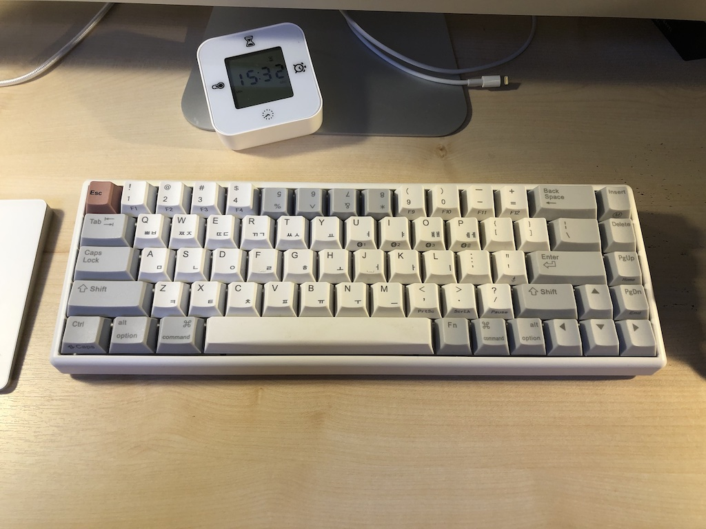
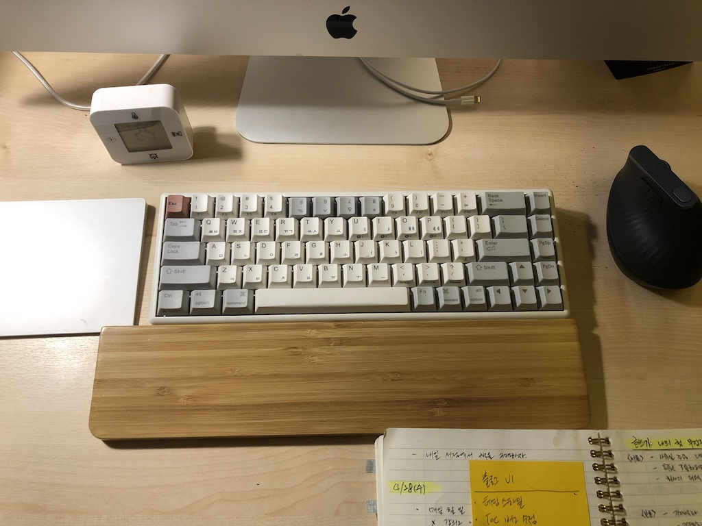
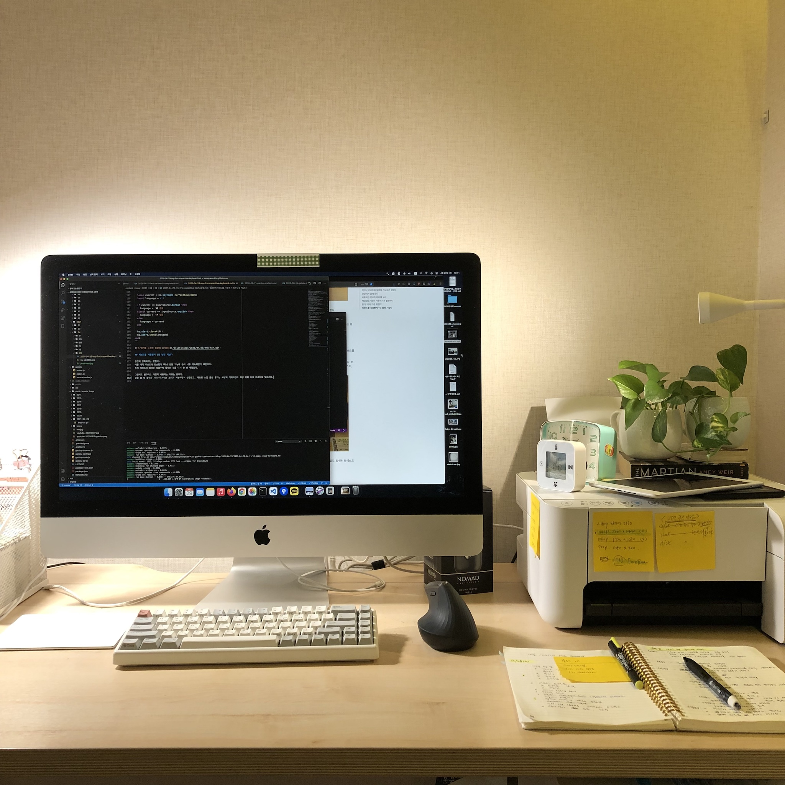

항상 컴퓨터로 일하는 사람들은 누구나 한 번 키보드에 욕심을 부려 보았을 것이다.
노트북에 내장된 것으로는 아쉬워서 외장 키보드를 연결해 사용하는데 그 가격만이 천차만별이다.

처음 해피해킹을 보았을 때 단순한 디자인에 매료되서 너무 갖고 싶었다.
30만원이 넘는 가격을 확인하고서야 구매를 포기했는데 이처럼 키보드는 여유돈이 생기면 사고 싶은 일종의 악세사리 같다.

한 동안 애플의 매직 키보드만 사용했는데, 작년부터 회사에서 재택 근무를 위한 지원비가 생긴 뒤 다시 외장 키보드로 눈을 돌렸다.

## 기계식 키보드와 무접점 키보드가 있었다

기계식 키보드는 종류가 많고 소리와 키압이 다양했다.
청축, 갈축 등 이름도 어렵고 내 스타일과 거리가 멀게 보였다.
오히려 내 흥미를 떨어뜨렸다.

그냥 작고 단순한 키보드를 찾고 있었다.
해피해킹이나 레오폴드, 혹은 리얼포스 화이트 같은 것들 말이다.
알고 보니 이런건 기계식 키보드가 아니라 **무접점 키보드**라고 분류하더라.

키를 누른만큼 아래 스프링이 눌리면서 그 아래있는 축전기의 축전양이 변해 입력 신호를 보내는 방식이다.
회로판에 직접 닿지 않고 이렇게 축전양을 센서가 체크하는 방식이라서 "무접접"이라고 표현한다.

기계식 키보드의 소리와 비교해 보면 훨씬 조용하다.
기계 느낌이라기 보다는 플라스틱 장난감 같은 소리가 난다.
혹자는 "초콜릿 부서지는 소리같다"고도 한다.

하지만 위에 나열한 무접점 키보드는 가성비라는 면에서 내 소비 철학과 맞지 않았다.
업무 생산력이 늘어나는 것도아니고 터널 증후군 같은 증상을 예방할 수 있는 것도 아니기 때문이다.

고민하던 중에 키보드에 해박한 지식을 갖고 있는 지인이 떠올라 물어봤다.
마침 비교적 최근에 나온 가성비 좋은 국내산 무접점 키보드를 추천 받았다.

- [한성컴퓨터 GK868B TICO](https://www.monsterlabs.co.kr/src/category/read.html?pn=39791)

## 모양새가 맘에 든다

일 년 남짓 사용했는데 분명한 장점이 있다. 소리와 모양새.



키를 누를 때 들리는 "사각사각" 소리는 귀에 거슬리 않으면서도 타이핑을 즐겁게 한다.

게다가 흰색 자판은 오래된 것을 선호하는 나같은 사람에게 충분히 매력적인 디자인이다.

제품 라인업의 다른 모델들과 달리 상단에 기능키가 없고 대신 숫자키와 Fn 키를 조합해서 사용하는 방식이다.
해피해킹과 비슷한 이런 점은 아기자기한 분위기를 자아낸다.

하지만 몇 가지 단점도 있었다.

## 사용하던 키보드에 비해 높다

어쩔 수 없이 손목이 꺽여 미미한 통증을 느끼기 직전이다.
막 아프고 그런 것은 아니다.
조금만 키보드를 사용하보면 금새 손목 근육에 힘을 주어 긴장하고 있었다.

수건 팜레스트를 사용하면 푹신하고 팔목에 맺힌 땀 제거도 탁월해서 좋긴한데 너무 거추장스러웠다.
비용을 지불해 대나무 재질의 값 싼 팜레스트를 구매하니 그나마 좀 볼만 했다.
하지만 키보드, 팜레스트, 노트를 책상에 올려두기에는 비좁았다.



이런 점에서 애플 매직 키보드는 무척 편했다.
키보드 높이가 낮아 손목의 부담이 없다.
당연히 팜레스트 따위는 필요없기 때문에 노트와 함께 사용해도 공간이 충분했다.

## 맥OS의 기능키 사용하기가 불편하다

매직 키보드의 기능키는 표준 기능 키와 특수 기능키를 제공한다.

표준 기능키는 F1, F2 같은 일반적인 기능키이고, 특수 기능키는 화면 밝기 조절, 런치패드, 음량 조절 키다.
같은 기능키이지만 fn 키와 조합하면 표준 기능키나 특수 기능키로 사용할 수 있다.

그래서 별 신경쓰지 않고 사용했는데 한성 키보드를 사용하면서 이게 제대로 안되니깐 무척 불편했다.

최소한 아래 목록 정도는 키보드로 제어할 수 있어야 편리할 것 같다.

- 밝기 조절
- 런치패드
- 볼륨 조절

우선은 키보드 환경설정에서 "F1, F2 등의 키를 표준 기능 키로 사용"으로 설정했다.
Fn + 숫자키를 조합하면 표준 기능키로 동작한다.

키보드에 표기된 PrtSc, ScrLk, Pause 키는 F13, F14, F15키 역할을 하는데
F14, F15은 맥OS에 화면 밝기 조절 신호를 보내고 있었다.
밝기 조절은 해결.

- ~~밝기 조절~~

나머지 특수 기능은 기본 여전히 키보드 자체로는 해결할 수 없었다.
그러다가 평소에 햄머스푼으로 키보드 커스터마이징을 하고 있는게 문득 생각났다.
F13, F14, F15 키와 command 키를 조합하는 되겠다는 생각이 들었다.
아래는 해머스푼에 추가한 루아 코드다.

```lua
-- F13: 런치패드
hs.hotkey.bind({}, 'f13', function()
  hs.application.launchOrFocus('launchpad')
end)
```

- ~~런치패드~~

```lua
local function sendSystemKey(key)
  hs.eventtap.event.newSystemKeyEvent(key, true):post()
  hs.eventtap.event.newSystemKeyEvent(key, false):post()
end

local volume = {
  up = function() sendSystemKey("SOUND_UP") end,
  down = function() sendSystemKey("SOUND_DOWN") end,
  mute = function() sendSystemKey("MUTE") end,
}

-- command + F13: 음소거
-- command + F14: 볼륨 올리기
-- command + F15: 볼륨 내리기
hs.hotkey.bind({'cmd'}, "f13", volume.mute)
hs.hotkey.bind({'cmd'}, "f14", volume.down, nil, volume.down)
hs.hotkey.bind({'cmd'}, "f15", volume.up, nil, volume.up)
```

- ~~볼륨 조절~~

## 한/영 키가 가끔 밀린다

이게 뽑기 운이 없는건지 제품 자체의 하자인지는 모르겠다.
자주 사용하는 한/영키는 밀리기 시작하면 무척 짜증났다.
한글에서 영문으로 변경하고 타이핑하려고 하면 한글이 입력된다.
입력한걸 지우고 다시 변환키를 눌러야해서 무척 낭비이기 때문이다.
생각을 뚝뚝 끊어버리는 기분이 든다.

한/영키를 변경하면 맥OS는 우측 상단에 변경된 언어를 표시한다.
매번 타이핑 하기 전에 이걸 잘 확인해야지 마음먹고 시도해 보았지만 잘 안됐다.
한영 표시 아이콘이 너무 작고 모서리에 있어서 눈에 잘 안띄기 때문이다.

중앙에 좀 크게 표시되었으면 좋겠다는 생각을 했다.

검색하다보니 나와 똑같은 문제를 겪고 해결한 글을 찾았다.
키보드를 추천해준 지인의 글이었다(참고: [해머스푼으로 한/영 전환 오로라를 만들자](https://johngrib.github.io/wiki/hammerspoon-inputsource-aurora/)).

참고해서 비슷하게 문제를 해결했다.

```lua
hs.keycodes.inputSourceChanged(function(v)
  local inputSource = {
    english = "com.apple.keylayout.ABC",
    korean = "com.apple.inputmethod.Korean.2SetKorean",
  }

  local current = hs.keycodes.currentSourceID()
  local language = nil

  if current == inputSource.korean then
    language = '🇰🇷 한글'
  elseif current == inputSource.english then
    language = '🇺🇸 영문'
  else
    language = current
  end

  hs.alert.closeAll()
  hs.alert.show(language)
end)
```


## 키보드를 사용한지 1년 남짓 지났다

완전히 만족하지는 못한다.
애플 매직 키보드의 단순함과 맥OS 연동 기능에 손이 너무 익숙해졌기 때문이다.
특히 키보드의 높이는 낮을수록 좋다는 것을 다시 한 번 깨달았다.

그럼에도 불구하고 여전히 사용하는 이유는 분위기.
글을 쓸 때 들리는 사각사각거리는 소리가 차분하면서 앙증맞고, 레트로 느낌 물씬 풍기는 색상과 디자자인이 책상 위를 더욱 아름답게 빛내준다.


