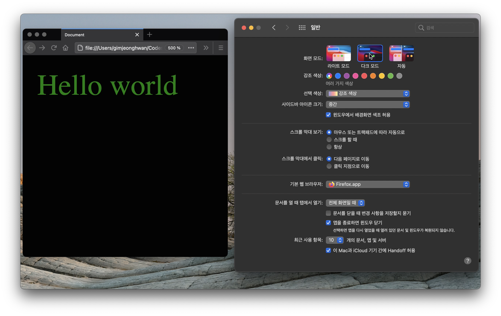

맥OS에 다크 테마가 나온 후 웹 사이트에도 다크 테마 버전이 적용된 걸 심심찮게 보았다. 나는 맥OS 화면 모드를 자동으로 두어 해가 뜨면 라이트 모드로 해가지면 다크 모드로 설정해 두는데 이 변화가 웹사이트까지 영향을 주는 모습이 꽤 인상적이었다.

이런 동적 테마는 요점 쉽게 찾을수 눈에 보이는 즐거움만이 다가 아니다. 하루 종일 화면을 보고 있다가 저녁이면 다크모드로 변화하는 것이 눈을 덜 피로하게 하는 것 같다.

구현하는 방법 중에 하나로 CSS 변수(CSS Variable)를 사용하는 글을 여러번 보았는데 한 번 정리해 봐야겠다.



## CSS 변수

여타 언어처럼 CSS에도 변수가 있다. `--`으로 시작하는 이름으로 변수를 정의하는 문법이다.

```css
:root {
  --brand-color: blue;
}
```

css 코드를 정의할때 셀렉터 안에 설정해서 유효범위를 만들듯이 변수도 그런 위치에 정의한다. :root 의사 클래스는 문서 트리의 루트 요소를 의미한다. 따라서 이 변수는 어디에서도 사용할수 있는 전역 변수가 되는 셈이다. (참고: [MDN :root](https://developer.mozilla.org/ko/docs/Web/CSS/:root))

변수에 할당할 수 있는 값은 색상, 픽셀 등 어떠한 값이라도 가능하다. 값의 유효성은 사용할 때 판단하는데 `var()` 함수를 사용해 변수를 인자로 전달한다.

```css
body {
  color: var(--brand-color);
}
```

이렇게 하면 `color: blue;` 구문과 같은 결과가 된다. 이 구문과 차이는 뭘까? 바로 변수를 사용하는 이점과 같다. 반복 코드를 줄이고 변수를 재사용할 수 있다.

CSS 변수를 다루는 글을 읽을 때마다 궁금한 것이 있었다.

> 그래서 어느 브라우져까지 지원돼?

## 브라우져 지원

최신 브라우져에서는 대부분 지원한다.

- 참고: [https://caniuse.com/?search=css variable](https://caniuse.com/?search=css%20variable)

하지만 IE를 지원하는 경우에는 여전히 사용할 수 없다. 브라우져가 CSS 변수를 모르고 var() 함수도 사용할 수 없기 때문이다. 찾아보니 CSS 문법 특성을 이용해서 코드를 오버라이딩 하는 방식을 사용하기도 한다.

- 참고: [https://increment.com/frontend/a-users-guide-to-css-variables/#what-about-browser-support](https://increment.com/frontend/a-users-guide-to-css-variables/#what-about-browser-support)

```css
body {
  color: green;
  color: var(--brand-color);
}
```

CSS 코드는 스타일 정의를 덮어 쓰기 때문에 변수를 지원하는 브라우져에서는 2번 라인 코드로 동작할 것이다. CSS 변수를 지원하지 않는 경우 2번 라인 코드는 무시하기 때문에 1번 라인 코드만 인식될 것이다.

## 전처리 언어와 다른점

자바스크립트의 슈퍼셋이 타입스크립트인 것처럼 CSS의 부족한 부분을 채운 슈퍼셋 언어가 있다. SASS, LESS 등이 그것인데 이들 전처리 언어의 특징 중 하나가 변수 지원이다. 색상, 단위 길이를 변수로 관리하면 코드를 유지보수하는데 편리하다. 웹사이트 전반에 일관적인 색상과 크기를 유지할 수 있기 때문이다.

그렇다면 전처리 언어의 변수와 CSS 변수의 차이는 뭘까?

전처리 언어에서 변수를 정의하고 사용하면 작성하는 코드에서는 변수를 재활용하는 효과를 얻을 수 있다. 하지만 브라우져에서 읽히려면 CSS 코드로 변경해야하는데 모두 값으로 치환된다.

반면 CSS 변수는 그대로 브라우저에서 실행된다. 어플리케이션 실행 중에 변수 값을 바꾸면 브라우져는 곧장 변경된 스타일을 적용한다. 전처리언어의 변수를 빌드되어 고정된 CSS를 생성하는 "정적"인 반면 CSS 변수는 "동적"인 점이 다르다.

CSS 변수는 사용자 지정 속성이라고도 부르는데 자바스크립트로 조회하고 변경할 수 있다.

```jsx
document.body.style.getPropertyValue("--brand-color") // blue
document.body.style.setProperty("--font-color", "red")
```

이렇게 변수 값을 변경하면 곧장 브라우져는 이 변수를 사용한 스타일도 변경한다.

## CSS 변수 활용

CSS 변수를 사용하면 일반 프로그래밍 언어에서의 장점을 얻을 수 있다. 바로 재활용이다. 변수 없이 값을 직접 사용하면 나중에 해당 값을 변경할 때 손이 많이 간다.

값을 사용할 때 좀 난감한 것이 의미가 좀 명확하지 않다(유의어 찾기). 같은 파란색이라도 color 속성에서 사용한 것과 backgroun-color 속성에서 사용한 것은 좀 다를 수 있다.

```css
.title {
    color: blue;
}

.button {
  background-color: blue;
}
```

제목과 버튼을 파란색으로 했다. 어플리케이션 브랜드 색상을 파란색에서 빨간색으로 바꾼다고 했을 때 제목과 버튼 중 어느 것을 변경해야할지 모르겠다.

하지만 변수를 사용하면 의도가 분명할 수 있겠다.

```css
.title {
    color: var(--brand-color);
}

.button {
    background-color: blue;
}
```

둘 다 파란색이지만 브랜드 컬러를 변경할 경우에는 변수를 사용한 제목만 변경될 것이라는 것을 알 수 있다.

CSS 변수를 활용한 재밌는 글중에 HSLA 색상과 같이 사용한 것이 재밌었다.

- [CSS 변수 합성의 강력함](https://ui.toast.com/weekly-pick/ko_20210402)

색을 표현할 때 RGB나 HEX 값을 사용하는데 잘 안 읽힌다. 마치 2진수를 읽는 느낌이 드는데 이 글에서는 HSLA 색상을 사용해서 가독성을 확보한다. 색상, 채도, 명도, 투명도를 이용해 색을 표현하는 방법인데 색이 얼마나 비슷한지 수치로 알 수 있는 방법이다.

색상 값을 CSS 변수에 담아 팔래트를 만드는 방법인데 꽤나 인상적이었다.

```css
:root {
  --base-blue: 222, 89%;

  --palette-blue-10: hsla(var(--base-blue), 10%, 100%);
  --palette-blue-20: hsla(var(--base-blue), 20%, 100%);
  /* ... */
}
```

## 웹 사이트에 다크 테마 추가

동적으로 반응하는 CSS 변수를 활용한다면 비교적 간단하게 동적 테마를 만들 수 있겠다.

먼저 테마 정보를 담을 셀렉터로 CSS 변수 값을 정의한다.

```css
body,
body[data-theme="light"] {
  --background-color: white;
  --font-color: black;
}
body[data-theme="dark"] {
  --background-color: black;
  --font-color: green;
}
```

일종의 분기문처럼 보인다. body 태그에 data-theme 속성값이 light일 경우와 dark일 경우 변수를 다르게 초기화 했다.

이 변수를 사용해서 스타일을 정의한다.

```css
body {
  background-color: var(--background-color);
  color: var(--font-color);
}
```

body에 배경색과 글자 색을 변수 값으로 지정했다. 이러면 data-theme 속성에 따라서 배경과 글자 색을 바꾸겠다는 의도다.

이제 브라우져에서 테마 정보를 가져올 차례다. 브라우저 전역 객체의 matchMedia 함수를 통해 선택된 테마 값을 조회하는 방식을 사용했다.

```jsx
// 1
function setTheme(darkSchemeMediaQueryList) {
  const theme = darkSchemeMediaQueryList.matches ? "dark" : "light"
  document.body.dataset.theme = theme
}

// 2
const mediaQuery = "(prefers-color-scheme: dark)"
setTheme(window.matchMedia(mediaQuery))
```

테마를 설정할 setTheme 함수를 정의한다(1). 브라우저의 다크모드가 세팅되어있는지 darkSchemeMediaQueryList 인자로 받아서 테마를 계산하는데 'dark', 'light' 값 중에 하나를 고르게 될 것이다. 이 정보를 돔 body의 data-\* 속성에 저장해 둔다.

브라우저의 다크모드 정보를 알아야하는데 matchMeda() 함수를 사용했다(2). 적절한 미디어 쿼리를 인자로 전달하면 이 함수는 mediaQueryList 형식의 결과를 반환하는데 이걸 setTheme() 의 인자로 전달해서 호출했다.

브라우져 테마 정보가 body 데이터 속성에 저장되고 여기에 의존하는 CSS 변수값이 어플리케이션 실행중에 변경될 것이다.

이제 화면이 로딩되면 setTheme() 함수가 호출되고 테마 정보가 돔에 기록되고 css가 이를 보고 스타일을 계산하게 될 것이다.

한편 어플리케이션 실행 중에 브라우져 테마를 변경하면 이것도 어플리케이션에 반영했으면 좋겠다. MediaQueryList는 변경될 때마다 이벤트를 발행하는데 이때도 setTheme 함수가 실행되도록 했다.

```jsx
window.matchMedia(mediaQuery).addEventListener("change", setTheme)
```


## 정리

참고

- [사용자 지정 CSS 속성 사용하기 (변수)](https://developer.mozilla.org/ko/docs/Web/CSS/Using_CSS_custom_properties)
- [A user’s guide to CSS variables](https://increment.com/frontend/a-users-guide-to-css-variables/#what-about-browser-support)
- [The simplest CSS variable dark mode theme](https://lukelowrey.com/css-variable-theme-switcher/)
- [The Power of Composition with CSS Variables](https://blog.maximeheckel.com/posts/the-power-of-composition-with-css-variables)
