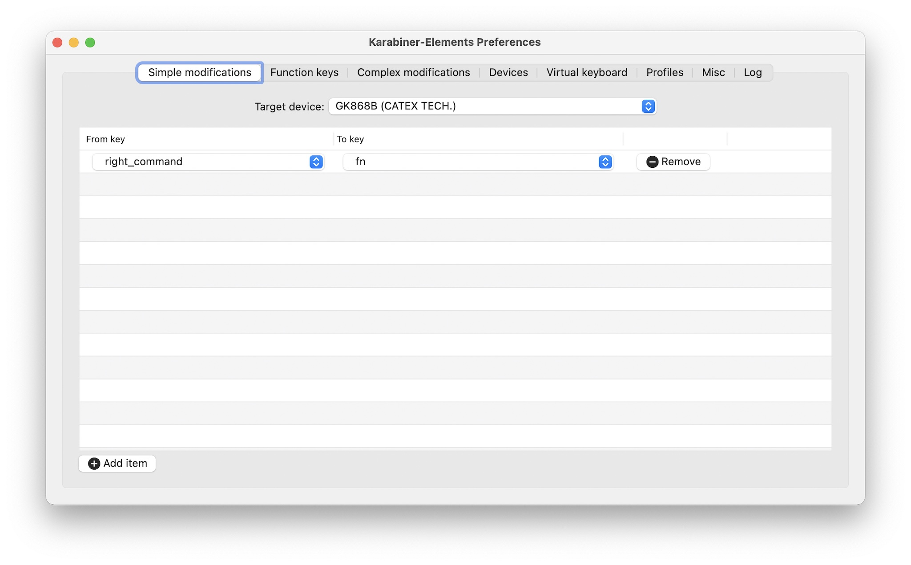
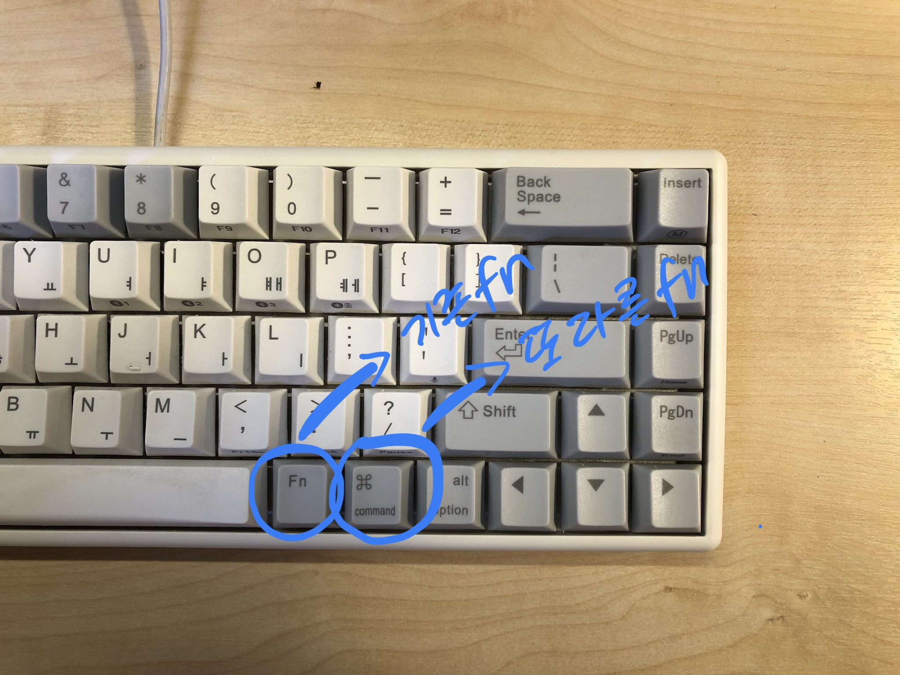
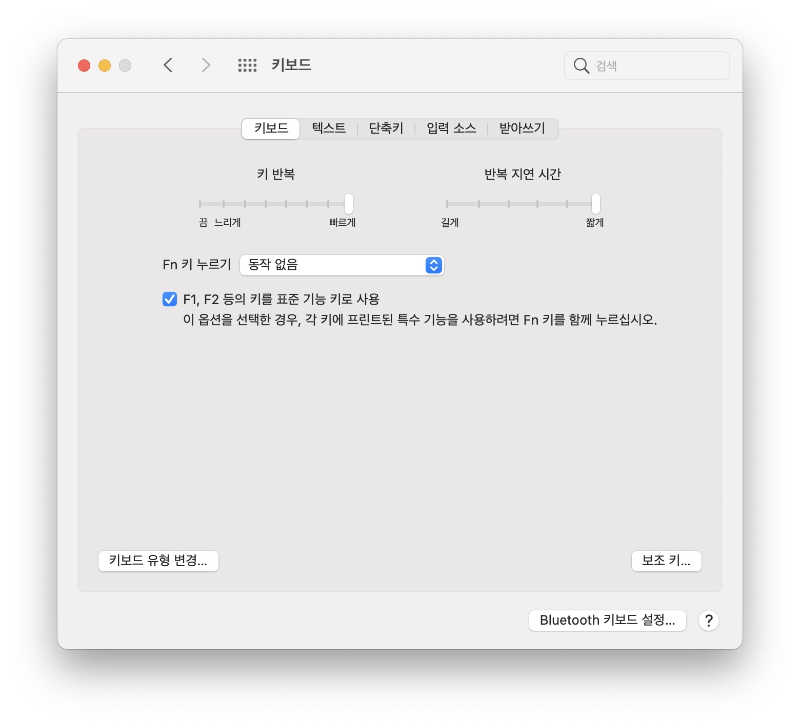

이전 글([나의 첫 무접점 키보드](/think/2021/04/29/my-first-capacitive-keyboard.html))에서 소개한 키보드를 여전히 사용하고 있다.
이 키보드 키배열에 손가락이 익숙해 오타도 줄어들고 손바닥도 고정된 상태로 타이핑할 수 있게 되었다.

하지만 맥 운영체제의 특수 기능키를 매직 키보드처럼 쓰고 싶은 아쉬움은 여전하다.
지금은 일부 기능만 몇 가지 키조합으로 사용하고 있는데 최대한 매직 키보드의 그것처럼 사용하고 싶다.

이번에 나온 키크론 k12 모델을 보니 이런 방법을 제공하더라.
두 개의 fn를 제공하는데 하나는 표준 기능키를 나머지 하나는 특수키를 입력할 수 있는 것 같다.
내 키보드도 fn키를 하나 더 제공하면 원하는 것을 할 수 있는 실마리를 발견할 수 있지 않을까?

## 표준 기능키를 사용하도록 하자

키보드 신호를 제어하는 맥용 소프트웨어 카라바이너는 입력된 키를 다른 신호로 바꿔주는 기능을 제공한다.
거의 사용하지 않는 오른쪽 커맨드를 fn 키로 바꿔 보았다.

오른쪽 커맨트키를 fn 키로 바딩했다.

키보드에 fn가 두 개 생겼다.

원래의 fn키와 숫자키를 함께 누르면 표준 기능키로 동작한다.
F1, F2 ... 키를 입력할 수 있다.

두 fn키를 누르고 숫자키를 함께 누르면 이제 특수 기능키로 동작한다.
밝기 조절, 미션 컨트롤 ... 등 매직 키보드의 특수 기능키를 모두 사용할 수 있게 되었다.

## 키 입력을 빠릿하게 조절하자

우연히 키보드 관련된 글을 읽었는데 키보드 민감도를 다루는 내용이 있었다.
(참고: [맥 한/영 전환 딜레이 해결 및 키보드 최적화](https://brunch.co.kr/@sungchulkang/6?fbclid=IwAR323LGL8O9I8sUDkna1eJBIYjTJql6hkJ1D-BSMAc9KPgEfDmnStx9x3oI))

같은 키를 지속적으로 누르면 그 글자가 연달아 입력된다.
키를 입력할 때 지연 시간이 조금 있는데 난 이게 불편하다고 생각하지 않았다.
그런데 참고한 글을 통해서 지연시간을 조절할 수 있는 방법을 알게 되었고 나도 그냥 바꿔 봤다.  
가장 빠르게, 짧게로 설정을 변경했다.

이전과 달리 한 키를 지긋이 누르고 있으면 즉각 연달아 키가 입력된다.
특히 글을 쓰거나 코딩할 때 화살표 키로 커서를 이동하는게 좀 편리해졌다.
아니 엄청나게 편리하다.

## 결론

해머스푼으로 키보드 커스터마이징 하던 부분을 일부 카라바이너로 가져왔다. 가벼운 기분이다.

키보드도 훨씬 민감하게 반응해서 키보드 사용하는 재미가 더해졌다. 쾌적한 기분이다.
