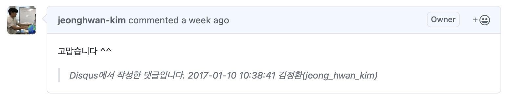

이전글 ([블로그 댓글 서비스 교체: Utterances](/dev/2021/08/26/utterances.html))에서 댓글 서비스를 교체했다.
광고가 달린 disqus 서비스에서 깃헙 기반의 utterance로 바꾼 것이 작업 내용이다.

하지만 그 동안 작성된 댓글은 여전히 disqus에 남아있어서 utterance로 교체해버린 이상 블로그에서 이전 댓글을 볼 수 없게 되버렸다.
이 댓글을 깃헙으로 이관하는 작업이 남았다.

## Utterance가 댓글을 관리하는 방식

먼저 Utterance가 제대로 동작하는지 기존의 댓글을 깃헙에 등록해 보았다.

2016년에 작성한 "워드프레스에서 지킬로 블로그 이동" 이란 포스트인데 주소 "2016/02/07/from-wordpress-to-jekyll.html" 을 제목으로 이슈를 하나 생성했다.
이어서 포스트에 달린 댓글을 깃헙 이슈의 댓글로 오래된 날짜 순서대로 등록했다.

- https://github.com/jeonghwan-kim/jeonghwan-kim.github.com/issues/167

깃헙 이슈를 만든 뒤 해당 페이지로 접속해 보았다.
Utternace가 이슈 내용을 블로그 포스트에 렌더링 해주었다.

- https://jeonghwan-kim.github.io/2016/02/07/from-wordpress-to-jekyll.html

Utterances 가 댓글을 관리하는 방식을 파악했다.

- 댓글이 있는 포스트 주소 제목으로 깃헙 이슈를 만들고
- 포스트의 댓글을 깃헙 이슈의 댓글로 시간 순서대로 등록하면 된다.

## Disqus에서 댓글 다운로드

기존 데이터를 직접 손으로 등록할 수는 없다.
너무 오래 걸릴 뿐만 아니라 실수 할 것이 뻔하기 때문이다.
댓글 데이터를 확보할 수만 있다면 자동화 할 수 있는 방법이 있을 것 같다.

찾아보니 Disqus에서 데이터 백업 기능을 제공한단다.

- [Comments Export](https://help.disqus.com/en/articles/1717164-comments-export)

Disqus 서비스는 사용할 때마다 메뉴 찾는게 쉽지 않은데, 이번에도 메뉴 찾는데 한참 걸렸다.
지금 다시 찾아보려니깐 못찾고 결국 구글링해서 어찌어찌 찾았다.

신청을 하고나면 데이터가 준비될 때 등록한 이메일로 안내를 준다는 메세지를 확인했다.

조금 있으니 메일로 "Export Completed"란 제목으로 메세지를 받았다.
본문의 링크를 클릭하면 yaml 파일로 데이터를 다운로드 할 수 있다.

파일 안에는 그 동안 블로그에 등록된 댓글이 텍스트로 담겨 있었다.

이 파일을 이용해 깃헙 이슈를 생성하는 자동화 툴을 발견했다.

- [disqus-to-github-issues](https://github.com/JuergenGutsch/disqus-to-github-issues)

C# 코드인데 도커를 띄워서 사용하는 방식이 었다.
노드로 실행하면 간편하겠다 생각해서 타입스크립트로 비슷한 로직을 만들었다.

- [disqus-to-utternaces](https://github.com/jeonghwan-kim/disqus-to-utterances)

## 데이터 가공

먼저 데이터를 json으로 변환했다. yaml보다 다루기 편하기 때문이다.
xml2js 이란 라이브러리를 사용했는데 변환하면 다음 구조로 되었있다.

```ts
interface Disqus {
  thread: Thread[]
  post: Post[]
}
```

Thread 배열과 Post 배열을 갖는 객체 형식인데 각 속성은 다음과 같다.

- thread: 블로그 포스트 목록
- post: 댓글 목록

두 배열로만 이뤄진 디스커스 데이터는 댓글이 어느 포스트의 댓글인지는 아이디로 찾아야만 알 수 있다.
좀 더 다루기 쉽게 다음 형식으로 데이터를 변경했다.

```ts
interface Issue {
  // threadId
  postId: string

  // 포스트 주소. 이슈 제목으로 사용된다
  postUrl: string

  // 댓글 목록. Post[] 목록중 해당 특정 thread에 속하는 댓글만 있다. postId로 식별한다
  comments: Comment[]
}
```

댓글 데이터는 깃헙 이슈와 그 댓글로 생성할 것이기 때문에 이 처럼 Issue 데이터를 만들었다.

## Github API로 사용하기

준비한 Issue를 깃헙 이슈로 등록할 차례다.
깃헙에서 제공하는 API를 사용하면 빠르고 실수 없이 이슈를 생성할 수 있다.
이슈를 만들고 여기에 댓글을 만드는 API를 사용했다.

- 이슈 등록: `POST https://api.github.com/repos/{owner}/{repo}/issues`
- 댓글 등록: `POST https://api.github.com/repos/{owner}/{repo}/issues/{issue_number}/comments`

깃헙 API를 사용하려면 요청 헤더에 두 가지 정보를 설정해야 한다.

```ts
const headers = {
  Accept: "application/vnd.github.v3+json",
  Authorization: "token {api_token}",
}
```

[Personal access tokens](https://github.com/settings/tokens) 페이지에서 "Generate new token"으로 토큰을 발급할 수 있다.
"Repo" 스콥을 선택하고 disqus-to-utterances라는 적당한 이름으로 토큰을 만들었다.

이슈 데이터를 깃헙 api로 생성하기 직전 이슈를 눈으로 확인하는 과정을 만들었다.
한번에 깃헙 api를 사용하면 사용량 제한에 걸릴 것 같은 우려가 있었기 때문이다.
이번 참에 댓글을 하나씩 리뷰해 보려고 이슈 단위로 확인하고 업로드 하는 스크립트를 만들어서 데이터 이관을 진행했다.

```
2016-03-24 04:05:42 Atom 에디터 플러그인 정리

  [1] 2017-01-10 09:45:24 dali high(dalihigh)
      <p>감사합니다ㅎㅎ</p>
  [2] 2017-01-10 10:38:41 김정환(jeong_hwan_kim)
      <p>고맙습니다 ^^</p>

이 포스트와 댓글을 깃헙에 생성할까요?(y/N/q) › n
```

## 결론

553개의 댓글을 리뷰하고 올리는데 한 시간이 채 걸리지 않은 듯하다.
중간에 스팸 글도 있어서 제거 했다.

이러한 마이그레이션 방법에 한계도 있다.
Disqus 계정와 깃헙 계정을 매칭할 수 없어서 댓글 본문에 Disqus 계정 정보를 기록했다.
댓글 생성일자도 원래의 일자로 맞출수 없어서 댓글 본문에 같이 기록했다.



참고

- [How to migrate from Disqus to Utterances in your Jekyll blog](https://ljvmiranda921.github.io/notebook/2021/03/26/migrating-from-disqus-to-utterances/)
