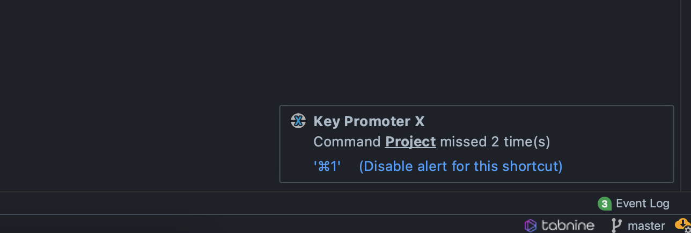
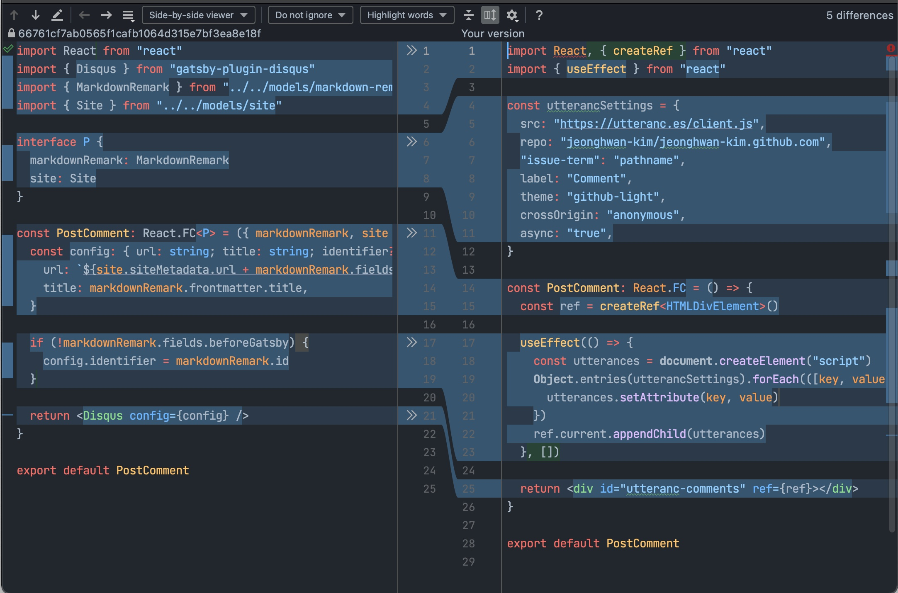
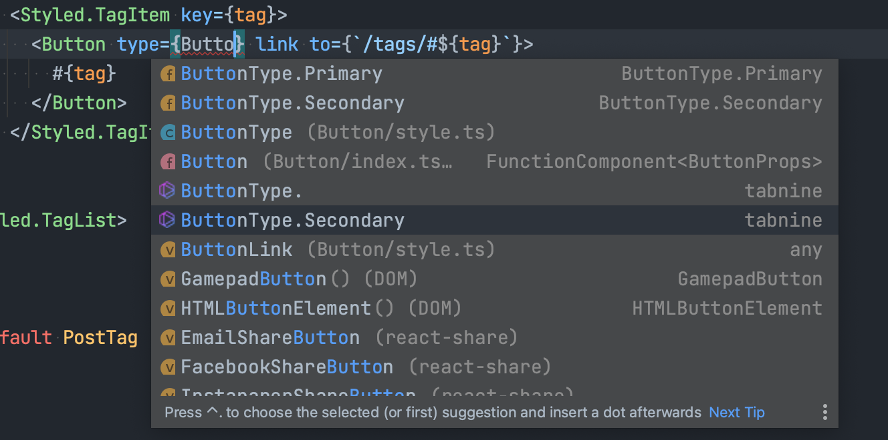

늦은 아침. 프라이펜을 따뜻하게 달군 뒤 남은 식빵과 버터, 치즈 조각을 얹는 요리사. 바삭하게 구워진 토스트를 칼로 먹기 좋게 잘라 아들에게 던져주는 아빠의 모습이 매력적이다. 영화 "쉐프"의 한 장면이다. 요리사는 창의성도 중요하지만 요리 도구도 잘 다뤄야 한다.

도구를 잘 쓰는 것은 비단 요리사 뿐만 아니라 개발자에게도 필요한 역량이다. 개발 도구에 서툴다면 아무리 멋진 아이디어를 생각해 냈다 하더라도 결과물은 늦게 나올 것이다

업무용으로 인텔리제이 제품을 사용하기 시작했다. 사용법이 이전 것과 조금 다르고 사용 습관도 새로 들여야하지만 유료인만큼 훌륭한 도구인 것은 분명한 것 같다.

## 단축키 학습을 돕는 플러그인: Key Promoter X

이전의 비쥬얼 스튜디오 코드는 오래 사용해서 단축키가 손에 익었다. 마우스 없이도 코딩하는데 불편함이 없을 정도다.

왜 마우스 없이 키보드만 사용하려고 할까? 컴퓨터를 다루는 행정병은 한글97 단축키를 암기하고 손에 익히는 훈련을 한다고 한다. 키보드만 사용하면 더 빨리 문서를 만들 수 있기 때문이라고 한다.

키보드로만 코딩할 수 있다면 생산성도 올라갈 수 있지 않을까? 오랜만에 사용한 인텔리제이는 단축키를 다시 익혀야 했다. 메뉴에 표시된 단축키나 환경설정의 키맵(keymap) 메뉴에서 필요한 단축키를 찾아서 사용한다.

얼마전 읽은 포스트에서 나처럼 단축키 학습이 필요한 사람에게 적합한 플러그인을 발견했다.

[Key Promoter X](https://plugins.jetbrains.com/plugin/9792-key-promoter-x)

단축키 학습을 돕는 플러그인이다. 메뉴나 버튼을 클릭하면 플러그인이 "그 메뉴는 단축키 OO이야"라고 친절하게 안내해 준다.

이 플러그인을 사용하면 단축키가 생각나지 않아서 고민할 필요가 없다. 클릭하면 플러그인이 정답을 알려주기 때문이다. 반복 학습을 하다보면 손가락은 어느새 마우스에서 키보드로 옮겨간다.

아이디어가 참신하고 유용해서 가장 먼저 소개했다.

## 두 브랜치의 변경사항 비교

인텔리제이 제품은 깃(Git) 통합 기능이 무척 편했다. 병합 충돌 해결할 때 두 브랜치 중 하나를 선택하면 간편하게 해결할 수 있는데, 텍스트를 직접 삭제하는 것 보다 빠르기 때문이다. 게다가 오타도 인한 실수도 예방할 수 있다.

동료와 짝코딩하면서 새로운 깃 통합 기능을 하나 더 발견했다. 두 브랜치를 비교해 변경된 파일 목록과 그 내용을 볼 수 있다. 마치 깃헙 풀리퀘스트의 코드 변경사항과 비슷하다.

좌측 파일 탐색기를 우클릭하면 나오는 컨텍스트 메뉴 중 "Git > Compare with branch" 가 바로 그것이다. 선택하면 현 브랜치와 비교할 브랜치 목록이 나오고 하나를 선택하면 변경사항을 볼 수 있는 창이 뜬다.

웹페이지에서 코드 리뷰 할 때는 좀 어색한 느낌이 들어 집중하기 힘들 때가 있다. 이럴 때 에디터 기능을 이용하면 비교적 수월하게 코드를 파악할 수 있다.

## 코딩을 더 빨리할 수 있는 플러그인: Tabnine

몇 개의 키입력만으로 많은 코드 조각을 만들 수 있는 기능을 Emmet이라고 부른다. 리액트 컴포넌트를 만드는 코드나 HTML 문서의 시작 코드를 등록해서 사용하면 꽤 빠르게 코딩할 수있다.

[Tabnine](https://www.tabnine.com)도 코딩 속도를 높여주는 플러그인이다. 앞뒤 코드를 고려해 입력할 코드를 추천하는 점이 다른 점이다.

처음에는 인텔리제이의 코드 자동완성과 중복인 줄 알고 몇 번 사용하다 플러그인을 꺼버렸다. 최근에 생각 나서 다시 켜봤는데 자동완성보다 좀 더 구체적으로 코드를 추전해 주는 것을 발견했다. 조급하게 키보드만 '두두두두' 누르려 하지말고 호흡하듯 차분히 살펴보면서 플러그인을 사용하면 꽤나 쓸만하다.

## 결론

재택 근무로 화상회의를 하다보니 서로 화면을 공유할 일이 잦다. 동료들의 화면을 구경할 때는 어떤 도구를 사용하나 눈여겨 보는 편인데 타입스크립트로 개발하다보니 주로 비쥬얼 스튜디오 코드를 사용한다. 나도 몇 년간 애용하다 최근에 인텔리제이 제품을 만지기 시작했는데 유료 도구인 만큼 좋은 점이 많은 것 같다.
