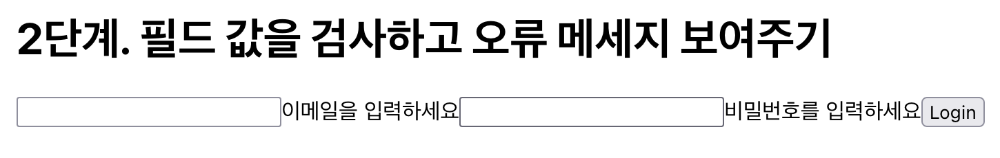
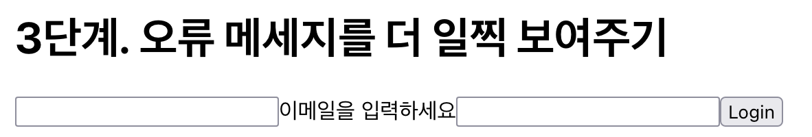

폼 다루는 방법에 대해 얘기해 보자.

브라우져는 폼을 다루기 위한 내장 API를 가지고 있다.
이걸 이용하면 빠르게 폼을 만들수 있는데 이전에 한 번 정리했다.

- [HTML5 폼 검증에 대해 정리해 보자](/dev/2020/06/08/html5-form-validation.html)

브라우저의 내장 API는 웹 개발 요구사항에 따라 한계를 가진다.
커스텀 오류 메세지를 보여준다거나 폼을 제출하기 던에 입력값을 검증하는 등의 행위는 내장 API 만으로
는 구현이 까다롭다.

이러한 요구사항은 아래 세 개로 정리할 수 있다.

- 값을 필드에 바인딩할 수 있다.
- 폼 제출을 처리할 수 있다.
- 제출 전에 필드 값을 검증할 수 있다. 오류 메시지도 필드에 보여준다.

이 글에서는 리액트로 폼 요구사항을 구현하는 과정을 보여주겠다.
재활용 가능한 수준으로 개선하고 마지막에는 폼 라이브러리 formik과 비교하는 순서다.

# 로그인 폼 만들기

## 입력값 바인딩과 제출 이벤트 처리하기

_values, handleChage, handleSubmit_

간단한 로그인 폼을 만들어 보자.

```jsx
const LoginForm1 = () => {
  const [values, setValues] = useState({
    email: "",
    password: "",
  })

  const handleChange = e => {
    setValues({
      ...values,
      [e.target.name]: e.target.value,
    })
  }

  const handleSubmit = e => {
    e.preventDefault()
    alert(JSON.stringify(values, null, 2))
  }

  return (
    <form onSubmit={handleSubmit}>
      <input
        type="text"
        name="email"
        value={values.email}
        onChange={handleChange}
      />
      <input
        type="password"
        name="password"
        value={values.password}
        onChasnge={handleChange}
      />
      <button type="submit">로그인</button>
    </form>
  )
}
```

이메일과 비민번호를 입력받는 필드를 추가하고 values 상태를 정의해서 값을 연결했다.
필드가 변경되면 handleChange() 함수가 values를 갱신한다.
폼이 제출을 기다리는 handleSubmit() 함수는 이 값을 출력한다.
간단한 컴포컴넌트라서 머릿 속에 쉽게 UI를 떠올릴 수 있다.


## 필드 값을 검사하고 오류 메세지 보여주기

_errors, validate_

이번에는 폼을 제출하기 전에 필드 값을 검사하자.
오류가 있으면 오류 메세지를 보여줄 것이다.

```jsx
const LoginForm2 = () => {
  /* 생략 */

  // 오류 메세지를 담는다
  const [errors, setErrors] = useState({
    email: "",
    password: "",
  })

  const handleSubmit = e => {
    // 필드 검사 후
    const errors = validate()
    // 에러 값을 설정하고
    setErrors(errors)
    // 잘못된 값이면 제출 처리를 중단한다.
    if (Object.values(errors).some(v => v)) {
      return
    }

    alert(JSON.stringify(values, null, 2))
  }

  return (
    <form onSubmit={handleSubmit}>
      <input {/* 생략 */} />
      {/* 이메일 오류메시지를 출력한다 */}
      {errors.email && <span>{errors.email}</span>}

      <input {/* 생략 */} />
      {/* 비밀번호 오류메시지를 출력한다 */}
      {errors.password && <span>{errors.password}</span>}

      {/* 생략 */}
    </form>
  )
}
```

각 필드의 오류 메세지를 관리하기 위해 errors 상태를 정의했다.
이 값을 필드 아래에 출력하는 리액트 앨리먼트도 추가했다.

폼을 제출하면 handleSubmit() 함수가 동작하는데 입력한 필드값을 검사하기 위해 validate() 함수를 호출한다.
검증에 통과하지 못하면 폼을 제출하지 않는다.

입력한 필드값를 검사한 뒤 기준에 맞지 않으면 오류 메세지를 추가하는 기능이 남았다.
바로 validate() 함수의 역할이다.

```jsx
const LoginForm2 = () => {
  /* 생략 */

  // 필드값을 검증한다.
  const validate = () => {
    const errors = {
      email: "",
      password: "",
    }

    if (!values.email) {
      errors.email = "이메일을 입력하세요"
    }
    if (!values.password) {
      errors.password = "비밀번호를 입력하세요"
    }

    return errors
  }

  /* 생략 */
}
```

필드값이 있는지 검사해서 없는 필드에 대한 오류 메세지를 추가한다.
모든 필드가 제대로 입력 되었는지도 반환한다.

이메일이나 비밀번호 필드를 입력하지 않고 로그인 버튼을 누르면 오류 메시지가 각 필드 아래 노출될 것이다.
모든 필드를 채우고 로그인 버튼을 누르면 오류 메세지가 사라질 것이다.



## 오류 메세지를 더 일찍 보여주기

_touched, handleBlur_

사용자는 입력할 필드가 많은 폼을 마주하면 부담스럽다.
수많은 필드를 거치며 제출 버튼을 향해 묵묵히 필드에 값을 채워나가야 하기 때문이다.

필드에 잘못된 값을 입력할 때 곧장 오류 메세지를 보여준다면 사용자가 쉽게 폼을 사용할 수 있어서 더 나은 UX다.
다만 사용자가 필드에 값을 다 채우기도 전에 오류 메세지를 보여주는 것 사용자를 재촉하고 무례하다.

사용자가 필드 입력을 마쳤다는 상태를 알고 있다면 이 값에 따라 오류 메세지를 노출하면 되겠다.
입력했다는 상태는 언제 갱신할까?
사용자가 필드를 입력하고 다음 필드로 넘어가는 시점에 발생하는 blur 이벤트를 사용하면 되겠다.

```jsx
const LoginForm3 = () => {
  /* 생략 */

  // 필드 방문 상태를 관리한다
  const [touched, setTouched] = useState({
    email: false,
    password: false,
  })

  // blur 이벤트가 발생하면 touched 상태를 true로 바꾼다
  const handleBlur = e => {
    setTouched({
      ...touched,
      [e.target.name]: true,
    })
  }

  return (
    <form onSubmit={handleSubmit}>
      <input {/* 생략 */} />
      {/* 필드에 방문하면 이메일 오류메시지를 출력한다 */}
      {touched.email && errors.email && <span>{errors.email}</span>}

      <input {/* 생략 */} />
      {/* 필드에 방문하면 비밀번호 오류메시지를 출력한다 */}
      {touched.password && errors.password && <span>{errors.password}</span>}

      <button type="submit">로그인</button>
    </form>
  )
}
```

blur 이벤트가 발생하면 사용자가 특정 필드에 입력을 마쳤다고 볼 수 있겠다.
touched 상태는 각 필드의 방문여부를 나태내는 변수다.

handleBlur() 함수는 blur 이벤트를 발생한 필드의 touched 상태를 true 값으로 변경한다.
이 핸들러는 각필드의 onBlue 콜백 함수로 등록했다.

필드 입력중에 검증을 하고 오류 메세지를 생성해야 필드 방문 후에 오류 메세지가 표시될 것이다.

```jsx
const LoginForm3 = () => {
  // 필드값에 때라 검증 함수를 다시 할당한다.
  const validate = useCallback(() => {
    /* 생략 */
  }, [values])

  // 검증함수가 변경될 때마다 호출한다.
  useEffect(() => {
    validate()
  }, [validate])

  const handleSubmit = () => {
    e.preventDefault()

    // 모든 필드에 방문했다고 표시한다.
    setTouched({
      email: true,
      password: true,
    })

    // 필드 검사 후 잘못된 값이면 제출 처리를 중단한다.
    const errors = validate()
    // 오류 메세지 상태를 갱신한다
    setErrors(errors)
    // 잘못된 값이면 제출 처리를 중단한다.
    if (Object.values(errors).some(v => v)) {
      return
    }

    alert(JSON.stringify(values, null, 2))
  }
}
```

필드 입력값이 변경될 때마다 필드 값을 검증하도록 했다.
뿐만 아니라 폼 제출을 처리할 때도 모든 필드에 방문했다고 표시했다.
오류 메세지가 있을 경우 보여주기 위해서다.

이제 사용자가 각 필드에 값을 잘못 입력하고 다른 필드로 커서를 옮기면 검증한 오류 메세지를 곧장 노출한다.



전체 코드를 보면서 정리해 보자.

```jsx
const LoginForm = () => {
  const [values, setValues] = useState({
    email: "",
    password: "",
  })

  const [errors, setErrors] = useState({
    email: "",
    password: "",
  })

  // 필드 방문 상태를 관리한다
  const [touched, setTouched] = useState({
    email: false,
    password: false,
  })

  const handleChange = e => {
    setValues({
      ...values,
      [e.target.name]: e.target.value,
    })
  }

  // blur 이벤트가 발생하면 touched 상태를 true로 바꾼다
  const handleBlur = e => {
    setTouched({
      ...touched,
      [e.target.name]: true,
    })
  }

  const handleSubmit = e => {
    e.preventDefault()

    // 모든 필드에 방문했다고 표시한다.
    setTouched({
      email: true,
      password: true,
    })

    // 필드 검사 후 잘못된 값이면 제출 처리를 중단한다.
    const errors = validate()
    // 오류 메세지 상태를 갱신한다
    setErrors(errors)
    // 잘못된 값이면 제출 처리를 중단한다.
    if (Object.values(errors).some(v => v)) {
      return
    }

    alert(JSON.stringify(values, null, 2))
  }

  // 필드값을 검증한다.
  const validate = useCallback(() => {
    const errors = {
      email: "",
      password: "",
    }

    if (!values.email) {
      errors.email = "이메일을 입력하세요"
    }
    if (!values.password) {
      errors.password = "비밀번호를 입력하세요"
    }
  }, [values])

  // 입력값이 변경될때 마다 검증한다.
  useEffect(() => {
    validate()
  }, [validate])

  return (
    <form onSubmit={handleSubmit}>
      <input
        type="text"
        name="email"
        value={values.email}
        onChange={handleChange}
        onBlur={handleBlur}
      />
      {/* 이메일 오류메시지를 출력한다 */}
      {touched.email && errors.email && <span>{errors.email}</span>}

      <input
        type="password"
        name="password"
        value={values.password}
        onChange={handleChange}
        onBlur={handleBlur}
      />
      {/* 비밀번호 오류메시지를 출력한다 */}
      {touched.password && errors.password && <span>{errors.password}</span>}

      <button type="submit">Login</button>
    </form>
  )
}
```

# 재활용 가능한 형태로 개선하기

일단 요구사항은 구현은 했다.

- 값을 필드에 바인딩할 수 있다. (values, handleChange)
- 폼 제출을 처리할 수 있다. (handleSubmit)
- 폼 제출전에 필드 값을 검증할수 있다. 오류 메시지도 필드에 출한다. (errors,
  touched, handleBlur)

하지만 이런 방식은 생산적이지 못하다.
코드를 다시 사용할 수 없기 때문이다.
이번에는 재사용 가능한 형태로 개선해 보자.

## useForm 훅으로 분리

로그인 폼은 두 가지 역할이 섞여 있다.
폼을 다루는 **어플리케이션 기능**과 로그인이라는 **도메인 기능**이다.
폼은 로그인 폼 뿐만 아니라 다양한 목적을 위한 폼을 만드는데 다시 사용될 수 있다.
기존 로그인 코드에서 폼 기능만 쏙 빼서 useForm 이라는 훅으로 분리해 보자.

```jsx
// useForm은 폼 기능을 제공한다
function useForm({ initialValues, validate, onSubmit }) {
  const [values, setValues] = useState(initialValues)
  const [errors, setErrors] = useState({})
  const [touched, setTouched] = useState({})

  const handleChange = e => {
    setValues({
      ...values,
      [e.target.name]: e.target.value,
    })
  }

  const handleBlur = e => {
    setTouched({
      ...touched,
      [e.target.name]: true,
    })
  }

  const handleSubmit = e => {
    e.preventDefault()

    // 모든 필드에 방문했다고 표시한다
    setTouched(
      Object.keys(values).reduce((touched, field) => {
        touched[field] = true
        return touched
      }, {})
    )

    const errors = validate(values)
    setErrors(errors)
    if (Object.values(errors).some(v => v)) {
      return
    }

    // useForm의 폼 제출을 완료하고 사용하는 쪽으로 알린다
    onSubmit(values)
  }

  // 입력값에 따라 검증 함수를 실행하는 함수를 정의한다
  const runValidator = useCallback(() => validate(values), [values])

  useEffect(() => {
    const errors = runValidator()
    setErrors(errors)
  }, [runValidator])

  // 훅을 사용하는 쪽에 제공하는 api다
  return {
    values,
    errors,
    touched,
    handleChange,
    handleBlur,
    handleSubmit,
  }
}
```

useForm은 LoginForm에서 로그인 로직을 빼고 폼 로직만 가져왔다.

handleSubmit에서 방문 여부를 설정하는 코드는 로그인 필드 뿐만아니라 어느 필드가 오더라도 모든 필드명을 순회하면서 설정하는 로직으로 바뀌었다.
입력값을 보여주는 로직은 사용하는 쪽 즉 로그인 폼이 알아서 구현하도록 onSubmit 콜백으로 분리했다.

runValidator는 검증자 함수를 외부에서 받아 useCallback으로 만든 함수다.
로그인 폼에서는 validate 함수에 직접 로그인을 위한 검증로직을 만든 반면 useForm에서는 로그인 코드를 모두 제거하고 외부에서 받은 검증자 함수를 적절한 시기에 호출하기만 한다.

마지막에 useForm 외부에서 사용할 수 있는 값과 함수를 반환했다.
useForm은 이렇게 쓸 수 있겠다.

```jsx
const LoginForm4 = () => {
  // useForm에 검증자 함수와 제출 콜백을 인자로 전달한다. 반환한 값에서 필요한 필드를 뽑아냈다.
  const { errors, touched, handleChange, handleBlur, handleSubmit } = useForm({
    initialValues: { email: "", password: "" },
    validate: values => {
      const errors = {
        email: "",
        password: "",
      }

      if (!values.email) {
        errors.email = "이메일을 입력하세요"
      }
      if (!values.password) {
        errors.password = "비밀번호를 입력하세요"
      }

      return errors
    },
    onSubmit: values => {
      alert(JSON.stringify(values, null, 2))
    },
  })

  return (
    <form onSubmit={handleSubmit}>
      <input
        type="text"
        name="email"
        value={values.email}
        onChange={handleChange}
        onBlur={handleBlur}
      />
      {touched.email && errors.email && <span>{errors.email}</span>}

      <input
        type="password"
        name="password"
        value={values.password}
        onChange={handleChange}
        onBlur={handleBlur}
      />
      {touched.password && errors.password && <span>{errors.password}</span>}

      <button type="submit">Login</button>
    </form>
  )
}
```

LoginForm에 있던 폼 로직을 사라졌다. useForm으로 옮겼기 때문이다.
로그인이라는 도메인 성격의 코드만 이 함수에 남아있는데 폼 초기값(initialValue)과 제출 처리기(onSubmit)다.
이 두 값은 어떤 폼을 만드냐에따라 달라지기 때문에 인자로 전달한다.

LoginForm에서는 로그인을 위한 두 필드 email과 password를 정의했다.
이 값을 검증하는 validator도 정의했다.
폼 제출을 처리하도록 onSubmit도 정의했다.

**폼**과 **로그인 폼**이라는 두 객체의 관심사가 적절히 분리되었다.

## getFieldProps 유틸 함수 제공

리액트 앨리먼트 부분을 좀 단순하게 만들어 볼까?
가만보면 반복되는 부분이 있다.
value, onChange, onBlur 속성에 할당한 값은 거의 비슷하다.

이 값은 useForm 훅에서 온 값이기 때문에 훅에서 패키지 형태로 제공해 주면 좋겠다.

```jsx
function useForm() {
  /* 생략 */

  // 필드 속성으로 사용할 값을 조회한다
  const getFieldProps = name => {
    const value = values[name]
    const onBlur = handleBlur
    const onChange = handleChange

    return {
      name,
      value,
      onBlur,
      onChange,
    }
  }

  // 이 함수를 외부에 제공한다.
  return {
    /* 생략 */
    getFieldProps,
  }
}

const LoginForm = () => {
  const {
    /* 생략 */
    getFieldProps,
  } = useForm(/* 생략 */)

  return (
    <>
      {/* 생략 */}
      <input type="email" {...getFieldProps("email")} />
      {/* 생략 */}
      <input type="password" {...getFieldProps("password")} />
    </>
  )
}
```

훅 내부에서 정의한 getFieldProps 함수는 필드에서 사용할 속성을 반환한다.
필드이름 name, 입력값 value, 블러/변경 이벤트 핸들러 onBlue/handleBlur 를 가진 객체를 반환하도록 했다.

이 객체는 객체구조분해할당으로 간편하게 사용할 수 있다.
각 필드를 식별하려고 인자로 필드명을 받았다.

## 리액트 컨택스트 사용하기

_\<Form\> \<Field\> \<ErrorMessage\>_

리액트 앨리먼트를 정의를 더 단순하게 만들고 싶다.
form, input에 전달하는 속성을 감출 수 있을까? 추상화 한다면 어떤 모습일까? 이런 모습으로 사용해 보고 싶다.

```jsx
const LoginForm = () => (
  <Form>
    <Field type="email" name="email">
    <ErrorMessage name="email">
    <Field type="password" name="password">
    <ErrorMessage name="password">
    <button type="submit">로그인</button>
  </Form>
)
```

컴포넌트의 주된 역할은 UI를 그리는 것이다.
반환하는 리액트 앨리먼트 코드를 보고서 모양을 쉽게 떠올린다면 사용하기 쉬운 컴포넌트다.
그런 점에서 위에 제시한 컴포넌트는 이전에 비해 더 나은 코드다.

상태를 제어하는 코드를 모두 제거했다.
Form, Field, ErrorMessage 컴포넌트가 알아서 상태 제어를 하기 때문이다.
props로 전달하지 않고 상태를 사용하려면 리액트 컨택스를 사용해야겠다.

```jsx
// 컨택스트를 만든다
const FormContext = createContext({});
FormContext.displayName = "FormContext";

const Form = ({children, ...props} => {
  const formValue = useForm(props);

  // 프로바이더에 폼 데이터를 주입한다.
  return (
    <FormContext.Provider value={formValue}>
      <form onSubmit={formValue.handleSubmit}>{children} </form>
    </FormContext.Provider>
  );
}
```

컨택스트를 하나 생성하고 FormContext라고 이름지었다.

Form 컴포넌트는 useForm의 반환값을 컨택스트 프로바이더의 값으로 전달한다.
Form 컴포넌트의 자식 컴포넌트에서 이 값을 사용하려는 의도다.
useForm 인자를 대신 받아야 한다.

form 앨리먼트를 사용하고 제출 이벤트를 처리한다.

하위에서 사용할 컴포넌트는 Field와 ErrorMessage다.

```jsx
// 필드 컴포넌트
const Field = props => {
  const { getFieldProps } = useContext(FormContext)
  return <input {...props} {...getFieldProps(props.name)} />
}

// 오류메시지 컴포넌트
const ErrorMessage = ({ name }) => {
  const { touched, errors } = useContext(FormContext)
  if (!touched[name] || !errors[name]) {
    return null
  }
  return <span>{errors[name]}</span>
}
```

컨택스트를 통해 폼 상태에 접근할 수 있다.
Filed 컴포넌트는 input 필드를 반환하기 때문에 getFieldProps를 가져왔다.
ErrorMessage 컴포넌트는 touched와 errors 상태를 보고 오류 메세지를 노출한다.
둘 다 로그인 컴포넌트에 있던 녀석들인데 도메인 로직만 빼서 재활용 할 수 있는 형태로 바꿨다.

마침내 LoginForm은 이런 모습이 되었다.

```jsx
const LginForm = () => {
  const validate = values => {
    const errors = {
      email: "",
      password: "",
    }

    if (!values.email) {
      errors.email = "이메일을 입력하세요"
    }
    if (!values.password) {
      errors.password = "비밀번호를 입력하세요"
    }

    return errors
  }
  const handleSubmit = values => {
    alert(JSON.stringify(values, null, 2))
  }

  return (
    <>
      <Form
        initialValues={{ email: "", password: "" }}
        validate={validate}
        onSubmit={handleSubmit}
      >
        <Field type="email" name="email" />
        <ErrorMessage name="email" />
        <Field type="password" name="password" />
        <ErrorMessage name="password" />
        <button type="submit">로그인</button>
      </Form>
    </>
  )
}
```

로그인 검증과 로그인 제출 처리 그리고 로그인 UI만 남았다.
폼 로직을 모두 Form, Field, ErrorMessage로 위임했기 때문이다.

로그인 컴포넌트가 단순해진 것 뿐만 아니라 분리한 폼 로직을 재활용 할 수도 있다.
회원가입 폼을 만든다면 Form, Filed, ErrorMessage를 재활용해서 UI를 구성할 수 있다.
회원 가입에 해당하는 initialValue와 validate, onSubmit 함수만 정의하면 된다.

# Formik 소개

[Formik](https://formik.org/)은 이와 유사한 방식으로 동작하는 리액트 폼 라이브러리다.
리액트 공식 문서에 소개된 것을 보고 알게 되었는데 코드가 비교적 단순해서 폼을 이해하고 다루는데 도움이 되었다.

지금까지 작성한 코드를 Formik을 이용해서 바꿔보면 이렇다.

```jsx
const LginForm = () => {
  const validate = values => {
    const errors = {}

    if (!values.email) {
      errors.email = "이메일을 입력하세요"
    }
    if (!values.password) {
      errors.password = "비밀번호를 입력하세요"
    }

    return errors
  }
  const handleSubmit = values => {
    alert(JSON.stringify(values, null, 2))
  }

  return (
    <>
      <Formik
        initialValues={{ email: "", password: "" }}
        validate={validate}
        onSubmit={handleSubmit}
      >
        <Form>
          <Field type="email" name="email" />
          <ErrorMessage name="email" />
          <Field type="password" name="password" />
          <ErrorMessage name="password" />
          <button type="submit">로그인</button>
        </Form>
      </Formik>
    </>
  )
}
```

# 결론

폼을 위해 세 가지 상태를 정의했다.
입력값, 오류메시지, 필드 방문여부.
이 상태를 갱신하면서 사용자가 제대로 폼을 입력하는 기능을 만들었다.

로그인 폼을 읽기 쉽게 하기위해 로그인이라는 도메인 코드만 남겼다.
폼 관련 코드는 재활용할 수 있는 useForm 훅과 Form, Filed, ErrorMessage 컴포넌트로 분리해 냈다.
회원가입 폼을 만든다면 꽤나 많은 코드를 다시 사용할 수 있다.
생산적이다.

비슷한 역할을 하는 formik 라이브러리를 소개했다.
여전히 검증자 함수가 복잡해 보인다면 선언형 밸리데이터 [yup](https://formik.org/docs/tutorial#schema-validation-with-yup)이 대안이 될 수 있다.

오랜만에 글을 썼더니 집중하기 힘들고 시간도 많이 걸렸다.
그만 글도 길어져버렸다.
다시 글쓰는 루틴을 시작하자.

## 참고

- [예제 코드](https://github.com/jeonghwan-kim/2022-post-sample-code/tree/main/react-form)
- [formik 공식문서](https://formik.org/)
