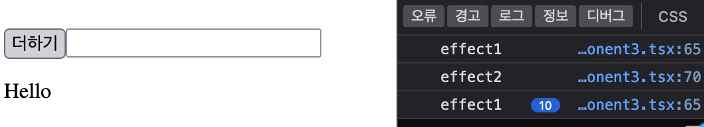
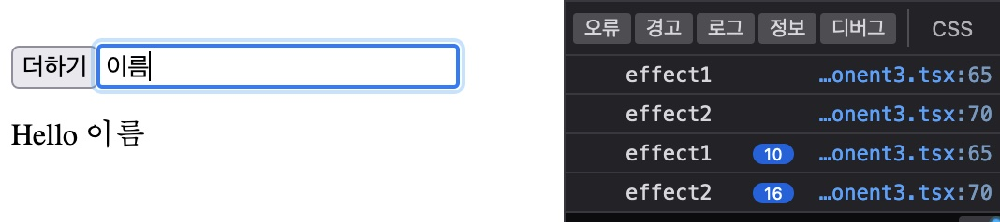
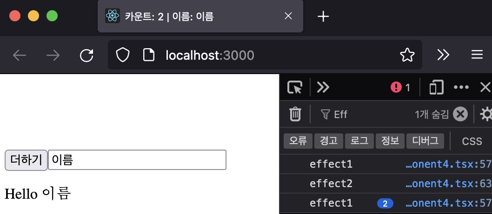
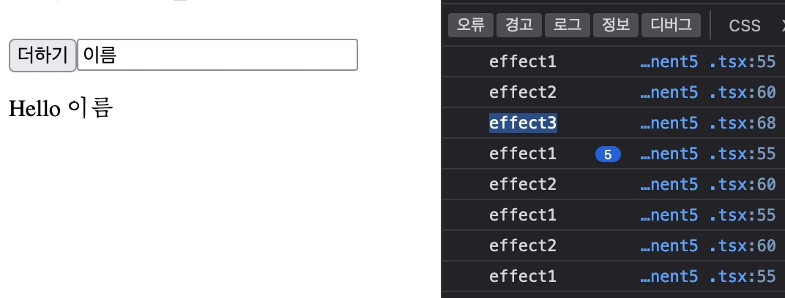
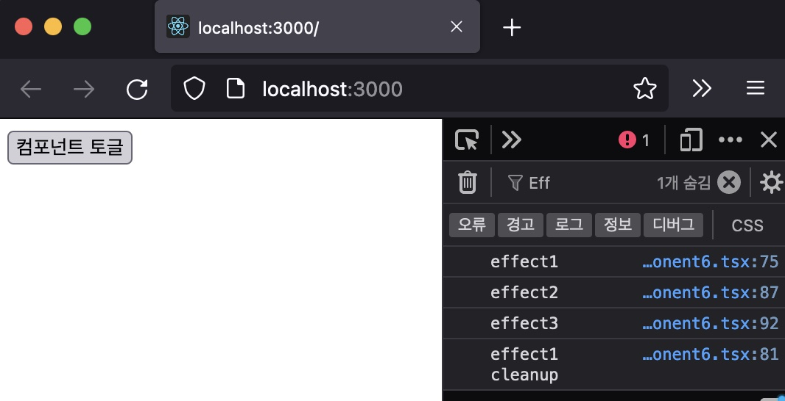

[지난 시간](/dev/2022/04/11/use-state.html)에 이어 useEffect를 직접 만들어 보자.


# 순수함수

순수함수란 무엇일까? 두 가지 특징이 있다. ([참고: 위키피디아 Pure function](https://en.wikipedia.org/wiki/Pure_function))

1. 입력이 같으면 결과도 같다. (the function return values are identical for identical arguments)
2. 부작용(side effects)이 없다 (the function application has no side effect)

함수를 몇 번 호출하던지 관계없이 같은 값을 입력하면 일관된 값을 반환하는 것이 순수함수다. 매번 다른 값을 반환한다면 이 함수는 순수하지 않다고 말한다.

두 번째 특징이 좀 어렵다. 용어부터 정리해 보자.

전등 스위치를 켜면 불빛이 들어오길 기대한다. 현관문이 열리는 것은 기대한 결과가 아니다. 특정 행위를 했을 때 기대하는 결과가 아닌 현상을 부작용이라 할 수 있다. 부정적인 어감이 있는 이 단어보다 "부수 효과"라는 표현이 좀더 어울리는 것 같다.

함수를 실행할때 값을 반환하길 기대한다. 이 외에 다른 현상이 있다면 부수 효과다. 함수 인자를 변경하는 것, 전역 변수를 변경하는 것 등은 부수 효과의 한 형태이다. 순수함수는 조용해야 한다. 몇 번을 실행하더라도 자신의 일만 할 뿐, 함수 바깥을 건드려서는 안된다.

# 컴포넌트

컴포넌트는 리액트 앨리먼트를 반환할 때 순수함수처럼 동작해야 한다.

> render() 함수는 순수해야 합니다. 즉, 컴포넌트의 state를 변경하지 않고, 호출될 때마다 동일한 결과를 반환해야 하며, 브라우저와 직접적으로 상호작용을 하지 않습니다. (참고: [리액트 문서](https://ko.reactjs.org/docs/react-component.html#render))

리액트 앨리먼트를 반환하는 함수 컴포넌트도 마찬가지다. 함수를 몇 번 실행하더라도 같은 props에 대해 일관된 리액트 앨리먼트를 반환해야 한다. 함수를 순수하게 유지해야 컴포넌트의 동작이 이해하기 쉽다.

하지만 UI를 표현하기 위해서 컴포넌트는 부수 효과도 필요하다. 돔을 변경하거나 UI에 필요한 데이터를 얻기위해 ajax 호출을 하는 행동이 필요하다.

클래스 컴포넌트에서 부수효과를 사용하려면 생명주기 메서드를 활용한다. 반면 함수 컴포넌트에서는 이러한 부수 효과를 만들만 한 장소가 없다. 리액트는 함수 컴포넌트가 반환한 리액트 앨리먼트로 렌더링만 할 뿐이다.

클래스 컴포넌트와 비교해 함수 컴포넌트의 이러한 제약은 UI 컴포넌트로써 한계다.

# 부수 효과

함수 컴포넌트에 부수 효과를 욱여 넣어보자.

```jsx
const MyComponent = () => {
  const [count, setCount] = React.useState(0)

  // 돔을 변경하는 부수효과다.
  document.title = `카운트: ${count}`

  const handleClick = () => setCount(count + 1)

  return <button onClick={handleClick}>더하기</button>
}
```

MyComponent는 상태 count를 가진다. 더하기 버튼을 클릭할 때마다 이 값을 하나씩 올린다. count를 문서 제목에 표시하려고 document.title 돔을 변경하는데 count 변수 바로 아래 두었다.

실행해 하면 타이틀이 변한다.

이 컴포넌트는 리액트 앨리먼트를 반환하는 것만이 아니라 돔을 변경하는 부수 효과도 남겼다.

이 부수효과의 문제는 뭘까? 리액트는 이 컴포넌트로부터 리액트 앨리먼트를 받아서 렌더링하려고 할 것이다. 하지만 컴포넌트는 리액트 앨리먼트를 반환하기 전에 돔을 조작하는 상대적으로 느린 작업을 하느라 값을 즉시 반환하지 못한다.

함수 컴포넌트가 직접 돔을 조작하거나 ajax 호출을 하는 등 부수 작용을 일으키면 **그 시간만큼 렌더링을 지연시키는 것이 문제**이다.

# 부수 효과를 지연 실행

리액트가 렌더링을 마친 뒤에 부수 효과를 실행하면 이 문제를 해결할 수 있지 않을까? 부수 효과는 여전히 이 컴포넌트의 역할이기 때문에 어떻게든 실행해야 한다.

컴포넌트가 직접 부수 효과를 실행하는 것이 문제 원인이다. 렌더링을 담당하는 리액트가 부수 효과를 관리하는 것이 낫겠다.

리액트 라이브러리를 직접 수정할 수 없어서 이전 글처럼 MyReact를 만들었다.

```jsx
const MyReact = (function () {
  // 부수 효과(effect)를 등록할 함수를 정의한다
  function useEffect(effect) {
    // UI 렌더링 후 이펙트를 실행한다
    function runEffectDelayed() {
      const ENOUGH_TIME_TO_RENDER = 1
      setTimeout(effect, ENOUGH_TIME_TO_RENDER)
    }
    runEffectDelayed()
  }

  // useEffect를 외부에 제공한다
  return {
    useEffect,
  }
})()
```

부수 효과(side effect)를 사용한다는 의미의 useEffect란 함수를 만들었다. 곧장 실행하지 않고 setTimeout으로 지연 실행했다. 컴포넌트가 반환한 리액트 앨리먼트 렌더링을 마칠수 있게 충분한 시간(ENOUGH_TIME_TO_RENDER)을 기다렸다.

useEffect를 이렇게 사용해 보자.

```jsx
const MyComponent = () => {
  const [count, setCount] = React.useState(0)

  // 부수효과를 등록한다.
  // MyReact가 나중에 실행할 것이다.
  MyReact.useEffect(() => {
    document.title = `카운트: ${count}`
    console.log("effect1")
  })

  // ...
}
```

이제 UI 렌더와 부수효과를 따로 분리해서 실행할 수 있다. 리액트는 함수 컴포넌트가 리액트 앨리먼트를 곧장 반환하기 때문에 신속히 UI를 렌더링 할 수 있다. 컴포넌트는 부수효과를 실행하지 않고 함수로 등록만 한다. MyReact는 리액트가 렌더를 마친 뒤에 이 부수 효과를 실행할 것이다.

이제 아무리 무거운 부수 효과라도 UI 렌더링을 마친 뒤 실행되기 때문에 UI 렌더링이 느려지는 문제는 발생하지 않을 것이다.

# 의존성

상태를 하나 더 추가한다.

```jsx
const MyComponent = () => {
  const [count, setCount] = React.useState(0)
  // 이름
  const [name, setName] = React.useState("")

  MyReact.useEffect(() => {
    document.title = `카운트: ${count}`
    // 이 부수효과는 몇 번 실행 될까?
    console.log(`effect 실행`)
  })

  const handleClick = () => setCount(count + 1)
  const handleChangeName = e => setName(e.target.value)

  return (
    <div>
      <button onClick={handleClick}>더하기</button>
      <input value={name} onChange={handleChangeName} />
    </div>
  )
}
```

name을 input에 바인딩 했다. 인풋 필드에 값을 입력하면 상태 name이 갱신되고 리액트는 컴포넌트에게 리액트 앨리먼트를 요청하고 이를 다시 렌더링 할 것이다.

버튼을 클릭했을 때 count가 변경되고 이 값을 사용하는 부수 효과가 실행되는 것은 의도한 것이다. 하지만 인풋 필드에 값을 입력할 때도 부수효과가 실행되는 것은 의도하지 않았다. 오히려 낭비다.

**필요할 때만 부수효과를 실행할 수 있을까?**

useEffect 부수 효과를 등록할 때 어떤 값을 사용하는지 지정해 보자. MyReact는 이 값을 저장해 두고 다음 부수 효과를 실행하기 직전에 값을 비교해 변경되었을 때만 실행한다. 이것을 "**의존성(dependency)**"이라고 부르자.

```jsx
const MyReact = (function () {
  // 이전 의존성. 다음 의존성 값을 비교하기 위한 용도이다
  let previousDependency;

  function useEffect(effect, dependency) {
    // ...

    // 의존성이 없으면 부수 효과를 바로 실행한다
    if (typeof dependency === "undefined") {
      runEffectDelayed();
      return;
    }

    // 의존값이 변하지 않으면 이펙트를 실행하지 않는다
    if (previousDependency === dependency) {
      return;
    }

    // 의존값이 변할 때만 실행한다
    runEffectDelayed();

    // 의존값을 기억한다.
    previousDependency = dependency;
  }
   // ... 생략
}
```

MyReact 안에 previousDependency 변수를 추가했다. useEffect가 호출될 때 새로 받게될 의존값(dependency)과 비교할 목적이다.

의존성이 없다면 이펙트를 바로 실행한다.

부수효과와 함께 의존성이 전달 된다면 이전 것과 비교한다. 변하지 않았다면 부수 효과를 실행할 필요가 없다. 부수효과는 의존성을 사용하는데 이 값이 같으면 결과도 같기 때문이다.

의존성 값이 변경되었다면 부수 효과를 다시 실행한다. 결과가 다를 것이기 때문이다.

마지막으로 다음 부수 효과를 실행하기 직전에 비교하기 위해 의존성을 갱신해 둔다.

이제 부수 효과를 등록할 때 의존성도 추가하자.

```jsx
const MyComponent = () => {
  // ...

  MyReact.useEffect(() => {
    document.title = `카운트: ${count}`;
    console.log("effect1");
  }, count); // 의존성 count를 추가한다.
```

다시 실행해보자.


# 다중 부수 효과

부수 효과를 하나 더 만들어 보자. 인풋 필드에 입력한 값을 로컬 스토리지에 저장한다.

```jsx
const UseEffect = () => {
  // ...

  // 상태 초기값을 로컬 스토리지에서 가져온다.
  const [name, setName] = React.useState(localStorage.getItem("name") || "")

  MyReact.useEffect(() => {
    // ...
  }, count)

  // 부수 효과를 추가한다.
  MyReact.useEffect(() => {
    // 로컬 스토리지에 입력값을 저장한다
    localStorage.setItem("name", name)
    console.log("effect2")
  }, name)

  // ...
}
```

상태 name이 변경될 때마다 로컬 스토리지에 저장하는 부수 효과다.

실행하면 어떨까?


의존성과 무관하게 부수효과가 매번 실행된다. 차분히 짚어나가 보자.

- 리액트가 렌더링을 마친다
- 첫 번째 부수 효과. 이전 의존성이 undefined이고 지금 의존성이 0이기 때문에 실행한다.
- 두 번째 부수 효과. 이전 의존성이 0이고 지금 의존성이 "" 이기 때문에 실행한다.

각 부수효과가 자신만의 의존성 이력을 비교하지 않는 것이 원인이다. 두 번째 부수 효과는 첫 번째 부수 효과의 의존성과 비교하기 때문에 매번 다르다고 판단해 버린다. 부수 효과가 의존성과 무관하게 실행되는 구조다.

이걸 해결하려면? 각 부수 효과 별로 의존성을 저장하자.

```jsx
const MyReact = (function () {
  // 부수효과별로 의존성 이력을 관리할 배열이다.
  let previousDependencies: any[] = []
  // 현재 부수효과의 의존성 이력을 가리킨다
  let cursor = 0

  function useEffect(effect, dependency) {
    // ...

    if (typeof dependency === "undefined") {
      runEffectDelayed()
      // 다음 부수효과의 의존성 비교를 위해 커서를 옮긴다
      cursor++
      return
    }

    // 커서를 이용해 이전 의존성 값을 가져온다
    const previousDependency = previousDependencies[cursor]

    if (previousDependency === dependency) {
      // 다음 부수효과의 의존성 비교를 위해 커서를 옮긴다
      cursor++
      return
    }

    runEffectDelayed()

    // 커서를 이용해 의존성 값을 기억한다
    previousDependencies[cursor] = dependency

    // 다음 부수효과의 의존성 비교를 위해 커서를 옮긴다
    cursor++
  }

  // 커서 초기화 함수
  function resetCursor() {
    cursor = 0
  }

  return {
    useEffect,
    // 커서 초기화 함수를 제공한다
    resetCursor,
  }
})()
```

부수 효과별로 의존성 이력을 관리하기 위해 previousDependencies 배열로 바꿨다. 부수 효과가 실행되는 순서에 맞춰 커서(cursor)를 두었다. 이 값은 의존성 이력 배열에서 인덱스로 사용할 것이다.

부수효과를 실행한 뒤 커서를 증가했다. 다음에 부수 효과의 의존성 이력을 가리키기 위해서다.

컴포넌트가 호출될 때마다 커서는 초기화 되어야한다. 호출하는 측에서 사용할 수 있도록 resetCursor도 제공한다.
이렇게 사용해 보자.

```jsx
const MyComponent = () => {
  // 컴포넌트를 호출할때마다 커서를 초기화 한다
  MyReact.resetCursor()

  // ...
}
```

컴포넌트가 실행될 때마다 커서를 초기화 했다.

이제는 의존성에 따라서 부수효과가 따로 따로 실행된다.





# 다중 의존성

문서 타이틀에 카운트 뿐만 아니라 이름도 표시해 보겠다. 첫 번째 부수 효과는 타이틀에 표기하는데 count 값을 사용한다. 이름도 표기하려면 name도 사용해야 한다.

단일 의존성 인자를 여러 개 받을 수 있도록 배열로 바꾸자.

```jsx
const MyReact = (function () {
  // ...

  function useEffect(effect, dependency) {

    // 의존성 배열을 비교한다.
    if (JSON.stringify(previousDependency) === JSON.stringify(dependency)) {
      cursor++;
      return;
    }
  // ...
})();
```

의존성 비교하는 부분만 변경했다.

useEffect 함수의 인터페이스 변경에 따라 사용하는 코드도 바꾸자.

```jsx
const MyComponent = () => {
  // ...

  // 의존성을 배열로 변경한다. name을 추가했다.
  MyReact.useEffect(() => {
    // 카운트와 이름을 문서 타이틀에 표시한다.
    document.title = `카운트: ${count} | 이름: ${name}`
    console.log("effect1")
  }, [count, name])

  // 의존성을 배열로 변경한다.
  MyReact.useEffect(() => {
    localStorage.setItem("name", name)
    console.log("effect2")
  }, [name])

  // ...
}
```

버튼을 클릭 하거나 인풋 필드에 입력하면 첫 번째 부수 효과가 실행된다.



# 한 번만 실행하는 부수효과

상태값 초기화 부분을 보자.

```js
const [name, setName] = React.useState(localStorage.getItem("name") || "")
```

로컬 스토리지 값을 직접 가져오는데 두 가지가 우려된다.

1. 로컬 스토리지는 외부 환경이다. 함수 인자로 받은것이 아닌 글로벌 변수를 통해 접근했다.
1. 로컬 스토리지는 동기적으로 동작한다. 그만큼 UI 렌더링을 늦출 것이다.

상태를 초기화하는 부분에 부수 효과가 있다.

이것을 useEffect로 분리하면 어떨까?

```js
const [name, setName] = React.useState("")

useEffect(() => {
  setName(localStorage.getItem("name") || "")
})
```

이 부수 효과는 컴포넌트 상태를 의존하지 않는다. 그저 로컬 스토리지라는 외부 환경에 접근해 값을 가져온다. 의존성이 없기 때문에 리액트는 컴포넌트를 렌더링할 때마다 이 부수 효과를 실행할 것이다. 인풋에 바인딩한 name을 이 부수효과가 로컬스토리지 값으로 덮어 씌워 버릴 것이다. 우리가 의도한 결과가 아니다.

로컬 스토리지에서 값을 가져와 상태의 초기값으로 할당 하고 싶다. 컴포넌트 렌더링 초기에 딱 한 번만 실행되면 좋겠다.

**부수 효과를 한 번만 실행해야 한다.**

부수효과는 의존성의 변화에 따라 실행된다. 그렇다면 고정된 값을 전달하면 되겠지? 그런 의미로 빈 배열을 전달해 보자.

```js
// 의존성으로 빈 배열을 전달한다.
// 리액트는 한 번만 이팩트를 실행할 것이다.
// 의존성이 변하지 않기 때문이다.
useEffect(() => {
  setName(localStorage.getItem("name") || "")
}, [])
```

MyReact에서는 컴포넌트를 실행할 때마다 같은 의존성(빈 배열)이 전달되기 때문에 부수 효과를 한 번만 호출할 것이다.



# 부수 효과 청소하기

MyComponent 문서의 타이틀을 바꿨다. 이 컴포넌트가 리액트 트리에서 사라진다면 타이틀을 원래대로 돌려 놓아야겠다.

부수 효과는 컴포넌트가 실행하면서 낳은 변화이기 때문에 컴포넌트가 사라진다면 이런 변화도 원상태로 복구해야 한다. 그래야 순수한 컴포넌트가 될수 있을 것이다. 예측하고 이해하기 쉽다.

부수 효과를 등록할 때 정리하는 함수도 함께 등록하자.

```js
const MyComponent = () => {
  // ...

  MyReact.useEffect(() => {
    document.title = `카운트: ${count} | 이름: ${name}`;
    console.log("effect1");

    // 리액트 트리에서 컴포넌트가 사라지면 이 컴포넌트로 발생한 이펙트를 정리한다.
    return function cleanup() {
      // 문서 타이틀을 빈 문자열로 설정한다
      document.title = "";
      console.log("effect1 cleanup");
    };
  }, [count, name]);
// ...
```

부수 효과 함수가 cleanup 이란 함수를 반환한다. 이 함수는 부수 효과로 인한 변화를 깨끗히 정리하는 역할을 한다.

MyReact에서 이 청소(cleanup) 함수를 사용해 보자.

```jsx
const MyReact = (function () {
  // 이펙트를 정리하는 함수 목록
  let cleanUps = []

  function useEffect(effect: () => void | CleanUp, dependency?: Dependency) {
    function runDealyEffect() {
      function runEffect() {
        // 부수효과를 호출하고 반환값을 저장한다
        const cleanUp = effect()
        // 클린업 함수가 있으면 저장해 둔다
        if (cleanUp) {
          cleanUps[cursor] = cleanUp
        }
      }
      // ...
    }

    // ...
  }

  // 저장해 둔 클린업 함수를 모두 실행한다.
  function cleanUpEffects() {
    cleanUps.forEach(cleanup => cleanup && cleanup())
    cleanUps = []
    // 이전 의존성도 제거한다
    previousDependencies = []
  }

  return {
    useEffect,
    resetCursor,
    // 외부에서 사용할 수 있다
    cleanUpEffects,
  }
})()
```

부수 효과 별로 청소 함수를 저장해 두기 위해 cleanUps 배열을 추가했다. 부수 효과를 실행해서 얻은 반환 값을 저장해 두고 청소 함수를 반환한다면 이것을 배열에 저장해 둔다.

이 청소 함수를 모두 실행할수 있도록 cleanUpEffects() 함수를 만들었다. 이전 의존성도 함께 초기화 한다.

컴포넌트가 리액트 트리에서 사라질 때 컴포넌트의 부수 효과를 정리해야 한다. 이 시점을 알고있는 것은 바로 컴포넌트를 이용하는 리액트다. 리액트가 cleanUpEffects 함수를 적당한 시점에 호출해 주어야 한다.

우리 예제에서는 이렇게 사용해 보겠다.

```jsx
const MyComponetWrapper = () => {
  const [visible, setVisible] = useState(false)
  const handleClick = () => {
    if (visible) {
      // 컴포넌트가 리액트 트리에서 사라질때 컴포넌트의 부수효과를 정리한다
      MyReact.cleanUpEffects()
    }
    setVisible(!visible)
  }
  return (
    <div>
      <button onClick={handleClick}>컴포넌트 토글</button>
      {visible && <MyComponent />}
    </div>
  )
}
```

MyCompoent를 사용하는 MyComponetWrapper를 만들었다. 버튼을 토글할 때마다 MyComponent를 추가하거나 제거할 것이다.

handleClick 함수에서 visible 상태를 변경해 컴포넌트의 사용하는데 컴포넌트가 사라지기 직전에 직접 cleanUpEffects() 를 호출했다. MyComponent가 만든 부수 효과를 정리하려는 의도다.

컴포넌트를 숨기면 부수 효과를 정리한다.



# 결론

리액트에서 부수 효과를 다루는 useEffect 훅을 흉내내 보았다.

함수 컴포넌트가 직접 부수 효과를 실행하면 그만큼 리액트 렌더링을 지연시킨다. 따라서 useEffect라는 함수로 부수 효과를 등록만 했다. 리액트는 렌더링를 마친 뒤 실행할 것이다.

컴포넌트의 부수 효과는 컴포넌트의 상태나 프롭스를 사용한다. 그렇지 않으면 컴포넌트 안에 있을 필요가 없겠지. 따라서 매번 실행되기 보다는 사용하는 값이 변경될 때만 실행하는 것이 효율적이다. 이를 의존성으로 받아 이 값이 변할 때만 부수 효과가 일어나도록 개선했다.

여러 부수효과를 사용하기 위해 의존성을 배열로 관리했다.

부수 효과가 여러 의존성을 사용하기 위해 배열로 의존성을 받았다.

컴포넌트 렌더링 중 한 번만 동작하는 부수 효과도 있다. 의존성에 고정 값인 빈 배열을 전달해서 해결했다.

부수 효과는 컴포넌트 외부의 변화다. 컴포넌트가 사라진다면 외부 변화를 복구해야 한다. 부수 효과를 등록할때 청소 함수를 함께 등록했다.

**useEffect의 역할은 뭘까?**

컴포넌트는 UI 환경을 변경하면서 자시만의 역할을 수행해 낸다. 클래스 컴포넌트이건 함수 컴포넌트이건 자신만의 고유한 기능이 있다.

클래스 컴포넌트는 메소드 별로 세부 역할을 수행한다. render 함수는 리액트 앨리먼트를 만든다. componentDidMount 같은 생명주기 메서드는 부수 효과를 담당한다. 컴포넌트의 생명 주기에 맞춰 컴포넌트의 동작을 기술하는 것이 클래스 컴포넌트의 방식이다.

함수 컴포넌트는 리액트 앨리먼트를 만드는 역할만 수행한다. useEffect는 함수 컴포넌트가 갖지 못한 부수효과를 실행하는 역할을 해준다. 부수 효과는 컴포넌트의 생명주기와 무관하게 동작한다. 함수 컴포넌트에서는 생명주기가 없다. 대신에 의존성으로 전달한 상태와 프롭스에 따라 부수효과가 움직인다.

함수 컴포넌트가 실행될 때마다 외부 환경을 컴포넌트의 상태와 프롭스와 동기화하는 것이다.

> useEffect lets you synchronize things outside of the React tree according to our props and state.
> (useEffect는 리액트 트리 바깥이 있는 것들을 Props와 State에 따라 동기화 하는 것이다.) - Dan Abramov

## 참고

- [예제 코드](https://github.com/jeonghwan-kim/2022-04-02-react-hooks)
- [Effect hook 사용하기 (리액트 공식 문서)](https://ko.reactjs.org/docs/hooks-effect.html)
- [useEffect 완벽가이드 (번역)](https://overreacted.io/ko/a-complete-guide-to-useeffect/)
- [함수형 컴포넌트와 클래스, 어떤 차이가 존재할까?(번역)](https://overreacted.io/ko/how-are-function-components-different-from-classes/)
- [Side Effect(부수효과)](https://newfind.tistory.com/77)
