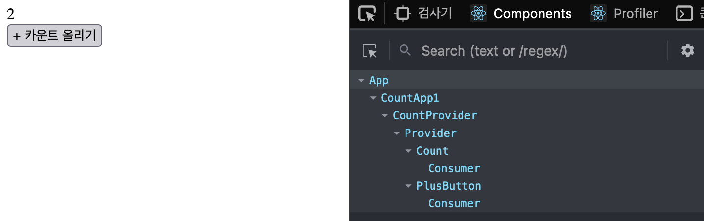
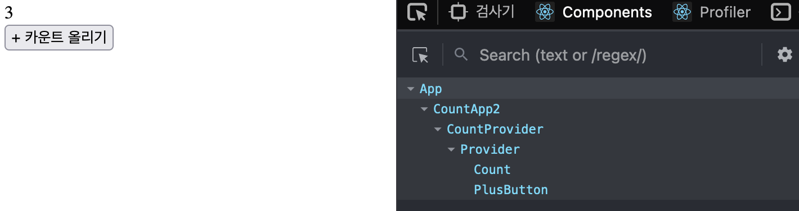

[지난 시간](/dev/2022/04/24/use-effect.html)에 이어 useContext를 직접 만들어 보자.

# 서론

[이전 글](/dev/2021/05/05/react-context.html)에서 컨택스트의 모양이 이렇겠지 하고 정리했는데 잘못된 것 같다.
글에서 만든 코드를 다시 읽어보니 제대로 동작하지 않을 것이 분명하다.

컴포넌트 계층 구조에서 부모-자식 간에는 프롭스(props)를 전달하면서 협력한다.
컴포넌트끼리 접촉해 있어야만 이 메세지를 전달할 수 있는 구조이다.
그렇지 않고 떨어져 있으면 메세지를 전달할 수 없는 것이 리액트 트리의 한계이다.

```jsx
<A>
  <B>
    <C>
```

컴포넌트 A와 B는 접해 있어서 프롭스를 직접 전달할 수 있다. B, C도 마찬가지다.
반면 A와 C는 떨어져 있기 때문에 메세지를 전달할 수 없다.
A의 메세지를 B가 받아서 C에게 전달해 주어야 하는 구조다.
이것을 "[프롭 드릴링(Prop Drilling)](https://kentcdodds.com/blog/prop-drilling)" 현상이라고 한다.

프롭 드릴링은 명시적으로 메세지를 전달하는 장점도 있지만 코드가 많아지고 협력할 컴포넌트 갯수가 많으면 그만큼 메세지 관리가 힘들다.
메세지 전달 단계가 깊어지는 만큼 메세지의 출처를 찾는데 오래 걸리기 때문이다.
컴포넌트 B는 고유의 역할과 무관하게 A와 C 사이에 위치했다는 이유만으로 메세지를 전달만 한다.

# 이벤트 에미터

> 발신자가 메세지를 직접 수신자에게 전달할 방법은 없을까?

이벤트 구독 패턴은 두 객체간의 메세지를 비교적 자유롭게 주고 받을 수 있는 모델이다.
구독자가 특정 이벤트 구독 신청을 해놓기만 하면 나중에 이벤트가 발생했을 때 언제라도 놓치지 않고 받을 수 있다.

이벤트를 발행한뒤 이를 구독하고 있는 객체에게 통지하는 역할을 이벤트 에미터로 구현할 수 있다.
컴포넌트 간에 전달할 메세지를 이벤트 에미터에게 전달하면 이 녀석은 구독하고 있는 컴포넌트들에게 전달하는 방식이다.

이벤트 에미터는 이러한 인터페이스를 가진다.

```js
{
  on(handler) {}
  off(handler) {}
  get() {}
  set() {}
}
```

on/off는 이벤트를 발행할 때 실행할 핸들러를 등록/해지하는 함수다.
get은 이 객체가 갖고 있는 값을 조회하고, set은 값을 설정한 뒤 각 구독 객체에게 전달한다.

이벤트 에미터 생성 함수를 만들어 보자.

```js
function createEventEmitter(value) {
  let handlers = []

  return {
    on(handler) {
      handlers.push(handler)
    },

    off(handler) {
      handlers = handlers.filter(h => h !== handler)
    },

    get() {
      return value
    },

    set(newValue) {
      value = newValue
      handlers.forEach(handler => handler(value))
    },
  }
}
```

이벤트 에미터가 갖고 있을 메세지(value)를 인자로 받아 값을 캡쳐해 둔다.
이 녀석은 구독자를 받을 수 있는데 on 메소드가 handlers 배열에 구독자를 등록할 것이다.
off는 구독 해지하는 메소드다.
get은 이벤트 에미터가 가진 메세지를 조회하는 메소드다.
set은 새로운 메세지를 받고 이를 구독자들에게 통지하는 역할을 한다.

자, 이제 컨택스트를 만들 차례다.

# 컨택스트 만들기

리액트 api처럼 createContext 함수를 만들었다.

```js
const MyReact = (() => {
  function createContext(initialValue) {
    const emitter = createEventEmitter(initialValue)

    const Provider = ({ value, children }) => <>{children}</>

    const Consumer = ({ children }) => <>{children(emitter.get())}</>

    return {
      Provider,
      Consumer,
    }
  }
})()
```

컨택스트의 초기 값을 인자로 받아 컨택스트 객체를 만드는 함수다.
이 값으로 이벤트 에미터를 만들었다.
Provider, Consumer 컴포넌트를 만들었는데 이벤트 에미터를 통해 메세지를 공급/소비하는 역할을 할 것이다.

컨택스트를 이렇게 사용해 보자.

```jsx
const countContext = MyReact.createContext({
  count: 0,
  setCount() {},
})

const CountProvider = ({ children }) => {
  const [count, setCount] = useState(0)

  return (
    <countContext.Provider value={{ count, setCount }}>
      {children}
    </countContext.Provider>
  )
}
```

count와 세터 setCount를 가진 값을 이용해 countContext를 만들었다.
CountProvider 컴포넌트는 이 컨택스트를 이용해 값을 공급하는 역할을 한다.

컨택스트를 통해 공급된 값을 소비해 보자.

```jsx
const Count = () => {
  return (
    <countContext.Consumer>
      {({ count }) => <div>{count}</div>}
    </countContext.Consumer>
  )
}

const PlusButton = () => {
  return (
    <countContext.Consumer>
      {({ count, setCount }) => (
        <button onClick={() => setCount(count + 1)}>+ 카운트 올리기</button>
      )}
    </countContext.Consumer>
  )
}
```

컨택스트가 제공하는 값 중 count를 이용해 값을 표시하는 Count 컴포넌트를 만들었다.
컨택스트의 Consumer 컴포넌트가 자식 children을 렌더 프롭로 사용하기 때문에 함수를 자식 컴포넌트로 정의했다.

버튼 역할을 하는 PlusButton 컴포넌트도 만들었다.
컨택스트가 제공하는 count와 setCount를 사용하는데 카운트 값을 하나씩 증가시킬 것이다.

컨택스트를 이용해 만든 컴포넌트를 조합해 만든 리액트 트리는 이런 모습일 것이다.

```jsx
const App = () => {
  return (
    <CountProvider>
      <Count />
      <PlusButton />
    </CountProvider>
  )
}
```

컴포넌트간에는 아무런 메세지도 전달하지 않는다.
컨택스트를 만들고 CountProvider가 공용 값을 제공할 것이다.
Count와 PlusButton 컴포넌트는 제공된 이 값을 직접 소비한다.

그러나 아직 동작하지는 않는다.
컨택스트의 값은 변경되지만 변경된 값으로 리액트가 컴포넌트를 리렌더 해야하는 과제가 남았다.
컨택스트 값의 변화를 이벤트 에미터가 전달할하여 각 Consumer 컴포넌트가 이를 인지하고 리렌더링 하도록 해야한다.

# Prvider와 Consumer

컴포넌트가 리렌더링되려면 컴포넌트 상태나 프롭스가 변경 되어야 한다.

Provider와 Consumer를 다시 살펴보자.

```jsx
const Provider = ({ value, children }) => <>{children}</>

const Consumer = ({ children }) => <>{children(emitter.get())}</>
```

이벤트 에미터에서 값을 가져오기만했지 값의 변화를 전파하지는 않았다.
이 값이 리액트 상태로 관리되고 값의 이벤트 에미터가 관리하는 값의 변화를 이 상태와 동기화 해야할 것이다.

값을 제공하는 Provider 컴포넌트를 이렇게 바꾸어 보자.

```jsx
const Provider = ({ value, children }) => {
  // value 값이 변하면 이벤트 에미터에게 이를 알린다.
  // 이벤트 에미터는 구독하고 있는 객체들에게 이를 전파할 것이다.
  React.useEffect(() => {
    emitter.set(value)
  }, [value])

  return <>{children}</>
}
```

Provider 컴포넌트는 프롭스로 value가 변경될 때마다 이를 이벤트 에미터에게 알릴 것이다.
메세지를 받은 이벤트 에미터는 캡쳐해둔 값을 새로운 메세지로 변경할 것이다.
그리고 핸들러 함수를 모두 실행하면서 구독하고 있는 객체들에게 변경된 값을 통지할 것이다.

Consumer 컴포넌트를 이렇게 바꿔보자.

```jsx
const Consumer = ({ children }) => {
  // 리렌더링을 위해 이벤트 에미터의 값을 상태 value로 가지고 있다.
  const [value, setValue] = useState(emitter.get())

  // 이벤트 에미터를 구독한다.
  // 이벤트 에미터가 변경을 알리면 이 값을 상태로 세팅한다.
  // 상태가 변경되면 리액트는 이 컴포넌트를 다시 그릴 것이다.
  React.useEffect(() => {
    emitter.on(setValue)
    return () => emitter.off(setValue)
  }, [])

  return <>{children(value)}</>
}
```

리렌더링을 위해 이벤트 에미터의 값을 컴포넌트의 자체 상태 value로 정의했다.
이벤트 에미터를 구독하고 있다가 새로운 메세지가 통보를 받으면 이 상태 갱신한다.
마침내 리액트는 컴포넌트의 상태 변화를 감지한 뒤 이 컴포넌트를 다시 그릴 것이다.



# 좀 더 단순한 방법을 고민

이렇게 해서 컨택스트는 프롭 드릴링 문제를 해결할 수 있지만 여전히 아쉬운 점이 있다.

렌더 프롭은 컴포넌트 재사용의 한 방법이긴 하지만 간결한 사용법이 있으면 더 좋겠다.
재사용의 이점은 있지만 코드 읽기가 비교적 불편하기 때문이다.

게다가 UI와 무관한 Consumer 컴포넌트를 리액트 앨리먼트 사이에 넣어야 한다.
여러 컨택스트를 사용해야되는 상황을 떠올려 보면 확실히 문제다.
컴포넌트 본연의 엘리먼트를 만들기 위해 각 컨택스트의 소비자 컴포넌트로 몇 겹씩 깜사는 모습은 쉽게 UI를 가늠하기 어렵다.

```jsx
<ConsumerA>{a => (
  <ConsumerB>{b => (
    <ConsumerC>{c => (
      // ...
    )}</ConsumerC>
  )}<ConsumerB>
)}</ConsumerA>
```

# 훅을 만들어 보자

Consumer 컴포넌트는 이벤트 에미터의 메세지를 리액트 상태로 가지면서 리액트의 리렌더링을 유발했다.

상태를 커스텀 훅으로도 분리한 뒤 이 훅을 컴포넌트에서 사용할 수 있다.
컨택스트를 소비할 수 있는 useContext 훅을 만들어 보자.

```jsx
const MyReact = (() => {
  // ...

  // 컨택스트 값을 사용할 수 있는 훅이다.
  function useContext(context) {
    // 컨택스트 값을 상태 value로 저장해 둔다
    const [value, setValue] = useState(context.emitter.get())

    React.useEffect(() => {
      // 컨택스트의 이벤트 에미터로부터 값을 수신하면 상태 value를 갱신다.
      // 이 상태를 사용하는 컴포넌트는 리렌더링 될 것이다.
      context.emitter.on(setValue)
      return () => context.emitter.off(setValue)
    }, [context])

    // 컨택스트 값을 반환한다.
    return value
  }

  return {
    createContext,
    // 훅을 제공한다.
    useContext,
  }
})()
```

컨택스트를 인자로 받아 이벤트 에미터의 값을 초기값으로 가지는 상태 value를 만들었다.
이벤트 에미터의 변경을 setValue 함수가 구독해서 컨택스트 값이 변하면 상태 value를 갱신하도록 했다.
Consumer 컴포넌트의 로직과 똑같다.

useContext 훅을 사용하는 컴포넌트는 컨택스트의 값이 변경될 때마다 리액트가 리렌더링 하게 될 것이다.

컨택스트 팩토리 함수의 반환값에 이벤트 에미터도 추가했다.

```jsx
function createContext(initialValue) {
  // ...

  return {
    Provider,
    Consumer,
    // emitter를 제공한다.
    emitter,
  }
}
```

마침내 컨텍스트를 소비하는 코드는 이렇게 바꿀 수 있다.

```jsx
const Count = () => {
  // 컨택스트의 값을 가져온다
  const { count } = MyReact.useContext(countContext)
  // Consumer의 렌더 프롭보다 간결하다.
  return <div>{count}</div>
}
```

Consumer 컴포넌트의 렌더 프롭을 통해 컨택스트 값을 조회했던 코드가 꽤나 간결해 졌다.

PlusButton도 마찬가지다.

```jsx
const PlusButton: FC = () => {
  // 컨택스트의 값을 가져온다
  const { count, setCount } = MyReact.useContext(countContext)
  // Consumer의 렌더 프롭보다 간결하다.
  return <button onClick={e => setCount(count + 1)}>+ 카운트 올리기</button>
}
```



# 결론

이 주제를 고민할 때는 useContext 훅의 구조가 궁금했었다.
리액트가 제공하는 컨택스트 객체를 잘 살펴보면 컨택스트 제공하는 값이 있을 것이라고 생각해서 이를 활용하려고 했다.
값을 제공하기는 하지만 훅으로 분리하기에는 좀 마땅치 않아서 이렇게 컨택스트도 구현하게 되었다.

useContext가 해결하려는 문제는 무엇이었을까?

먼저는 UI 코드에서 컨택스트 코드를 분리할 수 있었다.
컨택스트 값을 사용하기 위해 Consumer 컴포넌트를 리액트 앨림먼트 사이에 끼워넣는 기존 구조는 가독성이 좋지 않다.
사용할 컨택스트 갯수만큼 리액트 트리가 깊어지기 때문이다.

훅을 사용하다 보니 Consumer 컴포넌트의 렌더 프롭이 다소 불편한 API 였구나라는 생각도 들었다.

## 참고

- [예제 코드](https://github.com/jeonghwan-kim/2022-post-sample-code/tree/main/react-hooks)
- [리액트 공식 문서 > useContext](https://ko.reactjs.org/docs/hooks-reference.html#usecontext)
- [jamiebuilds/create-react-context](https://github.com/jamiebuilds/create-react-context)
- [프로퍼티 내리꽂기 (prop drilling)](https://edykim.com/ko/post/prop-drilling/)
