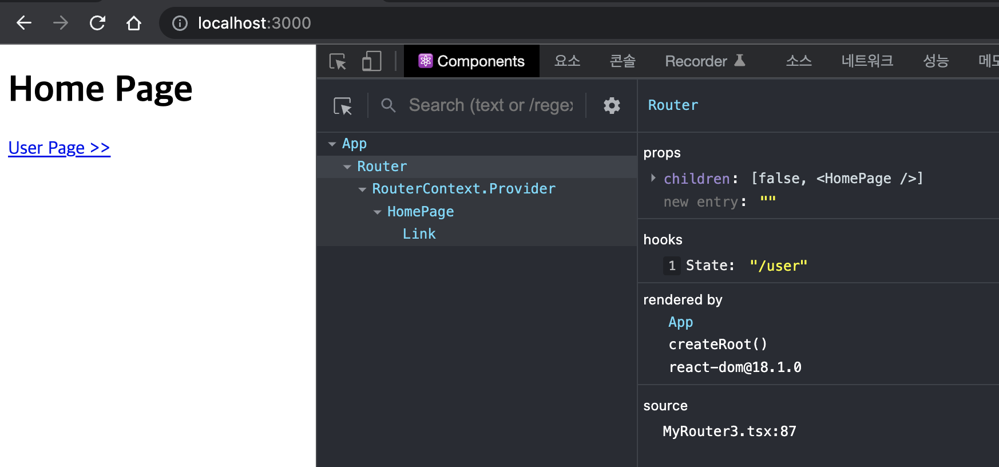
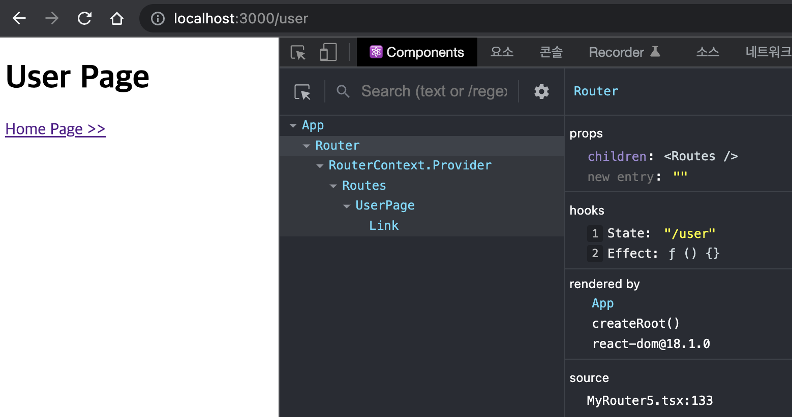
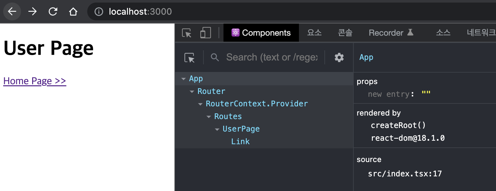

요즘 react-router를 거의 만져보지 못했다. 회사에서 담당한 제품이 사용하지 않은 이유가 크다. 오랜 만에 봤더니 버전 6가지 나왔더라. 예전에 4를 썼던가? 부지런 해야겠다는 생각이 든다.

싱글페이지 어플리케이션의 가장 중요한 기능은 라우터다. 브라우져의 요청에 맞는 웹 페이지를 제공하는 것. 평소에 생각만 해봤다. '히스토리 API를 사용하면 만들 수 있지 않을까?'

react-router를 사용해 본지도 오래되었고 미뤄둔 숙제도 할 겸 라우터를 만들어 보았다.

# 경로에 따라 다른 컴포넌트 렌더링

단순하게 생각하면 요청 경로에 따라 다른 컴포넌트를 렌더링하는 것이다.

```tsx
const HomePage = () => <h1>Home Page</h1>

const UserPage = () => <h1>User Page</h1>

const App = () => {
  const { pathname } = window.location

  if (pathname === "/user") {
    return <UserPage />
  }

  return <HomePage />
}
```

location 객체의 pathname에 요청한 주소가 있으니깐 이걸 비교했다. 요청 경로에 해당하는 컴포넌트를 렌더링 하는 App 컴포넌트다. 브라우져에서 /user 로 요청하면 UserPage가 그렇지 않으면 HomePage가 보일 것이다.

네비게이션을 살짝 넣어보자.

```tsx
const HomePage = () => (
  <>
    <h1>Home Page</h1>
    <a href="/user">{`User Page >>`}</a>
  </>
)
```

HomPage 컴포넌트에 페이지 이동을 위한 링크를 추가 했다. 링크를 클릭하면 UserPage가 보일 것이다.

하이퍼링크 동작을 자세히 살펴 보자.

링크를 클릭한다.
브라우져는 /user 주소로 서버에 요청을 보낸다.
서버는 요청에 해당하는 문서를 브라우져에게 제공한다.
브라우저는 이 문서를 화면에 렌더한다.

어디에서 라우팅을 수행하는가? 서버다. 브라우져는 요청을 그대로 서버로 전송하고 서버가 이 요청에 대한 문서를 제공했기 때문이다. 이 글의 목적은 브라우저에서 동작하는 어플리케이션, 다시 말해 프론트엔드에서 라우팅 기능을 만드는 것이다.

# 네비게이션 컴포넌트

_`<Link>`_

브라우저가 `<a>` 엘리먼트를 처리하는 기본 동작이 href 속성의 값을 서버로 요청하는 것이다. 그 전에 어플리케이션에서 라우트를 수행해야한다. 먼저 링크에 대한 브라우저의 기본 동작을 변경하는 컴포넌트를 만들어야겠다.

```tsx
const Link = ({ to, children }) => {
  const handleClick = e => {
    // 브라우저 기본 동작을 막는다.
    e.preventDefault()
  }

  // 링크 엘리먼트를 반환한다.
  return (
    <a href={to} onClick={handleClick}>
      {children}
    </a>
  )
}
```

Link 컴포넌트는 이동할 주소를 to props로 받는다. 이것을 <a> 엘리먼트의 href 속성 값으로 전달하고 이 엘리먼트를 반환한다. 링크를 클릭했을 때 서버로 요청하지 않도록 하려고 이벤트 핸들러 handleClick에서 이벤트 객체의 preventDefault() 함수를 호출했다.

이전과 다르게 링크를 클릭하면 서버에 요청하지 않을 것이다.

내가 원하는 것은 이 요청을 어플리케이션 스스로 처리할 수 있는 능력이다. 요청한 주소를 어딘가에서 저장하고 관리해야겠다.

# 라우터 컴포넌트

_`<Router>`_

해결해야할 과제가 두 개다.

1. 컴포넌트 렌더링: 요청한 주소에 해당하는 컴포넌트 렌더링
2. 주소 변경: 요청한 주소를 브라우져 주소창에 표시

첫 번째 과제를 해결하기 위해 요청한 주소를 리액트 상태로 관리하자. 이 상태 변화가 리액트 트리를 다시 그릴 것이다.

요청 상태를 사용하는 컴포넌트를 만들자.

```tsx
const Router = ({ children }) => {
  // 요청한 주소를 path 상태로 관리한다.
  // 어플리케이션이 처음 요청한 주소를 기본값으로 사용한다.
  const [path, setPath] = useState(window.location.pathname)

  // 이 값을 자식 컴포넌트가 사용해야 해.
  return children
}
```

요청한 주소를 저장할 상태 path 를 만들었다. 서버에 요청한 경로를 초기 값으로 사용했다. Router 컴포넌트의 자식 컴포넌트는 이 상태를 이용해 조건부 렌더링을 할 것이다.

자식 컴포넌트의 중첩 단계를 예측할 수 없기 때문에 props로 상태값을 전달하는 방법은 불편할 것이다. 멀리 떨어진 컴포넌트에게 메세지를 전할 수 있는 리액트 컨택스트가 적당하다. 라우터용 컨택스트를 만들자.

```tsx
const routerContext = createContext({
  path: "",
  changePath: () => undefined,
})

routerContext.displayName = "RouterContext"
```

routerContext를 만들었다. 이 녀석은 Router에서 관리하는 상태를 전달하는 통로 역할을 할 것이다.

이 컨택스트를 이용해 Router와 자식 컴포넌트 사이에 채널을 뚫자.

```tsx
const Router = ({ children }) => {
  // ...

  const contextValue = {
    path,
    changePath: setPath,
  }

  return (
    <routerContext.Provider value={contextValue}>
      {children}
    </routerContext.Provider>
  )
}
```

Link 컴포넌트를 클릭할 때 아무 일도 일어나지 않은걸 기억하는가? Link 컴포넌트가 컨택스트를 통해 라우터의 상태를 변경하도록 바꿔 보자.

```tsx
const Link = ({ to, children }) => {
  // 컨택스트를 사용한다.
  const { changePath } = useContext(routerContext)

  const handleClick = e => {
    e.preventDefault()
    // 컨택스트를 통해 값을 변경한다.
    // 리액트가 App 컴포넌트를 리렌더링 할 수 있을까?
    changePath(to)
  }

  // ...
}
```

routerContext를 통해 path 상태를 변경할 수 잇는 chagePath 함수를 가져왔다. 그리고 하이퍼링크 클릭 핸들러 HandleClick에서 이를 사용했다. 이제 기대하는 것은 상태가 변했기 때문에 리액트가 UI를 다시 그리는 것이다.

App 컴포넌트도 이렇게 바꾸자.

```tsx
const App = () => {
  // 컨택스트의 값을 사용한다?
  const { path } = useContext(routerContext)

  // 라우터로 감싼다
  return (
    <Router>
      {path === "/user" && <UserPage />}
      {path !== "/user" && <HomePage />}
    </Router>
  )
}
```

기존에는 location.pathname의 값을 이용해 조건부 렌더링 했다. 이번엔 컨택스트를 통해 전달된 path 값을 이용하도록 바꿨다.

버튼을 클릭하면 화면이 바뀔까?



이런. 화면이 동작하지 않는다. 대신 컨택스트를 통해 바꾼 상태값이 변경되었다. 경로 "/" 에서 "/user"로 변경되었다.

원인은 App 컴포넌트에서 찾을 수 있다. 컨택스트 제공자는 Router 컴포넌트이기 때문에 자식 컴포넌트만 상태 변화를 구독할 수 있다. App 컴포넌트는 오히려 부모 컴포넌트이기 때문에 상태 변화와 무관하다.

App 컴포넌트의 조건부 렌더링 로직이 Router 컴포넌트 하위에 위치하도록 바꾸어야 하겠다.

# 경로에 맞는 엘리먼트를 찾는 컴포넌트

_`<Routes>`_

당장 어떻게 해야할지 모르겠다. 이럴 땐 단순한 방식으로 가자. Routes란 컴포넌트를 만들고 여기에 조건부 렌더링 코드를 옮기자. 그리고 이 녀석을 Router 컴포넌트의 자식으로 사용하자.

```tsx
const Routes = () => {
  const { path } = useContext(routerContext)

  // 단순히 이동
  // 도메인 로직이 있다?
  return (
    <>
      {path === "/user" && <UserPage />}
      {path !== "/user" && <HomePage />}
    </>
  )
}
```

경로에 따라 엘리먼트를 라우트하는 로직들이 있으니깐 Routes란 이름이 썩 어색하지는 않다.

그리고 App 컴포넌트에서는 Router 컴포넌트의 자식으로 사용한다.

```tsx
const App = () => (
  <Router>
    <Routes />
  </Router>
)
```

이제는 제대로 동작할 것이다. 컨택스트 공급자(Router) 하위에 소비자(Routes)가 위치하기 때문이다. 공급자의 상태가 변경되면 이를 사용하는 하위 컴포넌트가 리랜더링 된다. Link 컴포넌트가 상태 path 를 변경하면 리액트는 컴포넌트를 다시 그릴 것이다.

Routes 컴포넌트를 다시 보자. 뭔가 찝찝하지 않은가? 그렇다. 도메인 로직이 있다. 이렇게 해서는 Routes 컴포넌트를 다른 어플리케이션에서 사용할 수 없다. 이 글에서 만드는 라우터는 범용으로 사용할 수 있어야 한다. 경로에 따른 조건부 렌더링 코드는 App 컴포넌트에 있어야 한다.

# 라우팅 테이블

_`<Route>`_

Routes 컴포넌트의 역할을 좀 더 고차원으로 끌어 올려 보자. 이 녀석이 직접 세부 라우트 정보를 가지고 있는 것이 문제다. 그렇게 되면 다른 어플리케이션에서 사용할 수 없다. 다른 어플리케이션은 다른 라우팅 규칙을 사용할 것이기 때문이다.

어플리케이션 별로 라우팅 규칙을 다른데 이 정보를 일정 규칙에 맞게 정의해 두면 어떨까? 이것을 라우팅 표라고 하자. Rotues 컴포넌트는 이 표를 보고 현재 요청한 경로에 해당하는 컴포넌트를 찾을 수 있을 것이다.

라우팅 표를 만들어야 한다.요청 경로 path에 렌더할 엘리먼트가 쌍으로 있으면 좋겠다. 이 정보를 담당할 Route 컴포넌트를 생각했다.

```tsx
const Route = () => null
```

null을 반환하는 컴포넌트다. 화면에 아무것도 그리지 않지만 컴포넌트는 데이터를 가질 수 있다. 바로 props 객체이다.

```tsx
<Route to={"경로"} element={<리엑트 엘리먼트 />} />
```

Route 컴포넌트를 호출할 때 to와 element를 전달하면 이 엘리먼트는 이 값을 props 필드에 객체저 들고 있을 것이다.

리액트 앨리먼트의 이러한 특성을 활용하면 라우팅 표를 이렇게 만들 수 있겠다.

```tsx
const App = () => (
  <Router>
    <Routes>
      {/* 라우팅 표 */}
      <Route path="/user" element={<UserPage />} />
      <Route path="/" element={<HomePage />} />
    </Routes>
  </Router>
)
```

Routes 컴포넌트에 있던 조건부 렌더링 로직을 다시 App 컴포넌트로 가져 올 수 있다. 다만 이를 자식 엘리먼트로 갖는 Routes 컴포넌트는 이 표에서 적당한 엘리먼트를 찾아야 하는 역할이 남았다.

```tsx
const Routes = ({ children }) => {
  const { path } = useContext(routerContext)

  // 반환할 리액트 엘리먼트다
  let element = null

  Children.forEach(children, child => {
    // 리액트 엘리먼트인지 검사한다
    if (!isValidElement(child)) {
      return
    }
    // 프레그먼트인지 검사한다
    if (child.type === React.Fragment) {
      return
    }
    // Route 컴포넌트인지 검사한다.
    if (!child.props.path || !child.props.element) {
      return
    }
    // Route에 등록된 컴포넌트가 요청한 경로에 해당하는 건지 검사한다.
    if (child.props.path !== path) {
      return
    }
    // 엘리먼트를 찾았다
    element = child.props.element
  })
  return element
}
```

자식 엘리먼트를 뒤지면서 Route 컴포넌트를 찾는다. props 객체에 path와 element 필드가 있어야 한다. 이 중 컨택스트에 저장된 path와 같은 값을 가지고 있는 녀석을 찾는다. 마침내 Routes는 요청한 경로에 해당하는 리액트 앨리먼트를 라우트 테이블에서 찾아 반환하게 될 것이다.

이렇게 해서 첫번 째 숙제를 풀었다.

# 브라우져에 표시된 주소 변경

_history API_

두 번째 숙제를 풀 차례다.

브라우져 주소창의 주소를 바꾼다.

Link 컴포넌트는 링크를 클릭해도 화면은 변경되지만 브라우져 주소창의 값을 바꾸지 못한다. a 엘리먼트에 대한 브라우져 기본 동작을 취소했기 때문이다.

돔의 history 객체는 주소와 관련된 기능을 제공한다.

> DOM의 Window 객체는 history 객체를 통해 브라우저의 세션 기록에 접근할 수 있는 방법을 제공합니다. history는 사용자를 자신의 방문 기록 앞과 뒤로 보내고 기록 스택의 콘텐츠도 조작할 수 있는, 유용한 메서드와 속성을 가집니다. - 출처: MDN

이 중 [pushState](https://developer.mozilla.org/ko/docs/Web/API/History/pushState) 함수는 브라우져의 방문 기록을 추가하는 함수다. 주소를 변경하는 시점에 브라우져의 세션 기록 스택에 상태를 추가하면 브라우저의 기록이 하나 추가 된다. 주소도 바뀔 것이다.

Router 컴포넌트의 주소 변경 핸들러에 다음 코드를 추가해 보자.

```tsx
const Router = ({ children }) => {
  // ...

  // 상태와 주소를 변경한다.
  const changePath = path => {
    setPath(path)
    // 주소를 변경한다
    window.history.pushState("", "", path)
  }

  const contextValue = {
    path,
    // changePath 값을 새로 만든 함수로 교체한다.
    changePath,
  }

  // ...
}
```

상태를 변경하는 것 뿐만 아니라 주소도 바꾸기 위해 changePath 함수를 추가했다. setPath가 상태를 변경했다면 pushState는 브라우저에 방문 기록을 추가해서 주소를 바꿀 것이다.



# 브라우져의 뒤로 가기/앞으로 가기

_popstate_

이번엔 브라우져의 뒤로가기 버튼을 눌러 보자.



pushState 함수를 사용할 때 첫 번째에 빈 문자열만 전달했는데 사실은 state를 전달하는 용도이다.

> 새로운 세션 기록 항목에 연결할 상태 객체. 사용자가 새로운 상태로 이동할 때마다 popstate 이벤트가 발생하는데, 이 때 이벤트 객체의 state 속성에 해당 상태의 복제본이 담겨 있습니다.
> 상태 객체는 직렬화 가능한 객체라면 모두 가능합니다. - 출처: MDN

pushState를 호출할 때 state에 어떤 값을 전달하면 스택에 저장해 둘 수 있다. 브라우저는 새로운 상태로 이동할 때 마다, 즉 뒤로 가기나 앞으로 가기 버튼을 누를 때마다 이 이벤트를 발생시킨다. 이 때 스택에 저장해둔 state 값을 꺼내서 사용하는 구조이다. 이 이벤트의 이름은 popstate 다.

pushState를 호출할 때 이동할 경로 path 를 저장해 두자. popstate 이벤트가 발생했을 때 스택에 있는 이 값을 꺼내서 화면을 그리면 되겠다. 물론 화면을 직접 그리는 것은 아니고 path 상태만 이 값으로 바꿔주자는 것이다. 화면은 리액트가 알아서 그릴 것이다.

Router 컴포넌트를 조금 고치자.

```tsx
const Router = ({ children }) => {
  // ...

  // popstate 이벤트가 발생하면 path 상태를 갱신한다.
  // 리액트가 이 상태를 사용하는 컴포넌트를 다시 그릴 것이다.
  useEffect(() => {
    const handleOnpopstate = (event: PopStateEvent) => {
      setPath(event.state?.path || "/")
    }

    window.addEventListener("popstate", handleOnpopstate)

    return () => {
      window.removeEventListener("popstate", handleOnpopstate)
    }
  }, [])

  // ...
}
```

useEffect로 일회성 부수효과를 추가했다. popstate 이벤트 핸드러를 추가한 것인데 handleOnpopstate는 브라우져가 새로운 상태로 이동할 때마다 호출될 것이다. 발생한 이벤트를 통해 방문 기록에 저장해둔 경로를 찾을 수 있고 이 값으로 path 상태를 갱신한다.

그러면은 브라우저의 뒤로/앞으로 가기 버튼을 클릭하면 주소 뿐만 아니라 화면도 함께 변할 것이다.

# 주소를 직접 변경

_useNavigate()_

조건부 라우팅에서 라우터 표를 선언하는 방식으로 바꾼 것은 좋다. 분기문으로 작성한 것 보다 간결하고 읽기 쉽고 라우팅 규칙을 추가하거나 수정하기 편하다.

하지만 직접 주소를 바꾸고 싶은 경우도 있다. 가령 '버튼을 클릭하면 특정 주소로 이동해'라는 요구사항이 그렇다. 이런 경우는 일반적이다.

```tsx
const HomePage = () => {
  const handleClick = () => {
    // /user로 이동하라
  }

  return (
    <>
      <h1>Home Page</h1>
      <Link to="/user">{`User Page >>`}</Link>
      {/* 네비게이션 버튼 */}
      <button onClick={handleClick}>{`User Page >>`}</button>
    </>
  )
}
```

지금 구조에서 보면 컨택스트를 통해 제공되는 path 값을 바꾸기만 하면 된다.

```tsx
const HomePage = () => {
  // 컨택스를 가져온다
  const { changePath } = useContext(routerContext)
  const handleClick = () => {
    // 이동할 주소로 상태를 변경한다
    changePath("/user")
  }

  return (
    <>
      <h1>Home Page</h1>
      <Link to="/user">{`User Page >>`}</Link>
      <button onClick={handleClick}>{`User Page >>`}</button>
    </>
  )
}
```

HomePage 컴포넌트가 주소 변경을 위해 컨택스트에서 changePath 함수를 가져와 호출한다. 이러한 코드는 다시 쓰이기 마련이다. 범용적으로 만들자.

```tsx
const useNavigate = () => {
  // 컨택스트를 가져온다
  const { path, changePath } = useContext(routerContext)

  const navigate = useCallback(
    nextPath => {
      // 이전 주소와 이동할 주소가 같으면 멈춘다.
      if (path === nextPath) {
        return
      }

      // 주소를 변경한다
      changePath(nextPath)
    },
    [path, changePath]
  )

  return navigate
}
```

주소 이동을 의미하는 useNavigate란 이름의 훅을 만들었다. HomePage 컴포넌트에서 컨택스트를 사용하듯이 여기서도 똑같이 했다. 다만 요청 경로를 이전 값과 비교해 다를 경우만 네비게이션하도록 제한했다.

이렇게 사용하면 된다.

```tsx
const HomePage = () => {
  // 훅을 사용한다.
  const navigate = useNavigate()

  const handleClick = () => {
    // 주소로 이동한다.
    navigate("/user")
  }

  // ...
}
```

# 결론

웹 클라이언트 용 라우터를 만들어 보았다. 이미 유명한 React Router 문서와 코드를 참고해 공부했다. 각 각의 컴포넌트와 훅의 이름을 문서의 것을 흉내냈다.

- Router
- Routes
- Route
- Link
- useNavigate

라이브러리를 사용할 때 문서만 구조만 추측만 해보던 것이었는데 직접 만들어 보니 좀 더 구조가 명확해 지는 것 같다.

참고로 내가 사용했던 라우터는 버전이 4인가 4였다. 벌써 6 버전이 나왔는데 알던 것과 좀 차이가 있다.

## 참고

- [예제 코드](https://github.com/jeonghwan-kim/2022-post-sample-code/tree/main/react-router)
- [History API | MDN](https://developer.mozilla.org/ko/docs/Web/API/History_API)
- [React Router](https://reactrouter.com/)
