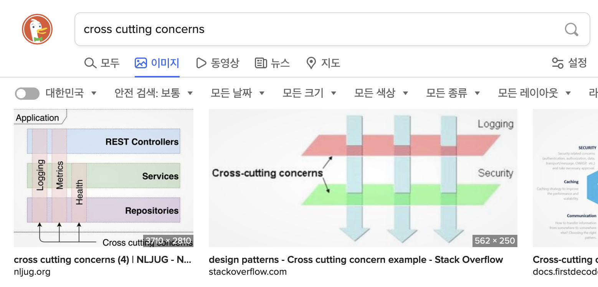

훅을 주로 사용하는 지금에 비해 비교적 철 지난 주제인 것 같다.
컴포넌트 로직을 재사용하기 위한 방법으로 고차 컴포넌트(High Order Component)를 사용한다.

써드 파티 라이브러리에서도 이 형태의 API 제공한다.
리액트 라우터는 withRouter 함수를 통해 컴포넌트에 라우터의 일부 기능을 추가한다.
리액트 리덕스는 connect 함수를 통해 전역 스토어와 연결한다.

고차 컴포넌트는 기존 컴포넌트에 컴포넌트 고유의 기능과는 다른 어떤 기능을 추가해서 강화된(Enhanced) 컴포넌트를 만들수 있는 마법 같은 도구이다. 이 글에 고차 컴포넌트가 해결하려는 문제를 알아보고 사용법과 유의점을 정리해보자.

# 횡단 관심사 분리

고차 컴포넌트는 횡단 관심사를 분리하는데 사용한다고 표현한다.

> 횡단 관심사(Cross-Cutting Concerns)에 고차 컴포넌트 사용하기 - [고차 컴포넌트 | 리액트 공식문서](https://ko.reactjs.org/docs/higher-order-components.html)

횡단 관심사란 뭘까? 반대말은 종단 관심사 일까?
원문으로는 "Cross-Cutting concern"이라고 한다.

> crosscut: <물건을> 가로지라다; <장소 등을> 횡단하다. - 출처: 뉴에이스 영한사전

어떤 것을 가로지르는 관심사라는 것이다.

소프트웨어는 계층 구조로 구성하는 것이 일반적이다.
대표적인것이 OSI 7 계층이다.
어플리케이션을 만들때는 컨트롤러 - 서비스 - 레포지터리 같은 계층을 둔다.
리액트로 클라이언트 어플리케이션을 만들 때도 역시 계층을 구성한다.

```jsx
<App>
  <Router>
    <Container>
      <Page>
```

- 전체 어플리케이션을 담당하는 App 컴포넌트다.
- 브라우져 요청 따라 컴포넌트를 선택하는 것이 Router 컴포넌트다.
- UI 렌더에 필요한 데이터 처리는 컨테이너 컴포넌트의 역할이다.
- UI를 렌더링하는 것은 Page 컴포넌트다.

이처럼 어플리케이션은 계층을 이루지만 각 계층의 기능을 완벽하게 분리할 수 없다.
코드의 중복이 생길 수 밖에 없다.
예를 들어 Container 컴포넌트에서 주소 파라매터 정보가 필요하다.
Page 컴포넌트에서도 주소 이동 기능을 가질 수 있다.
두 계층 모두 주소 기능이 필요하다.

이처럼 각 계층을 넘어 공통으로 필요한 관심사가 있는데 이것을 횡단 관심사, Cross-Cutting concerns라고 표현한다.
어떤 대화에서는 "공통 관심사"라고도 표현하기도 한다. (참고: [이번에는 AOP 용어의 우리말 표현을 가지고 나눠봐요](https://groups.google.com/g/ksug/c/GI7MQklFt8A/m/Dukz90JBgbQJ))

횡단 관심사를 그림으로 보면 좀 더 쉽다.



정리하면 횡단 관심사란 **어플리케이션 각 계층에서 공통적으로 필요한 문제**라고 할 수 있겠다.
**고차 컴포넌트**는 바로 이런 공통의 기능을 해결하는 역할을 한다.

로깅이나 인증이 서버 어플리케이션의 횡단 관심사라면 클라이언트 어플리케이션에서는 뭐가 있을까?
앞에서 잠깐 언금했던 주소 정보나 전역 스토어가 공통 관심사다.
상황에 따라서는 클라이언트에서 기록하는 로깅도 이 횡단 관심사하고 할 수 있겠다.

그럼 간단히 로그 기록 기능을 리액트 고차 컴포넌트로 만들어보면서 고차 컴포넌트에 대해 자세히 알아보자.

# 로깅 예제

가정해 보자.
우리는 디자인 시스템을 만들어야한다.
디자인 시스템의 각 컴포넌트는 얼마나 사용되는지 기록을 남기고 모니터링 해야한다.

- 컴포넌트가 마운트 될때마다 기록한다.
- Button 컴포넌트를 클릭할 때마다 기록한다.

먼저 Header 컴포넌트부터 만들어 보자.

```jsx
class Header extends React.Component {
  componentDidMount() {
    // 로깅
    console.log(`[Header] 마운트`)
  }

  render() {
    return <header>Header</header>
  }
}
```

Header가 돔에 마운트도면 양식에 맞추어 로그를 남긴다. 편의상 브라우저에 남기는 것으로 했다.
실제로 만든다면 로깅 api를 사용하거나 해야할 것이다.

이와 비슷하게 Button 컴포넌트도 만들어 보자.

```jsx
class Button extends React.Component {
  componentDidMount() {
    // 로깅
    console.log(`[Button] 마운트`)
  }

  handleClick = () => {
    // 로깅
    console.log(`[Button] 클릭`)
  }

  render() {
    return <button onClick={this.handleClick}>클릭</button>
  }
}
```

Header 컴포넌트와 마찬가지로 마운트 되었을 때 기록했다. 버튼을 클릭할 때도 로깅했다.

여기는 **두 가지 문제**을 짚을 수 있다.

두 컴포넌트에 중복된 코드가 있다.
컴포넌트가 마운트 되었을때 로그를 남기는 코드다.
두 컴포넌트 모두 같은 생명주기 메서드를 사용하고 같은 로그 기록 함수를 호출한다.

다른 문제는 더 심각하다. 로깅이 각 컴포넌트 고유의 역할이 아니라는 것이다.
Header와 Button은 헤더 영역 UI를 렌더하고 클릭할 수 있는 버튼을 렌더하는 것만을 책임진다.
결과물은 두 컴포넌트가 로깅을 해야하지만 코드를 구현할 때 로깅은 컴포넌트 안에 있어서는 안될 것 같다.

이러한 기능은 두 컴포넌트 어디에도 소속되어 있지 않다.
어플리케이션 전반에 사용되는 공통의 기능이다.

이러한 문제를 고차 컴포넌트가 어떻게 해결할 수 있을까?

# 컴포넌트를 래핑해서 프롭으로 전달

컴포넌트에 횡단 관심사를 추가할 수 있는 함수를 만들어 보자.
고차 컴포넌트 이름 규칙에 맞게 with로 시작하는 함수를 만들었다.

```jsx
const withLogging = WrappedComponent => {
  class WithLogging extends React.Component {
    render() {
      const enhancedProps = {
        log,
      }

      return <WrappedComponent {...this.props} {...enhancedProps} />
    }

    componentDidMount() {
      this.log("마운트")
    }
  }

  function log(message) {
    console.log(`[${getComponentName(WrappedComponent)}]`, message)
  }

  function getComponentName({ displayName, name }) {
    return displayName || name || "Component"
  }

  return WithLogging
}
```

withLogging 은 컴포넌트를 받아 컴포넌를 반환하는 함수다.
함수를 받아 함수를 반환하는 것을 고차함수라고 하듯이 이것을 고차 컴포넌트(High Order Compoonent)라고 부른다.

이 함수는 인자로 받은 WrappedComponent를 내부에서 만든 WithLogging 컴포넌트에서 사용한다.
단순히 래핑한 정도로 보일지 모를테지만 WithLogging이 하는 일이 있다.  
바로 enhancedProps를 컴포넌트에 추가하는 것이다.

enhanceProps는 렌더 함수에서 생성한 객체인데 컴포넌트에 추가할 횡단관심사 기능의 모음이다.
여기서는 컴포넌트의 역할과 무관한 범용적인 log 함수를 전달했다.

마지막으로 강화된 컴포넌트 WithLogging을 반환한다.

withLoggin을 이용해 컴포넌트를 다시 작성해 보자.

```jsx
const Header = () => <header>Header</header>

const Button ({log}) => {
  const handleClick = () => log("클릭");

  return <button onClick={handleClick}>클릭</button>;
}

const EnhancedHeader = withLogging(Header)
const EnhancedButton = withLogging(Button)
```

Header와 Button 코드가 매우 단순해졌다.
로깅 기능이 모두 withLogging으로 빠져버렸기 때문이다.
컴포넌트 본연의 기능만 남고 어플리케이션 공통의 기능을 고차 함수로 옮긴 셈이다.

withLogging으로 래핑한 Header와 Button은 EnhancedHeader와 EnhancedButton으로 다시 태어 났다.
컴포넌트가 마운트 되면 로그를 남길 것이다.
결국 Header와 Button은 본연의 역할을 수행하는 코드만 가지고 있고 withLogging이라는 고차 컴포넌트를 통해 요구사항에 맞는 컴포넌트를 만들수 있다.

이제 Button 컴포넌트는 프롭스 객체를 통해 log 함수를 사용할 수 있다.
withLogging으로 기능을 강화했기 때문이다.
버튼을 클릭하면 log 함수를 사용해 로그를 남길 수 있을 것이다.

# 디버깅을 노하우

리액트 개발자 도구에는 어떻게 표시될까?

```jsx
<App>
  <WithLogging>
    <Header>
  <WithLoggin>
    <Button>
```

고차 함수로 감싼 컴포넌트인 WithLogging 컴포넌트가 나온다.
컴포넌트 이름 그대로이다.
리액트 진영에서는 보통 with로 시작한 컴포넌트를 고차 컴포넌트라고 여긴다.

하지만 개발자도구에서 좀 더 명확하게 고차 컴포넌트인 것을 표시하는 방법도 있다.
컴포넌트의 displayName 필드에 "고차\_컴포넌트\_이름(컴포넌트\_이름)" 형식으로 문자열을 지정하는 것이다.

```jsx
WithLogging.displayName = `WithLogging(${getComponentName(WrappedComponent)})`
```

"WithLogging(컴포넌트\_이름)" 으로 디스플레이 이름을 설정했다.
개발자 도구를 다시 확인해 보자.

```jsx
<App>
  <Header> WithLogging
    <Header>
  <Button> WithLoggin
    <Button>
```

고차 컴포넌트 이름 대신에 실제 래핑할 컴포넌트 이름을 보여준다.
그리고 고차 컴포넌트것을 표시하기 위에 옆에 고차 컴포넌트 이름이 표시된다.

# 컴포넌트 정의는 한 번만

우리는 보통 render 메서드에서 컴포넌트를 정의하지 않는다.

```jsx
render() {
  class MyComponent extends React.Component {/* ... */}

  return <MyComponent/>
}
```

문법 오류가 있는 건 아니다.
그런데도 이렇게 사용하지 않는 이유는 뭘까?

리액트는 렌더 함수를 필요에 따라 여러번 호출한다.
이 때마다 MyComponent를 정의하면 createElement에 전달할 type인자는 매번 다를 것이다.
render 메서드가 호출될때마다 새로 정의하기 때문이다.

따라서 리액트는 렌더시마다 다른 컴포넌트로 알고 기존 앨리먼트를 버리고 새로 만들것이다.
리액트 트리를 비교할 때 앨리먼트 타입이 다르면 이전 트리를 버리고 완전히 새로운 트리를 구축하기 때문이다([재조정: 엘리먼트의 타입이 다른 경우 | 리액트 고급 안내서](https://ko.reactjs.org/docs/reconciliation.html#elements-of-different-types)).

리액트 트리를 매번 새로 만드는 성능상의 문제만 있는것이 아니다.
컴포넌트를 새로 만들기 때문에 이전 렌더에서 사용한 컴포넌트의 상태가 모두 초기화 된다.
상태 기반의 UI가 예측대로 동작하지 않을 것이다.

이것은 고차 컴포넌트를 사용할 때도 마찬가지다.

```jsx
render() {
  const EnhancedButton = withLogging(Button);
  return (
    <>
      <EnhancedHeader />
      <EnhancedButton />
    </>
  )
}
```

함수 호출로 만드는 고차 컴포넌트는 이러한 코드를 만들기 쉽ㄴ다.
class와 함수 정의로 컴포넌트를 정의하는 것에 비해 코드가 짧기 때문이다.
하지만 같은 이유로 이렇게 만들어서는 의도한대로 동작하지 않는다.

대신 일반 컴포넌트 정의 처럼 바깥에서 고차 컴포넌트를 생성하는 함수를 t사용해야한다.
컴포넌트가 한 번만 만들어져야 하기 때문이다.

# 결론

고차 컴포넌트에 대해 정리했다.

컴포넌트 계층을 가로지르는 공통의 관심사, 즉 횡단 관심사를 문제를 해결하는 것이 고차 컴포넌트의 역할이다.

일반 컴포넌트에 횡단 관심사 기능을 추가하기 위해서는 컴포넌트를 래핑한다. 그리고 추가할 기능을 프롭스 객체를 통해 전달해서 더 강화된 컴포넌트를 만든다. 디버깅을 위해 디스플레이 네임을 사용하는 노하우도 알아보았다.

고차 컴포넌트도 컴포넌트이기 때문에 사용상 유의사항은 같다. 클래스 컴포넌트의 렌더함수난 함수 컴포넌트 본체 안에서 고차 컴포넌트를 만들면 안된다. 바깥 블록에서 딱 한 번만 호출해서 컴포넌트를 정의해야한다.

## 참고

- [예제 코드](https://github.com/jeonghwan-kim/2022-05-28-react-hoc)
- [리액트 공식문서](https://ko.reactjs.org/docs/higher-order-components.html)
- [횡단 관심사](https://ko.wikipedia.org/wiki/%ED%9A%A1%EB%8B%A8_%EA%B4%80%EC%8B%AC%EC%82%AC)
