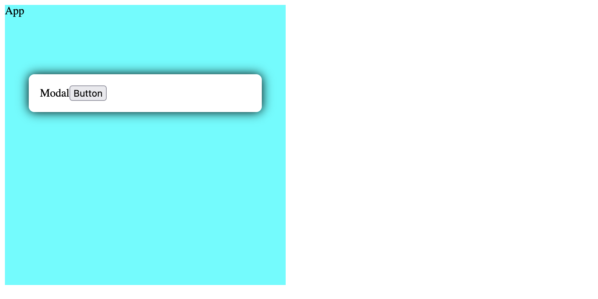
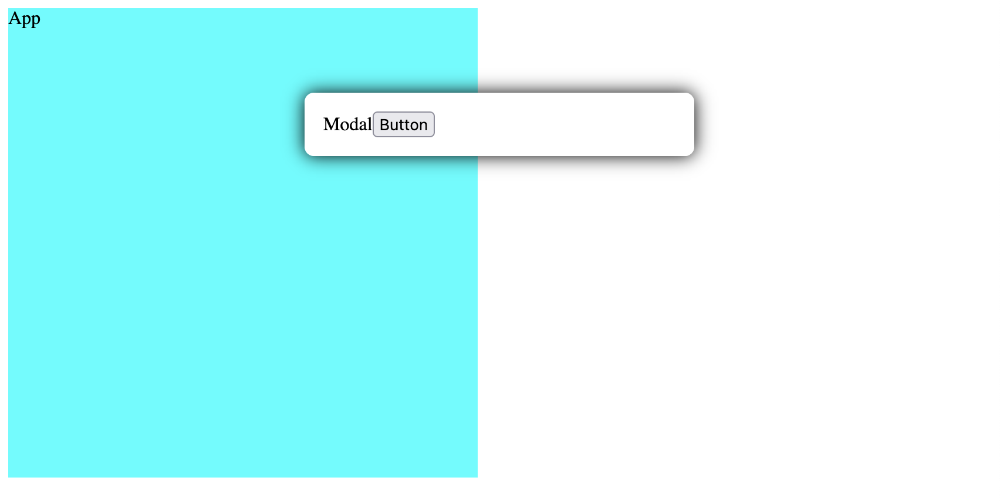
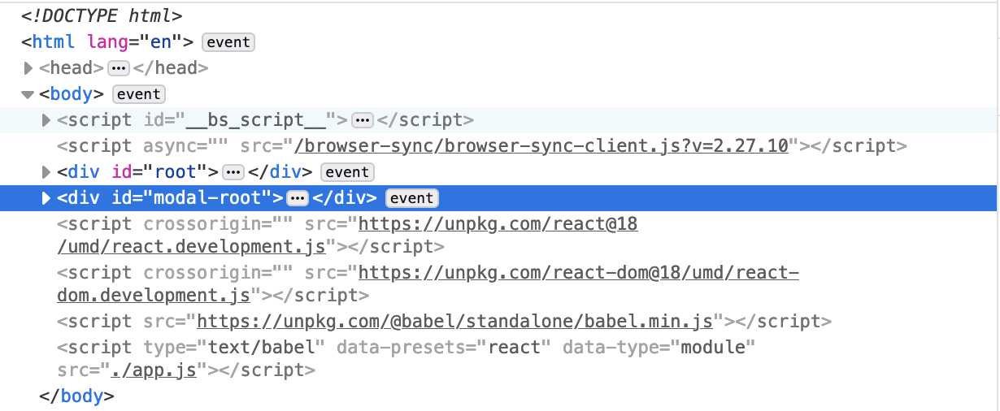

닥터 스트레인지는 전투 중에 불리하면 포탈을 만들어 상황을 용케 빠져나간다.
악당을 포털로 넣어 순식간에 상황을 종료시켜버리는 모습은 무척 통쾌하다.


리액트도 어플리케이션을 이동시키는 기능을 제공한다.
표현이 조금 생소하긴 하지만 어플리케이션이 마운트되는 위치를 이동한다는 의미다.
루트 돔 트리를 벗어나 다른 돔에서 어플리케이션의 일부분을 그릴 수 있다.

그동안 팝업이나, 툴팁처럼 현재 UI 문맥과 다를 경우 포탈을 사용했다.

이 글에서는 리액트 포탈의 기능과 사용 방법을 정리하겠다.

# 포탈에 대한 오해

그 동안 포탈에 대해 오해했던 모양이다.
어플리케이션이 동작하는 돔 외부에 일부 기능을 옮겨 놓으면 성능상 더 나은줄 알았다.

가령 모달은 UI 컨택스트가 다르기 때문에 메인 어플리케이션의 UI에 영향을 주지 않기 위해 포탈을 사용한다고 생각했다.
다른 돔에서 모달 앨리먼트가 변하더라도 메인 어플리케이션이 돌아가는 돔에는 영향을 주지 않을 것이라는 생각.

하지만 이것이 포탈이 해결하려는 주된 문제는 아니다.
UI 트리 하단에 모달 엘리먼트가 있더라도 이것이 전체 돔에 영향을 주는 것은 아니다.
오히려 트리 말단에 있기 때문에 모달을 그리는 돔만 변할 것이다.

# CSS 상속의 영향

오히려 CSS 상속과 관련있다. 예를 들어 설명하는게 좋겠다. 모달을 하나 만들어 보자.

```jsx
const Modal = ({ children }) => <div className="Modal">{children}</div>
```

.Modal 클래스를 정의해서 화면 가운데 오도록 하자.

```css{2-3}
.Modal {
  /* 화면 중안에 위치할 것이다 */
  margin: 80px auto;
  width: 300px;
}
```

마진을 이용해서 중앙에 오도록 맞추었다. 물론 플렉스를 사용하는 더 간단하고 정확한 방법이 있다.
포탈 설명을 위한 예제 목적의 코드다.

이 모달을 렌더할 App 컴포넌트를 만들자.

```jsx{4}
const App = () => (
  <div className="App">
    App
    <Modal>Modal</Modal>
  </div>
)
```

.App 스타일도 정의하자.

```css{3-4}
.App {
  background: cyan;
  width: 400px;
  height: 400px;
}
```

가로 세로 400픽셀 크기를 가진다.
다이얼로그 단독으로 사용하면 좌우 정렬이 맞지만 App 컴포넌트의 자식으로 사용되면 정렬이 틀어질 것이다.



CSS 상속이 원인이다.
모달은 단독으로 동작하면 중앙에 위치할 수 있다.
하지만 다른 부모 앨리먼트와 사용되면 부모 스타일의 영향을 받을 수 있다.
.App 클래스의 width가 고정 크기이기 때문에 이를 기준으로 중앙에 위치할 것이다.

CSS 구조로 인한 부작용을 해결하려면 돔 트리에서 모달의 위치를 옮기는 방법밖에 없다.
.App 클래스의 영향을 받지 않도록 모달이 App 컴포넌트 외부에 있어야 한다.
정확히는 App 컴포넌트가 마운트된 돔 외부로 벗어나는 것이다.

리액트 포탈은 컴포넌트가 종속되어 있는 돔 트리를 벗어나 외부의 다른 돔으로 렌더하는 기능이다.
어플리케이션은 하나이지만 부분적으로 다른 돔에 마운트할 수 있다.

# 사용

포탈을 사용해서 Modal 컴포넌트가 올바로 동작하게 고쳐보자.

```jsx
const PortalModal = props => {
  // 모달이 마운트 될 엘리먼트. 루트 엘리먼트와 다른 곳이다.
  const modalRoot = document.querySelector("#modal-root")
  // 모달 앨리먼트를 modalRoot에 마운트할 것이다.
  return ReactDOM.createPortal(<Modal {...props} />, modalRoot)
}
```

ProtalModal 컴포넌트를 하나 더 만들었다.
이 컴포넌트는 특이하게 앨리먼트를 반환하지 않는다.
대신 createPortal이라는 react-dom이 제공하는 함수 호출 값을 반환했다.

ReactDOM.render처럼 ReactDOM.createPortal(reactElement, domElement)도 리액트 앨리먼트를 돔 엘리먼트에 그린다.
다만 포탈에서 사용한 리액트 앨리먼트는 리액트 어플리케이션의 컨택스트를 사용할 수 있다는 점이 다른다.

PortalModal을 사용하기 위해서는 마운트할 지점을 만들어 주어야 한다.

```html{4}
<!-- 어플리케이션이 마운트될 위치 -->
<div id="root"></div>
<!-- 모달이 마운트될 위치 -->
<div id="modal-root"></div>
```

Modal을 사용한 App컴포넌트를 PortalMoal로 바꿔보자.

```jsx{4}
const App = () => (
  <div className="App">
    App
    <PortalModal>Modal</PortalModal>
  </div>
)
```

이제는 제대로 모달이 화면 중앙에 위치할 것이다.



돔 구조를 확인해 보자.



이전에는 아이디 root인 엘리먼트 하위에 어플리케이션과 모달이 있었다.
포탈을 사용한 뒤로는 기존 엘리먼트와 인접한 아이디 modal-root 엘리먼트에 모달 엘리먼트가 붙어있다.

돔 트리에서 빠져나온 모달 엘리먼트는 더 이상 .App 클래스의 영향을 받지 않는다.
그래서 CSS 상속구조에서 벗어서 자유롭게 화면 중앙에 위치할 수 있는 것이다.

# 이벤트

이벤트는 돔 트리에 따라 동작한다.
사용자가 클릭하면 캡쳐링 단계에서 클릭한 엘리먼트까지 이벤트가 전달되고 버블링 단계서는 루트 노드까지 올라온다.

포탈로 분리한 엘리먼트는 이러한 이벤트 전파 단계를 거치지 못하는 것은 아닐가?
포탈에서 발생한 이벤트가 메인 어플리케이션까지 전달될 수 있을지 궁금하다.

모달에 버튼을 추가하고 이것이 App까지 버블링되는지 확인해 보자.

```jsx{5, 12-15}
const Modal = ({ children }) => (
  <div className="Modal">
    {children}
    {/* 이 버튼을 클릭하면 이벤트가 부모로 버블링될 것이다. */}
    <button>Button</button>
  </div>
)

const ProtalModal = () => React.DOM.createPortal(/* ... */)

const App = () => {
  const handleClick = e => {
    // button에서 발생한 이벤트가 여기서 잡힐 것이다.
    console.log(e.target) // <button>
  }
  return (
    <div className="App" onClick={handleClick}>
      App
      <PortalModal>Modal</PortalModal>
    </div>
  )
}
```

모달에 버튼을 두고 클릭 이벤트 처리를 하지 않았다.
버블링되어 부모 엘리먼트로 올라갈 것이다.

App은 이 이벤트를 잡아서 handleClick에서 처리할 것이다.
실제 클릭해보면 이벤트가 잘 잡힌다.

앨리먼트가 다른 돔을 사용하더라도 포탈은 어플리케이션 트리 모양대로 이벤트를 전파한다.

> 이는 DOM 트리에서의 위치에 상관없이 portal은 여전히 React 트리에 존재하기 때문입니다.

리액트 개발 도구로 컴포넌트 트리를 보면 돔 구조와 달리 App이 Modal을 포함하는 구조로 되어 있다.

```jsx
<App>
  <Modal>
```

# 결론

리액트 포탈은 어플리케이션의 메인 돔 외부에 앨리먼트 일부를 그리기 위한 기능이다.
앨리먼트를 다른 돔으로 옮겨 CSS 상속 구조에서 벗어나기 위함이다.

포탈로 만든 앨리먼트는 실제 돔 구조와 달리 리액트 어플리케이션 컴포넌트 트리 구조를 따른다.
이 순서대로 이벤트가 전파되는 것을 확인했다.

## 참고

- [예제 코드](https://github.com/jeonghwan-kim/jeonghwan-kim.github.com/tree/master/content/codes/2022/react-portal)
- [Portal | 리액트 고급안내서](https://ko.reactjs.org/docs/portals.html)
- [Understanding React Portals and Its Use-Case](https://blog.bitsrc.io/understanding-react-portals-ab79827732c7)
- [Portals in ReactJS - How's and Why's](https://medium.com/alienbrains/tutorial-react-portal-4e2eaca084b8)
