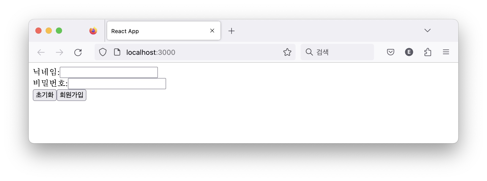
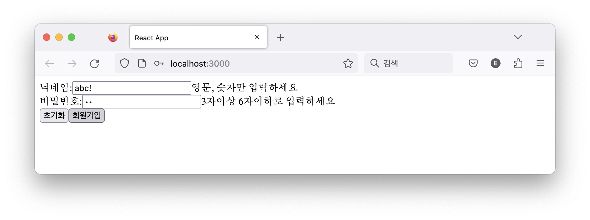

지난 useContext 이후 1년만에 쓰는 글이다. 공부하는 흐름을 한 번 놓치니깐 시간이 훌쩍 지나 버렸다. 한 두 번 빠지지기 시작해 이제는 잊어버린 헬스장 이용권 같다.

이번에는 useReducer 대해 알아보자. useState로 상태를 관리하다가 크기가 커지고 관리 방식이 복잡해질 즈음에 꺼내는 훅이다. 둘의 역할이 비슷해 인터페이스나 구조도 유사할 것 같다. useReducer를 직접 만들면서 구조를 이해한 뒤 useState와 다른 점도 짚어 보겠다.

# 회원가입 예제

닉네임과 비밀번호 필드로 구성한 회원가입 폼이 적절한 예시이다. 사용자가 각 필드에 값을 제대로 입력했는지 검사하고 그렇지 않으면 오류 메세지를 보여주는 기능이 있으면 좋겠다. 입력값(value)과 오류 메세지(error)로 구성한 객체를 정의했다.

```jsx
function RegisterForm() {
  // 상태
  const [state, setState] = useState({
    // 입력값
    value: { nickname: "", password: "" },
    // 오류 메세지
    error: { nickname: "", password: "" },
  })

  // 상태를 리액트 앨리먼트에서 사용한다.
  return (
    <div>
      <label>닉네임:</label>
      <input
        type="text"
        name="nickname"
        {/* 입력값을 상태와 연결한다. */}
        value={state.value.nickname}
        {/* 입력값을 상태로 갱신한다. */}
        onChange={handleChange}
      />
      {/* 오류 메세지를 표시한다. */}
      <span>{state.error.nickname}</span>
    </div>
    <div>
      {/* 비밀번호도 마찬가지다. */}
      <label>비밀번호:</label>
      <input
        type="password"
        name="password"
        value={state.value.password}
        onChange={handleChange}
      />
      <span>{state.error.password}</span>
    </div>
    <button onClick={handleReset}>초기화</button>
    <button onClick={handleSubmit}>회원가입</button>

```

입력값 value를 각 인풋 필드에 연결하고 검증 결과를 error에 바인딩한 구조다. 이어서 폼을 초기화하는 버튼과 폼을 제출하는 회원가입 버튼을 나란히 배치했다.

각 엘리먼트 이벤트 핸들러에 상태 갱신 로직을 정의해 보자.

```js
// 사용자가 입력한 값을 저장한다.
const handleChange = e => {
  setState({
    ...state,
    value: {
      ...state.value,
      [e.target.name]: e.target.value,
    },
  })
}

// 상태를 비워 폼을 초기화한다
const handleReset = _ => {
  setState({
    value: { nickname: "", password: "" },
    error: { nickname: "", password: "" },
  })
}

// 입력값을 검증하고 결과를 저장한다.
const handleSubmit = _ => {
  setState({
    ...state,
    error: {
      nickname: /^\w+$/.test(state.value.nickname)
        ? ""
        : "영문, 숫자만 입력하세요",
      password: /^.{3,6}$/.test(state.value.password)
        ? ""
        : "3자이상 6자이하로 입력하세요",
    },
  })
}
```

인풋 필드의 변경 이벤트 핸들러 handleChange는 입력값을 상태에 저장한다. 이 값을 리액트 앨리먼트에 바인딩했기 때문에 닉네임이나 비민번호를 입력하면 화면에 표시될 것이다.

초기화 버튼 클릭 이벤트 핸들러 handleReset은 모든 입력값과 오류값을 비운다. 이것도 리액트 앨리먼트에 바인딩했기 때문에 초기화 버튼을 마우스로 클릭하면 입력 필드의 값이 사라질 것이다.

회원가입 버튼 클릭 핸들러 handleSubmit은 입력값을 검증하고 그 결과를 error에 저장한다. 입력한 값에 오류가 있다면 오류 메시지가 화면에 표시될 것이고 그렇지 않으면 오류 메세지는 보이지 않을 것이다.

머릿속에 그려본 화면은 이런 모습이다.





# 문제 진단

특별히 이 코드에 문제가 있다고 생각하지는 않는다. 적당하게 useState를 사용해 상태를 관리하고 각각의 이벤트 핸들러에서 상태를 변경하는 것은 마땅해 보인다.

하지만 필드 갯수가 많을 때 문제가 될 수 있다. 필드 갯수만큼 상태의 크기는 커지고 이 상태를 관리하는 로직이 복잡해지기 때문이다. 객체의 역할이 비대하고 로직이 복잡하면 코드 읽기가 어렵다.

가령 주소와 전화번호 필드를 추가한다고 하자. 지역 번호에 따라 검증하는 로직이 달라질 수 있는데 서울 주소를 입력하면 주소 필드의 상태를 갱신할 뿐만 아니라 전화번호도 02로 시작하는지 검증하는 식이다. 전화번호 입력 오류를 디버깅하려면 한 컴포넌트에 있는 주소와 연락처 입력 필드 핸들러를 뒤져야 한다.

역할이 비대해서 문제라면 다른 객체로 분리하는 것이 쉬운 해결 접근법이다. 커스텀 훅으로 분리하는 것은 어떨까?

```js
// 커스텀 훅으로 분리한다면?
function useRegisterForm() {
  const [state, setState] = useState({
    value: { nickname: "", password: "" },
    error: { nickname: "", password: "" },
  })

  const handleChange = () => {
    /* 생략 */
  }
  const handleReset = () => {
    /* 생략 */
  }
  const handleSubmit = () => {
    /* 생략 */
  }

  return {
    state,
    handleChange,
    handleReset,
    handleSubmit,
  }
}
```

상태관리 로직만 훅으로 옮겼다. 그만큼 컴포넌트 코드는 줄었다.

```jsx
funciton RegisterForm() {
  const {state, handleChange, handleReset, handleSubmit } = useRegisterForm();

  return <div>{/* 생략 */}</div>
```

상태를 훅으로 분리해 컴포넌트에는 리액트 앨리먼트 코드만 남았다. 언뜻 문제를 해결한 것 처럼 보인다.

그러나 상태 관리의 복잡성은 여전하다. 변화를 추적하려면 여러 핸들러를 뒤져야 하는데 컴포넌트의 핸들러는 상태 로직만 담당한다고 보장할 수 없다. 여러 부수 효과를 관리하는 등 상태와 무관한 로직이 담겨 있을 수 있기 때문에 이러한 구조에서 상태 변화를 추적하기에는 어렵다.

코드 재사용 관점은 어떨까? 안타깝게도 이 훅은 회원가입 컴포넌트에서만 사용할 수 있다. 다른 컴포넌트에서 사용하려면 회원 가입이라는 로직이 없어야한다. 회원 가입 로직을 훅 외부에서 주입하는 구조여야 재사용할 수 있을 것이다. 단지 주어진 상태를 시키는 대로 변경하고 변경된 것을 알려주는 것이 이 녀석의 남은 임무가 될 것이다.

# 스토어

이제부터 이 녀석을 <스토어>라고 부르자. 스토어는 상태를 보유하고 이것을 변경하며 이 변화를 외부에 알리는 역할한다.

당장 어떻게 구현할지는 모르겠지만 객체를 만드는 팩토리부터 차근차근 시작해 보자.

```js
// 스토어 팩토리
function createStore(reducer, initialValue) {
  // 초기 값을 상태로 가지고 있다.
  let currentState = initialValue;
  // 상태 변화를 구독하는 함수 목록. 상태가 변화면 이 함수들에게 통지한다.
  const listeners = []

  // 상태를 조회한다.
  function getState() { return currentState }

  // 상태 변화를 구독한다.
  function subscribe(callback) { listeners.push(callback) }

  // 상태를 변경한다.
  function dispatch(action) {
    // 외부에서 받은 함수 reducer로 현재 상태를 변경한다.
    // 리듀서는 액션에 따라 상태를 변경할 것이다.
    const nextState = reducer(currentState, action) {
      // 상태가 변하면
      if (nextState !== currentState) {
        // 현재 상태를 변경된 값으로 갱신하고
        currentState = nextState
        // 구독자들에게 이를 통지한다.
        listeners.forEach(listener=>listener())
      }
    }
  }

  // 스토어 객체를 반환한다.
  return {getState, subscribe, dispatch}
}
```

리듀서(reducer)라는 함수와 초기 값을 인자로 받았다. 초기값은 현재 상태(currentState)로 저장해 두었다. 이 값을 조회할 목적으로 getState()도 만들었다.

상태 변화를 구독하기 위한 콜백 배열(listeners)을 두었다. 외부에서 구독 함수(subscribe)를 호출해 구독자를 넘겨주면 이 배열에 추가할 것이다.

마직막에 있는 디스패치(dispatch) 함수가 특별하다. 이것은 액션(action)이라는 객체를 받아 현재 상태와 함께 리듀서에게 전달한다. 외부에 있는 리듀서는 이 두 값을 이용해 다음 상태를 계산할 것이다. 리액트 컴포넌트 같은 외부에서 각자의 상황에 맞게 상태를 변경해야하는데 이러한 변경을 리듀서 함수로 열어 둔 것이다.

디스패치는 리듀서 함수의 반환 값과 현재 상태를 비교해 두 값이 다르면 상태가 변경된 것으로 판단한다. 변경된 상태를 갱신하고 구독자들에게 이를 알리는 것까지가 디스패치의 역할이다.

스토어를 사용해 보면 구조를 이해하는데 도움이 될 것이다.

```js
// 상태를 변경할 리듀서 함수다. 상태와 액션은 스토어가 넣어줄 것이다.
function reducer(state, action) {
  // 카운트 타입 액션일 경우 상태의 값를 1 증가한다.
  if (action.type === 'count') {
    return { ...state, value: state.value + 1 }
  }

  // 예외 처리
  throw '알 수 없는 액션'
}

// 초기 상태를 정의한다.
const initialValue = { value: 0 }

// 리듀서와 초기 상태로 스토어를 만든다.
const store = createStore(reducer, initialValue)

// 스토어의 상태를 조회한다. 스토어는 초기 상태 값을 반환할 것이다.
console.log("after createStore:", store.getState()) // {value: 0}

// 구독자를 추가한다. 상태가 변하면 이 콜백 함수를 실행할 것이다.
store.subscribe(()=> console.log("subscribe:", store.getState());

// 액션을 디스패치한다. 리듀서는 이 액션을 처리하고 다음 상태를 반환할 것이다.
store.dispatch({type: "count"})

// 스토어는 상태 변화를 감지하고 구독자에게 이를 통지할 것이다.
// 위에 등록한 콜백이 실행되어 바뀐 상태를 로깅할 것이다.
// {value: 1}
```

리듀서를 정의했다. 스토어에서 요구한 인터페이스대로 상태와 액션을 인자로 받는 함수다. 액션의 종류에 따라 다음 상태를 계산하는 것이 리듀서의 역할이다. 카운트 액션일 경우 값을 하나 올릴 것이다.

이어서 스토어의 초기 상태를 0으로 정의했다.

리듀서와 초기 상태를 스토어 생성 함수로 전달해 스토어 객체를 만들었다. 생성 직후 스토어 상태를 확인하면 초기값을 반환 할 것이다.

상태 변화를 구독하기 위해 콜백을 등록했다. 스토어는 상태가 변할 때 이 콜백 함수를 호출하는데 여기서는 변경된 상태를 로깅했다.

이제 디스패치를 실행해 상태를 변경해 달라고 스토어에게 요청한다. 여기서는 상태 변경을 위한 최소한의 정보인 액션을 전달한다. 스토어는 외부에서 전달한 액션을 받으면 이를 현재 상태와 함께 리듀서로 전달할 것이다. 리듀서는 액션 타입에 따라 다음 상태를 내뱉을 것이다.

스토어는 리듀서가 계산한 상태와 현재 스토어가 가지고 있는 상태를 비교한다. 변경을 감지하면 구독자들에게 이를 알리는데 등록한 콜백함수를 실행한다. 여기서는 변경된 상태를 로깅할 것이다.

이상 일련의 과정에서 중요한 것은 상태 변경 로직을 <리듀서와 스토어로 격리>했다는 것이다. 사용자 객체의 상태관리 로직을 리듀서가 담당하고 나머지 상태관리 로직을 스토어가 담당하는 구조이다. 사용자 객체는 상태 변경를 위한 최소한의 정보인 액션만 스토어에 전달하고 자신만의 역할을 수행할 수 있다. 리듀서 덕분에 사용자 객체 역할이 줄어 가독성을 높일 수 있고 스토어 덕분에 상태관리 로직을 재사용할 수 있게 되었다.

# useReducer

컴포넌트에서도 역할 분리와 가독성의 효과가 있는지 확인해 보자. 훅 형태로 제공하는 것이 먼저다.

몇 가지 요구사항을 정리해 보자.

1. 스토어 값을 리액트 앨리먼트에 사용한다. (스토어 → 컴포넌트)
2. 컴포넌트가 스토어에게 변경을 요청할 수 있다. (컴포넌트 → 스토어)
3. 스토어의 변경된 값을 리액트 앨리먼트에 반영한다. (컴포넌트 리랜더링)

useState를 흉내냈던 것처럼 비슷한 구조로 만들 수 있겠다.

```js
const { useReducer, resetCursor } = (function MyReact() {
  // 스토어 목록. 훅을 사용하는 순서대로 스토어를 이 배열에 저장할 것이다.
  const stores = []
  // 훅 초기화 여부 목록.
  const isInitialized = []
  // 현재 스토어를 가리키는 커서.
  let cursor = 0

  const { forceUpdate } = useForceUpdate()

  function useReducer(reducer, initialValue) {
    // 훅을 처음 호출한 경우
    if (!isInitialized[cursor]) {
      // 스토어를 만든다.
      store[cursor] = createStore(reducer, initialValue)
      isInitialized[cursor] = true
    }

    const store = stores[cursor]
    // 스토어가 변경되면 리액트 렌더링을 유도한다. 리액트 앨리먼트가 변경될 것이다.
    store.subscribe(forceUpdate)
    cursor = cursor + 1

    // 스토어의 상태와 디스패치를 반환한다. 컴포넌트에서는 이 둘을 사용할 것이다.
    return [store.getState(), store.dispatch]
  }

  function resetCursor() {
    cursor = 0
  }

  return {
    useReducer,
    resetCursor,
  }
})()

// 클래스 컴포넌트의 forceUpdate를 흉내낸다.
// 리렌더링을 유발하는 역할이다.
const useForceUpdate = () => {
  const [value, setValue] = React.useState(1)
  const forceUpdate = () => setValue(value + 1)
  return {
    forceUpdate,
  }
}
```

useReducer란 이름으로 정의했고 MyReact 모듈 안에 만들었다. 스토어 여러 개를 저장하기 위해 stores 배열을 두었다. 컴포넌트에서 훅을 여러 번 사용할 수 있기 때문에 배열을 사용했다. 훅이 처음 실행되었을 때를 식별하기 위한 isInitialzied 배열도 정의했다. 이 두 배열의 인덱스를 지정하기 위한 커서(cursor)도 있다.

이제 useReducer 함수다. 스토어 팩토리 시그니쳐처럼 리듀서와 초기 값을 인자로 받아 스토어를 만들었다. 생성한 스토어 객체를 배열에 넣어두고 초기화되었다고 표시해 다음부터는 이 객체를 사용하도록 했다. 훅은 처음 호출될 때에만 스토어를 만들 것이다.

이어서 스토어 변경 사항을 구독한다. 변경된 값을 리액트 앨리먼트에 반영하려면 리액트 렌더 사이클이 실행되어야 한다. 클래스 컴포넌트의 forceUpdate 메소드처럼 useForceUpdate 훅을 사용해 강제로 렌더링하는 함수를 전달했다. 스토어가 상태 변화를 통지하면 forceUpdate가 실행되어 컴포넌트를 다시 렌더링할 것이다(요구사항 3 해결). 예제에서는 이렇게 만들었지만 실제 리액트의 훅은 리액트 렌더링 과정에 맞게 구현되어 있을 것이다.

마지막으로 스토어 상태와 이를 변경하기 위한 디스패치 함수를 튜플로 반환한다. 컴포넌트에서는 스토어 상태를 조회해 리액트 앨리먼트를 만들 수 있을 것이다(요구사항 1 해결). 특정 시점에는 컴포넌트가 스토어에게 상태 변경을 요청할 것인데 이 디스패치를 사용할 것이다(요구사항 2 해결).

# 컴포넌트에서 사용

useReducer를 컴포넌트에서 사용하기 전에 준비할 것이 있다. 초기 상태와 리듀서이다. 회원가입 폼에 맞게 초기상태를 정의했다.

```js
const initialValue = {
  value: {
    nickname: "",
    password: "",
  },
  error: {
    nickname: "",
    password: "",
  },
}
```

각 필드에 바인딩 할 상태를 value에 정의했다. 닉네임과 비밀번호를 사용할 것이다. 이에 상응하는 오류 메세지를 error에 정의했다. useState로 정의한 초기값과 똑같다.

useState로 상태를 정의할 때는 컴포넌트에서 세터 함수로 상태를 제어한 반면, useReducer를 사용할 때는 리듀서가 이 상태를 변경할 것이다. 스토어가 알려줄 현재 상태와 사용자가 발행할 액션 객체를 인자로 받아 다음 상태를 계산하는 리듀서 함수를 정의하자.

```js
function reducer(state, action) {
  // 필드 변경 액션일 경우 name, value 값이 전달 될 것이다.
  if (action.type === "SET_FIELD") {
    return {
      ...state,
      value: {
        ...state.value,
        [action.name]: action.value,
      },
    }
  }

  // 필드 초기화 액션일 경우.
  if (action.type === "RESET") {
    return {
      value: {
        nickname: "",
        password: "",
      },
      error: {
        nickname: "",
        password: "",
      },
    }
  }

  // 필드 검증 액션일 경우.
  if (action.type === "VALIDATE") {
    return {
      ...state,
      error: {
        nickname: /^\w+$/.test(state.value.nickname)
          ? ""
          : "영문, 숫자만 입력하세요",
        password: /^.{3,6}$/.test(state.value.password)
          ? ""
          : "3자이상 6자이하로 입력하세요",
      },
    }
  }

  // 예외 처리.
  throw Error("알 수 없는 액션")
}
```

리듀서 관례에 따라 액션객체의 type을 기준으로 분기한다. 필드 값을 할당하는 액션, 필드를 초기화하는 액션, 필드 값을 검증하는 액션에 대한 각 각의 상태 변경 로직 만들었다. 이도 저도 아닌 액션에 대해서는 예외를 던져 어플리케이션을 중단하도록 안전조치를 취했다.

이전에는 상태 변경 로직이 컴포넌트 안에 있어서 리액트 앨리먼트를 만드는 함수와 섞여 있었다. 이제는 전자를 리듀서 함수로 빼내 컴포넌트에는 리액트 앨리먼트를 만드는 역할만 남았다.

단순히 커스텀 훅으로 빼보기도 했지만 코드를 재사용할 수 없었다. useReducer는 리듀서 함수를 상황에 맞게 정의해서 전달 받기 때문에 스토어의 값을 조회하고 계산하고 변경하는 로직은 도메인에 무관하게 재사용할 수 있다.

마침내 useReducer를 컴포넌트에서 사용할 차례다.

```js
// 다시 회원가입 폼이다.
const Registerform = () => {
  // 사용 순서대로 훅이 동작하기 때문에 커서를 초기화 한다. 실제 리액트에서는 이런 코드가 없다.
  resetCurosr()
  // 리듀서 훅을 사용한다.
  const [state, dispatch] = useReducer(reducer, initialValue)

  // 필드 변경 핸들러. 액션을 발행한다.
  const haldeChange = e =>
    dispatch({ type: 'SET_FIELD', name: e.target.name, value: e.target.value});

  // 초기화 핸들러. 액션을 발행한다.
  const handleReset = e => dispatch({ type: 'RESET' });

  // 제출 핸들러. 액션을 발행한다.
  const handleSubmit = e => dispatch({ type "VALIDATE" });

  return /* 생략. 리액트 앨리먼트를 반환한다. */
}
```

resetCursor()를 먼저 호출했다. 훅은 사용한 순서에 영향 받기 때문에 커서를 처음으로 맞췄다. 실제 리액트 훅을 사용할 때는 이렇지 않다.

useReducer를 사용했다. 상태를 초기화하고 수정하는 로직은 리듀서를 포함한 스토어의 역할이기 때문에 컴포넌트는 이 코드 한 줄이면 상태 관리 방법을 제공받을 수 있다.

각각의 핸들러는 스토어에게 액션만 발행했다. 구체적인 상태 변경 로직은 리듀서 안에 있기 때문에 여기서는 상태변경을 위한 최소한의 정보만 전달한다. 이전에는 핸들러 안에 상태 변경의 세부 구현이 있었지만 지금은 최소한의 정보만 남았다.

이후 리액트 앨리먼트를 반환한다. useState를 사용하는 코드와 같다.

# useState 다시 보기

useReducer를 만들다보니 useState와 비슷하다는 생각이 든다. 상태를 갱신한다는 구조는 같지만 전자는 방법이 여러 개이고 후자는 하나이다. 방법이라는 것은 액션인데 한 가지 액션만 있는 리듀서를 사용하면 useState를 만들 수 있겠다.

```js
function useState(initialState) {
  // 이전 상태를 무시하고 액션으로 받은 값을 다음 상태로 반환한다.
  function reducer(_, action) {
    return action
  }

  // useReducer를 이 특별한 리듀서와 조합해서 useState를 만든다.
  return useReducer(reducer, initialState)
}
```

리액트에서도 이 두 훅을 함께 정의하고 useReducer를 조합해 useState를 정의하는 것 같았다(참고: [basicStateReducer](https://github.com/facebook/react/blob/05777ffb01515679d73541062a4ecc745af04a2f/packages/react-reconciler/src/ReactFiberHooks.js#L1038).

```js
function updateState(initlaState) {
  return updateReeducer(basicStateReducer, initialState)
}

function basicStateReducer(state, action) {
  return typeof action === "function" ? action(state) : action
}
```

# 결론

useReducer를 사용하면서 두 가지 좋은 점을 발견했다.

첫째, 컴포넌트 안에 있던 상태관리 로직을 분리할 수 있다. 리듀서 함수가 이 역할을 한다. 자바스크립트 배열의 리듀서 메소드와 이름이 같은데 컬랙션으로 이뤄진 여러 객체 배열을 하나의 객체로 줄이는 것이 이 메소드의 역할이다. useReducer도 컴포넌트의 상태 관리 로직을 가져가 컴포넌트의 부담을 줄여기 때문에 이름도 이렇게 짓지 않았을까?

둘째, 상태 관리 로직의 일부를 재사용할 수 있었다. 회원가입을 제외한 로직이다. 상태를 조회하고 이전 상태와 리듀서가 계산한 다음 상태를 비교한다. 그리고 상태 변경을 감지하면 외부로 알려주는 것. 이 세가지가 useReducer의 역할인데 이는 어떤 컴포넌트에서건 재사용할 수 있다.

이 훅이 항상 좋은 것 만은 아니다. 상태 규모가 작다면 오히려 나쁜 선택일 수 있다. 몇 개 안되는 상태를 관리하기 위해 스토어와 리듀서를 만드는 부담 때문이다. 배보다 배꼽이 더 크다. 어쩌면 예제로 든 회원가입 폼이 그렇수 있다. 단순히 useState로 해결하는게 더 나은 경우도 있으니 상황에 맞게 판단해야한다. 트레이드오프다.

## 참고

- [소스코드](https://github.com/jeonghwan-kim/jeonghwan-kim.github.com/tree/master/content/codes/2022/react-hooks/src/useReducer)
- [리덕스 코드](https://github.com/reduxjs/redux)
- [리액트 코드 ReactFiberHooks.js](https://github.com/facebook/react/blob/main/packages/react-reconciler/src/ReactFiberHooks.js)
- [React Source Code Analysis 13.hooks source code](https://programmer.group/react-source-code-analysis-13.hooks-source-code.html)
