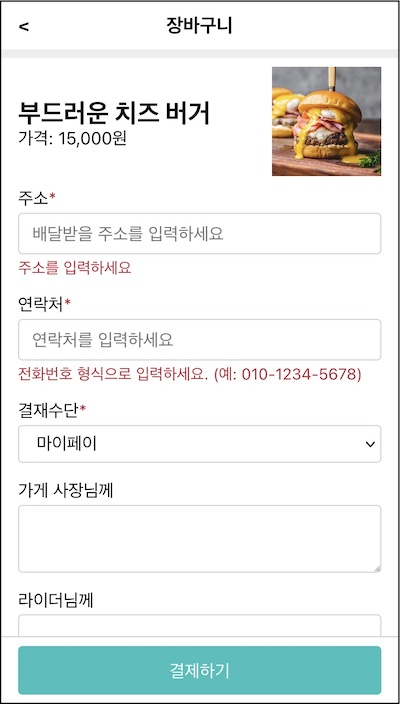
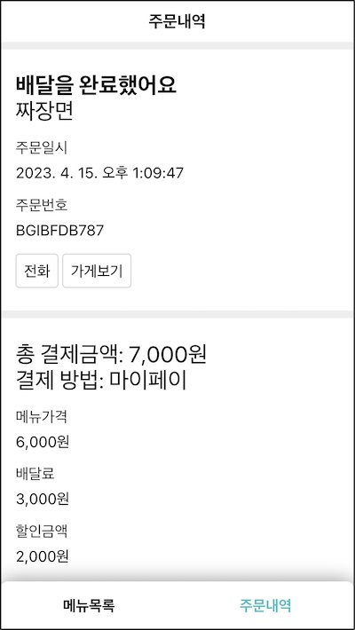
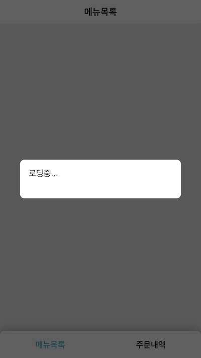
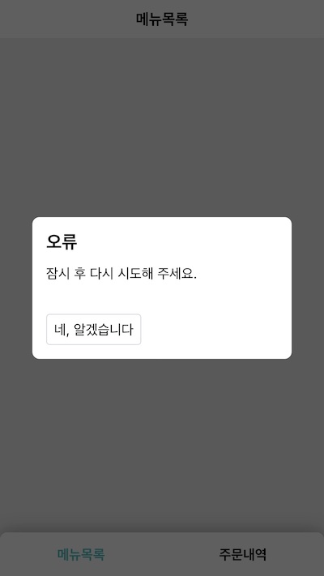
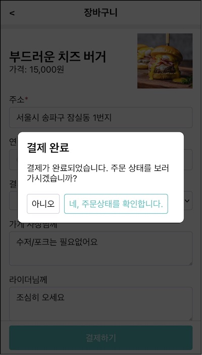

리액트 1부 수업을 요약한 뒤 2부 내용을 소개한다. 실습 어플리케이션과 개발 환경을 미리 살펴본다.

# 1부 수업 요약

1부는 쇼핑몰 검색 화면을 만들면서 리액트 기본 개념을 익히는 것이었다.

[준비편](/series/2021/04/05/lecture-react-ready.html). 리액트의 역할을 드러내기 위해 라이브러리 없이 어플리케이션을 만들었다.

[소개편](/series/2021/04/08/lecture-react-intro.html). 리액티브와 가상돔 개념을 익혔다. 헬로 월드 코드에서 react, react-dom, babel, jsx의 역할을 이해했다.

[사용편 1](/series/2021/04/08/lecture-react-intro.html). 리액트로 어플리케이션을 다시 만들었다. 라이브러리 도움으로 더 적게 코딩하고 더 안전한 어플리케이션을 만들 수 있었다. 컴포넌트, 상태, 이벤트 처리, 조건부/리스트 렌더링, 컴포넌트 생명주기 등 리액트 주요 개념을 이해했다.

[사용편 2](/series/2021/04/15/lecture-react-component.html). 여러 컴포넌트로 어플리케이션을 다시 설계했다. 역할에 따라 작은 컴포넌트 여러 개로 나누고 서로 협력하도록 했다. 상태 끌어올리기, 컴포넌트 재사용, 조합하는 방법을 익혔다

> 여전히 고급 주제들은 더 학습해야할 대상이다. 컨택스트, 훅 등. 뿐만 아니라 리액트와 함께 사용하는 라우터, 전역 상태 관리 솔루션 더 나아가 리액트 기반의 웹 프레임워크를 탐구하는 것은 웹 기술을 익히는데 큰 도움이 될 것이라고 생각한다. - 1부 마무리 중

1부 끝에 숙제를 남겨두었다. 리액트 고급 주제와 관련 라이브러리를 공부하는 것.

# 2부에서 다룰 내용

2부에서 이 주제를 다룰 것이다.

**1편. 리액트로 사고하기**. 1부를 마쳤다고 단숨에 컴포넌트 기반으로 개발할 수 있는 것은 아니다. 막상 키보드를 잡으면 턱턱 막히는 부분이 있을텐데 리액트 API와는 별개의 문제다. 화면 구성요소에 대한 컴포넌트 설계 기법을 먼저 익혀야 한다. 리액트로 사고하는 방법과 이를 컴포넌트로 설계하는 훈련 과정을 경험할 것이다.

**2편. 고급 주제**. 나머지 고급 주제를 다룬다. 리액트 컨택스트가 필요한 상황을 이해하고 직접 만든다. 라우터의 역할을 이해하고 리액트 기반의 라우터를 만든다. 컴포넌트 로직 재사용을 위해 고차 컴포넌트 기법을 학습한다. 리액트 포탈까지 이해한 뒤 샘플 어플리케이션에서 활용할 것이다.

**3편. 기본 훅**. 여러 학습자 분들이 리액트 훅을 배우고 싶어했다. 앞으로 남은 두 편에 걸쳐 훅을 공부할 것이다. 훅의 등장 배경을 소개하고 기본 훅을 만들며 구조를 이해한 뒤 함수형 컴포넌트와 훅으로 샘플 어플리케이션을 다시 만들 것이다.

**4편. 추가 훅**. 리듀서로 상태 관리의 복잡성을 줄이는 방법을 소개한다. 메모에제이션 훅으로 어플리케이션의 성능을 높이는 방법도 이해한다. 클래스 컴포넌트와 비교해 함수형 컴포넌트와 훅으로 만들 때의 차이를 경험할 것이다. 폼을 다시 만들어 비제어/제어 컴포넌트의 차이도 이해한다.

# 결과물 미리보기

쉽지만 실무같은 예제. 수업을 구상하며 가장 고민한 부분이다. 그래야 수업을 완주할 수 있기 때문이다. 너무 쉬우면 현실성이 없고 너무 어려우면 전달력이 부족하다.

> 프로그래밍을 통해 개념과 이론을 배우는 것이 개념과 이론을 통해 프로그래밍을 배우는 것보다 더 훌륭한 학습 방법이라고 생각한다. 개념은 지루하고 이론은 따분하다. 개발자는 구체적인 코드를 만지며 손을 더럽힐 때 가장 많은 것을 얻어가는 존재다. - 오브젝트 | 조영호 | 위키북스

손으로 코드를 작성할 때 학습 효과가 크다. 새로운 기술을 익힐 때는 문서에 나온 코드를 직접 입력하는데 이렇게 얻은 지식이 몸에 잘 베이는 편이다.

배달 앱의 주요 화면을 만들어 볼 것이다.


상품 목록 화면

- 주문할 수 있는 메뉴 목록을 조회한다.
- 상단: 화면 제목 표시("메뉴 목록")
- 중간: 주문할 수 있는 메뉴 목록
- 하단: 네비게이션 버튼. 각 화면을 이동할 수 있다.

주문하기 버튼을 클릭해 상품을 구매하기 위해 장바구니 화면으로 이동할 것이다.



장바구니 화면

- 선택한 상품을 장바구니에 담는다.
- 상단: 화면 제목 표시("장바구니"). 좌측 뒤로가기 버튼. 이전 화면(메뉴 목록)으로 이동할 것이다.
- 중간: 선택한 상품과 주문 정보 입력 폼
- 하단: 결제하기 버튼

결제 후에 주문내역 화면으로 이동할 것이다.



주문내역 화면

- 주문 상세 내역을 조회한다.
- 상단: 화면 제목 표시("주문내역")
- 중간: 주문 상태, 주문 금액, 주문자 정보
- 하단: 네비게이션 버튼. 각 화면을 이동할 수 있다.

이 외에도 다이얼로그가 있다.







배달 어플리케이션이지만 넓게 보면 커머스 제품의 일반적인 화면 구성이다.

어플리케이션의 구체적인 모습은 영상을 참고하자.

- [예제 어플리케이션 데모 | 유투브](https://youtu.be/PBf1rur395g)

아래는 요구사항 목록이다.

- [리액트 2부 요구사항 | Github](https://github.com/jeonghwan-kim/lecture-react-season2/wiki/%EC%9A%94%EA%B5%AC%EC%82%AC%ED%95%AD)

# 실습환경 구성

네 가지 개발 도구를 사용할 것이다(설치 방법은 1부를 참고).

- node v16, npm v8 이상
- 에디터 (예: 비주얼 스튜디오 코드)
- 브라우져 (예: 파이어폭스, 크롬)
- git

웹팩 설정을 보자.

```js{9}
module.exports = {
  mode: "development",
  entry: {
    main: "./src/main.js",
  },
  output: {
    path: path.resolve(__dirname, "dist"),
    filename: "[name].bundle.js",
    clean: true,
  },
  resolve: {
    extensions: [".js", ".jsx"],
  },
  devtool: "inline-source-map",
  devServer: {
    static: path.resolve(__dirname, "public"),
    port: process.env.PORT,
  },
  module: {
    rules: [
      {
        test: /\.(js|jsx)$/,
        exclude: /node_modules/,
        use: {
          loader: "babel-loader",
        },
      },
    ],
  },
}
```

웹팩 5 버전을 사용했다. 1부에서 사용한 버전 4와 다른 점은 두 가지다.

output.clean 속성을 사용할 수 있다. 이전 빌드 공간을 삭제하는 역할을 하는데 이전에 clean-webpack-plugin 플러그인으로 제공하던 것을 이제는 웹팩 속성으로 설정할 수 있다.

- 참고: [웹팩 빌드시 이전 결과물을 삭제하는 옵션 | 김정환블로그](/2022/08/21/webpack-output-clean)

개발 서버를 실행할 때는 webpack serve 로 웹팩의 기본 명령어를 사용할 수 있다. 이전에는 webpack-dev-server를 따로 설치하고 실행했던 점과 다르다.

```json{2}
  "scripts": {
    "start": "webpack serve --config ../shared/webpack.config.js"
  },
```

바벨 로더를 사용했는데 설정 코드를 보자.

```json{6}
  "babel": {
    "presets": [
      [
        "@babel/preset-react",
        {
          "runtime": "automatic"
        }
      ]
    ]
  },
```

@babel/preset-react 프리셋을 사용할 때 { "runtime": "automatic" } 옵션을 추가하면 리액트 17부터는 jsx 코드를 사용할 때 react 모듈 불러오는 코드를 생략할 수 있다.

모노 레포를 구성했다. npm 7.24.2 버전부터 지원하는 워크스페이스 기능을 활용한 것인데 먼저 설정 코드를 보자.

```json
  "workspaces": [
    "1-react",
    "2-hook"
  ]
```

package.json에 워크스페이스(workspaces) 필드를 추가했다. react와 hook 폴더를 워크스페이스로 지정했다. 각 폴더를 하나의 npm 프로젝트로 다룰 수 있다.

각 폴더에서 노드 모듈을 관리하면 중복된 패키지가 많아 설치하는데 시간이 오래 걸린다. 워크스페이스로 관리하면 최상단에서 패키지를 한 번만 설치하고 각 워크스페이스가 공유하는 형태다. 용량도 줄고 설치 속도도 빠르다. 공통으로 사용하는 모듈은 워크스페이스 간에 공유할 수도 있다.

- 참고: [NPM 워크스페이스와 모노레포 | 김정환블로그](/2022/07/31/npm-workspace)

각 패키지를 실행하려면 최상단에 서 --workspace 옵션을 붙여서 실행한다.

```
npm install --workspace 1-react
npm start --workspace 1-react # 혹은 npm run 1-react
```


# 중간 정리

목표

- 상품 목록, 장바구니, 주문내역으로 구성된 배달 어플리케이션 예제
- 리액트 고급 주제와 훅을 학습

실습 환경

- 개발 도구
- 웹팩, 바벨, 워크스페이스 설정

## 참고

- [[리액트 1부] 만들면서 학습하는 리액트 | 김정환블로그](/posts?series=%5B%EB%A6%AC%EC%95%A1%ED%8A%B8%201%EB%B6%80%5D%20%EB%A7%8C%EB%93%A4%EB%A9%B4%EC%84%9C%20%ED%95%99%EC%8A%B5%ED%95%98%EB%8A%94%20%EB%A6%AC%EC%95%A1%ED%8A%B8)
- [웹팩 빌드시 이전 결과물을 삭제하는 옵션 | 김정환블로그](/2022/08/21/webpack-output-clean)
- [NPM 워크스페이스와 모노레포 | 김정환블로그](/2022/07/31/npm-workspace)

---

<a href="https://inf.run/SCwEj" target="_blank">
  "[React 2부] 고급 주제와 훅" 수업 보러가기  
  
</a>
