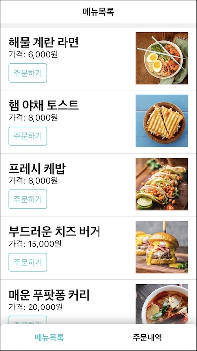
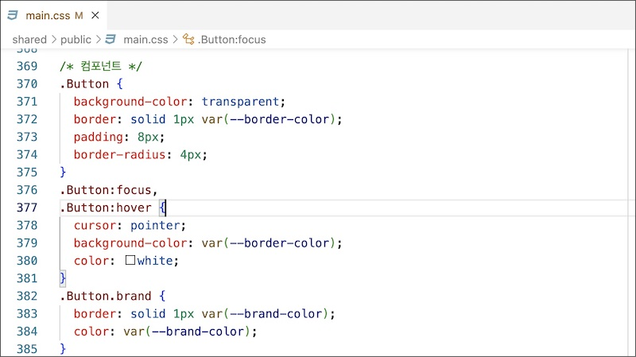
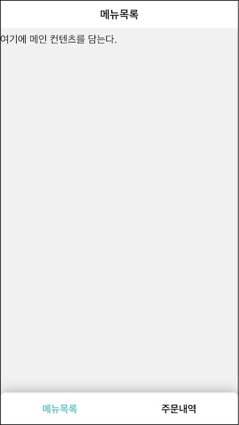
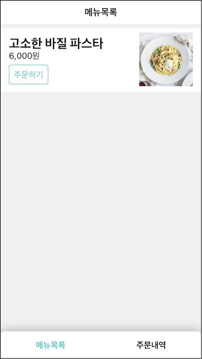

1부에서 학습한 리액트 지식을 이용해 상품 목록 화면부터 만들어 보자.

요구사항

- 1.1 "메뉴목록" 제목을 상단에 표시한다. (UI)
- 1.2 주문할 수 있는 상품 목록을 중앙에 표시한다. (UI)
- 1.4 네비게이션바가 하단에 위치한다. (UI)

# 1.2.1 단일 컴포넌트 App



스타일을 위한 CSS 코드는 미리 준비했다. index.html에서 로딩하는 main.css 파일이다.



CSS 클래스를 적절히 활용해 화면을 만들 것이다. 전체 레이아웃을 잡아주는 .Page 클래스를 사용하겠다.

```jsx
<div className="Page">
  <header>
    <h1>메뉴목록</h1>
  </header>
  <main>여기에 메인 컨텐츠를 담는다.</main>
  <footer>
    <nav className="Navbar">
      <a className="active" href="#">
        메뉴목록
      </a>
      <a href="#">주문내역</a>
    </nav>
  </footer>
</div>
```

CSS 파일에 정의된 .Page 클래스를 사용해 디비전을 최상단 엘리먼트로 감싸고 그 안에 헤더, 메인, 푸터 엘리먼트를 사용해 전체 문서 윤곽을 그렸다.



요구사항 2개를 쉽게 해결했다.

- **~~1.1 "메뉴목록" 제목을 상단에 표시한다. (UI)~~**
- 1.2 주문할 수 있는 상품 목록을 중앙에 표시한다. (UI)
- **~~1.4 네비게이션바가 하단에 위치한다. (UI)~~**

중앙에 상품 목록을 추가해 보자.

```jsx{1,7-23}
<div className="ProductPage">
  <div className="Page">
    <header>
      <h1>메뉴목록</h1>
    </header>
    <main>
      <ul>
        <li>
          <div className="ProductItem">
            <div className="description">
              <h2>고소한 바질 파스타</h2>
              <div>6,000원</div>
              <button className="Button brand">주문하기</button>
            </div>
            <div className="thumbnail">
              
            </div>
          </div>
        </li>
      </ul>
    </main>
    <footer>
      <nav className="Navbar">
        <a className="active" href="#">
          메뉴목록
        </a>
        <a href="#">주문내역</a>
      </nav>
    </footer>
  </div>
</div>
```

.ProductPage, .ProductItem이란 CSS 클래스 메뉴 목록을 그렸다. 메뉴 이름과 가격, 주문 버튼이 위치하고 옆에는 메뉴 썸네일 이미지가 보인다.



요구사항

- ~~1.1 "메뉴목록" 제목을 상단에 표시한다. (UI)~~
- **~~1.2 주문할 수 있는 상품 목록을 중앙에 표시한다. (UI)~~**
- ~~1.4 네비게이션바가 하단에 위치한다. (UI)~~

# 1.2.2 리액트로 생각하기

잠시 1부 마지막 내용([작은 컴포넌트로 나누기](https://jeonghwan-kim.github.io/series/2021/04/15/lecture-react-component.html#작은-컴포넌트로-나누기))을 떠올려 보자. 거대한 단일 컴포넌트를 여러 개의 작은 것으로 설계해 리액트로 사고하는 방법을 소개했다.

이것은 코드를 유지보수하는데 상당한 이점이 있다. 하나 혹은 비교적 적은 책임만 갖기 때문에 컴포넌트의 역할이 명확히 드러나고 그만큼 읽기 쉽다. 작아서 재사용하기도 수월하다.

리액트 문서에는 이것을 [리액트로 사고하기](https://ko.reactjs.org/docs/thinking-in-react.html)라는 장에서 설명한다.

1. UI를 컴포넌트 계층 구조로 나누기
1. 리액트로 정적인 버전 만들기
1. UI 상태(state)에 대한 최소한의 (하지만 완전한) 표현 찾아내기
1. 상태가 어디에 있어야 할 지 찾기
1. 역방향 데이터 흐름 추가하기

이 순서로 개발하는 것이 쉬운 일은 아니다. 리액트를 사용하면서 경험한 것은 오히려 반대였다. 익숙하지 않을 때는 먼저 하나의 컴포넌트로 전체 UI를 만들고 그것을 다시 작은 컴포넌트로 쪼게는 방식을 사용했다. App라는 단일한 컴포넌트만 빠르게 만들어 본 이유가 이것이다.

다음 장 부터는 이 App 컴포넌트를 리액트로 사고하기 방식으로 접근해 재 설계하겠다.

# 1.2.3 버튼 컴포넌트

크기도 작고 다른 화면에서도 여러 번 할 수 있는 버튼 컴포넌트부터 시작하자. src/components/Button.jsx를 만들고 App 컴포넌트에 있는 버튼 코드를 그대로 옮겼다.

```jsx
const Button = () => <button className="Button brand">주문하기</button>
```

App에서 이 컴포넌트를 사용한다.

```jsx
const App = () => (
  // ...
  <Button />
  // ...
```

이렇게 분리한 Button은 다른 곳에서도 사용할 수 있다.

"주문하기"라는 버튼 문구가 바뀔 수도 있다. 다른 화면에는 "결제하기", "전화", "가게보기" 버튼이 있는데 버튼을 사용하는 측에서 문구를 알 수 있다. Button 외부에서 이 텍스트를 제어할 수 있도록 인자를 열자.

```jsx
const Button = ({ children }) => (
  <button className="Button brand">{children}</button>
)
```

children 인자를 열어 줌으로써 다양한 버튼을 조합할 수 있다.

```jsx
<Button>주문하기</Button>
<Button>결재하기</Button>
<Button>전화</Button>
<Button>가게보기</Button>
```

버튼을 디자인을 보면 색상과 크기도 다르다. 장바구니 화면에서는 크고 민트색 버튼, 주문내역 화면에서는 색이 없는 버튼이다. 이와 관련된 css 클래스는 다음과 같다.

```css
.brand // 민트색 외곽선
.brand-solid // 민트색 배경
.block // 큰 버튼;
```

children을 조합해 다양한 문구를 가진 버튼을 만들었듯이 색상과 크기 두 가지를 조합해서 다양한 스타일의 버튼을 만들수 있어야 한다.

```jsx{2-4}
const Button = ({ styleType, block, children }) => {
  let className = "Button"
  if (styleType) className += ` ${styleType}`
  if (block) className += " block"

  return <button className={className}>{children}</button>
}
```

인자에 따라 설정할 CSS 클래스를 계산해 리액트 앨리먼트의 속성에 전달했다.

이 컴포넌트는 이제 용도에 따라 이렇게 사용할 수 있다.

```jsx
<Button />
<Button styleType="brand" />
<Button styleType="brand-solid" block />
```

메뉴 목록에서 사용할 주문하기 버튼은 민트색이다.

```jsx
<Button styleType="brand">주문하기</Button>
```

Button 역할에 대해 좀 더 생각해 보자.

버튼은 유저가 클릭하는 것이다. 컴포넌트는 유저의 클릭을 처리해야하는 책임도 진다. 컴포넌트 자체가 button을 가지고 있어서 onClick 속성으로 클릭 시점을 알 수 있기 때문이다.

```jsx
const handleClick = () => {
  /* 클릭 처리 */
}
// ...
return <button onClick={handleClick}>{children}</button>
```

handleClick은 어떤 일을 해야할까? 메뉴 목록 화면에서 버튼을 클릭하면 장바구니 화면으로 이동하는 것이 요구사항이다.

handleClick이 장바구니 이동까지 담당한다면 컴포넌트의 이름은 GoToCartPageButton이어야 한다. 지금은 수식어가 없는 순수한 Button이다. 어디서 사용되더라도 사용자 클릭을 처리할 수 있는 비교적 범용적인 역할을 가져야 한다.

그럼 장바구니 이동 로직은 누구의 역할일까? 아직 모르지만 버튼을 사용하는 측이다. 외부에서 함수를 버튼에게 전달해 적당한 타이밍에 실행해 주기를 요청하면 된다. onClick이라는 이름으로 콜백함수를 받고록 props 객체를 더 열어보자.

```jsx
const button = ({ styleType, block, children, onClick }) => {
  // ...
  return (
    <button className={className} onClick={onClick}>
      {children}
    </button>
  )
}
```

인자로 받은 onClick을 곧장 버튼 앨리먼트의 속성 값으로 전달했다.

```jsx
const button = ({ styleType, block, ...rest }) => {
  // ...
  return <button {...rest} className={className} />
}
```

onClick과 children은 button 앨리먼트의 속성과 같아서 나머지 연산자로 받아 그대로 전달했다.

이제 버튼을 사용하는 쪽에서 콜백함수를 넘겨줄 수 있다.

```jsx
<Button styleType="brand" onClick={() => console.log("click")}>
  주문하기
</Button>
```

onClick에 로그 찍는 함수를 넘겼다. Button은 사용자가 클릭할 때 이 함수를 실행할 것이다. 사용하는 쪽에서는 이 함수 본체가 실행될 때 '아 버튼이 클릭되었구나'를 알 수 있을 것이다. 버튼의 역할은 여기까지다. 넘겨 받은 콜백 함수를 적절한 타이밍에 호출하는 것.

App에서 Button을 분리해서 전체 컴포넌트 트리는 이런 모습이다.

```jsx{2}
<App />
  <Button />
```

# 1.2.4 상품 컴포넌트 ProductItem

다음은 상품 아이템 차례다. 상품 정보와 주문하기 버튼으로 구성되었는데 이를 ProductItem이란 이름의 컴포넌트로 분리한다. src/components/ProductItem.jsx 파일을 만들고 App에 있는 코드를 옮기자.

```tsx
const ProductItem = () => <div className="ProductItem">{/* ... */}</div>
```

App 에서는 코드 한 줄로 메뉴 아이템을 그릴수 있다.

```jsx
const App = () => (
  // ...
  <ProductItem />
```

ProductItem은 특정 상품만 렌더하기 때문에 재활용할 수 없다. 지금 상태로는 PastarProductItem이라고 불러야할 것 같다.

재사용하려면 특정 상품 정보를 걷어 내야 한다. 그러면서도 상품의 공통 정보를 렌더링할 책임은 가져야 한다. Button을 설계했던 것처럼 사용하는 쪽에서 어떤 상품인지를 정하고 이 정보를 ProductItem에게 전달하는 방식으로 개선해 보자.

ProductItem의 인터페이스는 상품 정보를 받을 수 있어야 한다. 이 어플리케이션은 api를 통해 상품 데이터를 가져올 것인데 먼저 데이터 모양부터 확인해 보겠다.

브라우져 개발자 도구를 열고 다음 명령어로 http 요청을 만든다.

```js
fetch("/api/product/list")
```

fetch() 함수가 반환한 프라미스 객체 값이 로그에 찍힐 것이다. 네트워크 탭으로 이동하면 http 요청을 확인할 수 있다. 제이슨 데이터를 응답하는데 이런 모양이다.

```json
[
  {
    "id": "CACDA421",
    "name": "해물 계란 라면",
    "price": 6000,
    "thumbnail": "./images/menu-해물계란라면.jpg"
  }
```

이 값을 기준으로 컴포넌트에서 사용할 목업 데이터를 만들자.

```js
const fakeProduct = {
  id: "CACDA421",
  name: "해물 계란 라면",
  price: "6000",
  thumbnail: "./images/menu-해물계란라면.jpg",
}
```

ProductItem은 외부에서 이 정보를 받아 UI를 그리는 역할을 맡는다.

```jsx{1-2,6-7,13}
const ProductItem = ({ product }) => {
  const { name, price, thumbnail } = product
  return (
    <div className="ProductItem">
      <div className="description">
        <h2>{name}</h2>
        <div>{price.toLocaleString()}원</div>
        <Button styleType="brand" onClick={() => console.log("click")}>
          주문하기
        </Button>
      </div>
      <div className="thumbnail">
        
      </div>
    </div>
  )
}
```

이렇게 만든 컴포넌트는 App 컴포넌트에서 이렇게 사용할 수 있다.

```jsx{4}
<div className="ProductPage">
  <ul>
    <li>
      <ProductItem product={product} />
    </li>
  </ul>
</div>
```

전체 컴포넌트 트리는 이런 모습이다.

```jsx{2}
<App />
  <ProductItem />
    <Button />
```

# 1.2.5 타이틀 컴포넌트 Title

다음은 이것도 모든 화면에서 사용할 상단 타이틀이다. src/components/Title.jsx 파일을 만들고 기존 코드를 옮기자.

```jsx
const Title = ({ children }) => <h1>{children}</h1>
```

App 에서는 타이틀 컴포넌트로 대체한다.

```jsx{5}
const App = () => (
  <div className="ProductPage">
    <div className="Page">
      <header>
        <Title>메뉴목록</Title>
```

전체 컴포넌트 트리는 이런 모습이다.

```jsx{2}
<App />
  <Title />
  <ProductItem />
    <Button />
```

# 1.2.6 네비게이션바 컴포넌트 Navbar

주문내역 화면에서도 재사용할 수 있는 네비게이션바 차례다. src/components/Navbar.jsx 파일을 만들고 기존 코드를 옮기자.

```jsx
const Navbar = () => (
  <nav className="Navbar">
    <a className="active" href="#">
      메뉴목록
    </a>
    <a href="#">주문내역</a>
  </nav>
)
```

App 에서는 Navbar 컴포넌트로 대체한다.

```jsx{6}
const App = () => (
  <div className="ProductPage">
    <div className="Page">
      // ...
      <footer>
        <Navbar />
```

실제 링크 동작은 이후에 소개할 라우터 장에서 구현할 것이다.

전체 컴포넌트 구조는 다음과 같다.

```jsx{5}
<App />
  <Title />
  <ProductItem />
    <Button />
  <Navbar />
```

# 1.2.7 페이지 컴포넌트 Page

최상단 컴포넌트 App의 구조를 보자. 각 역할을 Button, ProductItem, Title, Navbar로 분리해서 비교적 코드가 줄었고 읽기도 수월하다.

```jsx
const App = () => (
  <div className="ProductPage">
    <div className="Page">
      <header>
        <Title>메뉴목록</Title>
      </header>
      <main>
        <main>
          <ul>
            <li>
              <ProductItem product={product} />
            </li>
          </ul>
        </main>
      </main>
      <footer>
        <Navbar />
      </footer>
    </div>
  </div>
)
```

유심히 보면 여기서도 역할을 추출해 낼수 있다. .Page 클래스를 사용한 앨리먼트 하위에 헤더, 메인, 푸터 순으로 그렸는데 이러한 화면 배치는 장바구니 화면, 주문내역 화면 모두에서 동일하다. 이러한 화면 윤곽도 별도 컴포넌트로 역할을 분리할 수 있다.

src/components/Page.jsx 파일을 만들어 페이지 윤곽 코드를 옮기자.

```jsx
const Page = ({ header, children, footer }) => (
  <div className="Page">
    <header>{header}</header>
    <main>{children}</main>
    <footer>{footer}</footer>
  </div>
)
```

.Page 클래스로 감싸고 그 안에 header, main, footer 앨리먼트를 조합해 어플리케이션 윤곽을 잡았다. 다만 각 엘리먼트에 뭐가 있는지는 관심사가 아니다. 각 앨리먼트를 위치시켜서 페이지 윤곽을 만드는 것이 이 컴포넌트의 역할이다.

App에서는 이렇게 사용할 수 있다.

```jsx
const App = () => (
  <div className="ProductPage">
    <Page header={<Title>메뉴목록</Title>} footer={<Navbar />}>
      <ul>
        <li>
          <ProductItem product={product} />
        </li>
      </ul>
    </Page>
  </div>
)
```

Page로 역할을 옮기고 나니 App의 코드가 더 줄었다.

전체 컴포넌트 구조는 다음과 같다.

```jsx{2}
<App />
  <Page />
    <Title />
    <ProductItem />
      <Button />
    <Navbar />
```

# 1.2.8 상품 목록 페이지 컴포넌트 ProductPage

App에 대해 생각해보자. 어플리케이션 전체를 담당한다는 의미의 이름이다. 현재는 상품 목록 화면만 그리지만 장바구니 화면과 주문내역 화면도 그려야 비로소 App이란 이름에 어울릴듯 하다.

상품 목록 페이지 전용의 ProductPage 컴포넌트로 분리해 보자. 이전 컴포넌트들을 src/components 폴더에 만들었는데 이번에는 src/pages 폴더에 만들겠다. 페이지를 전용 컴포넌트이기 때문이다. src/pages/ProductPage/index.jsx에 파일을 추가한다.

```jsx
const fakeProduct = {
  id: "CACDA421",
  name: "해물 계란 라면",
  price: "6000",
  thumbnail: "./images/menu-해물계란라면.jpg",
}

const ProductPage = () => (
  <div className="ProductPage">
    <Page header={<Title>메뉴목록</Title>} footer={<Navbar />}>
      <ul>
        <li>
          <ProductItem product={fakeProduct} />
        </li>
      </ul>
    </Page>
  </div>
)
```

App에서는 이 컴포넌트를 사용한다.

```jsx
const App = () => <ProductPage />
```

앞으로 남은 두 화면을 추가할 때마다 App에서 적절히 사용할 것이다.

전체 컴포넌트 구조는 다음과 같다.

```jsx{2}
<App />
  <ProductPage />
    <Page />
      <Title />
      <ProductItem />
        <Button />
      <Navbar />
```

# 1.2.9 상태 정의

어플리케이션의 UI 계층을 나누었다. App에 있던 코드를 Button, ProductItem, Title, Navbar, Page, ProductPage 컴포넌트를 각 역할에 따라 나눠 가졌다. 이를 조합해서 정적인 버전의 화면을 구성했다.

다음은 **UI 상태를 위한 최소한의 표현**을 찾는 것이다. 변할수 있는 값은 상품 목록 데이터다. 이 값을 서버에서 가져와 상품 목록 화면에 그릴 것이다. 지금은 fakeProduct로 사용하고 있는 부분이다.

변수로 관리한 상품 목록 값을 컴포넌트 상태로 관리하자. **어디에** 두어야 할까?

ProductItem이 가장 가깝지만 이것은 상품 하나를 그리를 역할뿐이다. 여러 상품을 관리하려면 이것을 사용하는 쪽이어야 한다.

App은 어떨까? 최상단에 두면 인자로 전달해 어디서든 사용할 수 있기 때문이다. 하지만 너무 멀리 있다. 코드를 모아 응집도를 높이는 것이 소프트웨어 공학의 원칙이다.

ProductPage. 이 녀석이 상품 목록 값을 가지면 갯수만큼 ProductItem을 렌더링할 것이다. 이곳이 적당하다.

**상태의 표현과 위치**를 정했다. 상태를 가질수 있게 함수형 컴포넌트를 클래스 컴포넌트로 다시 만들자.

```jsx{4-6,9,13,22,27-31}
class ProductPage extends React.Component {
  constructor(props) {
    super(props)
    this.state = {
      productList: [],
    }
  }

  componentDidMount() {
    this.fetch()
  }

  async fetch() {
    try {
      const productList = await ProductApi.fetchProductList()
      this.setState({ productList })
    } catch (e) {
      console.error(e)
    }
  }

  render() {
    return (
      <div className="ProductPage">
        <Page header={<Title>메뉴목록</Title>} footer={<Navbar />}>
          <ul>
            {this.state.productList.map(product => (
              <li key={product.id}>
                <ProductItem product={product} />
              </li>
            ))}
          </ul>
        </Page>
      </div>
    )
  }
}
```

함수형 컴포넌트를 클래스 컴포넌트로 바꾸고 productList란 상태를 두었다. 빈 배열로 초기화 했기 대문에 아무것도 렌더링하지 않는다.

마운트된 후에 API로 조회한 값으로 productList 상태를 갱신한다. 리액트는 이 값으로 ProductItem을 리스트 렌덩링 할 것이다.


# 중간 정리

App 컴포넌트 하나로 동작하는 버전을 만들었다.

리액트로 생각하기 5단계로 컴포넌트를 다시 설계했다.

Button: 버튼 렌더
ProductItem: 단일 상품 렌더
Title: 타이틀 렌더
Navbar: 네비게이션바 렌더
Page: 화면 배치 렌더. header, main, footer로 화면을 구성한다.
ProductPage: 메뉴 목록 페이지 렌더

역할에 따라 작은 컴포넌트로 분리한 효과는 다음과 같다.

각 컴포넌트가 맡은 책임이 적어서 역할이 명확하다.
재사용할 수 있다. Button, Title, Navbar, Page

앞으로 남은 두 화면(장바구니, 주문내역)도 같은 방법으로 제작해 보자.

## 참고

- [리액트로 사고하기](https://ko.reactjs.org/docs/thinking-in-react.html)
