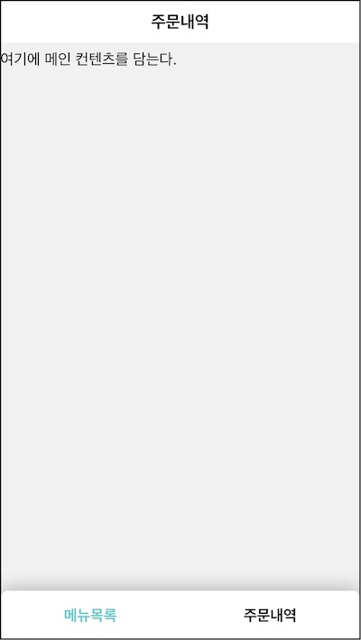
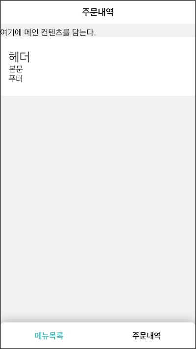

주문내역 화면이다. 이전 장에서 만든 컴포넌트를 재사용하고 없는 것은 새로 만든다.

요구사항

- 3.1 "주문내역" 제목을 상단에 표시한다. (UI)
- 3.2 주문내역 정보를 불러와 중앙에 표시한다. (UI)
- 3.3 네비게이션바가 하단에 위치한다. (UI)

# 컴포넌트 계층 구조 나누기

이전 장에서는 전체 화면을 App 컴포넌트 하나로 만든 뒤 역할에 따라 작은 컴포넌트로 분리했다. 처음부터 역할에 따른 컴포넌트를 설계하는 것이 어렵기 때문이다.

이번엔 역할에 따른 작은 컴포넌트를 먼저 설계하고 이를 조합하는 순서로 진행하겠다. 상품목록 화면 설계 경험을 바탕으로 **리액트로 생각하기** 방식을 따르자.

먼저 **UI 계층**을 나눈다.


미리 만들어둔 컴포넌트로 화면을 구성할 수 있다.

- OrderPage: 주문내역 화면. Page 컴포넌트를 조합
- Page: 상단, 중앙, 하단으로 구성
- Title: 화면 제목. "주문내역"을 표시
- Navbar: 네비게이션바. 주문 내역을 강조

새로 추가할 컴포넌트를 찾아 보자. 중앙에 주문 상태, 결제 정보, 배송 정보가 위치한다. 각각은 비슷한 스타일이라서 카드라고 정규화할 수 있겠다.

주문상태 카드

- 상단: 주문 상태, 메뉴명
- 중앙: 주문일시, 주문번호
- 하단: 전화 버튼, 가게보기 버튼

결제정보 카드

- 상단: 결제 금액, 결제 수단
- 중앙: 메뉴가격, 배달료, 할인금액
- 하단: 없음

배송정보 카드

- 상단: 없음
- 중앙: 배달주소, 전화번호, 업주와 배달기사에게 전달하는 메세지
- 하단: 없음

컴포넌트를 이렇게 구성해 보자.

- Card: 상단, 중앙, 하단으로 구성. 각 영역을 인자로 받아 렌더
- OrderStatusCard: 주문상태 카드. Card의 상단, 중앙, 하단 조합
- OrderPaymentCard: 결제정보 카드. Card의 상단, 중앙 조합
- OrderDeliveryCard: 배송정보 카드. Card의 중앙 조합

이 컴포넌트를 사용해 주문내역 화면을 만들면 이런 모습이 될 것이다.

```jsx
<OrderPage />
  <Page />
    <Title />
    <OrderStatusCard /> // 주문상태
      <Card />
    <OrderPaymentCard /> // 결제정보
      <Card />
    <OrderDeliveryCard /> // 배송정보
      <Card />
  <Navbar />
```

# OrderPage

주문내역 페이지 컴포넌트를 만들자. 페이지 컴포넌트이기 때문에 src/pages/OrderPage/index.jsx 파일을 만들어 작성한다.

```jsx
const OrderPage = () => (
  <div className="OrderPage">
    <Page header={<Title>주문내역</Title>} footer={<Navbar />}>
      여기에 메인 컨텐츠를 담는다.
    </Page>
  </div>
)
```

Page로 전체 윤곽을 잡았다.

- header: "주문내역"이란 제목이 오도록 Title 전달
- footer: Navbar전달. 아직 선택된 메뉴가 "주문내역"은 아니다. 2편 고급주제에서 다룰 예정

App에 기존의 ProductPage를 숨기고 OrderPage로 대체한다.

```jsx{4}
const App = () => (
  <>
    {/* <ProductPage /> */}
    <OrderPage />
  </>
)
```



만들어둔 작은 컴포넌트를 조합해 신속히 화면 윤곽을 만들 수 있었다. 이것이 바로 역할에 따라 컴포넌트를 분리하고 명시적으로 조합한 효과다.

요구사항

- **~~3.1 "주문내역" 제목을 상단에 표시한다. (UI)~~**
- 3.2 주문내역 정보를 불러와 중앙에 표시한다. (UI)
- **~~3.3 네비게이션바가 하단에 위치한다. (UI)~~**

# Card

요구사항 3.2는 주문내역 정보를 중앙에 표시하는 것이다. 이 정보를 렌더링할 카드 컴포넌트를 만들어 보자. src/components/Card.jsx 파일을 추가한다.

```jsx
const Card = () => (
  <div className="Card">
    <header>헤더</header>
    <main>본문</main>
    <footer>푸터</footer>
  </div>
)
```

미리 만들어 둔 .Card 스타일을 사용해 헤더, 본문, 푸터 앨리먼트로 구성했다.

OrderPage에서 테스트하면 이런 모습이다.



카드 컴포넌트를 조합해 세 가지 카드 컴포넌트를 만들 차례다.

```jsx{1,3,5-10,12}
const Card = ({ header, data = [], footer }) => (
  <div className="Card">
    {header && <header>{header}</header>}
    <main>
      {data.map(({ term, description }) => (
        <dl key={term}>
          <dt>{term}</dt>
          <dd>{description}</dd>
        </dl>
      ))}
    </main>
    {footer && <footer>{footer}</footer>}
  </div>
)
```

header와 footer를 옵셔널로 받아 있을 경우 각 위치에 렌더링할 것이다.

data 값을 필수로 받는데 배열 형태이다. 카드 중앙에 리스트 렌더링으로 표시했다. 배열 안에는 term과 description 키로 구성된 객체가 있는데 이를 각각 dt, dl 엘리먼트로 표시했다.

# Card 조합: OrderXXXCard

Card 컴포넌트의를 조합해 주문내역 정보를 표시할 컴포넌트를 만들 차례다.

- OrderStatusCard: 주문 상태 렌더
- OrderPaymentCard: 결제 정보 렌더
- OrderDeliveryCard: 배송 정보 렌더

이 카드는 모두 주문 데이터를 기반으로 값을 렌더링한다. 먼저 주문 API를 통해 주문 데이터 모양을 확인해 보자.

브라우져 개발자 도구를 열고 다음 명령어로 http 요청을 만든다.

```js
fetch("/api/order/my")
```

fetch() 함수가 반환한 프라미스 객체 값이 로그에 찍힐 것이다. 그리고 네트워크 탭으로 이동하면 http 요청이 하나 생성된 것을 볼 수 있다. json 데이터가 응답되는데 들여다보면 주문값 것을 눈치챘을 것이다.

```json
{
  "id": "CACDA420",
  "orderDate": "2023. 5. 13. 오후 1:37:51",
  "status": "배달을 완료했어요",
  "name": "짜장면",
  "totalPrice": 7000,
  "paymentMethod": "마이페이",
  "productPrice": 6000,
  "deliveryPrice": 3000,
  "discountPrice": 2000,
  "deliveryAddress": "서울특별시 송파구 잠실동 1번지",
  "deliveryContact": "010-1111-2222",
  "messageToShop": "포크는 주지 마세요",
  "messageToRider": "안전하게 오세요",
  "position": [30, 30]
}
```

이 모양을 기반으로 각 컴포넌트를 만들것이다.

가장 단순한 OrderDelvieryCard부터 만들어 보자. src/pages/OrderPage/OrderDeliveryCard.jsx 파일을 추가한다. 주문내역 화면에 특화된 것이기 때문에 OrderPage 근처에 코드를 모았다.

```jsx{1,10-17}
const OrderDeliveryCard = ({ order }) => {
  const {
    deliveryAddress,
    deliveryContact,
    messageToShop,
    messageToRider,
  } = order

  return (
    <Card
      data={[
        { term: "배달주소", description: deliveryAddress },
        { term: "전화번호", description: deliveryContact },
        { term: "가게사장님께", description: messageToShop },
        { term: "라이더님께", description: messageToRider },
      ]}
    />
  )
}
```

주문 데이터를 인자로 받아 Card를 조합했다. data 속성에 일부를 전달했는데 Card가 렌더링에 사용할 것이다. header와 footer는 사용하지 않았다.

다음은 OrderPaymentCard다. src/pages/OrderPage/OrderPaymentCard.jsx

```jsx{1,10-23}
const OrderPaymentCard = ({ order }) => {
  const {
    totalPrice,
    paymentMethod,
    productPrice,
    deliveryPrice,
    discountPrice,
  } = order

  return (
    <Card
      header={
        <>
          총 결제금액: {totalPrice.toLocaleString()}원
          <br />
          결제 방법: {paymentMethod}
        </>
      }
      data={[
        {
          term: "메뉴가격",
          description: <>{productPrice.toLocaleString()}원</>,
        },
        {
          term: "배달료",
          description: <>{deliveryPrice.toLocaleString()}원</>,
        },
        {
          term: "할인금액",
          description: <>{discountPrice.toLocaleString()}원</>,
        },
      ]}
    />
  )
}
```

인자로받은 주문 값을 사용해 결제 정보를 표시한다. 카드 컴포넌트의 header, data에 전달했다.

마지막으로 OrderStatusCard다.. src/pages/OrderPage/OrderStatusCard.jsx

```jsx{1,5-24}
const OrderStatusCard = ({ order }) => {
  const { status, name, orderDate, id } = order

  return (
    <Card
      header={
        <>
          <strong>{status}</strong>
          <br />
          {name}
        </>
      }
      data={[
        { term: "주문일시", description: orderDate },
        { term: "주문번호", description: id },
      ]}
      footer={
        <>
          <Button>전화</Button>
          <Button>가게보기</Button>
        </>
      }
    />
  )
}
```

인자로 받은 주문 값을 사용해 주문 상태 정보를 표시한다. Card의 모든 속성에 이 값을 전달했다.

조합한 세 개 컴포넌트를 이용해서 주문내역 페이지를 완성할 차례다.

```jsx{21-23}
const fakeOrder = {
  id: "CACDA420",
  orderDate: "2023. 5. 13. 오후 1:37:51",
  status: "배달을 완료했어요",
  name: "짜장면",
  totalPrice: 7000,
  paymentMethod: "마이페이",
  productPrice: 6000,
  deliveryPrice: 3000,
  discountPrice: 2000,
  deliveryAddress: "서울특별시 송파구 잠실동 1번지",
  deliveryContact: "010-1111-2222",
  messageToShop: "포크는 주지 마세요",
  messageToRider: "안전하게 오세요",
  position: [30, 30],
}

const OrderPage = () => (
  <div className="OrderPage">
    <Page header={<Title>주문내역</Title>} footer={<Navbar />}>
      <OrderStatusCard order={fakeOrder} />
      <OrderPaymentCard order={fakeOrder} />
      <OrderDeliveryCard order={fakeOrder} />
    </Page>
  </div>
)
```


# 상태 정의

다음은 **UI 상태를 위한 최소한의 표현**을 찾는 것이다. 변할 수 있는 값은 주문 데이터다. 이 값을 서버에서 가져와 주문내역 화면에 그릴 것이다. 지금은 fakeOrder로 사용하고 있는 부분이다.

변수로 관리한 주문내역 값을 컴포넌트 상태로 관리하자. **어디에** 두어야 할까?

- Card: 각 카드 컴포넌트가 데이터를 주입해 주는데로 헤더, 메인, 푸터를 그리는 역할만 한다.

- XXXCard: 인자 일부를 렌더링에 사용한다. 세 개 컴포넌트가 동일한 주문 정보를 사용하기 때문에 각 컴포넌트의 상태로 관리한다면 동일한 API를 중복 호출하게 될 것이다.

- OrderPage: 이 컴포넌트가 주문 내역 상태를 사용하는 최상위 컴포넌트다. 여기에서 관리하다면 API를 한번 호출해 응답 값을 자식 컴포넌트들에게 전달하면 되겠다.

상태를 사용하기 위해 OrderPage를 함수 컴포넌트에서 클래스 컴포넌트로 변경하겠다. OrderApi로 order 데이터를 가져와 상태에 저장한다.

```jsx{1,7,11,20,27-29}
class OrderPage extends React.Component {
  constructor(props) {
    super(props)
    this.state = { order: null }
  }

  componentDidMount() {
    this.fetch()
  }

  async fetch() {
    try {
      const order = await OrderApi.fetchMyOrder()
      this.setState({ order })
    } catch (e) {
      console.error(e)
    }
  }

  render() {
    const { order } = this.state
    return (
      <div className="OrderPage">
        <Page header={<Title>주문내역</Title>} footer={<Navbar />}>
          {order && (
            <>
              <OrderStatusCard order={order} />
              <OrderPaymentCard order={order} />
              <OrderDeliveryCard order={order} />
            </>
          )}
        </Page>
      </div>
    )
  }
}
```

함수 컴포넌트를 클래스 컴포넌트로 바꾸고 상태 order를 두었다. 렌더 메소드에서는 이 값의 유무에 따라 조건부 렌더링을 할 것이다.

마운트 후에 API로 조회한 값을 가져와 상태 order를 갱신한다. 리액트는 갱신된 상태로 컴포넌트를 다시 랜더링하는데 API가 응답한 값으로 주문 정보를 그릴 것이다.


요구사항

- ~~3.1 "주문내역" 제목을 상단에 표시한다. (UI)~~
- **~~3.2 주문내역 정보를 불러와 중앙에 표시한다. (UI)~~**
- ~~3.3 네비게이션바가 하단에 위치한다. (UI)~~

# 중간 정리

주문정보 페이지를 만들었다.

- OrderPage

UI 계층 구조를 나눈뒤 역할에 맞는 기존 컴포넌트를 조합했다.

- Page
- Title
- Navbar

화면 중앙에 표시할 주문정보 카드를 렌더하는 역할의 컴포넌트를 만들었다.

- Card: 헤더, 메인, 푸터 형식의 카드 렌더링
- OrderStatusCard: Card의 data, header, footer 사용
- OrderPaymentCard: Card의 data, header 사용
- OrderDeliveryCard: Card의 data 사용

UI 렌더를 위한 최소한의 상태 표현을 찾고 OrderPage에서 상태를 관리했다.

참고

- [리액트로 사고하기](https://ko.reactjs.org/docs/thinking-in-react.html)
