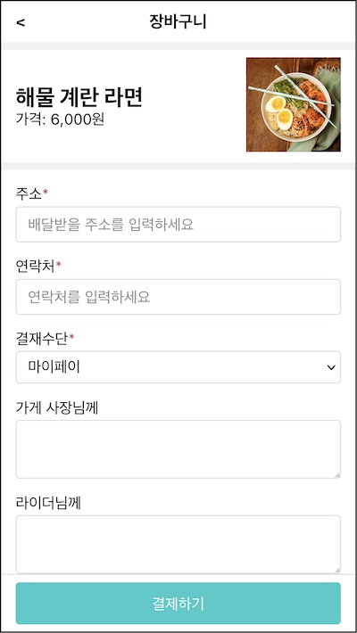
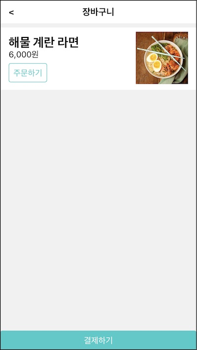
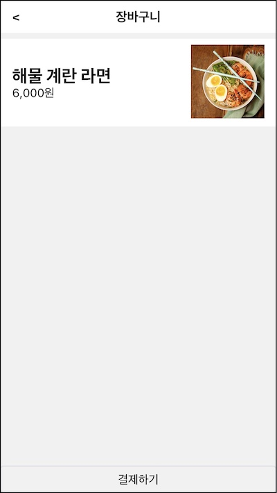
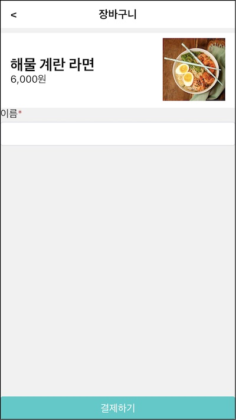
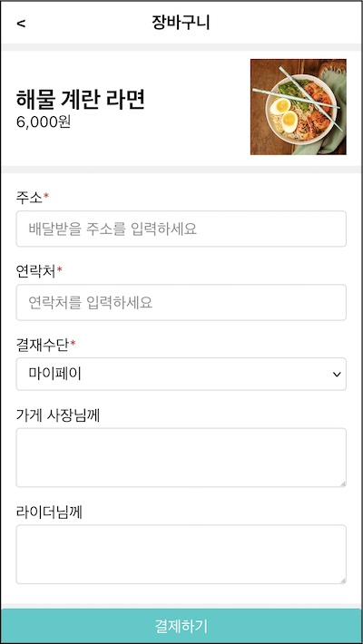

마지막 장바구니 화면이다.

요구사항

- 2.1 "장바구니" 제목을 상단에 표시한다. (UI)
- 2.2 제목 좌측에 뒤로 가기 버튼을 표시한다. (UI)
- 2.3 선택한 상품 정보를 중앙에 표시한다. (UI)
- 2.4 주문 정보를 입력할 수 있는 폼을 중앙에 표시한다. (UI)
- 2.5 폼 입력 값을 검증하고 오류를 표시한다. (폼)
- 2.6 결제하기 버튼을 하단에 표시한다. (UI)

지난 장과 같은 방식으로 작은 컴포넌트를 먼저 설계하고 화면을 구성해 보자. 2편에서 다룰 리액트 고급주제 중 Ref를 먼저 다루겠다.

# 컴포넌트 계층 구조 나누기

컴포넌트 계층을 나누는 것이 먼저다.



미리 만들어둔 컴포넌트로 화면을 구성할 수 있다

- CartPage: 주문내역 화면. Page 조합
- Page: 상단, 중앙, 하단 구성
- Title: 화면 제목. "장바구니" 표시
- ProductItem: 상품 정보 표시. 구매하기 버튼을 제어할 수 있어야 한다.

여기까지는 이미 만들어 둔 컴포넌트다. 주문내역 화면에서 새롭게 추가할 UI 컴포넌트를 분석해보자. 페이지 중앙에 두 가지의 정보를 렌더한다.

- 상품 정보
- 주문 폼

주문 폼이 새롭다.

- 필수 입력: 주소, 연락처, 결제 수단
- 선택 입력: 업주와 배달 기사에게 전달할 메세지

이것은 OrderForm이란 컴포넌트로 추상화해서 제작해 보겠다.

각 입력 폼은 다양해 보이지만 공통사항을 추출해 낼 수 있다. 필드 이름과 필수 입력 여부를 표시할 수 있다. 이러한 역할의 FormControl을 만들겠다. 이를 조합해 각각의 필드를 표시할 수 있을 것이다.

하단에 새로운 UI가 나왔다. 기존에는 Navbar 컴포넌트를 사용해 페이지를 이동할 수 있었지만 지금은 결제하기 버튼이다. Button을 조합해 PaymentButton을 만들 수 있겠다.

- OrderForm: 주문 입력 폼
- FormControl: 필드 정보 표시
- PaymentButton: 하단에 위치할 결제하기 버튼

이 컴포넌트를 사용해 장바구니 화면을 만들면 이런 모습이 될 것이다.

```jsx
<CardPage>
  <Page>
    <Title>
    <ProductItem>
    <OrderForm> // 주문 정보입력폼
      <FormControl> // 레이블과 필드
    <PaymentButton> // 결제 버튼
      <Button />
```

# CartPage

장바구니 페이지 컴포넌트를 만들자. src/pages/CartPage/index.jsx 파일을 만든다.

```jsx{8,10-19}
const fakeProduct = {
  id: "CACDA420",
  name: "해물 계란 라면",
  price: 6000,
  thumbnail: "./images/menu-해물계란라면.jpg",
}

const CartPage = () => (
  <div className="CartPage">
    <Page
      header={<Title>장바구니</Title>}
      footer={
        <Button styleType="brand-solid" block>
          결제하기
        </Button>
      }
    >
      <ProductItem product={fakeProduct} />
    </Page>
  </div>
)
```

Page 컴포넌트로 전체 윤곽을 잡았다.

- header: "장바구니"란 이름의 Title 전달
- footer: "결제하기"란 이름의 Button 전달. 스타일 속성을 조합
- children: ProductItem을 전달

App에 기존 컴포넌트들을 숨기고 CartPage로 대체한다.

```jsx{5}
const App = () => (
  <>
    {/* <ProductPage /> */}
    {/* <OrderPage /> */}
    <CartPage />
  </>
)
```


Title로 상단 정보를 표시했다. 시안과 비교하면 뒤로가기 버튼은 아직 없다. ProductItem으로 상품 정보를 렌더했다. 시안과 비교하면 주문하기 버튼이 없어야 한다. 결제하기 버튼도 시안과 비교하면 스타일이 조금 다르다.

요구사항

- **~~2.1 "장바구니" 제목을 상단에 표시한다. (UI)~~**
- 2.2 제목 좌측에 뒤로 가기 버튼을 표시한다. (UI)
- 2.3 선택한 상품 정보를 중앙에 표시한다. (UI)
- 2.4 주문 정보를 입력할 수 있는 폼을 중앙에 표시한다. (UI)
- 2.5 폼 입력 값을 검증하고 오류를 표시한다. (폼)
- 2.6 결제하기 버튼을 하단에 표시한다. (UI)

# Title 다시보기

시안과 비교하면 제목 좌측에 뒤로가기 버튼이 있지만 지금은 제목만 노출하는 컴포넌트다. 어떤 타이틀 컴포넌트는 제목과 더불어 좌측에 뒤로가기 버튼도 있는 것이다.

방법은 여러가지다.

- 첫째, Title이 뒤로가기 주소를 인자로 받는 방법. 뒤로 가기 버튼을 렌더하고 주소로 이동시키는 역할을 할 것이다.

- 둘째, Title에서 뒤로가기를 분리하는 방법. 외부에서 뒤로가기 앨리먼트를 주입하면 단순히 렌더 역할만 하는 것이다.

  가령 addonBefore라는 인자를 받아 이것을 좌측에 표시하는 식이다. 뒤로 가기 버튼의 모양과 동작을 담당하는 BackLink 같은 걸 만들수 있다. `<Title addonBefore={<BackLink />}>주문하기</Title>` 이런 형식이다.

정답은 없다. 상황에 따라 결정해야 한다. Title 좌측에 위치하는 것이 뒤로가기 버튼 뿐만아니라 햄버거 버튼도 표기해야 한다면 후자가 괜찮은 선택이다. 여러 상황에 대처할 수 있기 때문이다.

뒤로가기 버튼만 있다면 내부 로직으로 품는게 단순할 것 같다. 트레이드 오프.

Title에 backUrl이란 속성을 추가하겠다.

```jsx{2-9}
const Title = ({ backUrl = "", children }) => {
  if (backUrl) {
    return (
      <>
        <a href={backUrl} />
        <h1 style={{ paddingRight: "44px" }}>{children}</h1>
      </>
    )
  }

  return <h1>{children}</h1>
}
```

backUrl이 있을 경우 이 주소로 링크를 만들었다. backUrl이 없으면 이전처럼 타이틀 문자열만 노출할 것이다.

장바구니 화면에서는 다음과 같이 Title을 사용할 수 있다.

```jsx{4}
const CartPage = () => (
  <div className="CartPage">
    <Page
      header={<Title backUrl="/">장바구니</Title>}
      footer={<Button form="order-form">결제하기</Button>}
    >
```



- ~~2.1 "장바구니" 제목을 상단에 표시한다. (UI)~~
- **~~2.2 제목 좌측에 뒤로 가기 버튼을 표시한다. (UI)~~**
- 2.3 선택한 상품 정보를 중앙에 표시한다. (UI)
- 2.4 주문 정보를 입력할 수 있는 폼을 중앙에 표시한다. (UI)
- 2.5 폼 입력 값을 검증하고 오류를 표시한다. (폼)
- 2.6 결제하기 버튼을 하단에 표시한다. (UI)

# ProductItem 다시보기

ProductItem으로 장바구니의 상품정보를 표시했지만 주문하기 버튼은 없어야 한다. 이 컴포넌트를 어떻게 조합하느냐에 따라서 버튼을 조건부 렌더링하면 되겠다.

onClick 인자를 추가하자. 콜백 인자가 있을때 주문하기 버튼을 노출하는 것이다. 콜백을 전달했다는 것은 버튼 클릭을 수신하겠다는 의도로 본다는 것이다.

이전 절의 Title과 비슷한 상황이다. 주문하기 버튼을 컴포넌트 내부에서 정의할 것인지 외부에서 받을 것인지 둘 다 가능하다. 변수는 상황이다.

- 첫째, 주문하기가 아니라 즐겨찾기 라는 버튼도 있을 수 있다면 컴포넌트 내부에 추가해 분기문으로 구성하는 것보다는 외부에서 정해서 주는 것이 복잡도를 줄일 수 있는 방법이다.

- 둘째, 주문하기라는 버튼 하나 뿐이라면 컴포넌트 내부에 정의해도 좋다. onClick을 선택한 이유다.

```jsx{4,5}
const ProductItem = ({ product, onClick }) => (
  <div className="ProductItem">
    {/* ... */}
    {onClick && (
      <Button styleType={"brand"} onClick={onClick}>
        주문하기
      </Button>
    )}
```

상품목록 화면에서는 주문하기 버튼이 있어야하기 때문에 product와 onClick 인자를 사용하고 장바구니 화면에서는 주문하기 버튼이 없기 때문에 product 인자만 전달하면 되겠다.

상품목록 화면에서만 사용하는 구매가능한 상품이란 의미의 OrderableProductItem이란 이름의 컴포넌트를 만들면 더 좋겠다. pages/ProductPage/OrderableProductItem.jsx를 추가하자.

```jsx{1,5}
const OrderableProductItem = ({ product }) => {
  const handleClick = () => {
    console.log("// TODO 장바구니 화면으로 이동")
  }
  return <ProductItem product={product} onClick={handleClick} />
}
```

ProductItem의 인자를 조합한 래퍼 컴포넌트다.

상품목록 페이지에서 이 컴포넌트로 대체한다.

```jsx{4}
const ProductPage = () => (
  <div className="ProductPage">
    <Page header={<Title>메뉴목록</Title>} footer={<Navbar />}>
      <OrderableProductItem product={product} />
```

이제 장바구니 화면에서 사용한 ProductItem에는 주문하기 버튼이 사라졌다.



요구사항

- ~~2.1 "장바구니" 제목을 상단에 표시한다. (UI)~~
- ~~2.2 제목 좌측에 뒤로 가기 버튼을 표시한다. (UI)~~
- **~~2.3 선택한 상품 정보를 중앙에 표시한다. (UI)~~**
- 2.4 주문 정보를 입력할 수 있는 폼을 중앙에 표시한다. (UI)
- 2.5 폼 입력 값을 검증하고 오류를 표시한다. (폼)
- 2.6 결제하기 버튼을 하단에 표시한다. (UI)

# FormControl

장바구니 화면에서 사용할 신규 컴포넌트를 만들 차례다.

- FormControl: 필드 정보 표시
- OrderForm: 주문 입력 폼
- PaymentButton: 하단에 위치할 결제하기 버튼

FormControl 부터 보자. 레이블과 입력 필드를 렌더링하는 역할이다.

미리 만들어둔 스타일을 이용해 정적 버전을 만들자. 재사용할 것이라서 src/components/FormControl.jsx을 만든다.

```jsx
const FormControl = () => (
  <div className="FormControl">
    <label htmlFor="name">
      이름<span className="required">*</span>
    </label>
    <input id="name" />
  </div>
)
```

필드 이름이 "이름"이고 필수 입력을 표시하는 별표가 따라온다. htmlFor 속성에 지정한 값은 아래 인풋 엘리먼트를 가리킨다.



여기서 어떤 것이 이 컴포넌트의 역할일까?

- 레이블: 변경 가능. 사용하는 경우마다 주소, 연락처, 결재수단이 될 수 있기 때문
- 별표: 변경 가능. 주소와 연락처 그리고 결재수단은 필수이지만 업주와 배달기사에게 남기는 메세지는 선택이기 때문
- 입력 필드: 변경 가능. 결재수단은 셀렉트이고 업주와 배달기사에게 남기는 메세지는 텍스트에리어이기 때문

이런 변화를 모두 받아들이려면 폼 컨트롤러는 이 로직을 내부에 갖고 있으면 안된다. 이름을 필수 입력하는 역할만하기 때문이다.

이러한 역할을 컴포넌트를 외부 쪽으로 양보하면 컴포넌트의 쓰임이 좋아진다. 주소, 연락처, 결재수단 등 모든 입력 필드 컴포넌트에 활용할수 있기 때문이다.

이러한 모든 변화의 가능성을 인자로 열어보자.

```jsx
const FormControl = ({ label, htmlFor, required, children }) => (
  <div className="FormControl">
    <label htmlFor={htmlFor}>
      {label}
      {required && <span className="required">*</span>}
    </label>
    {children}
  </div>
)
```

네 가지 인자를 받았다.

- label: 레이블 문자열
- htmlFor: 레이블이 가리킬 필드의 아이디
- required: 필수 표시 여부
- children: 입력 필드

인자를 조합하면 충분히 기존의 기능을 대체할 수 있다.

```jsx
<FormControl label="이름" htmlFor="name" reuqired>
  <input id="name" />
</FormControl>
```

# OrderForm, 비제어 컴포넌트

FormControl를 사용해 OrderForm 컴포넌트를 만들 차례다. 장바구니 화면에서만 사용하는 컴포넌트이기 때문에 src/pages/CartPage/OrderForm.jsx 파일을 추가했다.

```jsx{1,3,11,12,20,21,26,27,29,30,32}
const OrderForm = () => (
    <form className="OrderForm">
      <FormControl label="주소" htmlFor="deliveryAddress" required>
        <input
          type="text"
          id="deliveryAddress"
          placeholder="배달받을 주소를 입력하세요"
          required
          autoFocus
        />
      </FormControl>
      <FormControl label="연락처" htmlFor="deliveryContact" required>
        <input
          type="text"
          id="deliveryContact"
          placeholder="연락처를 입력하세요"
          pattern="^\d{2,3}-\d{3,4}-\d{4}$"
          required
        />
      </FormControl>
      <FormControl label="결재수단" htmlFor="paymentMethod" required>
        <select name="paymentMethod" id="paymentMethod" value="">
          <option value="마이페이">마이페이</option>
          <option value="만나서 결제">만나서 결제</option>
        </select>
      </FormControl>
      <FormControl label="가게 사장님께" htmlFor="messageToShop">
        <textarea name="messageToShop" id="messageToShop"></textarea>
      </FormControl>
      <FormControl label="라이더님께" htmlFor="messageToRider">
        <textarea name="messageToRider" id="messageToRider"></textarea>
      </FormControl>
    </form>
  );
};
```

미리 준비한 .OrderForm 클래스와 폼 앨리먼트를 사용했다. FormControl 컴포넌트로 각 주소, 연락처, 결제수단, 가게 사장님께, 라이더님께 필드를 구성했다.

CartPage에 사용해 보자.

```jsx{12}
const CartPage = () => (
  <div className="CartPage">
    <Page
      header={<Title backUrl="/">장바구니</Title>}
      footer={
        <Button styleType="brand-solid" block>
          결제하기
        </Button>
      }
    >
      <ProductItem product={fakeProduct} />
      <OrderForm />
    </Page>
  </div>
)
```



요구사항

- ~~2.1 "장바구니" 제목을 상단에 표시한다. (UI)~~
- ~~2.2 제목 좌측에 뒤로 가기 버튼을 표시한다. (UI)~~
- ~~2.3 선택한 상품 정보를 중앙에 표시한다. (UI)~~
- **~~2.4 주문 정보를 입력할 수 있는 폼을 중앙에 표시한다. (UI)~~**
- 2.5 폼 입력 값을 검증하고 오류를 표시한다. (폼)
- 2.6 결제하기 버튼을 하단에 표시한다. (UI)

1부에서 리액트 상태로 폼을 다뤘던 내용을 떠올려 보자.

1. 컴포넌트 상태 값을 입력 필드의 value에 연결
1. 필드를 변경하면 입력값을 컴포넌트 상태에 갱신
1. 리액트가 컴포넌트를 리렌더. value에 바인딩된 값을 렌더

이렇게 리액트 상태로 컴포넌트를 제어하는 것을 **제어 컴포넌트**라고 한다.

반면 OrderForm은 어떠한 리액트 상태와도 연결하지 않았다. onChange에 핸들러를 추가하지도 았았다. 그런데도 입력할 수 있는 이유는 뭘까? 바로 브라우져에서 상태를 관리하기 때문이다. 리액트 관점에서 이것을 **비제어 컴포넌트**라고 부른다.

폼이 간단하면 비제어 컴포넌트를 쓰는 것이 좋다. 반면 입력값 검증, 오류 UI 처리 등 세세한 폼 처리를 위해서는 제어 컴포넌트가 유리하다. 지금은 비제어 컴포넌트로 먼저 구현하고 이후 훅 편에서 이것을 제어 컴포넌트로 바꿔 어플리케이션을 개선할 것이다.

자 그럼 다시 OrderForm으로 돌아와서. 폼 제출 이벤트를 처리하자. 폼 앨리먼트 안에 있는 버튼을 클릭하거나 입력 필드에서 엔터키를 입력하면 제출 이벤트가 발생한다.

하지만 실습 어플리케이션에서는 동작하지 않는다. 버튼이 폼 앨리먼트 밖에 있기 때문이다. 이 버튼을 외부의 폼의 제출 버튼으로 지정하자.

```jsx{1,7}
const OrderForm = () => {
  const handleSubmit = e => {
    e.preventDefault()
    console.log("submit")
  }
  return (
    <form className="OrderForm" id="order-form" onSubmit={handleSubmit}>
      {/* ... */}
```

폼 앨리먼트에 "order-form" 이란 아이디를 지정했다.

```jsx{1,5-9}
const CartPage = () => (
  <div className="CartPage">
    <Page
      header={<Title>장바구니</Title>}
      footer={
        <Button styleType="brand-solid" block form="order-form">
          결제하기
        </Button>
      }
    >
    {/* ... */}
```

폼 외부에 있는 버튼의 form 속성에 이 아이디를 지정했다. 이제 버튼을 클릭하거나 필드에서 엔터를 입력하면 제출 이벤트가 동작할 것이다.

요구사항

- ~~2.1 "장바구니" 제목을 상단에 표시한다. (UI)~~
- ~~2.2 제목 좌측에 뒤로 가기 버튼을 표시한다. (UI)~~
- ~~2.3 선택한 상품 정보를 중앙에 표시한다. (UI)~~
- ~~2.4 주문 정보를 입력할 수 있는 폼을 중앙에 표시한다. (UI)~~
- **~~2.5 폼 입력 값을 검증하고 오류를 표시한다. (폼)~~**
- 2.6 결제하기 버튼을 하단에 표시한다. (UI)

# 레프와 돔

컴포넌트 상태와 인자만 변경하면 앨리먼트는 자동으로 계산되는 구조를 따르는 것이 리액트 컴포넌트 개발의 기본 방향이다. 대부분 경우 이 구조로 개발하는 것이 돔 앨리먼트를 직접 다루는 방법보다 더 낫다. 자칫 장황한 코드가 되기 때문이다.

그럼에도 불구하고 돔에 직접 접근해야 하는 상황이 있다. 리액트는 이런 경우에 대비해 **레프(ref)** 라는 특별한 객체를 제공한다. 이 절에서는 리액트 레프에 대해 알아 보겠다.

컴포넌트 인자 혹은 상태 값으로 리액트 앨리먼트를 선언적으로 작성한다. 가령 렌더된 인풋 필드에 포커싱하려면 어떤 상태를 두어야 할까? 앨리먼트에 focused 같은 속성이 있는 것도 아니라서 선언적인 방식이 잘 떠오르지 않는다.

Ref는 이렇게 선언적으로 문제를 해결할 수 없을 경우 찾을 수 있는 후보다. 이런 경우에 사용한다.

- 포커스, 텍스트 선택영역, 미디어 재생 관리
- 애니메이션 직접 실행
- 써드 파트 DOM 라이브러리 사용

레프 객체부터 만들어 보자.

```jsx
class MyComponent extends React.Component {
  // ref 객체를 클래스 멤버 변수에 저장해 둔다.
  this.divRef = React.createRef();

  render() {
    // this.ref로 리액트 엘리먼트를 가리킨다.
    return <div ref={this.divRef}>;
  }

  componentDidMount() {
    // ref 객체의 current 속성에 돔 엘리먼트가 저장된다.
    const divElement = thir.divRef.current;
    // DOM api를 사용할 수 있다.
    divElement.style.backgroundColor = 'red';
  }
}
```

React.createRef() 함수로 레프객체를 만들 수 있다. 이 객체를 리액트 앨리먼트의 ref 속성에 전달하면 리액트는 엘리먼트를 이 레프 객체에 할당한다. 컴포넌트가 마운트되면 this.divRef.current로 돔에 있는 앨리먼트에 접근할 수 있다. 여기서는 스타일을 직접 변경했다.

주의할 것은 이 값이 항상 존재하는 것은 아니다. createRef()로 만든 객체는 이런 모양이다.

```js
{
  current: null
}
```

초기값 null이 언제 앨리먼트로 채워진 것일까? 우리는 리액트 앨리먼트에 ref 속성에 객체만 전달했을 뿐이다. 리액트가 특정 시점에 뭔가 작업했을 것이다.

컴포넌트 라이프사이클 메소드를 들여다 보자.

```jsx{5,9,14}
class MyComponent extends React.Component {
  divRef = React.createRef();

  constructor() {
    console.log(this.divRef); // {current: null}
  }

  render() {
    console.log(this.divRef); // {current: null}
    return <div ref={this.divRef}>
  }

  componentDidMount() {
    console.log(this.divRef) // {current: div}
  }
}
```

컴포넌트가 생성될 때는 아직 null이다. 리액트 앨리먼트를 반환할 때도 여전히 값은 null. 돔에 마운트되고 나서 div 앨리먼트로 채워졌다.

이 값은 노드 유형에 따라 다르다.

```jsx
class MyComponent extedns React.Component {
  divRef = React.createRef();
  fooRef = React.createRef();

  render() {
    return (
      <>
        <div ref={this.divRef} />
        <Foo ref={this.fooRef} />
      <>
    )
  }

  componentDidMount() {
    console.log(this.difRef); // {current: div}
    console.log(this.fooRef instanceof Foo); // true
  }
}
```

- 엘리먼트에 전달하면: 돔 앨리먼트
- 컴포넌트에 전달하면: 컴포넌트 인스턴스

참고로 함수 컴포넌트에는 인스턴스가 없기 때문에 ref 인자로 레프 객체를 전달할 수 없다.

함수 컴포넌트 안에서 ref 객체를 사용하는 방법은 4편에서 다룰 예정이다.

# OrderForm, 레프

비제어 컴포넌트에서 엘리먼트의 입력 데이터를 사용하려면 돔에 직접 접근해야한다. 리액트 레프 객체를 사용해야 한다.

레프 객체를 사용하기 위해 OrderForm 함수형 컴포넌트를 클래스 컴포넌트로 바꾸자.

```jsx{1,5,11,19,20}
class OrderForm extends Component<OrderFormProps> {
  constructor(props) {
    super(props);

    this.formRef = React.createRef();
    this.handleSubmit = this.handleSubmit.bind(this);
  }

  handleSubmit(e) {
    e.preventDefault();
    console.log("submit", this.formRef)
  };

  render() {
    return (
      <form
        className="OrderForm"
        id="order-form"
        ref={this.formRef}
        onSubmit={this.handleSubmit}
      >
```

form 엘리먼트의 ref에 레프 객체를 전달했다. 제출 이벤트가 발생하면 레프 객체를 통해 form 엘리먼트에 접근해 입력 값을 조회할 것이다.

폼의 각 필드 값을 조회하는 헬퍼 메소드를 이 클래스에 추가하자.

```js
  getInputValueByName(name) {
    if (!this.formRef.current) return;

    const inputElement = this.formRef.current.elements.namedItem(name);
    if (!inputElement) return "";

    return inputElement.value;
  };
```

formRef의 current 속성을 보는데 엘리먼트 메소드 중 NamedItem 함수로 인풋 엘리먼트를 찾았다. 브라우져가 저장한 값을 value 속성을 통해 조회한다.

이제 handleSubmit에서 필드 값을 조회할 수 있다.

```jsx{4-8}
  handleSubmit(e) {
    e.preventDefault();

    const deliveryAddress = this.getInputValueByName("deliveryAddress");
    const deliveryContact = this.getInputValueByName("deliveryContact");
    const paymentMethod = this.getInputValueByName("paymentMethod");
    const messageToShop = this.getInputValueByName("messageToShop");
    const messageToRider = this.getInputValueByName("messageToRider");

    console.log({
      deliveryAddress,
      deliveryContact,
      paymentMethod,
      messageToRider,
      messageToShop,
    });
  };
```

# PaymentButton

마지막으로 PaymentButton 컴포넌트를 만들 차례다. 장바구니 화면에서만 사용하기 때문에 src/pages/CartPage/PaymentButton.jsx 파일을 추가한다.

```jsx{3-10}
const PaymentButton = () => (
  <div className="PaymentButton">
    <Button
      styleType="brand-solid"
      block
      style={{ padding: "12px 0" }}
      form={"order-form"}
    >
      결제하기
    </Button>
  </div>
)
```

버튼을 안에 패딩을 추가해 디자인을 맞추었다.

```jsx{5}
const CartPage = () => (
  <div className="CartPage">
    <Page
      header={<Title backUrl={"/"}>장바구니</Title>}
      footer={<PaymentButton />}
    >
```

구현 상세를 footer에 전달하는 것보다 이를 추상화한 PaymentButton 컴포넌트를 전달하는 것이 더 쉽게 읽힌다.

요구사항

- ~~2.1 "장바구니" 제목을 상단에 표시한다. (UI)~~
- ~~2.2 제목 좌측에 뒤로 가기 버튼을 표시한다. (UI)~~
- ~~2.3 선택한 상품 정보를 중앙에 표시한다. (UI)~~
- ~~2.4 주문 정보를 입력할 수 있는 폼을 중앙에 표시한다. (UI)~~
- ~~2.5 폼 입력 값을 검증하고 오류를 표시한다. (폼)~~
- **~~2.6 결제하기 버튼을 하단에 표시한다. (UI)~~**

# 상태 정의

UI 상태 표현과 위치를 정할 차례다.

장바구니에 담은 상품 데이터가 필요하다. product란 이름의 상태를 두는 것이 좋겠다. 다른 페이지와 마찬가지로 CartPage에 상태를 두겠다.

상태를 관리하기 위해 CartPage 함수형 컴포넌트를 클래스 컴포넌트로 바꾸자.

```jsx{1,4,7,11,28}
class CartPage extends Component {
  constructor(props) {
    super(props)
    this.state = { product: null }
  }

  async componentDidMount() {
    this.fetch()
  }

  async fetch() {
    try {
      const product = await ProductApi.fetchProduct("CACDA421")
      this.setState({ product })
    } catch (e) {
      console.error(e)
    }
  }

  render() {
    const { product } = this.state
    return (
      <div className="CartPage">
        <Page
          header={<Title backUrl="/">장바구니</Title>}
          footer={<PaymentButton />}
        >
          {product && <ProductItem product={product} />}
          <OrderForm />
        </Page>
      </div>
    )
  }
}
```

# 역방향 데이터 흐름 추가하기

주문폼이 제출 처리를 담당해 로그만 기록하는데 이 부분을 더 구현해야 한다.

OrderForm이 제출 처리를 완료할 수도 있을 것이다. 입력한 값을 모두 알고 있기 때문이다. 요구사항에 따르면 사용자에게 확인 받고(요구사항 2.7) 결제 API를 호출한다. 그리고 주문 내역 화면으로 이동(요구사항 2.8)해야 한다. 이 일련의 작업을 OrderForm이 하는게 맞을까?

상품 조회 api를 호출했던 CartPage가 더 적합해 보인다. api를 다루는 비슷한 성격의 코드를 모을 수 있기 때문이다.

부모 자식 구조에서 자식 컴포넌트에서 입력한 값을 어떻게 CartPage로 전달할 수 있을까? 지금까지는 부모 → 자식으로만 전달하는 방식을 사용했다. 이걸 역전시키는 방법이 **콜백**이다. 부모에서 함수를 자식에게 전달해 알아서 처리해 실행해 달라고 요청하는 것이다.

리액트로 사고하기의 **역방향 데이터 흐름 추가하기**는 컴포넌트 인자에 콜백함수를 전달해 데이터 흐름을 거꾸로 바꾸는 작업이다.

```jsx{11-17}
class OrderForm extends React.Component {
  handleSubmit(e) {
    e.preventDefault()

    const deliveryAddress = this.getInputValueByName("deliveryAddress")
    const deliveryContact = this.getInputValueByName("deliveryContact")
    const paymentMethod = this.getInputValueByName("paymentMethod")
    const messageToShop = this.getInputValueByName("messageToShop")
    const messageToRider = this.getInputValueByName("messageToRider")

    this.props.onSubmit({
      deliveryAddress,
      deliveryContact,
      paymentMethod,
      messageToRider,
      messageToShop,
    })
  }
  // ...
}
```

onSubmit을 호출해 값을 외부로 전달한다.

CartPage는 이렇게 수정하자.

```jsx{5,8,20}
class CartPage extends React.Component {
  constructor() {
    super();
    this.state = { product: null };
    this.handleSubmit = this.handleSubmit.bind(this);
  }

  handleSubmit(values) {
    console.log(values);
  };

  render() {
    return (
      <div className="CartPage">
        <Page
          header={<Title>장바구니</Title>}
          footer={<Button form="order-form">결제하기</Button>}
        >
          <MenuItem menu={menuMock} />
          <OrderForm onSubmit={this.handleSubmit} />
        </Page>
      </div>
    );
  }
```

OrderForm에서 제출 이벤트가 발생하면 나에게 알려줘라고 this.handleSubmit을 전달했다. OrderForm은 제출 이벤트를 적당히 처리해서 부모인 CartPage에게 전달할 것이다. 부모 → 자식 방향으로 데이터를 전달한 것과 달리 자식 → 부모 방향으로 전달했다.

이미 이런 역방향 데이터 흐름이 두 군데 있었다.

- Button
- ProductItem

# 중간 정리

마지막 장바구니 화면을 만들었다.

- CartPage

이전 장과 같은 리액트로 사고하기 방식으로 훈련했다.

UI 계층 구조를 나눈뒤 역할에 맞는 기존 컴포넌트를 조합했다.

- Page
- Title
- Navbar
- ProductItem

화면에 중앙과 푸터 역할의 컴포넌트를 만들었다.

- FormControl
- OrderForm
- PaymentButton

정적인 버전을 만든 뒤 UI 표현을 위한 최소한의 상태 product를 정하고 CartPage에 두었다.

역방향 데이터를 추가해서 역할을 알맞게 나누었다.

- OrderForm이 onSubmit 콜백을 실행해 제출 처리를 외부로 격리
- 이미 ProductItem, Button도 콜백을 실행해 후속 처리를 외부로 격리.

리액트 고급 주제중 레프 객체를 배웠다. 비제어 폼을 만들었다.

## 참고

- [리액트로 사고하기](https://ko.reactjs.org/docs/thinking-in-react.html)
- [리액트 Ref | 김정환블로그](/2022/05/31/react-ref)
