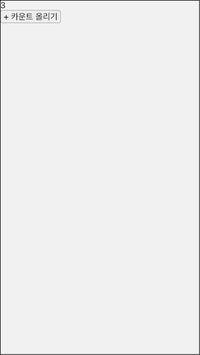

2편은 컨택스트, 고차 컴포넌트 등 리액트 고급 주제를 배운다. 이를 활용해 라우터, 다이얼로그를 만들며 실습 어플리케이션의 요구사항을 구현해 나갈 것이다.

2.1장에서는 컴포넌트 구성의 어려운 점을 짚은 뒤 이것을 리액트 컨택스트가 어떻게 해결할 수 있는지 알아 본다. 직접 만들면서 내부 구조를 이해하고 리액트 컨택스트 API 사용법도 살펴본다.

# 2.1.1 컴포넌트 구조의 한계

컴포넌트 계층 구조에서 부모-자식은 인자를 전달해 서로 협력한다. 컴포넌트끼리 접촉해 있어야만 이메세지를 전달하수 있는 구조다. 떨어져 있으면 메세지를 전달할 수 없다.

```jsx
<A>
  <B>
    <C>
```

컴포넌트 A와 B는 접해 있어 인자를 전달할 수 있다. B, C도 마찬가지. 반면 A, C는 떨어져 있어서 메세지를 전달할 수 없다. B 가 중간에 받아서 전달해 주어야 하는 구조다. 이것을 프롭 드릴링 현상이라고 한다.

프롭 드릴링의 문제

- 메세지 관리 어려움. 컴포넌트가 깊이 중첩 될수록 메세지 흐름 찾기 어려움.
- B는 A와 C 사이에 위치했다는 이유만으로 고유의 역할과 무관하게 메세지를 전달함.

예제에도 이런 모습을 예상할 수 있다. 장바구니 화면의 컴포넌트 트리는 이렇다.

```jsx
<App>
  <CartPage>
    <Page>
      <Title>
      <ProductItem>
      <OrderForm>
        <FormControl>
      <PaymentButton>
        <Button>
```

가령 App에 어플리케이션 테마를 관리하는 상태가 정의되어 있다고 하자. 라이트모드와 다크모드. 이 상태에 따라 버튼 색상이 달라진다고 하자.

Button은 트리의 맨 마지막에 위치하기 때문에 App의 테마 값을 받으려면 중간에 위치한 컴포넌트들을 통해 전달 받는다. CartPage나 Page는 관심사가 아니지만 자식 Button이 사용하기 때문에 테마 값을 전달해야한다.

App의 테마값을 Button 직접 알릴수 있는 방법은 없을까? 상위 컴포넌트의 상태가 변할 때 마다 관심있는 하위 컴포넌트에게 직접 알려줄 수 있으면 좋겠다. 중간에 관심사가 다른 컴포넌트에게 부탁할 필요도 없기 때문이다.

# 2.1.2 이벤트 에미터

App을 발신자, Button을 수신자라고 생각해 보자. 발신자가 수신자에게 메세지(테마값)를 전달해야하는 문제다. 이를 해결할 수 있는 패턴은 이벤트 에미터(Event emitter)이다.

두 객체 간의 메세지를 비교적 자유롭게 주고 받을 수 있는 통로 역할이다. 수신자가 특정 이벤트를 구독하면 이 통로를 통해 발신자가 보낸 이벤트를 받을 수 있다. 컴포넌트 간에 전달할 메세지를 이벤트 에미터에게 전달하면 구독하고 있는 컴포넌트는 이 메세지를 받을 수 있을 것이다.

인터페이스다.

- on(handler): 이벤트 핸들러 등록
- off(handler): 이벤트 핸들러 해지
- get: 이 객체가 갖고 있는 값을 조회하고
- set: 값을 설정한 뒤 각 구독 객체에게 전달한다.

shared/lib/EventEmitter.js 파일을 추가하고 이벤트 에미터 생성함수를 만들어 보자. 3편에서도 사용하기 위해 shared 폴더에 추가한다.

```js
const createEventEmitter = value => {
  let handlers = []

  const on = handler => handlers.push(handler)
  const off = handler => {
    handlers = handlers.filter(h => h !== handler)
  }

  const get = () => value
  const set = newValue => {
    value = newValue
    handlers.forEach(handler => handler(value))
  }

  return {
    on,
    off,
    get,
    set,
  }
}
```

이벤트 에미터가 전달할 메세지 value를 인자로 받았다. on은 이 값의 변경을 구독할 수 있는데 핸들러를 등록하고 off 는 구독 해지한다. get은 메세지를 조회하고 set은 새로운 메세지를 받아 저장하고 구독자들에게 알린다.

사용하면 구조 이해하는데 도움이 될 것이다.

```js
const eventEmitter = createEventEmitter(0)
const logger = value => console.log(value)
eventEmitter.on(logger)
eventEmitter.get() // 0
eventEmitter.set(1) // 1
eventEmitter.set(2) // 2
setTimeout(() => eventEmitter.set(3), 1000) // (1초 후에) 3
```

초기값 0으로 만든 이벤트 에미터 객체를 만들고 logger가 이를 구독했다. 현재값을 조회하면 0이고 set 함수를 호출할 때마다 logger에게 알릴 것이다. 중요한 것은 1초후에 set 함수를 호출해도 값을 로깅하는데 logger가 이벤트애미터를 구독하고 있기 때문이다.

콜백 함수 logger가 이벤트 에미터를 구독한 것처럼 컴포넌트가 구독할 무언가를 만들어 보자.

# 2.1.3 컨택스트

컴포넌트가 구독할 대상을 컨택스트라고 부르자. 컨택스트를 만드는 createContext라는 함수를 만들겠다. src/lib/MyReact.js 파일을 만든다.

```js{1,5,7}
const MyReact = (function () {
  function createContext(initialValue) {
    const emitter = createEventEmitter(initialValue)

    const Provider = ({ value, children }) => <>{children}</>

    const Consumer = ({ children }) => <>{children(emitter.get())}</>

    return {
      Provider,
      Consumer,
    }
  }

  return {
    createContext,
  }
})()
```

createContext는 컨택스트 초기 값을 인자로 받아 컨택스트 객체를 만드는 함수다. 이 인자로 이벤트 에미터를 만들었다. 프로바이더(Provider)와 컨슈머(Consumer) 컴포넌트를 만들었는데 이벤트 에미터를 통해 메세지를 공급하고 소비하는 컴포넌트다. 실제 구현은 좀 나중으로 미뤘다.

사용하면 구조 이해하는데 도움이 될 것이다.

```js
const countContext = MyReact.createContext({
  count: 0,
  setCount: () => {},
})
```

카운트 컨택스트를 만들었다. 카운트 값과 세터가 기본 값이다.

컨택스트에게 메세지를 전달할 카운터 프로바이더 컴포넌트를 만들자.

```js{1,10-13,15}
class CountProvider extends React.Component {
  constructor(props) {
    super(props)
    this.state = {
      count: 0,
    }
  }

  render() {
    const value = {
      count: this.state.count,
      setCount: nextValue => this.setState({ count: nextValue }),
    }
    return (
      <countContext.Provider value={value}>{children}</countContext.Provider>
    )
  }
}
```

초기값 0인 count 상태를 추가했다. 이 값을 컨택스트로 전달할 것이다.

렌더 메소드에서는 이 값을 포함해 세터함수를 정의해 value를 만들었다. 카운터 컨택스트의 초기값과 같은 인터페이스다. 렌더 메소드는 카운터 컨택스트의 프로바이터 컴포넌트를 반환하는데 value를 전달했다. 나머지 자식 컴포넌트는 프로바이더 안에서 렌더링될 것이다.

카운터 프로바이더를 만들면 하위의 컴포넌트는 카운터 컨택스트를 통해서 프로바이더가 제공한 value의 값을 언제라도 사용할 수 있다.

카운터 값을 표시하는 Count 컴포넌트를 만들어 보자.

```jsx
const Count = () => (
  <countContext.Consumer>
    {value => <div>{value.count}</div>}
  </countContext.Consumer>
)
```

카운터 컨택스트의 컨슈머 컴포넌트를 사용했다. 컨슈머 컴포넌트는 children 인자가 렌더 프롭이기 때문에 리액트 앨리먼트를 반환하는 함수 형태로 자식 컴포넌트를 정의 했다. 컨슈머는 프로바이더가 컨택스를 통해 전달한 값을 value 인자로 제공 받을 수 있다. 그 값 중 카운트를 표시할 것이다.

카운터를 올리는 버튼을 만들어 보자.

```jsx
const PlusButton = () => (
  <countContext.Consumer>
    {({ count, setCount }) => (
      <button onClick={() => setCount(count + 1)}>+ 카운트 올리기</button>
    )}
  </countContext.Consumer>
)
```

컨슈머 컴포넌트를 사용하고 리액트 앨리먼트를 반환하는 함수를 자식으로 정의했다. 컨택스트를 통해 value인자를 받는데 여기서는 setCount 함수를 호출해 카운트 값을 하나 올렸다.

카운트 컨택스트를 통해 전달된 setCount 함수가 호출되면 이를 제공하는 카운트 프로바이더의 setState가 호출한다. 프로바이더 컴포넌트의 상태가 변경되기 때문에 하위 컴포넌트는 리렌더링될 것이다. 그 중 카운트 컴포넌트는 다시 그려지면서 갱신된 count를 받아 리액트 앨리먼트를 그리기 때문에 증가된 값을 표시할 것이다.

```jsx
const App = () => (
  <CountProvider>
    <Count />
    <PlusButton />
  </CountProvider>
)
```

컨택스트를 이용한 컴포넌트 트리는 이런 모습이다.

```jsx
<App>
  <CountProvider>
    <Provider>
      <Count>
        <Consumer>
      <PlusButton>
        <Consumer>
```

컴포넌트간에는 아무런 메세지도 직접 전달하지 않는다. CountProvider 메세지를 제공하고 Count와 PlusButton는 이 메세지를 사용할 것이다.

아직 동작하지는 않는다. Provider가 컨택스트 값을 제공하지 않기 때문이다. CounterProvider가 Provider에게 value를 전달하지만 MyReact의 Provider 안에서는 아무것도 하지 않는다. 이 값이 바뀔 경우 리액트 컴포넌트를 리렌더해야하는 과제도 남았다. 컨택스트 값의 변화를 이벤트 에미터가 전달할하여 각 Consumer 컴포넌트가 인지하고 리렌더링 하도록 해야한다.

# 2.1.4 프로바이더와 컨슈머

컴포넌트가 리렌더링되려면 컴포넌트 상태나 인자가 변경 되어야 한다.

Provider와 Consumer를 다시 살펴보자.

```jsx
const Provider = ({ value, children }) => <>{children}</>
const Consumer = ({ children }) => <>{children(emitter.get())}</>
```

이벤트 에미터에서 값을 가져오기만했지 값의 변화를 전파하지는 않았다. 이 값이 리액트 상태로 관리되고 이벤트 에미터가 관리하는 값의 변화를 이 상태와 동기화 해야할 것이다.

Provider 컴포넌트를 변경하자.

```jsx{3,7}
class Provider extends Component {
  componentDidMount() {
    emitter.set(this.props.value)
  }

  componentDidUpdate() {
    emitter.set(this.props.value)
  }

  render() {
    return <>{this.props.children}</>
  }
}
```

컴포넌트가 마운트되거나 value가 바뀌어 컴포넌트를 업데이트 때마다 이를 이벤트 에미터에게 알린다. 메세지를 받은 이벤트 에미터는 내부 value를 새로운 메세지로 바꾼뒤 핸들러 함수를 모두 실행해 구독하고 있는 객체들에게 이 값을 알릴 것이다.

Consumer 컴포넌트를 변경하자.

```jsx{1,5,10,15,19}
class Consumer extends React.Component {
  constructor(props) {
    super(props)
    this.state = {
      value: emitter.get(),
    }
    this.setValue = this.setValue.bind(this)
  }

  setValue(nextValue) {
    this.setState({ value: nextValue })
  }

  componentDidMount() {
    emitter.on(this.setValue)
  }

  componentWillUnmount() {
    emitter.off(this.setValue)
  }

  render() {
    return <>{this.props.children(this.state.value)}</>
  }
}
```

컨슈머는 내부 상태 value를 두어서 여기에 이벤트 에미터가 전달한 값을 저장해 두었다. setValue 메소드는 값을 받아서 상태를 갱신하는데 컴포넌트가 마운트될 때 이벤트 에미터의 구독 함수로 전달했다. 컴포넌트가 언마운트될때 이 함수는 이벤트 에미터에서 제거 될 것이다.

컨슈머는 렌더 프롭을 인자로 받아서 children이 함수 형태로 전달 될 것이다. 이 함수 인자로 이벤트 에미터가 가진 상태 값을 저장해둔 value 상태를 전달해 준다.



# 2.1.5 컨택스트 활용

떨어진 두 개의 컴포넌트가 서로 메세지를 주고받을 수 있는 통로로서 컨택스트를 사용할 수 있다. 두 컴포넌트는 인자를 직접 전달하지 않아도 서로 메세지를 주고 받을 수 있게 된다.

폴리필 코드를 참고해 만든 컨택스트는 내부에 이벤트 에미터를 사용한다. 컨택스트는 이벤트 에미터를 통해 데이터를 전달하는데 이때마다 리액트 렌더 사이클을 돌리는 것이 특별하다.

프로바이더는 인자가 변경될 때마다 이벤트 에미터에게 값을 전달할 것이다. 컨슈머는 마운트 시점에 이벤트 에미터를 구독하는데 프로바이더가 전달하는 값을 받을 수 있다. 이 때 리랜더를 위해 받을 값으로 상태를 갱신한다. 리액트는 컨슈머 컴포넌트를 다실 렌더링 할 것이다.

이러한 컨택스트를 활용하는 방법은 뭐가 있을까? 앞으로 라우터와 다이얼로그를 만들면서 자세히 살펴볼 예정이다.

멀린 떨어진 컨포넌트간에 메세지를 전달할 때 컨택스트만 있는 것은 아니다. 오히려 컨택스를 사용하기 전에 먼저 고려해볼 후보가 있다. 컴포넌트 합성, 렌더 프롭을 사용하는 것이 오히려 더 간단한 해법일 수([context를 사용하기 전에 고려할 것](https://ko.legacy.reactjs.org/docs/context.html#before-you-use-context)) 있으니 이점을 유의하길 바란다.

# 중간 정리

컨택스트가 해결할 수 있는 문제를 이해했다.

- 인접한 컴포넌트 간에만 인자를 전달할수 있는 구조.
- 컴포넌트가 멀리 떨어져 있다면 중간 컴포넌트들이 전달해야.
- 중간 컴포넌트 없이 비교적 직접 전달할 수 있는 방법이 리액트 컨택스트.

createContext

- 멀리 떨어진 객체 간에 메세지를 전달하기 위해 이벤트 구독 패턴을 사용.
- 이벤트 에미터와 이를 활용한 createContext을 만듬.

컨택스트를 만들고 Provider와 Consumer 컴포넌트를 사용.

- Provider: 메세지 제공자. 리액트 렌더 사이클과 연동하기 위해 상태를 가짐.
- Consumer: 이 상태를 구독할수 있는 컴포넌트. 이 값이 렌더 프롬의 함수 인자로 들어옴.
- Provider 하위에 Consumer를 사용하기만하면 멀리있는 컴포넌트의 메세지를 구독할 수 있음.

컨택스트는 리액트의 기본 api이다. 여기서는 배경과 구조를 이해할 목적으로 직접 구현해본 것이다. 이제부터는 리액트 api의 createContext를 사용해 볼것이다.

참고

- [리액트 컨텍스트 | 김정환 블로그](/dev/2021/05/05/react-context.html)
- [React context 폴리필 | Github](https://github.com/jamiebuilds/create-react-context)
