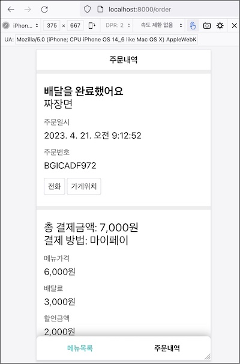
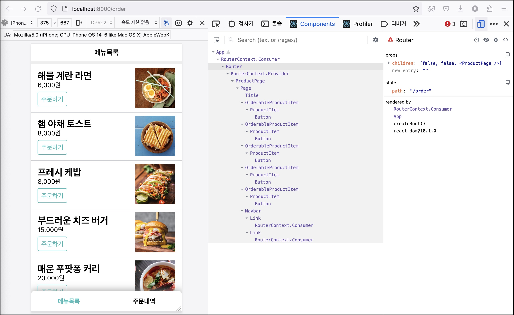
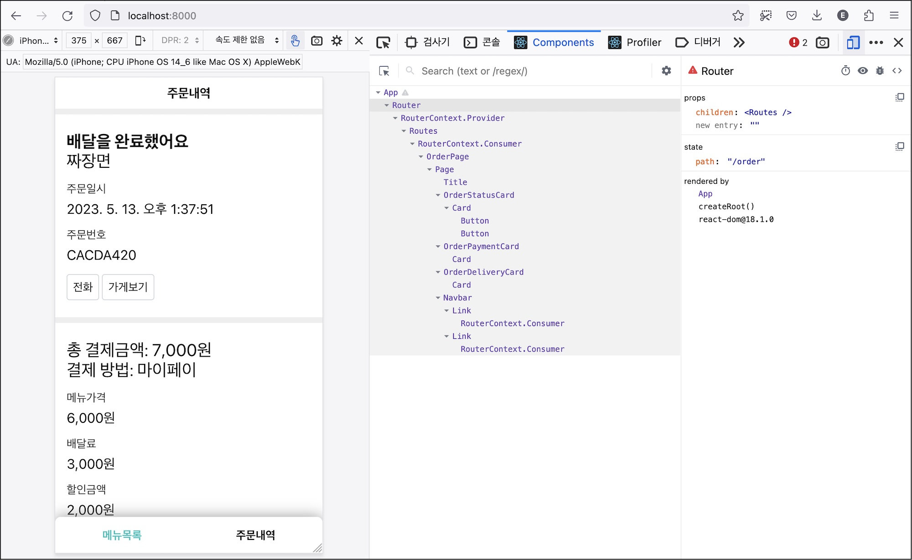

리액트 컨택스트의 첫 번째 활용으로 라우터를 만들어 보겠다. 요구사항 중 네비게이션 기능을 구현할 목적이다.

# 배경

요구사항

- 0.3 네비게이션바: 현재 화면과 같은 링크를 선택한다. (UI, 라우팅)
- 1.3 주문하기 버튼을 클릭하면 해당 상품을 담고 장바구니 화면으로 이동한다. (네비게이션)
- 2.8 결제 성공 후 주문내역 화면으로 이동한다. (네비게이션)

화면 세 개를 만들었지만 지금은 하나만 보인다. ProductPage, CartPage, OrderPage 중 하나만 어플리케이션 최상단 컴포넌트인 App에서 사용하기 때문이다.

요구사항에 따르면 각 화면을 이동할 수 있어야 한다(요구사항 1.3, 2.8). 지금처럼 하나의 컴포넌트만 렌더하는 것이 아니라 어떤 기준에 따라 컴포넌트를 렌더하는 것이다.

이 기준을 **주소**로 정하자. 주소에 따라 컴포넌트를 렌더하는 것이다. /login 주소로 요청하면 로그인 화면을 제공하고 /signup 주소료 요청하면 회원가입 화면을 제공하는 식이다.

주소에 따라 페이지를 제공하는 것을 **라우팅**이라고 한다. 웹 어플리케이션에서 라우팅은 필수 기능이다. 그렇지 안으면 한 가지 화면만 제공하기 때문이다.

일반적으로 라우팅은 웹서버의 역할이다. 클라이언트에서 특정 주소를 웹서버에게 요청하면 서버는 이에 맞는 화면을 클라이언트에게 제공하는 것이다.

클라이언트에게 라우팅 역할을 맞길 수도 있다. 웹서버가 항상 같은 리소스를 제공하고 브라우져가 이 리소스를 바탕으로 요청 주소에 따라 화면을 렌더하는 방식이다. 리액트라면 주소에 따라 컴포넌트를 렌더할 것이다.

이것을 **싱글페이지 어플리케이션**이라고 하는데 프론트엔드에서 라우팅을 지원해야 가능하다. 브라우져에는 주소 관리용 히스토리 API가 있는데 이를 활용해 주소를 관리할 수 있다. 이 장에서는 브라우저 히스토리 API와 리액트를 이용해서 어플리케이션에 라우팅 기능을 만들겠다. 이후 이 라우터를 기반으로 네비게이션 요구사항까지 구현하겠다.

# 경로에 따라 컴포넌트 렌더

단순하게 생각하면 요청 경로에 따라 다른 컴포넌트를 그리면 되겠다.

```jsx
const App = () => {
  const { pathname } = window.location

  return (
    <>
      {pathname === "/cart" && <CartPage />}
      {pathname === "/order" && <OrderPage />}
      {!["/cart", "/order"].includes(pathname) && <ProductPage />}
    </>
  )
}
```

location.pathname을 기준으로 컴포넌트를 렌더했다.

- /cart 요청: CartPage
- /order 요청: OrderPage
- 나머지 요청: MenuPage

# 서버 설정

상품목록 화면을 제외하고는 제대로 그리지 못할 것이다. 웹팩 개발 서버가 다른 라우팅에 대해서 적절한 리소스를 못찾기 때문이다. 배경에서 언급했듯이 브라우져에서 라우팅 역할을 가져가려면 서버는 모든 요청에 대해 같은 리소스를 제공해야한다.

실습에서 사용하는 것은 웹팩 개발서버인데 단일페이지 어플리케이션을 지원하려면 devServer.historyApiFallback 옵션을 사용해야 한다. 404(페이지 찾을 수 없음) 요청에 대해 index.html 문서를 응답하는 설정이다(참고: [devServer.historyApiFallback](https://webpack.js.org/configuration/dev-server/#devserverhistoryapifallback)).

```js{4}
devServer: {
  static: path.resolve(__dirname, "public"),
  port: process.env.PORT,
  historyApiFallback: true,
}
```

서버는 브라우져 요청이 404라고 판단하면 public/index.html을 제공할 것이다. 이전에는 / 요청에만 이 파일을 제공했지만 이제는 /cart, /order 요청에도 같은 파일을 제공할 것이다.

이제 이 문서 위에서 실행되는 자바스크립트의 App 컴포넌트가 라우팅 역할을 맡을 것이다. 서버는 어떤 요청에도 index.html 파일만 제공하기 때문이다.

개발 서버를 다시 실행하고 /order 주소에 접속해 보자.



주문 내역 컴포넌트가 렌더링되었다.

--

하이퍼링크는 어떻게 동작할까? 뒤로가기 링크가 있는 장바구니 화면에 접속해 보자. 브라우져 주소창에 /cart를 입력한다. 좌측상단의 뒤로가기 버튼을 클릭하면 / 주소로 변경되고 메뉴 목록 화면으로 바뀐다.

여기서 하이퍼링크 동작을 자세히 살펴 보자.

- 링크를 클릭한다.
- 브라우져는 / 주소로 서버에 요청을 보낸다.
- 서버는 요청에 해당하는 문서를 브라우져에게 제공한다.
- 브라우져는 이 문서를 화면에 렌더한다.

어디서 라우팅을 수행하는가? 웹팩 개발서버다. 브라우져는 / 요청을 그대로 서버로 전송하고 서버가 이 요청에 대한 문서인 index.html 제공했기 때문이다. 이 장의 목적은 **브라우저에서 라우팅** 기능을 만드는 것이다.

# Link

브라우저가 하이퍼링크를 처리하는 기본 동작이 href 값을 서버로 요청하는 것이다. 이 요청을 전달하기 전에 어플리케이션에서 라우팅해야 한다. 먼저 링크에 대한 브라우저의 기본 동작을 막는 컴포넌트를 준비하자.

lib/MyRouter.jsx 파일을 만들자.

```jsx
const Link = ({ to, ...rest }) => {
  const handleClick = e => {
    e.preventDefault()
  }

  return <a {...rest} href={to} onClick={handleClick} />
}
```

Link는 이동할 주소(to)를 받아 a 앨리먼트의 href 속성 값으로 전달해 반환한다. 링크를 클릭했을 때 서버로 요청을 보내지 않도록 handleClick에서 이벤트 객체의 preventDefault() 함수를 사용했다.

기존의 a태그를 Link로 교체한다.

```jsx{5}
const Title = ({ backUrl = false, children }) => {
  if (backUrl) {
    return (
      <>
        <MyRouter.Link to={backUrl} />
        <h1 style={{ paddingRight: "44px" }}>{children}</h1>
        {/* ... */}
```

```jsx{3-6}
const Navbar = () => (
  <nav className="Navbar">
    <MyRouter.Link className="active" to="/">
      메뉴목록
    </MyRouter.Link>
    <MyRouter.Link to="/order">주문내역</MyRouter.Link>
  </nav>
)
```

이제 링크를 클릭해도 서버에 요청하지 않을 것이다. 이 요청을 스스로 처리해야 한다.

# Router

브라우져 기본 동작을 취소하면서 두 가지 숙제가 생겼다.

1. 컴포넌트 렌더링: 요청한 주소에 해당하는 컴포넌트 렌더링
1. 주소 변경: 요청한 주소를 브라우져 주소창에 표시

첫 번째 과제를 해결하기 위해 요청한 주소를 리액트 컴포넌트의 상태로 관리하겠다. 이 상태 변화를 통해 주소에 해당하는 컴포넌트를 렌더하려는 의도다.

lib/MyRouter.jsx에 Router 컴포넌트를 추가한다.

```jsx{1,4-6}
class Router extends React.Component {
  constructor(props) {
    super(props)
    this.state = {
      path: window.location.pathname,
    }
  }

  render() {
    return this.props.children
  }
}
```

주소값을 상태 path로 관리할 것이다. location.pathname을 초기값으로 사용했다. Router의 자식 컴포넌트가 이 상태에 따라 조건부 렌더링할 의도다.

자식 컴포넌트가 라우터 바로 아래 있다면 인자를 직접 전달하면 된다. 하지만 화면 구성에 따라 중첩 단계가 깊어질수도 있다. 가령 라우터 아래, 아래, 아래에 화면 컴포넌트가 위치할 수 있어서 상태 path를 프롭 드릴링으로 전달해야 할 것이다.

자식 컴포넌트의 중첩 단계를 예측할 수 없기 때문에 값을 직접 전달하는 방식은 코드 관리하기가 어렵다. 멀리 떨어진 객체에게 메세지를 전달하려면 리액트 컨택스트가 적당하다. 라우터 전용 컨택스트를 만들자.

```jsx
const routerContext = React.createContext({})
routerContext.displayName = "RouterContext"
```

리액트의 컨택스트 생성 api를 사용했다. Router의 상태 path와 이를 변경하는 세터를 전달하는 역할을 맡을 것이다.

컨택스트 객체의 displayName에 컨택스트 이름을 지정했다. 리액트 개발도구에서 노출될 이름인데 개발 편의를 위한 설정이다.

컨택스트를 통해 Router의 자식 컴포넌트에게 상태 path를 전달할 차례다.

```jsx{7,10,15-18,21}
class Router extends React.Component {
  constructor(props) {
    super(props)
    this.state = {
      path: window.location.pathname,
    }
    this.handleChangePath = this.handleChangePath.bind(this)
  }

  handleChangePath(path) {
    this.setState({ path })
  }

  render() {
    const contextValue = {
      path: this.state.path,
      changePath: this.handleChangePath,
    }

    return (
      <routerContext.Provider value={contextValue}>
        {this.props.children}
      </routerContext.Provider>
    )
  }
}
```

렌더 메소드에서 컨택스트의 프로바이더를 사용했다. 상태 path와 이를 변경하는 changePath로 구성된 객체를 만들어 전달했다. 이 컨택스트를 소비하는 객체는 경로를 조회하고 변경할 수 있을 것이다.

Link 컴포넌트가 컨택스트를 사용해 보자.

```jsx{2-3,6,10-11}
const Link = ({ to, ...rest }) => (
  <routerContext.Consumer>
    {({ path, changePath }) => {
      const handleClick = e => {
        e.preventDefault()
        if (to !== path) changePath(to)
      }

      return <a {...rest} href={to} onClick={handleClick} />
    }}
  </routerContext.Consumer>
)
```

라우터 컨택스트의 컨슈머 컴포넌트를 사용했다. children 인자가 렌더 프롭이기 때문에 함수를 사용했다. 이 함수 인자로 컨택스트가 전달한 값이 들어올 것이다.

하이퍼링크 클릭 핸들러 handleClick에서 이를 사용했다. Link가 변경하려는 값과 지금 라우터가 가리키는 현재 주소의 값이 다르면 경로를 변경한다.

요청 경로에 따라 페이지 컴포넌트를 변경하는 앱 컴포넌트도 수정해야한다. 윈도우 객체의 패스를 라우터 컨택스트의 상태로 교체하자.

```jsx{2-4,8-10}
const App = () => (
  <MyRouter.routerContext.Consumer>
    {({ path }) => (
      <MyRouter.Router>
        {path === "/cart" && <CartPage />}
        {path === "/order" && <OrderPage />}
        {!["/cart", "/order"].includes(path) && <ProductPage />}
      </MyRouter.Router>
    )}
  </MyRouter.routerContext.Consumer>
)
```

location.pathname의 값을 이용해 조건부 렌더링하던 부분을 컨택스트를 통해 전달된 path로 바꾸었다. 각 페이지 하위에 있는 Link를 클릭하면 컨택스트를 통해 제공된 chagePath 함수를 호출해 Router의 상태 path를 변경할 것이다.

메뉴목록 화면에서 하단의 주문내역 버튼을 클릭해 보자.



화면과 주소가 그대로다. 다만 컨택스트를 통해 바꾼 상태값만 변경되었다. 우측의 리액트 개발 도구를 보면 Router의 상태 path 값이 '/order'로 바뀌었다.

App 때문이다. 컨택스트 제공자가 Router이기 때문에 자식 컴포넌트만 컨택스트를 구독할 수 있다. App은 부모 컴포넌트라서 컨택스트 변화와 무관하다.

App의 조건부 렌더링 로직이 Router 하위에 위치하도록 바꾸어야 하겠다.

# Routes: 경로에 맞는 엘리먼트 찾기

당장 어떻게 해야할지 모르겠다. 이럴 땐 단순한 방식으로 가자. Routes란 컴포넌트를 만들고 여기에 조건부 렌더링 코드를 옮기자.

```jsx
const Routes = () => (
  <routerContext.Consumer>
    {({ path }) => (
      <>
        {path === "/cart" && <CartPage />}
        {path === "/order" && <OrderPage />}
        {!["/cart", "/order"].includes(path) && <ProductPage />}
      </>
    )}
  </routerContext.Consumer>
)
```

경로에 따라 엘리먼트를 라우트하는 로직들이 있으니깐 Routes란 이름이 그런대로 어울린다. Router는 App에 남겨두었다. Routes는 요청 경로에 따라 정해진 컴포넌트를 렌더링하는 역할이기 때문이다.

App의 모습이다.

```jsx{3}
const App = () => (
  <MyRouter.Router>
    <MyRouter.Routes />
  </MyRouter.Router>
)
```

이제는 제대로 동작할 것이다. 컨택스트 공급자인 Router 하위에 Routes가 위치하기 때문이다. Router의 상태 path가 변경되면 이를 사용하는 하위 컴포넌트는 리랜더 될 것이다. Link가 상태 path를 변경하면 리액트는 컴포넌트를 다시 그릴 것이다.



Routes로 분리하기는 했지만 찝찝한 부분이 있다. lib/MyRouter는 어디에서든지 사용 할 수 있어야 한다. 지금은 특정 요청에 대한 컴포넌트를 반환하는 로직까지 가지고 있다. 이 컴포넌트는 특정 상황에서만 사용하기 때문에 재사용할 수 없는 상태다.

도메인 로직을 제거해야 한다. 요청에 대해 컴포넌트를 반환하는 로직은 가지고 있되 특정 도메인 역할은 외부로 위임하자.

# Route: 라우팅 테이블

Routes가 세부 라우팅 정보를 가지고 있는 것이 문제다. 다른 어플리케이션에서 재사용할 수 없기 때문이다.

어플리케이션마다 라우팅 규칙이 다른데 이 정보를 일정한 형태로 정의해 두면 좋겠다. 이것을 라우팅이 표(Table)라고 부르자. Routes 컴포넌트는 이 표를 참고해 현재 요청한 경로에 해당하는 컴포넌트를 찾아낼 것이다.

라우팅 표를 만들어야한다. 요청 경로 path에 렌더할 엘리먼트가 쌍으로 있으면 좋겠다.

```jsx
/**
 * 사용 예
 * <MyRouter.Route path={'경로'} element={<리액트_앨리먼트 />} />
 */
const Route = () => null
```

Route를 to와 element로 구성된 라우팅 테이블로 사용했다. null을 반환하기 때문에 아무것도 렌더하지 않지만 데이터 저장소로서의 역할을 한다.

```js
props: {
  path: `경로`,
  element: { type: '리액트_앨리먼트', children }
}
```

리액트 컴포넌트의 이러한 특성을 활용하면 라우팅 표를 만들 수 있다.

```jsx{4-6}
const App = () => (
  <MyRouter.Router>
    <MyRouter.Routes>
      <MyRouter.Route path="/cart" element={<CartPage />} />
      <MyRouter.Route path="/order" element={<OrderPage />} />
      <MyRouter.Route path="/" element={<ProductPage />} />
    </MyRouter.Routes>
  </MyRouter.Router>
)
```

Routes에 있던 조건부 렌더링 로직을 다시 App으로 가져왔다. 다만 이를 자식 엘리먼트로 갖는 Routes는 children에 있는 라우팅 테이블에서 적당한 엘리먼트를 찾는 역할이 남았다.

```jsx
const Routes = ({ children }) => (
  <routerContext.Consumer>
    {({ path }) => {
      // 반환할 리액트 엘리먼트
      let selectedRoute = null

      React.Children.forEach(children, child => {
        // 리액트 엘리먼트인지 검사한다
        if (!React.isValidElement(child)) return

        // 프레그먼트인지 검사한다
        if (child.type === React.Fragment) return

        // Route 컴포넌트인지 검사한다. 덕 타이핑
        if (!child.props.path || !child.props.element) return

        // Route에 등록된 컴포넌트가 요청한 경로에 해당하는지 검사한다.
        // 요청 경로에서 쿼리 문자열을 제거하고 비교한다.
        if (child.props.path !== path.replace(/\?.*$/, "")) return

        // 엘리먼트를 찾았다.
        selectedRoute = child.props.element
      })

      return selectedRoute
    }}
  </routerContext.Consumer>
)
```

Routes는 자식으로 라우트 컴포넌트를 받아 경로에 해당하는 컴포넌트를 반환하는 것이 역할이다. 요청 경로는 Routers가 컨택스트를 통해 주입하기 때문에 라우터 컨택스트 컨슈머를 사용했다. 랜더 프롭의 인자로 전달될 것이다. 이 두 값을 비교해 Route에 정의된 컴포넌트를 반환하면 되겠다.

Routes의 자식이 Route가 아닐 수 있어서 방어코드를 미리 준비했다.

Router에 등록된 경로와 현재 라우터 상태와 비교해서 같을 경우 이 라우트 컴포넌트에 전달된 리액트 앨리먼트를 반환했다.

라우팅 관련 컴포넌트 구조는 다음과 같다.

```jsx
<App>
  <Router>
    <Routes>
      {/* 각 페이지 컴포넌트.  */}
      {/* Route 컴포넌트는 경로에 해당하는 앨리먼트를 지정했을 뿐 트리에는 없다. */}
```

# 중간 정리

라우팅에 대한 개념을 소개했다.

- 요청에 따른 페이지 제공
- 서버는 클라이언트의 요청에 따라 적절한 페이지 제공

서버 설정

- 브라우져에서도 라우팅 할 수
- 서버에서는 404 화면에 대해 항상 같은 리소를 제공
- 웹팩 개발서버 설정을 추가했다.

Link

- 브라우져에서 라우팅을 하려면 경로에 따라 다른 컴포넌트를 렌더
- 링크 전용 컴포넌트: 하이퍼링크 기본 동작 취소. 해당 컴포넌트를 렌더.

Router

- 요청 경로를 상태로 관리
- 어플리케이션 전반에 사용되고 컴포넌트 간에 자주 사용하기 때문에 리액트 컨택스트로 값을 제공

Routes

- 요청 경로에 따라 적절한 컴포넌트를 찾는 역할
- 이것은 하위에 있는 Route를 통해 얻을 수

Router는 어플리케이션 도메인과 무관하게 재사용할 수 있다. 이 장의 두 개 숙제 중 하나를 해결했다.

라우터 숙제

1. **~~컴포넌트 렌더링: 요청한 주소에 해당하는 컴포넌트 렌더링~~**
1. 주소 변경: 요청한 주소를 브라우져 주소창에 표시

--

네이게이션 요구사항을 다시 확인해 보자.

- 0.3 네비게이션바: 현재 화면과 같은 링크를 선택한다. (UI, 라우팅)
- 1.3 주문하기 버튼을 클릭하면 해당 상품을 담고 장바구니 화면으로 이동한다. (네비게이션)
- 2.8 결제 성공 후 주문내역 화면으로 이동한다. (네비게이션)

요청 주소에 따라 화면만 변경하는 수준이라서 하나도 하지 못했다.

다음 장에서 라우터 기능을 더 개발해 요구사항을 해결하자.

참고

- [리액트 라우터 만들기 | 김정환 블로그](/dev/2022/05/06/react-router.html)
- [react-router | Github](https://github.com/remix-run/react-router)
