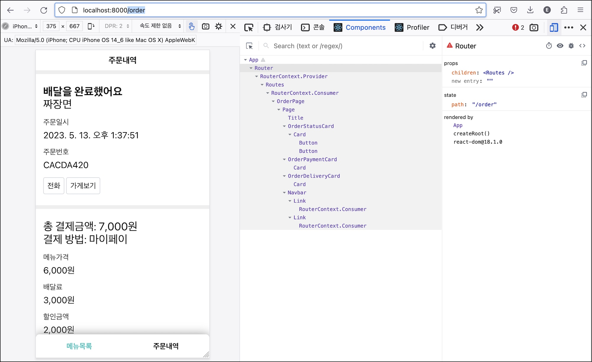
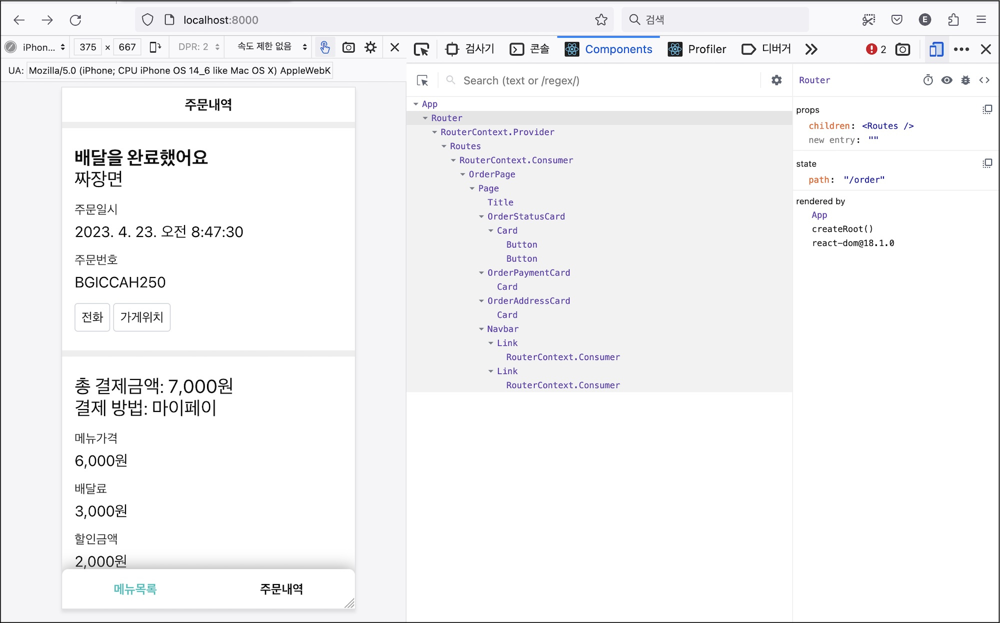
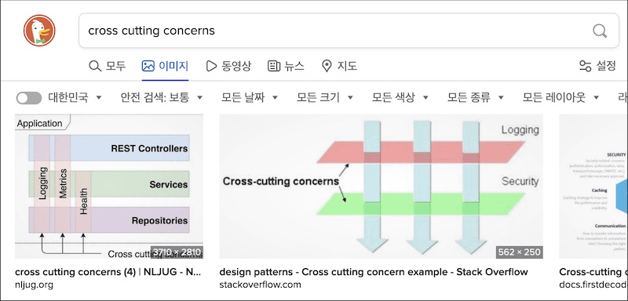
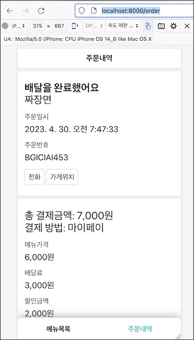
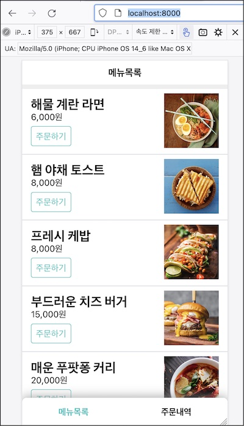
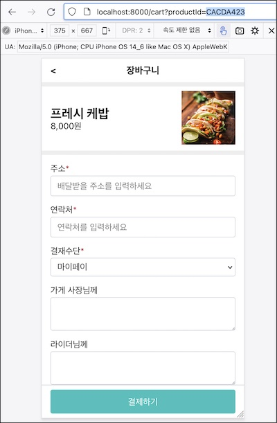
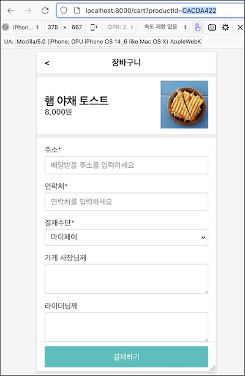

# 주소창 주소 변경하기

라우터 숙제

1. ~~컴포넌트 렌더링: 요청한 주소에 해당하는 컴포넌트 렌더링~~
1. 주소 변경: 요청한 주소를 브라우져 주소창에 표시

Link를 클릭하면 요청 주소에 해당하는 컴포넌트로 화면이 교체되지만 브라우져 주소창의 값은 그대로 남아 있다. 브라우저는 하이퍼링크를 클릭하면 브라우져 주소창의 값을 요청 주소로 바꾸는데 Link가 기본 동작을 취소했기 때문이다.

브라우져 히스토리(history) 객체는 주소 관리 기능을 제공한다.

> DOM의 Window 객체는 history 객체를 통해 브라우저의 세션 기록에 접근할 수 있는 방법을 제공합니다. history는 사용자를 자신의 방문 기록 앞과 뒤로 보내고 기록 스택의 콘텐츠도 조작할 수 있는, 유용한 메서드와 속성을 가집니다. - 출처: MDN

이 중 [pushState](https://developer.mozilla.org/ko/docs/Web/API/History/pushState)는 브라우져의 방문 기록을 저장소에 추가하는 함수다. 주소를 바꿀 때 여기에 값을 넣으면 방문 기록이 하나 생긴다. 브라우져 주소창 값도 변경된다.

Router의 path 변경 핸들러에 다음 코드를 추가해 보자.

```jsx{5}
class Router extends React.Component {
  // ...
  handleChangePath(path) {
    this.setState({ path })
    window.history.pushState("", "", path)
  }
  // ...
}
```

라우터 컨택스트에 전달할 handleChangePath 메소드에서 상태 변경에 이어 history api를 사용했다. setState가 상태를 변경했다면 pushState는 브라우저에 방문 기록을 추가하는 코드다. 이제 브라우져 주소가 바뀔 것이다.



메뉴 목록(/) 화면에서 하단의 주문내역을 클릭하면 화면과 더불어 브라우져 주소창의 주소도 바뀌었다.

# 뒤/앞으로 가기

브라우져의 뒤로 가기 버튼을 눌러보자.



주소는 바뀌었지만 화면은 그대로다.

pushState 함수를 사용할 때 첫 번째 인자에 빈 문자열만 전달했는데 사실은 state(리액트 상태와 무관)를 전달하는 용도다.

> 새로운 세션 기록 항목에 연결할 상태 객체. 사용자가 새로운 상태로 이동할 때마다 popstate 이벤트가 발생하는데, 이 때 이벤트 객체의 state 속성에 해당 상태의 복제본이 담겨 있습니다. 상태 객체는 직렬화 가능한 객체라면 모두 가능합니다. - 출처: MDN

pushState를 호출할 때 state에 어떤 값을 전달하면 스택에 저장해 둘 수 있다고 한다. 브라우저는 새로운 상태로 이동, 즉 뒤로 가기나 앞으로 가기 버튼을 누를 때마다 이 이벤트를 발생시킨다. 이 때 스택에 저장해둔 state 값을 꺼내 사용하는 구조이다. 이 이벤트의 이름은 popstate다.

pushState를 호출할 때 이동할 경로 path를 저장해 두면 좋겠다. popstate 이벤트가 발생할 때 이 값을 꺼내 해당 컴포넌트로 교체할 의도다. 화면을 직접 그리는 것은 아니고 Router의 상태 path를 이 값으로 바꾸면 리액트가 다시 렌더할 것이다.

Router를 고치자.

```jsx{4,9,11-15,18,22}
export class Router extends React.Component {
  constructor(props) {
    // ...
    this.handleOnpopstate = this.handleOnpopstate.bind(this);
  }

  handleChangePath(path) {
    this.setState({ path });
    window.history.pushState({ path }, "", path);
  }

  handleOnpopstate(event) {
    const nextPath = (event.state && event.state.path) || "/"
    this.setState({ path: nextPath });
  }

  componentDidMount() {
    window.addEventListener("popstate", this.handleOnpopstate);
  }

  componentWillUnmount() {
    window.removeEventListener("popstate", this.handleOnpopstate);
  }
  // ...
```

컴포넌트 마운트 후에 popstate 이벤트 핸들러 handleOnpopstate를 등록했다. 브라우져가 새로운 상태로 이동할 때마다 호출될 것이다. 이 이벤트를 통해 방문 기록에 저장해 둔 주소 값을 찾을 수 있고 이 값으로 상태 path를 갱신한다.

브라우저의 뒤/앞으로 가기 버튼을 클릭하면 주소 뿐만 아니라 화면도 함께 바뀔 것이다.

컴포넌트가 언마운트되면 이벤트 핸들러를 제거한다.

라우터 숙제

1. ~~컴포넌트 렌더링: 요청한 주소에 해당하는 컴포넌트 렌더링~~
1. **~~주소 변경: 요청한 주소를 브라우져 주소창에 표시~~**

# 프로그래밍적으로 주소 변경

요구사항을 보면 버튼을 클릭한 뒤에 주소를 이동하는 경우가 있다.

요구사항

- 0.3 네비게이션바: 현재 화면과 같은 링크를 선택한다. (UI, 라우팅)
- **1.3 주문하기 버튼을 클릭하면 해당 상품을 담고 장바구니 화면으로 이동한다. (네비게이션)**
- **2.8 결제 성공 후 주문내역 화면으로 이동한다. (네비게이션)**

분기문에서 라우터 표를 사용한 방식은 의미있는 개선이다. 분기문보다 잘 읽히고변경하기 쉽기 때문이다.

한계도 있다. '버튼을 클릭하면 특정 주소로 이동해'라는 요구사항을 구현하려면 주소를 직접 변경할 수 있어야 한다.

요구사항 1.3을 해결하기 위해 주문하기 버튼이 있는 OrderableProdcutItem을 보자. 컴포넌트 안에 주문하기 버튼이 있고 클릭하면 장바구니 화면의 주소로 이동해야 한다.

```jsx{2,3,5,9,10}
const OrderableProductItem = ({ product }) => (
  <MyRouter.routerContext.Consumer>
    {({ changePath }) => {
      const handleClick = () => {
        changePath(`/cart?productId=${product.id}`)
      }

      return <ProductItem product={product} onClick={handleClick} />
    }}
  </MyRouter.routerContext.Consumer>
)
```

컨택스트가 제공한 changePath 함수를 사용했다. Router의 상태 path를 변경하면 이 경로에 해당하는 컴포넌트로 대체되어 컴포넌트가 다시 그려지고 주소도 전달한 값으로 변경할 것이다.

이러한 코드는 어플리케이션 전반에 걸쳐 사용될 것이다. 장바구니 화면에서 결제 완료 후 주문내역 페이지로 이동하기 때문이다. 다음 절에서 고차 컴포넌트에 대해 알아보고 페이지 이동 기능을 범용으로 만들어 보겠다.

# 고차 컴포넌트

고차 컴포넌트는 횡단 관심사를 분리하는데 사용한다고 표현한다.

> 횡단 관심사(Cross-Cutting Concerns)에 고차 컴포넌트 사용하기 - 고차 컴포넌트 | 리액트 공식문서

횡단 관심사란 뭘까? 반대말은 종단 관심사일까? 원문으로는 "Cross-Cutting concern"이라고 한다.

> crosscut: <물건을> 가로지르다; <장소 등을> 횡단하다. - 출처: 뉴에이스 영한사전

어떤 것을 가로지르는 관심사다.

소프트웨어는 계층 구조로 구성하는 것이 일반적이다. 대표적인 것이 OSI 7 계층이다. 백엔드 어플리케이션은 컨트롤러 - 서비스 - 레포지터리와 같은 계층으로 구성한다. 마찬가지로 클라이언트 어플리케이션도 계층을 구성한다.

```jsx
<App>
  <Router>
    <Container>
      <Page>
```

- App: 전체 어플리케이션을 담당
- Router: 브라우져 요청에 따라 컴포넌트 렌더 담당
- Container: UI 렌더에 필요한 데이터 처리 담당
- Page: UI 렌더 담당

이처럼 어플리케이션은 계층으로 분리하지만 모든 기능을 완벽하게 분리하는 것이 어렵다. 가령 컨테이너에서 주소 정보가 필요하다. 페이지에 전달할 데이터를 조회하기위한 api를 호출하는데 주소에 api 호출 값이 있기 때문이다. 페이지 컴포넌트에서도 다른 페이지로 이동하기 위해 주소 정보가 필요하다. 두 계층 모두 주소 정보를 사용하기 때문에 중복 코드를 만들 수 있다.

이처럼 각 계층을 넘어 공통으로 필요한 관심사가 있는데 이를 **횡단 관심사**, Cross-Cutting concerns라고 표현한다.

그림으로보면 더 쉽게 이해할 수 있다.



**어플리케이션 각 계층에서 공통으로 필요한 문제**를 횡단 관심사라고 정리할 수 있다. **고차 컴포넌트**는 이런 공통의 기능을 해결하는 컴포넌트 역할이다.

서버 어플리케이션의 로깅, 인증이 횡단 관심사라면 클라이언트 어플리케이션에서는 뭐가 있을까? 주소 관리나 전역 스토어 혹은 클라이언트에서 로깅한다면 이것도 공통 관심사다.

로깅 예제를 통해 고차 컴포넌트에 대해 알아보자. 컴포넌트가 얼마나 사용되는지 기록하는 기능이다.

- 컴포넌트가 마운트 될 때 기록한다.
- 버튼 컴포넌트를 클릭할 때 기록한다.

로딩하는 헤더 컴포넌트를 만들자.

```jsx{3}
class Header extends React.Component {
  componentDidMount() {
    console.log("[Header] 마운트")
  }

  render() {
    return <header>Header</header>
  }
}
```

헤더가 돔에 마운트되면 양식에 맞추어 로그를 남긴다. 편의상 브라우저에 남기는 것으로 했다.

버튼 컴포넌트도 만들자.

```jsx{3,7}
class Button extends React.Component {
  componentDidMount() {
    console.log('[Button] 마운트‘);
  }

  handleClick = () => {
    console.log('[Button] 클릭’)
  }

  render() {
    return <button onClick={handleClick}>버튼</button>
  }
}
```

마운트 뿐만 아니라 버튼을 클릭할 때도 로깅했다.

여기는 **두 가지 문제**가 있다.

중복 코드. 컴포넌트가 마운트 되었을 때 로그를 남기는 코드다. 같은 생명주기 메서드를 사용하고 같은 로그 기록 함수를 호출한다.

로깅이 각 컴포넌트 고유의 역할이 아니라는 것도 문제다. 헤더와 버튼은 각 각 헤더 영역을 렌더링하고 클릭할 수 있는 버튼을 렌더하는 것만을 책임진다. 로깅하는 방법까지 알 필요는 없다.

이 기능은 어플리케이션 전반에 사용되는 공통 기능이다. 어떻게 고차 컴포넌트로 해결할 수 있을까?

컴포넌트에 횡단 관심사를 주입하는 함수를 만들겠다. 고차 컴포넌트 이름 관례에 따라 with로 시작하는 함수를 만들었다.

```jsx{1,2,6,8,9,13,17}
const withLogging = WrappedComponent => {
  function log(message) {
    console.log(`[${getComponentName(WrappedComponent)}] ${message}`)
  }

  class WithLogging extends React.Component {
    render() {
      const enhancedProps = { log }
      return <WrappedComponent {...this.props} {...enhancedProps} />
    }

    componentDidMount() {
      log('마운트‘)
    }
  }

  return WithLogging;
}
```

withLogging은 컴포넌트를 받아 컴포넌트를 반환하는 함수다. 함수를 받아 함수를 반환하는 것을 고차함수(High Order Function)라고 하듯이 이것을 고차 컴포넌트(High Order Component, HOC)라고 부른다.

이 함수는 인자로 받은 WrappedComponent를 내부에서 만든 WithLogging 컴포넌트에서 사용한다. 단순히 래핑한 정도로 보일지 모를테지만 본연의 역할이 있다. 바로 enhancedProps를 대상 컴포넌트에 주입하는 것이다.

enhancedProps는 렌더 함수에서 생성한 객체인데 컴포넌트에 추가할 횡단관심사들의 묶음이다. 여기서는 컴포넌트에서 사용할 log 함수를 주입했다.

컴포넌트 이름을 얻는 유틸리티 함수는 src/lib/utils.js 파일에 정의했다.

```js
const getComponentName = ({ displayName, name }) =>
  displayName || name || "Component"
```

withLogging을 이용해 컴포넌트를 다시 작성해 보자.

```jsx{4,8,9}
const Header = () => <header>헤더</header>

const Button = ({ log }) => {
  const handleClick = () => log('클릭’)
  return <button onClick={handleClick}>버튼</button>
}

const EhandcedHeader = withLogging(Header)
const EnahncedButton = withLogging(Button)
```

헤더와 버튼 코드가 비교적 단순하게 바뀌었다. 로깅 기능이 모두 withLogging으로 빠졌기 때문이다. 컴포넌트 본연의 기능만 남고 어플리케이션 공통의 기능을 고차 컴포넌트로 옮긴 셈이다.

withLogging으로 래핑한 Header와 Button은 EnchanedHeader와 EnhancedButton으로 다시 태어났다. 컴포넌트가 마운트되면 자동으로 로그를 남길 것이다. 헤더와 버튼은 본연의 역할을 수행하는 코드만 가지고 있고 withLogging이라는 고차 컴포넌트를 통해 요구사항에 맞는 컴포넌트가 될 수 있는 것이다.

Button 컴포넌트는 인자를 통해 로그 함수를 사용할 수 있다. withLogging으로 기능을 강화했기 때문이다. 버튼을 클릭하면 log 함수를 사용해 로그를 남길 수 있을 것이다.

# withRouter와 navigate

이전 절에서 학습한 고차 컴포넌트 패턴을 활용할 차례다. 라우트 기능을 어플리케이션 전반에 사용할 수 있도록 고차 컴포넌트로 분리하겠다. 네이밍 관례에 따라 withRouter란 고차 컴포넌트를 만들어 보겠다.

```jsx{1,2,5,9,12,16}
const withRouter = WrappedComponent => {
  const WithRouter = props => (
    <routerContext.Consumer>
      {({ path, changePath }) => {
        const navigate = nextPath => {
          if (path !== nextPath) changePath(nextPath)
        }

        const enhancedProps = {
          navigate,
        }
        return <WrappedComponent {...props} {...enhancedProps} />
      }}
    </routerContext.Consumer>
  )
  WithRouter.displayName = `WithRouter(${getComponentName(WrappedComponent)})`
  return WithRouter
}
```

라우터 기능을 추가할 대상 컴포넌트를 WrappedComponent 인자로 받았다.

WithRouter 대상 컴포넌트에게 라우터 기능을 제공할 고차 컴포넌트가 될 것이다. 라우터 컨택스트의 기능을 사용하기 위해 라우터 컨택스트를 사용했다.

WithRouter 안에 navigate 함수를 정의했다. 이동할 경로를 인자로 받아 이동하기 위해 컨택스트의 path 상태를 변경하는 역할을 담당한다.

타겟 컴포넌트에 들어올 인자와 더불어 navigate 함수를 컴포넌트에 전달했다. WrappedComponent는 navigate 함수를 사용해 프로그래밍적으로 주소를 변경할 수 있을 것이다.

컴포넌트 이름을 지정하려고 displayName 속성에 값을 설정했다. 리액트 개발툴에서 고차 컴포넌트를 쉽게 식별할 수 있다.

주소 이동 기능을 타켓 컴포넌트에 주입할 수 있는 WithRouter를 반환했다.

이제 사용해 보자.

```jsx{1,3,7}
const OrderableProductItem = ({ product, navigate }) => {
  const handleClick = () => {
    navigate(`/cart`)
  }
  return <MenuItem product={this.props.product} onClick={handleClick} />
}
MyRouter.withRouter(OrderableProductItem)
```

withRouter로 OrderableProductItem에 라우터 기능을 제공했다.

컴포넌트 인자에 navigate 함수가 추가되었을 것이다. 이 함수로 라우터 컨택스트의 path를 직접 프로그래밍적으로 변경할 수 있다. 링크 컴포넌트로 선언적 주소 이동을 했던 방식과 비교해 보라.

장바구니 화면에서 결제 성공 후 주문 내역화면으로 이동하는 부분도 이 함수를 사용할 수 있다.

```jsx{8,11}
class CartPage extends React.Component {
// ...
  handleSubmt(values) {
    console.log(values);

    // TODO: 결제 성공후

    this.props.navigate("/order");
  }
// ...
MyRouter.withRouter(CartPage);
```

요구사항

- 0.3 네비게이션바: 현재 화면과 같은 링크를 선택한다. (UI, 라우팅)
- **~~1.3 주문하기 버튼을 클릭하면 해당 상품을 담고 장바구니 화면으로 이동한다. (네비게이션)~~**
- **~~2.8 결제 성공 후 주문내역 화면으로 이동한다. (네비게이션)~~**

# match

요구사항 0.3은 현재 화면에 해당하는 링크를 선택된 것으로 표시해야한다. 화면은 주소로 식별할 수 있다.

- 메뉴 목록화면: /
- 장바구니 화면: /cart
- 주문 내역 화면: /order

Navbar에서 주소를 알 수 있다면 이것을 식별해 .active 스타일 클래스를 지정하면 되겠다.

주소는 Router의 상태 path에 저장되어 있기 때문에 이를 비교해 Navbar 렌더 로직을 고치자. 소비자 컴포넌트를 직접 사용할 수도 있지만 고차 컴포넌트 WithRouter가 계산 함수를 준비해 타겟 컴포넌트에게 주입하겠다.

```jsx{9,13}
export const withRouter = (WrappedComponent) => {
  const WithRouter = (props) => (
    <routerContext.Consumer>
      {({ path, changePath }) => {
        const navigate = (nextPath) => {
          if (path !== nextPath) changePath(nextPath);
        };

        const match = (comparedPath) => path === comparedPath;

        const enhancedProps = {
          navigate,
          match,
        };
        return <WrappedComponent {...props} {...enhancedProps} />;
// ...
```

고차 컴포넌트 안에 match 함수를 추가했다. 비교할 경로를 문자열로 받아 현재 주소와 같은지 비교한다. 이 함수를 타겟 컴포넌트가 사용할수 있게 했다. 사용하는 쪽에서는 이 불리언 값에 따라 특정 화면의 주소 접속 여부를 식별할 수 있을 것이다.

Navbar에 적용해 보자.

```jsx{1,3,6,11}
const Navbar = ({ match }) => (
  <nav className="Navbar">
    <MyRouter.Link to="/" className={match("/") ? "active" : ""}>
      메뉴목록
    </MyRouter.Link>
    <MyRouter.Link to="/order" className={match("/order") ? "active" : ""}>
      주문내역
    </MyRouter.Link>
  </nav>
)
MyRouter.withRouter(Navbar)
```

Navbar를 withRouter로 감싸 WithRouter의 기능을 주입했다. 그 중 위에서 만든 match 함수를 사용했다. 기존에서는 className 값이 고정이었다면 이제는 match 함수 계산 결과에 따라 다르다. 메뉴목록과 주문내역 화면에 해당하는 주소로 바뀌면 이에 해당하는 링크가 강조되어 표시 될 것이다.





요구사항

- **~~0.3 네비게이션바: 현재 화면과 같은 링크를 선택한다. (UI, 라우팅)~~**
- ~~1.3 주문하기 버튼을 클릭하면 해당 상품을 담고 장바구니 화면으로 이동한다. (네비게이션)~~
- 2.8 결제 성공 후 주문내역 화면으로 이동한다. (네비게이션)

# params

요구사항 2.3은 절반만 해결한 상태다. 상품 정보를 중앙에 표시하기는 하지만 항상 같은 상품만 나오는 상태다. 고정된 상품 아이디를 사용하기 때문이다.

해결하려면 메뉴목록 화면에서 장바구니에 담기 버튼을 클릭할 때 해당 상품 아이디를 장바구니 페이지에 전달해야 한다. 장바구니 화면은 이 상품 아이디를 가지고 상품 가져오기 api를 호출할 수 있기 때문이다.

화면 간에 데이터를 전달하는 방법은 주소를 이용하는 것이다. 주소창에 쿼리 스트링으로 전달하면되겠다. /cart?prodcutId={상품 아이디}. 주문하기 버튼의 동작을 수정하자.

```jsx{3}
const OrderableProductItem = ({ product, navigate }) => {
  const handleClick = () => {
    navigate(`/cart?productId=${product.id}`);
  };
// ...
```

장바구니 화면으로 이동할 때 쿼리 스트링에 상품 아이디도 함께 전달했다. 이 요청을 받은 라우터는 /cart 주소에 매핑된 장바구니 화면을 렌더하고 장바구니 화면에서는 주소의 쿼리스트링에 접근해 상품 아이디를 조회할 수 있을 것이다.

```js
window.location.search // "productId={상품 아이디}"
```

CartPage에서 이 값을 직접 파싱해서 사용할수도 있지만 횡단관심사인 주소 기능이기 때문에 WithRouter 컴포넌트에게 맡기자.

```jsx{10-17,22}
  const WithRouter = (props) => (
    <routerContext.Consumer>
      {({ path, changePath }) => {
        const navigate = (nextPath) => {
          if (path !== nextPath) changePath(nextPath);
        };

        const match = (comparedPath) => path === comparedPath;

        const params = () => {
          const params = new URLSearchParams(window.location.search);
          const paramObject = {};
          for (const [key, value] of params) {
            paramObject[key] = value;
          }
          return paramObject;
        };

        const enhancedProps = {
          navigate,
          match,
          params,
        };
        return <WrappedComponent {...props} {...enhancedProps} />;
// ...
```

params 함수를 만들었다. 주소 쿼리스트링을 파싱해 객체 형식으로 만들어 반환하는 역할이다. 이것을 타겟 컴포넌트에 주입했다.

장바구니 화면에서 사용하자.

```jsx{4,8,15}
class CartPage extends React.Component {
// ...
  async fetch() {
    const { productId } = this.props.params();
    if (!productId) return;

    try {
      const product = await ProductApi.fetchProduct(productId);
      this.setState({ product });
    } catch (e) {
      console.error(e);
    }
  }
// ...
MyRouter.withRouter(CartPgae);
```

CartPage에게 라우터 기능을 주입했다. 주소를 통해 전달된 상품 아이디가 있을 경우에 데이터를 불러 오도록 했다.

이전에는 장바구니 화면에서 고정된 상품만을 보여주었지만 이제는 주소의 쿼리 문자열에 따라서 상품 정보를 렌더링할 것이다.





# 중간 정리

이전 장에 이어 라우터를 개발했다.

히스토리 api를 사용했다.

- pushstate: 주소 상태 관리 함수
- popstate: 주소 이동시 발생하는 이벤트

어플리케이션 횡단 관심사를 해결하는 패턴인 고차 컴포넌트를 사용했따.

- 라우팅 기능을 계층을 아우르는 공통 관심사로 분리
- WithRouter: 라우팅 기능을 제공하는 컴포넌트
- withRouter: 타켓 컴포넌트를 WithRouter로 래핑하는 함수

대표적인 리액트 라우터 라이브러리도 참고하면 좋다.

- [react-router](https://reactrouter.com)
- [reach-router](https://reach.tech/router/)

네비게이션 요구사항을 해결했다.

- ~~0.3 네비게이션바: 현재 화면과 같은 링크를 선택한다. (UI, 라우팅)~~
- ~~1.3 주문하기 버튼을 클릭하면 해당 상품을 담고 장바구니 화면으로 이동한다. (네비게이션)~~
- ~~2.8 결제 성공 후 주문내역 화면으로 이동한다. (네비게이션)~~

참고

- [History API | MDN](https://developer.mozilla.org/ko/docs/Web/API/History_API)
- [리액트 고차컴포넌트 | 김정환 블로그](/2022/05/28/react-high-order-component)
