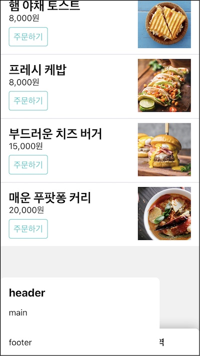
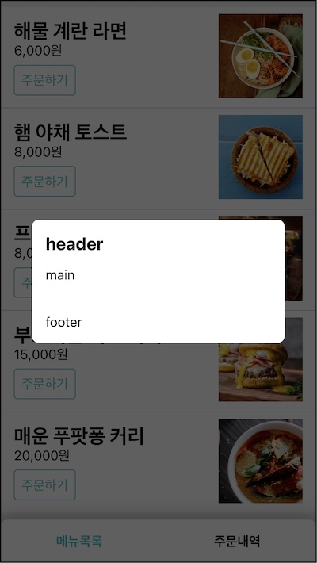
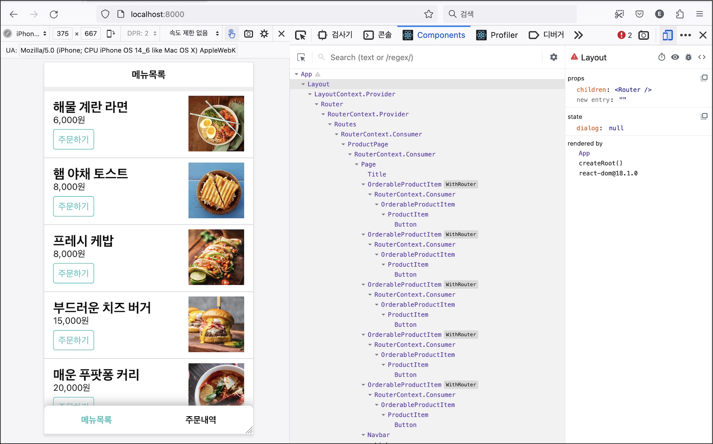
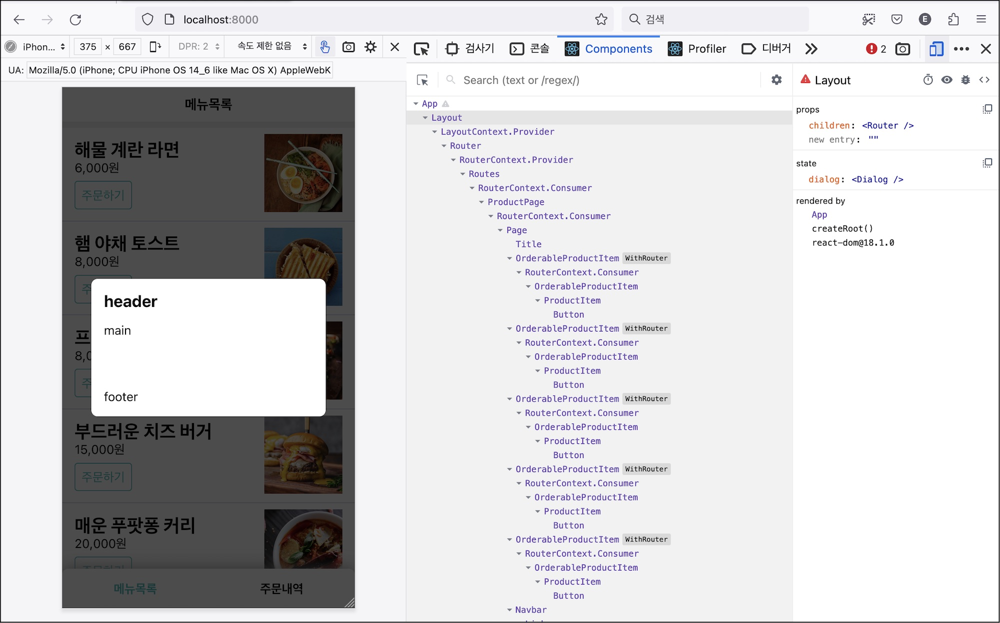
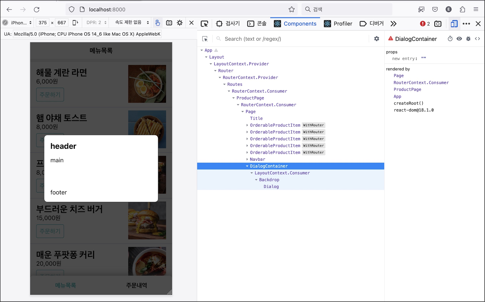
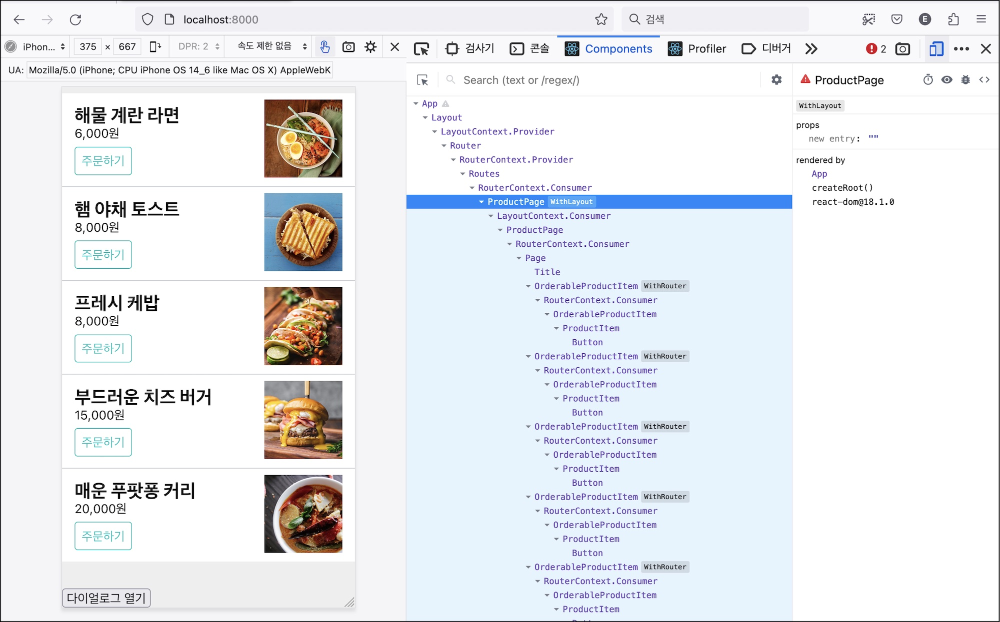

나머지 다이얼로그 관련 요구사항들이다.

- 0.4 API 호출시 로딩 메세지를 다이얼로그로 표시한다. (다이얼로그)
- 0.5 예외 처리용 메세지를 다이얼로그로 표시한다. (다이얼로그)
- 2.7 결제하기 버튼을 클릭하면 사용자 확인을 받는다. (다이얼로그)

지난 장에 이어 리액트 컨택스트와 고차 컴포넌트 패턴을 사용하겠다.

# 2.4.1 다이얼로그 컴포넌트

먼저 ui 부터 만들자. 미리 준비한 스타일을 이용해 다이얼로그 컴포넌트를 만들어 보자. src/components/Dialog.jsx 파일이다.

```jsx
const Dialog = () => (
  <div className="Dialog">
    <header>header</header>
    <main>main</main>
    <footer>footer</footer>
  </div>
)
```

어플리케이션 하단에 다이얼로그를 추가해보자.



맨 하단에 다이얼로그가 보인다. 배경이 흐리고 팝업이 화면 뷰포트 중앙에 위치해야 더 멋질 것 같다.

다이얼로그 뒤에 어둡게 깔아둘 .Backdrop css 클래스를 준비했다. 조합해서 사용할 수 있게 별도 컴포넌트로 들자. src/components/Backdrop.jsx 파일이다.

```jsx
const Backdrop = ({ children }) => <div className="Backdrop">{children}</div>
```

이 둘을 조합하면 뒷 배경을 흐리고 중앙에 위치한 다이얼로그 박스가 표시될 것이다.

```jsx
<BackDrop>
  <Dialog />
</Backdrop>
```



다이얼로그에 대한 상태를 전역으로 관리하면 좋겠다. 화면 전반에 사용되기 때문에 어디서든 접근할 수 있어야하기 때문이다. 이 상태를 컨택스트로 전달하면 어떤 컴포넌트에서도 컨택스트 컨슈머를 통해 이 상태를 주입 받을 수 있을 것이다. 라우터 컨택스트와 같은 역할이다.

다이얼로그를 띄우는 방식은 선언적일 뿐만 아니라 프로그래밍적으로도 가능해야한다. 다이얼로를 띄우는 상황이 동적이기 때문이다. 버튼을 클릭한 뒤나 try/catch 문으로 묶은 캐치 절에서 오류 다이얼로그를 띄워야 하는 경우에 사용하기 때문이다. 다이얼로그 상태 변경함수를 필요한 컴포넌트에 주입한다면 컴포넌트는 이함수를 인자로 받아 사용할 수 있을 것이다. WithRouter 고차 컴포넌트와 같은 역할이다.

다이얼로그를 위한 컨택스트를 설계하고 고차 컴포넌트로 이 횡단 관심사를 각 계층에서 사용할 수 있도록 구현해 보겠다.

# 2.4.2 레이아웃 컨택스트

다이얼로그 상태를 전달할 컨택스트를 만들자. 다이얼로그 뿐만 아니라 토스트, 버텀 시트 등의 UI 요소를 포함할 수 있는 '레이아웃'이라는 이름을 사용하겠다. src/lib/MyLayout.jsx 파일을 추가한다.

```jsx
const layoutContext = React.createContext()
layoutContext.displayName = "LayoutContext"
```

화면 레이아웃에 대한 메세지를 전달할 레이아웃 컨택스트이다. 다이얼로그 상태를 전달하는 역할을 할 것이다.

이어서 레이아웃 상태를 보유한 Layout 컴포넌트를 만들자.

```jsx{5,10-12,14}
export class Layout extends React.Component {
  constructor(props) {
    super(props)
    this.state = {
      dialog: null,
    }
  }

  render() {
    const value = {
      dialog: this.state.dialog,
    }
    return (
      <layoutContext.Provider value={value}>
        {this.props.children}
      </layoutContext.Provider>
    )
  }
}
```

리액트 앨리먼트를 저장할 수 있는 상태 dialog를 만들었다. 다이얼로그 앨리먼트를 저장할 용도다. 렌더 메소드에서 컨택스트 프로바이더를 사용하는데 여기에 상태 dialog를 제공한다. Layout 하위 컴포넌트에서는 이 상태를 사용할 수 있을 것이다.

Router를 어플리케이션 최상단에 감싸서 하위 컴포넌트들에게 라우팅 기능을 제공한 것 처럼 App을 Layout으로 감싸자. 하위 컴포넌트들은 모달 기능을 사용할수 있을 것이다.

```jsx{2,10}
const App = () => (
  <MyLayout.Layout>
    <MyRouter.Router>
      <MyRouter.Routes>
        <MyRouter.Route path="/cart" element={<CartPage />} />
        <MyRouter.Route path="/order" element={<OrderPage />} />
        <MyRouter.Route path="/" element={<ProductPage />} />
      </MyRouter.Routes>
    </MyRouter.Router>
  </MyLayout.Layout>
)
```



상태 dialog 값을 하위 컴포넌트 어디선가 렌더링할 차례다. 각 페이지가 항상 사용하는 컴포넌트인 페이지가 적당하겠다. 페이지 컴포넌트에 레이아웃 컨택스트 컨슈머를 사용해 다이얼로그 상태를 주입받고 렌더링 해보자.

```jsx{6,8}
const Page = ({ header, children, footer }) => (
  <div className="Page">
    <header>{header}</header>
    <main>{children}</main>
    <footer>{footer}</footer>
    <MyLayout.layoutContext.Consumer>
      {({ dialog }) => dialog && <Backdrop>{dialog}</Backdrop>}
    </MyLayout.layoutContext.Consumer>
  </div>
)
```

Page는 레이아웃 컨택스트를 통해 전달된 다이얼로그 상태를 그릴 것이다. 다이얼로그가 있을 때 백드랍으로 감싸서 렌더링했다.

Layout의 상태 dialog에 다이얼로그 앨리먼트를 추가해서 테스트해보자.

```jsx{5}
export class Layout extends React.Component {
  constructor(props) {
    super(props);
    this.state = {
      dialog: <Dialog />
    };
```



Page 컴포넌트 코드를 좀 더 명확히 해보자. 헤더, 메인, 푸터의 추상화 수준과 다이얼로그의 추상화 수준이 다르다. 위 세 개는 한 줄로 되어 있어서 각 각 외부로 관심사를 위임했는데 모달은 세부 구현을 여기에 담았기 때문이다. 이러한 추상화 수준의 차이는 객체 역할의 비대칭을 야기하고 코드를 읽기 어렵게 만들기 마련이다.

다른 녀석들처럼 모달도 이를 위임해서 전체 추상화 수준을 맞추자. 다이얼로그 상태에 따라 다이얼로그를 렌더링하기 위한 다이얼로그 컨택스트로 분리하겠다.

```jsx
const DialogContainer = () => (
  <layoutContext.Consumer>
    {({ dialog }) => dialog && <Backdrop>{dialog}</Backdrop>}
  </layoutContext.Consumer>
)
```

횡단 관심사 분리를 위해 고차 컴포넌트 패턴을 사용했다면 종단 관심사를 분리하는데 컨테이너 패턴을 사용한다. UI를 위한 데이터를 조회하고 수정하는 역할을 컨테이너로 정의해 순수 UI 역할과 분리하는 것이다. 여기서는 레이아웃 컨택스트의 데이터를 구독하고 다이얼로그가 있을경우 백드랍과 조합해서 리액트 앨리먼트를 반환하는 역할을 한다.

Page에서 이를 교체한다.

```jsx{6}
const Page = ({ header, children, footer }) => (
  <div className="Page">
    <header>{header}</header>
    <main>{children}</main>
    <footer>{footer}</footer>
    <MyLayout.DialogContainer />
  </div>
```

다이얼로그 관련 코드가 단 한 줄로 줄었다. 컨택스트를 구독하고 백드랍과 다이얼로그를 조합하는 구현 상세는 Page의 관심사가 아니다. 그저 레이아웃을 잘 나눌수 있는 것만 관심있다.



# 2.4.3 프로그래밍적으로 다이얼로그 제어

동적으로 다이얼로그를 관리하기 위해 프로그래밍적인 방식을 제공할 차례다. 먼저 레이아웃의 다이얼로그 상태를 변경할수 있는 함수를 컨택스트에 제공하자.

```jsx{7,10-12,17}
class Layout extends React.Component {
  constructor(props) {
    super(props)
    this.state = {
      dialog: null,
    }
    this.setDialog = this.setDialog.bind(this)
  }

  setDialog(dialog) {
    this.setState({ dialog })
  }

  render() {
    const value = {
      dialog: this.state.dialog,
      setDialog: this.setDialog,
    }

    return (
      <layoutContext.Provider value={contextValue}>
        {this.props.children}
      </layoutContext.Provider>
    )
  }
}
```

상태 dialog를 변경하는 setDialog 메소드를 만들고 이것을 컨택스트에게 전달했다.

컨택스트 소비자는 다이얼로그 상태를 제어할 수 있는 setDialog를 사용할 수 있을 것이다.

```jsx{5,6}
<MyLayout.layoutContext.Consumer>
  {({ setDialog }) => (
    <button
      onClick={() => {
        setDialog(<Dialog />)
        setTimeout(() => setDialog(null), 3000)
      }}
    >
      다이얼로그 열기 테스트
    </button>
  )}
</MyLayout.layoutContext.Consumer>
```

상품목록 페이지에 다이얼로그 테스트 버튼을 추가했다. 레이아웃 컨택스트를 구독하는데 버튼을 클릭하면 레이아웃 컨택스트가 전달해준 setDialog 함수를 호출한다. 함수 인자로 전달한 리액트 앨리먼트가 Layout의 상태 dialog로 갱신되어 이 상태를 구독중인 DialogContainer에 의해 렌더링 될 것이다.

3초 후에 setDialog(null) 함수를 실행하면 같은 흐름으로 다이얼로그 상태가 비워져 다이얼로그가 사라진다.

레이아웃 컨슈머로 어디서든 다이얼로그 상태를 프로그래밍적으로 제어할 수 있다. setDialog 함수를 컨택스트를 통해 제공하기 때문이다. 라우터의 navigate 함수처럼.

# 2.4.4 withLayout

레이아웃 컨택스트를 사용해서 직접 상태를 변경할수도 있지만 전용 함수를 컴포넌트에 주입하는 것이 사용하기 편하다. 레이아웃 기능을 보강해주는 고차 컴포넌트를 만들어보자.

```jsx{1,2,3,5,6,10,11,15}
const withLayout = WrappedComponent => {
  const WithLayout = props => (
    <layoutContext.Consumer>
      {({ dialog, setDialog }) => {
        const openDialog = setDialog
        const closeDialog = () => setDialog(null)

        const enhancedProps = {
          dialog,
          openDialog,
          closeDialog,
        }
        return <WrappedComponent {...props} {...enhancedProps} />
      }}
    </layoutContext.Consumer>
  )
  WithLayout.displayName = `WithLayout(${getComponentName(WrappedComponent)})`
  return WithLayout
}
```

레이아웃 기능을 추가할 대상 컴포넌트를 WrappedComponent 인자로 받았다.

WithLayout 컴포넌트를 정의했다. 이 컴포넌트는 대상 컴포넌트에게 레이아웃 기능을 제공할 고차 컴포넌트가 될 것이다. 레이아웃 컨택스트가 제공한 기능을 사용하기 위해 레이아웃 컨택스트 컨슈머를 사용했다.

컨슈머는 프로바이더가 제공한 다이얼로그 상태 dialog와 이를 변경하는 함수 setDialog를 사용할 수 있다. setDiaolg를 조합해서 openDialog, closeDialog 함수를 만들어 타겟 컴포넌트에 주입했다.

이 컴포넌트의 이름을 지정하려고 displayName 속성에 값을 설정했다. 리액트 개발툴에서 고차 컴포넌트를 쉽게 식별할 수 있을 것이다.

레이아웃 기능을 추가한 WithLayout 컴포넌트를 반환했다.

상품 목록 페이지 컴포넌트에 레이아웃 기능을 추가하기 위해 withLayout 함수를 사용해 보자.

```jsx{4,5,9,15}
class ProductPage extends React.Component {
  // ...
  async fetch() {
    const { openDialog, closeDialog } = this.props
    openDialog(<Dialog />)
    try {
      const productList = await ProductApi.fetchProductList()
      this.setState({ productList })
      closeDialog()
    } catch (e) {}
  }
  // ...
}
export default withLayout(ProductPage)
```



컴포넌트 트리에 WithLayout이란 태그가 붙은 ProductPage 컴포넌트를 확인했다. 이 페이지 컴포넌트에 레이아웃 인자가 추가 될 것이다.

컴포넌트가 마운트되고 나면 다이얼로그가 화면에 보일 것이다. api 호출하고 나면 다이얼로그가 사라질 것이다.

다이얼로그 컨텍스트 컨슈머를 사용하는 DialogContainer노 withLayout으로 코드를 간결하게 개선할 수 있다.

```jsx
const DialogContainer = withLayout(
  ({ dialog }) => dialog && <Backdrop>{dialog}</Backdrop>
)
```

# 2.4.5 다이얼로그 조합

컨택스트와 고차 컴포넌트 패턴을 사용해 요구사항을 구현할 수 있는 기반을 마련했다. 컨택스트를 사용했기 때문에

요구사항을 다시 보자.

- 0.4 API 호출시 로딩 메세지를 다이얼로그로 표시한다. (다이얼로그)
- 0.5 예외 처리용 메세지를 다이얼로그로 표시한다. (다이얼로그)
- 2.7 결제하기 버튼을 클릭하면 사용자 확인을 받는다. (다이얼로그)

세 가지 형태의 다이얼로그가 필요한다. 로딩 다이얼로그, 오류 전용 다이얼로그, 사용자 확인 다이얼로그. 이 세 가지를 조합할 수 있도록 다이얼로그 인자를 열어야 한다.

```jsx{1,3-5}
const Dialog = ({ header, children, footer }) => (
  <div className="Dialog">
    {header && <header>{header}</header>}
    <main>{children}</main>
    {footer && <footer>{footer}</footer>}
  </div>
)
```

header, children, footer 를 외부에서 결정하도록 열어 두었다.

이제 상품 목록을 가져올때 "로딩중..." 이란 메세지가 다이얼로그에 표시되도록 바꿔보자.

```jsx{5}
class ProductPage extends React.Component {
// ...
  async fetch() {
    const {openDialog, closeDialog}=this.props
    openDialog(<Dialog>메뉴 목록 로딩중...</Dialog>);
    try {
      const productList = await ProductApi.fetchProductList();
      this.setState({ productList });
      closeDialog()
   } catch (e) {
   }
  }

```

이 다이얼로그는 장바구니와 주문내역 화면에서도 사용할 수 있다. 로딩 초기에 데이터 조회 api를 호출하기 때문이다. 각 컴포넌트에서 openDialog 함수에 로딩중 메세지를 담은 리액트 앨리먼트를 전닳기 보다는 이 기능을 공통으로 제공하자. WithLayout 고차 함수의 역할로 옮기자.

```jsx{6,7,13,14}
const withLayout = (WrappedComponent) => {
  const WithLayout = (props) => (
    <layoutContext.Consumer>
      {({ dialog, openDialog, closeDialog }) => {

        const startLoading = (message) => openDialog(<Dialog>{message}</Dialog>);
        const finishLoading = closeDialog;

        const enhancedProps = {
          dialog,
          openDialog,
          closeDialog,
          startLoading,
          finishLoading,
        };

        return <WrappedComponent {...props} {...enhancedProps} />;
      }}
//...
```

startLoading을 만들었다. openDialog 함수를 호출하는데 다이얼로그 컴포넌트를 사용해 로딩 다이얼로그를 만들었다. finishLoading은 다이얼로그를 닫는 함수를 호출한다. 두 메서드를 enhancedProps로 해서 컴포넌트에 제공했다.

사용해 보자.

```jsx{6,10}
class ProductPage extends React.Component {
// ...
  async fetch() {
    const {startLoading, finishLoading}=this.props

    startLoading('메뉴 목록 로딩중...')
    try {
      const productList = await ProductApi.fetchProductList();
      this.setState({ productList });
      finishLoading()
    } catch (e) {
    }
  }
```

메뉴목록 화면에서 상품 데이터를 가져올 때 로딩 메세지를 보여준다. 데이터 페치를 마치고 상태를 업데이트한 뒤 로딩메세지를 제거한다. 이전에는 다이얼로그를 직접 전달하고 닫았는데 지금은 로딩이라는 개념으로 추상화 했다. 게다가 코드도 재사용할 수 있다. 장바구니와 주문 내역에도 사용할 수 있다.

```jsx{4,8,12,17}
class CartPage extends React.Component {
// ...
  async fetch() {
    const { params, startLoading, finishLoading } = this.props;
    const { productId } = params();
    if (!productId) return;

    startLoading("장바구니에 담는중...");
    try {
      const product = await ProductApi.fetchProduct(productId);
      this.setState({ product });
      finishLoading();
    } catch (e) {
      console.error(e);
    }
}
MyLayout.withLayout(MyRouter.withRouter(CartPage));
```

```jsx{5,9,14}
class OrderPage extends React.Component {
  async fetch() {
    const { startLoading, finishLoading } = this.props

    startLoading("주문 정보 로딩중...")
    try {
      const order = await OrderApi.fetchMyOrder()
      this.setState({ order })
      finishLoading()
    } catch (e) {}
  }
}
withLayout(OrderPage)
```

요구사항

- **~~0.4 API 호출시 로딩 메세지를 다이얼로그로 표시한다. (다이얼로그)~~**
- 0.5 예외 처리용 메세지를 다이얼로그로 표시한다. (다이얼로그)
- 2.7 결제하기 버튼을 클릭하면 사용자 확인을 받는다. (다이얼로그)

# 중간 정리

다이얼로그 기능을 구현했다. 라우터 기능처럼 어플리케이션 전반에 사용되기 때문에 리액트 컨택스를 사용했다.

동적으로 표현되는 다이얼로그를 제어하기 위해 고차 컴포넌트로 컴포넌트에 기능을 제공했다. 리액트 앨리먼트에서 사용되는 선언적인 방식 뿐만아니라 메소드에서 호출할수도 있다.

어플리케이션에서 제공하는 다이얼로그 종류는 세 가지다. 이를 지원하기 위해 다이얼로그를 조합할수있는 형태를 변경했다. 확장에 대해 열어놓은 것이다.

고차 컴포넌트를 만들 때 로딩 전용 메소드를 추가했다. 사용하는 측에서 로딩중 코드에 대한 세부 구현을 알 필요없이 함수만 호출하도록 인터페이스를 설계했다.

다음 장에서 나머지 다이얼로그 요구사항을 구현해 보자.
