# 2.5.1 다이얼로그 문제

사실 다이얼로그에는 버그가 있다. 다이얼로그의 스타일이 부모 스타일의 영향을 받아 빈 공간이 조금 생긴다.

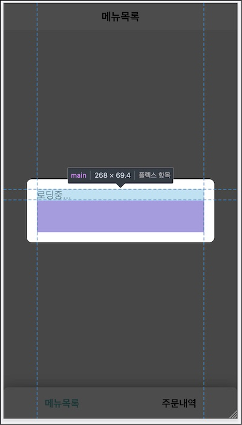

원인은 중첩된 돔 구조로 인해 부모 엘리먼트의 스타일 영향을 다이얼로그가 받기 때문이다.

```css{2}
.ProductPage main {
  padding-bottom: 51px;
}
.Dialog > main {
  flex: 1 1;
  max-height: 200px;
  min-height: 40px;
  overflow-y: scroll;
}
```

다이얼로그 스타일을 재정의해 부모로부터 받은 스타일을 무시거나 !important를 사용하는 방법은 근본적으로 해결할 수 없다. 부모로부터 어떤 스타일을 상속 받을지 예측 할 수 없기 때문이다.

**중첩된 돔 구조에서 벗어나야**만 비로소 스타일 상속의 영향을 받지 않는다. 어플리케이션 루트 컴포넌트에 다이얼로그만 그리면 정상적인 모습이다.

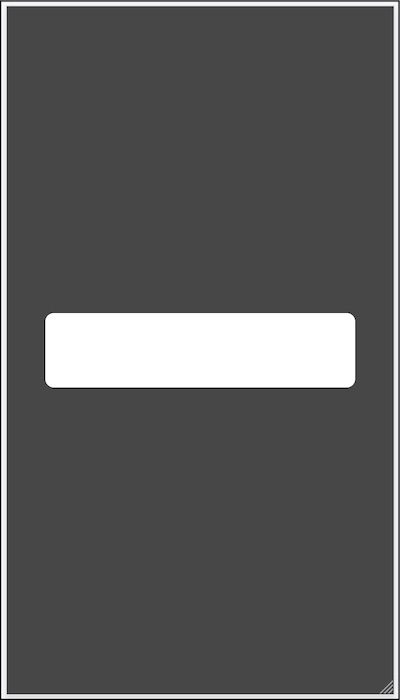

범위를 좁힌 예제를 가지고 문제를 해결해 보자.

# 2.5.2 리액트 포탈

Red 컴포넌트를 만들자.

```jsx
const Red = () => <div className="red">빨간색</div>

// index.html
<style>
.red {
  background: red;
}
</style>
```

배경색을 빨간색으로 지정한 .red 클래스를 사용해서 div을 반환하는 컴포넌트다. 빨간 배경의 박스가 렌더링 될 것이다.

이 컴포넌트를 다른 Green 하위에 사용해 보자.

```jsx{2-7,14-16}
const Red = () => <div className="red">빨간색</div>
const Green = () => (
  <div className="green">
    <div>녹색</div>
    <Red />
  </div>
)

// index.html
<style>
.red {
  background: red;
}
.green div {
  background: green;
}

</style>
```

배경색을 초록색으로 지정한 .green 클래스를 사용해서 디비전을 반환하는 앨리먼트다. 녹색 배경의 박스가 렌더링 될 것이다. 레드 컴포넌트도 함께 렌더링할 것이다.

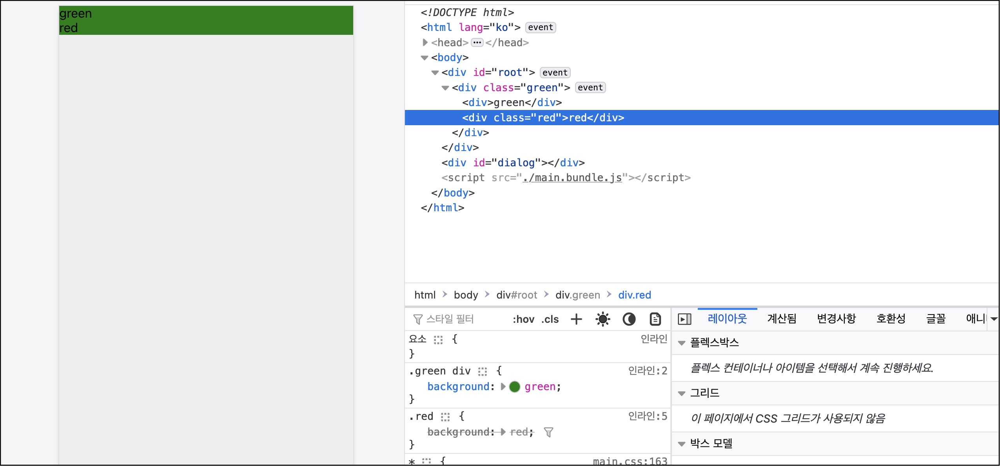

예상과 달리 Red가 녹색으로 렌더링 되었다. 돔과 스타일을 살펴보자. .red 스타일이 해당돔에 적용 되었지만 .green div 스타일이 오버라이딩 되었다. 우선순위에 의해 이 스타일이 적용되어 녹색 배경으로 계산된 것이 원인이다.

이러한 돔 상속 구조로 인한 스타일 상속은 이 구조를 벗어나지 않은 한 해결하기 까다롭다.
Red를 다른 돔에 마운트한다면 스타일 상속의 영향을 받지 않을 것이다. react-dom 패키지의 렌더 함수로 다른 돔에 붙여 보자.

```jsx{2,5}
const root = ReactDOM.createRoot(document.getElementById("root"))
const root2 = ReactDOM.createRoot(document.getElementById("dialog"))

root.render(<Green />)
root2.render(<Red />)
```

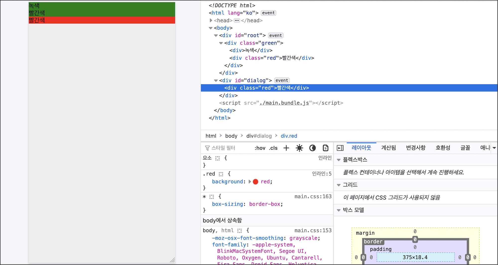

Green은 #root 앨리먼트에 마운트하고 Red는 #dialog 앨리먼트에 마운트했다. 후자는 부모 컴포넌트가 없어서 스타일 영향에서 벗어났다.

컴포넌트의 마운트 위치를 변경해서 돔 구조에서 벗어서 스타일 상속 문제를 해결했지만 컴포넌트 구조도 함께 바뀌어 버렸다. 여전히 Green 아래 Red 를 위치시키고 싶은 경우가 있다. 마치 Dialog를 App 하위에 위치시켜야하는 것 처럼 말이다.

이러한 문제를 해결할 수 이는 것이 **리액트 포탈**이다. 포탈을 사용하면 우리가 한 것처럼 해당 리액트 앨리먼트를 지정한 돔에 마운트 시킬수 있다. 지정한 돔이 어플리케이션이 마운트된 돔 바깥이라도 어디든지 상관없다.

뿐만아니라 포탈로 마운트한 앨리먼트에서 발생한 이벤트가 어플리케이션에으로 버블링되어 올라간다. 어플리케이션에서는 다른 돔에 마운트된 앨리먼트라도 부모에 있는 앨리먼트처럼 이벤트를 처리할 수 있다. 반대로 부모 앨리먼트가 포탈에 있는 컴포넌트로 인자를 전달할 수도 있다.

```jsx{2}
const Red = () =>
  ReactDOM.createPortal(
    <div className="red">red</div>,
    document.querySelector("#dialog")
  )
```

Red에서 리액트 앨리먼트를 바로 반환하지 않고 createPortal 함수를 사용했다. 렌더링할 리액트 앨리먼트와 이것을 마운트할 돔 앨리먼트를 인자로 전달하는 방식이다. 컴포넌트가 렌더링되면 #dialog 돔 앨리먼트에 이 리액트 앨리먼트가 붙게 될 것이다.

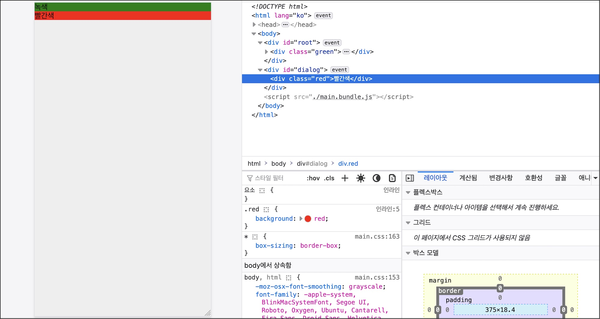

Red를 클릭하면 이벤트가 버블링되어 Green에서 수신된다.

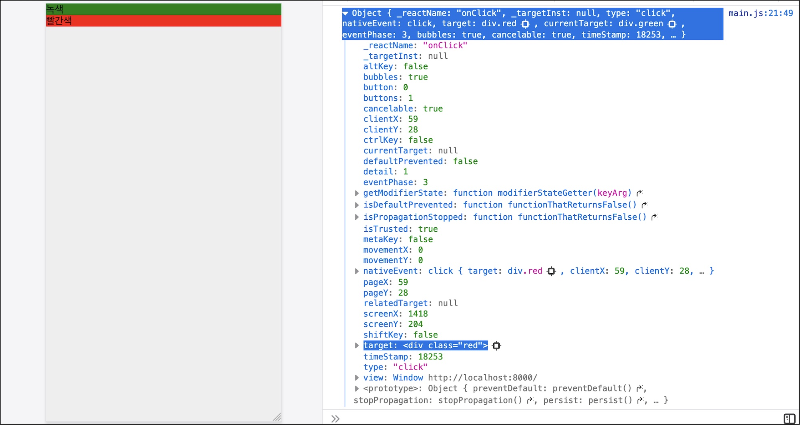

# 2.5.3 다이얼로그 문제 해결

그럼 다시 우리 예제로 돌아와서. Dialog 문제는 스타일 상속 영향으로 빈 공간이 생긴다는 것이다. 해결하려면 Dialog가 App의 마운트 지점에서 벗어나 다른 곳에 마운트되어야 한다. 리액트 포탈로 옮겨보자.

```jsx{5}
export const DialogContainer = () => (
  <layoutContext.Consumer>
    {({ dialog }) =>
      dialog &&
      ReactDOM.createPortal(
        <Backdrop>{dialog}</Backdrop>,
        document.querySelector("#dialog")
      )
    }
  </layoutContext.Consumer>
)
```

기존에는 리액트 앨리먼트를 반환하는 컴포넌트였지만 리액트 포탈로 한번 감싼 뒤 반환했다. 반환할 기존 앨리먼트를 createProtal의 첫 번째 인자로 전달했다. 이것을 마운트할 돔인 #dialog 앨리먼트를 두 번째 인자로 지정했다.

이전 돔과 비교해 보자.

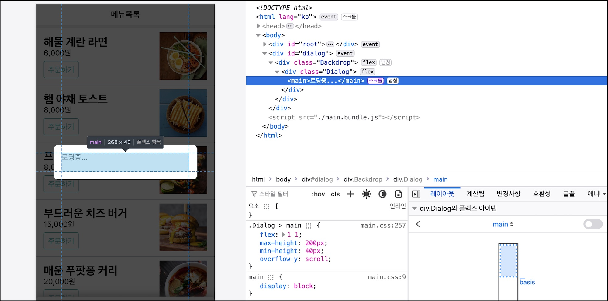

#dialog에 다이얼로그 앨리먼트가 추가되어서 #root에 있는 스타일을 더 이상 상속받지 않는다. 이제는 다이얼로그에서 정의한 스타일에만 영향을 받아 빈 공간이 생기지 않는다.

# 2.5.4 다이얼로그 Alert

Dialog를 조합해 요구사항을 해결할수 있는 각 각의 다이얼로그를 조합할 차례다. src/componentErrorDiloag.jsx에 오류 메세지를 보여줄 다이얼로그를 만들자.

```jsx{1,9}
const ErrorDialog = ({ closeDialog }) => (
  <Dialog
    header={<>오류</>}
    footer={<Button onClick={closeDialog}>네, 알겠습니다</Button>}
  >
    잠시 후 다시 시도해 주세요.
  </Dialog>
)
MyLayout.withLayout(ErrorDialog)
```

헤더에 타이틀을 넣고 하단에 모달을 닫는 버튼을 만들었다. withLayout으로 감싸 closeDialog를 인자로 받았다. 이를 호출해서 다이얼로그를 닫는 함수를 호출할 수 있다. 본문에는 "잠시 후 다시 시도해 주세요" 문구를 노출했다.

오류가 발생한 지점에 이 다이얼로그를 띄우면 되겠다. 먼저 메뉴 목록 화면에 적용해 보자.

```jsx{3,9,12}
class ProductPage extends React.Component {
  async fetch() {
    const {startLoading, finishLoading, openDialog} = this.props;
    startLoading('로딩중...');
    try {
     const productList = await ProductApi.fetchProductList();
      this.setState({ productList });
    } catch (e) {
      openDialog(<ErrorDialog />);
      return
    }
    finishLoading()
  }
```

데이터를 패치하는 과정에서 오류가 발생하면 이를 잡아서 오류 다이얼로그에 보이도록 했다. 지금은 다이얼로그 테스트를 위해 일부러 오류를 발생시켰다.

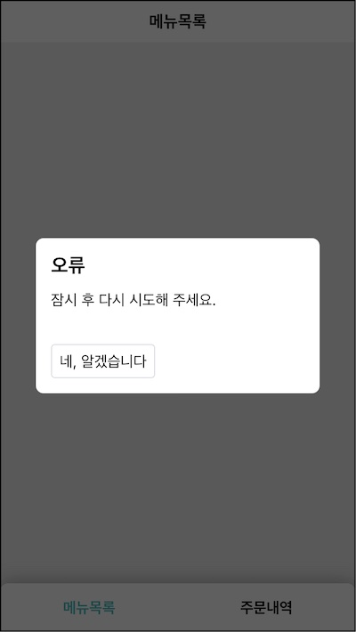

데이터 패치 과정에서 오류가 발생하면 예외를 잡아서 오류 다이얼로그가 뜬다. 하단 버튼을 클릭하면 다이얼로그가 닫힌다.

장바구니, 주문내역 화면에도 오류처리를 추가하자.

```jsx{3,12,15}
class CartPage extends React.Component {
  async fetch() {
    const { params, startLoading, finishLoading, openDialog } = this.props
    const { productId } = params()
    if (!productId) return

    startLoading("장바구니에 담는중...")
    try {
      const product = await ProductApi.fetchProduct(productId)
      this.setState({ product })
    } catch (e) {
      openDialog(<ErrorDialog />)
      return
    }
    finishLoading()
  }
}
```

```jsx{10}
class OrderPage extends React.Component {
  async fetch() {
    const { startLoading, finishLoading, openDialog } = this.props
    startLoading("주문 정보를 불러오는 중입니다.")
    try {
      const order = await OrderApi.fetchMyOrder()
      this.setState({ order })
    } catch (e) {
      finishLoading()
      openDialog(<ErrorDialog />)
      return
    }
    finishLoading()
  }
}
```

요구사항

- ~~0.4 API 호출시 로딩 메세지를 다이얼로그로 표시한다. (다이얼로그)~~
- **~~0.5 예외 처리용 메세지를 다이얼로그로 표시한다. (다이얼로그)~~**
- 2.7 결제하기 버튼을 클릭하면 사용자 확인을 받는다. (다이얼로그)

# 2.5.6 다이얼로그 Confirm

장바구니 화면에서 주문 정보를 입력한 뒤 하단의 결제하기 버튼을 눌렀을 때의 후속 플로우를 구현해야 한다.

- "결제 중.." 이라는 로딩 메세지를 보인다.
- 주문 생성 api 를 호출한다.
- api 호출에 성공하면 로딩을 닫고 주문 성공 다이얼로그를 띄운다.
- 실패하면 주문 실패 다이얼로그를 띄운다.

주문 성공 다이얼로그.

- 결제 완료를 알리는 메세지를 보여주고 주문 상태 확인 여부를 묻는다.
- 사용자가 '네'를 누르면 다이얼로그를 닫고 주문 상세 화면으로 이동한다.
- '아니오'를 클릭하면 다이얼로그를 닫고 메뉴 목록 화면으로 이동한다.

주문 실패 다이얼로그.

- 결제 실패를 알리고 다시 시도해 달라는 메세지를 띄운다.
- 사용자가 클릭할 수 있는 버튼은 네, 알겠습니다 버튼 뿐이다.
- 클릭하면 다이얼로그를 닫는다.

먼저 주문 상세 화면에서 결제하기 버튼 핸들러를 구현하자.

```jsx{4,6,8-11}
class CartPgae extends React.Component {
  async handleSubmit(values) {
   const { startLoading, finishLoading, openDialog } = this.props;
    startLoading("결제중...");
    try {
      await OrderApi.createOrder(values);
    } catch (e) {
      openDialog(<ErrorDialog />);
      return;
    }

    finishLoading();
    openDialog(<PaymentSuccessDialog />);
  }
// ...
```

withLayout으로 모달 기능을 주입 받은 컴포넌트이기 때문에 startLoading, finishLoading, openDialog 함수를 사용할 수 있다. 먼저 결제 api 호출하기 전에 "결제중입니다"라는 로딩 메세지를 띄웠다. try구문 안에 주문 생성 api 를 호출했다.

실패하면 catch 문으로 이동해 발생한 예외를 잡을 것이다. 띄워진 로딩을 숨긴뒤에 정의한 오류 다이얼로그를 띄우고 함수를 종료한다. 사용자는 다이얼로그의 버튼을 클릭한뒤에 다시 결제 시도를 할 수 있다.

성공하면 try/catch 구문을 빠져 나온다. finishLoading() 으로 로딩 메세지를 감추고 주문 성공 다이얼로그를 띄울 것이다. pages/CartPage/PaymentsuccessDialog.jsx를 만들자.

```jsx{1,2,7,13,27,31}
const PaymentSuccessDialog = ({ navigate, closeDialog }) => {
  const handleClickNo = () => {
    closeDialog()
    navigate("/")
  }

  const handleClickYes = () => {
    closeDialog()
    navigate("/order")
  }

  return (
    <Dialog
      header={<>결제 완료</>}
      footer={
        <>
          <Button style={{ marginRight: "8px" }} onClick={handleClickNo}>
            아니오
          </Button>
          <Button styleType="brand" onClick={handleClickYes}>
            네, 주문상태를 확인합니다.
          </Button>
        </>
      }
    >
      결제가 완료되었습니다. 주문 상태를 보러 가시겠습니까?
    </Dialog>
  )
}

MyLayout.withLayout(MyRouter.withRouter(PaymentSuccessDialog))
```

상태가 필요하지 않아 함수 컴포넌트로 정의했다. 맨아래 withLayout, withRouter로 고차함수를 만들어 다이얼로그와 주소 이동 기능을 인자로 주입받아 navigate, closeDialog를 준비했다.

각 버튼의 핸들러를 만들었다. 아니오를 클릭할 경우 다이얼로그를 닫고 메뉴 목록 화면으로 이동한다. 예를 클릭한 경우 다이얼로그를 닫고 주문 상세 화면으로 이동한다.

마지막에 리액트 앨먼트를 반환했다. 다이얼로그 컴포넌트를 조합했다. 푸터에 버튼 두개를 두어 사용자가 선택할 수 있게끔 했다. 각 버튼에 위에 정의한 핸들러를 바인딩했다.

결제하기 버튼을 클릭한뒤 주문 생성에 성공하면 이 다이얼로그가 보일 것이다.

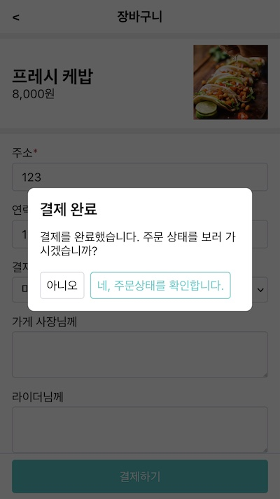

요구사항

- ~~0.4 API 호출시 로딩 메세지를 다이얼로그로 표시한다. (다이얼로그)~~
- ~~0.5 예외 처리용 메세지를 다이얼로그로 표시한다. (다이얼로그)~~
- **~~2.7 결제하기 버튼을 클릭하면 사용자 확인을 받는다. (다이얼로그)~~**

# 2.5.7 다이얼로그 개선 Ref

사용자 선택을 기다리는 다이얼로그는 두 가지다. 얼럿과 컨펌. 우리가 만든 ErrorDialog와 PaymentSuccessDialog다. 브라우져가 제공하는 얼럿과 컨펌은 선택값을 기본으로 지정해 엔터만 입력하더라도 다음 플로우를 진행할 수 있게끔 말이다.

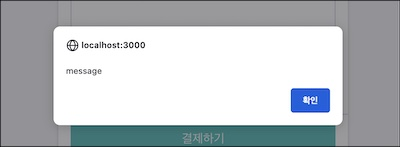

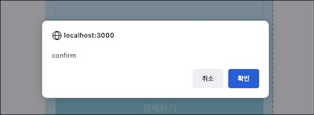

우리가 만든 다이얼로그도 기보 선택 버튼을 위치시켜 보자. 다이얼로그의 푸터의 마지막 버튼을 그렇게 만들어 보겠다.

앨리먼트의 포커스 함수를 사용하면 되겠다. 문제는 이것이 돔 api를 사용하는 것이라 직접 돔을 다루기 때문에 리액트의 선언적 방식과 잘 맞지 않는다는 것이다.

이러한 목적으로 사용하는 것이 리액트의 레프 객체다. 1편에서 주문 폼에 접근해 입력 값을 얻어오기 위해 사용한 그것 말이다. 돔에 직접 점근할 때는 리액트 레프 객체를 사용하면된다.

먼저 레프 객체를 사용하기 위해 함수형 컴포넌트를 클래스 컴포넌트로 바꾸어야한다.

```jsx{4,8-16,25}
class Dialog extends React.Component {
  constructor(props) {
    super(props)
    this.footerRef = React.createRef()
  }

  componentDidMount() {
    if (!this.footerRef.current) return

    const buttons = Array.from(
      this.footerRef.current.querySelectorAll("button")
    )
    if (buttons.length === 0) return

    const activeButton = buttons[buttons.length - 1]
    activeButton.focus()
  }

  render() {
    const { header, children, footer } = this.props
    return (
      <div className="Dialog">
        {header && <header>{header}</header>}
        <main>{children}</main>
        {footer && <footer ref={this.footerRef}>{footer}</footer>}
      </div>
    )
  }
}
```

리액트 레프 객체를 만들어서 footerRef 멤버 변수에 할당했다. 이 컴포넌트 객체가 살아있는 동안 값이 유지 될 것이다. 렌더 메소드에서 푸터 앨리먼트를 만들 때 ref속성에 바인딩했다.

렌더링 후 컴포넌트가 돔에 마운트 되고 componentDidMount() 훅이 동작할 것이다. 여기서 레프 객체를 통해 돔에 접근할 수 있다. 푸터의 버튼을 찾아 가장 마지막에 위치한, 가장 오른쪽에 위치한 컴포넌트를 퍼스트 하도록 돔을 제어했다.

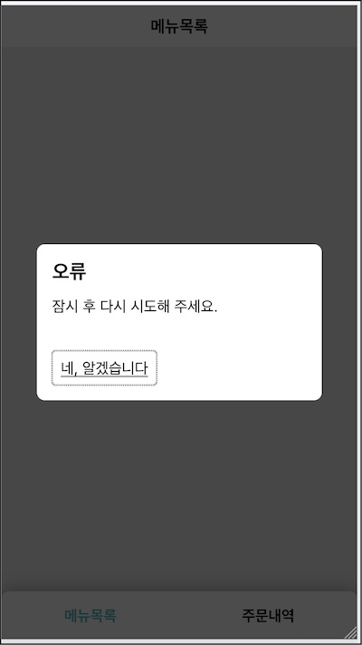

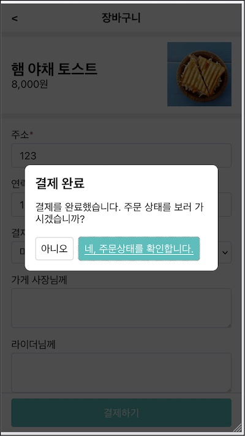

# 중간 정리

이전 장에서 구현한 다이얼로그는 안에 빈 공간이 생기는 문제가 있었다. 돔 구조에 따라 부모 스타일을 상속받아 다이얼로그의 스타일에 영향을 주는 것이 원인이다. 이를 해결하려면 돔 구조에서 벗어나야하는데 리액트 포탈을 이용했다.

포탈의 개념과 필요한 이유에 대해 이해했다. 우리 예제처럼 다른 돔에 있어야할 경우에 사용했다. 어플리케이션이 마운트된곳과 다른곳에 돔을 마운트할 때 사용한다. 다른 돔에 있더라도 같은 어플리케이션이고 코드상 하나의 돔 트리에 있기 때문에 이벤트 버블리도 되어야한다.

이렇게 만든 다이얼로그를 조합해서 요구사항을 하나씩 해결했다. 오류 발생시 처리를 위한 오류 다이얼로그를 만들었다.

장바구니 화면에서 결제 후 성공하면 사용자가게 어떻게 할것인지 묻는 유아이를 컨펌 다이얼로그로 해결했다.

다이얼로그에 버튼이 있을 경우 기본 버튼을 선택하도로 했다. 돔을 제어해서 포커스 api 를 사용하기 위해 1편에서 학습한 리액트 레프 객체를 다시한번 활용했다.

두 장에 걸쳐서 다이얼로그 요구사항을 모두 해결했다.
