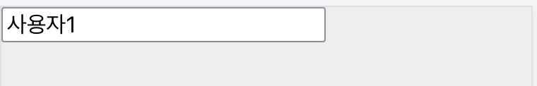
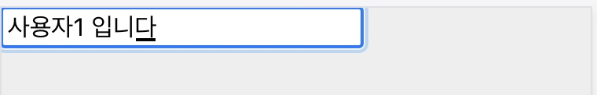
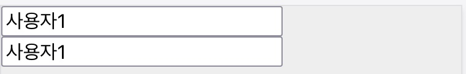
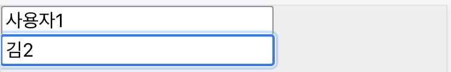

useState 훅을 만들고 리액트가 함수 컴포넌트에서 상태를 관리하는 방식을 이해할 것이다.

# 문제 제기

이름을 입력할 수 있는 NameField 컴포넌트를 만들어 보자.

```jsx
function NameField() {
  const name = "사용자1"
  const handleChange = e => {
    /* 변경한 값을 어디에 저장하지? */
  }
  return <input value={name} onChange={handleChange} />
}
```

변수 name에 할당한 문자열을 input의 value에 전달했다. 필드에 값을 입력하면 handleChange가 동작할 것이다.



필드에 값을 바인딩하려면 핸들러에서 name 값을 바꿔야 한다. 하지만 이 변수는 함수 본문에 선언한 상수일 뿐이다. 함수를 실행할 때는 값이기 때문에 변경할 방법이 없다. let을 사용하더라도 마찬가지다.

# 두 가지 문제

Name이 제대로 동작하려면 두 가지 문제를 해결해야 한다.

첫째, 입력값을 어딘가에 저장해야 한다.

이 값은 사용자 입력에 따라 변하므로 "**상태(state)**"라고 부르겠다. 클래스 컴포넌트라면 멤버 변수this.state를 사용했을 것이다. 함수 컴포넌트는 인스턴스가 없기 때문에 함수 외부에 저장할 만한 곳을 마련해야겠다.

둘째, 상태가 바뀌면 함수를 다시 호출해야 한다.

상태가 바뀌면 Name을 다시 렌더링해야하는데 한 번 호출한 함수를 다시 호출할 방법이 없다. 리액트 useState를 사용하면 함수 컴포넌트가 상태 변환에 따라 호출된다. 컴포넌트 함수 안에서 훅 함수를 사용했을 뿐인데 이런 결과가 나오는 것은 어쩌면 리액트의 역할이 아닐까?

useEffect 훅을 직접 구현하면 구조를 이해할수 있을 것이다. 함수형 컴포넌트가 상태를 구독하고 리액티브하게 반응할 수 있도록 만들어보자.

# 1차 구현

리액트 기능을 만드는 것이기 때문에 MyReact 모듈을 먼저 만들자. src/lib/MyReact.jsx 파일을 만든다.

```jsx{5}
const MyReact = (function MyReact() {
  let firstname
  let isInitialized = false

  function useName(initialValue = "") {
    if (!isInitialized) {
      firstname = initialValue
      isInitialzied = true
    }

    const setFirstname = value => {
      if (firstname === value) return
      firstname = value
    }
    return [firstname, setFirstname]
  }
  return { useName }
})()
```

훅처럼 사용하기 위해 useName이란 이름으로 함수를 정의했다. 초기 값 initialValue를 받았다.

훅이 처음 실행될 때만 이 값을 설정하려고 isInitialzed 플래그를 사용했다. 초기값을 firstanme 변수에 저장하는데 이것이 바로 상태가 될 것이다.

이 상태를 변경하는 세터도 만들었다. setFirstname이란 함수인데 값을 받아 firstname에 설정하는 역할을 한다.

마지막에 상태와 세터를 튜플로 반환한다.

MyReact는 방금 만든 useName을 담은 객체를 반환한다.

상태를 관리하라는 첫 번째 숙제는 일단 해결했다.

두 번째 숙제를 해결하자. 상태가 변하면 함수 컴포넌트를 다시 호출해 새로운 앨리먼트가 돔에 반영되어야한다.

간단히 세터 함수 안에 다음 코드를 추가해보자.

```jsx{6,16}
const MyReact = (function MyReact() {
  let firstname
  let isInitialized = false

  function useName(initialValue = "") {
    const { forceUpdate } = useForceUpdate()

    if (!isInitialized) {
      firstname = initialValue
      isInitialized = true
    }

    const setFirstname = value => {
      if (firstname === value) return
      firstname = value
      forceUpdate()
    }

    return [firstname, setFirstname]
  }
  return { useName }
})()
```

forceUpdate는 리랜더링을 하는 클래스 컴포넌트 메소드와 같은 이름이다. 함수 컴포넌트 안에서 리랜더링하려고 만들었다.

```jsx
// 구현을 위해 이곳만 리액트 훅을 사용한다.
function useForceUpdate() {
  const [value, setValue] = React.useState(1)
  const forceUpdate = () => setValue(value + 1)
  return {
    forceUpdate,
  }
}
```

구현 상세는 수업 방향과 무관하므로 그냥 슥 읽고 지나치자.

이렇게 해서 두 가지 숙제를 모두 해결했다. 그럼 이 함수를 사용해서 함수 컴포넌트에서 상태를 관리해보자.

```jsx
function NameField() {
  const [firstname, setFirstname] = MyReact.useName("사용자1")
  const handleChange = e => setFirstname(e.target.value)
  return <input value={firstname} onChange={handleChange} />
}
```

MyReact 모듈을 가져와 useName 함수를 컴포넌트 안에서 사용했다.

초기값 "사용자1"를 전달하고 튜플을 얻었다.

- firstname: 인풋 앨리먼트의 밸류 필드로 전달
- setFieldname: 이벤트 핸들러에서 상태 갱신으로 사용

이 세터는 상태를 변경하고 나서 곧장 화면을 다시 그리도록 리액트에게 요청할 것이다.

- 상태 변화를 감지, NameField 컴포넌트를 다시 호출
- 방금 변경한 firstname 값을 사용
- 리액트 앨리먼트를 다시 계산하고 리액트는 돔에 반영



# 다중 상태 관리

NameField가 성도 입력받도록 하자. 필드 갯수만큼 상태도 추가해야 하는데 지금 구조로 가능할까?

먼저 MyReact를 범용적인 이름으로 바꾸겠다.

```jsx{2,5,13,19}
const MyReact = (function MyReact() {
  let memorizedState;
  let isInitialized = false;

  function useState(initialValue = "") {
    const { forceUpdate } = useForceUpdate();

    if (!isInitialized) {
      memorizedState = initialValue;
      isInitialized = true;
    }

    const setState = (nextState) => {
      if (memorizedState === nextState) return;
      memorizedState = nextState;
      forceUpdate();
    };

    return [memorizedStates, setState];
  }
// ...
```

firstname이란 도메인 용어를 빼고 추상적인 memorizedState란 용어로 바꿨다. 도메인 정보를 빼고 어디든 사용할 수 있게 상태라는 의미를 의도한 것이다. useState와 setState도 마찬가지.

이제 컴포넌트에 성을 위한 상태를 하나 더 만들자.

```jsx{3,8}
function NameField {
  const [firstname, setFirstname] = useState("사용자1");
  const [lastname, setLastname] = useState("김");
  // ...
  return (
    <>
      <input value={firstname} >
      <input value={lastname} />
    </>;
  )
}
```

useState를 두 번 호출해 이름, 성을 위한 상태를 만들었다. 각 input의 value 속성에 값을 바인딩했는데 어떻게 될까?



두 필드가 같은 상태를 사용한다.

원인은 MyReact의 내부 변수 memorizedState다. useState를 여러 번 호출하더라도 이 변수에만 값을 할당한다. 처음 호출되었을 경우만 초기값을 할당하기 때문에 먼저 잔달한 "사용자1"이 지금의 상태값이다.

# 2차 구현

다중 상태를 구현하기 위해 상태관리 구조를 조금 바꿔야겠다.

```jsx{2,3,5,8,13,17}
const MyReact = (function MyReact() {
  const memorizedStates = []
  const isInitialized = []

  function useState(cursor, initialValue = "") {
    const { forceUpdate } = useForceUpdate()

    if (!isInitialized[cursor]) {
      memorizedStates[cursor] = initilaValue
      isInitialized[cursor] = true
    }

    const state = memorizedStates[cursor]

    const setState = nextState => {
      if (state === nextState) return
      memorizedStates[cursor] = nextState
      forceUpdate()
    }

    return [state, setState]
  }

  return {
    useState,
  }
})()
```

memorizedState를 memorizedStates **배열**로 바꿨다. 훅을 호출할 때마다 이 배열의 정확한 위치에 초기값을 설정하면 되겠다.

초기값은 처음 호출될 때 설정하는데 initialized 플래그를 보고 판단한다. 이것도 불리언 타입에서 배열로 변경했다.

이제 훅은 초기값 뿐만 아니라 배열을 가리키는 커서도 받아야한다. 상태를 목록으로 만들었기 때문에 어느 위치에 있는 상태를 조회할 것인지 찾기 위한 포인터 역할이다.

이 값은 isInitizlized 배열에서 최호 호출 여부를 찾기 위해서도 사용한다. 물론 세터 안에서 값을 세팅하기 위해서도 사용된다.

다시 상태를 사용해 보자.

```jsx{2,3}
function NameField() {
  const [firstname, setFirstname] = MyReact.useState(0, "사용자1")
  const [lastname, setLastname] = MyReact.useState(1, "김")

  const handleChangeFirstname = e => setFirstname(e.target.value)
  const handleChangeLastname = e => setLastname(e.target.value)

  return (
    <>
      <input value={firstname} onChange={handleChangeFirstname} />
      <input value={lastname} onChange={handleChangeLastname} />
    </>
  )
}
```

훅을 호출할 때 호출 순서에 맞게 커서 0, 1을 전달했다.



이제 두 필드가 각자 자신만의 상태를 사용할 수 있다.

# 더 단순하게

훅을 사용할 때 어느 상태를 구독할지 커서를 넘기는 것은 불편하다. 자칫하면 실수한다.

훅의 커서를 관리하는 역할은 사용하는 측이 아니라 제공하는 측이여야할 것이다. MyReact가 스스로 관리하도록 개선하자.

```jsx{4,6,16,21,22,31}
const MyReact = (function MyReact() {
  const memorizedStates = []
  const isInitialized = []
  let cursor = 0

  function useState(initilaValue = "") {
    const { forceUpdate } = useForceUpdate()

    if (!isInitialized[cursor]) {
      memorizedStates[cursor] = initilaValue
      isInitialized[cursor] = true
    }

    const state = memorizedStates[cursor]

    const setStateAt = _cursor => nextState => {
      if (state === nextState) return
      memorizedStates[_cursor] = nextState
      forceUpdate()
    }
    const setState = setStateAt(cursor)
    cursor = cursor + 1

    return [state, setState]
  }

  function useForceUpdate() {
    const [value, setValue] = React.useState(1)
    const forceUpdate = () => {
      setValue(value + 1)
      cursor = 0
    }
    return {
      forceUpdate,
    }
  }
  // ...
})()
```

마이 리액트 함수 본문에 변수 cursor를 추가했다. 훅이 호출 될 시점에 커서가 특정 상태를 가리키고 있을 것이다. 이 값을 세터에 잡아 두기 위해 setStateAt을 만들었다. 이것으로 특정 커서의 setSate 함수를 만들 수 있다.

그리고 나서 커서를 올려 다음 훅 호출에서 사용하도록 준비해 둔다.

리렌더링을 유발하는 forceUpdate에서는 cursor를 0으로 초기화한다. 컴포넌트가 다시 실행되면 첫 상태부터 가리킬 의도이다.

더 단순하게 사용할 수 있다.

```jsx{2,3}
function NameField() {
  const [firstname, setFirstname] = MyReact.useState("사용자1")
  const [lastname, setLastname] = MyReact.useState("김")
  // ...
}
```

리액트의 useEffect와 비슷해 졌다.

실제 리액트 api로 교체해 보자. 같은 결과일 것이다.

# 역할

useState의 역할은 함수 컴포넌트 안에서 지속할 수 있는 값, **상태**를 관리할 수 있는 방법을 제공한다.

- 함수가 매번 실행되더라도 일관적인 값을 유지하기 위해 클로저에 저장했다. memorizedStates 변수는 MyReact 함수가 반환한 useState가 이 변수를 사용하기 때문에 클로져 공간에 캡쳐되어 값이 사라지지 않는 구조다.

- useState는 튜플을 반환하는데 두 번째 값이 상태를 변경하는 함수다. 상태를 변경하면 컴포넌트를 다시 그려야 하는데 이 값을 사용해 UI 앨리먼트를 다시 계산해야 화면에 표시할 수 있기 때문이다. useState는 상태관리 뿐만 아니라 이 값이 변경되었을 때 화면을 **리렌더**하는 역할도 한다.

훅은 여러 번 사용할 수 있다. 하나의 컴포넌트가 사용하는 상태가 여러 개이기 때문이다. 다중 상태를 관리하기 위한 방법으로 배열을 선택했다.

이러한 훅 구조는 사용하는데 규칙을 지켜야하는 제한이 있다.

- 훅은 항상 함수 컴포넌트에서 사용해야 한다. 상태를 변경하면 리액트 컴포넌트를 다시 렌더하기 때문이다.

- 함수 본문 최상단에서 호출해야한다. 컴포넌트가 실행될 때 훅이 순서대로 호출되어야만 리액트는 훅이 사용하는 상태를 배열에서 제대로 찾을 수 있기 때문이다. 만약 훅이 조건문 안에 위치해서 실행되지 않는 경우가 생길 경우 리액트는 상태를 제대로 찾을 수 없을 것이다.

# 중간 정리

문제 정의

- 함수형 컴포넌트가 사용할 상태를 어디선가 관리해야
- 이 상태를 갱신하면 컴포넌트를 다시 그려야

구현

- 클로져: 훅 함수가 종료되더라도 이 값이 유지
- 리렌더
- 배열로 여러 훅을 지원
- 커서 관리

구조와 규칙

- 구조: 클로져와 배열
- 규칙: 함수형 컴포넌트 최상단에 사용

역할

- 상태 관리 방법 제공

## 참고

- [리액트 useState는 어떤 모습일까? | 김정환 블로그](/dev/2022/04/11/use-state.html)
- [React hooks: not magic, just arrays | Rudi Yardley](https://medium.com/@ryardley/react-hooks-not-magic-just-arrays-cd4f1857236e)
