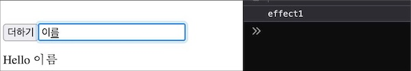
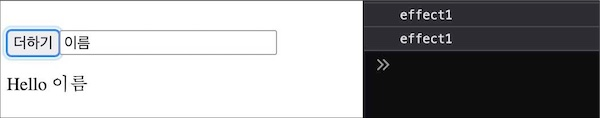
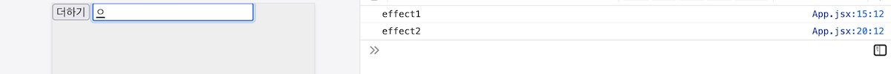
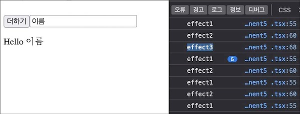
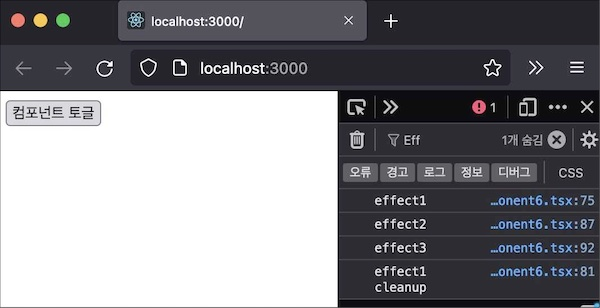

useEffect 훅을 만들고 리액트가 함수 컴포넌트에서 부수 효과를 어떻게 관리하는지 이해한다.

# 순수 함수와 컴포넌트

순수함수는 두 가지 특징을 가진다(참고: [위키피디아 Pure function](https://en.wikipedia.org/wiki/Pure_function)).

1. 입력이 같으면 결과도 같다.
1. 부작용이 없다.

함수를 몇 번 호출하던지 관계없이 같은 값을 입력하면 일관 값을 반환하는 것이 순수함수다. 매번 다른 값을 반환하다면 순수하지 않다고 말한다.

두 번째 특징이 좀 어렵다. 용어부터 정리하자.

감기약을 먹었는데 피부에 두드러기가 생기는 건 기대한 결과가 아니다.

특정 행위를 했을 때 원하는 결과가 아닌 현상을 부작용이라 한다. 어감이 부정적이라 "부수 효과"라는 표현을 사용하겠다.

함수를 실행할 때는 값만 반환하길 기대한다. 다른 변화가 있다면 부수 효과다. 함수 인자나 전역 변수를 변경하는 것은 부수 효과의 한 형태이다. 결과만 반환해야 하기 때문이다. 몇 번을 실행하더라도 자신의 일만 할 뿐, 함수 바깥 공간을 건드려서는 안된다.

컴포넌트는 리액트 앨리먼트를 반환할 때 **순수함수**로 동작한다.

> render() 함수는 순수해야 합니다. 즉, 컴포넌트의 state를 변경하지 않고, 호출될 때마다 동일한 결과를 반환해야 하며, 브라우저와 직접적으로 상호작용을 하지 않습니다. - 참고: 리액트 문서

클래스 컴포넌트의 render 메소드처럼 리액트 앨리먼트를 반환하는 함수형 컴포넌트도 그렇다. 몇 번 실행하더라도 인자가 같으면 리액트 앨리먼트도 같아야 한다. 함수를 순수하게 유지해야 컴포넌트의 동작을 이해하기 쉽다.

하지만 UI를 표현하기 위해 컴포넌트는 부수 효과가 필요한 경우도 있다. 돔을 변경하거나 UI에 필요한 데이터를 얻기 위한 네트웍 요청 등.

클래스 컴포넌트는 부수효과를 생명주기 메서드를 활용해 관리한다. 반면 함수 컴포넌트에서는 마땅한 장소가 없다. 함수형 컴포넌트는 리액트 앨리먼트만 담당하기 때문이다.

# 지연 실행

함수형 컴포넌트에 부수 효과를 그냥 넣어 보자.

```jsx
const Counter = () => {
  const [count, setCount] = React.useState(0)
  document.title = `count: ${count}`
  const handleClick = () => setCount(count + 1)
  return <button onClick={handleClick}>더하기</button>
}
```

Counter는 상태 count를 사용해 더하기 버튼을 클릭할 때마다 이 값을 하나씩 올린다. 이 값을 문서 제목에 표시하려고 document.title에 할당해 돔을 변경했다.

실행하면 타이틀이 변경될 것이다.

Counter는 리액트 앨리먼트를 반환하는 것 뿐만아니라 돔을 변경하는 부수 효과도 남겼다. 돔을 변경하는 것은 함수 외부에 있는 전역 상태를 변경한 것이기 때문이다.

이 부수 효과의 **문제**가 뭘까?

리액트는 Counter가 만든 리액트 앨리먼트를 렌더할 것인데 돔을 조작하는 비교적 느린 작업을 하느라 즉시 반환받지 못한다. 함수 컴포넌트가 직접 돔을 조작하거나 네트웍을 요청하는 등 부수 작용을 일으키면 그 시간만큼 렌더링을 지연시키는 것이 문제이다.

뿐만 아니라 예측할 수 없는 어플리케이션이 된다. 함수를 실행한 쪽에서는 함수 결과값을 원하는데 기대하지도 않은 전역공간을 변경하기 때문이다.

리액트가 렌더링을 마친 뒤에 부수 효과를 실행하면 이 문제를 해결할 수 있지 않을까? 렌더링 시점을 아는 리액트가 이것을 실행하는 것이 낫겠다.

```jsx{2,5,7}
const MyReact = (function MyReact() {
  function useEffect(effect) {
    function runDeferedEffect() {
      const ENOUGH_TIME_TO_RENDER = 1
      setTimeout(effect, ENOUGH_TIME_TO_RENDER)
    }
    runDeferedEffect()
  }

  return {
    useEffect,
  }
})()
```

부수 효과(side effect)를 사용한다는 의미의 useEffect란 함수를 정의했다. 곧장 실행하지 않고 타임아웃으로 지연 실행했다. 리액트가 렌더링을 마칠수 있게 충분한 시간(ENOUGH_TIEM_TO_RENDER)을 기다렸다.

훅을 사용해 보자.

```jsx{6-9}
const Counter = () => {
  const [count, setCount] = React.useState(0)

  const handleClick = () => setCount(count + 1)

  MyReact.useEffect(() => {
    document.title = `count: ${count}`
    console.log("effect1")
  })

  console.log("Counter rendered")
  return <button onClick={handleClick}>더하기</button>
}
```

렌더링를 마친 뒤 부수효과를 실행할 것이다. 리액트는 함수 컴포넌트가 리액트 앨리먼트를 곧장 반환하기 때문에 신속히 UI를 그릴 수 있다. 컴포넌트는 부수 효과를 실행하지 않고 함수로 등록만 한다. 리액트가 렌더를 마친 뒤에 이 부수 효과를 실행할 것이다.

이제 아무리 무거운 부수 효과라도 렌더링을 마친 뒤에 실행되기 때문에 UI가 블락 되는 문제는 발생하지 않을 것이다.

# 의존성

상태를 하나 더 추가해 보자.

```jsx{3,6,10,16}
const Counter = () => {
  const [count, setCount] = React.useState(0)
  const [name, setName] = React.useState("")

  const handleClick = () => setCount(count + 1);
  const handleChangeName = (e) => setName(e.target.value);

  MyReact.useEffect(()=>
    document.title = `count: ${count}`
    console.log("effect1")
  })

  console.log("Counter rendered");
  return <>
    <button onClick={handleClick}>더하기</button>
    <input value={name} onChange={handleChangeName} />
  </>
}
```

상태 name을 추가하고 input에 바인딩했다. 값을 입력하면 상태가 갱신되고 다시 호출되어 이 값을 렌더링 할 것이다.

버튼을 클릭하면 count가 변경되고 부수 효과가 실행되는 것은 의도한 것이다. 그러나 인풋 필드에 값을 입력할 때도 부수 효과가 실행되는 것은 의도하지 않았다. 오히려 낭비다. 카운트 값이 바뀌지 않았는데 돔 을 수정했기 때문이다.

필요할 때만 부수효과를 실행할 수 있어야 한다.

useEffect가 부수 효과를 등록할 때 어떤 값을 사용하는지 알려주면 힌트가 될 것이다. MyReact는 힌트를 기억하고 있다가 다음 부수 효과를 실행하기 전에 이 값이 다를 경우만 실행한다. 이것을 "**의존성(dependency)**"이라고 부르겠다.

```jsx{2,11-20}
const MyReact = (function MyReact() {
  let dep;
  let isInitialized;

  function useEffect(effect, nextDep) {
    function runDeferedEffect() {
      const ENOUGH_TIME_TO_RENDER = 1
      setTimeout(effect, ENOUGH_TIME_TO_RENDER)
    }

    if (!isInitialized) {
      isInitialzied = true
      dep = nextDep
      runDeferedEffect()
      return
    }

    if (dep === nextDep) return;

    dep = nextDep
    runDeferedEffect()
  }
```

이전 의존성을 저장할 dep 변수를 추가했다. 훅을 실행할 때 새로 받게될 의존값과 비교할 의도다.

훅의 초기 실행 여부를 식별하기 위한 isInitialized 변수도 추가했다. 처음 실행한 경우엔 의존값을 저장하고 이팩트를 곧장 실행한다.

다음 실행부터는 의존성 값을 비교한다.

- 같다면 부수 효과를 실행할 필요가 없다. 결과도 같을 것이기 때문이다. count가 같으면 돔을 변경할 비용을 치를 이유가 없다.

- 다르다면 부수 효과를 다시 실행한다. 결과가 다를 것이기 때문이다. count가 다르면 문서 제목을 변경하도록 돔 API를 사용할 것이다. 다음 부수 효과 실행 여부를 판단하기 위해 의존성을 갱신해 둔다.

이제 부수 효과를 등록할 때 의존성도 함께 전달하자.

```jsx{6}
const Counter = () => {
//...
  MyReact.useEffect(()=>
    document.title = `count: ${count}`
    console.log("effect1")
  }, count)
// ...
```

의존성 값으로 상태 count를 전달했다. 부수 효과에서 사용하는 값이기 때문에 이 값이 바뀌면 콜백을 다시 실행할 것이다.





# 다중 부수 효과

부수 효과를 하나 더 만들어 보자. 입력 값을 로컬 스토리지에 저장하는 로직이다.

```jsx{3,13-16}
const Counter = () => {
  const [count, setCount] = React.useState(0)
  const [name, setName] = React.useState(localStorage.getItem("name") || "")

  const handleClick = () => setCount(count + 1);
  const handleChangeName = (e) => setName(e.target.value);

  MyReact.useEffect(()=>
    document.title = `count: ${count}`
    console.log("effect1")
  }, count)

  MyReact.useEffect(()=> {
    localStorage.setItem("name", name)
    console.log('effect2')
  }, name)

  console.log("Counter rendered");
  return (
    <>
      <button onClick={handleClick}>더하기</button>
      <input value={name} onChange={handleChangeName} />
    </>
  )
}
```

name을 변경할 때마다 로컬 스토리지에 저장하는 부수 효과다.



의존성과 무관하게 부수효과가 매번 실행 되었다. 각 부수 효과가 자신만의 의존성 이력을 비교하지 않는 것이 원인이다. 두 번째 부수 효과가 첫 번째 부수 효과의 의존성과 비교하기 때문에 매번 다르다고 판단해 버린다.

각 부수 효과별로 의존성을 관리해야겠다.

```jsx{2-4,20,26-28,31-33,35}
const MyReact = (function MyReact() {
  const deps = []
  const isInitialzied = []
  let cursor = 0

  function useEffect(effect, nextDep) {
    function runDeferedEffect() {
      const ENOUGH_TIME_TO_RENDER = 1
      setTimeout(effect, ENOUGH_TIME_TO_RENDER)
    }

    if (!isInitialzied[cursor]) {
      isInitialzied[cursor] = true
      deps[cursor] = nextDep
      cursor = cursor + 1
      runDeferedEffect()
      return
    }

    const prevDep = deps[cursor]
    if (prevDep === nextDep) {
      cursor = cursor + 1
      return
    }

    deps[cursor] = nextDep
    cursor = cussor + 1
    runDeferedEffect()
  }

  function resetCursor() {
    cursor = 0
  }

  return {
    useEffect,
    resetCursor,
  }
})()
```

부수 효과 별로 의존성 이력을 관리하기 위해 배열 deps로 바꾸었다. 부수 효과가 실행되는 순서에 맞춰 cursor도 두었다.

부수 효과를 실행한 뒤 커서를 올렸다. 다음 부수 효과의 의존성 이력을 가리키기 위해서다.

컴포넌트를 렌더할 때마다 커서도 초기화 해야한다. 호출하는 측에서 사용할 수 있도록 resetCursor를 제공했다.

```jsx{2}
const Counter = () => {
  MyReact.resetCursor()
   // ...
```

컴포넌트가 실행될 때마다 커서를 초기화했다.

의존성에 따라 부수 효과가 각자 실행될 것이다.

# 다중 의존성

문서 타이틀에 count 뿐만 아니라 name도 표시해 보자. 첫 번째 부수 효과에서 document.title을 변경하는데 name까지 사용하겠다.

먼저 의존성을 여러 개 받을 수 있도록 인터페이스를 바꾸자.

```jsx{6,21-23}
const MyReact = (function MyReact() {
  let isInitialized = [];
  let deps = [];
  let cursor = 0;

  function useEffect(effect, nextDeps) {
    function runDeferedEffect() {
      const ENOUGH_TIME_TO_RENDER = 1
      setTimeout(effect, ENOUGH_TIME_TO_RENDER)
    }

    if (!isInitialized[cursor]) {
      isInitialized[cursor] = true;
      deps[cursor] = nextDeps;
      cursor++;
      runDeferedEffect();
      return;
    }

    const prevDeps = deps[cursor];
    const depsSame = prevDeps.every(
      (prevDep, index) => prevDep === nextDeps[index]
    );
    if (depsSame) {
      cursor = cursor + 1
      return;
    }

    deps[cursor] = nextDeps;
    cursor = cursor + 1
    runDeferedEffect();
  }
// ...
```

의존성 값을 배열로 변경했기 때문에 비교하는 로직도 그에 맞게 바꾸었다. 부수효과에 전달한 의존성 배열 안의 값을 모두 비교해서 하나라도 다른게 있다면 부수효과를 실행할 것이다.

이제 의존성을 여러 개 전달할 수 있다.

```jsx{4,6,11}
const Counter = () => {
// ...
  MyReact.useEffect(()=>
    document.title = `count: ${count} | name: ${name}`
    console.log('effect1')
  }, [count, name])

  MyReact.useEffect(()=> {
    localStorage.setItem("naem", name)
    console.log('effect2')
  }, [name])
// ...
```

버튼을 클릭하거나 인풋 필드에 입력하면 첫 번째 부수 효과가 실행 된다. count와 name이 문서 타이틀에 표시될 것이다.

# 한 번만 실행하는 부수 효과

Counter의 상태 name 초기화 부분을 살펴 보자.

```jsx{3}
const Counter = () => {
  const [count, setCount] = React.useState(0)
  const [name, setName] = React.useState(localStoreage.getItem("name") || "")
```

로컬 스토리지 값을 직접 가져오는데 두 가지 문제가 있다.

1. 외부 환경인 로컬 스토리지에 접근한다.
1. 렌더링을 블록시킬 것이다. 로컬 스토리지는 동기적이기 때문이다.

상태를 초기화하는 부분의 부수 효과도 분리해야 한다.

```jsx{5-7}
const Counter = () => {
  const [count, setCount] = React.useState(0)
  const [name, setName] = React.useState("")

  MyReact.useEffect(()=> {
    setName(localStorage.getItem("name") || "")
  })
```

이 부수 효과는 컴포넌트 상태를 의존하지 않는다. 그저 로컬 스토리지라는 외부 환경에 한 번 접근해 값을 가져온다. 하지만 의존성이 없기 때문에 리액트는 컴포넌트를 렌더링할 때마다 이 부수 효과를 실행할 것이다. input에 바인딩한 상태 name을 이 부수효과가 로컬스토리지 값으로 덮어 씌워 버릴 것이다.

로컬 스토리지에서 값을 가져와 상태의 초기값으로 한 번만 할당하고 싶다. 부수 효과를 한 번만 실행해야 한다.

부수효과는 의존성 변화에 따라 실행되기 때문에 고정 값을 전달하면 되겠다. 그런 의미로 **빈 배열**을 전달해 보자.

```jsx
const Counter = () => {
// ...
  MyReact.useEffect(()=> {
    setName(localStoreage.getItem("name") || "")
    console.log('effect3')
  }, [])
```

컴포넌트를 실행할 때마다 훅에는 빈 배열이 전달되기 때문에 의존성은 항상 같다. 부수 효과는 단 한 번만 호출된다.



# 부수 효과 정리하기

Counter가 렌더되면서 문서의 타이틀을 바꿔 놓았다. 이 컴포넌트가 리액트 트리에서 사라진다면 타이틀을 원래대로 돌려 놓아야 한다. 그래야 순수한 컴포넌트가 되기 때문이다.

부수 효과를 등록할 때 정리하는 함수도 함께 등록하자.

```jsx{7-10}
const Counter = () => {
// ...
  MyReact.useEffect(function effect1()=> {
    document.title = `count: ${count} | name: ${name}`
    console.log('effect1')

    return function cleanup() {
      document.title = ''
      console.log('effect1 cleanup')
    }
  }, [count, name])
```

부수 효과가 스스로 정리할 수 있는 cleanup 함수를 반환한다. 이 함수는 부수 효과로 인한 변화를 깨끗히 정리하는 역할을 할 것이다.

MyReact에서 이 청소 함수를 호출해 주면 되겠다.

```jsx{4,9-12,14,19-21,24}
const MyReact = (function MyReact() {
  const deps = []
  const isInitialzied = []
  const cleanups = []
  let cursor = 0

  function useEffect(effect, nextDepencendy) {
    function runDeferedEffect() {
      function runEffect() {
        const cleanup = effect()
        if (cleanup) cleanups[cursor] = cleanup
      }
      const ENOUGH_TIME_TO_RENDER = 1
      setTimeout(runEffect, ENOUGH_TIME_TO_RENDER)
    }
    // ...
  }

  function cleanupEffects() {
    cleanups.forEach(cleanup => typeof cleanup === "function" && cleanup())
  }

  return {
    useEffect,
    resetCursor,
    cleanupEffects,
  }
})()
```

부수 효과 별로 청소 함수를 저장해 두기 위해 cleanups 배열을 두었다. 부수 효과가 반환한 청소 함수을 저장해 둘 용도다.

이 함수를 모두 실행하는 cleanupEffects 함수를 만들었다. 컴포넌트가 리액트 트리에서 사라질 때 컴포넌트의 부수 효과를 정리하면 좋겠다.

```jsx{5}
const Wrapper = () => {
  const [mounted, setMounted] = React.useState(false)
  const handleToggle = () => {
    const nextMounted = !mounted
    if (!nextMounted) MyReact.cleanupEffects()
    setMounted(nextMounted)
  }

  return (
    <>
      <button onClick={handleToggle}>컴포넌트 토글</button>
      {mounted && <Counter />}
    </>
  )
}
```

Counter를 사용하는 Wrapper 컴포넌트다. 버튼을 토글할 때마다 Counter를 보이거나 숨길 것이다.

handleToggle에서 상태 mounted를 바꾸면서 Counter를 제어하는데 UI 트리에서 사라지기 직전에 cleanupEffects 함수를 호출했다. Counter가 만든 부수 효과를 정리할 것이다.



# 역할

컴포넌트는 UI 환경을 변경하면서 자시만의 역할을 수행한다.

클래스 컴포넌트는 메소드 별로 각자의 역할을 수행한다. render 메소드는 리액트 앨리먼트를 처리하고 componentDidMount 같은 생명주기 메서드는 부수 효과를 처리한다. 컴포넌트의 생명 주기에 맞춰 컴포넌트의 동작을 기술하는 것이 클래스 컴포넌트의 방식이다.

함수 컴포넌트는 리액트 앨리먼트만 처리한다. useEffect는 함수 컴포넌트가 할 수 없는 부수효과를 실행하는 역할을 맡는다.

부수 효과는 컴포넌트의 생명주기와는 관련이 없다. 함수 컴포넌트에서는 생명주기가 없기 때문이다. 단지 의존성으로 전달한 상태와 인자 값에 따라 부수효과가 동작한다.

리액트는 컴포넌트를 표현하는 상태와 인자가 변할 때 부수효과를 실행한다. 컴포넌트의 상태(인자를 포함)와 외부 환경(부수 효과) **동기화**시키는 셈이다.

- 컴포넌트 상태 count - 브라우져 제목 간 동기화
- 컴포넌트 상태 name - 로컬 스토리지 간 동기화
- ProductPage 컴포넌트의 상태 product - 데이터베이스 간 동기화 (3편 예정)

부수효과 훅은 함수 컴포넌트가 실행될 때마다 외부 환경을 컴포넌트의 상태 혹은 인자와 동기화하는 것이다.

> useEffect lets you synchronize things outside of the React tree according to our props and state. (useEffect는 리액트 트리 바깥이 있는 것들을 Props와 State에 따라 동기화 하는 것이다.) - Dan Abramov

# 중간 정리

순수 함수와 컴포넌트

- 함수형 컴포넌트는 순수해야
- UI 컴포넌트의 역할을 수행하기 위해 부수 효과도 다뤄야

구현

- 지연실행
- 의존성 (다중, 한 번만)
- 부수효과 정리

역할

- 함수 컴포넌트와 외부 환경 간의 동기화

## 참고

- [리액트 useEffect는 어떤 모습일까? | 김정환 블로그](/dev/2022/04/24/use-effect.html)
- [useEffect 완벽 가이드 | Overreacted](https://overreacted.io/ko/a-complete-guide-to-useeffect/)
