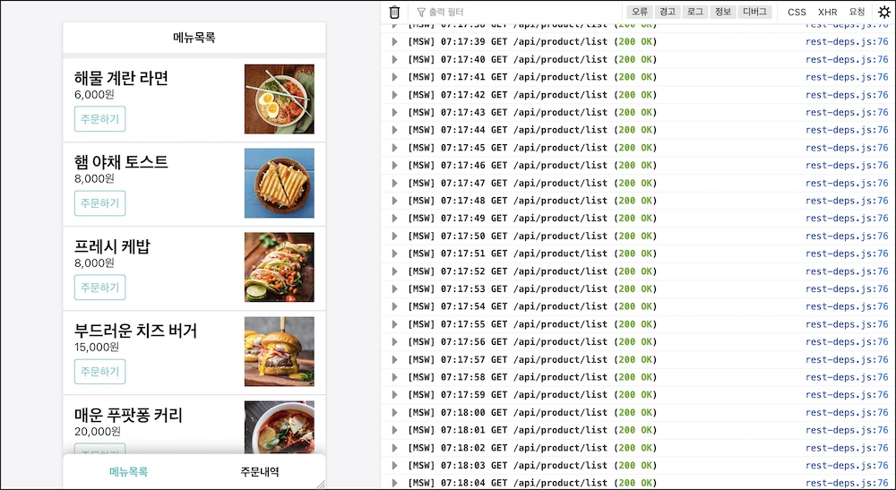
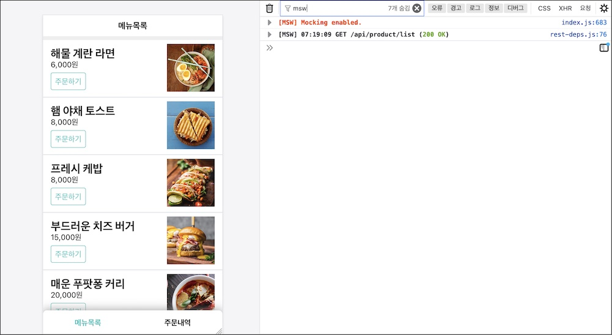
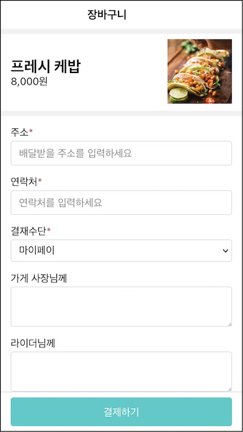
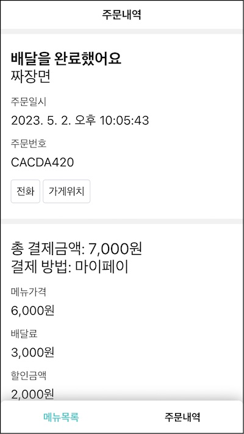

리액트 useState와 useEffect를 사용할 시간이다. 예제 프로그램을 다시 만들어 보자.

# 3.4.1 메뉴 목록 페이지

이제 각 화면을 구성하는 컴포넌트들을 리액트 훅을 사용한 함수 컴포넌트로 하나씩 바꿔 보겠다.

공통 컴포넌트부터 정리하자.

src/components/Page.jsx

```jsx{6}
const Page = ({ header, children, footer }) => (
  <div className="Page">
    <header>{header}</header>
    <main>{children}</main>
    <footer>{footer}</footer>
    {/* TODO: <DialogContainer /> */}
  </div>
)
```

다이얼로그 컨테이너를 주석처리 했다. 다이얼로그 컨택스트를 사용하는데 이후 컨택스트 훅을 다룰 때 구현할 것이다.

src/components/Title.jsx

```jsx{5}
const Title = ({ backUrl = "", children }) => {
  if (backUrl) {
    return (
      <>
        {/* TODO: <Link to={backUrl} /> */}
        <h1 style={{ paddingRight: "44px" }}>{children}</h1>
      </>
    )
  }

  return <h1>{children}</h1>
}
```

타이틀 컴포넌트 내부에 사용한 링크 컴포넌트를 주석 처리했다. 라우터 컨택스트를 사용하는데 이것도 컨택스트 훅을 다룰 때 구현할 것이다.

src/components/Navbar.jsx

```jsx{1,4,7}
// TODO: 라우터 연동
const Navbar = () => (
  <nav className="Navbar">
    <a href="/" className={"active"}>
      메뉴목록
    </a>
    <a to="/order" className={""}>
      주문내역
    </a>
  </nav>
)
```

Link컴포넌트를 사용한 부분인데 a 앨리먼트로 대체했다. 이것도 라우터 컨택스트를 다룰 때 구현할 것이다.

src/pages/ProductPage/OrderableProductItem.jsx

```jsx{3}
const OrderableProductItem = ({ product }) => {
  const handleClick = () => {
    // TODO: navigate(`/cart?productId=${product.id}`);
  }
  return <ProductItem product={product} onClick={handleClick} />
}
```

주소이동하는 부분을 주석처리했다. 이것도 라우터 컨택스트를 다룰 때 구현할 것이다.

ProductPage 컴포넌트를 수정하자. src/pages/ProductPage/index.jsx 파일이다.

```jsx{1,2}
const ProductPage = () => {
  const [productList, setProductList] = React.useState([])

  return (
    <div className="ProductPage">
      <Page header={<Title>메뉴목록</Title>} footer={<Navbar />}>
        <ul>
          {productList.map(product => (
            <li key={product.id}>
              <OrderableProductItem product={product} />
            </li>
          ))}
        </ul>
      </Page>
    </div>
  )
}
```

클래스 컴포넌트를 함수형 컴포넌트로 바꾸었다.

상품 목록을 상태로 관리하기 위해 기존에 this.state.productList로 관리하던 것을 useState를 사용해 함수 내부 변수로 관리했다. 훅에 빈 배열을 전달해 초기값을 지정했다. 훅은 이 상태와 세터를 튜플로 반환하는데 적절한 이름을 붙였다.

이 값을 리액트 앨리먼트 구성하는데 사용했다. productList를 이용해 OrderableproductItem을 리스트 렌더링 했다.

상품 api로 이 값을 채워 보자. 이전에는 컴포넌트 마운트 훅에 넣어서 fetch 메소드를 호출했다. 하지만 함수 컴포넌트라서 메소드나 생명주기가 없다. 함수 본문에 넣어보자.

```jsx{4,8,17}
const ProductPage = () => {
  const [productList, setProductList] = React.useState([]);

  const fetch = async () => {
    // TODO: startLoading();
    try {
      const productList = await ProductApi.fetchProductList();
      setProductList(productList);
    } catch (e) {
      // TODO: finishLoading();
      // TODO: openDialog(<ErrorDialog />);
      return;
    }
    // TODO: finishLoading();
  };

  fetch()

  return (
    <div className="ProductPage">
```

패치 메소드를 내부 변수로 옮겼다. 로딩이나 다이얼로그 관련한 로직은 컨택스트 훅 이후에 다룰 것이라서 우선 주석 처리 해두었다. 우리가 볼것을 fetch() 함수 호출 부분이다.

먼저 리액트는 프로덕트 페이지 컴포넌트 내부 로직을 순서대로 호출할 것이다. 상태를 초기화해서 프로덕트 목록 상태를 만든다. 내부에 정의한 패치 함수를 실행한다. 그리고 나서 리액트 앨리먼트를 반환한다. 리액트는 이걸 가지고 렌더링하고 돔에 반영할 것이다.

패치함수는 이후 언젠가 상품 조회 api가 완료되면 목록을 받아올 것이다. 이 목록은 setProductList에 의해 상태를 갱신할 것이다. 그러면 다시 컴포넌트를 렌더링하는 과정을 거친다.

```jsx
const App = () => <ProductPage />
```

App 컴포넌트다. 이전에는 요청 주소에 따라 페이지를 라우팅했는데 지금은 상품 목록 페이지만 두었다. 이후에 라우트를 다룰때 작업할 예정이다.

화면을 확인해 보자.



api를 계속 호출한다. 우리가 원하는 것은 딱 한 번만 호출해서 렌더링하는 것이 목적인데 말이다. 리액트가 동작하는 것을 다시 차근차근 확인해 보자.

리액트는 컴포넌트 내부 로직을 순서대로 호출할 것이다.

- 상태를 초기화한다.
- 내부 정의한 패치 함수를 실행한다.
- 리액트 앨리먼트를 반환한다.
- 상품 조회 api가 완료되면 목록을 받아 상태에 업데이트한다.
- 리액트는 다시 컴포넌트를 그린다.

이 과정을 계속 반복한 것이다. 리액트가 다시 컴포넌트를 그린다는 것은 함수를 실행하는 것이라서 렌더링했던 과정을 다시 반복하는 것이다. 페치 함수가 다시 호출될 것이고 언젠가 상태를 갱신해 컴포넌트를 렌더링하는 것이 원인이다.

데이터 패치라는 부수 효과를 1번만 실행하기 위해서는 부수 효과 훅을 사용하면 적절히 호출할 수 있다.

```jsx{7}
const ProductPage = () => {
  const [productList, setProductList] = useState([]);

  const fetch = async () => {
    // ...
  };

  React.useEffect(()=> fetch(), [])

  return (
    <div className="ProductPage">
```

의존성 배열을 빈배열을 전달했다. 변하지 않는 의존성이기 때문에 컴포넌트가 렌더링될때 딱 한 번 호출될 부수효과가 될 것이다.

그럼 리액트 렌더링 과정이 이전과 어떻게 달라졌을까?

1. 리액트가 함수를 실행한다.
1. 상태를 초기화 한다.
1. 패치를 부수효과로 등록한다. 리액트가 적절한 시점에 실행할 것이다.
1. 리액트 앨리먼트를 반환한다.
1. 리액트가 언젠가 실행한 부수효과가 api 요청을 완료해 상태를 업데이트 한다.

두번 째 렌더링이다.

1. 리액트가 함수를 다시 실행한다. (두번쨰)
1. 등록한 상태를 반환한다. 변경된 상태를 내 뱉는다.
1. 부수효과의 의존성이 변하지 않아서 실행하지 않는다.
1. 리액트 앨리먼트를 반환한다. 변경된 상태에 따라 이전과 다른 앨리먼트를 반환한다.



# 3.4.2 장바구니 페이지

장바구니 페이지를 함수형 컴포넌트로 작성할 차례다. 먼저 장바구니 페이지에서 사용할 컴포넌트들을 정리하자.

src/pages/OrderPage/OrderForm.jsx

```jsx{1,3,14,27}
const OrderForm = ({ onSubmit }) => {
  const getInputValueByName = name => {
    // todo
  }

  const handleSubmit = e => {
    e.preventDefault()

    const deliveryAddress = getInputValueByName("deliveryAddress")
    const deliveryContact = getInputValueByName("deliveryContact")
    const paymentMethod = getInputValueByName("paymentMethod")
    const messageToShop = getInputValueByName("messageToShop")
    const messageToRider = getInputValueByName("messageToRider")

    onSubmit({
      deliveryAddress,
      deliveryContact,
      paymentMethod,
      messageToRider,
      messageToShop,
    })
  }

  return (
    <form
      className="OrderForm"
      id="order-form"
      // TODO: ref={this.formRef}
      onSubmit={handleSubmit}
    >
      <FormControl label="주소" htmlFor="deliveryAddress" required>
        <input
          type="text"
          id="deliveryAddress"
          placeholder="배달받을 주소를 입력하세요"
          required
          autoFocus
        />
      </FormControl>
      <FormControl label="연락처" htmlFor="deliveryContact" required>
        <input
          type="text"
          id="deliveryContact"
          placeholder="연락처를 입력하세요"
          pattern="^\d{2,3}-\d{3,4}-\d{4}$"
          required
        />
      </FormControl>
      <FormControl label="결재수단" htmlFor="paymentMethod" required>
        <select name="paymentMethod" id="paymentMethod" value="">
          <option value="마이페이">마이페이</option>
          <option value="만나서 결제">만나서 결제</option>
        </select>
      </FormControl>
      <FormControl label="가게 사장님께" htmlFor="messageToShop">
        <textarea name="messageToShop" id="messageToShop"></textarea>
      </FormControl>
      <FormControl label="라이더님께" htmlFor="messageToRider">
        <textarea name="messageToRider" id="messageToRider"></textarea>
      </FormControl>
    </form>
  )
}
```

클래스 컴포넌트를 함수형 컴포넌트로 바꾸었다.

this.props 멤버 변수로 접근하던 인자를 내부 변수로 직접 사용했다.

이 컴포넌트는 레프 객체를 사용할 목적으로 클래스 멤버변수에 저장하려고 클래스 컴포넌트를 사용했다. 함수형 컴포넌트에서는 멤버 변수가 없기 때문에 이런 방식으로 레프 객체를 사용할수 없다. 이후 레프 훅을 다룰 때 작성하겠다. 우선은 주석 처리해 놓았다.

장바구니 화면을 담당하는 CartPage 컴포넌트 차례다. src/pages/CartPage/index.jsx 파일이다.

```jsx{1,2,4,24,25}
const CartPage = () => {
  const [product, setProduct] = React.useState()

  const handleSubmit = async values => {
    // TODO startLoading("결재중...");
    try {
      await OrderApi.createOrder(values)
    } catch (e) {
      // TODO:   finishLoading();
      //   TODO: openDialog(<ErrorDialog />);
      return
    }

    // TODO: finishLoading();
    // TODO: openDialog(<PaymentSuccessDialog />);
  }

  return (
    <div className="CartPage">
      <Page
        header={<Title backUrl="/">장바구니</Title>}
        footer={<PaymentButton form="order-form" />}
      >
        {product && <ProductItem product={product} />}
        <OrderForm onSubmit={handleSubmit} />
      </Page>
    </div>
  )
}
```

장바구니에 담을 상품을 저장할 상태를 정의했다. useState 훅을 사용하는데 초기값은 undefined다. product 상태와 setProduct 세터 함수를 내부 변수로 얻었다. 이 값을 사용해 반환할 리액트 앨리먼트를 구성한다.

OrderForm의 제출 이벤트 핸들러를 내부 변수로 정의해 컴포넌트 인자로 전달했다. 핸들러 내부에서는 로딩, 다이얼로그를 로직이 있는데 우선은 주석 처리했다. 이후 컨택스트 장에서 다룰 예정이다.

비어있는 product 상태를 채워줄 차례다. 상품 목록페이지에서 패치로직을 부수효과로 다룬것처럼 여기서도 마찬가지로 다루자.

```jsx{3,15,19,20}
const CartPage = () => {
  // ...
  const fetch = async (productId) => {
    // TODO: startLoading("장바구니에 담는중...");
    try {
      const product = await ProductApi.fetchProduct(productId);
      setProduct(product);
    } catch (e) {
      //    TODO: openDialog(<ErrorDialog />);
      return;
    }
    // TODO: finishLoading();
  };

  React.useEffect(() => {
    // TODO const productId = searchParams.get("productId");
    // TODO if (!productId) return;

    fetch("CACDA423");
  }, []);

  return (
    <div className="CartPage">
```

한 번만 호출하는 함수이기 때문에 부수효과의 의존성에 빈 배열을 전달했다. 이 부수 효과에서 api를 호출한뒤 상태를 갱신하더라도 다음 렌더링 단계에서는 부수효과를 다시 실행하지 않을 것이다.

부수 효과 안에서는 상품 아이디를 얻어오는 로직이 있는데 주석 처리했다. 이후 라우터를 다룰때 다룰 예정이다. 우선은 고정된 상품 아이디를 조회하도록 했다.

App에서 테스트해보자.

src/App.js

```jsx{4}
const App = () => (
  <>
    {/* <ProductPage /> */}
    <CartPage />
  </>
)
```

이전 절에서 테스트한 상품목록 페이지를 주석처리하고 이절에서 테스트할 장바구니 페이지 컴포넌트를 추가했다.



# 3.4.3 주문내역 페이지

마지막으로 주문내역 화면을 담당하는 OrderPage 차례다. src/pages/OrderPage/index.jsx 파일이다.

```jsx{1,2,6-12}
const OrderPage = () => {
  const [order, setOrder] = React.useState()
  return (
    <div className="OrderPage">
      <Page header={<Title>주문내역</Title>} footer={<Navbar />}>
        {order && (
          <>
            <OrderStatusCard order={order} />
            <OrderPaymentCard order={order} />
            <OrderDeliveryCard order={order} />
          </>
        )}
      </Page>
    </div>
  )
}
```

주문 상태를 담을 상태와 세터를 훅으로 얻었다. 이것을 리액트 앨리먼트로 그렸다.

이 상태를 채워줄 패치 로직을 부수효과로 등록하자.

```jsx{4,15-17}
const OrderPage = () => {
  const [order, setOrder] = React.useState();

  const fetch = async () => {
    // TODO:  startLoading('주문정보 로딩중...');
    try {
      const order = await OrderApi.fetchMyOrder();
      setOrder(order);
    } catch (e) {
      //  TODO:  openDialog(<ErrorDialog />);
      return;
    }
    // TODO: finishLoading();
  };

  React.useEffect(() => {
    fetch()
  }, []);

  return (
    <div className="OrderPage">
```

패치 함수를 내부에 정의했다. 로딩, 다이얼로그 관련 로직은 다음 장에서 다룰것이기 때문에 주석처리해 두었다. api를 호출해 데이터를 얻은 뒤 order 상태를 업데이트할 것이다.

한 번만 실행하는 부수효과이기 때문에 의존성에 빈배열을 전달했다. 패치 함수 내부에서 상태를 변경하더라도 다음 랜더링에서는 부수효과를 실행하지 않을 것이다.

src/App.js

```jsx{5}
const App = () => (
  <>
    {/* <ProductPage /> */}
    {/* <CartPage /> */}
    <OrderPage />
  </>
)
export default App
```

주문 내역 화면을 테스트하기 위해 다른 컴포넌트는 주석처리하고 이것만 렌더링했다.



# 3.4.4. 달라진 점

이번 장에서는 비교적 코드 양이 많다. 이전 1, 2장에 걸쳐 완성한 주문앱 샘플 어플리케이션의 세 개 화면을 모두 만들었기 때문이다.

이전에 클래스 컴포넌트로 만들던 것을 함수 컴포넌트로 바꿔서 다시 작성했다. 클래스 컴포넌트를 사용한 이유는 상태나 레프 객체를 멤버 변수로 관리하기 위해서였다. 컴포넌트 생명 주기에 따라 특정 시점에 데이터를 ajax로 불러오기 위한 목적도 있다.

함수형 컴포넌트로 다시 작성하면서 이런 부분을 어떻게 다루었는지가 **핵심**이다.

상태 관리는 useState 훅을 사용했다. 함수형 컴포넌트 안에서 이 훅을 사용하면 값을 담은 상태 변수와 이를 변경할 수 있는 세터 함수를 튜플 형식으로 제공받는다. 우리는 이 두 개를 적절한 이름을 붙여 사용했다. 클래스 컴포넌트에서는 this.state라는 멤버 변수로 접근했는데 이제는 내부변수 명으로 바로 사용할 수 있었다. 상태를 변경할때도 this.setState가 아니라 세터 함수를 그대로 호출한 부분이 차이점이다. (상태훅)

함수 컴포넌트에서 패치 로직을 가져왔다. ajax로 데이터를 비동기로 조회하고 세터함수로 상태를 갱신하는 로직이다. 리액트는 상태 변화를 감지하면 다시 컴포넌트를 렌더링하게되고 패치함수는 다시 호출될 것이다. 함수형 컴포넌트 안에서 외부 변화를 일으키는 것은 부수 효과이고 이것은 코드를 예측할수 없게 하기도 성능에 영향을 주기도 한다. 부수 효과를 잘 다루기 위해서 useEffect 훅을 사용했다. 이것을 통해 리액트에서 이펙트를 위임하고 컴포넌트 안에서는 본연의 역할만 수행한다. 특히 한번만 호출해야하는 패치함수는 의존성을 빈값을 전달해 한 번만 호출되도록 구현했다. (부수효과 훅)

클래스 컴포넌트에서는 라이프사이클 훅에 따라 한번만 호출되는 마운트 훅에 패치 로직을 작성했다. 여기서 상태가 변하면 렌더 메소드가 다시 동작하는데 이때는 this.state 상태를 가지고 그린다. 반면 함수 컴포넌트에서는 컴포넌트 내부 환경중 의존하는 것을 지정하고 이것에 따라 외부 환경을 동기화하는 작업을 훅이 담당했다. 리액트 앨리먼트는 렌더링 환경의 값을 고정하는 것이 다리다. (함수)

클래스 컴포넌트의 생성자 로직도 사라졌다. 핸들러에 디스를 바인딩하기 위해 사용했는데 상속 구조에 따라 슈퍼를 호출하는 코드도 추가해야했다. 반면 함수 컴포넌트는 핸들러가 내부 함수이기 때문에 디스를 다룰 필요가 없다. 그냥 함수 값을 전달하기만 하면 된다. (함수)

# 중간 정리

메뉴 목록 페이지

- 공통 컴포넌트 준비: Page, Title, Navbar, OrderableProductItem
- 라우터 기능 주석 처리. 컨택스트 훅에서 다룰 예정
- ProductPage: useState, useEffect 사용

장바구니 페이지

- OrderForm. 레프 훅에서 다룰 예정
- CartPage: useState, useEffect 사용

주문내역 페이지

- OrderPage: useState, useEffect 사용

달라진 점

- 상태 관리
- 부수효과 관리
- 클래스를 함수로
