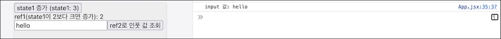

3편에서 학습한 기본 훅을 이용해 어플리케이션을 함수 컴포넌트로 다시 만들었다. 일부 남은 것이 있는데 레프 객체를 사용하는 부분이다.

- Dialog: 레프 객체로 앨리먼트에 접근, 버튼 포커스
- OrderForm: 제출 이벤트 처리 시 레프 객체로 입력 값 조회

# useRef 직접 만들기

함수 컴포넌트에서 레프 객체를 사용할 방법을 궁리해 보자. 컴포넌트가 렌더링되는 동안 계속 유지되어야할 값이라는 점에서 상태와 비슷하다. 상태를 변경하면 컴포넌트가 리랜더 되지만 레프 객체는 그렇지 않다는 점이 다르다.

MyReact에 useRef 훅을 구현해 보자.

```jsx{6-13}
const MyReact = (function MyReact() {
  const memorizedStates = []
  const isInitialized = []
  let cursor = 0

  function useRef(initialValue) {
    if (!isInitialized[cursor]) {
      memorizedStates[cursor] = { current: initialValue }
      isInitialized[cursor] = true
    }
    const memorizedState = memorizedStates[cursor]
    cursor = cursor + 1
    return memorizedState
  }

  return {
    useRef,
  }
})()
```

레프 객체를 저장하기 위해 memorizedStates 변수를 만들었다. 여러 훅을 지원하기 위해 배열을 사용했다. 레프 객체 초기화 여부를 기록하기 위한 배열 isInitialized도 있다. 호출 순서에 따라 이 두 배열의 값을 가리킬 커서도 0으로 초기화했다.

이어 useRef 훅을 정의했다. 초기값을 전달할 수 있도록 인자로 열어 두었다. 훅을 처음 호출할 경우 current에 이 값을 담은 객체를 생성해 내부 상태에 저장해 두었다.

다음 훅 호출부터는 기억해둔 값을 반환할 것이다.

훅을 테스트 해 보자.

```jsx{5,6,8,11,16,17}
const UseRefTest = () => {
  MyReact.resetCursor()

  const [state1, setState1] = React.useState(0)
  const ref1 = MyReact.useRef(1)
  const ref2 = MyReact.useRef("a")

  if (state1 > 2) ref1.current = ref1.current + 1

  const handleCount = () => setState1(state1 + 1)
  const handleSubmit = () => console.log("input 값:", ref2.current.value)

  return (
    <div>
      <button onClick={handleCount}>state1 증가 (state1: {state1})</button>
      <div>ref1(state1이 2보다 크면 증가): {ref1.current}</div>
      <input ref={ref2} />
      <button onClick={handleSubmit}>ref2로 인풋 값 조회</button>
    </div>
  )
}
```

리랜더링를 발생시키려고 상태 state1을 만들었다. 레프 객체가 렌더링과 무관하게 값을 유지하는지 확인하려는 목적이다.

이어서 레프 객체 ref1, re2를 만들었다. MyReact 내부 변수에 [{current: 1}, {current: "a"}] 값이 저장될 것이다.

상태 state1 > 2 조건이면 클릭할 때마다 ref1 값도 올리는 로직을 넣었다. 레프 객체의 값을 변경하고 유지되는지 확인하려는 목적이다.

증가 버튼을 클릭하면 상태 state1을 변경하고 컴포넌트를 다시 실행할 것이다. 렌더링 할 때마다 ref1 값이 어떻게 바뀌는지 아래 표시했다.

ref2는 인풋 앨리먼트에게 전달했다. 조회 버튼을 클릭하면 ref2를 통해 인풋 앨리먼트에 접근해 입력 값을 기록할 것이다.



# useRef 활용

간단하게 레프 훅을 구현했다. Dialog, OrderForm을 함수 컴포넌트로 바꾸고 리액트의 useRef를 사용하자.

src/components/Dialog.jsx

```jsx{2,4,11,17}
const Dialog = ({ header, children, footer }) => {
  const footerRef = React.useRef(null)

  React.useEffect(() => {
    if (!footerRef.current) return
    const buttons = Array.from(footerRef.current.querySelectorAll("button"))
    if (buttons.length === 0) return

    const activeButton = buttons[buttons.length - 1]
    activeButton.focus()
  }, [footerRef.current])

  return (
    <div className="Dialog">
      {header && <header>{header}</header>}
      <main>{children}</main>
      {footer && <footer ref={footerRef}>{footer}</footer>}
    </div>
  )
}
```

레프 객체를 멤버 변수로 사용했던 클래스 컴포넌트를 함수 컴포넌트로 바꾸면서 레프 훅을 사용했다. 훅 반환 값을 내부 변수 footerRef에 담았다.

이 값을 footer 앨리먼트에 전달했는데 렌더 후 돔에 마운트 되면 footerRef.current에 엘리먼트를 가리키는 값이 할당될 것이다.

다이얼로그가 렌더되면 이 값에 의존하는 부수효과가 동작한다. footer 앨리먼트 하위에 있는 button 찾아 마지막 앨리먼트에 포거스할 것이다.

pages/CartPage/OrderForm.jsx

```jsx{2,5,7,35}
const OrderForm = ({ onSubmit }) => {
  const formRef = React.useRef(null);

  const getInputValueByName = (name) => {
    if (!formRef.current) return "";

    const inputElement = formRef.current.elements.namedItem(name);
    if (!inputElement) return "";

    return inputElement.value;
  };

  const handleSubmit = (e) => {
    e.preventDefault();

    const deliveryAddress = getInputValueByName("deliveryAddress");
    const deliveryContact = getInputValueByName("deliveryContact");
    const paymentMethod = getInputValueByName("paymentMethod");
    const messageToShop = getInputValueByName("messageToShop");
    const messageToRider = getInputValueByName("messageToRider");

    onSubmit({
      deliveryAddress,
      deliveryContact,
      paymentMethod,
      messageToRider,
      messageToShop,
    });
  };

  return (
    <form
      className="OrderForm"
      id="order-form"
      ref={formRef}
      onSubmit={handleSubmit}
    >
```

form 앨리먼트를 가리킬 formRef 객체를 준비했다. 이 값을 ref 인자로 전달했다. 컴포넌트가 마운트되면 formRef.current에 form 앨리먼트를 가리키는 값이 할당될 것이다.

비어 있던 getInputValueByName 함수에 내용을 채웠다. formRef를 통해 폼 앨리먼트에 접근할 수 있다. 폼 하위 필드 이름을 받으면 찾아서 값을 반환하는 함수다.

# 역할

클래스 컴포넌트에서 사용하는 createRef와 비슷하다. createRef는 컴포넌트 인스턴스 멤버 변수로 등록해 사용했다.

함수 컴포넌트에서는 이러한 구조의 createRef 레프 객체 팩토리 함수를 사용할 수 없다. 함수가 호출될 때마다 새로운 레프 객체가 만들어질 것이기 때문이다. 함수가 여러 번 호출되더라도 지속되는 값을 제공해 주어야 한다. 상태 훅과 비슷한 구조다.

MyReact 안에 레프 객체를 담을 클로져 공간을 확보하고 여기에 값을 관리했다. 함수형 컴포넌트가 여러 번 호출되더라도 처음 호출할 때에만 객체를 초기값으로 생성하고 이후에는 저장된 값을 제공한다. 이런 방식으로 함수 컴포넌트 안에서 레프 객체를 제공했다.

--

함수 컴포넌트에서 레프 객체를 사용할 수 있게 레프 훅을 직접 만들어 보았다. 컴퍼넌트가 살아있는 동안 유지되는 값인데 렌더링에 영향을 주지 않는 것이 특징이다. 상태 훅과 비슷한 특징이라서 비슷하게 구혔했다. 값이 바뀌더라도 리렌더하지 않는점이 다르다.

실제 리액트의 것을 Dialog과 OrderForm에 활용했다. 클래스 컴포넌트에 멤버변수로 생성한 래프객체를 함수형컴포넌트의 훅으로 교체했다. 나머지는 클래스 컴포넌트의 것과 똑같다.

이것으로 1, 2편에 클래스 컴포넌트로 만들었던 어플리케이션을 모두 훅으로 바꾸었다. 다음 장부터는 어플리케이션을 개선하면서 나머지 리액트 훅에 대해 알아보자.

# 중간 정리

직접 만들기

- 함수 컴포넌트가 여러번 실행되더라도 지속되는 값이 필요
- MyReact 안에 레프 객체를 담을 클로져 공간 확보 (memorizedStates), 여기에 값을 관리
- 상태 훅과 비슷하지만 리랜더링 하지 않는 것이 차이

활용

- Dialog: 푸터 앨리먼트에 접근, 버튼 포커스
- OrderForm: 폼 앨리먼트에 접근, 입력 값 조회

역할

- 컴포넌트 리랜더링과 무관하게 지속할 수 있는 값을 제공

## 참고

- [리액트 Ref | 김정환블로그](/2022/05/31/react-ref)
