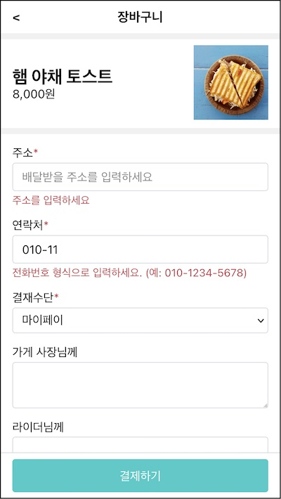

1편에서 주문 폼을 비제어 폼으로 구현했다. 입력 값을 브라우저의 상태 관리에 맞기고 검증도 브라우져의 기본 동작을 활용했다. 폼을 제출할 때 입력값을 얻기 위해 리액트 레프 객체를 연결했다.

이번에는 **제어 컴포넌트**로 폼을 변경해보자. 입력 값을 리액트 상태와 오류 메세지를 리액트 상태로 관리해 검증 기능을 커스터마이징할 수 있다. 폼을 제출할 때 입력값은 이 상태를 조회하기 때문에 기존 레프 객체사용하지 않아도 된다.

# 로그인 폼 예제

로그인 폼 예제를 통해 제어 폼을 만들어 보자. 먼저 입력값을 바인딩하고 폼 제출시 이것을 사용하도록 변경하자.

```jsx{2,7,14,20,26,27,33,34}
const LoginForm = () => {
  const [values, setValues] = React.useState({
    email: "",
    password: "",
  })

  const handleChange = e => {
    setValues({
      ...values,
      [e.target.name]: e.target.value,
    })
  }

  const handleSubmit = e => {
    e.preventDefault()
    console.log("Submitted", values)
  }

  return (
    <form onSubmit={handleSubmit}>
      <input
        type="text"
        name="email"
        placeholder="배달받을 주소를 입력하세요"
        autoFocus
        value={values.email}
        onChange={handleChange}
      />
      <input
        type="password"
        name="password"
        placeholder="연락처를 입력하세요"
        value={values.password}
        onChange={handleChange}
      />
      <button type="submit">로그인</button>
    </form>
  )
}
```

이메일과 비밀번호에 사용할 상태 values를 정의하고 리액트 앨리먼트에 바딩했다. 필드 값을 변경하면 handleChange에서 이 상태를 갱신할 것이다. 폼 제출 이벤트 처리기 handleSubmit에서 이 상태에 접근해 필드의 입력값을 조회할 수 있다.

OrderForm은 어떤 값도 필드에 바인딩하지 않았고 브라우저의 상태 관리를 사용했다. 이러한 것을 비제어 폼이라고 부른다.

한편 LoginForm은 상태값 values를 각 필드의 value에 전달했다. 그리고 필드 값을 변경하면 그 값을 handleChange에서 처리해서 사용한 상태값 values를 갱신한다. 리액트는 상태 변화를 감지하고 리렌더할 것이다. 다시 호출된 LoginForm은 변경된 values 값을 다시 인풋 필드에 전달할 것이다.

이처럼 리액트 상태와 앨리먼트를 동기화 시키는 것을 **제어 컴포넌트**라고 부른다. 여기서는 제어 폼이다.

제어폼은 리액트의 상태를 사용자가 제어할 수 있기 때문에 좀 더 손쉽게 기능을 확장할 수 있다.

- 필드 검사
- 오류 메세지

# 필드 검사

입력값을 리액트 상태로 관리했으니 이 값을 검사해 오류 메세지를 출력해 보자.

```jsx{6-9,11-25,37-39,45,52,59}
const LoginForm = () => {
  const [values, setValues] = React.useState({
    email: "",
    password: "",
  })
  const [errors, setErrors] = React.useState({
    email: "",
    password: "",
  })

  const validate = values => {
    const errors = {
      email: "",
      password: "",
    }

    if (!values.email) {
      errors.email = "이메일을 입력하세요"
    }
    if (!values.password) {
      errors.password = "비밀번호를 입력하세요"
    }

    return errors
  }

  const handleChange = e => {
    setValues({
      ...values,
      [e.target.name]: e.target.value,
    })
  }

  const handleSubmit = e => {
    e.preventDefault()

    const errors = validate(values)
    setErrors(errors)
    if (Object.values(errors).some(Boolean)) return

    console.log("Submitted", values)
  }

  return (
    <form noValidate onSubmit={handleSubmit}>
      <input
        type="text"
        name="email"
        value={values.email}
        onChange={handleChange}
      />
      {errors.email && <span>{errors.email}</span>}
      <input
        type="password"
        name="password"
        value={values.password}
        onChange={handleChange}
      />
      {errors.password && <span>{errors.password}</span>}
      <button type="submit">로그인</button>
    </form>
  )
}
```

검증한 결과를 담을 errors 객체를 만들었다. 입력 필드와 유사하게 이메일과 비밀번호 오류를 담을 수 있다.

오류는 validate 함수를 통해 설정된다. 입력 여부를 확인해 "xxx를 입력하세요"라는 텍스트를 설정했다.

검증 함수는 폼 제출시 호출했다. validate 결과를 오류 상태로 갱신한다. 오류가 있으면 폼 제출을 중단하고 함수를 종료하고 오류가 없으면 로그에 입력 값을 기록할 것이다.

오류 상태를 앨리먼트에 바인딩했다. 각 인풋 필드 아래에 오류 메세지를 조건부 렌더링하였다.

브라우져 기본 동작을 사용한 OrderForm은 오류 메세지를 브라우져별 정의한 형태로 오류 메세지를 보여주었다. 반면 리액트 상태로 제어폼을 만든 LoginForm은 브라우져와 무관하게 일관된 오류 메세지를 보여줄 수 있다.

브라우져 검증 기능을 끄기위해 form 앨리먼트에 noValidate 속성을 추가했다.

# 오류 메세지

폼을 제출하기 전에 오류 메세지를 보여주면 좋겠다. 사용자가 필드에 입력하기 시작하면 입력 값을 검증하고 즉각 피드백을 주겠다.

```jsx{5-7,24-30,39,41-43,48-50,60,62,70,72}
const LoginForm = () => {
  const [values, setValues] = React.useState({
    /* ... */
  })
  const [errors, setErrors] = React.useState({
    /* ... */
  })
  const [touched, setTouched] = React.useState({
    email: false,
    password: false,
  })

  const validate = values => {
    /* ... */
  }

  const handleChange = e => {
    const nextValues = {
      ...values,
      [e.target.name]: e.target.value,
    }
    setValues(nextValues)
  }

  const handleBlur = e => {
    setTouched({
      ...touched,
      [e.target.name]: true,
    })
  }

  const handleSubmit = e => {
    e.preventDefault()

    const nextTouched = {
      email: true,
      password: true,
    }
    setTouched(nextTouched)

    const errors = validate(values)
    setErrors(errors)
    if (Object.values(errors).some(Boolean)) return

    onSubmit(values)
  }

  React.useEffect(() => {
    setErrors(validate(values))
  }, [values])

  return (
    <form noValidate onSubmit={handleSubmit}>
      <div>
        <input
          type="text"
          name="email"
          value={values.email}
          onChange={handleChange}
          onBlur={handleBlur}
        />
        {touched.email && errors.email && <span>{errors.email}</span>}
      </div>
      <div>
        <input
          type="password"
          name="password"
          value={values.password}
          onChange={handleChange}
          onBlur={handleBlur}
        />
        {touched.password && errors.password && <span>{errors.password}</span>}
      </div>
      <button type="submit">로그인</button>
    </form>
  )
}
```

사용자가 입력 필드에 값을 입력하고나서 커서를 옮겼는지를 상태 touched로 관리했다. 입력 필드별로 각 터치 여부를 관리할수 있다.

인풋 필드의 블러 이벤트 처리기에서 이 상태를 갱신하도록 했다. 사용자가 무엇인가를 입력한다면 필드를 벗어나면 touched가 갱신될 것이다.

이 상태는 오류 앨리먼트를 렌더할 조건으로 사용했다. 무조건 오류를 출력하는 것이 아니라 터치 상태에 따라 조건부 렌더딩 한다. 사용자가 처음으로 필드에 커서를 옮기고 입력하면 오류 메세지가 보이지 않을 것이다. 터치 상태가 거짓이기 때문이다. 입력하고 커서를 옮길 때 블러 이벤트가 발생하고 이때 블러 이벤트 처리기에서 터치 상태를 참으로 바꿀것이다. 이 때 비로소 오류 메세지를 노출한다.

이것은 제출할 때 검증하는 것보다 더 일찍 사용자에게 피드백을 줄 수 있다. 값을 입력하는 시점에 무엇이 잘못되었는지 알 수 있어서 사용자가 올바른 값을 입력할 확률이 더 높다.

제출 이벤트가 발생하면 터치 상태를 모두 참으로 설정하고 밸리데이션을 한다. 제출 버튼을 클릭하면 모든 입력값을 검증한 뒤 결과를 표시할 것이다.

useEffect 사용해 부수효과를 추가했다. 입력 값이 바뀌면 밸리데이터하고 오류 상태를 갱신하는 로직이다.

비제어 컴포넌트인 OrderForm은 폼 제출을 해야만 검증 결과를 확인할 수 있었다. 반면 제어 컴포넌트인 LoginForm은 사용자가가 커서를 옮기는 시점 혹은 사용자가 입력하는 시점 등 검증 시점을 언제라도 쉽게 바꿀 수 있다. 리액트 상태로 관리하기 때문에 가능한 일이다.

# 커스텀 훅: useForm

폼은 횡단 관심사다. 다이얼로그와 라우터처럼 어플리케이션 전반에 사용되기 때문이다. 재사용할 수 있는 폼으로 개선하는 것이 이 절의 목표다.

LoginForm은 컴포넌트 내부에 상태와 이벤트 처리기 그리고 리액트 앨리먼트와 강하게 결합되어 재사용할 수 없는 구조다. 재사용할 수 있는 폼을 만들어 보겠다.

컴포넌트 안의 기능을 재사용하는 방법으로 고차함수와 훅을 배웠다. 이번에는 함수형 컴포넌트에서 활용할 수 있도록 리액트 훅 형태로 만들어 보자. src/lib/MyForm.tsx 파일을 만들고 useForm이란 커스텀 훅으로 로직을 옮기자.

```jsx{24-27}
export const useForm = ({ initialValues, validate, onSubmit }) => {
  const [values, setValues] = React.useState(initialValues)
  const [errors, setErrors] = React.useState({})
  const [touched, setTouched] = React.useState({})

  const handleChange = e => {
    const nextValues = {
      ...values,
      [e.target.name]: e.target.value,
    }
    setValues(nextValues)
  }

  const handleBlur = e => {
    setTouched({
      ...touched,
      [e.target.name]: true,
    })
  }

  const handleSubmit = e => {
    e.preventDefault()

    const nextTouched = Object.keys(values).reduce((touched, field) => {
      touched[field] = true
      return touched
    }, {})
    setTouched(nextTouched)

    const errors = validate(values)
    setErrors(errors)
    if (Object.values(errors).some(Boolean)) return

    onSubmit(values)
  }

  React.useEffect(() => {
    setErrors(validate(values))
  }, [values])

  return {
    values,
    errors,
    touched,
    handleBlur,
    handleChange,
    handleSubmit,
  }
}
```

필드 입력값, 오류메세지, 터치 여부를 상태를 훅 안으로 옮겼다. 다만 상태 초기값은 외부에서 전달하도록 initialValue로 열어 두었다. 상태 초기값은 폼을 사용하는 측, 가령 주문 폼의 관심사이기 때문에 외부에서 결정하도록 했다. validate 함수도 같은 이유로 인자로 열어 두었다.

각 핸들러 로직도 거의 비슷하게 들고 왔다. 제출 이벤트 처리기의 경우 내부에 터치 상태를 모두 참으로 설정하는 로직이 있는데 여기서는 상태 필드가 무엇이 들어올지 모르기 때문에 values의 키값 기준으로 새로운 객체를 만들었다. 이 부분이 다르다.

이렇게 만든 각 상태와 핸들러를 객체 리터럴로 감싸 만들어 반환했다. 이것을 기존 로그인 폼에 활용해 보자.

```jsx
const LoginForm = () => {
  const {
    values,
    errors,
    touched,
    handleChange,
    handleBlur,
    handleSubmit,
  } = MyForm.useForm({
    initialValues: { email: "", password: "" },
    validate: values => {
      const errors = {}

      if (!values.email) {
        errors.email = "이메일을 입력하세요"
      }
      if (!values.password) {
        errors.password = "비밀번호를 입력하세요"
      }

      return errors
    },
    onSubmit: values => {
      console.log("Submitted", values)
    },
  })

  return /* .. */
}
```

컴포넌트 내부 상태로 사용하던 것은 모두 커스텀 훅 useForm에서 제공받았다. 이 값은 리액트 앨리먼트에 그대로 전달될 것이다.

훅을 만들때 열어두었던 초기 값과 밸리데이터를 LoginForm이 전달했다. LoginForm이 사용할 필드에 해당하는 상태 email과 password를 알고 있기 때문이다. 또한 이 두 값을 검증하는 로직도 알고 있기 때문에 validate 인자로 전달했다.

이처럼 LoginForm에서 재사용할수 있는 역할만 추려서 useForm 훅으로 분리했다.

# getFieldProps

코드 스캐폴딩을 좀 줄여보자. 필드에 입력할 반복 코드를 줄이도록 getFieldProps를 훅에서 제공하도록 하자.

```jsx{3-14,18,23-25,30,34}
const useForm = ({ initialValues, validate, onSubmit }) => {
  /* ... */
  const getFieldProps = name => {
    const value = values[name]
    const onBlur = handleBlur
    const onChange = handleChange

    return {
      name,
      value,
      onBlur,
      onChange,
    }
  }

  return {
    /* ... */
    getFieldProps,
  }
}

const LoginForm = () => {
  const { getFieldProps } = MyForm.useForm({
    /* ... */
  })

  return (
    <form noValidate onSubmit={handleSubmit}>
      <div>
        <input type="text" {...getFieldProps("email")} />
        {touched.email && errors.email && <span>{errors.email}</span>}
      </div>
      <div>
        <input type="password" {...getFieldProps("password")} />
        {touched.password && errors.password && <span>{errors.password}</span>}
      </div>

      <button type="submit">로그인</button>
    </form>
  )
}
```

인풋 필드에 전용 프롭을 만드는 getFieldProps 함수를 훅 안에 추가했다. 필드 이름을 인자로 받아 value, onBlur, onChange로 이뤄진 객체를 반환하는 함수다.

훅에서 이 함수를 뽑아서 리액트 앨리먼트에서는 객체 해체 문법으로 사용했다. 이전에 하나씩 값을 전달한 것에 비해 코드가 많이 줄었다.

# 리액트 컨택스트: Form, ErrorMessage

오류 메세지를 보이기 위해 훅을 통해 제공받은 값을 출력했다. 이것을 더 간편하게 컨택스트로 변경해 보겠다.

```jsx{1,2,4,15,24}
const formContext = React.createContext({})
formContext.displayName = "FormContext"

const Form = ({ children, ...rest }) => {
  const formValue = useForm(rest)
  return (
    <formContext.Provider value={formValue}>
      <form noValidate onSubmit={formValue.handleSubmit}>
        {children}
      </form>
    </formContext.Provider>
  )
}

const Field = ({ as = "input", children, ...rest }) => {
  const { getFieldProps } = React.useContext(formContext)
  return React.createElement(
    as,
    { ...rest, ...getFieldProps(rest.name) },
    children
  )
}

const ErrorMessage = ({ name }) => {
  const { touched, errors } = React.useContext(formContext)
  if (!touched[name] || !errors[name]) return null
  return <span>{errors[name]}</span>
}
```

폼 컨택스트를 하나 만들었다. Form 컴포넌트는 이 컨택스트에게 데이터를 전달하는 제공자 역할을 한다. 안에서 useForm 훅으로 값을 만들어 컨택스트 제공자에게 메세지를 전달한다. form 앨리먼트를 반환하는데 훅에서 얻은 handleSubmit 전달했다.

Field와 ErrorMessage는 컨택스트를 소비하는 컴포넌트다. 컨택스트를 통해 제공되는 useForm 반환 값을 이용해 필드 앨리먼트를 반환한다. ErrorMessage도 훅의 값을 컨택스트에게 전달 받아 오류 메세지를 포함한 리액트 앨리먼트는 반환한다.

이렇게 컨택스트를 사용하는 것으로 개선하면 이런 모양으로 사용할 수 있다.

```jsx{20,24,25-30}
const LoginForm = () => {
  const validate = values => {
    const errors = {
      email: "",
      password: "",
    }

    if (!values.email) {
      errors.email = "이메일을 입력하세요"
    }
    if (!values.password) {
      errors.password = "비밀번호를 입력하세요"
    }

    return errors
  }
  const handleSubmit = values => console.log("Submitted", values)

  return (
    <MyForm.Form
      initialValues={{ email: "", password: "" }}
      validate={validate}
      onSubmit={handleSubmit}
    >
      <MyForm.Field type="text" name="email" />
      <MyForm.ErrorMessage name="email" />
      <MyForm.Field type="password" name="password" />
      <MyForm.ErrorMessage name="password" />
      <button type="submit">로그인</button>
    </Form>
  )
}
```

훅에 전달할 초기값을 폼 컴포넌트에 전달했다. 안에서 필드와 에러메세지 컴포넌트를 간편하게 사용할 수 있다.

리액트 앨리먼트까지도 재사용할 수 있도록 MyForm으로 분리했다.

# 활용: OrderForm

MyForm을 샘플 프로젝트에 적용할 차례다. 비제어 폼인 OrderForm을 제어 폼으로 바꾸겠다.

```jsx{2,18-30,35,37-42,48,50-54,57,60,63,66,68}
const OrderForm = ({ onSubmit }) => {
  const validate = values => {
    const errors = {}
    if (!values.deliveryAddress) {
      errors.deliveryAddress = "주소를 입력하세요"
    }
    if (!values.deliveryContact) {
      errors.deliveryContact = "연락처를 입력하세요"
    }
    if (!/^\d{2,3}-\d{3,4}-\d{4}$/.test(values.deliveryContact)) {
      errors.deliveryContact =
        "전화번호 형식으로 입력하세요. (예: 010-1234-5678)"
    }
    return errors
  }

  return (
    <MyForm.Form
      id="order-form"
      className="OrderForm"
      initialValues={{
        deliveryAddress: "",
        deliveryContact: "",
        paymentMethod: "",
        messageToRider: "",
        messageToShop: "",
      }}
      validate={validate}
      onSubmit={onSubmit}
    >
      <FormControl
        label="주소"
        htmlFor="deliveryAddress"
        required
        error={<MyForm.ErrorMessage name="deliveryAddress" />}
      >
        <MyForm.Field
          type="text"
          name="deliveryAddress"
          placeholder="배달받을 주소를 입력하세요"
          autoFocus
        />
      </FormControl>
      <FormControl
        label="연락처"
        htmlFor="deliveryContact"
        required
        error={<MyForm.ErrorMessage name="deliveryContact" />}
      >
        <MyForm.Field
          type="text"
          name="deliveryContact"
          placeholder="연락처를 입력하세요"
        />
      </FormControl>
      <FormControl label="결재수단" htmlFor="paymentMethod" required>
        <MyForm.Field as={"select"} name="paymentMethod">
          <option value="마이페이">마이페이</option>
          <option value="만나서 결제">만나서 결제</option>
        </MyForm.Field>
      </FormControl>
      <FormControl label="가게 사장님께" htmlFor="messageToShop">
        <MyForm.Field as="textarea" name="messageToShop" />
      </FormControl>
      <FormControl label="라이더님께" htmlFor="messageToRider">
        <MyForm.Field as="textarea" name="messageToRider" />
      </FormControl>
    </MyForm.Form>
  )
}
```

밸리데이션 함수를 포함해 Form에 전달할 기본값을 준비했다. Form은 인자로 받은 값으로 useForm을 호출할 것이다. 이 값은 폼 컨택스트를 통해 Field나 ErrorMessage까지 전달될 것이다.

Form 아래 Field와 ErrorMessage를 사용했다. name 속성만 전달하면 폼 값에 접근해 각자의 역할을 수행할 것이다.

로그인 예제와 다른 부분이 두 가지다.

- Form에 id 전달
- ErrorMessage 렌더 위치

폼에 아이디와 className을 전달하려면 MyForm.Form 인자를 열어야 한다.

```jsx{1,5}
const Form = ({ id, className, children, ...rest }) => {
  const formValue = useForm(rest)
  return (
    <formContext.Provider value={formValue}>
      <form id={id} className={className} onSubmit={formValue.handleSubmit}>
        {children}
      </form>
    </formContext.Provider>
  )
}
```

ErrorMessage는 FormControl에서 그리도록 전달했다. error 인자를 열어 주어야 한다.

```jsx{1,8}
const FormControl = ({ label, htmlFor, required, children, error }) => (
  <div className="FormControl">
    <label htmlFor={htmlFor}>
      {label}
      {required && <span className="required">*</span>}
    </label>
    {children}
    {error && <div className="error">{error}</div>}
  </div>
)
```

오류 인자를 받아서 있으면 렌더링하도록 했다.

이제 장바구니의 주문폼은 이렇게 동작할 것이다.



# 중간 정리

제어 컴포넌트

- 로그인 폼 예제. 입력값 바인딩과 제출 이벤트 처리
- 필드 검사와 오류 메세지

제어 폼을 재활용하기 위한 MyForm

- useForm:
  - 제어 컴포넌트, 검증 실행, 오류 메세지 렌더 역할
  - 사용하는 측에서는 용도에 따라 초기값과 밸리데이터 전달
- getFieldProps
- 리액트 컨택스트: Form, Field, ErrorMessage

OrderForm 개선

- 기존: 레프 객체를 이용한 비제어 컴포넌트
- 변경: 리액트 상태를 이용한 제어 컴포넌트

폼 관련 라이브러리

- [formik](https://github.com/jaredpalmer/formik)
- [react-hook-form](https://github.com/react-hook-form/react-hook-form)

## 참고

- [리액트로 폼(Form) 다루기 | 김정환블로그](/dev/2022/03/29/react-form-and-formik.html)
