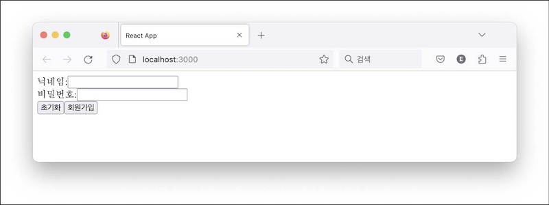
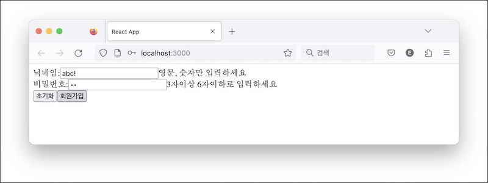

리듀서 훅에 대해 알아보자. 상태 훅으로 상태를 관리하다가 규모가 커지고 관리 방식이 복잡해질 즈음에 꺼내는 훅이다. 둘의 역할이 비슷해 인터페이스나 구조도 유사할 것 같다. 훅을 만들면서 구조를 이해하고 차이도 짚어 보겠다.

# 회원가입 폼 예제

이번엔 회원가입 폼을 예제로 다루겠다. 필드에 입력값을 검사하고 오류 메세지를 보여주는 기능이 있다. 입력값과 오류 메세지로 구성한 객체를 정의하자.

```jsx
function RegisterForm() {
  const [state, setState] = React.useState({
    value: { nickname: "", password: "" },
    error: { nickname: "", password: "" },
  })

  return (
    <>
      <div>
        <label>닉네임:</label>
        <input
          type="text"
          name="nickname"
          value={state.value.nickname}
          onChange={handleChange}
        />
        <span>{state.error.nickname}</span>
      </div>
      <div>
        <label>비밀번호:</label>
        <input
          type="password"
          name="password"
          value={state.value.password}
          onChange={handleChange}
        />
        <span>{state.error.password}</span>
      </div>
      <button onClick={handleReset}>초기화</button>
      <button onClick={handleSubmit}>회원가입</button>
    </>
  )
}
```

상태 state.value를 각 인풋 필드에 연결하고 검증 결과를 상태 state.error에 바인딩한 구조다. 이어서 폼 초기화 버튼과 제출 버튼(회원가입)을 나란히 배치했다.

각 엘리먼트 이벤트 핸들러에 상태 갱신 로직을 정의할 차례다.

```jsx
const handleChange = e => {
  setState({
    ...state,
    value: {
      ...state.value,
      [e.target.name]: e.target.value,
    },
  })
}

const handleReset = _ => {
  setState({
    value: { nickname: "", password: "" },
    error: { nickname: "", password: "" },
  })
}

const handleSubmit = _ => {
  setState({
    ...state,
    error: {
      nickname: /^\w+$/.test(state.value.nickname)
        ? ""
        : "영문, 숫자만 입력하세요",
      password: /^.{3,6}$/.test(state.value.password)
        ? ""
        : "3자이상 6자이하로 입력하세요",
    },
  })
}
```

handleChange는 필드 입력값을 상태에 갱신한다. 리액트 앨리먼트에 바인딩했기 때문에 닉네임이나 비밀번호를 입력하면 화면에 표시될 것이다.

handleReset은 모든 입력값과 오류값을 초기화 한다. 초기화 버튼을 클릭하면 입력 필드의 값이 사라질 것이다.

handleSubmit은 입력값을 검증하고 결과를 상태 state.error에 저장한다. 입력값에 문제가 있다면 오류 메세지를 화면에 표시할 것이다. 그렇지 않으면 오류 메세지는 보이지 않는다.





# 진단

이 코드에 문제가 있는 것은 아니다. 적당하게 useState를 사용해 상태를 관리하고 각각의 이벤트 핸들러에서 상태를 변경하는 것이 마땅해 보인다.

필드 갯수가 많을 때 문제가 될 수 있다. 그만큼 상태가 커지고 관리하는 로직이 복잡해지기 때문이다. 코드 읽기도 어렵다.

가령 주소와 전화번호 필드를 추가한다고 하자. 지역 번호에 따라 검증하는 로직이 달라질 수 있는데 서울 주소를 입력하면 주소 필드의 상태를 갱신할 뿐만 아니라 전화번호도 02로 시작하는지 검증하는 식이다. 전화번호 입력 오류를 디버깅하려면 한 컴포넌트에 있는 주소와 연락처 상태를 다루는 코드를 뒤져야 한다.

역할이 비대해서 문제라면 다른 객체로 분리하는 것이 쉬운 해결 접근법이다. 커스텀 훅으로 분리하는 것은 어떨까?

```jsx
function useRegisterForm() {
  const [state, setState] = useState({
    value: { nickname: "", password: "" },
    error: { nickname: "", password: "" },
  })

  const handleChange = () => {
    /* 생략 */
  }
  const handleReset = () => {
    /* 생략 */
  }
  const handleSubmit = () => {
    /* 생략 */
  }

  return {
    state,
    handleChange,
    handleReset,
    handleSubmit,
  }
}
```

상태관리 로직만 훅으로 옮겼다. 컴포넌트 코드는 줄었다.

```jsx
function RegisterForm() {
  const { state, handleChange, handleReset, handleSubmit } = useRegisterForm()
  return <div>{/* 생략 */}</div>
}
```

상태를 훅으로 비워낸 컴포넌트에는 리액트 앨리먼트 코드만 남았다. 언뜻 문제를 해결한 것처럼 보인다.

- 그러나 상태 관리의 복잡성은 여전하다. 변화를 추적하려면 여러 핸들러를 뒤져야 하는데 핸들러는 상태 로직만 담당한다고 보장할 수 없다. 여러 부수 효과를 관리하는 등 상태와 무관한 로직이 담겨 있을 수 있기 때문이다. 여전히 상태 변화를 추적하기 어렵다.

- 코드 재사용 관점은 어떨까? 안타깝게도 이 훅은 회원가입 컴포넌트에서만 사용할 수 있다. 다른 컴포넌트에서 사용하려면 회원 가입이라는 로직이 없어야 한다. 이것을 외부에서 주입하는 구조여야 재사용할 수 있을 것이다.

단지 주어진 상태를 시키는대로 변경하고 변경된 것을 알려주는 것이 **이 녀석**의 남은 임무가 될 것이다.

# 스토어

이제부터 이 녀석을 **스토어**라고 부르자. 역할은 상태를 가지고 있고 변경하면 외부에 알리는 것이다.

먼저 스토어 객체를 만드는 팩토리부터 시작해 보자.

```jsx
function createStore(reducer, initialValue) {
  let currentState = initialValue
  const listeners = []

  const getState = () => currentState
  const subscribe = callback => listeners.push(callback)

  const dispatch = action => {
    const nextState = reducer(currentState, action)
    if (nextState !== currentState) {
      currentState = nextState
      listeners.forEach(listener => listener())
    }
  }

  return { getState, subscribe, dispatch }
}
```

- 리듀서(reducer)라는 함수와 초기 값을 인자로 받았다. 초기값은 현재 상태(currentState)로 저장해 두었다. 이 값을 조회할 용도의 getState()도 만들었다. 리듀서는 이 상태를 변경하는 함수이다. 즉 상태와 상태 변경 방법을 **외부**에서 정하는 것이다.

- 상태 변화를 구독하기 위한 콜백 배열(listeners)을 두었다. 외부에서 구독 함수(subscribe)를 호출해 구독자를 넘겨주면 이 배열에 차곡차곡 쌓아둘 것이다.

- 마직막에 디스패치(dispatch) 함수가 특별하다. 이것은 액션(action)이라는 객체를 받아 현재 상태와 함께 리듀서에게 전달한다. 외부에 있는 리듀서는 이 두 값을 이용해 다음 상태를 계산할 것이다. 외부에 있는 객체들이 각자의 상황에 맞게 상태를 변경해야하는데 이러한 변경을 리듀서 함수로 열어 둔 것이다.

- 디스패치는 리듀서의 반환 값과 현재 상태를 비교해 두 값이 다르면 상태가 변경된 것으로 판단한다. 변경된 상태를 갱신하고 구독자들에게 이를 알리는 것까지가 디스패치의 역할이다.

스토어를 사용해 보면 구조를 이해하는데 도움이 될 것이다.

```jsx
function reducer(state, action) {
  if (action.type === "count") {
    return { ...state, value: state.value + 1 }
  }
  throw "알 수 없는 액션"
}

const initialValue = { value: 0 }
const store = createStore(reducer, initialValue)

console.log("after createStore:", store.getState()) // { value: 0 }

store.subscribe(() => console.log("subscribe:", store.getState()))
store.dispatch({ type: "count" }) // { value: 1 }
```

- 리듀서를 정의했다. 스토어에서 요구한 인터페이스에 따라 상태와 액션을 인자로 받는 함수다. 액션별로 다음 상태를 계산하는 것이 리듀서의 역할이다. 액션 count는 값을 하나 올릴 것이다.

- 이어서 스토어의 초기 상태를 0으로 정의했다.

- 리듀서와 초기 상태를 스토어 생성 함수로 전달해 스토어 객체를 만들었다. 생성 직후 스토어 상태를 확인하면 초기값을 반환한다.

- 상태 변화를 구독하기 위해 콜백을 등록했다. 스토어는 상태가 변할 때 이 콜백 함수를 호출하는데 여기서는 변경된 상태 값을 기록했다.

- 디스패치를 실행해 상태를 변경해 달라고 스토어에게 요청했다. 상태 변경을 위한 최소한의 정보인 액션을 전달한다. 스토어는 외부에서 전달한 액션을 받고 이를 현재 상태와 함께 리듀서로 전달할 것이다. 리듀서는 액션 타입에 따라 다음 상태를 반환한다.

- 스토어는 리듀서가 계산한 상태와 현재 스토어가 가지고 있는 상태를 비교한다. 변경을 감지하면 구독자들에게 이를 알리는데 등록한 콜백함수를 실행한다. 여기서는 변경된 상태를 로깅할 것이다.

이상 일련의 과정에서 중요한 것은 상태 변경 로직을 **리듀서와 스토어로 격리**했다는 것이다.

사용자 객체의 상태관리 로직을 리듀서가 담당하고 나머지 상태관리 로직을 스토어가 담당하는 구조다. 사용자 객체는 상태 변경를 위한 최소한의 정보인 액션만 스토어에 전달하고 자신만의 역할을 수행할 수 있다.

리듀서 덕분에 사용자 객체 역할이 줄어 가독성을 높일 수 있다. 상태관리 로직도 재사용할 수 있게 되었다.

# useReducer

컴포넌트에서도 역할 분리와 가독성의 효과가 있는지 확인해 보자. 훅 형태로 제공하는 것이 먼저다.

몇 가지 요구사항을 정리해 보자.

1. 스토어 값을 리액트 앨리먼트에 사용한다. (스토어 → 컴포넌트)
1. 컴포넌트가 스토어에게 변경을 요청할 수 있다. (컴포넌트 → 스토어)
1. 스토어의 변경된 값을 리액트 앨리먼트에 반영한다. (컴포넌트 리랜더링)

useState를 흉내냈던 것처럼 비슷한 구조로 만들 수 있겠다.

```jsx{23-36,40}
const MyReact = (() => {
  const memorizedStates = []
  const isInitialized = []

  function createStore(reducer, initialValue) {
    let currentState = initialValue
    const listeners = []

    const getState = () => currentState
    const subscribe = callback => listeners.push(callback)

    const dispatch = action => {
      const nextState = reducer(currentState, action)
      if (nextState !== currentState) {
        currentState = nextState
        listeners.forEach(listener => listener())
      }
    }

    return { getState, subscribe, dispatch }
  }

  function useReducer(reducer, initialValue) {
    const { forceUpdate } = useForceUpdate()

    if (!isInitialized[cursor]) {
      memorizedStates[cursor] = createStore(reducer, initialValue)
      isInitialized[cursor] = true
    }

    const store = memorizedStates[cursor]
    store.subscribe(forceUpdate)
    cursor = cursor + 1

    return [store.getState(), store.dispatch]
  }

  return {
    // ...
    useReducer,
  }
})()
```

useReducer란 이름으로 MyReact 모듈 안에 만들었다. 스토어 여러 개를 저장하기 위해 memorizedStates 배열을 두었다. 컴포넌트에서 훅을 여러 번 사용할 수 있어서 배열을 사용했다. 훅이 처음 실행되었을 때를 식별하기 위한 isInitialized 배열도 정의했다. 두 배열의 인덱스를 지정하기 위한 커서(cursor)도 있다.

useReducer는 스토어 팩토리처럼 리듀서와 초기 값을 인자로 받아 스토어를 만든다. 스토어 객체를 배열에 넣어 두고 초기화되었다고 표시해 다음부터는 만들어둔 객체를 사용한다.

이어 스토어 변경 사항을 구독한다. 변경된 값을 리액트 앨리먼트에 반영하려면 리액트 렌더 사이클이 실행되어야 한다. subscribe에 forceUpdate를 전달했다. 커서가 0으로 초기화되고 컴포넌트를 다시 렌더링할 것이다(요구사항 3 해결). 예제에서는 이렇게 만들었지만 실제 리액트의 훅은 리액트 렌더링 과정에 맞게 구현되어 있을 것이다.

마지막으로 스토어 상태와 이를 변경하기 위한 디스패치 함수를 튜플로 반환한다. 컴포넌트에서는 스토어 상태로 리액트 앨리먼트를 만들 것이다(요구사항 1 해결). 특정 시점에는 컴포넌트가 스토어에게 상태 변경을 요청할 것인데 이 디스패치를 사용할 것이다(요구사항 2 해결).

# 컴포넌트에서 사용

useReducer를 컴포넌트에서 사용하려면 두 가지를 준비해야 한다.

- 초기 상태
- 리듀서

회원가입 폼에 맞게 초기 상태를 정의했다.

```jsx
const initialValue = {
  value: {
    nickname: "",
    password: "",
  },
  error: {
    nickname: "",
    password: "",
  },
}
```

각 필드에 바인딩 할 상태를 value에 준비했다. 닉네임과 비밀번호를 저장할 것이다. 이에 상응하는 오류 메세지는 error를 준비했다. useState로 정의한 초기값과 똑같다.

useState를 사용할 때는 컴포넌트에서 세터 함수로 상태를 제어한 반면, useReducer를 사용할 때는 리듀서가 이 상태를 변경할 것이다. 스토어가 알려준 현재 상태와 사용자가 발행할 액션 객체를 인자를 받는 리듀서 함수를 정의할 차례다.

```jsx
const reducer = (state, action) => {
  if (action.type === "SET_FIELD") {
    return {
      ...state,
      value: {
        ...state.value,
        [action.name]: action.value,
      },
    }
  }
  if (action.type === "RESET") {
    return {
      value: {
        nickname: "",
        password: "",
      },
      error: {
        nickname: "",
        password: "",
      },
    }
  }
  if (action.type === "VALIDATE") {
    return {
      ...state,
      error: {
        nickname: /^\w+$/.test(state.value.nickname)
          ? ""
          : "영문, 숫자만 입력하세요",
        password: /^.{3,6}$/.test(state.value.password)
          ? ""
          : "3자이상 6자이하로 입력하세요",
      },
    }
  }
  throw Error("알 수 없는 액션")
}
```

리듀서 관례에 따라 type을 기준으로 액션을 식별한다.

- SET_FIELD: 필드 값 할당
- RESET: 필드 초기화
- VALIDATE: 필드 값 검증

각 액션에 대한 각자 상태 변경 로직이 다르다. 이도 저도 아닌 액션에 대해서는 예외를 던져 어플리케이션을 중단하도록 안전조치를 취했다.

useState를 사용할 때는 상태 변경 로직이 컴포넌트 안에 있어서 앨리먼트를 만드는 함수와 섞여 있었다. 이제는 전자를 리듀서 함수로 빼내 컴포넌트에는 리액트 앨리먼트를 만드는 역할만 남았다.

단순히 커스텀 훅으로 빼보기도 했지만 코드를 재사용할 수 없었다. useReducer는 리듀서 함수를 상황에 맞게 정의해서 전달 받기 때문에 스토어의 값을 조회하고 계산하고 변경하는 로직은 도메인에 무관하게 재사용할 수 있다.

드디어 useReducer를 컴포넌트에서 사용할 수 있다.

```jsx{2}
const RegisterForm = () => {
  const [state, dispatch] = MyReact.useReducer(reducer, initialValue)

  const handleChange = e =>
    dispatch({ type: "SET_FIELD", name: e.target.name, value: e.target.value })

  const handleReset = e => dispatch({ type: "RESET" })

  const handleSubmit = e => dispatch({ type: "VALIDATE" })

  return /* 생략. 리액트 앨리먼트를 반환한다. */
}
```

useReducer를 사용했다. 상태를 초기화하고 수정하는 로직은 리듀서를 포함한 스토어의 역할이기 때문에 컴포넌트는 이 코드 한 줄이면 상태 관리 방법을 제공받을 수 있다.

각각의 핸들러는 스토어에게 액션만 발행했다. 구체적인 상태 변경 로직은 리듀서 안에 있기 때문에 여기서는 상태 변경을 위한 최소한의 정보만 전달한다. 이전에는 핸들러 안에 상태 변경의 세부 구현이 있었지만 지금은 최소한의 정보만 남았다.

# useState 다시 보기

useReducer를 만들다보니 useState와 비슷한 것 같다. 상태를 갱신한다는 구조는 같지만 전자는 방법이 여러 개이고 후자는 하나다. 방법이라는 것은 액션인데 한 가지 액션만 처리하는 리듀서가 바로 useState 아닐까?

```jsx
function useState(initialState) {
  // 이전 상태를 무시하고 액션으로 받은 값을 다음 상태로 반환한다.
  function reducer(_, action) {
    return action
  }

  // useReducer를 이 특별한 리듀서와 조합해서 useState를 만든다.
  return useReducer(reducer, initialState)
}
```

리액트에서도 이 두 훅을 함께 정의하고 useReducer를 조합해 useState를 정의하는 것 같았다(참고: [basicStateReducer](https://github.com/facebook/react/blob/05777ffb01515679d73541062a4ecc745af04a2f/packages/react-reconciler/src/ReactFiberHooks.js#L1038)).

```jsx
function updateState(initlaState) {
  return updateReeducer(basicStateReducer, initialState)
}

function basicStateReducer(state, action) {
  return typeof action === "function" ? action(state) : action
}
```

# 활용: MyForm

MyForm에 있는 상태를 리듀서로 교체해 보자. 기존 파일을 그대로 두고 새로운 파일을 만들겠다. 상태로 관리하는 것과 리듀서로 관리하는 것을 비교해 보기 위해서다.

src/lib/MyForm-reducer.jsx

```jsx{6}
const formContext = // ...
const Form = // ...
const Field = // ...
const ErrorMessage =  // ...

const getInitialState = (values) => ({
  values,
  errors: {},
  touched: {},
});
```

스토어에 저장할 초기 상태를 생성하는 함수를 정의했다. 폼 초기 값을 values로 받아 values, errors, touched 필드로 구성된 객체를 반환한다. 각자 상태로 관리하던 것을 하나로 합쳤다.

이 상태를 변경할 리듀서를 정의 하자.

```jsx{1}
const formReducer = (state, action) => {
  if (action.type === "SET_VALUES") {
    return {
      ...state,
      values: {
        ...state.values,
        [action.name]: action.value,
      },
    }
  }
  if (action.type === "SET_TOUCHED") {
    return {
      ...state,
      touched: {
        ...state.touched,
        [action.name]: true,
      },
    }
  }
  if (action.type === "SET_TOUCHED_ALL") {
    return {
      ...state,
      touched: Object.keys(state.values).reduce((touched, field) => {
        touched[field] = true
        return touched
      }, {}),
    }
  }
  if (action.type === "VALIDATE") {
    return {
      ...state,
      errors: action.validate(state.values),
    }
  }

  throw new Error(`Unknown action: ${action}`)
}
```

정의한 초기 상태와 액션 인자를 받는 리듀서 함수다. 액션 타입에 따라 상태를 갱신하는 로직이다. 타입별 역할은 다음과 같다.

- SET_VALUES: 입력값 갱신
- SET_TOUCHED: 필드 방문 표시
- SET_TOUCHED_ALL: 모든 필드 방문 표시
- VALIDATE: 필드 검사

각 상태를 갱신하던 로직을 SET_VALUES 액션으로 대채할 것이다. 이 액션은 필드이름 name과 입력값 value를 가지고 있어서 이 값으로 단일 상태의 변경할 위치를 정확히 찾을 수 있다.

각 필드 방문 표시를 SET_TOUCHED 액션으로 대체할 것이다. 이 액션은 필드이름 name을 가지고 있어서 상태의 변경 위치를 정확히 찾을 것이다. SET_TOUCHED_ALL은 모든 필드에 방문 표시하는 액션이다.

밸리데이션 로직은 VALIDATE 액션으로 대체할 것이다. 이 액션은 validate 함수를 가지고 있어서 상태에 저장된 입력값을 전달해 검사하고 결과를 에러 상태에 기록할 것이다.

이제 초기 useReducer 훅을 사용할 준비를 마쳤다. 두 값을 사용해 훅을 사용해 보자.

```jsx{2-5,8-12,16,22-26,30,44,45,48}
export function useForm({ initialValues, validate, onSubmit, }) {
  const [state, dispatch] = React.useReducer(
    formReducer,
    getInitialState(initialValues)
  );

  const handleChange = (e) => {
    dispatch({
      type: "SET_VALUES",
      name: e.target.name,
      value: e.target.value,
    });
 };

  const handleBlur = (e) => {
    dispatch({ type: "SET_TOUCHED", name: e.target.name });
 };

  const handleSubmit = (e) => {
    e.preventDefault();

    dispatch({ type: "SET_TOUCHED_ALL" });
    const nextState = formReducer(state, { type: "VALIDATE", validate });
    if (Object.values(nextState.errors).some(Boolean) return;

    onSubmit(nextState.values);
  };

  const getFieldProps = (name) => {
    const value = state.values[name];
    const onBlur = handleBlur;
    const onChange = handleChange;

    return {
      name,
      value,
      onBlur,
      onChange,
    };
  };

  React.useEffect(() => {
    dispatch({type: 'VALIDATE', validate})
  }, [state.values]);

  return {
    ...state,
    handleChange,
    handleBlur,
    handleSubmit,
    getFieldProps,
  };
}
```

useReducer를 호출해 상태와 디스패치 함수를 얻었다. 전달한 초기값을 포함해 훅이 동작할 때마다 갱신된 상태가 state에 저장될 것이다. 상태를 변경하기 위해서는 dispatch에 액션을 전달하면 된다.

handleBlur 핸들러에 SET_TOUCHED 액션과 VALIDATE 액션을 전달했다. 블러 이벤트가 발생하면 필드 방문 표시후 필드 값을 검사할 것이다.

handleChange 핸들러에 SET_VALUES 액션과 VALIDATE 액션을 전달했다. 필드에 값을 입력하면 상태에 이 값을 저장하고 곧장 상태를 검사할 것이다.

handleSubmit 핸들러에 SET_TOUCHED_ALL 액션을 전달했다. 폼을 제출하면 모든 필드에 방문 표시를 할 것이다. 이후 VALIDATE 액션을 발행하는데 dispatch를 사용하지 않고 다른 방식으로 전달했다.

검증 후 오류가 있으면 폼 제출을 멈춰야 한다. 디스패치로 밸리데이트 액션을 발행하게 되면 검증 결과를 곧장 얻을 수 없다. state에는 검증 전 값이 들어있을 것이다. 디스패치하면 상태가 변경될 것이고 이것으로 인한 변경된 상태는 다음 렌더순서 전달 될 것이기 때문이다.

따라서 VALIDATE 액션 결과의 상태를 조회해야하는데 이를 위해 리듀서를 직접 호출했다. 현재 상태와 액션을 전달하면 다음 상태를 반환하는 것이 리듀서의 역할이기 때문이다. 이렇게 반환한 상태에는 검증 결과값이 있기 때문에 이를 뒤져서 오류 여부를 계산했다.

마지막으로 스토어가 반환한 상태를 반환 객체에 담았다. 이를 사용하는 쪽에 제공할 의도다.

# 역할

useReducer를 사용하면서 두 가지 좋은 점을 발견했다.

첫째, 컴포넌트 안에 있던 상태관리 로직을 분리할 수 있다. 리듀서 함수가 이 역할을 한다. 자바스크립트 배열의 리듀서 메소드와 이름이 같은데 컬랙션으로 이뤄진 여러 객체 배열을 하나의 객체로 줄이는 것이 이 메소드의 역할이다. useReducer도 컴포넌트의 상태 관리 로직을 가져가 컴포넌트의 부담을 줄여기 때문에 이름도 이렇게 짓지 않았을까?

둘째, 상태 관리 로직의 일부를 재사용할 수 있었다. 회원가입을 제외한 로직이다. 상태를 조회하고 이전 상태와 리듀서가 계산한 다음 상태를 비교한다. 그리고 상태 변경을 감지하면 외부로 알려주는 것. 이 세가지가 useReducer의 역할인데 이는 어떤 컴포넌트에서건 재사용할 수 있다.

이 훅이 항상 좋은 것 만은 아니다. 상태 규모가 작다면 오히려 나쁜 선택일 수 있다. 몇 개 안되는 상태를 관리하기 위해 스토어와 리듀서를 만드는 부담 때문이다. 배보다 배꼽이 더 크다. 어쩌면 예제로 든 회원가입 폼이 그렇수 있다. 단순히 useState로 해결하는게 더 나은 경우도 있으니 상황에 맞게 판단해야한다. 트레이드오프다.

여러 상태로 관리하던 것을 useReducer 훅으로 하나의 상태로 관리했다. 둘 다 좋은 코드라서 남겨두었다. 이것도 상황에 따라 선택할 수 있다.

# 중간 정리

문제 진단

- 회원가입 예제
- 상태가 많아지면 관리 코드가 비대 우려. 재활용 어려움.

스토어

- 상태 관리 역할을 위임
- 내부 상태. 변경 통지

리듀서 훅

- 내부 스토어. 변경시 리랜더
- 상태 훅과 비교. 트레이드 오프
- MyForm을 리듀서 버전으로 구현

역할

- 상태 관리
- 재사용

## 참고

- [리액트 useReducer는 어떤 모습일까?| 김정환블로그](/dev/2023/03/29/use-reducer.html)
- [basicStateReducer](https://github.com/facebook/react/blob/05777ffb01515679d73541062a4ecc745af04a2f/packages/react-reconciler/src/ReactFiberHooks.js#L1038)
