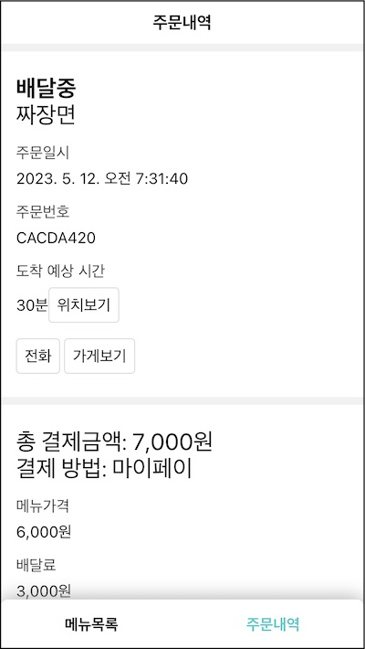

메모이제이션. 캐시로 성능을 높이는 프로그래밍 기법이다.

이번에는 메모이제이션에 대해 알아본 뒤 리액트의 useMemo와 useCallback을 살펴볼 것이다. 각 훅을 직접 만들어 구조를 파악하고 리액트 성능 개선 방법을 이해한다.

# 메모이제이션

n이 자연수일 때 1에서 n까지의 곱을 계승 또는 팩토리얼이라고 한다. 알고리즘 문제로 많이 사용하는 것인데 재귀 단골 손님이다.

```js
function factorial(n) {
  if (n === 0) return 1
  return n * factorial(n - 1)
}
```

n을 하나씩 줄여가며 함수를 호출하기 때문에 인자가 조금만 크면 함수를 여러 번 호출할 것이다.

```
f(2) = 2 * f(1) * f(0)
           f(1) = 1 * f(0)
                      f(0) = 1
                  f(0) = 1
→ 4회 호출: f(2), f(1), f(0), f(0)

f(3) = 3 * f(2) * f(1) * f(0)
           f(2) = 2 * f(1) * f(0)
                      f(1) = 1 * f(0)
                                 f(0) = 1
                              f(0) = 1
                   f(1) = 1 * f(0)
                              f(0) = 1
                          f(0) = 1
→ 8회 호출: f(3), f(2), f(1), f(0), f(0), f(1), f(0), f(0)
```

재귀 특성상 함수를 여러번 호출하는데 비용이 비싸다. 호출 횟수를 줄이기 위한 방법으로 메모이제이션을 사용한다. 호출한 값을 저장해 두어 다음에는 함수를 호출하지 않고 저장해둔 값을 사용하는 아이디어다.

```js
const lookupTable = {}
function factorial(n) {
  if (n === 0) return 1
  if (lookupTable[n]) return lookupTable[n]

  const v = n * factorial(n - 1)
  lookupTable[n] = v
  return v
}
```

계산한 값을 저장했다가 나중에 사용할 용도로 조회 테이블(lookupTable)을 만들었다. 언젠가 같은 인자로 함수를 호출하면 다시 계산하지 않고 여기에 저장한 값을 찾아 반환할 용도이다.

이전과 함수 호출 횟수를 비교해 보자.

```
f(2) = 2 * f(1) * f(0)
           f(1) = 1 * f(0)
                      f(0) = 1
→ 3회 호출: f(2), f(1), f(0)

f(3) = 3 * f(2) * f(1) * f(0)
           f(2) = 2 * f(1) * f(0)
                      f(1) = 1 * f(0)
                                 f(0) = 1
→ 4회 호출: f(3), f(2), f(1), f(0)
```

f(n-1)을 호출하기 전에 조회 테이블에서 미리 계산한 값을 찾아 사용한다. 함수 호출 횟수를 줄인만큼 시간을 절약할 수 있다.

# useMemo

메모이제이션 기법은 컴포넌트 안에서도 사용할 수 있다. 인자를 이용해 계산하는 함수가 컴포넌트 안에 있을 경우 이를 어딘가에 캐쉬해 사용하는 방법이다.

게시물 목록을 필터링해서 보여주는 Board 컴포넌트 예시를 준비했다.

```jsx
const Board = ({ posts, tag }) => {
  const filterPosts = () => {
    console.log("filterPosts")
    return posts.filter(post => (tag ? post.tag === tag : true))
  }
  const filteredPosts = filterPosts()

  return (
    <ul>
      {filteredPosts.map(({ id, content, tag }) => (
        <li key={id}>
          {content} <span>#{tag}</span>
        </li>
      ))}
    </ul>
  )
}
```

Board는 포스트 목록과 태그를 인자로 받는데 태그로 목록을 필터하는 내부 함수(filterPosts)를 가진다. 필터링된 게시물(filteredPost)로 리액트 앨리먼트를 반환하는 것이 이 컴포넌트의 역할이다.

게시물 갯수에 따라 컴포넌트는 리액트 앨리먼트를 늦게 반환하는데 바로 filterPosts가 원인이다. 데이터가 많을수록 함수 계산양도 증가하고 인자가 바뀔 때마다 계산할 것이다. 컴포넌트는 매 랜더링마다 리액트 앨리먼트를 늦게 반환하게 된다.

컴포넌트가 매번 필터링하지 않고 어딘가 값을 저장해서 활용한다면 좀더 빨리 리액트 앨리먼트를 반환할 수 있을 것이다. 성능개선한 팩토리얼 함수처럼.

정리하면 컴포넌트가 실행될 때마다 필터링 계산을 할지 말지 정하는 문제다. 리랜더 하더라도 일관된 비교 로직을 만들어야하기 때문에 지금까지 해 온것처럼 훅으로 분리하게 적당해 보인다. 훅에서 인자를 기억하고 있다가 같으면 캐쉬 값을 사용하고 다르면 다시 계산하는 것이다.

리액트에서 이러한 용도로 useMemo 훅을 제공하는데 같은 이름으로 MyReact 모듈 안에 만들어 보겠다.

```jsx{5-24,28}
const MyReact = (() => {
  const memorizedStates = []
  let cursor = 0

  function useMemo(nextCreate, deps) {
    if (!memorizedStates[cursor]) {
      const nextValue = nextCreate()
      memorizedStates[cursor] = [nextValue, deps]
      cursor = cursor + 1
      return nextValue
    }

    const nextDeps = deps
    const [prevValue, prevDeps] = memorizedStates[cursor]
    if (prevDeps.every((prev, idx) => prev === nextDeps[idx])) {
      cursor = cursor + 1
      return prevValue
    }

    const nextValue = nextCreate()
    memorizedStates[cursor] = [nextValue, nextDeps]
    cursor = cursor + 1
    return nextValue
  }

  return {
    // ...
    useMemo,
  }
})()
```

메모이제이션 관련한 값을 저장하기 위해 memorizedStates 배열을 정의했다. 컴포넌트에서 사용한 각 훅의 캐시 저장소 배열이다. 커서(cursor)로 현재 훅에서 사용할 값을 가리킬 수 있다. 팩토리얼 예제의 조회 테이이블과 같은 역할이다.

memorizedState가 비었으면 처음 실행되는 것이다. 비싼 계산을 하고 결과를 저장한다. 이후에 훅이 호출될 경우 캐시 값 사용 여부를 정해야하는데 기준으로 삼을 의존성 배열 deps도 함께 저장했다. 첫 호출이니깐 곧장 계산한 값을 반환한다.

다음 호출부터는 의존성이 바뀌었는지를 확인할 것이다. 이전 캐시 값(prevValue)과 이전 의존성(prevDeps)을 조회 테이블에서 가져왔다. 다음 의존성 배열과 비교해 변한 게 없다면 캐쉬를 반환한다.

의존성 배열에 있는 값이 변경되었다면 다시 비싼 계산을 하고 결과를 캐시에 저장한다. 이 값을 곧장 반환해 새로운 값을 사용하도록 외부에 알린다.

훅을 사용해보자.

```jsx{2,8}
function Board = ({ posts,  tag }) => {
  MyReact.resetCursor()

  function filterPosts() {
    console.log('filterPosts')
    return posts.filter(post => tag ? post.tag === tag : true)
  }
  const filteredPosts = MyReact.useMemo(filterPosts, [posts, tag])

  return (
    <ul>
      {filteredPosts.map(post => (
        <li key={id}>
          {content} <span>#{tag}</span>
        </li>
      ))}
    </ul>
  )
}
```

필터 함수를 바로 호출하지 않고 useMemo로 메모이제이션 했다. 의존성으로 전달한 post와 tag가 변하지 않으면 필터 함수를 다시 호출하지 않고 캐시 값을 즉시 반환할 것이다. 두 값이 달라졌을 때만 필터 함수를 실행해 새로운 계싼 결과를 내놓을 것이다.

# memo

useMemo로 컴포넌트 내부함수를 메모이제이션 했다. 이전에는 컴포넌트를 실행할 때마다 계산했지만 이제는 단 한 번만 계산하고 이후 인자가 변하지 않는한 캐쉬 값을 사용할 것이다.

이번에는 **렌더링 관점**에서 최적화 해보자. useMemo로 비싼 필터 함수를 메모이제이션했지만 컴포넌트의 로직에 따라서는 반환하는 리액트 앨리먼트가 달라질 수도 있는데 리액트는 이 컴포넌트를 다시 렌더링할 것이다.

useMemo로 비싼 계산 결과를 메모이제이션 했기 때문에 이 값을 사용한 리액트 앨리먼트도 최적화했으면 좋겠다. 항상 같은 리액트 앨리먼트를 반환할 것이 뻔한데 다시 렌더링하는 것은 낭비기 때문이다. 우리가 이런 낭비를 두고 볼 수만은 없지 않은가?

재현할 수 있는 코드를 준비하자.

```jsx{5,15-18}
function Board = ({ posts, tag }) => {
  console.log('Board rendered')
  MyReact.resetCursor()

  const [darkTheme, setDarkTheme] = React.useState(false)

  function filterPosts() {
    console.log('filterPosts')
    return posts.filter(post => (tag ? post.tag === tag : true))
  }
  const filteredPosts = MyReact.useMemo(filterPosts, [posts, tag])

  return (
    <>
      <div>
        <button onClick={() => setDarkTheme(!darkTheme)}>테마 변경</button>
        <span>{darkTheme ? "어두운 테마" : "밝은 테마"}</span>
      </div>
      <hr />
      <ul>
        {filteredPosts.map(post => (
          <li key={id}>
            {content} <span>#{tag}</span>
          </li>
        ))}
      </ul>
    </>
  )
}
```

다크테마 여부를 기억할 상태(darkTheme)를 추가했다. 이 값을 표시하고 토글 버튼도 두었다. 상태가 바뀌면 컴포넌트를 다시 그릴 것이다.

리랜더될 때 메모이제이션한 값인 filteredPosts로 리액트 앨리먼트를 만드는 부분도 다시 그려질 것이다. 비싼 비용의 필터 함수 결과를 캐시해놨는데 다른 상태의 변경에 쉽게 영향 받는 게 아깝다.

**컴포넌트 자체**도 메모이제이션 하자. 인자를 받고 앨리먼트를 반환하는 함수이기 때문에 비슷한 구조로 다룰 수 있겠다. 리액트처럼 memo라는 이름의 함수를 정의하겠다.

```jsx{2-20,25}
const MyReact = (() => {
  function memo(TargetComponent) {
    return (nextProps) => {
      if (!TargetComponent.memorizedState) {
        const nextValue = React.createElement(TargetComponent, nextProps)
        TargetComponent.memorizedState = [nextValue, nextProps]
        return nextValue
      }

      const [prevValue, prevProps] = TargetComponent.memorizedState
      const sameProps = Object.keys(nextProps).every((key) => {
        return nextProps[key] === prevProps[key];
      });
      if (sameProps) return prevValue;

      const nextValue = React.createElement(TargetComponent, nextProps)
      TargetComponent.memorizedState = [nextValue, nextProps]
      return nextValue
    }
  }

  return {
    // ...
    useMemo
    memo
  }
})();
```

memo는 컴포넌트를 인자로 받아 실행하고 리액트 앨리먼트를 반환하는 함수를 반환한다. 고차함수다. 이 컴포넌트가 받을 이름을 nextProps라 하고 인자로 받는 함수를 반환했다.

컴포넌트가 함수이기 때문에 함수의 memorizedState 속성을 추가해 메모이제이션할 값을 저장했다. 컴포넌트를 처음 렌더링할 때에는 값이 비었기 때문에 컴포넌트를 실행한 리액트 앨리먼트와 인자를 캐시했다. 곧장 이 리액트 앨리먼트를 반환한다.

다음 렌더링에서는 캐쉬한 값을 사용한다. 이전 인자와 현재 인자를 비교해 같다면 캐시 값을 곧장 반환한다. 이전과 같은 객체를 반환하기 때문에 리액트는 이 컴포넌트를 다시 그리지 않을 것이다.

인자가 바뀌었다면 컴포넌트를 실행해 리액트 앨리먼트를 다시 계산할 것이다. 이 값으로 캐시를 갱신하고 반환한다.

memo를 사용해 컴포넌트를 메모이제이션 해보자.

```jsx{1}
const FilteredPosts = MyReact.memo(({ value }) => {
  console.log("FilteredPosts")
  return (
    <ul>
      {(value || []).map(post => (
        <li key={id}>
          {content} <span>#{tag}</span>
        </li>
      ))}
    </ul>
  )
})
```

포스트 목록을 렌더링하는 리액트 앨리먼트를 FilteredPosts란 이름의 컴포넌트로 떼어냈다. 이 컴포넌트는 useMemo로 메모이제이션했던 filteredPosts를 인자로 받을 것이다. memo 함수로 이 컴포넌트를 감쌌기 때문에 인자가 변하지 않는한 리액트 앨리먼트는 캐시한 값을 사용할 것이다.

메모이제이션한 컴포넌트를 기존의 보드 컴포넌트에서 사용하자.

```jsx{10,17}
function Board = ({ posts, tag }) => {
  MyReact.resetCursor()

  const [darkTheme, setDarkTheme] = React.useState(false)

  function filterPosts() {
    return posts.filter(post => (tag ? post.tag === tag : true))
  }

  const filteredPosts = MyReact.useMemo(filterPosts, [posts, tag])

  return (
    <>
      <div>{darkTheme ? "어두운 테마" : "밝은 테마"}</div>
      <button onClick={() => setDarkTheme(!darkTheme)}>테마 변경</button>
      <hr />
      <FilteredPosts value={filteredPosts} />
    </>
  )
}
```

메모이제이션한 값를 메모이제이션한 컴포넌트의 인자로 전달했다. 이 컴포넌트는 테마가 변경되어 보드 컴포넌트를 다시 그리더라도 메모이제이션한 컴포넌트만큼은 다시 그리지 않을 것이다. 메모이제이션한 인자가 바뀌지 않는한 memo 함수에 의해 항상 같은 리액트 앨리먼트를 반환하기 때문이다.

# useCallback

이벤트 핸들러를 추가해 보자.

```jsx{2-4,8}
const Board = ({ post, tag }) => {
  const handleClick = postId => {
    console.log("handleClick", postId)
  }

  return (
    // ...
    <FilteredPosts value={filteredPosted} onClick={handleClick} />
  )
}
```

useMemo와 memo로 비싼 함수와 컴포넌트를 메모이제이션 했지만 handleClick을 추가하면서 다시 불필요한 리랜더링이 발생할 수 있다. handleClick은 보드 컴포넌트가 렌더링될 때마다 새로운 값으로 할당되기 때문이다. 객체 리터럴처럼 함수 리터럴도 매번 새로운 값을 만들어 컴포넌트 인자로 전달할 것이다. memo는 이를 새로운 값으로 인지하고 리액트 앨리먼트를 다시 계산할 것이다.

함수도 값이기 때문에 useMemo로 이 값을 메모이제이션할 수 있다.

```jsx{2-4,8}
function Board = ({ posts, tag }) => {
  const handleClick = MyReact.useMemo(() => (postId) => {
    console.log('handleClick', postId)
  }, [])

  return (
    {/* 생략 */}
    <FilteredPosts value={filteredPosted} onClick={handleClick} />
  )
}
```

handleClick 함수 리터럴을 메모이제이션했다. 의존성 배열이 비었기 때문에 리액트는 항상 초기 값만 사용할 것이다.

useMemo는 메모이제이션할 값을 반환하는 팩토리 함수를 첫 인자로 받는데 여기서는 함수를 메모이제이션할 것이기 때문에 고차 함수 형태로 전달했다. 읽는데 헷갈리니깐 함수를 전용 메모이제이션 훅을 제공하는 것이 낫겠다. 리액트처럼 useCallback훅을 MyReact에 추가하자.

```jsx{4-6,12}
const MyReact = (function MyReact() {
  // ...

  function useCallback(callback, deps) {
    return useMemo(() => callback, deps)
  }

  return {
    // ...
    useMemo
    memo,
    useCallback,
  }
})();
```

이름에서 알 수 있듯이 콜백을 메모이제이션한다. 값을 반환하는 팩토리가 아니라 콜백을 바로 받았다. 캐시 값 사용 여부를 비교하기 위한 의존성 배열도 받았다.

함수 본문은 useMemo를 조합했다. 첫 번째 인자가 메모이제이션할 값을 반환하는 함수이기 때문에 콜백을 반환하는 함수 형태로 전달했다.

이 훅을 사용해 좀 더 간편하게 콜백을 메모이제이션할 수 있다.

```jsx{4-6}
const Board = ({ posts, tags }) => {
  // ...

  const handleClick = MyReact.useCallback(postId => {
    console.log("handleClick", postId)
  }, [])

  return <FilteredPosts value={filteredPosted} onClick={handleClick} />
}
```

고차 함수를 전달하지 않고 메모이제이션할 함수를 전달했다.

# 균형 (Trade-off)

팩토리얼 함수를 최적화하기 위해 모든 함수 호출을 기록해서 캐쉬했다. 함수를 호출할 때마다 조회 테이블에 기록해 한 번이라도 호출했던 함수와 인자는 캐쉬값을 그 결과로 사용했다.

반면 useMemo는 최근 이전값 하나만 캐시에 저장했는데 이 부분이 서로 다르다. 호출한 모든 값을 기록하면 성능이 더 좋을텐데 왜 이렇게 구현했을까? 리액트도 이런 식이다(참고: [mountMemo, updateMemo](https://github.com/facebook/react/blob/dd5365878da2fe88a34dcdbb07d8297a78841da4/packages/react-reconciler/src/ReactFiberHooks.js#L2311)).

```js{5-6,13-14,22-23}
function mountMemo(nextCreate, deps) {
  const hook = mountWorkInProgressHook()
  const nextDeps = deps === undefined ? null : deps
  const nextValue = nextCreate()
  // 튜플 형태로서 최근 하나의 값만 캐시한다
  hook.memoizedState = [nextValue, nextDeps]
  return nextValue
}

function updateMemo(nextCreate, deps) {
  const hook = updateWorkInProgressHook()
  const nextDeps = deps === undefined ? null : deps
  // 캐시한 값이 하나 뿐이다.
  const prevState = hook.memoizedState
  if (nextDeps !== null) {
    const prevDeps: Array<mixed> | null = prevState[1]
    if (areHookInputsEqual(nextDeps, prevDeps)) {
      return prevState[0]
    }
  }
  const nextValue = nextCreate()
  // 값이 변경되면 이전 캐시값을 최근 계산한 값으로 교체한다.
  hook.memoizedState = [nextValue, nextDeps]
  return nextValue
}
```

두 가지 이유라고 생각한다. 첫째는 의존성 배열을 기준으로 캐시여부를 계산하는 구조 때문이다. 훅 인터페이스에 따라 의존성은 배열 리터럴을 사용하는데 컴포넌트를 렌더링 할 때마다 새로운 값을 받을 것이다. 따라서 이 값을 기준으로 캐시 여부를 판단할 수는 없다. 의존성 배열 안에 있는 값을 하나씩 비교해야 한다.

둘째는 성능과 관련 있을 것이라고 생각한다. 메모이제이션은 속도는 빠르지만 그만큼 자원을 더 사용한다. 캐시한 값을 메모리에 저장하기 때문이다. 모든 함수 결과를 캐시한다면 메모리 공간이 크게 증가할 것이다. 속도와 메모리 사이의 균형을 맞추기 위해 캐시를 하나만 둔다는 트레이드오프의 산물이 아니었을까?

# 활용: OrderStatusCard

다시 우리 프로젝트로 돌아오자. 리액트의 메모이제이션을 사용해 볼 차례다. 주문 페이지에 기능을 하나 추가할 것이다. 예상 배송 시간을 추가하자.

```jsx{2,3,5,14,16,39-47}
const OrderStatusCard = ({ order }) => {
  const { status, orderDate, id, position = [] } = order
  const { openDialog, closeDialog } = MyLayout.useDialog()

  const calculateDeliveryMinute = () => {
    console.log("calculateDeliveryMinute")

    const 오랜시간 = 99999
    for (let i = 0; i < 오랜시간; i++) {}

    if (!position[0]) return "-"
    return `${position[0]}분`
  }
  const expectedDeliveryMinutes = calculateDeliveryMinute()

  const handleClick = () => {
    openDialog(
      <Dialog footer={<Button onClick={closeDialog}>확인</Button>}>
        <ul>
          <li>위도: {position[0]}</li>
          <li>경도: {position[1]}</li>
        </ul>
      </Dialog>
    )
  }

  return (
    <Card
      header={
        <>
          <strong>{status}</strong>
          <br />
          짜장면
        </>
      }
      data={[
        { term: "주문일시", description: orderDate },
        { term: "주문번호", description: id },
        {
          term: "도착 예상 시간",
          description: (
            <>
              {expectedDeliveryMinutes}
              <Button onClick={handleClick}>위치보기</Button>
            </>
          ),
        },
      ]}
      footer={
        <>
          <Button>전화</Button>
          <Button>가게보기</Button>
        </>
      }
    />
  )
}
```

주문 상태 카드에 예상 도착시간을 계산하는 로직을 추가했다. 정말 계산하는 것이 아니라 반복문으로 오랜 계산을 흉내냈다. 컴포넌트가 실행되면 매번 예상 도착시간을 계산에 expectedDeliveryMinutes에 함수 결과값을 할당할 것이다.

또한 위치 보기라는 핸들러 함수도 추가했다. 배송 기사의 위치를 확인할 수 있는 다이얼로그를 띄우는데 위도 경도 정보를 표시할 것이다. 이 핸들러 함수도 컴포넌트가 실행할 때 마다 새로운 값이 할당될 것이다.

이 두 값은 리액트 앨리먼트를 구성할 때 사용된다. 도착 예상 시간 항목에 시간을 표시하고 위치보기 버튼의 클릭 이벤트 핸들러로 사용된다.




이 값들을 주기적으로 갱신하기 위해 한 번만 주문 정보 조회하던 것을 변경하자.

```jsx{3-10}
const OrderPage: FC = () => {
  // ...
  React.useEffect(() => {
    const timer = setInterval(async () => {
      const order = await OrderApi.fetchMyOrder();
      setOrder(order);
    }, 5000);

    return () => clearInterval(timer);
  }, []);
```

5초마다 주문 정보를 조회하는 api를 호출하고 결과를 상태로 저장했다. 컴포넌트가 사라지면 타이머도 삭제할 것이다. 컴포넌트가 마운트되면 주기적으로 주문 상태를 가져와 상태를 갱신할 것이다.

문제는 컴포넌트를 렌더링할 때마다 이 값을 다시 계산하는 것이다. 계산이 많을수록 리액트 앨리먼트 반환시점도 늦어지기 때문에 UI 블록 현상이 발생할 것이다.

이것을 해결하자.

```jsx{4-6,8-10,15-20,26}
const OrderStatusCard: FC<{ order: Order }> = ({ order }) => {
  // ...

  const expectedDeliveryMinutes = React.useMemo(calculateDeliveryMinute,[
    position[0],
  ]);

  const handleClick = React.useCallback(() => {
    // ...
  }, [position[0], position[1]]);

  return (
    // ...
          term: "도착 예상 시간",
          description: (
            <ExpectedDeliveryMinutes
              value={expectedDeliveryMinutes}
              onClick={handleClick}
            />
          ),
        },
    // ...
  );
};

const ExpectedDeliveryMinutes = React.memo(({ value, onClick }) => {
  console.log("ExpectedDeliveryMinutes rendered");

  return (
    <>
      {value}
      <Button onClick={onClick}>위치보기</Button>
    </>
  );

```

useMemo로 무거운 계산을 메모이제이션했다. 위치정보(position)가 변경되지 않는한 이전에 계산해 캐시한 값을 사용하기 때문에 곧장 다음 코드를 실행할 수 있을 것이다.

이 값을 사용하는 리액트 앨리먼트를 ExpectedDeliveryMinutes로 분리해 메모이제이션한 값을 전달했다. 값이 메모이제이션되었더라도 다른 렌더링인자가 바뀌면 다른 앨리먼트 뿐만아니라 이 앨리먼트도 다시 계산하기 때문이다. ExpectedDeliveryMinutes를 memo로 메모이제이션했다. 인자가 바뀌지 않은 이상 이전 컴포넌트의 결과값을 사용할 것이다.

이 컴포넌트는 onClick 핸들러도 받기 때문에 변경되면 다시 렌더링할 것이다. 핸들러도 useCallback으로 메모이제이션 했다. 포지션 정보가 변경되지 않은이상 handleClick은 캐시 값을 사용할 것이고 이를 인자로 받는 ExpectedDeliveryMinutes도 캐시한 값을 사용해 리랜더링되지 않을 것이다.

# 활용: MyRouter params

useParams는 커스텀 훅이 아니다. 내부에 리액트 훅을 사용하지 않기 때문이다. 그냥 일반 함수다. 이렇게 사용한다고 문제가 되는 것은 아니다. 다만 컴포넌트가 렌더될 때마다 이 함수도 실행되는데 낭비다. 주소값은 고정되었는데 다시 계산할 필요가 없기 때문이다.

useMemo로 호출 횟수를 줄일 수 있다.

```jsx{2}
const useParams = () => {
  return React.useMemo(() => {
    const params = new URLSearchParams(window.location.search)
    const paramObject = {}
    for (const [key, value] of params) {
      paramObject[key] = value
    }
    return paramObject
  }, [window.location.search])
}
```

이전과 달리 한 번만 호출될 것이다.

# 역할

메모이제이션 개념에 대해 이해했다. 입력 값이 같다면 이전에 계산한 값을 기록해 두었다가 계산하지 않고 이전값을 사용해 시간을 단축하는 기법이다.

컴포넌트에서 사용하는 함수도 메모이제이션할 수 있는데 useMemo다. 값을 반환하는 팩토리 함수와 입력값을 의존성 배열로 전달해 계산 값을 캐쉬한다. 특별히 함수를 캐시하기 위해 useCallback을 사용할 수 있다.

컴포넌트 자체도 함수라서 메모이제이션 대상이 될 수 있다. 인자가 같으면 다음 앨리먼트를 계산하지 않고 이전에 랜더링한 값을 사용하는 방식인데 memo함수를 사용한다.

# 중간 정리

메모이제이션

- 캐시를 사용한 성능 개선 기법

컴포넌트 메모이제이션

- useMemo
- useCallback
- memo

활용

- useParams
- OrderStatusCard 도착 예상 시간

## 참고

- [리액트 useMemo와 useCallback은 어떤 모습일까? | 김정환블로그](/2023/04/17/usememo-usecallback)
- [mountMemo, updateMemo | Github](https://github.com/facebook/react/blob/dd5365878da2fe88a34dcdbb07d8297a78841da4/packages/react-reconciler/src/ReactFiberHooks.js#L2311)
