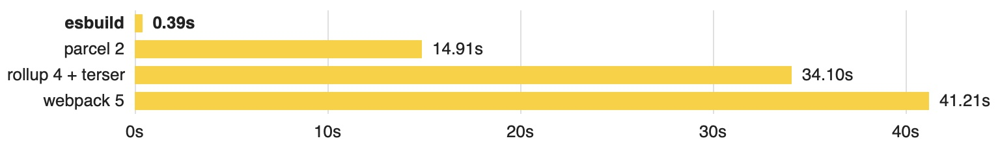

웹팩과 비슷한 도구들이 많다. [esbuild](https://esbuild.github.io), swc, vite. 각자 웹팩보다 얼마나 빠른지를 그들의 강점으로 내세운다. 자기들끼리도 더 낫다고 주장한다. 속도의 공통 원인는 자바스크립트로 만들지 않았다는 사실이다.

자바스크립트 코드를 생산하는 도구인데 자바스크립트를 사용하지 않아서 빠르다. 엄마처럼 살지 않겠다고 큰 소리쳤는데 자기 딸에게 그 말을 듣는 중년의 부인처럼.

회사 동료가 esbuild를 알려주었다. 제품에 적용하는 것까지 옆에서 구경했다. 빌드 속도가 눈에 띄게 빨라졌다. 개발환경과 CI/CI도 더 낫다.

esbuild가 빠른 이유를 짚어보자.

# Golang

프로그래밍 언어는 사람이 읽는 언어다. 개발자가 코드를 읽고 쓰기 위해 사용한다. 개발자는 이것으로 기계를 제어하는 게 목적이다. 프로그래밍 언어로 작성한 코드는 기계가 이해할 수 있는 기계어로 바뀌어야 한다.

변환 방식은 세 가지다.

- 정적 컴파일
- 인터프리터
- JIT(Just in time)

정적 컴파일. 한 번에 기계어로 바꾸는 것이다. gcc로 c 코드를 컴파일하는 것처럼. 기계는 바로 이 언어를 이해할 수 있어서 곧장 움직인다. 다만 각 cpu에 따라 이해할수 있는 기계어가 다르기 때문에 플래폼에 맞게 각자 변환해야한다. C, Go, Rust가 있다.

인터프리터. 프로그래밍 언어를 한 문장씩 읽고 기계어로 바꾸는 방식. 조금씩 바꾸고 바로 실행하기 때문에 초기 동작이 빠르다. 자바스크립트가 이 방식을 사용한 이유인 것 같다. 브라우져가 원격 코드를 가져와 최대한 빨리 실행하려면 조금씩 읽고 번역해야하기 때문이다. 정적 컴파일을 번역서라고 한다면 인터프리터는 동시 통역이다. 다만 전체 실행 시간은 정적 컴파일에 비해 느리다. 같은 코드를 발견하더라도 매번 같은 방식으로 번역해야하기 때문이다. 최적화할 수 없다. 파이썬, PHP, 루비가 있다.

인터프리터에 캐시를 붙이면 어떨까? 이미 번역했던 문장은 이전에 번역한 기계어를 사용해 시간을 줄일 수 있다. JIT 방식이라고 한다. 정적 컴파일과 인터프리터를 혼합한 것이다. 자바, 닷넷, v8이 있다.

v8은 노드에서 시작해 웹 브라우져에서 자바스크립트 엔진을 구성하는 요소다. 최적화되었지만 정적 컴파일에 비해 느리다. 동시통역 영상을 보는 것보다 번역서를 읽는 게 빠르다.

esbuild 실행시간이 짧은 이유다. 웹팩 관련 기술은 모두 자바스크립트로 작성되어 있다. 동시 통역 방식이다. esbuild는 go로 작성한 기계어 실행파일이다. 번역서다.

효과는 극적이다. 100배나 빠르다고 한다.



# 병렬 처리

100배 성능에는 프로그래밍 언어 뿐만 아니라 병렬 처리도 기여한다.

디스크에 있는 코드인 프로그램은 메모리 위에 올라가야 cpu가 이해할 수 있다. 메모리와 cpu 같은 운영체제 자원을 할당 받은 프로그램을 프로세스라고 부른다. 운영체제는 시간을 쪼게 여러 프로세스에게 조금씩 cpu 자원을 할당하면서 운용한다.

프로세스 a를 보다가 잠시 멈추고, 프로세스 b를 보다가 또 멈추고...... cpu가 많다면 같은 양의 프로세를 더 빨리 처리할 수 있을 것이다. 요즘 컴퓨터는 다량의 cpu를 가지고 있어서 병렬 처리를 극대화 할 수 있다. 같은 양의 일을 더 빨리 해낼 수 있다.

하지만 자바스크립트 엔진은 운영제제가 제공하는 자원을 모두 활용하지 못한다. 싱글 쓰레드 기반으로 동작하기 때문이다. 자바스크립트로 만든 웹팩 관련 기술 스택은 하나의 쓰레드에서만 동작하기 때문에 처리 속도가 제한적이다.

go는 운영체제의 병렬처리 효과를 누릴수 있다. 필요한만큼 쓰레드를 만들고 일을 동시에 처리할 수 있다. go는 쓰레드보다 더 가벼운 고루틴을 스스로 정의해 사용한다. 병렬 작업을 제법 빠르게 처리할 것이다. esbuild는 cpu를 최대한 많이 사용하도록 알고리즘을 설계했다고 한다.

웹팩으로 같은 코드를 번들하면 cpu 사용율이 170%인 반면 esbuild-loader만 교체해 빌드하면 200%까지 오른다. 그만큼 esbuild가 cpu 여러 개를 동시에 사용해 빌드 성능을 높인다는 방증이다.

```
# webpack 빌드
time npm run build-webpack
140.68s user 14.03s system 168% cpu 1:31.83 total

# esbuild-loader 빌드
time npm run build-esbuild
71.51s user 8.70s system 203% cpu 39.415 total
```

# 기타

넓은 생태계의 웹팩은 인터페이스만 맞추면 어떤 기능이든 로더나 플러그인으로 만들 수 있다. 다양한만큼 각자의 데이터 구조에 따라 동작하는 구조다. 속도보다는 확장성이 웹팩의 구조의 특징이다.

esbuild는 이 도구 하나뿐이다. 각종 파일을 변환하고 합치는 작업을 이 실행 파일로 처리한다. 데이터 구조가 일관적이고 각 모듈이 이에 최적화되어 동작하기 때문에 빠르다. 그만큼 지원하는 기능은 적다. vue나 sass는 사용할 수 없는 게 한계다.

esbuild는 CPU 캐시를 적극 사용하도록 의도한다고 한다. 자바스크립트를 변환하기 위해서는 추상 구문 트리를 만드는 과정을 겪는데 계산량이 많다. 한 번 만든 추상 구문 트리가 CPU 캐시에 최대한 오래 머물도록 의도해 처리속도를 높인다.

# 결론

이상 위에서 설명한 네 가지가 esbuild를 빠르게 하는 주된 요인이다.

- 언어 자체를 바꿔서 프로그램 실행 방식 변경
- 병렬 처리
- 일관된 데이터 구조로 실행 최적화
- 추상 구문트리를 최소한으로 변경해 cpu 캐시를 적극적으로 활용

나는 esbuild는 아니고 esbuild-loader를 사용했다. 100배의 성능은 아니지만 충분히 의미있게 개발환경 개선했다. 왜 이렇게까지 빠를 수 있을까라는 의문이 들었다. 공식 문서의 기술적인 내용을 내 수준에서 다시 정리해 보았다.

## 참고

- [Why is esbuild fast? | esbuild](https://esbuild.github.io/faq/#why-is-esbuild-fasthttps://esbuild.github.io/faq/#why-is-esbuild-fast)
- [esbuild는 왜 빠른가?(번역)](https://gusrb3164.github.io/web/2022/04/16/esbuild/)
- [웹팩보다 100배 빠른 번들러, esbuild](https://www.peterkimzz.com/extremely-faster-esbuild-than-webpack)
- [esbuild-loader | github](https://github.com/privatenumber/esbuild-loader)
- [JIT 컴파일러 | 위키피디아](https://ko.wikipedia.org/wiki/JIT_컴파일)
- [A crash course in just-in-time (JIT) compilers | Mozilla Hacks](https://hacks.mozilla.org/2017/02/a-crash-course-in-just-in-time-jit-compilers/)
- [[번역] just-in-time 실시간(JIT) 컴파일러에 대한 단기 과정](https://lovejaco.github.io/posts/a-crash-course-in-just-in-time-compilers/)
