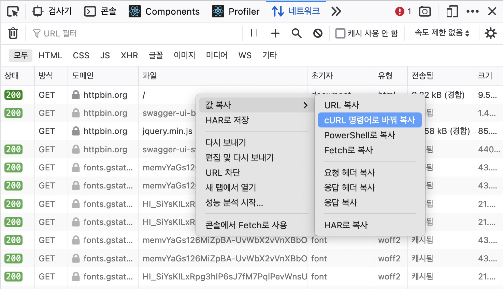

네트웍 요청을 다룰 때 주로 [cURL](https://curl.se/)이나 포스트맨을 사용한다. 비교적 간편한 전자를 기본으로 쓰면서 팀에서 협업할 때는 후자를 이용하는 편이다.

1998년에 출시한 이 도구는 벌써 20년이 지났다. 아직도 많은 개발자들이 손에서 놓치 않는 비결은 뭘까? 주요 구조를 알아보고 내가 사용하는 사례 몇 가지를 정리해 보겠다.

# 구조

이름은 'URL을 위한 클라이언트'라는 뜻이다.

> client for URLs.

보통 curl이라고 소문자를 사용해 불렀는데, 공식 홈페이지에는 URL을 대문자로 강조했다. '클라이언트 전용 URL 요청 처리기' 정도로 이해하면 되겠다.

libcurl이란 라이브러리가 핵심이다. HTTP를 포함한 각종 인터넷 프로토콜을 지원하고 HTTPS, 파일 업로드, 프록시, 쿠키, 인증 등을 제공한다. 여러 운영체제를 지원해 이식성도 뛰어난 편이다.

C 언어로 작성했는데 다양한 프로그래밍 언어에서 사용할수 있게 바인딩한 라이브러리를 제공한다. 자바스크립트로 코딩하고 싶다면 [node-libcurl](https://github.com/JCMais/node-libcurl)을 노드 환경에서 사용할 수 있다. [벤치마크 문서](https://github.com/JCMais/node-libcurl/tree/develop/benchmark)에 따르면 여타 HTTP 라이브러리 중 가장 빠른 속도를 자랑한다고 한다.

라이브러리 형태로 제공한 libcurl을 커맨드 라인 환경에서 사용할수 있게 만든 도구가 바로 cURL이다.

그럼 몇 가지 사용법을 알아보자.

# 파일 요청

인자로 전달한 URL로 HTTP 요청을 보내고 응답을 받을 수 있다.

```
curl https://httpbin.org

<!DOCTYPE html>
<html lang="en">
// ...
```

글을 작성하면서 httpbin.org라는 서비스를 발견했는데 HTTP 요청 테스트하기에 좋다.

- 이 도메인으로 요청을 보내면 html 파일을 본문에 담아 응답하는데 터미널에 이 문서 코드가 출력 되었다.

브라우져는 이 응답을 받으면 헤더와 함께 읽고 문서를 렌더링할 것이다.

헤더를 포함해 좀 더 많은 정보를 보려면 --verbose, -v 옵션을 사용한다.

```
curl https://httpbin.org --verbose

Trying 34.235.39.169:443...
Connected to httpbin.org (34.235.39.169) port 443 (#0)
...
(304) (OUT), TLS handshake, Client hello (1):
(304) (IN), TLS handshake, Server hello (2):
...
TLSv1.2 (IN), TLS handshake, Finished (20):
...
> GET / HTTP/2
> Host: httpbin.org
> User-Agent: curl/8.1.2
> Accept: _/_
>
< HTTP/2 200
< date: Sat, 02 Dec 2023 04:21:19 GMT
< content-type: text/html; charset=utf-8
< content-length: 9593
< server: gunicorn/19.9.0
< access-control-allow-origin: \*
< access-control-allow-credentials: true
<
<!DOCTYPE html>
<html lang="en">
```

- 해당 도메인에 해당하는 아이피 주소로 요청을 보낸다. DSN 서버에서 질의해서 얻은 주소일 것이다.
- HTTPS이기 때문에 443 포트를 사용했다.
- 서버를 찾아 연결된 후에는 핸드쉐이크 과정을 거친다.
- HTTP 헤더에 정보를 담아 요청을 보낸다.
- 서버는 HTTP 헤더에 정보를 담고 본문에 파일 내용을 담아 응답한다.

# HTTP API 요청

cURL을 사용할 때 아무런 옵션을 지정하지 않으면 GET 메소드가 기본이다. REST API는 POST, PUT, DELETE 을 요청힐 수 있는데 cURL에서는 어떻게 할까?

--data, -d 옵션을 사용해 요청 본문을 전달하면 POST 메소드를 요청할 수 있다.

```
curl --data "foo=bar" https://httpbin.org/post

{
 "form": {
    "foo": "bar"
...
```

- 서버 로직에 따라 전달한 인자를 다시 본문에 담아 응답했다.

PUT과 DELETE 같은 추가 메소드는 --request, -X 옵션을 사용한다.

```
curl --request "PUT" --data "foo=bar" https://httpbin.org/put

curl --request "DELETE" https://httpbin.org/delete
```

API 응답은 보통 json 형식을 많이 사용한다. 한 줄로 된 응답 값을 사용할수 도 있지만 내용이 길면 들여쓰기 해야 읽기 편한다. JSON 처리기인 [jq](https://jqlang.github.io/jq/)와 함께 사용해 보자.

```
curl https://httpbin.org/get | jq
```

좀 더 깔끔하게 보려면 --silent, -s 옵션을 사용한다.

```
curl https://httpbin.org/get --silent | jq

{
  "args": {},
  "headers": {
...
```

응답값을 파일로 저장하려면 --output, -o 옵션을 사용한다.

```
curl https://httpbin.org/get --output result.txt
cat result.txt
{
  "args": {},
  "headers": {
...
```

# 캐시 동작 확인

헤더 요청만 보내고 싶은 경우가 있다. -X HEAD 로 보내면 될것 같지만 그렇지가 않다. 전용 옵션인 --head, -I 를 사용해야 한다. 주로 캐시관련 헤더 확인 시 사용하는 편이다.

```
curl https://httpbin.org/ --head

HTTP/2 200
date: Fri, 01 Dec 2023 23:21:11 GMT
content-type: text/html; charset=utf-8
content-length: 9593
server: gunicorn/19.9.0
access-control-allow-origin: *
access-control-allow-credentials: true
```

- 문서 타입과 길이를 확인한다.
- 서버 이름을 봐서 파이썬을 사용한듯 하다.
- cors 관련 헤더도 있다.

깃헙 페이지를 사용한 이 블로그는 어떤 헤더를 사용할까?

```
curl https://jeonghwan-kim.github.io/ --head

HTTP/2 200
content-type: text/html; charset=utf-8
permissions-policy: interest-cohort=()
last-modified: Thu, 16 Nov 2023 09:14:08 GMT
etag: "6555dd60-12ac2"
expires: Thu, 16 Nov 2023 10:11:36 GMT
cache-control: max-age=600
x-proxy-cache: MISS
x-served-by: cache-icn1450067-ICN
x-cache: HIT
x-cache-hits: 1
```

- etag, cache-control 등의 기본 캐시 관련 헤더를 사용한다.
- 깃헙에서 확장해 사용한 x-\* 헤더도 있다.

# 리다이렉션 동작 확인

리다이렉션 요청을 보내보자.

```
curl https://httpbin.org/redirect/1 --head

HTTP/2 302
location: /get
...
```

- 리다이렉션을 의미하는 302 상태 코드를 응답했다.
- 이동할 경로를 location 헤더에 담아 보냈다.
- 브라우져는 이 헤더를 읽고 다시 GET /get 요청을 보낼 것이다.

cURL에서도 브라우져와 같이 리다이렉션 응답을 받으면 다시 요청하는 동작을 할 수 있다. --location, -L 옵션을 사용한다.

```
curl https://httpbin.org/redirect/1 --head --location

HTTP/2 302
location: /get
...

HTTP/2 200
content-type: application/json
content-length: 254
...
```

# 사용법 익히기

이러한 기본적인 사용법만으로도 이 도구를 사용하는데 불편함은 없을 것이다. 다만 특별한 경우에는 설명서를 참고해야하는데 맨 페이지를 사용한다.

```
man curl
```

좀 익숙하지 않지만 읽을만 하다. 인터넷 검색 결과와 함께 보는 편이다.

브라우져를 활용하면 더 많은 사용법을 익힐 수 있다. 브라우져 네트워크 탭에는 페이지에서 발생한 요청 목록이 있는데 이 중 하나의 요청을 선택한 뒤 컨택스트 메뉴로 cURL 명령어를 복사할 수 있다.



```
curl 'https://httpbin.org/#/' \
-X 'GET' \
-H 'Accept: text/html,application/xhtml+xml,application/xml;q=0.9,*/*;q=0.8' \
-H 'Sec-Fetch-Site: none' \
-H 'Accept-Encoding: gzip, deflate, br' \
-H 'Sec-Fetch-Mode: navigate' \
-H 'Host: httpbin.org' \
-H 'User-Agent: Mozilla/5.0 (Macintosh; Intel Mac OS X 10_15_7) AppleWebKit/605.1.15 (KHTML, like Gecko) Version/17.1 Safari/605.1.15' \
-H 'Accept-Language: ko-KR,ko;q=0.9' \
-H 'Sec-Fetch-Dest: document' \
-H 'Connection: keep-alive'
```

- cURL과 다르게 브라우져는 URL로 요청을 보낼 때 더 많은 헤더를 전달한다.
- 메소드, 컨텐츠 협상, 압축 방식, 유저 에이전트, 언어셋.

브라우져가 제공한 cURL 명령어 옵션을 통해 HTTP와 브라우저의 동작을 더 이해할 수 있을 것이다.

# 결론

동료가 cURL을 사용하는 걸보고 처음 이 도구를 알았다. 당시 나는 포스트맨이나 에디터에 내장된 HTTP 요청 툴을 사용했는데 유저 인터페이스, 요청 저장 등 부가기능이 편하기 때문이다.

cURL을 조금씩 사용해보니 도구의 담백함이 오히려 좋았다. 튜닝 끝은 순정인 것 처럼 본질에 충실한 것이 오래 가는 법이다.

## 참고

- [https://curl.se/](https://curl.se/)
- [What is cURL](https://curl.se/docs/faq.html#What_is_cURL)
- [https://httpbin.org/](https://httpbin.org/)
- [https://jqlang.github.io/jq/](https://jqlang.github.io/jq/)
