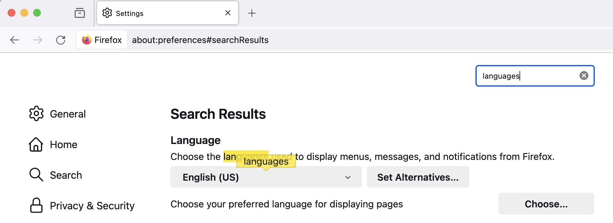

서버는 다양한 클라이언트로부터 요청을 받는다. 같은 내용이라도 클라이언트마다 필요한 문서 형식이 다르다. 압축한 문서를 읽을 수도 있지만 그렇지 못한 경우도 있다. 한국어나 영어처럼 클라이언트가 선호하는 언어가 다르기도 하다.

각양각색의 클라이언트에게 적합한 자원을 제공하는 것 또한 서버의 역할이다. 클라이언트와 함께 서로의 입장 차이를 줄여나가며 거래할 자원을 결정한다. 시장에서 고객과 상인이 물건 값을 흥정하는 것 처럼.

이러한 동작을 **컨텐츠 협상**이라고 부른다. 이 글에서는 컨텐츠 협상에 사용되는 HTTP 헤더와 동작 방식을 정리해 보겠다.

# Accept

브라우져는 다양한 파일을 처리한다. HTML, CSS, 자바스크립트는 웹 문서로 렌더링해 읽을 수 있는 문서로 표시한다. PDF 파일은 내용을 미리 볼 수 있게 표시하기도 한다. 압축 파일이라면 운영체제의 다운로드 폴더에 넣어줄 것이다.

이처럼 브라우져는 다룰수 있는 파일의 종류가 다양하다. 같은 URL이라도 원하는 포맷으로 자원을 취할 수 있다. 브라우져가 서버에게 'XXX 형식의 자원이 있으면 우선해서 보내 주세요.' 라고 말한다면 좋겠다. 이것이 요구사항을 처리할 서버에게 협상의 힌트가 되어 줄 테니깐.

이 때 사용하는 것이 Accept 요청 헤더다.

```shell
> Accpet: text/html
```

특정 URL을 서버에 요청할 때 text/html 마임 타입을 Accept 헤더에 실어 보냈다. 클라이언트가 서버에게 '이 URL의 자원을 찾는데요, HTML 형식을 우선해서 보내주세요.' 라고 말했다. 클라이언트의 제안이다.

서버는 이것을 힌트로 적절한 자원을 제공할 수 있다. HTML 문서가 있다면 이 값을 응답 본문에 실어 보낸다. 문서의 타입도 함께 전달해 클라이언트에게 렌더링 힌트를 줄수 있는데 Content-Type 헤더를 사용한다.

```shell
< Content-Type: text/html
```

서버가 자원을 제공하면서 '이것은 HTML 문서입니다' 라고 말하는 것이다. 클라이언트와 서버가 자원에 대해 협상한 결과다.

## 사례

깃헙은 같은 URL이라도 Accept 요청에 따라 다양한 형식의 자원을 제공한다

```shell
curl https://github.com/jeonghwan-kim/jeonghwan-kim.github.com \
  -H 'Accept: text/html'

<!DOCTYPE html>
<html
```

Accept 헤더에 text/html 을 실어서 요청하면 깃헙은 HTML 문서를 제공한다.

```shell
curl https://github.com/jeonghwan-kim/jeonghwan-kim.github.com \
  -H 'Accept: application/json'

{"payload":{"allShortcutsEnabled":false,"path":"/","repo":
```

application/json 헤더를 실으면 JSON 문서를 응답한다.

## 라이브러리

노드 기반의 서버 웹프레임웍인 express.js는 [res.format()](https://github.com/expressjs/express/blob/master/lib/response.js#L685) 함수로 이 역할을 한다. Accept 요청을 읽고 이 값에 따라 사전에 정의한 자원을 제공한다.

```js
res.format({
  text() {/* 텍스트 문서를 반환한다 */},
  html() {/* HTML 문서를 반환한다 */},
  json() {/* JSON 문서를 반환한다 */},
  default() {/* 요청한 형식이 없을 경우 이 문서를 반환한다 */}
}
```

text, html, json 등 서버가 제공할 수 있는 문서 파일의 확장자 이름으로 함수를 정의한다. 요청을 처리할 때 이 중 한 함수를 실행하는 방식이다.

함수 상세 구현을 보자.

```js
res.format = function(obj){
  // 생략

  // Accept 요청을 헤더가 있는 경우
  if (key) {
    // 응답 헤더를 설정한다.
    this.set('Content-Type', normalizeType(key).value);
    // 미리 준비한 응답 핸들러를 실행한다.
    // 특정 문서를 응답할 것이다.
    obj[key](req, this, next);
  }

  // 요청한 마임타입의 문서가 없을 경우
  // 기본 문서를 응답한다.
  else if (obj.default) {
    obj.default(req, this, next);
  }

  // 기본 문서도 없으면 406 Not Acceptable을 응답한다.
  else {
    next(createError(406, {
      types: normalizeTypes(keys).map(function (o) { return.o.value })
    }))
  }
  // 생략
}
```

파일 종류별로 응답 함수를 가진 obj 객체를 인자로 받았다.

Accept 요청 헤더가 있는 경우 응답에 Content-Type 헤더를 실는다. 각 파일의 마임 타입을 사용할 것이다. 그리고 obj에서 요청한 Accept 값에 따라 응답 함수를 실행한다. 서버는 클라이언트가 요청한 형식의 자원을 제공할 것이다.

Accept에 해당하는 문서를 찾지 못하면 미리 준비한 기본 함수 obj.default 를 실행한다. 가령 pdf 파일을 요청했다면 찾지못해 이 기본 문서를 제공할 것이다.

default 문서를 찾지 못하면 Not Acceptable을 뜻하는 406 상태코드를 응답에 실을 것이다.

# Accept-Encoding

gzip, deflate, brotli 등 파일을 압축하는 방식은 다양하다. 클라이언트가 '저는 이런 압축 방식 알고 있습니다. 가능하면 이 방식으로 압축해서 보내주세요'라고 말할 수 있다. 네트웍 비용을 아끼고 더 빨리 문서를 받아 볼 수 있기 때문이다.

이 때 사용하는 것이 Accpet-Encoding 요청 헤더다. 클라이언트는 사용할 수 있는 압축 방식을 이 헤더에 나열해 실는다.

```shell
> accept-encoding: gzip
```

가능하면 gzip으로 압축해 달라고 말했다. 클라이언트의 제안이다.

서버는 이것을 힌트로 파일을 압축한다. 이 파일을 사용할 클라이언트에게 압축 방식도 알려줘야 한다. Accept-Encoding에 압축 방식을 여러개 지정해서 요청할 수 있는데, 서버가 어떤 방식으로 압축했는지 알아야 클라이언트가 압축을 풀 수 있기 때문이다. 이 때 사용하는 응답 헤더가 Content-Encoding이다.

```shell
< content-encoding: gzip
```

서버가 클라이언트에게 자원을 제공하면서 '이것은 gzip으로 압축한 것입니다.' 라고 말했다. 클라이언트는 Content-Encoding에 명시한 압축방식으로 파일을 풀어서 사용할 것이다.

## 사례

깃헙은 같은 URL이라도 요청에 따라 자원을 압축해서 제공한다.

```shell
curl https://github.com/jeonghwan-kim/jeonghwan-kim.github.com \
  -H 'Accept-Encoding: gzip' \
  -s \
  -o result-gzip

cat result-gzip
압축된 문서
```

압축된 문서가 다운로드 되어 result-gzip 파일에 저장되었을 것이다. 이 파일을 gzip으로 압축 해제 하면 자원을 읽을 수 있다.

--compressed 옵션과 함께 curl 명령어를 사용하면 압축 해제한 결과를 바로 읽을 수 있다.

```shell
curl https://github.com/jeonghwan-kim/jeonghwan-kim.github.com \
  -H 'Accept-Encoding: gzip' \
  -s \
  --compressed

압축해제된 문서
```

## 라이브러리

[compression](https://github.com/expressjs/compression#readme)은 express.js 에서 사용할 수 있는 압축 미들웨어다.

```js
// 어플리케이션에 압축 미들웨어를 추가했다.
// Accept-Encoding 요청 헤더를 읽고 자원을 압축해서 응답할 것이다.
// 물론 Content-Encoding 헤더까지 실어 보낸다.
app.use(compression())
```

미들웨어를 추가하면 어플리케이션이 모든 요청의 Accept-Encoding 헤더를 읽는다. 서버가 지원하는 압축 알고리즘이면 이 방식으로 파일을 압축할 것이다. Content-Encoding 헤더에 압축 알고리즘을 실어서 응답하는 것 까지가 이 미들웨어의 역할이다.

구현체를 보자.

```js
// 요청 헤더에서 압축 방식을 읽는다.
// accept-encoding 헤더를 읽을 것이다.
var accept = accepts(req)
var method = accept.encoding(["gzip", "deflate", "identity"])

// 생략

// 압축 방식에 따라 압축 파이프라인을 생성한다.
// zlib 노드 코어 모듈을 사용한다.
stream = method === "gzip" ? zlib.createGzip(opts) : zlib.createDeflate(opts)

// Content-Encoding에 압축한 방식을 명시한다.
res.setHeader("Content-Encoding", method)
// Content-Length 헤더는 삭제한다.
res.removeHeader("Content-Length")
```

accepts와 negotiator 라이브러리를 이용해 accept-encoding 요청 헤더를 읽는다. 이 미들웨어가 지원하는 gzip, deflate 압축방식이 요청 헤더에 있는지를 찾는다. method 변수에는 이후에 압축할 압축 방식 이름이 할당될 것이다. identity는 압축하지 않는다는 의미의 디렉티브다.

zlib 노드 코어 모듈로 압축한다. method에 따라서 압축하는 스트림을 만든다.

Content-Encoding에 사용한 압축 방식을 실는다. 그리고 Conent-Length는 제거한다. 클라이언트가 압축 해제한 뒤에야 길이를 알 수 있기 때문이다.

zlib을 사용하면 다운로드한 gzip 파일을 압축해제 할 수 있겠다.

```js
const zlib = require("zlib")
const fs = require("fs")

const sourceStream = fs.createReadStream("./result-gzip")
// result-html에 압축해제된 내용이 담길 것이다.
const outputStream = fs.createWriteStream("./result-html")

sourceStream.pipe(zlib.createUnzip()).pipe(outputStream)
```

실행하면 위 코드가 압축 해제한 내용을 result-html 파일에 기록할 것이다.

# Accept-Language

브라우져는 사용자의 모국어를 지원한다. 파이어폭스를 처음 실행하면 영어지만 한국어로 설정을 바꿀 수도 있다.

이전에 영어 문서를 제공했던 사이트에 언어 설정을 한국어로 바뀐 뒤 접속하면 한글 문서를 제공하는 경우가 있다. 이것은 브라우져가 영어 문서를 해석한 것일까, 서버가 브라우져의 언어 설정을 이해한 것일까?

클라이언트가 선호하는 언어를 서버에게 전달하면 서버는 준비된 언어의 문서를 제공한다. 이때 사용하는 것이 Accept-Language 요청 헤더다.

```shell
> Accept-Language: ko
```

클라이언트가 서버에게 '이 URL을 요청하는데 가능하면 한글 문서를 주세요'라고 말한 것이다. 클라이언의 제안이다.

서버는 이것을 힌트로 한글 문서를 제공할 것이다. 안타깝게도 한글 문서가 없다면 서버에서 준비한 다른 문서를 제공할 것이다.

## 사례

유투브는 클라이언트의 요청에 따라 각 나라의 모국어로 작성한 웹페이지를 제공한다.



브라우져를 영어로 설정했다. 유투브에 접속하고 네트웍을 확인하자.

```shell
> Accept-Language: en-US,en;q=0.5
```

Accept-Langulage 요청 헤더에 en-US 값을 실어 서버에 접속했다. 브라우져에서 설정된 언어인 영어를 선호 언어로 서버에게 전달한 것이다.

서버는 이 요청 헤더를 보고 '아 브라우져가 영문 문서를 원하는구나'라고 판단해 준비한 영어 웹페이지를 제공한다.

--

이번에 브라우져를 한글로 설정하고 다시 접속해 보자.

```shell
> Accept-Language: ko-KR,ko;q=0.8,en-US;q=0.5,en;q=0.3
```

ko-KR 한글을 맨 앞에 실었다. 브라우져에서 설정된 언어인 한글을 시작으로 영어를 순서대로 전달한 것이다.

서버가 요청 헤더를 보고 '아 브라우져가 한글 문서를 원하는구나'라고 판단해 한글 웹페이지를 제공할 것이다.

## 라이브러리

express.js에서는 [req.acceptLangualges()](https://expressjs.com/en/5x/api.html#req.acceptsLanguages)로 요청한 클라이언트가 선호하는 언어를 확인할 수 있다.

```js
req.acceptLangualges()
```

이 값을 기준으로 문서를 제공하면 되겠다. 다국어 서비스를 만들때 i18n 같은 라이브러리를 사용했는데 어플리케이션에 노출한 문자를 모두 키로 관리하고 키에 해당하는 각국의 번역 사전을 준비해 웹페이지를 개발한 경험이 있다.

구현체를 보자.

```js
req.acceptLanguages = function () {
  var accept = accepts(this)
  return accept.languages.apply(accept, arguments)
}
```

[accepts](https://github.com/jshttp/accepts)와 [negotiator](https://github.com/jshttp/negotiator#readme) 라이브러리를 이용해 Accept-Language 요청 헤더 값을 읽는다.

# User-Agent

클라이언트는 요청을 보낼 때 자신의 정보도 서버에 전달한다. 마치 '나는 누구요'라고 말하듯 서버에 자기 이름을 알리는 것이다.

이 때 사용하는 것이 User-Agent 요청 헤더다.

브라우져는'<제품명>/<버전> <설명>' 형식의 문자를 구성해 이 헤더에 실는다. 필자가 사용하는 사파리의 User-Agent 값이다.

```shell
> User-Agent: Mozilla/5.0 (Macintosh; Intel Mac OS X 10_15_7) AppleWebKit/605.1.15 (KHTML, like Gecko) Version/17.3.1 Safari/605.1.15
```

User-Agent 값은 각 브라우져가 원하는 값을 사용한다고 한다(참고: [User-Agent | MDN](https://developer.mozilla.org/ko/docs/Web/HTTP/Headers/User-Agent)). 가령 크롬 브라우져인데 Safari 문자자 있는 식이다. 유저 에이전트 스니핑으로 불리기도 하는 것처럼 신뢰할 수 없는 값이다.

지금까지 살펴본 헤더와 다르게 컨텐츠 협상에 어울리지 않는다. 사파리 기준으로 코드를 작성했는데 잘못 판단해 어플리케이션 버그로 이어질 수 있기 때문이다. 컨텐츠 협상에서 이 헤더를 사용하는 것은 권장하지 않고 다른 가이드라인을 활용해야 한다(참고: [사용자 에이전트를 사용한 브라우저 감지 | MDN](https://developer.mozilla.org/ko/docs/Web/HTTP/Browser_detection_using_the_user_agent#mobile_device_detection)).

## 사례

그럼에도 불구하고 목차에 넣은 것은 한 가지 사례 때문이다. 어플리케이션이 지원 종료한 브라우져로 요청할 경우다.

```js
const userAgent = req.headers['User-Agent']
const isIE = /msie|trident/i.test(userAgent)
if (isIe) {
  res.end(<html><body>IE는 지원하지 않습니다.</body><</html>)
  return
}

// 정상 페이지 응답
```

브라우져가 요청하면 User-Agent에 자신의 정보를 실어 서버에 접속할 것이다. 서버는 이 헤더 값을 보고 지원 종료한 브라우져인지 판단할 수 있다. 보통 인터넷 익스플로러를 그렇게 처리하는데 'IE는 지원하지 않습니다'라는 메세지를 응답 것이다. 그렇지 않다면 정상 페이지를 응답한다.

## 라이브러리

[구현체](https://github.com/biggora/express-useragent/blob/master/lib/express-useragent.js)를 보면 다양한 유저 에이전트를 식별하기 위해 정규 표혁식을 관리한다.

```js
var UserAgent = function () {
 this._Versions = {
    Edge: /(?:edge|edga|edgios|edg)\/([\d\w\.\-]+)/i,
    Firefox: /(?:firefox|fxios)\/([\d\w\.\-]+)/i,
    IE: /msie\s([\d\.]+[\d])|trident\/\d+\.\d+;.*[rv:]+(\d+\.\d)/i,
    Chrome: /(?:chrome|crios)\/([\d\w\.\-]+)/i,
    Safari: /(version|safari)\/([\d\w\.\-]+)/i,
```

# Vary

같은 URL 요청이라도 클라이언트에 따라서는 다른 자원을 제공하는 것이 클라이언트와 서버 간의 컨텐츠 협상이다. 캐시는 어떻게 동작할지 궁금하다.

URL만을 기준으로 브라우져가 캐싱한다면 제대로 동작하지 않을 수 있다. 클라이언트 환경, 말하자면 사용하는 문서 형식이나 언어, 압축 방식에 따라서 자원의 내용이 전혀 다르기 때문이다.

가령 한글로 설정한 브라우져로 서버에 접속해서 문서를 다운받아 캐시한다고 하자. 이후 브라우져 설정을 영어로 바꾸고 웹페이지에 다시 방문하면 브라우져는 URL 기준으로 캐시한 자원을 찾아 서버에 접속하지 않고 한글 문서를 제공할 것이다.

브라우져가 캐시할 때 URL 뿐만 아니라 특정 요청 헤더를 캐시키로 사용한다면 캐시 갱신 문제를 해결할 수 있다. Vary는 서버가 브라우저에게 컨텐츠 협상에 사용하는 헤더 중 캐시 키로 사용할 것을 알려주는 응답 헤더다.

```shell
< Vary: Accept-Language
```

특정 URL 요청에 응답으로 Vary 헤더에 Accept-Language를 실어 보냈다. 서버가 브라우져에게 '이 URL의 자원을 캐시할 때 Accept-Language를 키로 사용하세요'라고 가이드라인을 전달한 셈이다. 이 자원은 Aceept-Language에 따라 다르기 때문이다. 서버의 제안이다.

브라우저는 URL과 Vary 응답 헤더에 명시한 헤더를 캐시키로 사용할 것이다. 이를 테면 URL/ko/파일을 캐시에 저장해 둔다. 이후에 브라우져 언어를 영어로 바꾸면 Accept-Language: en을 요청 헤더에 실을 것이다. 캐시에서 찾지 못한 브라우져는 서버에 접속해 새로운 파일을 다운로드 받는다. 그리고 URL/en/파일을 캐시에 추가할 것이다.

## 사례

깃헙은 Vary 응답 헤더를 사용한다.

```shell
curl https://github.com/jeonghwan-kim/jeonghwan-kim.github.com -I

< vary: X-PJAX, X-PJAX-Container, Turbo-Visit, Turbo-Frame, Accept-Encoding, Accept, X-Requested-With
```

서버는 X- 로 시작하는 커스텀 헤더를 포함해 Accept-Encoding, Accept 를 캐시 키로 사용하라고 응답했다. 이 문서는 압축 방식이나 문서 포맷에 따라 다른 응답을 한다고 이해할 수 있다. 이전 Accept 장에서 확인했듯이 마임타입이나 압축 방식에 따라 다른 응답을 제공한다.

브라우져는 Vary에 있는 헤더를 캐시키로 사용해 응답 데이터를 캐시 저장소에 담아둘 것이다.

# 결론

서버는 요청한다고 해서 일방적으로 자원을 제공하지 않는다. 클라이언트가 이해할 수 있는 방식으로 자원을 제공한다. 문서의 형식, 압축 방식을 고려한다. 뿐만 아니라 클라이언트가 어떤 기준으로 캐싱할지 힌트도 준다. 친구와 통화할 때 내뱉는 단어가 있고 자녀와 대화할 때 알려주는 단어가 있는 것 처럼.

이러한 컨텐츠 협상은 HTTP를 기반한다.

- Accept / Content-Type: 문서 형식
- Accept-Encoding / Content-Encoding: 압축 방식
- Accept-Language / Content-Language: 선호하는 언어
- User-Agent: 클라이언트의 제조사, 브라우져 명, 버전
- Vary: 캐시키 안내

잘 들여다보지 않았던 내용이다. 하지만 알게 모르게 문제 해결에 사용했던 헤더다.

- 서버를 구성했는데 브라우져로 다운로드하니 막상 렌더링이 안되는 문제는 Content-Type을 지정해서 해결했다.
- 정적 자원을 배포하고 압축까지 잘되는지 Content-Encoding으로 확인했다.
- 다국어 서비스를 만들때 Content-Language를 고려했다.
- 인터넷 익스플로러를 더이상 지원하지 않아서 User-Agent 요청 헤더를 사용했다.

이런 기초 지식을 미리 알고 있다면 다양한 상황에 적절한 기술을 활용할 수 있을 것이다. 나도 이번에 제대로 정리할 수 있었다.

## 참고

- [HTTP 컨텐츠 협상 | MDN](https://developer.mozilla.org/ko/docs/Web/HTTP/Content_negotiation)
- [사용자 에이전트를 사용한 브라우저 감지 | MDN](https://developer.mozilla.org/ko/docs/Web/HTTP/Browser_detection_using_the_user_agent#mobile_device_detection)
- [expressjs/express | Github](https://github.com/expressjs/express)
- [expressjs/compression | Github](https://github.com/expressjs/compression)
- [jshttp/accepts | Github](https://github.com/jshttp/accepts/)
- [jshttp/negotiator | Github](https://github.com/jshttp/negotiator)
- [biggora/express-useagent](https://github.com/biggora/express-useragent/blob/master/lib/express-useragent.js)
