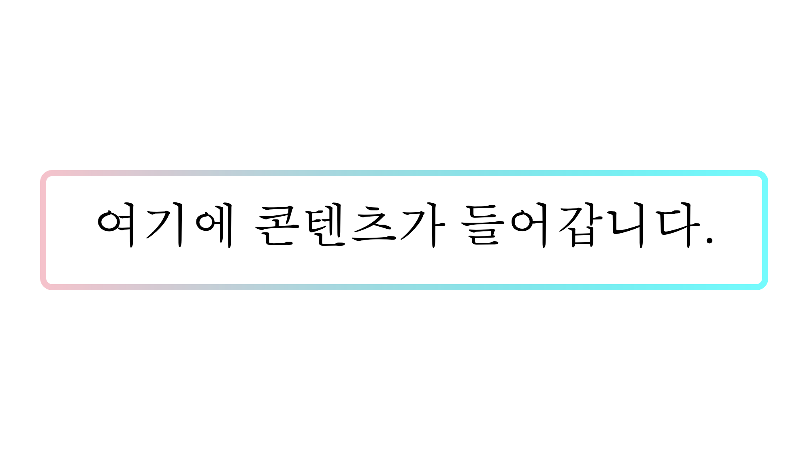

AI 기술을 서비스에 적용하면서 이 같은 스타일의 UI 요소를 자주 접한다. 단색이 아닌 그라데이션으로 테두리을 그리는 방식인데, 마치 AI가 끊임없이 변화하고 있다는 인상을 받았다.

처음엔 '그냥 이미지를 배경에 깔고 그 안에 흰 배경을 가진 요소를 두었겠거니' 싶었다. 최근 회사 코드리뷰 중에 운좋게 구현체를 발견했는데, 궁금증이 풀려 반가웠다.

어떻게 구현했는지 단계적으로 살펴보자.

# 1단계: 간단한 상자

간단한 상자를 하나 만든다.

```css
.gradient-border {
  border: 2px solid #ddd;
  border-radius: 4px;
  padding: 8px 16px;
}
```

- **border** → 테두리 두께, 스타일, 색
- **border-radius** → 모서리를 둥글게
- **padding** → 콘텐츠와 테두리 사이의 간격 (내부 여백)

_결과: 회색 테두리와 내부 여백이 생김._

# 2단계: 그라데이션 배경을 넣고 테두리를 투명으로

[linear-gradient()](https://developer.mozilla.org/ko/docs/Web/CSS/gradient/linear-gradient) 는 두 개 이상의 색이 점진적으로 변화하는 선형 그라데이션을 만드는 함수다.
예를 들어 linear-gradient(red, green) 은 빨간색에서 시작해 초록색으로 변하는 그라데이션을 만들 것이다.

배경 이미지에 linear-gradient() 함수를 이용하면 그라데이션 배경을 연출할 수 있다.

```css{2,5,6}
.gradient-border {
  border: 2px solid transparent;
  border-radius: 4px;
  padding: 8px 16px;
  /* 그라데이션으로 배경이미지 지정 */
  background-image: linear-gradient(to right, pink, cyan);
}
```

- **background-image: linear-gradient()** → 요소 전체에 그라데이션을 배경으로 채움
- **border: transparent** → 테두리를 투명으로 만들어, 컨텐츠와 패딩 영역의 그라데이션 그림을 테두리 영역까지 확장

_결과: 테두리를 포함한 요소 전체가 그라데이션 배경으로 채워짐._

# 3단계: 내부를 흰색으로 덮는 레이어

테두리 영역만 그라데이션을 남기고, 컨텐츠와 패딩 영역은 흰색으로 바꿀 차례다.

background-image는 콤마를 이용해 여러 배경을 지정할 수 있는데, 먼저 지정한 값이 가장 위에서부터 쌓이는 구조다. 이를 이용해 흰 배경을 하나 더 쌓았다.

```css{6-10}
.gradient-border {
  border: 2px solid #ddd;
  border-radius: 4px;
  padding: 8px 16px;
  /* prettier-ignore */
  background-image: 
    /* 위 레이어: 내부를 흰색으로 덮음 */ 
    linear-gradient(white, white),
    /* 아래 레이어: 실제 그라데이션(테두리로 보일 것) */ 
    linear-gradient(to right, pink, cyan);
}
```

- **background-image: linear-gradient(), linear-gradient()** → 첫번째 항목인 흰 색이 가장 위에 그려짐 (그라이데이션을 가림)

_결과: 흰색과 그라데이션 배경 (그라데이션은 아래 가려진 상태)_

# 4단계: 레이어 별로 자르기

두 레이어의 크기가 같아서 가장 위에 있는 흰색 레이어만 노출된 상태이다. 노출된 흰색 레이어의 테두리를 잘라낼 수 있다면, 뒤에 가려진 그라데이션이 그만큼 보일 것이다.

[background-clip](https://developer.mozilla.org/ko/docs/Web/CSS/background-clip) 은 배경을 잘라 크기를 조절하는 속성이다. 배경 이미지를 두 레이어로 지정했듯이, 배경을 자르는 속성도 순서대로 두 레이어에 적용할 수 있다.

```css{6-7}
.gradient-border {
  border: 2px solid #ddd;
  border-radius: 4px;
  padding: 8px 16px;
  background-image: linear-gradient(white, white), linear-gradient(to right, pink, cyan);
  /* 각 배경 레이어에 대한 clip 지정 */
  background-clip: padding-box, border-box;
}
```

- **background-clip: padding-box, border-box** → 맨 위 흰색 레이어를 패딩 영역까지 자름. 뒤에 그라데이션 레이어는 테두리 영역까지 자름

_결과: 그라데이션 경계선_

# 5단계: 그라데이션 미세 조정

[background-origin](https://developer.mozilla.org/en-US/docs/Web/CSS/background-origin)은 배경을 그릴 때 기준 위치를 정하는 속성이다. 기본 값은 padding-box로써, 패딩과 컨텐츠 영역을 기준으로 배경을 그린다.

그라데이션 배경도 이 패딩 박스를 기준으로 그리는데, 그러다보니 노출된 경계선 영역을 만나면 다시 그라데이션을 시작한다. 어색하게 보인다.

```css{8,9}
.gradient-border {
  border: 2px solid #ddd;
  border-radius: 4px;
  padding: 8px 16px;
  background-image: linear-gradient(white, white), linear-gradient(to right, pink, cyan);
  /* 각 배경 레이어에 대한 clip 지정 */
  background-clip: padding-box, border-box;
  /* 배경의 기준을 보더 박스로 설정 */
  background-origin: border-box;
}
```

- **background-origin: border-box** → 테두리, 패딩, 컨텐츠 영역을 기준으로 배경을 그림

background-clip은 어디까지 잘라낼지를 정하고, background-origin은 어디를 기준으로 그릴지를 정하는 속성이다.

_결과: 자연스러운 그라데이션 테두리 완성!_

# 정리

- **기본 박스 만들기**: 테두리와 패딩을 가진 상자를 만든다.
- **그라데이션 배경 입히기**: border를 투명으로 두고, 요소 전체에 linear-gradient()로 배경을 채운다.
- **흰색 레이어 추가하기**: 여러 배경을 겹쳐서, 흰색 배경을 가장 위에 올린다.
- **background-clip으로 자르기**: 흰색 레이어는 패딩 영역까지만, 그라데이션 레이어는 보더 영역까지 남기고 잘라낸다.
- **background-origin으로 기준 맞추기**: 테두리까지 배경을 그리도록 설정해, 자연스러운 그라데이션 경계선을 만든다.

즉, background-image, background-clip, background-origin 세 가지 속성을 조합해 테두리 영역만 남기고 내부는 흰색으로 덮는 기법이다. 덕분에 별도의 이미지 리소스 없이 CSS만으로 구현할 수 있다.

최종 코드는 이렇다.

```css
.gradient-border {
  border: 2px solid #ddd;
  border-radius: 4px;
  padding: 8px 16px;
  /* 그라데이션으로 배경이미지 지정 */
  /* prettier-ignore */
  background-image: 
    /* 위 레이어: 내부를 흰색으로 덮음 */ 
    linear-gradient(white, white),
    /* 아래 레이어: 실제 그라데이션(테두리로 보일 것) */ 
    linear-gradient(to right, pink, cyan);
  /* 각 배경 레이어에 대한 clip 지정 */
  background-clip: padding-box, border-box;
  /* 배경의 기준을 보더 박스로 설정 */
  background-origin: border-box;
}
```

## 참고

- [예제 코드](https://github.com/jeonghwan-kim/jeonghwan-kim.github.io-examples/tree/main/2025-09-11-gradient-border)
