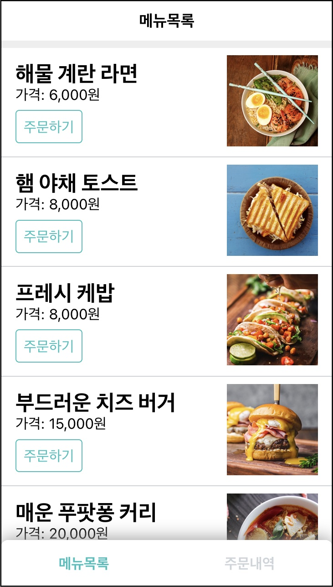
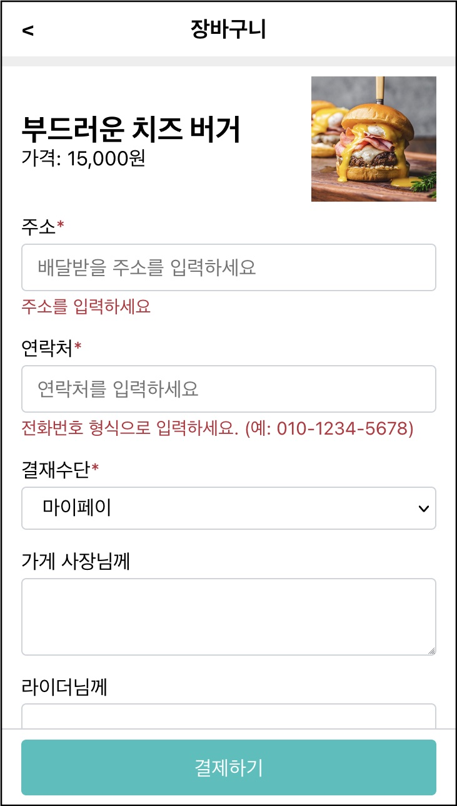
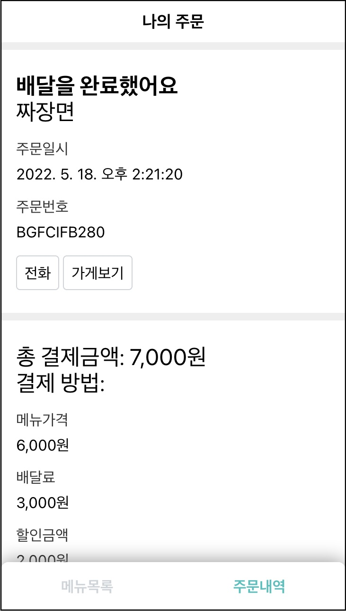
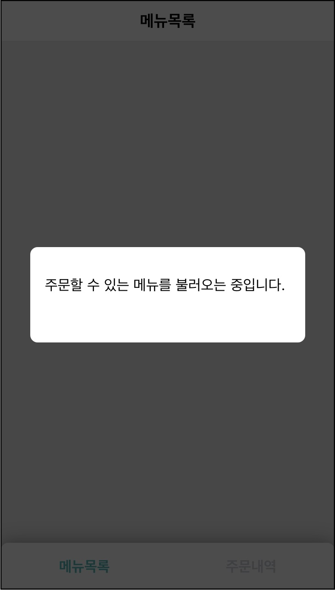

# 1장. 준비

수업을 준비하는 장이다. 1부 내용을 요약해 내용을 떠올리고 2부의 새로운 내용을 소개한다.
이번에도 실습을 다룰 것인데 결과물을 미리 살펴볼 것이다. 실습을 위한 개발 도구를 소개하고 미리 구성한
실습 환경을 살펴볼 것이다. 시작이다. 화이팅!

## 이전 내용(1부) 요약

독자에게 1부 내용이 어땠는지 궁금하다. 인프론에 올린 강의는 수강평과 질문을 통해 수강자들의 반응을 볼 수
있었다. 바닐라 자바스크립트로 개발하고 리액트로 다시 구현하는 커리큘럼이 잘 맞았던 것 같다.
비교하면서 리액트의 역할을 이해할 수 있기 때문일 것이다. 혹은 어려워하시는 분들도 있었는데 그 때마다
안타까운 마음으로 성심껏 도와드리려 했다.

그러한 1부 내용을 다시 떠올려 보자. 소핑몰 검색 화면을 만들면서 리액트의 기본 개념을 익혔다.

**준비편**. 순수 자바스크립트로 화면을 만들었다. 전통적인 MVC 패턴을 이용했다. 리액트의 역할을
이해하기 위해 일부러 이 과정을 마련했다. 의외로 이 편을 어려워하시는 분들이 있었다. 필자의 설명이
부족했기 때문이다. 하지만 리액트가 주제인만큼 후반부에 더 정성들여 설명했다. 순수 자바스크립트편을
온전히 이해할 필요는 없다. 리액트를 소개하는 다음 편부터가 중요하다.

**소개편**. 리액트 개념을 배웠다. 리액티브와 가상돔. 헬로 월드 코드를 뜯어보면서 그 안에서 사용한
라이브러리를 접했다. react, react-dom, babel, jsx 기술을 이해했다.

**사용편1**. 리액트를 이용해 준비편에서 완성한 화면을 다시 만들었다. 순수 자바스크립트로 구현했던
상당 부분을 리액트가 대신해 주었다. 우리는 더 적게 코딩하고 다 안전한 어플리케이션을 만들 수 있었다.
컴포넌트, 상태, 이벤트 처리, 조건부 렌더링, 리스트 렌더링, 컴포넌트 생명주기 메소드 같은 리액트 개념을
이해하고 사용했다.

**사용편2(컴포넌트)**. 전 편에서는 단일 컴포넌트로 화면을 만들었는데 이것을 다시 설계했다. 여러 개의
작은 컴포넌트로 나누고 이들이 서로 협력하도록 했다. 일부 컴포넌트는 재사용했다. 상태 끌어올리기,
컴포넌트 재활용, 조합하는 방식을 이해하고 사용했다.

> 여전히 고급 주제들은 더 학습해야할 대상이다. 컨택스트, 훅 등. 뿐만 아니라 리액트와 함께
> 사용하는 라우터, 전역 상태 관리 솔류션 더나아가 리액트 기반의 웹 프레임워크를 탐구하는 것은 웹 기술을
> 익히는데 큰 도움이 될 것이라고 생각한다. - 1부 마무리 중

1부 끝자락에 숙제를 남겨 두었다. 리액트 고급 주제와 파생 라이브러리를 공부한 것. 바로 2부에서
이 주제를 다룰 것이다.

## 2부에서 다룰 내용

**1편. 고급 주제 1**. <리액트로 사고하는 법>을 소개한다. 1부를 마쳤다고해서 단숨에 컴포넌트
기반으로 개발할 수 있는 것은 아니다. 시도해보면 턱턱 만히는 부분이 있을 것이다. 이것은 리액트 API와
별개의 문제다. 어플리케이션을 위한 컴포넌트 설계 기법을 익혀야 할 수 있는 일이다. 1편에서는
리액트로 사고하는 방법과 컴포넌를 설계할수 있는 역량을 훈련할 것이다.

**2편. 고급 주제 2**. 리액트 문서에서 다루지 않은 고급 주제를 다룬다. <리액트 컨택스트>가 필요한
사례를 정하고 이를 해결하기 위해 컨택스트를 직접 만들어 볼 것이다. 웹 개발에서 라우터의 역할을
소개하고 리액트 위에서 동작하는 라우터를 직접 만들어 볼 것이다. 컴포넌트 로직의 재활용을 위한 기법인
<고차 컴포넌트>에 대해서도 알아볼 것이다. <포탈>. 모든 고급주제를 다룬뒤 샘플 어플리케이션을
완성할 것이다.

**3편. 훅1** 1부를 수강한 만은 분들이 훅을 기대했다. 당시 필자는 훅에 대해 잘 몰랐다. 나름대로
학습하고 정리한뒤 실무에서 사용해본 결과 한 수업에서 다루기에는 비교적 방대한 내용이었다. 앞으로 남은
세 편에 걸쳐 훅을 배우게 될 것이다. 이 편에서는 훅의 등장 배경에 대해 알아본다. <기본 훅>이라고
부르는 세 개 훅을 직접 구현하면서동작 원리를 이해한다.

**4편. 훅2**. // todo useReducer, useCallback, useMemo, useRef, useLayoutEffect

**5편. 훅3**. // todo 훅 사용법, MyRouter, Layout custom hook, MyForm 제어/비제어
컴포넌트 비교, 훅으로 구현한 것과 그렇지 않은 것 비교, 리액트는 왜 훅을 추천하는가?

## 결과물 미리보기

어렵지 않고 그러면서도 지루하지 않을 정도의 실무같은 프로젝트를 찾는 것. 2부 수업을 구상하면서 많이
고민한 부분이다. 그래야 끝까지 완주할 수 있는 수업이 되기 때문이다. 너무 쉬우면 현실성이 없어 보인다.
너무 어려우면 전달력이 부족하다.

> "프로그래밍을 통해 개념과 이론을 배우는 것이 개념과 이론을 통해 프로그래밍을 배우는 것보다 더 훌륭한
> 학습 방법이라고 생각한다. 개념은 지루하고 이론은 따분하다. 개발자는 구체적인 코드를 만지며 손을
> 더럽힐 때 가장 많은 것을 얻어가는 존재다." - 오브젝트 | 조영호 | 위키북스

직접 손을 더렵혀 가며 코드를 만질 때 학습 효과가 크다는 것에 크게 동의한다. 필자도 새로운 기술을 익힐
때는 문서를 읽은 뒤에는 반드시 개발 도구를 열어 문서에 나온 코드를 한땀 한땀 입력한다. 그렇게 얻는
지식이 몸에 베이는 것 같다.

1부에서 다룬 쇼핑몰 검색 페이지처럼 평소에 일하면서 자주 접한 프로젝트와 유사한 것을 생각했다.
어떤 것이 적합할까, 고민하다가 가까운 곧에서 답을 찾았다. 배달 앱의 주요 화면을 만들어 볼 것이다.
필자가 일하는 곳이 배달 플래폼을 만드는 국내 기업이기 때문이다.

결과물 스크린샷 이미지를 하나씩 살펴 보자.

**메뉴 목록 화면**. 주문할 수 있는 상품 목록을 조회하는 화면이다. 화면 상단에 화면 제목("메뉴목록")을
표시한다. 화면 중간은 주문할 수 있는 메뉴 목록이 보여준다. 화면 하단에는 네비게이션 버튼이 위치하고
이리저리 화면을 이동할 수 있다.

주문하기 버튼을 클릭하면 해당 상품을 들고 장바구니 화면으로 이동할 것이다.

장바구니 화면. 선택한 상품을 담은 장바구니 화면이다. 화면 상단 제목을 "장바구니"로 변경한다. 좌측에
뒤로가기 버튼을 클릭하면 이전 화면(메뉴 목록)으로 이동할 것이다. 화면 중간은 선택한 상품을 보여준다.
그 아래 사용자가 주문 정보를 입력할 수 있게끔 입력 폼을 제공한다. 화면 하단에는 결제하기 버튼이 있고
클릭하면 결제할 것이다.

성공하면 주문내역 화면으로 이동할 것이다.

**주문내역 화면**. 결제 뒤 주문 상세 내역을 조회하는 화면이다. 화면 상단 제목이 '나의 주문'으로
변경되었다. 화면 중간에는 결재한 주문 정보를 표시한다. 주문 상태, 주문 금액, 주문자 정보가 카트
형식으로 표시된다. 하단에는 네비게이션 버튼이 위치해 주문 내역으로 이동할 수 있다.

주요 화면과 함께 팝업 UI도 있다.

**팝업**. 특정 메세지를 보여주기 위한 팝업이다. 여기서는 api 호출 도중 이를 로딩중임을 알리기
위한 UI로 사용할 것이다.

**경고 팝업**. 사용자에게 알릴(alert) 용도의 팝업이다.

**확인 팝업**. 사용자의 확인(Confirm)을 받기위한 확인 팝업이다.

모양은 배달 어플리케이션이지만 넓게 보면 커머스 제품의 일반적인 UI라고 할 수 있다.

어플리케이션의 움직이는 모습을 영상으로 참고하자.
// todo (링크: 유투브)

이러한 디자인을 바탕으로 만든 요구사항 문서도 있다. 가볍게 훑어보고 지나가자.
// todo 링크

## 실습환경 구성

개발 도구

- node 특정 버전: 워크스페이스 지원하는 버전. 여러개 노드를 사용한다면 nvm을 고려하자.
- 에디터: vscode
- 브라우져: firefox, chrome. 저자가 테스트한 것은 파이어폭스와 크롬이다.

최소한의 환경을 만든다.

<웹팩> 설정 코드를 보자.

1부에 비해 달라진 설정. 웹팩 5.

- webpack serve: webpack-dev-server 설치만. (이러면 뭐가 좋지?)
- ouptut.clean: clean-webpack-plugin 안써도 돼

(참고: 웹팩 빌드시 이전 결과물을 삭제하는 옵션 | 김정환블로그)

<바벨> 설정 코드도 보자.

@babel/preset-react: { "runtime": "automatic" } 리액트 17부터는 jsx 코드 사용시 react 임포드 구문 없어도 됨. 은근히 편하다.

<모노 레포> 설정도 보자. 두 개 프로젝트를 한다. 노드 모듈(node_modules)을 최소한으로 설치하기 위함. 버전관리를 하나로 하기 위함.

(참고: NPM 워크스페이스와 모노레포 | 김정환블로그)

pacakge.json에 보면 workspace 가 있다.

실행하는 방법은 npm start --workspace 1-react / npm start -w 1-react / npm run 1-react

## 중간 정리

1부처럼 강의 내내 다룰 실습을 소개했다. 배달 어플리케이션의 주요 화면을 리액트로 만들어 보는 것이다.
흥미가 생겼으면 하는 바램이다. 다음 장에서는 리액트로 사고하는 법에 대해 알아보고 각 화면을 리액트로
만들어 보는 실습을 할 것이다.
