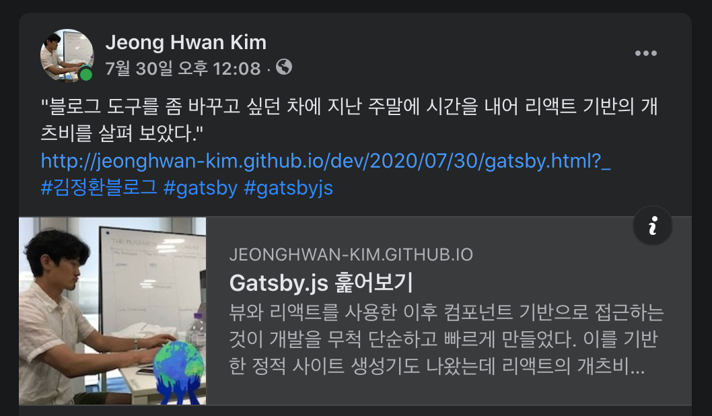

Gatsby.js 프로젝트를 보면서 [react-helmet](https://github.com/nfl/react-helmet)을 발견했다.
개발 용어로 "헬멧"이라는 단어는 친숙한데 노드의 웹 프레임워크인 익스프레스에서 본 기억이 있다.
보안과 관련된 미들웨어인데 헬멧이라는 이름처럼 웹 어플리케이션을 안전하게 지켜 주는 그런 도구로 알고 있다.

그런데 react-helmet도 비슷한 것인가하고 휙 지나쳤더니 전혀 아니더라.
웹 문서의 헤더 값을 변경할 때 사용하는 리액트 컴포넌트이다.
헬멧을 머리에 쓰는 것처럼 문서의 머리(head)를 관리 한다고 해서 그렇게 이름 짓지 않았는가 싶다.

이번에 블로그를 개츠비로 옮기면서 이 라이브러리를 사용했는데 비교적 수월하게 헤더 정보를 관리할 수 있었다.
기존에는 템플릿 문법으로 문서 헤더를 관리했던 것(지킬을 사용했다)을 리액트 컴포넌트 방식으로 변경한 것이 차이점이다.
간단히 이 도구에 대해 정리해 보자.

# 필요한 경우

헤더를 변경해야 하는 경우는 언제일가?
리액트나 뷰로 개발할 때 보통은 마운트 된 `<body>` 태그 안의 특정 요소에서만 작업하기 때문에 이것에 대해 신경쓸 일이 별로 없었다.
그리고 이미 서버에서 헤더값을 계산해 브라우져로 내려주었기 때문에 관리할 필요도 없었고.

## 문서 타이틀을 변경할 때

싱글 페이지 어플리케이션은 화면을 이동할 때마다 페이지를 요청하는 것이 아니다.
그렇기 때문에 문서의 타이틀은 맨 처음 서버에서 받은 값을 사용한다.
브라우저 단에서 라우팅이 변경되어도 이 값은 변함없이 유지된다.
화면 이동에 따라 타이틀을 변경하려면 헤더를 동적으로 변경해야만 하는데 이 때 document.title 을 사용해서 헤더를 변경한다.

## 소셜 서비스에 포스팅 할 때

페이스북이나 트위터에 페이지 링크를 공유할 때 공유할 페이지의 썸네일과 타이틀을 조합해 이쁜 포스팅을 만들어 주는 경우가 있다.




소셜 서비스는 공유할 링크의 og 태그 값을 가져와 각 플래폼에 맞는 컨텐츠를 작성한다.
og 태그는 헤더 안에 위치하는 메타 태그로 작성한다.

```html
<head>
  <meta property="og:title" content="Gatsby.js 훑어보기" />
</head>
```

웹 사이트를 소셜 서비스에 공유하기 위해서는 헤더값을 관리해야 할 필요가 있다.

## 검색엔진 최적화가 필요할 때

검색엔진은 문서 전체를 읽기 때문에 적절한 헤더 관리가 필요하다.
내 경우에는 구글 검색결과에 날짜를 표시하기 위해서 몇 가지 정보를 헤더에 담았다.

```html
<head>
  <meta name="article:published_time" content="2020-08-15T00:00:00.000Z" />
  <script type="application/ld+json">
    {
      "@context": "http://schema.org",
      "@type": "BlogPosting",
      "datePublished": "2020-08-15T00:00:00.000Z",
      "dateModified": "2020-08-15T00:00:00.000Z"
    }
  </script>
</head>
```

검색 엔진은 이러한 메타 정보를 수집하여 검색 결과에 보여주는데 SEO 관점에서 보더라도 헤더값 관리가 필요하다.

# 사용방법

그럼 react-helmet으로 어떻게 헤더 값을 관리할 수 있을까?

라이브러리는 리액트 프레임웍에서 사용할 수 있도록 <Helmet> 컴포넌트를 제공한다.
렌더 함수에서 이 컴포넌트를 사용해서 헤더값을 설정할 수 있다.

```tsx
import { Helmet } from "react-helmet"

const SEO = () => {
  return <Helmet title="타이틀" />
}
```

프롭스로 전달하는 방식 뿐만 아니라 자식 컴포넌트로 설정하는 방법도 있다.

```tsx
<Helmet>
  <title>타이틀</title>
</Helmet>
```

지킬을 사용했던 경험과 비교해 보면 리액트 컴포넌트 방식으로 사용하기 때문에 리액트 프로젝트에서는 일관적으로 코드를 관리할 수 있다는 것이 이 라이브러리의 장점이다.

# 동작 원리

<Helmet> 컴포넌트를 렌더 함수에 선언했다는 것은 리액트 어플리케이션이 마운트된 곳에 자식으로 그려질 것이라 기대할 수 있다.
리액트가 그렇게 동작하기 때문이다.

하지만 헤더는 문서의 body가 아닌 head 영역에 있다.
어떻게 이런 결과가 나오는 것일까?

react-helmet은 DOM API를 사용해서 직접 헤더를 변경하는 방식이다([참고](https://github.com/nfl/react-helmet/blob/master/src/HelmetUtils.js#L372)).

```ts
const updateTitle = (title, attributes) => {
  // DOM 객체의  title 속성을 직접 변경한다(이해를 위해 코드를 라이브러리 코드를 변형함).
  document.title = title
}
```

싱글 페이지 어플리케이션을 개발할 때 타이틀 정보를 자바스크립트로 변경하려고 document.title을 직접 설정했던 기억이 있다.
그땐 이렇게 하는게 맞아? 라고 생각하면서 만들었는데 이 방식이 잘 동작하는건가 보다.

메타 태그도 DOM API를 사용해서 변경한다.

head 안에 있는 메타 태그도 문서의 일부분이라서 때문에 DOM API로 접근할 수 있다.
적절한 셀렉터로 돔에 접근한 다음 속성값을 변경하는 방식을 사용한다.

```ts
const ogTitle = document.querySelector('meta[property="og:title"]')
ogTitle.getAttribute("conetnt") // null
ogTitle.setAttribute("content", "SNS에 공유할 타이틀 입니다")
```

# 크롤러가 읽을 수 있을까?

기본적으로 크롤러는 html 문서를 읽는다고 알고 있다.
문서를 로딩한 뒤에 자바스크립트가 실행되는데 이 때 변경되는 문서 내용은 크롤러마다 다르게 해석한다.
그렇기 때문에 검색 엔진 최적화를 하려면 항상 서버 사이드에서 만든 문서에 크롤러에게 노출할 내용을 담아야 한다.

그런데 게츠비를 보면 react-helmet을 직접 사용하고 있더라.
그래서 페이스북, 트위터, 구글이 react-helmet이 만들어 내는 헤더값에 어떻게 반응하는지 실험해 봤다.

먼저 포스팅을 위한 og 태그를 몇 개 등록한다.

```tsx
<Helmet
  meta={[
    { property: "og:title", content: "타이틀" },
    { property: "og:description", content: "포스트의 설명입니다." },
    { property: "og:image", content: "// 이미지 주소" },

    { name: "twitter:card", content: "summary" },
  ]}
/>
```

**페이스북**은 포스트 작성시에는 데이터를 가져오지 못하다가 포스트를 등록하고 나면 og 태그에 있는 값을 이용해 공유할 링크의 og 태그를 가져왔다.
아마도 크롤러가 자바스크립트까지 실행한 뒤에 데이터를 가져가는 듯 싶다.

반면 **트위터**는 아무것도 가져오지 못했다.

**구글 검색**은 react-helmet으로 만들 데이터를 가져오지 못한다는 이슈가 등록되어 있다([Googlebot not crawling React Helmet title and meta description on homepage](https://github.com/nfl/react-helmet/issues/377)).

그럼 게츠비는 react-helmet을 어떻게 사용하고 있는걸까?

게츠비는 플러그인으로 기능을 확장할 수 있는데 [gatsby-plugin-react-helmet](https://www.gatsbyjs.com/plugins/gatsby-plugin-react-helmet/)이 게츠비가 정적 파일을 빌드할때 react-helmet의 내용을 여기에 넣는 역할을 한다.

- react-helmet: 동적으로 헤더값 설정
- gatsby-plugin-react-helmet: 정적파일 빌드시 헤더값 설정

실제로 개츠비 개발 서버에 접속하면 react-helmet이 동적으로 값을 변경한다.
브라우져의 자바스크립트 기능을 비활성화하면 헤더값이 설정되지 않는다.
동작 하더라도 동적으로 삽입되는 것이기 때문에 head 영역 최 하단에 추가된다.

반면 빌드하고 나면 생성되는 html 파일에는 react-helmet으로 설정했던 헤더 값이 고스란이 포함되어 있다.
이렇게 할 수 있는 이유는 react-helmet이 서버사이드 렌더링을 지원하기 때문이다.
더불어 gatsby-plugin-react-helmet이 이 기능을 활성화 한다.

# 결론

주로 어드민을 만들어서 그런지 검색엔진이나 소셜 서비스 공유를 고려한 개발 경험이 부족하다.
B2C 서비스를 만들려면 이러한 기능이 서비스의 중요한 부분일 것이라고 생각한다.
검색엔진에 노출되고 소셜 서비스에 충분한 정보가 노출 되어야 고객을 찾을 수 있기 때문이다.

간단히 타이틀 정도만 바꿔서 유저에게 보여줄 정도라면 react-helmet을 바로 사용해도 되겠다.
그렇지만 크롤러에게도 읽히는 사이트가 되려면 서버사이드 렌더링이 필요하다.

혹시나 해서 Vue.js 쪽에도 찾아봤다. [vue-meta](https://github.com/nuxt/vue-meta)라는 라이브러리가 있었고 컴포넌트 방식의 react-helmet과는 달리
설정 객체를 전달하는 것 같다. 기회가 되면 더 자세히 봐야겠다.
