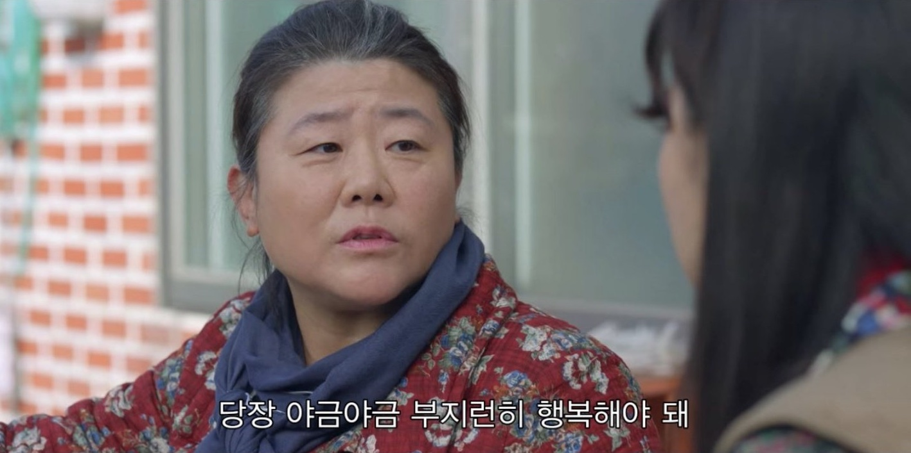

하루 목표 중 하나가 조깅이다.
웬만하면 아침에 뛰려고 하지만 못할 때는 저녁에라도 뛴다.
컨디션 조절 때문인데 조깅을 할 때와 그렇지 않을 때 느끼는 기분은 아주 딴판이다.
'행복하기 위해 조깅한다'라고 말할 수 있을 만큼 내게는 중요한 일과 중 하나다.

행복하게 만드는 요소 중에 또 하나는 글쓰기다.
생각을 정리해 글로 옮기는 과정이 다소 귀찮은 게 사실이지만 어쨌든 글을 하나 완성하고 나면 머릿속이 가벼워지는 기분이 든다.
홀가분 해지는 기분이 좋다.
매주 정기적으로 글을 발행하려는 이유도 이 때문이다

코로나 19로 인해 조깅은 이제 불가능하다.
혹자는 마스크를 착용하고 뛴다지만 난 못하겠더라.
계속 집에만 있다 보니까 좀 울적하고 체중도 불어난다.

올해부터는 육아도 시작했다.
경험해 본 사람들은 알겠지만, 글을 쓸 수 있는 집중 시간을 확보하는 것이 말처럼 쉽지 않다.
'새벽이나 밤늦게 쓰면 되지'라고 생각했지만 이게 정말 안된다.
약간의 패배감을 느낀다.
글감도 잘 떠오르지 않는다.

며칠 전 트위터에서 발견한 짤이다.
좋아하는 배우이기도 하고 대사 내용이 뭔가 마음에 와닿았다.
어떤 것을 기다리기보다는 지금 당장 조금씩 행복을 찾으라는 얘기 같았다.

이걸 보고 행동의 변화가 있었던 것은 아니지만 요즘의 울적한 기분을 떨쳐 버리고 자신감을 얻기 위해 몇 가지 변화한 것이 있다.
**목표를 낮추는 것**.
반복적으로 목표를 달성하지 못하면 단념하고 그만두게 된다.
하지만 목표를 낮추고 좀 쉽게 성취하면 아무것도 안 하는 것보다 낮기 때문이다.

밖에서 조깅할 수 없는 요즘엔 집에서 운동한다.
시간 날 때마다 요가 매트를 펴거나 덤벨을 들고 땀이 날 때까지 근육을 움직인다.
이게 밖에서 조깅하는 것만큼의 만족도는 없지만 아무것도 하지 않는것 보다야 낫다.
10분이라도 근육을 움직이고 나면 기분이 확 달라진 것을 느낀다.

한두 시간은 집중해야 초안을 작성할 수 있었는데 이제는 불가능한 일이다.
아예 30분 미만으로 목표를 설정해서 집중한다.
물론 깊이 있게 생각하기에는 좀 부족하다.
아이가 우니깐.
하지만 이렇게라도 하다 보면 담쟁이가 커가듯 글이 조금씩 쓰이더라.

올해는 코로나 19로 어려운 시기였다.
이제 백신도 나오기 시작했고 언젠가는 밖에서 뛸 수 있는 날이 오지 않을까?
아이도 한두 해 크다 보면 나만의 시간이 생기지 않을까 기대해 본다.
